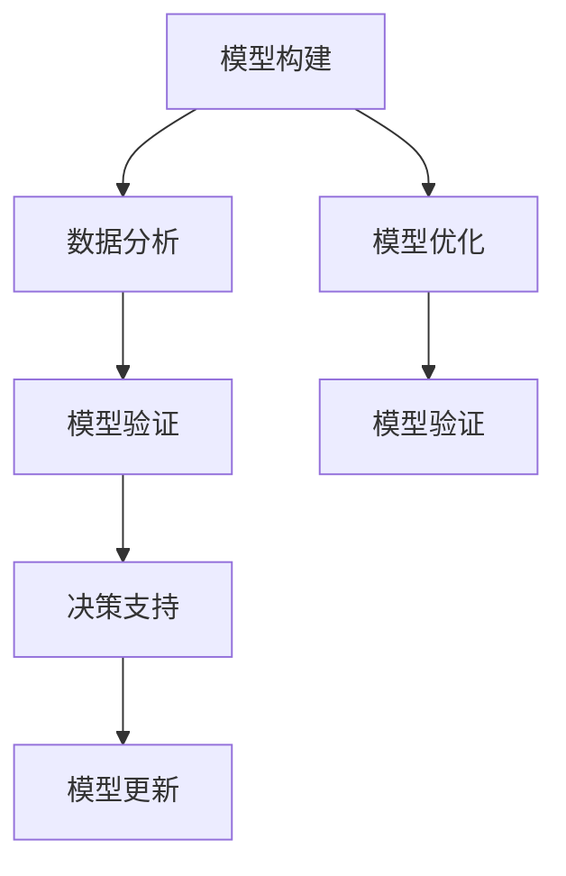

                 

# 模型思维在管理培训中的运用

在当今复杂多变的世界中，管理培训已经成为企业发展的关键。随着技术的飞速发展，模型思维（Model Thinking）作为一项强大的工具，正在日益显现出其在管理培训中的重要作用。本文将从背景介绍、核心概念与联系、核心算法原理与操作步骤、数学模型与公式、项目实践、实际应用场景、工具与资源推荐、总结与未来展望、常见问题与解答等多个维度，深入探讨模型思维在管理培训中的应用。

## 1. 背景介绍

### 1.1 问题由来
在传统的管理培训中，常常依赖于经验和案例分析，缺乏系统化的理论支持。而随着数据科学和人工智能的兴起，模型思维的引入使得管理培训能够更加科学、系统地进行。通过模型思维，学员能够更加深入理解问题的本质，提高解决实际问题的能力。

### 1.2 问题核心关键点
模型思维的核心在于利用数学模型和统计模型来理解和分析现实世界中的复杂现象。其在管理培训中的应用主要体现在以下几个方面：
- **模型构建**：选择合适的数学模型来描述和管理现实中的复杂问题。
- **数据分析**：通过收集和分析数据，构建和优化模型。
- **决策支持**：利用模型预测和优化管理决策。

## 2. 核心概念与联系

### 2.1 核心概念概述

为了更好地理解模型思维在管理培训中的应用，本节将介绍几个关键概念：

- **模型构建**：选择合适的数学模型来描述和管理现实中的复杂问题。
- **数据分析**：通过收集和分析数据，构建和优化模型。
- **决策支持**：利用模型预测和优化管理决策。
- **模型验证**：通过实际数据验证模型的准确性和可靠性。
- **模型更新**：根据新数据和反馈，不断优化和更新模型。

这些概念共同构成了模型思维的核心框架，使得管理培训能够更加系统化和科学化地进行。

### 2.2 核心概念原理和架构的 Mermaid 流程图



这个流程图展示了模型思维在管理培训中的应用流程：首先，构建合适的模型；然后，通过数据分析优化模型；接着，使用模型进行决策支持；最后，根据实际数据和反馈更新模型。

## 3. 核心算法原理 & 具体操作步骤

### 3.1 算法原理概述

模型思维在管理培训中的应用，主要依赖于统计模型和数学模型的建立和应用。通过构建合适的数学模型，利用数据分析来优化模型，最终将模型应用于实际决策中，从而支持管理决策的制定和优化。

以回归模型为例，其基本原理是通过收集历史数据，构建一个或多个自变量与因变量之间的数学关系，预测未来趋势或结果。在管理培训中，可以通过构建回归模型，帮助学员理解和管理复杂的业务问题。

### 3.2 算法步骤详解

#### 3.2.1 数据收集与预处理

- 收集与问题相关的历史数据，包括自变量和因变量。
- 对数据进行清洗、处理和转换，确保数据的准确性和完整性。
- 进行特征工程，提取和选择对问题有影响的特征。

#### 3.2.2 模型构建与训练

- 选择合适的数学模型（如线性回归、逻辑回归等）来描述自变量与因变量之间的关系。
- 使用历史数据训练模型，调整模型参数以优化模型性能。
- 进行模型验证，确保模型在未见过的数据上也能准确预测。

#### 3.2.3 模型应用与优化

- 将训练好的模型应用于实际问题中，进行预测和优化。
- 根据实际结果，调整模型参数和算法，不断优化模型性能。
- 进行模型更新，引入新数据和新特征，持续优化模型。

### 3.3 算法优缺点

#### 3.3.1 优点

- **系统化**：模型思维提供了一种系统化的方法来理解和分析复杂问题，避免依赖经验和主观判断。
- **数据驱动**：通过数据分析和优化，模型能够提供基于数据的决策支持，提高决策的准确性。
- **可解释性**：数学模型提供了明确的决策逻辑，有助于理解和解释决策过程。

#### 3.3.2 缺点

- **复杂性**：构建和优化模型需要一定的数学和统计知识，对学员有一定要求。
- **数据依赖**：模型的效果依赖于数据的质量和数量，数据不足或质量差时，模型性能会受到影响。
- **适应性**：模型需要不断更新和优化，以适应新数据和新变化。

### 3.4 算法应用领域

模型思维在管理培训中的应用广泛，涉及多个领域，包括但不限于：

- **财务分析**：构建回归模型，预测销售额、成本等财务指标。
- **市场预测**：利用时间序列模型，预测市场需求、客户行为等。
- **运营管理**：建立优化模型，优化生产流程、库存管理等。
- **人力资源管理**：构建回归模型，预测员工流失率、绩效等。

## 4. 数学模型和公式 & 详细讲解 & 举例说明

### 4.1 数学模型构建

在管理培训中，常见的数学模型包括回归模型、时间序列模型、决策树等。以线性回归模型为例，其基本形式为：

$$ y = \beta_0 + \beta_1 x_1 + \beta_2 x_2 + \ldots + \beta_k x_k + \epsilon $$

其中，$y$ 为因变量，$x_i$ 为自变量，$\beta_i$ 为回归系数，$\epsilon$ 为误差项。

### 4.2 公式推导过程

以线性回归模型为例，其最小二乘估计的参数求解公式为：

$$ \hat{\beta} = (X^T X)^{-1} X^T y $$

其中，$X$ 为自变量矩阵，$y$ 为因变量向量。

### 4.3 案例分析与讲解

假设某公司希望预测未来几个季度的销售额。公司收集了过去几年的销售数据和相关因素数据（如广告支出、市场趋势等），构建了线性回归模型。通过最小二乘法估计模型参数，并使用预测结果进行销售预测。

## 5. 项目实践：代码实例和详细解释说明

### 5.1 开发环境搭建

要进行模型思维在管理培训中的实践，首先需要搭建好开发环境。以下是使用Python进行项目开发的简单步骤：

1. 安装Python：确保Python 3.6或以上版本已经安装。
2. 安装必要的库：安装NumPy、Pandas、Scikit-learn等常用库。
3. 数据准备：准备所需的数据集，并进行预处理。

### 5.2 源代码详细实现

以下是使用Python进行线性回归模型训练和预测的代码实现：

```python
import numpy as np
import pandas as pd
from sklearn.linear_model import LinearRegression

# 读取数据集
data = pd.read_csv('sales_data.csv')

# 数据预处理
X = data[['ad_spending', 'market_trend']]  # 自变量
y = data['sales']  # 因变量

# 模型构建与训练
model = LinearRegression()
model.fit(X, y)

# 预测未来销售额
future_data = pd.DataFrame({
    'ad_spending': [1000, 1500, 2000],
    'market_trend': [0.2, 0.3, 0.4]
})
future_y_pred = model.predict(future_data)
print(future_y_pred)
```

### 5.3 代码解读与分析

**数据预处理**：
- 使用Pandas读取数据集。
- 对数据进行简单的预处理，提取自变量和因变量。

**模型构建与训练**：
- 使用Scikit-learn库中的LinearRegression类构建线性回归模型。
- 调用`fit`方法进行模型训练，通过历史数据估计模型参数。

**模型应用与预测**：
- 构建新的数据集，包括未来的广告支出和市场趋势。
- 使用`predict`方法进行预测，得到未来销售额的预测值。

### 5.4 运行结果展示

通过上述代码，可以得到未来几个季度的销售预测结果，具体数值可根据实际情况进行调整和优化。

## 6. 实际应用场景

### 6.1 金融风险管理

在金融行业，模型思维被广泛用于风险管理。通过构建和优化金融风险模型，金融机构可以更好地预测和控制风险，保障资金安全和稳健经营。

#### 6.1.1 案例

某银行利用模型思维，构建了信用评分模型，用于评估客户的信用风险。该模型基于历史数据，考虑了客户的收入、负债、还款记录等因素，并进行了模型优化和验证。通过该模型，银行能够更准确地评估客户的信用等级，优化贷款审批流程。

### 6.2 运营效率优化

在制造和物流行业，模型思维被用于运营效率优化。通过构建和优化生产流程模型，企业可以更好地规划生产计划，降低成本，提高生产效率。

#### 6.2.1 案例

某制造企业利用模型思维，构建了生产计划优化模型。该模型考虑了生产线的产能、设备状态、市场需求等因素，并进行了模型优化和验证。通过该模型，企业能够更科学地制定生产计划，提高生产效率和产品交付速度。

### 6.3 客户关系管理

在市场营销和客户服务领域，模型思维被用于客户关系管理。通过构建和优化客户关系模型，企业可以更好地预测客户行为，提升客户满意度和忠诚度。

#### 6.3.1 案例

某电商平台利用模型思维，构建了客户行为预测模型。该模型基于历史交易数据和客户行为数据，考虑了客户的购买频率、购买金额、浏览记录等因素，并进行了模型优化和验证。通过该模型，平台能够更准确地预测客户的购买意向，优化产品推荐和营销策略。

### 6.4 未来应用展望

随着数据科学和人工智能的不断发展，模型思维在管理培训中的应用将更加广泛和深入。未来，模型思维将在以下几个方面得到进一步应用：

- **多变量分析**：构建更加复杂的数学模型，考虑多个自变量和因变量之间的关系。
- **机器学习**：结合机器学习技术，构建更智能的预测和优化模型。
- **实时数据**：利用实时数据流，构建实时预测和优化模型。
- **跨领域应用**：将模型思维应用于更多领域，如医疗、农业等，解决更多复杂问题。

## 7. 工具和资源推荐

### 7.1 学习资源推荐

为了帮助管理者掌握模型思维，以下是一些优质的学习资源：

1. **《数据科学导论》**：该书系统介绍了数据科学的基本概念和常用方法，适合初学者入门。
2. **Coursera《机器学习》**：由斯坦福大学提供的机器学习课程，讲解了机器学习的基本原理和算法。
3. **Kaggle**：数据科学竞赛平台，提供大量实际数据集和模型训练案例，有助于实践应用。
4. **GitHub**：代码托管平台，提供大量开源模型和项目，可以参考和借鉴。

### 7.2 开发工具推荐

要进行模型思维在管理培训中的应用，需要一些强大的开发工具：

1. **Python**：广泛使用的编程语言，支持丰富的数据分析和机器学习库。
2. **Jupyter Notebook**：交互式开发环境，支持代码运行和结果展示。
3. **R**：专门用于统计分析的编程语言，支持多种数学模型和统计分析方法。
4. **MATLAB**：数学计算和数据分析工具，支持高效的模型构建和优化。

### 7.3 相关论文推荐

以下是几篇经典的研究论文，推荐阅读：

1. **《线性回归模型》**：经典统计学教材，详细介绍了线性回归模型的原理和应用。
2. **《时间序列分析》**：经典统计学教材，详细介绍了时间序列模型的原理和应用。
3. **《机器学习》**：经典机器学习教材，详细介绍了机器学习的基本原理和算法。
4. **《数据分析与决策建模》**：系统介绍数据分析和决策建模的常用方法和工具。

## 8. 总结：未来发展趋势与挑战

### 8.1 研究成果总结

模型思维在管理培训中的应用，已经成为提升管理水平和业务绩效的重要手段。通过构建和优化数学模型，管理者能够更加科学地理解和解决问题，提高决策的准确性和效率。

### 8.2 未来发展趋势

未来，模型思维将在以下几个方面得到进一步发展：

- **模型自动化**：利用自动化工具，简化模型构建和优化的流程，降低人工干预。
- **多模态模型**：结合多种数据类型（如文本、图像、视频等），构建更加全面的模型。
- **深度学习**：利用深度学习技术，构建更加复杂的预测和优化模型。
- **实时数据流**：利用实时数据流，构建实时预测和优化模型。

### 8.3 面临的挑战

尽管模型思维在管理培训中的应用前景广阔，但仍面临一些挑战：

- **数据质量**：数据质量和完整性直接影响模型的准确性，需要保证数据的质量和一致性。
- **模型复杂性**：构建复杂的数学模型需要较高的数学和统计知识，需要一定的学习成本。
- **模型解释性**：模型黑箱化的问题需要得到解决，提高模型的可解释性。
- **模型维护**：模型需要持续维护和更新，以保证其准确性和时效性。

### 8.4 研究展望

未来，模型思维在管理培训中的应用需要从以下几个方面进行研究：

- **模型自动化**：利用自动化工具，简化模型构建和优化的流程，降低人工干预。
- **多模态模型**：结合多种数据类型（如文本、图像、视频等），构建更加全面的模型。
- **深度学习**：利用深度学习技术，构建更加复杂的预测和优化模型。
- **实时数据流**：利用实时数据流，构建实时预测和优化模型。

## 9. 附录：常见问题与解答

**Q1：模型思维在管理培训中的应用有哪些局限性？**

A: 模型思维在管理培训中的应用虽然具有显著优势，但也存在一些局限性：
- **数据依赖**：模型的效果依赖于数据的质量和数量，数据不足或质量差时，模型性能会受到影响。
- **模型复杂性**：构建复杂的数学模型需要较高的数学和统计知识，需要一定的学习成本。
- **模型解释性**：模型黑箱化的问题需要得到解决，提高模型的可解释性。

**Q2：模型思维在管理培训中如何结合实际业务场景？**

A: 模型思维在管理培训中的应用需要紧密结合实际业务场景：
- **问题定义**：明确业务问题，选择合适的数学模型进行建模。
- **数据收集**：收集和准备数据，确保数据的质量和完整性。
- **模型构建**：选择合适的数学模型，进行模型构建和训练。
- **模型验证**：使用实际数据验证模型的准确性和可靠性。
- **模型应用**：将训练好的模型应用于实际业务场景，进行决策支持和优化。

**Q3：如何提高模型思维在管理培训中的效果？**

A: 提高模型思维在管理培训中的效果，可以从以下几个方面进行改进：
- **数据质量**：提高数据的质量和完整性，确保数据的一致性和准确性。
- **模型优化**：选择合适的数学模型，进行模型优化和调整，提高模型的准确性和鲁棒性。
- **模型解释性**：提高模型的可解释性，便于理解和解释模型决策过程。
- **模型维护**：定期更新和维护模型，确保其准确性和时效性。

总之，模型思维在管理培训中的应用，需要结合实际业务场景，利用数据和模型技术，不断优化和提升模型的性能和效果。通过科学的方法和工具，模型思维将成为企业管理决策的重要支撑。

