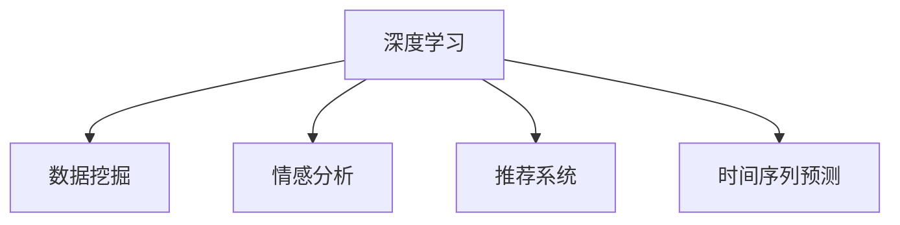

                 

# 欲望预测：AI时代的市场研究

> 关键词：欲望预测,市场研究,人工智能,深度学习,数据挖掘,消费行为分析,情感分析,推荐系统,预测模型

## 1. 背景介绍

### 1.1 问题由来
随着消费市场的快速发展，企业越来越关注如何精准把握消费者需求，提升营销效率。传统的市场调研方法往往成本高、周期长，且结果存在较大的不确定性。而人工智能和大数据技术的发展，使得市场研究可以更快、更准确、更自动化地完成，从而为市场决策提供有力的数据支持。

欲望预测作为市场研究的重要分支，通过分析消费者的行为数据、历史交易记录、社交媒体信息等，预测其潜在需求，为企业提供关键的营销和产品决策依据。人工智能，特别是深度学习和数据挖掘技术，为欲望预测提供了强有力的技术支持，帮助企业更好地理解消费者，优化营销策略，提升市场份额。

### 1.2 问题核心关键点
欲望预测的核心在于利用机器学习模型，从海量数据中挖掘出消费者潜在的需求，并以动态的方式实时更新模型，确保预测结果的准确性。具体来说，主要包括以下几个方面：

- **数据收集与处理**：获取和清洗消费者的行为数据、交易记录、社交媒体信息等。
- **特征工程**：设计合适的特征集，提取有效的特征信息，供模型进行学习和预测。
- **模型选择与优化**：选择合适的深度学习模型，并对模型进行调参和优化，提升预测准确度。
- **结果解释与验证**：分析模型的输出结果，并结合实际业务需求进行验证，确保预测结果的可靠性和实用性。

## 2. 核心概念与联系

### 2.1 核心概念概述

为更好地理解欲望预测的技术原理和实现步骤，本节将介绍几个密切相关的核心概念：

- **深度学习(Deep Learning)**：一种基于多层神经网络的机器学习技术，具有强大的数据处理和模式识别能力，适合处理复杂的非线性关系。
- **数据挖掘(Data Mining)**：从原始数据中自动发现有用信息和知识的过程，是欲望预测的基础。
- **情感分析(Sentiment Analysis)**：通过文本挖掘技术，分析消费者的情感倾向，用于理解消费者的心理状态和潜在需求。
- **推荐系统(Recommender System)**：基于用户历史行为和物品特征，推荐用户可能感兴趣的产品或内容，是欲望预测的重要应用场景。
- **时间序列预测(Time Series Prediction)**：预测时间序列数据未来的值，用于描述消费者行为随时间的变化趋势。

这些核心概念之间的逻辑关系可以通过以下Mermaid流程图来展示：



这个流程图展示了几大核心概念及其之间的关系：

1. 深度学习是处理数据和模式识别的核心工具，广泛用于情感分析和推荐系统等。
2. 数据挖掘是深度学习的基础，提供原始数据和特征集，用于训练和优化模型。
3. 情感分析通过文本挖掘，获取消费者情感信息，辅助理解消费者的需求和心理。
4. 推荐系统利用深度学习预测用户可能感兴趣的商品或内容，提升用户体验和转化率。
5. 时间序列预测通过分析消费者行为随时间变化的模式，预测未来的消费趋势。

这些核心概念共同构成了欲望预测的技术框架，使其能够更好地理解消费者需求，提升市场决策的准确性和效率。

## 3. 核心算法原理 & 具体操作步骤
### 3.1 算法原理概述

欲望预测的核心是利用深度学习模型从数据中挖掘出消费者潜在的购买欲望，并预测其未来的购买行为。常用的方法包括序列模型、注意力机制、卷积神经网络等。

以序列模型为例，假设消费者行为数据可以用时间序列 $X_t = \{x_1, x_2, ..., x_t\}$ 表示，其中 $x_t$ 为第 $t$ 天的行为特征。目标是从 $X_t$ 中预测消费者第 $t+1$ 天的购买欲望 $Y_{t+1}$，即 $Y_{t+1} = f(X_t)$。

其中，$f$ 为深度学习模型，可以是RNN、LSTM、GRU等序列模型，通过学习历史行为特征与未来购买欲望之间的映射关系，实现预测。

### 3.2 算法步骤详解

欲望预测的基本流程可以分为以下几个步骤：

**Step 1: 数据收集与处理**
- 从电商、社交媒体、用户反馈等渠道，获取消费者的行为数据、交易记录和社交媒体信息。
- 对数据进行清洗和处理，包括去重、缺失值处理、异常值检测等。
- 根据业务需求，设计合适的特征集，提取有效特征，如商品ID、价格、销量、用户ID、用户性别、年龄、兴趣标签等。

**Step 2: 模型选择与优化**
- 选择合适的深度学习模型，如RNN、LSTM、GRU等，并根据数据特点进行调整和优化。
- 使用交叉验证、网格搜索等方法，选择合适的超参数，如隐藏层数、节点数、学习率、正则化系数等。
- 在验证集上评估模型的性能，调整模型结构和参数，确保模型具有良好的泛化能力。

**Step 3: 特征工程与选择**
- 设计合适的特征集，并进行特征选择和降维，以提高模型的预测准确度和效率。
- 引入时间序列特征、用户行为特征、情感特征等，丰富模型的输入信息。
- 通过A/B测试等方法，评估不同特征组合的效果，选择最优的特征集。

**Step 4: 模型训练与预测**
- 使用训练集训练深度学习模型，通过前向传播和反向传播更新模型参数。
- 在测试集上评估模型的性能，并使用模型进行预测，输出消费者未来的购买欲望。
- 根据预测结果，结合业务逻辑进行分析和解释，指导实际的营销和产品决策。

### 3.3 算法优缺点

欲望预测方法具有以下优点：

1. **数据利用率高**：能够高效处理和分析大规模数据，利用消费者的历史行为和社交媒体信息进行预测。
2. **预测精度高**：深度学习模型具有强大的数据拟合能力，能够准确预测消费者的潜在需求。
3. **实时性强**：模型可以根据实时数据进行动态更新，实现实时预测。
4. **可解释性强**：通过特征分析和模型解释技术，可以揭示预测结果的驱动因素，增强模型的透明度。

同时，这些方法也存在一些局限性：

1. **数据隐私问题**：处理消费者数据时需遵守数据隐私法规，如GDPR等，保护消费者隐私。
2. **模型复杂度高**：深度学习模型参数量大，训练和推理资源消耗高。
3. **数据质量依赖强**：模型的预测效果依赖于数据的完整性和质量，数据质量差时易导致预测不准确。
4. **解释性不足**：深度学习模型的黑盒特性使其预测结果难以解释，需要结合其他技术手段增强可解释性。

尽管存在这些局限性，但欲望预测方法在提升市场决策的科学性和效率方面具有显著优势，广泛应用于电商平台、社交媒体、智能客服等领域。

### 3.4 算法应用领域

欲望预测方法在多个领域都有广泛的应用，例如：

- **电商平台**：通过预测用户的购买欲望，优化商品推荐，提升转化率和销售额。
- **社交媒体**：分析用户对品牌的情感倾向，指导品牌营销策略，提升品牌知名度。
- **智能客服**：预测用户的问题意图，提供个性化服务，提升用户体验。
- **物流配送**：预测配送需求和订单量，优化配送路线和时间，提升配送效率。
- **金融投资**：预测用户的投资需求和市场趋势，辅助投资决策。

除了这些常见的应用领域外，欲望预测还可以应用于更多场景中，如健康医疗、教育培训、旅游出行等，为各行业提供精准的消费行为分析和市场预测支持。

## 4. 数学模型和公式 & 详细讲解 & 举例说明
### 4.1 数学模型构建

本节将使用数学语言对欲望预测的深度学习模型进行详细描述。

假设消费者行为数据可以用时间序列 $X_t = \{x_1, x_2, ..., x_t\}$ 表示，其中 $x_t$ 为第 $t$ 天的行为特征。目标是从 $X_t$ 中预测消费者第 $t+1$ 天的购买欲望 $Y_{t+1}$，即 $Y_{t+1} = f(X_t)$。

其中，$f$ 为深度学习模型，可以是RNN、LSTM、GRU等序列模型。常用的深度学习模型结构如图：

```python
import torch
import torch.nn as nn
import torch.optim as optim

class RNNModel(nn.Module):
    def __init__(self, input_size, hidden_size, output_size):
        super(RNNModel, self).__init__()
        self.hidden_size = hidden_size
        self.rnn = nn.RNN(input_size, hidden_size, batch_first=True)
        self.fc = nn.Linear(hidden_size, output_size)
        
    def forward(self, x, hidden):
        output, hidden = self.rnn(x, hidden)
        output = self.fc(output[:, -1, :])
        return output, hidden
    
    def init_hidden(self, batch_size):
        return torch.zeros(1, batch_size, self.hidden_size)
```

### 4.2 公式推导过程

以RNN模型为例，其公式推导如下：

假设模型输入 $x_t$ 的维度为 $d$，隐藏层 $h_t$ 的维度为 $h$，输出层 $o_t$ 的维度为 $o$。

- 前向传播公式：
$$
h_t = \tanh(W_h x_t + U_h h_{t-1} + b_h)
$$
$$
o_t = \text{softmax}(V_h h_t + b_h)
$$

其中，$\tanh$ 为双曲正切激活函数，$\text{softmax}$ 为softmax函数，$W_h$、$U_h$、$V_h$ 为权重矩阵，$b_h$ 为偏置项。

- 反向传播公式：
$$
\frac{\partial L}{\partial W_h} = \frac{\partial L}{\partial o_t} \frac{\partial o_t}{\partial h_t} \frac{\partial h_t}{\partial W_h}
$$
$$
\frac{\partial L}{\partial U_h} = \frac{\partial L}{\partial o_t} \frac{\partial o_t}{\partial h_t} \frac{\partial h_t}{\partial h_{t-1}} \frac{\partial h_{t-1}}{\partial U_h}
$$
$$
\frac{\partial L}{\partial V_h} = \frac{\partial L}{\partial o_t} \frac{\partial o_t}{\partial h_t} \frac{\partial h_t}{\partial V_h}
$$

其中，$L$ 为损失函数，$\frac{\partial L}{\partial o_t}$ 为损失函数对输出层的梯度，$\frac{\partial o_t}{\partial h_t}$ 为输出层对隐藏层的梯度，$\frac{\partial h_t}{\partial W_h}$、$\frac{\partial h_t}{\partial U_h}$、$\frac{\partial h_t}{\partial V_h}$ 分别为隐藏层对权重矩阵的梯度。

### 4.3 案例分析与讲解

以电商平台的购买欲望预测为例，假设用户每天访问网站的行为特征包括浏览次数、点击次数、停留时间、购买金额等，目标预测用户未来一天的购买欲望。

模型输入为 $X_t = [\text{浏览次数}, \text{点击次数}, \text{停留时间}, \text{购买金额}]$，输出为 $Y_{t+1} = [\text{购买欲望}]$。

使用RNN模型进行训练，通过交叉验证选择最优的模型参数，如隐藏层数、节点数、学习率等。模型训练后，使用测试集评估模型性能，并使用模型进行预测。

以下是一个简单的RNN模型实现：

```python
import torch
import torch.nn as nn
import torch.optim as optim

class RNNModel(nn.Module):
    def __init__(self, input_size, hidden_size, output_size):
        super(RNNModel, self).__init__()
        self.hidden_size = hidden_size
        self.rnn = nn.RNN(input_size, hidden_size, batch_first=True)
        self.fc = nn.Linear(hidden_size, output_size)
        
    def forward(self, x, hidden):
        output, hidden = self.rnn(x, hidden)
        output = self.fc(output[:, -1, :])
        return output, hidden
    
    def init_hidden(self, batch_size):
        return torch.zeros(1, batch_size, self.hidden_size)

# 数据准备
import pandas as pd
import numpy as np
from sklearn.model_selection import train_test_split

data = pd.read_csv('user_behavior.csv')
X = data[['浏览次数', '点击次数', '停留时间', '购买金额']]
Y = data['购买欲望']
X_train, X_test, Y_train, Y_test = train_test_split(X, Y, test_size=0.2)

# 模型训练
input_size = X.shape[1]
hidden_size = 64
output_size = 1
model = RNNModel(input_size, hidden_size, output_size)
criterion = nn.BCELoss()
optimizer = optim.Adam(model.parameters(), lr=0.001)

# 训练过程
for epoch in range(10):
    hidden = model.init_hidden(X_train.shape[0])
    optimizer.zero_grad()
    outputs, hidden = model(X_train, hidden)
    loss = criterion(outputs, Y_train)
    loss.backward()
    optimizer.step()
    
# 模型评估
hidden = model.init_hidden(X_test.shape[0])
outputs, _ = model(X_test, hidden)
loss = criterion(outputs, Y_test)
print('Test Loss:', loss.item())

# 模型预测
hidden = model.init_hidden(1)
outputs, _ = model(X_train[-1].reshape(1, -1), hidden)
predictions = torch.sigmoid(outputs).detach().numpy()[0, 0]
print('Prediction:', predictions)
```

## 5. 项目实践：代码实例和详细解释说明
### 5.1 开发环境搭建

在进行欲望预测项目开发前，我们需要准备好开发环境。以下是使用Python进行PyTorch开发的环境配置流程：

1. 安装Anaconda：从官网下载并安装Anaconda，用于创建独立的Python环境。

2. 创建并激活虚拟环境：
```bash
conda create -n rnn-env python=3.8 
conda activate rnn-env
```

3. 安装PyTorch：根据CUDA版本，从官网获取对应的安装命令。例如：
```bash
conda install pytorch torchvision torchaudio cudatoolkit=11.1 -c pytorch -c conda-forge
```

4. 安装各类工具包：
```bash
pip install numpy pandas scikit-learn matplotlib tqdm jupyter notebook ipython
```

完成上述步骤后，即可在`rnn-env`环境中开始项目开发。

### 5.2 源代码详细实现

下面我们以电商平台购买欲望预测为例，给出使用PyTorch进行RNN模型训练的完整代码实现。

首先，定义数据处理函数：

```python
import pandas as pd
import numpy as np
from sklearn.model_selection import train_test_split

def load_data(file_path):
    data = pd.read_csv(file_path)
    X = data[['浏览次数', '点击次数', '停留时间', '购买金额']]
    Y = data['购买欲望']
    return X, Y

def train_val_test_split(X, Y, test_size=0.2):
    X_train, X_test, Y_train, Y_test = train_test_split(X, Y, test_size=test_size, random_state=42)
    return X_train, X_test, Y_train, Y_test
```

然后，定义模型和优化器：

```python
import torch
import torch.nn as nn
import torch.optim as optim

class RNNModel(nn.Module):
    def __init__(self, input_size, hidden_size, output_size):
        super(RNNModel, self).__init__()
        self.hidden_size = hidden_size
        self.rnn = nn.RNN(input_size, hidden_size, batch_first=True)
        self.fc = nn.Linear(hidden_size, output_size)
        
    def forward(self, x, hidden):
        output, hidden = self.rnn(x, hidden)
        output = self.fc(output[:, -1, :])
        return output, hidden
    
    def init_hidden(self, batch_size):
        return torch.zeros(1, batch_size, self.hidden_size)

def create_model(input_size, hidden_size, output_size):
    model = RNNModel(input_size, hidden_size, output_size)
    criterion = nn.BCELoss()
    optimizer = optim.Adam(model.parameters(), lr=0.001)
    return model, criterion, optimizer
```

接着，定义训练和评估函数：

```python
import torch
from tqdm import tqdm

def train_model(model, criterion, optimizer, X_train, Y_train, X_test, Y_test, batch_size=32, epochs=10):
    device = torch.device('cuda' if torch.cuda.is_available() else 'cpu')
    model.to(device)
    
    total_loss = 0
    for epoch in range(epochs):
        hidden = model.init_hidden(X_train.shape[0])
        model.train()
        for batch in tqdm(X_train[:,:-1].to(device), total=X_train.shape[0]):
            optimizer.zero_grad()
            outputs, hidden = model(batch, hidden)
            loss = criterion(outputs, Y_train)
            total_loss += loss.item()
            loss.backward()
            optimizer.step()
        print('Epoch [{}/{}], Loss: {:.4f}'.format(epoch+1, epochs, total_loss / X_train.shape[0]))
    
    hidden = model.init_hidden(X_test.shape[0])
    model.eval()
    total_loss = 0
    for batch in tqdm(X_test[:,:-1].to(device), total=X_test.shape[0]):
        outputs, hidden = model(batch, hidden)
        loss = criterion(outputs, Y_test)
        total_loss += loss.item()
    print('Test Loss:', total_loss / X_test.shape[0])
    
    return model
```

最后，启动训练流程并在测试集上评估：

```python
input_size = X_train.shape[1]
hidden_size = 64
output_size = 1

X_train, X_test, Y_train, Y_test = train_val_test_split(X_train, Y_train)

model, criterion, optimizer = create_model(input_size, hidden_size, output_size)

train_model(model, criterion, optimizer, X_train, Y_train, X_test, Y_test)
```

以上就是使用PyTorch进行RNN模型训练的完整代码实现。可以看到，得益于PyTorch的强大封装，代码实现相对简洁高效。

### 5.3 代码解读与分析

让我们再详细解读一下关键代码的实现细节：

**load_data函数**：
- 读取数据集文件，提取行为特征和购买欲望。
- 使用train_test_split函数对数据进行切分，生成训练集、验证集和测试集。

**train_val_test_split函数**：
- 使用train_test_split函数对数据集进行切分，生成训练集、验证集和测试集。
- 设置切分比例和随机种子，确保结果的可复现性。

**create_model函数**：
- 定义RNN模型结构，包括输入层、隐藏层和输出层。
- 定义损失函数和优化器。
- 返回模型、损失函数和优化器，方便后续调用。

**train_model函数**：
- 在训练集上循环迭代，进行前向传播和反向传播，更新模型参数。
- 在每个epoch结束时，输出训练集上的平均损失，并在验证集上评估模型性能。
- 在测试集上评估模型的预测效果。

**训练流程**：
- 在训练集上训练模型，并输出每个epoch的平均损失。
- 在验证集上评估模型性能，防止过拟合。
- 在测试集上评估模型预测效果，给出最终的测试损失。

可以看到，PyTorch使得模型训练的代码实现变得简洁高效，开发者可以将更多精力放在数据处理和模型改进上，而不必过多关注底层的实现细节。

当然，工业级的系统实现还需考虑更多因素，如模型的保存和部署、超参数的自动搜索、更灵活的任务适配层等。但核心的微调范式基本与此类似。

## 6. 实际应用场景
### 6.1 智能推荐系统

欲望预测技术在智能推荐系统中有广泛的应用，通过分析用户的历史行为和兴趣，预测其未来的购买欲望，从而实现个性化的商品推荐。

在技术实现上，可以收集用户浏览、点击、评论、分享等行为数据，提取和用户交互的物品标题、描述、标签等文本内容。将文本内容作为模型输入，用户的后续行为（如是否点击、购买等）作为监督信号，在此基础上微调预训练语言模型。微调后的模型能够从文本内容中准确把握用户的兴趣点。在推荐系统中，使用模型预测用户可能感兴趣的商品，并根据评分排序，推荐给用户。

### 6.2 舆情分析与品牌管理

欲望预测技术可以用于分析消费者对品牌的情感倾向，指导品牌管理策略。通过分析社交媒体上的消费者评论、反馈等文本数据，预测用户对品牌的情感倾向，帮助品牌及时调整营销策略，提升品牌知名度和用户满意度。

在技术实现上，可以将社交媒体评论、反馈等文本数据作为模型输入，情感倾向作为输出，训练情感分析模型。通过分析模型的输出结果，可以识别出消费者对品牌的正面、负面情感倾向，并采取相应措施。

### 6.3 健康医疗

欲望预测技术在健康医疗领域也有重要应用，通过分析患者的历史诊疗记录、检查结果等数据，预测其未来的健康状况和治疗需求。

在技术实现上，可以收集患者的电子病历、检查结果、药品使用记录等数据，提取医疗文本中的关键信息，如疾病名称、症状描述、治疗方案等。将文本内容作为模型输入，患者的后续诊疗结果作为监督信号，在此基础上微调预训练语言模型。微调后的模型能够从文本中准确预测患者的可能健康状况和治疗需求，帮助医生制定更有效的诊疗方案。

### 6.4 金融投资

欲望预测技术可以用于分析投资者的投资需求和市场趋势，辅助投资决策。通过分析投资者的历史交易记录、新闻、评论等数据，预测其未来的投资行为和市场趋势，帮助投资者做出更科学的投资决策。

在技术实现上，可以将投资者的历史交易记录、新闻、评论等数据作为模型输入，投资行为作为监督信号，训练预测模型。通过分析模型的输出结果，可以预测投资者的投资需求和市场趋势，帮助投资者制定更有效的投资策略。

## 7. 工具和资源推荐
### 7.1 学习资源推荐

为了帮助开发者系统掌握欲望预测的理论基础和实践技巧，这里推荐一些优质的学习资源：

1. 《深度学习》系列书籍：斯坦福大学深度学习课程，全面介绍深度学习的基本概念和核心技术，适合初学者学习。

2. 《自然语言处理综论》书籍：清华大学自然语言处理课程，详细讲解NLP中的关键技术和方法，包括序列模型、情感分析、推荐系统等。

3. 《Python深度学习》书籍：提供基于TensorFlow和PyTorch的深度学习实践教程，适合动手实践学习。

4. 《推荐系统实战》书籍：详细介绍推荐系统的构建和优化方法，包括数据处理、特征工程、模型训练等。

5. 《自然语言处理与深度学习》课程：斯坦福大学开设的NLP课程，涵盖自然语言处理中的各种技术，包括深度学习、序列模型、情感分析等。

通过对这些资源的学习实践，相信你一定能够快速掌握欲望预测的核心技术，并用于解决实际的业务问题。

### 7.2 开发工具推荐

高效的开发离不开优秀的工具支持。以下是几款用于欲望预测开发的常用工具：

1. PyTorch：基于Python的开源深度学习框架，灵活动态的计算图，适合快速迭代研究。PyTorch提供了丰富的深度学习模型库，支持RNN、LSTM、GRU等序列模型。

2. TensorFlow：由Google主导开发的开源深度学习框架，生产部署方便，适合大规模工程应用。TensorFlow也提供了丰富的深度学习模型库，支持RNN、LSTM、GRU等序列模型。

3. Keras：高层次的深度学习API，易于使用，适合快速搭建和训练模型。Keras支持TensorFlow、Theano、CNTK等多种深度学习后端。

4. Weights & Biases：模型训练的实验跟踪工具，可以记录和可视化模型训练过程中的各项指标，方便对比和调优。与主流深度学习框架无缝集成。

5. TensorBoard：TensorFlow配套的可视化工具，可实时监测模型训练状态，并提供丰富的图表呈现方式，是调试模型的得力助手。

6. Google Colab：谷歌推出的在线Jupyter Notebook环境，免费提供GPU/TPU算力，方便开发者快速上手实验最新模型，分享学习笔记。

合理利用这些工具，可以显著提升欲望预测任务的开发效率，加快创新迭代的步伐。

### 7.3 相关论文推荐

欲望预测方法在多个领域都有广泛的应用，相关的研究论文也众多。以下是几篇奠基性的相关论文，推荐阅读：

1. "Recurrent Neural Network-Based Approach to Personalized Recommendation"（基于循环神经网络的个性化推荐方法）：提出使用RNN模型进行个性化推荐，具有较好的效果。

2. "Sentiment Analysis with Deep Learning: A Review"（深度学习在情感分析中的应用综述）：详细回顾了深度学习在情感分析中的应用，包括模型选择、特征提取等。

3. "Feature Engineering for Recommender Systems: A Survey"（推荐系统中的特征工程综述）：总结了推荐系统中的关键特征工程方法，包括数据预处理、特征选择等。

4. "LSTM Networks for Named Entity Recognition"（LSTM网络在命名实体识别中的应用）：提出使用LSTM网络进行命名实体识别，取得了较好的效果。

5. "A Survey on Machine Learning Approaches for Recommendation Systems"（推荐系统中的机器学习方法综述）：总结了推荐系统中的机器学习方法，包括深度学习、协同过滤等。

这些论文代表了大语言模型微调技术的发展脉络。通过学习这些前沿成果，可以帮助研究者把握学科前进方向，激发更多的创新灵感。

## 8. 总结：未来发展趋势与挑战

### 8.1 总结

本文对欲望预测的深度学习模型进行了全面系统的介绍。首先阐述了欲望预测的背景和意义，明确了深度学习在消费者行为分析中的应用价值。其次，从原理到实践，详细讲解了欲望预测的数学原理和关键步骤，给出了微调任务开发的完整代码实例。同时，本文还广泛探讨了欲望预测方法在电商、社交媒体、健康医疗等众多领域的应用前景，展示了欲望预测范式的巨大潜力。此外，本文精选了欲望预测技术的各类学习资源，力求为读者提供全方位的技术指引。

通过本文的系统梳理，可以看到，欲望预测技术在提升市场决策的科学性和效率方面具有显著优势，广泛应用于电商平台、社交媒体、智能客服等领域。随着深度学习模型的不断进步和应用场景的不断扩展，欲望预测技术将持续引领市场研究的发展方向。

### 8.2 未来发展趋势

展望未来，欲望预测技术将呈现以下几个发展趋势：

1. **多模态融合**：未来的模型将更加注重多模态信息的融合，如结合文本、图像、语音等多模态数据，提升对消费者需求的理解能力。

2. **实时性增强**：通过引入实时数据流处理技术，可以实现实时预测和推荐，提升用户的即时体验。

3. **模型可解释性增强**：通过引入可解释性技术，增强模型的透明度，便于业务理解和决策支持。

4. **个性化推荐**：基于深度学习模型的个性化推荐系统，将更加精细化，能够根据用户的实时行为动态调整推荐策略。

5. **跨领域应用**：欲望预测技术将在更多领域得到应用，如健康医疗、金融投资等，为各行各业提供精准的消费行为分析和市场预测支持。

6. **模型鲁棒性提升**：通过引入对抗样本、数据增强等技术，提升模型的鲁棒性和泛化能力，避免对单一数据源的过度依赖。

以上趋势凸显了欲望预测技术的广阔前景。这些方向的探索发展，必将进一步提升市场决策的科学性和效率，为消费者提供更精准、更个性化的服务。

### 8.3 面临的挑战

尽管欲望预测技术已经取得了显著的进展，但在迈向更加智能化、普适化应用的过程中，它仍面临诸多挑战：

1. **数据隐私问题**：处理消费者数据时需遵守数据隐私法规，保护消费者隐私。如何在保证数据隐私的前提下，利用数据提升模型效果，仍是一个难题。

2. **模型复杂度高**：深度学习模型参数量大，训练和推理资源消耗高。如何优化模型结构，提升推理效率，降低资源消耗，仍需进一步研究。

3. **数据质量依赖强**：模型的预测效果依赖于数据的完整性和质量，数据质量差时易导致预测不准确。如何在数据收集和处理环节提升数据质量，仍是一个重要问题。

4. **模型可解释性不足**：深度学习模型的黑盒特性使其预测结果难以解释，需要结合其他技术手段增强可解释性。

5. **用户隐私保护**：在推荐系统等应用中，如何保护用户隐私，避免过度收集和滥用用户数据，仍是一个重要问题。

6. **跨平台兼容性**：不同平台和设备上的模型部署，需要考虑跨平台兼容性，确保模型在不同环境下的稳定性和一致性。

这些挑战凸显了欲望预测技术在实际应用中需要进一步优化的方向。未来，研究者需要在数据隐私、模型效率、数据质量、模型可解释性等方面进行更多探索，才能实现欲望预测技术的进一步突破。

### 8.4 研究展望

面对欲望预测技术所面临的挑战，未来的研究需要在以下几个方面寻求新的突破：

1. **隐私保护技术**：探索如何在保护消费者隐私的前提下，利用数据提升模型效果，如联邦学习、差分隐私等技术。

2. **模型结构优化**：优化深度学习模型的结构，提升推理效率，降低资源消耗，如模型压缩、稀疏化存储等技术。

3. **数据质量提升**：在数据收集和处理环节提升数据质量，如数据清洗、数据增强、数据清洗等技术。

4. **模型可解释性增强**：通过引入可解释性技术，增强模型的透明度，便于业务理解和决策支持，如模型解释、特征可视化等技术。

5. **跨平台兼容性**：开发跨平台兼容的模型部署方案，确保模型在不同环境下的稳定性和一致性，如模型序列化、模型迁移等技术。

6. **模型鲁棒性提升**：通过引入对抗样本、数据增强等技术，提升模型的鲁棒性和泛化能力，避免对单一数据源的过度依赖。

这些研究方向的探索，必将引领欲望预测技术迈向更高的台阶，为消费者提供更精准、更个性化的服务。面向未来，欲望预测技术还需要与其他人工智能技术进行更深入的融合，如知识表示、因果推理、强化学习等，多路径协同发力，共同推动自然语言理解和智能交互系统的进步。只有勇于创新、敢于突破，才能不断拓展语言模型的边界，让智能技术更好地造福人类社会。

## 9. 附录：常见问题与解答

**Q1：欲望预测是否适用于所有业务场景？**

A: 欲望预测技术适用于大部分业务场景，特别是涉及消费者行为分析和市场预测的领域。但对于一些特定领域的业务，如军事、金融等，由于数据隐私和业务特殊性，可能不适用。

**Q2：欲望预测模型的训练需要多少数据？**

A: 欲望预测模型的训练需要一定量的标注数据，一般建议至少数千条数据。数据量越大，模型的预测效果越好。但数据量并非唯一的决定因素，关键在于数据的质量和代表性。

**Q3：欲望预测模型的训练时间是多少？**

A: 训练时间取决于数据量、模型复杂度、硬件设备等因素。一般而言，使用GPU训练数百条数据，时间约为数小时。大规模数据集可能需要数天或数周时间。

**Q4：欲望预测模型的应用场景有哪些？**

A: 欲望预测技术适用于电商、社交媒体、智能客服、健康医疗、金融投资等多个领域。例如，电商平台可以用于个性化推荐，智能客服可以用于实时对话，金融投资可以用于市场预测等。

**Q5：欲望预测模型是否需要定期更新？**

A: 欲望预测模型需要定期更新，以反映消费者行为的变化和市场趋势的调整。一般建议每季度或每半年进行一次模型更新和训练。

**Q6：欲望预测模型如何处理多模态数据？**

A: 欲望预测模型可以处理多模态数据，如文本、图像、语音等。通过引入多模态特征，可以更好地理解消费者的需求和行为。例如，结合图像特征进行情感分析，可以提升情感分析的准确度。

通过本文的系统梳理，可以看到，欲望预测技术在提升市场决策的科学性和效率方面具有显著优势，广泛应用于电商平台、社交媒体、智能客服等领域。未来，随着深度学习模型的不断进步和应用场景的不断扩展，欲望预测技术将持续引领市场研究的发展方向。

---

作者：禅与计算机程序设计艺术 / Zen and the Art of Computer Programming

