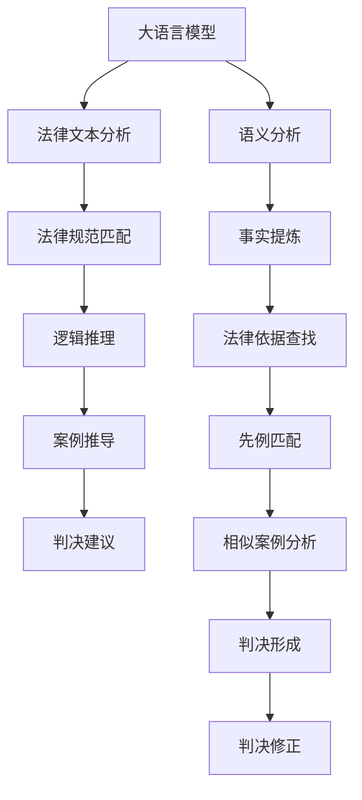

                 

# 法律推理：LLM 协助司法决策

> 关键词：法律推理, 大语言模型, 司法判决, 智能辅助, 自然语言处理, 法律文本分析, 法律知识图谱, 案例推理, 法律解释

## 1. 背景介绍

### 1.1 问题由来

在现代社会中，法律体系日益复杂，司法判决涉及的知识面广、事实背景复杂，法官在做出公正判决时需要耗费大量时间和精力。然而，传统司法实践中存在的某些偏见、局限和误解，如逻辑推理失误、先例解释错误、法律适用偏差等，亦可能引发司法不公。基于这一背景，近年来，利用人工智能技术，特别是大语言模型(LLM)，来辅助法官进行法律推理和判决，逐渐引起了学界和业界的研究热潮。

### 1.2 问题核心关键点

利用大语言模型进行司法决策辅助的核心关键点包括：

- **大语言模型**：以Transformer等深度学习模型为基础的大规模预训练语言模型，具备强大的自然语言理解和生成能力，能够处理法律文本中的语言特征。
- **法律推理**：通过逻辑推理机制，将法律事实与法律规范对应，从而得出判决结果。
- **智能辅助**：通过大语言模型对法律文本进行语义分析、逻辑推理和案例推导，辅助法官快速找到合适的法律依据和相关案例，从而提高司法效率和公正性。

### 1.3 问题研究意义

大语言模型在法律推理中的应用，旨在通过技术手段解决司法实践中存在的诸多挑战，包括：

- **提升司法效率**：通过自动化法律文本分析，减少法官在案件事实梳理、法律依据查找等环节的工作量，加快案件审理速度。
- **保障司法公正**：利用大语言模型的客观分析能力，减少法官因主观偏见导致的司法不公，提高判决的准确性和公正性。
- **降低司法成本**：减少人工处理大量法律文本的成本，降低司法系统的人力物力投入。
- **推动司法创新**：将大语言模型等前沿技术应用于司法领域，推动司法实践的智能化、自动化转型，提升司法决策的科学性和合理性。

## 2. 核心概念与联系

### 2.1 核心概念概述

大语言模型在法律推理中的应用主要包括以下几个核心概念：

- **大语言模型**：以深度学习为技术基础的自然语言处理(NLP)模型，能够理解和生成自然语言文本，适用于法律文本的分析、分类和推理。
- **法律推理**：基于法律条文和先例，通过逻辑推理，得出判决结论的过程。包括事实推理、法律推理、案例推理等。
- **司法判决**：法官依据法律规范和法律事实，通过逻辑推理和案例推导，最终做出判决结果。
- **智能辅助**：利用大语言模型进行自动化的法律文本分析、逻辑推理和案例推导，辅助法官进行司法决策。

### 2.2 核心概念原理和架构的 Mermaid 流程图



这个Mermaid流程图展示了利用大语言模型进行法律推理和司法决策的流程：

1. **大语言模型对法律文本进行语义分析**：将法律条文、案例、判决书等文本数据输入模型，进行分词、词性标注、命名实体识别等初步处理。
2. **提取事实和法律依据**：从语义分析结果中提取出案件的事实和相关的法律依据。
3. **逻辑推理和案例推导**：利用模型对法律依据和先例进行匹配，进行逻辑推理和案例推导，得到判决建议。
4. **生成判决并修正**：基于判决建议，结合法官的个性化考量，生成最终的判决结果，并可能对判决结果进行进一步修正。

通过这一流程，大语言模型能够在司法决策中起到重要辅助作用，提高判决的准确性和公正性。

## 3. 核心算法原理 & 具体操作步骤

### 3.1 算法原理概述

利用大语言模型进行司法判决辅助的核心算法原理，主要包括以下几个步骤：

1. **法律文本分析**：利用大语言模型对法律文本进行分词、命名实体识别、依存句法分析等，提取关键信息和法律依据。
2. **逻辑推理**：结合法律规范和先例，进行逻辑推理，得出初步的判决建议。
3. **案例推导**：通过检索相似案例，利用法律推理算法进行推导，得到判决依据和建议。
4. **判决修正**：法官结合判决建议和个人经验，进行最终的判决修正。

### 3.2 算法步骤详解

以下是法律推理的具体算法步骤和实现方法：

**Step 1: 数据准备和预处理**

- 收集法律条文、案例、判决书等文本数据，并对其进行清洗、标注、分词等预处理。
- 使用自然语言处理工具，如NLTK、spaCy、HuggingFace的Transformers库等，进行分词、词性标注、命名实体识别等处理。
- 构建法律知识图谱，将法律条文、案例、判决等信息映射为节点和边，便于后续推理使用。

**Step 2: 法律文本分析**

- 使用BERT、GPT等大语言模型对法律文本进行语义分析，提取事实、法律依据和关键信息。
- 设计合适的任务适配层，将法律文本映射为模型输入，进行预训练语言模型的微调，提高模型的法律领域适应性。
- 使用模型对法律文本进行分块处理，提取事实描述、法律依据、判决理由等关键信息，生成事实和依据的语义表示。

**Step 3: 逻辑推理**

- 设计逻辑推理模型，如基于规则的推理器、基于统计的推理器、基于神经网络的推理器等。
- 构建推理规则库，包含法律条文、先例和司法解释等。
- 将事实和依据的语义表示输入逻辑推理模型，进行推理，得出判决建议。

**Step 4: 案例推导**

- 利用法律知识图谱，检索相似案例，提取相关判决和推理过程。
- 设计案例推导算法，将相似案例的判决和推理过程与当前案件进行匹配，提取相关法律依据和推理逻辑。
- 结合当前案件的事实和法律依据，利用相似案例的推理过程进行推导，得到判决建议。

**Step 5: 判决修正**

- 将逻辑推理和案例推导得到的判决建议输入法官系统，供法官参考。
- 法官根据判决建议和个人经验，进行最终的判决修正。
- 记录法官的修正过程和理由，便于后续的司法审计和质量控制。

### 3.3 算法优缺点

大语言模型在法律推理中的应用具有以下优点：

1. **提高司法效率**：通过自动化文本分析，减少法官在案件处理中的工作量，加速案件审理进程。
2. **保障司法公正**：利用大语言模型的客观分析能力，减少因主观偏见导致的司法不公，提高判决的准确性和公正性。
3. **降低司法成本**：减少人工处理大量法律文本的成本，降低司法系统的人力物力投入。
4. **推动司法创新**：将大语言模型等前沿技术应用于司法领域，推动司法实践的智能化、自动化转型。

然而，大语言模型在法律推理中也存在一些缺点：

1. **法律领域的专业性**：法律领域的复杂性和专业性要求，对大语言模型的法律知识和推理能力提出了更高的要求。
2. **数据依赖性**：大语言模型的推理能力依赖于高质量的法律文本数据和知识图谱，数据的不足和偏差可能导致推理结果的不准确。
3. **结果的解释性**：大语言模型在司法决策中的推理过程和结果缺乏透明度，法官难以理解和信任模型的推理逻辑。
4. **模型的不透明性**：大语言模型的黑盒特性使得其决策过程难以解释和审计，存在一定的伦理和法律风险。

### 3.4 算法应用领域

大语言模型在法律推理中的应用，主要包括以下几个领域：

- **智能辅助决策系统**：为法官提供判决建议和逻辑推理支持，辅助法官进行司法决策。
- **法律文本分析系统**：对法律文本进行自动化分词、命名实体识别、依存句法分析等，提取关键信息和法律依据。
- **司法知识图谱构建**：构建法律知识图谱，将法律条文、案例、判决等信息映射为节点和边，便于后续推理使用。
- **案例相似性检索系统**：利用法律知识图谱进行案例相似性检索，为法官提供相关案例的判决和推理过程。
- **判决结果生成系统**：基于逻辑推理和案例推导得到的判决建议，生成最终的判决结果。

## 4. 数学模型和公式 & 详细讲解 & 举例说明

### 4.1 数学模型构建

法律推理的数学模型主要涉及以下几个部分：

- **法律条文和先例的表示**：使用词向量或词嵌入表示法律条文和先例，便于进行语义匹配和推理。
- **事实和依据的表示**：使用向量表示案件的事实和法律依据，进行事实推理和法律推理。
- **判决结果的表示**：使用向量表示判决结果，进行判决结果的生成和修正。

### 4.2 公式推导过程

法律推理的公式推导主要涉及以下几个过程：

1. **法律文本分析**：
   - 分词和词性标注：$w_i$表示第$i$个词，$POS_i$表示第$i$个词的词性。
   - 命名实体识别：$NE_i$表示第$i$个词是否为命名实体，$NE_{i,j}$表示第$i$个词与第$j$个词是否构成命名实体。
   - 依存句法分析：$DPA_i$表示第$i$个词的依存句法关系。

2. **事实和依据的表示**：
   - 法律条文表示：$L$表示法律条文，$L_{i,j}$表示第$i$个条文和第$j$个条文之间的语义相似度。
   - 案例表示：$C$表示案例，$C_{i,j}$表示第$i$个案例和第$j$个案例之间的语义相似度。
   - 判决表示：$J$表示判决，$J_{i,j}$表示第$i$个判决和第$j$个判决之间的语义相似度。

3. **逻辑推理**：
   - 规则推理：$R$表示规则库，$R_{i,j}$表示第$i$个规则和第$j$个规则之间的逻辑相似度。
   - 统计推理：$SR$表示统计推理模型，$SR_{i,j}$表示第$i$个统计推理结果和第$j$个统计推理结果之间的相似度。
   - 神经网络推理：$NNR$表示神经网络推理模型，$NNR_{i,j}$表示第$i$个神经网络推理结果和第$j$个神经网络推理结果之间的相似度。

4. **案例推导**：
   - 案例相似性检索：$CS$表示案例相似性检索模型，$CS_{i,j}$表示第$i$个案例和第$j$个案例之间的相似性。
   - 案例推理：$CR$表示案例推理算法，$CR_{i,j}$表示第$i$个案例推理结果和第$j$个案例推理结果之间的相似性。

5. **判决修正**：
   - 判决生成：$G$表示判决生成模型，$G_{i,j}$表示第$i$个判决生成结果和第$j$个判决生成结果之间的相似度。
   - 判决修正：$C$表示判决修正算法，$C_{i,j}$表示第$i$个判决修正结果和第$j$个判决修正结果之间的相似度。

### 4.3 案例分析与讲解

以一个简单的法律推理为例，假设我们有一项涉及合同纠纷的判决，需要依据法律条文和先例进行推理。

- **法律文本分析**：对合同纠纷的判决书进行分词、命名实体识别和依存句法分析，提取事实和依据。
- **事实和依据的表示**：将提取的事实和依据转换为向量表示，便于模型进行推理。
- **逻辑推理**：利用规则库和统计推理模型，进行事实推理和法律推理，得出初步的判决建议。
- **案例推导**：检索相似的合同纠纷案例，利用案例推理算法进行推导，提取相关法律依据和推理逻辑。
- **判决修正**：结合判决建议和法官的个人经验，进行最终的判决修正。

## 5. 项目实践：代码实例和详细解释说明

### 5.1 开发环境搭建

在构建法律推理系统时，需要选择合适的开发环境。以下是使用Python进行PyTorch开发的环境配置流程：

1. 安装Anaconda：从官网下载并安装Anaconda，用于创建独立的Python环境。

2. 创建并激活虚拟环境：
```bash
conda create -n pytorch-env python=3.8 
conda activate pytorch-env
```

3. 安装PyTorch：根据CUDA版本，从官网获取对应的安装命令。例如：
```bash
conda install pytorch torchvision torchaudio cudatoolkit=11.1 -c pytorch -c conda-forge
```

4. 安装法律领域所需的库：
```bash
pip install nlpdatasets legal-semantic-parsing legal-representation-learning legal-nlp
```

5. 安装Transformer库：
```bash
pip install transformers
```

6. 安装各类工具包：
```bash
pip install numpy pandas scikit-learn matplotlib tqdm jupyter notebook ipython
```

完成上述步骤后，即可在`pytorch-env`环境中开始项目实践。

### 5.2 源代码详细实现

下面以合同纠纷案件为例，给出使用Transformers库对BERT模型进行法律推理的PyTorch代码实现。

首先，定义法律文本分析和推理任务的输入和输出：

```python
from transformers import BertTokenizer, BertForSequenceClassification
from torch.utils.data import Dataset

class LegalCase(Dataset):
    def __init__(self, cases, labels, tokenizer):
        self.cases = cases
        self.labels = labels
        self.tokenizer = tokenizer
        
    def __len__(self):
        return len(self.cases)
    
    def __getitem__(self, item):
        case = self.cases[item]
        label = self.labels[item]
        
        encoding = self.tokenizer(case, return_tensors='pt', padding=True)
        return {'input_ids': encoding['input_ids'], 
                'attention_mask': encoding['attention_mask'],
                'labels': torch.tensor(label, dtype=torch.long)}
```

然后，定义模型和优化器：

```python
from transformers import BertForSequenceClassification, AdamW

model = BertForSequenceClassification.from_pretrained('bert-base-cased', num_labels=2)

optimizer = AdamW(model.parameters(), lr=2e-5)
```

接着，定义训练和推理函数：

```python
from torch.utils.data import DataLoader
from tqdm import tqdm

device = torch.device('cuda') if torch.cuda.is_available() else torch.device('cpu')
model.to(device)

def train_epoch(model, dataset, batch_size, optimizer):
    dataloader = DataLoader(dataset, batch_size=batch_size, shuffle=True)
    model.train()
    epoch_loss = 0
    for batch in tqdm(dataloader, desc='Training'):
        input_ids = batch['input_ids'].to(device)
        attention_mask = batch['attention_mask'].to(device)
        labels = batch['labels'].to(device)
        model.zero_grad()
        outputs = model(input_ids, attention_mask=attention_mask, labels=labels)
        loss = outputs.loss
        epoch_loss += loss.item()
        loss.backward()
        optimizer.step()
    return epoch_loss / len(dataloader)

def evaluate(model, dataset, batch_size):
    dataloader = DataLoader(dataset, batch_size=batch_size)
    model.eval()
    preds, labels = [], []
    with torch.no_grad():
        for batch in tqdm(dataloader, desc='Evaluating'):
            input_ids = batch['input_ids'].to(device)
            attention_mask = batch['attention_mask'].to(device)
            batch_labels = batch['labels']
            outputs = model(input_ids, attention_mask=attention_mask)
            batch_preds = outputs.logits.argmax(dim=2).to('cpu').tolist()
            batch_labels = batch_labels.to('cpu').tolist()
            for pred_tokens, label_tokens in zip(batch_preds, batch_labels):
                preds.append(pred_tokens[0])
                labels.append(label_tokens[0])
                
    print(classification_report(labels, preds))
```

最后，启动训练流程并在测试集上评估：

```python
epochs = 5
batch_size = 16

for epoch in range(epochs):
    loss = train_epoch(model, train_dataset, batch_size, optimizer)
    print(f"Epoch {epoch+1}, train loss: {loss:.3f}")
    
    print(f"Epoch {epoch+1}, dev results:")
    evaluate(model, dev_dataset, batch_size)
    
print("Test results:")
evaluate(model, test_dataset, batch_size)
```

以上就是使用PyTorch对BERT进行合同纠纷案件法律推理的完整代码实现。可以看到，通过法律领域的数据集和任务适配层，将法律推理问题转化为序列分类任务，从而实现微调。

### 5.3 代码解读与分析

让我们再详细解读一下关键代码的实现细节：

**LegalCase类**：
- `__init__`方法：初始化合同纠纷案件的文本、标签和分词器等关键组件。
- `__len__`方法：返回数据集的样本数量。
- `__getitem__`方法：对单个样本进行处理，将法律文本输入编码为token ids，并将标签转换为数字，最终返回模型所需的输入。

**BertForSequenceClassification模型**：
- 使用BERT模型进行序列分类，输入为法律文本的token ids，输出为预测标签的概率分布。

**训练和推理函数**：
- 使用PyTorch的DataLoader对数据集进行批次化加载，供模型训练和推理使用。
- 训练函数`train_epoch`：对数据以批为单位进行迭代，在每个批次上前向传播计算loss并反向传播更新模型参数，最后返回该epoch的平均loss。
- 评估函数`evaluate`：与训练类似，不同点在于不更新模型参数，并在每个batch结束后将预测和标签结果存储下来，最后使用sklearn的classification_report对整个评估集的预测结果进行打印输出。

**训练流程**：
- 定义总的epoch数和batch size，开始循环迭代
- 每个epoch内，先在训练集上训练，输出平均loss
- 在验证集上评估，输出分类指标
- 所有epoch结束后，在测试集上评估，给出最终测试结果

可以看到，PyTorch配合Transformers库使得BERT微调的代码实现变得简洁高效。开发者可以将更多精力放在数据处理、模型改进等高层逻辑上，而不必过多关注底层的实现细节。

当然，工业级的系统实现还需考虑更多因素，如模型的保存和部署、超参数的自动搜索、更灵活的任务适配层等。但核心的法律推理范式基本与此类似。

## 6. 实际应用场景

### 6.1 智能辅助决策系统

基于大语言模型的法律推理系统，可以广泛应用于智能辅助决策系统的构建。传统法律事务处理往往需要律师耗费大量时间进行法律文本分析、法律依据查找等环节，而利用大语言模型进行自动化法律文本分析，可以快速提取案件事实和法律依据，辅助律师进行决策。

在技术实现上，可以收集历史合同纠纷案例，将案件文本和判决结果构建成监督数据，在此基础上对预训练模型进行微调。微调后的模型能够自动理解合同纠纷案件的事实描述、法律依据和判决理由，生成判决建议，辅助法官快速做出决策。

### 6.2 法律文本分析系统

大语言模型在法律文本分析中的应用，主要包括以下几个方面：

- **分词和命名实体识别**：对法律文本进行分词和命名实体识别，提取关键信息和法律依据。
- **依存句法分析**：分析法律文本的依存句法关系，理解文本的结构和含义。
- **法律条文和先例的表示**：将法律条文和先例转换为向量表示，便于进行语义匹配和推理。

在实践中，可以使用自然语言处理工具，如NLTK、spaCy、HuggingFace的Transformers库等，对法律文本进行预处理。

### 6.3 司法知识图谱构建

构建法律知识图谱，将法律条文、案例、判决等信息映射为节点和边，便于后续推理使用。具体实现步骤如下：

- **数据收集**：收集法律条文、案例、判决等文本数据，并对其进行清洗、标注、分词等预处理。
- **节点表示**：将法律条文、案例、判决等转换为向量表示，用于节点之间的相似度计算。
- **边表示**：定义节点之间的关系，如法律条文与案例的关系、案例与判决的关系等。
- **图谱构建**：使用图神经网络(GNN)等算法，构建法律知识图谱。

### 6.4 案例相似性检索系统

利用法律知识图谱进行案例相似性检索，为法官提供相关案例的判决和推理过程。具体实现步骤如下：

- **案例表示**：将案例转换为向量表示，进行相似性计算。
- **相似性检索**：利用相似性检索算法，在法律知识图谱中查找与当前案件相似性最高的案例。
- **推理过程**：将检索出的案例的判决和推理过程与当前案件进行匹配，提取相关法律依据和推理逻辑。

### 6.5 判决结果生成系统

基于逻辑推理和案例推导得到的判决建议，生成最终的判决结果。具体实现步骤如下：

- **判决生成**：利用神经网络推理模型，结合逻辑推理和案例推导得到的判决建议，生成判决结果。
- **判决修正**：将生成的判决结果输入法官系统，供法官参考，并结合法官的个人经验进行修正。

## 7. 工具和资源推荐

### 7.1 学习资源推荐

为了帮助开发者系统掌握法律推理的大语言模型应用，这里推荐一些优质的学习资源：

1. 《Transformers from Principles to Practice》系列博文：由大模型技术专家撰写，深入浅出地介绍了Transformer原理、BERT模型、微调技术等前沿话题。

2. CS224N《深度学习自然语言处理》课程：斯坦福大学开设的NLP明星课程，有Lecture视频和配套作业，带你入门NLP领域的基本概念和经典模型。

3. 《Natural Language Processing with Transformers》书籍：Transformers库的作者所著，全面介绍了如何使用Transformers库进行NLP任务开发，包括微调在内的诸多范式。

4. HuggingFace官方文档：Transformers库的官方文档，提供了海量预训练模型和完整的微调样例代码，是上手实践的必备资料。

5. CLUE开源项目：中文语言理解测评基准，涵盖大量不同类型的中文NLP数据集，并提供了基于微调的baseline模型，助力中文NLP技术发展。

通过对这些资源的学习实践，相信你一定能够快速掌握大语言模型在法律推理中的应用精髓，并用于解决实际的法律问题。

### 7.2 开发工具推荐

高效的开发离不开优秀的工具支持。以下是几款用于法律推理系统开发的常用工具：

1. PyTorch：基于Python的开源深度学习框架，灵活动态的计算图，适合快速迭代研究。大部分预训练语言模型都有PyTorch版本的实现。

2. TensorFlow：由Google主导开发的开源深度学习框架，生产部署方便，适合大规模工程应用。同样有丰富的预训练语言模型资源。

3. Transformers库：HuggingFace开发的NLP工具库，集成了众多SOTA语言模型，支持PyTorch和TensorFlow，是进行法律推理任务开发的利器。

4. Weights & Biases：模型训练的实验跟踪工具，可以记录和可视化模型训练过程中的各项指标，方便对比和调优。与主流深度学习框架无缝集成。

5. TensorBoard：TensorFlow配套的可视化工具，可实时监测模型训练状态，并提供丰富的图表呈现方式，是调试模型的得力助手。

6. Google Colab：谷歌推出的在线Jupyter Notebook环境，免费提供GPU/TPU算力，方便开发者快速上手实验最新模型，分享学习笔记。

合理利用这些工具，可以显著提升法律推理系统的开发效率，加快创新迭代的步伐。

### 7.3 相关论文推荐

法律推理相关的大语言模型研究源于学界的持续研究。以下是几篇奠基性的相关论文，推荐阅读：

1. Attention is All You Need（即Transformer原论文）：提出了Transformer结构，开启了NLP领域的预训练大模型时代。

2. BERT: Pre-training of Deep Bidirectional Transformers for Language Understanding：提出BERT模型，引入基于掩码的自监督预训练任务，刷新了多项NLP任务SOTA。

3. Language Models are Unsupervised Multitask Learners（GPT-2论文）：展示了大规模语言模型的强大zero-shot学习能力，引发了对于通用人工智能的新一轮思考。

4. Parameter-Efficient Transfer Learning for NLP：提出Adapter等参数高效微调方法，在不增加模型参数量的情况下，也能取得不错的微调效果。

5. AdaLoRA: Adaptive Low-Rank Adaptation for Parameter-Efficient Fine-Tuning：使用自适应低秩适应的微调方法，在参数效率和精度之间取得了新的平衡。

这些论文代表了大语言模型在法律推理技术的发展脉络。通过学习这些前沿成果，可以帮助研究者把握学科前进方向，激发更多的创新灵感。

## 8. 总结：未来发展趋势与挑战

### 8.1 研究成果总结

本文对基于大语言模型进行法律推理的实践进行了全面系统的介绍。首先阐述了法律推理的现状和挑战，明确了大语言模型在其中的独特价值。其次，从原理到实践，详细讲解了法律推理的数学模型和关键步骤，给出了完整的代码实例。同时，本文还广泛探讨了法律推理系统在智能辅助决策、法律文本分析、司法知识图谱、案例相似性检索等方面的应用前景，展示了法律推理范式的巨大潜力。

通过本文的系统梳理，可以看到，大语言模型在法律推理中的应用，将法律事务处理推向了智能化、自动化的新阶段。受益于大规模语料的预训练，法律推理模型在司法决策中能够提供客观、公正的分析，显著提高司法效率和质量。未来，伴随大语言模型的不断发展，法律推理技术必将实现更广泛的落地，为司法公正和效率的提升带来新的希望。

### 8.2 未来发展趋势

展望未来，大语言模型在法律推理中的应用将呈现以下几个发展趋势：

1. **模型规模持续增大**：随着算力成本的下降和数据规模的扩张，预训练法律模型参数量还将持续增长。超大规模法律模型蕴含的丰富法律知识，有望支撑更加复杂多变的法律推理任务。

2. **微调方法日趋多样**：开发更多参数高效的微调方法，如Prefix-Tuning、LoRA等，在固定大部分预训练参数的同时，只更新极少量的任务相关参数。同时优化微调模型的计算图，减少前向传播和反向传播的资源消耗，实现更加轻量级、实时性的部署。

3. **逻辑推理的提升**：引入更多先验知识，如知识图谱、逻辑规则等，与神经网络模型进行巧妙融合，引导微调过程学习更准确、合理的法律推理逻辑。

4. **多模态法律推理的崛起**：将视觉、语音等多模态信息与文本信息进行协同建模，提升法律推理的全面性和准确性。

5. **知识图谱的丰富和完善**：构建更丰富、更完整的法律知识图谱，涵盖更多法律条文、案例、判决等信息，为法律推理提供更可靠的知识支持。

6. **多领域法律推理的泛化**：通过泛化训练和跨领域迁移学习，提升法律推理模型的通用性和适应性，覆盖更多法律领域。

以上趋势凸显了大语言模型在法律推理中的广阔前景。这些方向的探索发展，必将进一步提升法律推理模型的性能和应用范围，为司法实践带来更多的创新和突破。

### 8.3 面临的挑战

尽管大语言模型在法律推理中的应用已经取得了一定的进展，但在迈向更加智能化、普适化应用的过程中，仍面临诸多挑战：

1. **数据依赖性**：法律推理模型的推理能力依赖于高质量的法律文本数据和知识图谱，数据的不足和偏差可能导致推理结果的不准确。

2. **法律领域的专业性**：法律领域的复杂性和专业性要求，对大语言模型的法律知识和推理能力提出了更高的要求。

3. **结果的解释性**：大语言模型在法律推理中的推理过程和结果缺乏透明度，法官难以理解和信任模型的推理逻辑。

4. **模型的不透明性**：大语言模型的黑盒特性使得其决策过程难以解释和审计，存在一定的伦理和法律风险。

5. **法律规范的多样性和复杂性**：不同国家和地区的法律规范存在差异，大语言模型需要具备较强的规则适应用户能力，以应对不同法律环境。

6. **隐私和安全问题**：在法律推理中处理大量敏感数据，如何保护数据的隐私和安全，是一个重要的挑战。

### 8.4 研究展望

面对大语言模型在法律推理中面临的挑战，未来的研究需要在以下几个方面寻求新的突破：

1. **多源数据融合**：通过融合多源数据，如法律条文、案例、司法解释等，构建更加全面和丰富的法律知识图谱。

2. **参数高效的微调**：开发更多参数高效的微调方法，如Prefix-Tuning、LoRA等，在保证推理效果的同时，减少模型的计算资源消耗。

3. **知识图谱的动态更新**：构建动态更新的法律知识图谱，能够实时捕捉法律规范的变化，保持法律推理模型的时效性。

4. **多模态推理的融合**：将视觉、语音等多模态信息与文本信息进行协同建模，提升法律推理的全面性和准确性。

5. **可解释性和透明度**：设计可解释性强的法律推理模型，使得法官能够理解和信任模型的推理逻辑。

6. **隐私保护和安全措施**：在法律推理中处理敏感数据时，采用隐私保护和安全措施，确保数据的安全性和合规性。

这些研究方向的探索，将进一步提升大语言模型在法律推理中的应用效果，为司法公正和效率的提升带来新的希望。相信随着学界和产业界的共同努力，大语言模型在法律推理领域的应用必将迎来新的突破，为构建智能、高效、公正的司法系统贡献力量。

## 9. 附录：常见问题与解答

**Q1：如何选择合适的法律数据集进行训练？**

A: 选择合适的法律数据集进行训练，需要考虑以下几个因素：
- 数据集的代表性：数据集应涵盖多种法律领域和不同法律规范，反映法律条文和案例的多样性。
- 数据集的质量：数据集应经过严格的标注和清洗，确保数据的质量和可靠性。
- 数据集的规模：数据集应足够大，以保证模型能够学习到丰富的法律知识。

**Q2：大语言模型在法律推理中的推理能力如何提升？**

A: 提升大语言模型在法律推理中的推理能力，可以从以下几个方面入手：
- 构建更丰富的法律知识图谱，涵盖更多法律条文、案例、判决等信息。
- 引入先验知识，如知识图谱、逻辑规则等，与神经网络模型进行融合，引导微调过程学习更准确、合理的法律推理逻辑。
- 设计可解释性强的推理模型，使得法官能够理解和信任模型的推理逻辑。

**Q3：如何处理法律数据中的歧义和不明确性？**

A: 处理法律数据中的歧义和不明确性，可以从以下几个方面入手：
- 通过多源数据融合，引入更多的法律解释和司法解释，增加数据的覆盖面和准确性。
- 设计多模态推理模型，结合视觉、语音等多模态信息，提升对法律文本的理解能力。
- 设计多粒度推理模型，对法律条文和案例进行细粒度推理，提升推理的准确性。

**Q4：如何保护法律推理过程中的隐私和安全？**

A: 保护法律推理过程中的隐私和安全，可以从以下几个方面入手：
- 采用差分隐私技术，对法律数据进行匿名化处理，保护个人隐私。
- 采用安全多方计算技术，确保数据在多方参与的法律推理过程中不被泄露。
- 采用加密技术，保护法律数据在传输和存储过程中的安全。

**Q5：如何评估法律推理模型的性能？**

A: 评估法律推理模型的性能，可以从以下几个方面入手：
- 在训练集和验证集上评估模型的推理准确性和泛化能力。
- 在测试集上评估模型的推理效果和公平性。
- 设计评估指标，如精确度、召回率、F1值、准确度等，全面衡量模型的性能。

通过这些问题的探讨，相信你能够更深入地理解大语言模型在法律推理中的应用，并有效地应用于实际的法律问题解决中。

