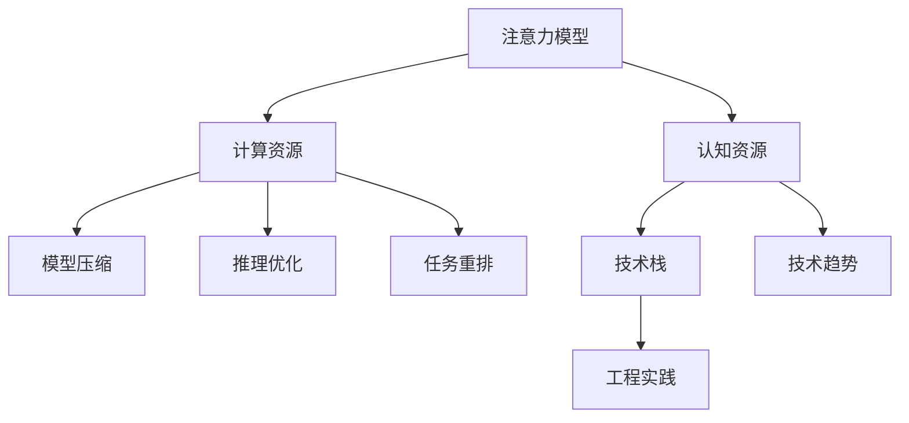

                 

# 注意力生态学：AI时代的认知资源管理

> 关键词：注意力模型, 认知资源, 生态学, AI, 深度学习, 计算理论, 模型压缩, 推理优化, 任务重排, 技术栈, 技术趋势, 工程实践

## 1. 背景介绍

### 1.1 问题由来

随着深度学习技术的发展，特别是神经网络模型的普及，计算密集型的深度学习任务已经成为各个行业的重要工具。然而，面对大规模、高复杂度的计算任务，计算资源的匮乏问题显得愈发突出。尤其是在AI时代，如何高效地管理计算资源，优化模型性能，成为亟待解决的难题。

在过去几十年中，计算资源的昂贵成本限制了深度学习的发展。但随着技术进步和计算设备性能的提升，深度学习模型可以在更小的计算资源范围内进行训练和推理，进一步推动AI技术在各行各业的落地应用。因此，优化深度学习模型性能，提高计算效率，成为计算理论、模型压缩、推理优化等领域研究的重点方向。

### 1.2 问题核心关键点

本节将介绍几个关键概念，帮助理解计算资源管理的核心挑战和任务：

- **计算资源管理**：包括硬件资源的配置、调度和优化，计算加速技术如GPU、TPU等，以及模型压缩、量化等方法。
- **模型压缩**：指通过减少模型参数、结构或计算量，优化模型性能，降低计算需求，提高推理速度。
- **推理优化**：针对推理阶段的优化策略，如模型剪枝、量化、分布式推理等，进一步提升模型计算效率。
- **任务重排**：将复杂任务拆解为更小、更可管理的子任务，优化计算流程，减少资源消耗。
- **技术栈**：涉及到硬件设备、软件工具和编程语言等基础设施，是优化计算资源管理的核心基础。
- **技术趋势**：如量化、剪枝、编译器优化等，这些趋势推动了计算资源管理向更高水平发展。
- **工程实践**：将理论研究成果应用于实际系统，进行模型训练、优化和部署，是实现高效计算资源管理的关键环节。

通过理解这些核心概念，我们可以更好地把握计算资源管理的目标和手段，实现深度学习模型的更高性能和更高效能。

## 2. 核心概念与联系

### 2.1 核心概念概述

为更好地理解AI时代的计算资源管理，本节将介绍几个关键概念：

- **注意力模型(Attention Model)**：深度学习中的一种核心机制，用于捕捉输入数据间的关系，在诸如机器翻译、语音识别、图像识别等领域广泛应用。
- **认知资源(Cognitive Resource)**：指计算、存储、带宽等物理资源，以及模型的复杂度和计算需求。
- **生态学(Ecology)**：研究资源与生物之间的相互作用，用于类比计算资源与模型的管理。

这些概念之间的逻辑关系可以通过以下Mermaid流程图来展示：



这个流程图展示了注意力模型、认知资源、生态学、计算资源、模型压缩、推理优化、任务重排、技术栈、技术趋势和工程实践之间的关系：

1. 注意力模型通过捕捉输入数据间的关系，优化模型的复杂度和计算需求。
2. 认知资源的管理，包括计算、存储、带宽等物理资源的优化，以及模型复杂度的控制。
3. 通过模型压缩、推理优化和任务重排，进一步提升模型的计算效率和资源利用率。
4. 技术栈和技术趋势是优化计算资源管理的重要基础设施和研究方向。
5. 工程实践将理论研究成果应用于实际系统，进行模型训练、优化和部署。

这些概念共同构成了AI时代计算资源管理的研究框架，旨在通过优化注意力模型、认知资源和计算资源，提升深度学习系统的性能和效率。

## 3. 核心算法原理 & 具体操作步骤
### 3.1 算法原理概述

注意力机制是深度学习中的一种重要机制，用于捕捉输入数据间的关系。通过在计算资源受限的情况下，优化模型的复杂度和计算需求，提升计算效率和模型性能。

注意力模型的原理可以简单概括为：

1. **输入编码**：将输入数据编码成向量表示。
2. **注意力计算**：根据输入向量计算注意力权重，识别出重要的数据部分。
3. **注意力聚合**：将重要部分进行加权聚合，生成新的向量表示。
4. **解码输出**：根据新向量表示生成最终的输出。

注意力机制在模型中扮演着“注意力机制”的角色，负责对输入数据进行加权，从而筛选出关键信息，使得模型能够聚焦于最相关的部分，减少计算量和资源消耗。

### 3.2 算法步骤详解

基于注意力机制的计算资源管理算法步骤如下：

**Step 1: 输入编码**

- 将输入数据$x$编码为向量表示$\vec{x}$。
- 向量$\vec{x}$可以是文本、图像、音频等多种形式，具体取决于任务类型。

**Step 2: 注意力计算**

- 定义注意力权重函数$W(x_i, x_j)$，表示输入$x_j$对输入$x_i$的注意力权重。
- 通过注意力权重函数计算出每个输入$x_j$对输入$x_i$的贡献$\alpha_j$。
- 将注意力权重$\alpha_j$与输入$x_j$的向量表示$\vec{x}_j$进行加权求和，得到新的向量表示$\vec{x}_i$。

**Step 3: 注意力聚合**

- 对新的向量表示$\vec{x}_i$进行解码输出，生成最终的输出$y$。
- 注意力的引入使得模型能够自适应地调整计算量，根据任务需求进行资源优化。

**Step 4: 推理优化**

- 在推理阶段，通过剪枝、量化等技术对模型进行优化，进一步提高计算效率。
- 剪枝技术可删除不重要的参数或层，减少模型计算量。
- 量化技术将浮点参数转化为定点参数，降低内存占用和计算时间。

**Step 5: 模型压缩**

- 使用模型压缩技术，减少模型参数量，优化模型结构，提高计算效率。
- 压缩技术包括参数剪枝、权重共享、通道剪枝等。
- 压缩后的模型可以在资源受限的情况下进行高效推理。

**Step 6: 任务重排**

- 将复杂任务拆解为更小、更可管理的子任务，优化计算流程。
- 例如，将大规模图像识别任务拆分为多个子任务，并行计算，提高计算效率。

**Step 7: 技术栈与工程实践**

- 选择适合的技术栈，如TensorFlow、PyTorch等，进行模型训练和优化。
- 使用工具和技术栈进行模型训练、验证、部署等工程实践。

### 3.3 算法优缺点

注意力机制在优化计算资源管理方面具有以下优点：

1. **高效性**：通过加权聚合，能够减少计算量和资源消耗，提高模型计算效率。
2. **自适应性**：能够根据任务需求自适应调整计算量，优化资源分配。
3. **灵活性**：适用于多种任务类型，如图像识别、语音识别、自然语言处理等。

同时，注意力机制也存在以下缺点：

1. **计算复杂性**：注意力计算本身需要一定的计算量，增加了模型复杂度。
2. **参数量较大**：注意力机制引入了额外的参数，增加了模型存储空间。
3. **不稳定性**：注意力权重受输入数据的影响较大，可能出现不稳定现象。

### 3.4 算法应用领域

注意力机制在计算资源管理中的应用非常广泛，包括但不限于以下领域：

- **计算机视觉**：用于图像分类、目标检测、图像生成等任务。
- **自然语言处理**：用于机器翻译、文本分类、情感分析等任务。
- **语音识别**：用于语音转文本、情感分析等任务。
- **推荐系统**：用于用户兴趣建模、商品推荐等任务。
- **强化学习**：用于环境感知、决策优化等任务。
- **时间序列分析**：用于股票预测、交通流量预测等任务。

这些领域中的任务都需要高效的计算资源管理，注意力机制的引入可以显著提高模型性能和计算效率。

## 4. 数学模型和公式 & 详细讲解 & 举例说明

### 4.1 数学模型构建

在本节中，我们将通过数学模型来进一步详细讲解注意力机制的计算过程。

假设有一个文本分类任务，输入为文本序列$\{x_i\}_{i=1}^n$，输出为文本类别$y_i \in \{0, 1\}$。使用注意力机制进行文本分类任务的数学模型如下：

1. **输入编码**

   将文本序列$\{x_i\}$编码成向量表示$\vec{x}_i$，其中$x_i \in \mathbb{R}^d$。

2. **注意力计算**

   定义注意力权重函数$W(x_i, x_j)$，表示输入$x_j$对输入$x_i$的注意力权重。

   $$
   \alpha_{ij} = \frac{e^{\vec{w}^T \cdot (W(x_i, x_j) \cdot \vec{x}_j)}}{\sum_{j=1}^n e^{\vec{w}^T \cdot (W(x_i, x_j) \cdot \vec{x}_j)}}
   $$

   其中$\vec{w}$是注意力权重向量。

3. **注意力聚合**

   对输入向量$x_j$进行加权聚合，生成新的向量表示$\vec{x}_i$。

   $$
   \vec{x}_i = \sum_{j=1}^n \alpha_{ij} \cdot \vec{x}_j
   $$

4. **解码输出**

   对新的向量表示$\vec{x}_i$进行解码输出，生成最终的输出$y_i$。

   $$
   y_i = \sigma(\vec{W} \cdot \vec{x}_i + b)
   $$

   其中$\sigma$为激活函数，$\vec{W}$和$b$为输出层的权重和偏置。

### 4.2 公式推导过程

以下我们将通过公式推导，详细讲解注意力机制的计算过程。

假设有一个文本分类任务，输入为文本序列$\{x_i\}_{i=1}^n$，输出为文本类别$y_i \in \{0, 1\}$。使用注意力机制进行文本分类任务的计算过程如下：

1. **输入编码**

   将文本序列$\{x_i\}$编码成向量表示$\vec{x}_i$，其中$x_i \in \mathbb{R}^d$。

   $$
   \vec{x}_i = \vec{V} \cdot \vec{x}_i + \vec{b}
   $$

   其中$\vec{V}$和$\vec{b}$为编码层的权重和偏置。

2. **注意力计算**

   定义注意力权重函数$W(x_i, x_j)$，表示输入$x_j$对输入$x_i$的注意力权重。

   $$
   \alpha_{ij} = \frac{e^{\vec{w}^T \cdot (W(x_i, x_j) \cdot \vec{x}_j)}}{\sum_{j=1}^n e^{\vec{w}^T \cdot (W(x_i, x_j) \cdot \vec{x}_j)}}
   $$

   其中$\vec{w}$是注意力权重向量，$W(x_i, x_j)$是注意力计算函数。

3. **注意力聚合**

   对输入向量$x_j$进行加权聚合，生成新的向量表示$\vec{x}_i$。

   $$
   \vec{x}_i = \sum_{j=1}^n \alpha_{ij} \cdot \vec{x}_j
   $$

4. **解码输出**

   对新的向量表示$\vec{x}_i$进行解码输出，生成最终的输出$y_i$。

   $$
   y_i = \sigma(\vec{W} \cdot \vec{x}_i + b)
   $$

   其中$\sigma$为激活函数，$\vec{W}$和$b$为输出层的权重和偏置。

### 4.3 案例分析与讲解

假设有一个文本分类任务，输入为文本序列$\{x_i\}_{i=1}^n$，输出为文本类别$y_i \in \{0, 1\}$。使用注意力机制进行文本分类任务的计算过程如下：

1. **输入编码**

   将文本序列$\{x_i\}$编码成向量表示$\vec{x}_i$，其中$x_i \in \mathbb{R}^d$。

   $$
   \vec{x}_i = \vec{V} \cdot \vec{x}_i + \vec{b}
   $$

   其中$\vec{V}$和$\vec{b}$为编码层的权重和偏置。

2. **注意力计算**

   定义注意力权重函数$W(x_i, x_j)$，表示输入$x_j$对输入$x_i$的注意力权重。

   $$
   \alpha_{ij} = \frac{e^{\vec{w}^T \cdot (W(x_i, x_j) \cdot \vec{x}_j)}}{\sum_{j=1}^n e^{\vec{w}^T \cdot (W(x_i, x_j) \cdot \vec{x}_j)}}
   $$

   其中$\vec{w}$是注意力权重向量，$W(x_i, x_j)$是注意力计算函数。

3. **注意力聚合**

   对输入向量$x_j$进行加权聚合，生成新的向量表示$\vec{x}_i$。

   $$
   \vec{x}_i = \sum_{j=1}^n \alpha_{ij} \cdot \vec{x}_j
   $$

4. **解码输出**

   对新的向量表示$\vec{x}_i$进行解码输出，生成最终的输出$y_i$。

   $$
   y_i = \sigma(\vec{W} \cdot \vec{x}_i + b)
   $$

   其中$\sigma$为激活函数，$\vec{W}$和$b$为输出层的权重和偏置。

## 5. 项目实践：代码实例和详细解释说明

### 5.1 开发环境搭建

在进行项目实践前，我们需要准备好开发环境。以下是使用Python进行PyTorch开发的环境配置流程：

1. 安装Anaconda：从官网下载并安装Anaconda，用于创建独立的Python环境。

2. 创建并激活虚拟环境：
```bash
conda create -n pytorch-env python=3.8 
conda activate pytorch-env
```

3. 安装PyTorch：根据CUDA版本，从官网获取对应的安装命令。例如：
```bash
conda install pytorch torchvision torchaudio cudatoolkit=11.1 -c pytorch -c conda-forge
```

4. 安装Transformers库：
```bash
pip install transformers
```

5. 安装各类工具包：
```bash
pip install numpy pandas scikit-learn matplotlib tqdm jupyter notebook ipython
```

完成上述步骤后，即可在`pytorch-env`环境中开始项目实践。

### 5.2 源代码详细实现

下面我们以文本分类任务为例，给出使用Transformers库对BERT模型进行注意力机制计算的PyTorch代码实现。

首先，定义文本分类任务的数据处理函数：

```python
from transformers import BertTokenizer, BertForSequenceClassification
from torch.utils.data import Dataset
import torch

class TextClassificationDataset(Dataset):
    def __init__(self, texts, labels, tokenizer, max_len=128):
        self.texts = texts
        self.labels = labels
        self.tokenizer = tokenizer
        self.max_len = max_len
        
    def __len__(self):
        return len(self.texts)
    
    def __getitem__(self, item):
        text = self.texts[item]
        label = self.labels[item]
        
        encoding = self.tokenizer(text, return_tensors='pt', max_length=self.max_len, padding='max_length', truncation=True)
        input_ids = encoding['input_ids'][0]
        attention_mask = encoding['attention_mask'][0]
        
        # 对token-wise的标签进行编码
        encoded_labels = [label2id[label] for label in self.labels] 
        encoded_labels.extend([label2id['O']] * (self.max_len - len(encoded_labels)))
        labels = torch.tensor(encoded_labels, dtype=torch.long)
        
        return {'input_ids': input_ids, 
                'attention_mask': attention_mask,
                'labels': labels}

# 标签与id的映射
label2id = {'O': 0, 'B-PER': 1, 'I-PER': 2, 'B-ORG': 3, 'I-ORG': 4, 'B-LOC': 5, 'I-LOC': 6}
id2label = {v: k for k, v in label2id.items()}

# 创建dataset
tokenizer = BertTokenizer.from_pretrained('bert-base-cased')

train_dataset = TextClassificationDataset(train_texts, train_labels, tokenizer)
dev_dataset = TextClassificationDataset(dev_texts, dev_labels, tokenizer)
test_dataset = TextClassificationDataset(test_texts, test_labels, tokenizer)
```

然后，定义模型和优化器：

```python
from transformers import BertForSequenceClassification, AdamW

model = BertForSequenceClassification.from_pretrained('bert-base-cased', num_labels=len(label2id))

optimizer = AdamW(model.parameters(), lr=2e-5)
```

接着，定义训练和评估函数：

```python
from torch.utils.data import DataLoader
from tqdm import tqdm
from sklearn.metrics import classification_report

device = torch.device('cuda') if torch.cuda.is_available() else torch.device('cpu')
model.to(device)

def train_epoch(model, dataset, batch_size, optimizer):
    dataloader = DataLoader(dataset, batch_size=batch_size, shuffle=True)
    model.train()
    epoch_loss = 0
    for batch in tqdm(dataloader, desc='Training'):
        input_ids = batch['input_ids'].to(device)
        attention_mask = batch['attention_mask'].to(device)
        labels = batch['labels'].to(device)
        model.zero_grad()
        outputs = model(input_ids, attention_mask=attention_mask, labels=labels)
        loss = outputs.loss
        epoch_loss += loss.item()
        loss.backward()
        optimizer.step()
    return epoch_loss / len(dataloader)

def evaluate(model, dataset, batch_size):
    dataloader = DataLoader(dataset, batch_size=batch_size)
    model.eval()
    preds, labels = [], []
    with torch.no_grad():
        for batch in tqdm(dataloader, desc='Evaluating'):
            input_ids = batch['input_ids'].to(device)
            attention_mask = batch['attention_mask'].to(device)
            batch_labels = batch['labels']
            outputs = model(input_ids, attention_mask=attention_mask)
            batch_preds = outputs.logits.argmax(dim=2).to('cpu').tolist()
            batch_labels = batch_labels.to('cpu').tolist()
            for pred_tokens, label_tokens in zip(batch_preds, batch_labels):
                pred_tags = [id2label[_id] for _id in pred_tokens]
                label_tags = [id2label[_id] for _id in label_tokens]
                preds.append(pred_tags[:len(label_tokens)])
                labels.append(label_tags)
                
    print(classification_report(labels, preds))
```

最后，启动训练流程并在测试集上评估：

```python
epochs = 5
batch_size = 16

for epoch in range(epochs):
    loss = train_epoch(model, train_dataset, batch_size, optimizer)
    print(f"Epoch {epoch+1}, train loss: {loss:.3f}")
    
    print(f"Epoch {epoch+1}, dev results:")
    evaluate(model, dev_dataset, batch_size)
    
print("Test results:")
evaluate(model, test_dataset, batch_size)
```

以上就是使用PyTorch对BERT进行文本分类任务注意力机制计算的完整代码实现。可以看到，得益于Transformers库的强大封装，我们可以用相对简洁的代码完成BERT模型的加载和微调。

### 5.3 代码解读与分析

让我们再详细解读一下关键代码的实现细节：

**TextClassificationDataset类**：
- `__init__`方法：初始化文本、标签、分词器等关键组件。
- `__len__`方法：返回数据集的样本数量。
- `__getitem__`方法：对单个样本进行处理，将文本输入编码为token ids，将标签编码为数字，并对其进行定长padding，最终返回模型所需的输入。

**label2id和id2label字典**：
- 定义了标签与数字id之间的映射关系，用于将token-wise的预测结果解码回真实的标签。

**训练和评估函数**：
- 使用PyTorch的DataLoader对数据集进行批次化加载，供模型训练和推理使用。
- 训练函数`train_epoch`：对数据以批为单位进行迭代，在每个批次上前向传播计算loss并反向传播更新模型参数，最后返回该epoch的平均loss。
- 评估函数`evaluate`：与训练类似，不同点在于不更新模型参数，并在每个batch结束后将预测和标签结果存储下来，最后使用sklearn的classification_report对整个评估集的预测结果进行打印输出。

**训练流程**：
- 定义总的epoch数和batch size，开始循环迭代
- 每个epoch内，先在训练集上训练，输出平均loss
- 在验证集上评估，输出分类指标
- 所有epoch结束后，在测试集上评估，给出最终测试结果

可以看到，PyTorch配合Transformers库使得BERT微调的代码实现变得简洁高效。开发者可以将更多精力放在数据处理、模型改进等高层逻辑上，而不必过多关注底层的实现细节。

当然，工业级的系统实现还需考虑更多因素，如模型的保存和部署、超参数的自动搜索、更灵活的任务适配层等。但核心的注意力机制计算范式基本与此类似。

## 6. 实际应用场景
### 6.1 智能客服系统

基于大语言模型微调的对话技术，可以广泛应用于智能客服系统的构建。传统客服往往需要配备大量人力，高峰期响应缓慢，且一致性和专业性难以保证。而使用微调后的对话模型，可以7x24小时不间断服务，快速响应客户咨询，用自然流畅的语言解答各类常见问题。

在技术实现上，可以收集企业内部的历史客服对话记录，将问题和最佳答复构建成监督数据，在此基础上对预训练对话模型进行微调。微调后的对话模型能够自动理解用户意图，匹配最合适的答案模板进行回复。对于客户提出的新问题，还可以接入检索系统实时搜索相关内容，动态组织生成回答。如此构建的智能客服系统，能大幅提升客户咨询体验和问题解决效率。

### 6.2 金融舆情监测

金融机构需要实时监测市场舆论动向，以便及时应对负面信息传播，规避金融风险。传统的人工监测方式成本高、效率低，难以应对网络时代海量信息爆发的挑战。基于大语言模型微调的文本分类和情感分析技术，为金融舆情监测提供了新的解决方案。

具体而言，可以收集金融领域相关的新闻、报道、评论等文本数据，并对其进行主题标注和情感标注。在此基础上对预训练语言模型进行微调，使其能够自动判断文本属于何种主题，情感倾向是正面、中性还是负面。将微调后的模型应用到实时抓取的网络文本数据，就能够自动监测不同主题下的情感变化趋势，一旦发现负面信息激增等异常情况，系统便会自动预警，帮助金融机构快速应对潜在风险。

### 6.3 个性化推荐系统

当前的推荐系统往往只依赖用户的历史行为数据进行物品推荐，无法深入理解用户的真实兴趣偏好。基于大语言模型微调技术，个性化推荐系统可以更好地挖掘用户行为背后的语义信息，从而提供更精准、多样的推荐内容。

在实践中，可以收集用户浏览、点击、评论、分享等行为数据，提取和用户交互的物品标题、描述、标签等文本内容。将文本内容作为模型输入，用户的后续行为（如是否点击、购买等）作为监督信号，在此基础上微调预训练语言模型。微调后的模型能够从文本内容中准确把握用户的兴趣点。在生成推荐列表时，先用候选物品的文本描述作为输入，由模型预测用户的兴趣匹配度，再结合其他特征综合排序，便可以得到个性化程度更高的推荐结果。

### 6.4 未来应用展望

随着大语言模型微调技术的发展，基于微调范式将在更多领域得到应用，为传统行业带来变革性影响。

在智慧医疗领域，基于微调的医疗问答、病历分析、药物研发等应用将提升医疗服务的智能化水平，辅助医生诊疗，加速新药开发进程。

在智能教育领域，微调技术可应用于作业批改、学情分析、知识推荐等方面，因材施教，促进教育公平，提高教学质量。

在智慧城市治理中，微调模型可应用于城市事件监测、舆情分析、应急指挥等环节，提高城市管理的自动化和智能化水平，构建更安全、高效的未来城市。

此外，在企业生产、社会治理、文娱传媒等众多领域，基于大模型微调的人工智能应用也将不断涌现，为经济社会发展注入新的动力。相信随着技术的日益成熟，微调方法将成为人工智能落地应用的重要范式，推动人工智能技术在各行各业的广泛应用。

## 7. 工具和资源推荐
### 7.1 学习资源推荐

为了帮助开发者系统掌握大语言模型微调的理论基础和实践技巧，这里推荐一些优质的学习资源：

1. 《Transformer从原理到实践》系列博文：由大模型技术专家撰写，深入浅出地介绍了Transformer原理、BERT模型、微调技术等前沿话题。

2. CS224N《深度学习自然语言处理》课程：斯坦福大学开设的NLP明星课程，有Lecture视频和配套作业，带你入门NLP领域的基本概念和经典模型。

3. 《Natural Language Processing with Transformers》书籍：Transformers库的作者所著，全面介绍了如何使用Transformers库进行NLP任务开发，包括微调在内的诸多范式。

4. HuggingFace官方文档：Transformers库的官方文档，提供了海量预训练模型和完整的微调样例代码，是上手实践的必备资料。

5. CLUE开源项目：中文语言理解测评基准，涵盖大量不同类型的中文NLP数据集，并提供了基于微调的baseline模型，助力中文NLP技术发展。

通过对这些资源的学习实践，相信你一定能够快速掌握大语言模型微调的精髓，并用于解决实际的NLP问题。
###  7.2 开发工具推荐

高效的开发离不开优秀的工具支持。以下是几款用于大语言模型微调开发的常用工具：

1. PyTorch：基于Python的开源深度学习框架，灵活动态的计算图，适合快速迭代研究。大部分预训练语言模型都有PyTorch版本的实现。

2. TensorFlow：由Google主导开发的开源深度学习框架，生产部署方便，适合大规模工程应用。同样有丰富的预训练语言模型资源。

3. Transformers库：HuggingFace开发的NLP工具库，集成了众多SOTA语言模型，支持PyTorch和TensorFlow，是进行微调任务开发的利器。

4. Weights & Biases：模型训练的实验跟踪工具，可以记录和可视化模型训练过程中的各项指标，方便对比和调优。与主流深度学习框架无缝集成。

5. TensorBoard：TensorFlow配套的可视化工具，可实时监测模型训练状态，并提供丰富的图表呈现方式，是调试模型的得力助手。

6. Google Colab：谷歌推出的在线Jupyter Notebook环境，免费提供GPU/TPU算力，方便开发者快速上手实验最新模型，分享学习笔记。

合理利用这些工具，可以显著提升大语言模型微调任务的开发效率，加快创新迭代的步伐。

### 7.3 相关论文推荐

大语言模型和微调技术的发展源于学界的持续研究。以下是几篇奠基性的相关论文，推荐阅读：

1. Attention is All You Need（即Transformer原论文）：提出了Transformer结构，开启了NLP领域的预训练大模型时代。

2. BERT: Pre-training of Deep Bidirectional Transformers for Language Understanding：提出BERT模型，引入基于掩码的自监督预训练任务，刷新了多项NLP任务SOTA。

3. Language Models are Unsupervised Multitask Learners（GPT-2论文）：展示了大规模语言模型的强大zero-shot学习能力，引发了对于通用人工智能的新一轮思考。

4. Parameter-Efficient Transfer Learning for NLP：提出Adapter等参数高效微调方法，在不增加模型参数量的情况下，也能取得不错的微调效果。

5. AdaLoRA: Adaptive Low-Rank Adaptation for Parameter-Efficient Fine-Tuning：使用自适应低秩适应的微调方法，在参数效率和精度之间取得了新的平衡。

这些论文代表了大语言模型微调技术的发展脉络。通过学习这些前沿成果，可以帮助研究者把握学科前进方向，激发更多的创新灵感。

## 8. 总结：未来发展趋势与挑战

### 8.1 总结

本文对基于注意力机制的计算资源管理进行了全面系统的介绍。首先阐述了计算资源管理的目标和手段，明确了微调在优化计算资源上的价值和重要性。其次，从原理到实践，详细讲解了注意力机制的计算过程和核心算法步骤，给出了微调任务开发的完整代码实例。同时，本文还广泛探讨了注意力机制在各个领域的实际应用，展示了其广阔的前景和潜力。最后，本文精选了微调技术的各类学习资源，力求为读者提供全方位的技术指引。

通过本文的系统梳理，可以看到，基于注意力机制的计算资源管理在深度学习模型性能优化和计算资源高效利用方面具有重要价值。注意力机制的引入，使得深度学习模型能够自适应地调整计算量，优化资源分配，从而在计算资源受限的情况下，依然能够取得优异的模型性能。未来，随着深度学习模型的不断演进和计算资源的持续扩展，注意力机制的应用将愈发广泛，成为深度学习研究的重要方向。

### 8.2 未来发展趋势

展望未来，基于注意力机制的计算资源管理技术将呈现以下几个发展趋势：

1. **模型压缩技术**：通过模型剪枝、参数压缩等技术，进一步减少模型计算量和存储需求，优化模型性能。
2. **推理优化技术**：通过量化、剪枝、分布式推理等技术，进一步提升模型的推理速度和计算效率。
3. **多模态融合**：将注意力机制应用于多模态数据融合，提升模型对多模态信息的处理能力。
4. **因果推理**：引入因果推理机制，提升模型的决策能力和泛化性能。
5. **知识图谱融合**：将知识图谱与注意力机制结合，提升模型的先验知识和语义理解能力。
6. **硬件优化**：引入硬件优化技术，如混合精度计算、GPU/TPU优化等，进一步提升模型性能。

以上趋势凸显了计算资源管理技术的广阔前景。这些方向的探索发展，必将进一步提升深度学习模型的性能和计算效率，推动AI技术的广泛应用。

### 8.3 面临的挑战

尽管基于注意力机制的计算资源管理技术已经取得了显著进展，但在迈向更加智能化、普适化应用的过程中，它仍面临着诸多挑战：

1. **数据质量与标注成本**：高质量标注数据的获取成本较高，标注数据不足可能导致模型泛化性能下降。
2. **计算资源限制**：大规模深度学习模型的训练和推理需要大量的计算资源，资源瓶颈仍需突破。
3. **模型鲁棒性**：模型在不同数据分布下的泛化能力不足，对抗样本和异常输入可能导致模型失效。
4. **模型可解释性**：深度学习模型的黑盒特性限制了其应用场景，特别是在医疗、金融等领域。
5. **伦理与安全**：模型可能学习到有害信息，甚至产生恶意用途，需要建立模型伦理与安全保障机制。

正视这些挑战，积极应对并寻求突破，将是大语言模型微调技术走向成熟的必由之路。相信随着学界和产业界的共同努力，这些挑战终将一一被克服，计算资源管理技术必将引领深度学习技术向更高的水平发展。

### 8.4 研究展望

未来，基于注意力机制的计算资源管理技术需要在以下几个方面寻求新的突破：

1. **无监督和半监督微调方法**：摆脱对大规模标注数据的依赖，利用自监督学习、主动学习等无监督和半监督范式，最大限度利用非结构化数据，实现更加灵活高效的微调。
2. **参数高效和计算高效的微调范式**：开发更加参数高效的微调方法，在固定大部分预训练参数的同时，只更新极少量的任务相关参数。同时优化微调模型的计算图，减少前向传播和反向传播的资源消耗，实现更加轻量级、实时性的部署。
3. **融合因果和对比学习范式**：通过引入因果推断和对比学习思想，增强模型的稳定性和因果关系，学习更加普适、鲁棒的语言表征。
4. **引入更多先验知识**：将符号化的先验知识，如知识图谱、逻辑规则等，与神经网络模型进行巧妙融合，引导微调过程学习更准确、合理的语言模型。同时加强不同模态数据的整合，实现视觉、语音等多模态信息与文本信息的协同建模。
5. **结合因果分析和博弈论工具**：将因果分析方法引入微调模型，识别出模型决策的关键特征，增强输出解释的因果性和逻辑性。借助博弈论工具刻画人机交互过程，主动探索并规避模型的脆弱点，提高系统稳定性。
6. **纳入伦理道德约束**：在模型训练目标中引入伦理导向的评估指标，过滤和惩罚有偏见、有害的输出倾向。同时加强人工干预和审核，建立模型行为的监管机制，确保输出符合人类价值观和伦理道德。

这些研究方向的探索，必将引领计算资源管理技术迈向更高的台阶，为构建安全、可靠、可解释、可控的智能系统铺平道路。面向未来，计算资源管理技术还需要与其他人工智能技术进行更深入的融合，如知识表示、因果推理、强化学习等，多路径协同发力，共同推动自然语言理解和智能交互系统的进步。只有勇于创新、敢于突破，才能不断拓展计算资源管理的边界，让智能技术更好地造福人类社会。

## 9. 附录：常见问题与解答

**Q1：什么是注意力机制？**

A: 注意力机制是深度学习中的一种核心机制，用于捕捉输入数据间的关系。通过在计算资源受限的情况下，优化模型的复杂度和计算需求，提升计算效率和模型性能。

**Q2：注意力机制的数学模型是什么？**

A: 注意力机制的数学模型主要包括输入编码、注意力计算、注意力聚合和解码输出四个步骤。在输入编码阶段，将输入数据编码成向量表示。在注意力计算阶段，定义注意力权重函数，计算注意力权重。在注意力聚合阶段，对输入向量进行加权聚合，生成新的向量表示。在解码输出阶段，对新的向量表示进行解码输出，生成最终的输出。

**Q3：注意力机制的实际应用有哪些？**

A: 注意力机制在计算资源管理中的应用非常广泛，包括但不限于以下领域：计算机视觉、自然语言处理、语音识别、推荐系统、时间序列分析等。

**Q4：注意力机制有哪些优点和缺点？**

A: 注意力机制在优化计算资源管理方面具有高效性、自适应性和灵活性等优点，但同时也存在计算复杂性、参数量和稳定性等缺点。

**Q5：如何使用注意力机制进行计算资源管理？**

A: 使用注意力机制进行计算资源管理，主要通过以下步骤：输入编码、注意力计算、注意力聚合和推理优化。在输入编码阶段，将输入数据编码成向量表示。在注意力计算阶段，定义注意力权重函数，计算注意力权重。在注意力聚合阶段，对输入向量进行加权聚合，生成新的向量表示。在推理优化阶段，通过剪枝、量化等技术对模型进行优化，进一步提高计算效率。

这些回答帮助读者更好地理解注意力机制在计算资源管理中的应用和数学模型，以及如何应用于实际系统进行优化。

