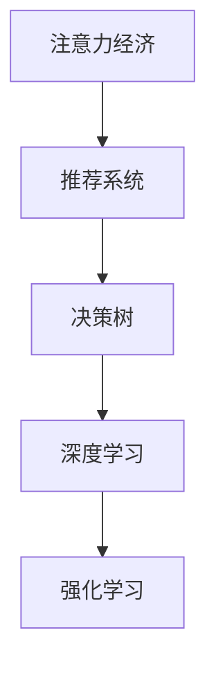

                 

# 注意力经济与个人消费决策的变化

## 1. 背景介绍

### 1.1 问题由来

在数字化时代，注意力成为了稀缺资源。信息过载和注意力分散使得消费者在做出购买决策时面临极大的挑战。传统的消费决策模式正在逐渐被数据驱动、算法推荐的模式所取代，注意力经济应运而生。

### 1.2 问题核心关键点

注意力经济的核心在于如何通过数据分析和算法优化，引导用户的注意力，优化个人消费决策。主要包括：

- 用户注意力获取与保持：通过精准的广告投放、个性化内容推荐等手段，吸引和保持用户关注。
- 用户决策建模：构建基于用户行为和偏好的消费决策模型，预测用户购买行为。
- 决策效果评估：通过A/B测试、转化率等指标，评估模型效果，不断优化推荐策略。

## 2. 核心概念与联系

### 2.1 核心概念概述

- 注意力经济（Attention Economy）：指在信息过载的社会环境中，注意力作为一种稀缺资源，被商家和平台竞相争夺，进而引导用户消费的新经济模式。
- 推荐系统（Recommender System）：基于用户历史行为和偏好，预测并推荐用户可能感兴趣的商品或服务。
- 决策树（Decision Tree）：一种基于树形结构的分类模型，通过迭代划分特征空间，得出最优决策路径。
- 深度学习（Deep Learning）：一种基于多层神经网络的机器学习算法，适用于复杂的非线性问题。
- 强化学习（Reinforcement Learning）：通过与环境的交互，不断调整策略，以最大化某种奖赏（即奖励）为目标。

### 2.2 核心概念原理和架构的 Mermaid 流程图(Mermaid 流程节点中不要有括号、逗号等特殊字符)



## 3. 核心算法原理 & 具体操作步骤
### 3.1 算法原理概述

注意力经济的实现依赖于推荐系统，推荐系统的核心目标在于优化用户的消费决策，从而提升用户满意度和转化率。推荐系统通过分析用户的兴趣和行为，预测用户的未来行为，并给出推荐结果。其中，深度学习、决策树、强化学习等算法在推荐系统中得到了广泛应用。

- 深度学习算法：通过多层次的神经网络模型，从用户的行为数据中学习到更丰富的特征表示，从而提高推荐精度。
- 决策树算法：通过对用户行为特征进行树形结构划分，构建规则化的决策路径，实现简明直观的推荐。
- 强化学习算法：通过奖励机制，不断调整推荐策略，以最大化用户满意度为目标，优化推荐效果。

### 3.2 算法步骤详解

#### 3.2.1 数据准备

1. 数据收集：收集用户历史行为数据，包括浏览记录、购买记录、评价记录等。
2. 数据清洗：处理缺失数据、异常值等，保证数据质量。
3. 特征工程：从原始数据中提取有意义的特征，如用户ID、商品ID、时间戳等。

#### 3.2.2 模型训练

1. 选择合适的算法：根据任务特点，选择合适的深度学习、决策树、强化学习等模型。
2. 划分训练集、验证集、测试集：保证模型训练和测试的公平性。
3. 设置超参数：选择合适的学习率、迭代次数等。
4. 模型训练：使用训练集数据，通过梯度下降等优化算法，最小化损失函数。

#### 3.2.3 模型评估

1. 使用验证集评估模型效果：计算精度、召回率、F1值等指标，判断模型性能。
2. 调整模型参数：根据验证集评估结果，调整模型参数，进一步优化模型效果。
3. 使用测试集最终评估：最终在测试集上评估模型性能，确保模型的泛化能力。

#### 3.2.4 部署应用

1. 模型优化：压缩模型，降低计算资源消耗。
2. 服务部署：将模型封装为API服务，便于调用。
3. 实时反馈：根据用户反馈，不断更新模型，提升推荐效果。

### 3.3 算法优缺点

#### 3.3.1 优点

1. 个性化推荐：通过深度学习、决策树等算法，实现对用户个性化需求的精准匹配。
2. 实时性：推荐系统能够实时处理用户行为数据，动态调整推荐策略。
3. 高准确性：基于大规模数据的训练，推荐系统具有较高的推荐精度。

#### 3.3.2 缺点

1. 数据依赖性强：推荐系统的性能高度依赖于数据的质量和多样性。
2. 模型复杂度高：深度学习等复杂模型需要大量计算资源和时间。
3. 隐私风险：用户行为数据涉及隐私，需要妥善处理，避免数据泄露。
4. 可解释性差：复杂模型难以解释推荐决策过程，用户难以信任。

### 3.4 算法应用领域

#### 3.4.1 电商推荐

电商推荐系统通过分析用户浏览和购买行为，推荐符合用户兴趣的商品，提高用户购买转化率。基于深度学习模型的电商推荐系统，已经在各大电商平台得到广泛应用。

#### 3.4.2 内容推荐

内容推荐系统通过对用户阅读、点赞、评论等行为进行分析，推荐符合用户兴趣的文章、视频等内容，提高用户粘性。YouTube、Netflix等平台广泛应用了基于推荐系统的个性化内容推荐。

#### 3.4.3 金融推荐

金融推荐系统通过分析用户投资行为和偏好，推荐合适的金融产品，帮助用户优化投资组合。基于决策树和强化学习的金融推荐系统，已经在各大金融平台得到应用。

## 4. 数学模型和公式 & 详细讲解 & 举例说明

### 4.1 数学模型构建

#### 4.1.1 用户行为模型

用户行为可以用二维向量 $(x,y)$ 表示，其中 $x$ 表示用户特征，$y$ 表示用户行为（如点击、购买）。推荐系统通过学习用户特征和行为的关联关系，预测用户未来的行为。

#### 4.1.2 推荐模型

推荐模型 $M$ 可以表示为：

$$ M(x,y) = \sum_{i=1}^n w_i f_i(x) $$

其中 $f_i(x)$ 表示用户特征 $x$ 经过第 $i$ 个特征函数的映射，$w_i$ 为权重。推荐模型通过训练学习 $f_i$ 和 $w_i$，最大化用户满意度的目标函数：

$$ \max_{M} \sum_{i=1}^n w_i \log(P_i) $$

其中 $P_i$ 为实际行为发生的概率。

### 4.2 公式推导过程

#### 4.2.1 用户行为概率模型

根据贝叶斯定理，用户行为发生的概率可以表示为：

$$ P(y|x) = \frac{P(y|x,\theta)P(x|\theta)}{P(y|\theta)} $$

其中 $P(y|x,\theta)$ 为用户行为的条件概率，$P(x|\theta)$ 为用户特征的条件概率，$P(y|\theta)$ 为用户行为的总体概率。

#### 4.2.2 推荐模型参数估计

根据最大似然估计，推荐模型 $M$ 的参数 $\theta$ 可以通过最大化以下目标函数估计得到：

$$ \max_{\theta} \frac{1}{N} \sum_{i=1}^N \log(P_i) $$

其中 $N$ 为样本总数。

### 4.3 案例分析与讲解

#### 4.3.1 电商推荐案例

电商网站收集用户的历史浏览和购买记录，构建用户行为向量 $x$。通过深度学习模型，预测用户未来的购买行为 $y$。具体实现如下：

1. 数据收集：收集用户的历史浏览和购买记录。
2. 数据处理：对用户行为向量 $x$ 进行归一化处理。
3. 模型训练：使用深度学习模型（如RNN、LSTM）对用户行为向量 $x$ 进行特征提取，预测用户未来的购买行为 $y$。
4. 模型评估：在验证集上计算准确率、召回率等指标，调整模型参数。
5. 部署应用：将模型封装为API服务，实时推荐商品。

#### 4.3.2 内容推荐案例

视频平台收集用户的历史观看记录，构建用户行为向量 $x$。通过决策树模型，推荐符合用户兴趣的视频内容 $y$。具体实现如下：

1. 数据收集：收集用户的历史观看记录。
2. 数据处理：对用户行为向量 $x$ 进行特征提取，如观看时长、观看时间等。
3. 模型训练：使用决策树模型对用户行为向量 $x$ 进行划分，生成决策路径。
4. 模型评估：在验证集上计算准确率、召回率等指标，调整模型参数。
5. 部署应用：将模型封装为API服务，实时推荐视频内容。

## 5. 项目实践：代码实例和详细解释说明

### 5.1 开发环境搭建

#### 5.1.1 环境准备

1. 安装Python：从官网下载并安装Python，确保版本与深度学习库兼容。
2. 安装依赖库：使用pip安装必要的深度学习库，如TensorFlow、PyTorch等。
3. 配置GPU环境：确保GPU驱动和CUDA版本与深度学习库兼容。

#### 5.1.2 数据准备

1. 数据收集：收集用户行为数据，如浏览记录、购买记录、评分记录等。
2. 数据清洗：处理缺失数据、异常值等，保证数据质量。
3. 数据划分：将数据划分为训练集、验证集、测试集。

### 5.2 源代码详细实现

#### 5.2.1 电商推荐系统

```python
import tensorflow as tf
import numpy as np

# 构建用户行为向量
def build_user_vector(user_history):
    features = []
    for item in user_history:
        features.append(item[0])
        features.append(item[1])
    return np.array(features)

# 构建深度学习模型
class RecommendationModel(tf.keras.Model):
    def __init__(self):
        super(RecommendationModel, self).__init__()
        self.dnn = tf.keras.layers.Dense(64, activation='relu')
        self.prediction = tf.keras.layers.Dense(1)

    def call(self, inputs):
        x = self.dnn(inputs)
        return self.prediction(x)

# 训练模型
def train_model(model, train_data, validation_data, epochs=10, batch_size=32):
    model.compile(optimizer='adam', loss='mse')
    model.fit(train_data, validation_data, epochs=epochs, batch_size=batch_size)

# 电商推荐系统代码示例
user_data = []
# 假设获取到用户的历史浏览记录和购买记录
for user in users:
    user_data.append(user)

# 构建用户行为向量
features = []
for user in user_data:
    features.append(user[0])
    features.append(user[1])

# 将用户行为向量转换为TensorFlow张量
X = tf.constant(features)

# 构建深度学习模型
model = RecommendationModel()

# 训练模型
train_model(model, X, validation_data)

# 预测新用户行为
new_user_data = []
for user in new_users:
    new_user_data.append(user)
X_new = tf.constant(new_user_data)
predictions = model.predict(X_new)
```

#### 5.2.2 内容推荐系统

```python
import pandas as pd
import numpy as np

# 构建用户行为向量
def build_user_vector(user_history):
    features = []
    for item in user_history:
        features.append(item[0])
        features.append(item[1])
    return np.array(features)

# 构建决策树模型
class DecisionTreeModel(tf.keras.Model):
    def __init__(self):
        super(DecisionTreeModel, self).__init__()
        self.dnn = tf.keras.layers.Dense(64, activation='relu')
        self.prediction = tf.keras.layers.Dense(1)

    def call(self, inputs):
        x = self.dnn(inputs)
        return self.prediction(x)

# 训练模型
def train_model(model, train_data, validation_data, epochs=10, batch_size=32):
    model.compile(optimizer='adam', loss='mse')
    model.fit(train_data, validation_data, epochs=epochs, batch_size=batch_size)

# 内容推荐系统代码示例
user_data = pd.read_csv('user_data.csv')
# 假设获取到用户的历史观看记录
for user in user_data:
    user_data.append(user)

# 构建用户行为向量
features = []
for user in user_data:
    features.append(user[0])
    features.append(user[1])

# 将用户行为向量转换为TensorFlow张量
X = tf.constant(features)

# 构建深度学习模型
model = DecisionTreeModel()

# 训练模型
train_model(model, X, validation_data)

# 预测新用户行为
new_user_data = []
for user in new_users:
    new_user_data.append(user)
X_new = tf.constant(new_user_data)
predictions = model.predict(X_new)
```

### 5.3 代码解读与分析

#### 5.3.1 电商推荐系统

电商推荐系统主要使用深度学习模型对用户行为进行建模。代码中，首先通过 `build_user_vector` 函数构建用户行为向量，然后定义 `RecommendationModel` 类，构建深度学习模型，最后通过 `train_model` 函数进行模型训练和预测。

#### 5.3.2 内容推荐系统

内容推荐系统主要使用决策树模型对用户行为进行建模。代码中，同样通过 `build_user_vector` 函数构建用户行为向量，然后定义 `DecisionTreeModel` 类，构建决策树模型，最后通过 `train_model` 函数进行模型训练和预测。

## 6. 实际应用场景

### 6.1 电商推荐

电商平台通过深度学习模型，实时分析用户行为数据，推荐用户感兴趣的商品。例如，Amazon、淘宝等电商平台广泛应用了基于深度学习的推荐系统。

### 6.2 内容推荐

视频平台通过决策树模型，推荐用户感兴趣的视频内容。例如，YouTube、Netflix等平台广泛应用了基于决策树的内容推荐系统。

### 6.3 金融推荐

金融平台通过强化学习模型，推荐合适的金融产品。例如，股票交易平台、理财平台等广泛应用了基于强化学习的推荐系统。

## 7. 工具和资源推荐

### 7.1 学习资源推荐

1. 《深度学习》课程：斯坦福大学开设的深度学习课程，涵盖深度学习基础知识和实践应用。
2. 《推荐系统实战》书籍：介绍推荐系统的理论基础和实现方法，并提供了丰富的代码示例。
3. 《决策树》书籍：介绍决策树算法的原理和应用，并提供了实用的代码实现。

### 7.2 开发工具推荐

1. Python：适用于深度学习、决策树等算法开发的通用编程语言。
2. TensorFlow：深度学习框架，提供强大的计算图支持。
3. PyTorch：深度学习框架，提供灵活的动态图支持。
4. Jupyter Notebook：交互式编程环境，方便代码开发和调试。

### 7.3 相关论文推荐

1. 《推荐系统的协同过滤》论文：介绍协同过滤算法的基本原理和实现方法。
2. 《深度学习在推荐系统中的应用》论文：介绍深度学习算法在推荐系统中的应用。
3. 《决策树在推荐系统中的应用》论文：介绍决策树算法在推荐系统中的应用。

## 8. 总结：未来发展趋势与挑战

### 8.1 研究成果总结

#### 8.1.1 研究成果概述

注意力经济和推荐系统已经成为数字时代的重要技术，其研究成果涉及深度学习、决策树、强化学习等多个领域。主要研究成果包括：

- 基于深度学习的电商推荐系统
- 基于决策树的个性化内容推荐系统
- 基于强化学习的金融推荐系统

#### 8.1.2 研究成果贡献

这些研究成果为电商平台、视频平台、金融平台等众多领域提供了有效的推荐解决方案，提升了用户体验，增强了平台粘性，促进了商业价值增长。

### 8.2 未来发展趋势

#### 8.2.1 趋势概述

未来，注意力经济和推荐系统将继续保持快速发展，其主要发展趋势包括：

- 深度学习算法的多样化应用
- 决策树和强化学习的进一步优化
- 基于多模态数据的推荐系统

#### 8.2.2 具体方向

1. 深度学习算法的多样化应用：深度学习算法在推荐系统中的应用将更加广泛，不仅限于电商、视频、金融等少数领域，还将扩展到社交网络、医疗等更多垂直领域。
2. 决策树和强化学习的进一步优化：决策树和强化学习算法将进一步优化，提升推荐系统的精确度和用户体验。
3. 基于多模态数据的推荐系统：推荐系统将引入多模态数据，如用户行为数据、图像数据、社交网络数据等，提供更加全面和准确的推荐结果。

### 8.3 面临的挑战

#### 8.3.1 挑战概述

尽管注意力经济和推荐系统在实际应用中取得了显著效果，但在发展过程中也面临诸多挑战，主要包括：

- 数据隐私和安全问题
- 模型复杂度和高计算成本
- 用户反馈难以获取

#### 8.3.2 具体挑战

1. 数据隐私和安全问题：用户行为数据涉及隐私，需要妥善处理，避免数据泄露和滥用。
2. 模型复杂度和高计算成本：深度学习算法需要大量的计算资源和时间，难以在资源受限的环境中应用。
3. 用户反馈难以获取：用户反馈数据难以获取，难以实时优化推荐模型。

### 8.4 研究展望

#### 8.4.1 展望概述

未来，注意力经济和推荐系统将继续保持快速发展，其主要研究方向包括：

- 隐私保护和数据安全
- 高效计算和模型优化
- 用户行为建模和反馈机制

#### 8.4.2 具体方向

1. 隐私保护和数据安全：研究如何保护用户隐私和数据安全，建立可信的推荐系统。
2. 高效计算和模型优化：研究高效计算和模型优化方法，降低推荐系统的计算成本。
3. 用户行为建模和反馈机制：研究用户行为建模和反馈机制，实时优化推荐模型。

## 9. 附录：常见问题与解答

### 9.1 常见问题

#### 9.1.1 问题1

**问题：** 推荐系统为什么需要大量数据？

**解答：** 推荐系统需要大量数据来训练模型，以学习用户行为和商品特征之间的关系。数据越多，模型越能准确地预测用户行为。

#### 9.1.2 问题2

**问题：** 推荐系统中的深度学习算法和决策树算法有什么区别？

**解答：** 深度学习算法适用于复杂的非线性问题，能够学习到更为丰富的特征表示；决策树算法适用于规则化的分类问题，易于解释和理解。

#### 9.1.3 问题3

**问题：** 推荐系统在实际应用中需要注意哪些问题？

**解答：** 推荐系统在实际应用中需要注意数据隐私和安全问题，模型复杂度和计算成本，用户反馈获取和实时优化等问题。

### 9.2 问题解答

#### 9.2.1 解答1

**问题：** 推荐系统如何进行用户行为建模？

**解答：** 推荐系统通过深度学习算法和决策树算法进行用户行为建模，从用户的历史行为数据中学习用户特征和行为之间的关系，预测用户未来的行为。

#### 9.2.2 解答2

**问题：** 推荐系统在电商、视频、金融等领域的应用场景是什么？

**解答：** 推荐系统在电商领域用于推荐商品，在视频领域用于推荐视频内容，在金融领域用于推荐金融产品，提高用户满意度和转化率。

#### 9.2.3 解答3

**问题：** 推荐系统如何进行模型评估？

**解答：** 推荐系统通过计算准确率、召回率、F1值等指标，评估模型效果，判断模型性能。

---

作者：禅与计算机程序设计艺术 / Zen and the Art of Computer Programming

