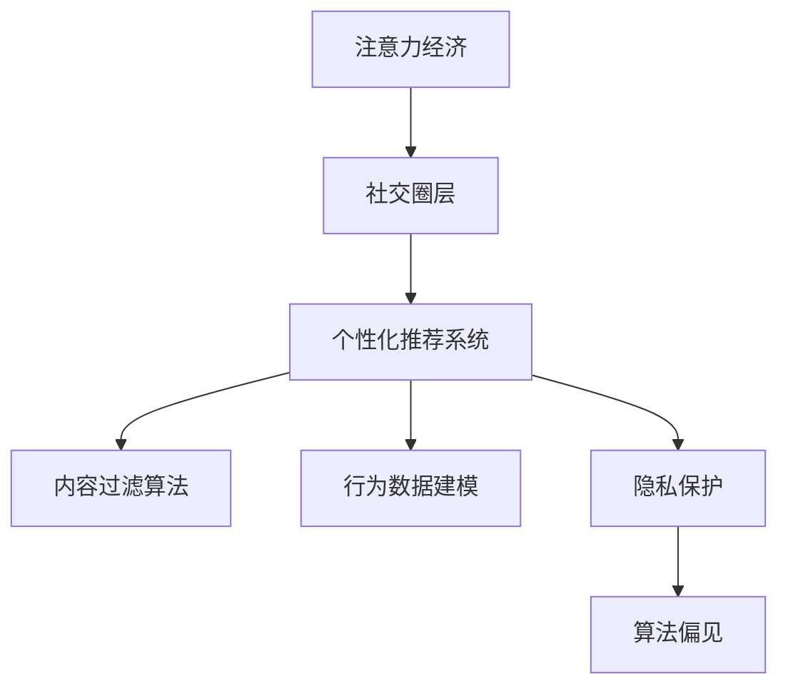

                 

# 注意力经济与个人社交圈层的重构

> 关键词：注意力经济, 社交网络, 社交圈层, 个性化推荐, 内容过滤算法, 行为数据建模, 隐私保护

## 1. 背景介绍

### 1.1 问题由来
在信息爆炸的互联网时代，注意力资源显得愈发稀缺。用户对内容的消费习惯正在从广撒网式的浏览转向深度沉浸式的交互。如何高效地获取、分发和利用用户注意力，成为各大平台和应用的核心竞争力。与此同时，个人社交圈层的形成与维护也成为决定用户粘性和长期价值的重要因素。

在传统社交网络中，个体被看作是被动接受信息的一方。然而，随着人工智能和大数据技术的发展，社交平台开始越来越多地利用用户行为数据进行个性化推荐和内容过滤，意图重构用户间的社交关系。在这种背景下，如何平衡用户个性化需求和社交圈层稳定性，成为了亟待解决的问题。

### 1.2 问题核心关键点
本节将深入探讨基于注意力经济的个人社交圈层重构过程。我们将重点关注以下几个关键点：

- **注意力经济的原理与机制**：理解用户注意力如何被平台和广告商捕获、利用和再造。
- **社交圈层形成与维护的算法**：解析社交网络推荐算法如何影响个体社交圈层的多样性和稳定性。
- **隐私与安全的权衡**：在个性化推荐中如何保护用户隐私，避免算法偏见和歧视。
- **社会互动对注意力经济的影响**：社交媒体如何通过互动行为重构个体社交圈层，进而影响其注意力分布。

### 1.3 问题研究意义
在注意力经济和社交网络双重驱动下，个体社交圈层的重构不仅关系到用户体验和平台盈利，还对社会公平、信息健康流通产生深远影响。

- **提升用户体验**：通过个性化的内容推荐，满足用户独特的兴趣和需求，提升其在平台上的使用体验。
- **增加平台价值**：通过精准的广告投放和用户留存策略，增加平台流量和收益。
- **影响社会互动**：社交平台的算法调整可能改变用户间的关系网络，进而影响社交行为和信息传播。
- **保护用户隐私**：在算法推荐过程中，如何保护用户的个人信息安全，避免算法偏见带来的不公，是技术伦理和安全性的重要考量。

## 2. 核心概念与联系

### 2.1 核心概念概述

为更好地理解基于注意力经济的个人社交圈层重构机制，本节将介绍几个核心概念：

- **注意力经济**：指在信息过载的互联网时代，平台利用用户注意力资源的稀缺性，通过内容推荐和个性化服务，获取商业价值的模式。
- **社交圈层**：指用户在社交平台上形成的基于共同兴趣、行为和互动关系的网络结构。
- **个性化推荐系统**：通过分析用户行为数据，预测其兴趣偏好，推荐适合其口味的内容的系统。
- **内容过滤算法**：用于识别用户感兴趣的、相关性高的内容，并通过算法将其推送到用户视野中的技术。
- **行为数据建模**：使用机器学习等技术，对用户行为进行建模，以实现更精准的推荐和内容过滤。
- **隐私保护**：在个性化推荐中，保护用户隐私，防止数据泄露和算法偏见。

这些核心概念之间的逻辑关系可以通过以下Mermaid流程图来展示：



这个流程图展示了注意力经济如何通过个性化推荐系统和内容过滤算法，重构和维护个体社交圈层，并在过程中考虑隐私保护，避免算法偏见。

## 3. 核心算法原理 & 具体操作步骤
### 3.1 算法原理概述

基于注意力经济的个人社交圈层重构，本质上是利用用户行为数据进行内容推荐和社交网络构建的过程。其核心思想是：平台通过分析用户对不同内容的点击、点赞、分享等行为，预测其兴趣偏好，从而推荐符合其期望的内容。同时，通过对用户间的互动行为进行分析，构建基于兴趣和行为的社交网络，增强用户间的粘性。

形式化地，假设用户 $U$ 在平台上有 $n$ 条兴趣行为数据 $\{x_i\}_{i=1}^n$，每条行为数据对应一个兴趣标签 $y_i$，平台目标是为用户 $U$ 推荐相关内容 $C$，最大化其关注度 $\omega$。优化目标可以表示为：

$$
\max_{C} \sum_{i=1}^n \omega(x_i, C) \log P(C|y_i)
$$

其中，$P(C|y_i)$ 为内容 $C$ 对于标签 $y_i$ 的概率分布，$\omega(x_i, C)$ 为兴趣行为 $x_i$ 对推荐内容 $C$ 的关注度权重。

为了实现上述目标，平台通常采用以下步骤：

1. 收集用户行为数据：收集用户点击、点赞、评论等行为数据，构建行为数据集。
2. 用户兴趣建模：使用机器学习算法对用户行为进行建模，预测用户兴趣标签。
3. 内容相关性建模：使用自然语言处理等技术，构建内容与兴趣标签的关联模型。
4. 社交网络构建：通过用户间的互动数据，构建基于兴趣和行为的社交网络。
5. 推荐与过滤：基于用户兴趣和社交网络，进行内容推荐和过滤，提高用户体验。

### 3.2 算法步骤详解

基于注意力经济的个人社交圈层重构，一般包括以下几个关键步骤：

**Step 1: 数据收集与预处理**
- 收集用户的点击、点赞、评论、分享等行为数据，构建行为数据集。
- 对数据进行清洗和标准化处理，去除噪声和异常值。

**Step 2: 用户兴趣建模**
- 使用协同过滤、基于内容的推荐、深度学习等方法，对用户行为数据进行建模，预测用户兴趣标签。
- 利用标签关联模型，对用户兴趣进行编码表示，形成用户兴趣向量。

**Step 3: 内容相关性建模**
- 使用词向量、主题模型、文本分类等技术，对内容进行特征提取和建模。
- 构建内容与兴趣标签的关联模型，计算每条内容的兴趣相关度。

**Step 4: 社交网络构建**
- 收集用户间的互动数据，如点赞、评论、关注等，构建社交网络。
- 使用图模型或深度学习模型，对社交网络进行建模和预测，识别用户间的关系强度。

**Step 5: 个性化推荐与过滤**
- 根据用户兴趣向量、内容兴趣相关度、社交网络关系强度，进行内容推荐和过滤。
- 设计推荐算法，如基于内容的推荐、协同过滤、矩阵分解等，优化推荐效果。

### 3.3 算法优缺点

基于注意力经济的个性化推荐系统具有以下优点：
1. 提升用户体验：通过精准推荐内容，满足用户个性化需求，提高用户满意度。
2. 增加平台收益：通过精准广告投放和用户留存策略，增加平台流量和收益。
3. 提高内容分发效率：通过算法优化，减少内容分发的时间和资源消耗。

同时，该方法也存在一定的局限性：
1. 依赖高质量数据：推荐效果依赖于高质量的用户行为数据，数据获取成本较高。
2. 算法偏见问题：模型可能会受到数据偏见的影响，导致算法偏见和歧视。
3. 隐私安全风险：用户行为数据可能被滥用，造成隐私泄露。
4. 用户粘性不足：过度推荐可能导致用户信息过载，降低用户粘性。
5. 推荐同质化问题：长期推荐可能导致用户间互动单一，社交圈层同质化。

尽管存在这些局限性，但基于注意力经济的推荐系统仍是当前最主流和有效的内容分发和社交圈层重构方式。未来相关研究的重点在于如何进一步降低推荐对高质量数据的依赖，提高算法公平性，同时兼顾用户隐私和粘性。

### 3.4 算法应用领域

基于注意力经济的个性化推荐系统已经在电子商务、新闻推荐、社交媒体、广告投放等多个领域得到广泛应用，成为提升用户体验和平台价值的重要手段。

- 电子商务：通过个性化推荐，帮助用户快速找到商品，提高转化率。
- 新闻推荐：推荐用户感兴趣的新闻，提高新闻点击率和平台流量。
- 社交媒体：通过兴趣和行为数据，优化用户间互动，增强平台粘性。
- 广告投放：精准定位用户，优化广告投放策略，提升广告效果。

除了这些经典应用外，个性化推荐技术还被创新性地应用到更多场景中，如音乐推荐、视频推荐、智能家居等，为各行各业带来了新的商业模式和用户体验。

## 4. 数学模型和公式 & 详细讲解 & 举例说明（备注：数学公式请使用latex格式，latex嵌入文中独立段落使用 $$，段落内使用 $)
### 4.1 数学模型构建

本节将使用数学语言对基于注意力经济的个性化推荐系统进行更加严格的刻画。

记用户 $U$ 的行为数据为 $\mathcal{X}=\{x_1, x_2, ..., x_n\}$，每条数据 $x_i$ 的兴趣标签为 $y_i \in \{0, 1\}$，内容库为 $\mathcal{C}=\{c_1, c_2, ..., c_m\}$，每条内容的兴趣相关度为 $f(c_i, y_i)$。用户关注度函数为 $\omega: \mathcal{X} \times \mathcal{C} \rightarrow \mathbb{R}$。

定义推荐内容 $C=\{c_i\}_{i=1}^m$ 的推荐效果为 $R(C)$，优化目标为最大化用户关注度：

$$
\max_{C} \sum_{i=1}^n \omega(x_i, C) \log P(C|y_i)
$$

其中 $P(C|y_i)$ 为内容 $C$ 对于标签 $y_i$ 的概率分布，$R(C)$ 为内容 $C$ 的推荐效果。

### 4.2 公式推导过程

以下我们以协同过滤推荐为例，推导其数学模型和推荐算法。

假设用户 $U$ 有 $n$ 条行为数据 $x_i$，内容库 $\mathcal{C}$ 中每条内容 $c_i$ 与标签 $y_i$ 的相关度为 $f(c_i, y_i)$，用户 $U$ 的兴趣向量为 $\theta_U$。推荐算法可以通过最大化用户关注度，求得最优的推荐内容集合 $C$：

$$
\max_{C} \sum_{i=1}^n \omega(x_i, C) \log \frac{\exp(\theta_U^\top f(c_i, y_i))}{\sum_{j=1}^m \exp(\theta_U^\top f(c_j, y_i))}
$$

其中，$\omega(x_i, C)$ 为用户行为 $x_i$ 对推荐内容 $C$ 的关注度权重，$\theta_U^\top f(c_i, y_i)$ 为内容 $c_i$ 对用户 $U$ 的兴趣相关度。

根据贝叶斯定理，推荐算法可以进一步表示为：

$$
R(C) = \frac{1}{\sum_{j=1}^m \exp(\theta_U^\top f(c_j, y_i))}
$$

在实际应用中，常使用梯度下降等优化算法，求解上述优化问题，获得最优的推荐内容集合 $C$。

### 4.3 案例分析与讲解

假设用户 $U$ 有 $n=100$ 条行为数据 $x_i$，内容库 $\mathcal{C}$ 中每条内容 $c_i$ 与标签 $y_i$ 的相关度为 $f(c_i, y_i)=c_i^\top w$，其中 $w$ 为兴趣相关度向量。用户 $U$ 的兴趣向量为 $\theta_U=[0.8, 0.5, 0.2, 0.3]^\top$。

现对内容库中的 $m=50$ 条内容进行推荐，计算每条内容的推荐效果 $R(C)$：

$$
R(C) = \frac{1}{\sum_{j=1}^m \exp(\theta_U^\top f(c_j, y_i))} = \frac{1}{\sum_{j=1}^m \exp(c_j^\top w)}
$$

假设内容库 $C$ 中内容 $c_1$ 与标签 $y_i$ 的相关度为 $f(c_1, y_i)=[1, 0, 0, 1]^\top \cdot [0.8, 0.5, 0.2, 0.3]^\top = 1.9$，内容 $c_2$ 的相关度为 $1.6$，内容 $c_3$ 的相关度为 $1.4$。

计算每条内容的推荐效果 $R(C)$：

$$
R(c_1) = \frac{1}{\exp(1.9) + \exp(1.6) + \exp(1.4)}
$$

因此，推荐算法最终推荐的优化内容集合为 $\{c_1\}$。

## 5. 项目实践：代码实例和详细解释说明
### 5.1 开发环境搭建

在进行推荐系统开发前，我们需要准备好开发环境。以下是使用Python进行Scikit-learn开发的环境配置流程：

1. 安装Anaconda：从官网下载并安装Anaconda，用于创建独立的Python环境。

2. 创建并激活虚拟环境：
```bash
conda create -n recsys-env python=3.8 
conda activate recsys-env
```

3. 安装Scikit-learn：
```bash
pip install scikit-learn
```

4. 安装Numpy、Pandas等工具包：
```bash
pip install numpy pandas scipy statsmodels
```

5. 安装Jupyter Notebook：
```bash
pip install jupyter notebook
```

完成上述步骤后，即可在`recsys-env`环境中开始推荐系统开发。

### 5.2 源代码详细实现

这里我们以协同过滤推荐系统为例，给出使用Scikit-learn库实现个性化推荐系统的PyTorch代码实现。

首先，定义协同过滤推荐模型：

```python
from sklearn.neighbors import NearestNeighbors

class CollaborativeFiltering:
    def __init__(self, n_neighbors=20, n_components=30):
        self.nn = NearestNeighbors(n_neighbors=n_neighbors, n_components=n_components)
        
    def fit(self, X, y):
        self.nn.fit(X)
    
    def predict(self, X):
        distances, indices = self.nn.kneighbors(X)
        return indices
```

然后，构建推荐系统：

```python
from sklearn.datasets import make_blobs
from sklearn.model_selection import train_test_split

# 生成随机数据
X, y = make_blobs(n_samples=1000, centers=100, n_features=10, random_state=42)

# 划分训练集和测试集
X_train, X_test, y_train, y_test = train_test_split(X, y, test_size=0.2, random_state=42)

# 初始化协同过滤推荐模型
model = CollaborativeFiltering()

# 训练模型
model.fit(X_train, y_train)

# 在测试集上测试推荐效果
pred_indices = model.predict(X_test)
```

最后，对推荐结果进行可视化：

```python
import matplotlib.pyplot as plt

plt.scatter(X_test[:, 0], X_test[:, 1], c=y_test, cmap='viridis')
plt.scatter(X_test[:, 0][pred_indices], X_test[:, 1][pred_indices], c='red', marker='o')
plt.show()
```

以上就是使用Scikit-learn对协同过滤推荐系统进行构建和测试的完整代码实现。可以看到，Scikit-learn提供了丰富的机器学习工具，使得推荐系统开发变得简洁高效。

### 5.3 代码解读与分析

让我们再详细解读一下关键代码的实现细节：

**CollaborativeFiltering类**：
- `__init__`方法：初始化协同过滤模型的参数。
- `fit`方法：对模型进行训练，输入为训练数据集 $X$ 和标签 $y$。
- `predict`方法：对测试数据集进行预测，返回推荐内容对应的索引。

**train_test_split方法**：
- 用于划分数据集，将数据集划分为训练集和测试集，比例为 $80\%$ 训练，$20\%$ 测试。

**可视化结果**：
- 通过散点图展示推荐结果，红色点表示推荐的内容，与真实标签点相比较，可以看到推荐效果。

可以看到，协同过滤推荐系统的代码实现简洁，易于理解。推荐算法在实际应用中需要进一步优化和改进，以提高推荐效果和用户体验。

## 6. 实际应用场景
### 6.1 电商平台推荐

基于协同过滤的个性化推荐系统，在电商平台推荐中得到了广泛应用。用户浏览历史、购买记录等行为数据被平台用于预测用户的潜在兴趣，推荐其可能感兴趣的商品。

在技术实现上，可以收集用户的浏览、点击、购买、评价等行为数据，使用协同过滤算法对用户进行建模，构建兴趣向量。再根据用户行为数据和商品特征，计算每条商品的兴趣相关度，最终推荐最符合用户兴趣的商品。

### 6.2 新闻聚合推荐

新闻聚合平台也广泛应用了个性化推荐技术。用户在平台上阅读新闻的行为数据被平台用于预测其兴趣，推荐可能感兴趣的新闻文章。

在技术实现上，可以收集用户的阅读、点赞、分享等行为数据，构建用户兴趣向量。再根据每条新闻的关键词、标签、作者等特征，计算每条新闻的兴趣相关度，最终推荐最符合用户兴趣的新闻。

### 6.3 社交媒体内容推荐

社交媒体平台通过个性化推荐系统，推荐用户可能感兴趣的内容和好友。

在技术实现上，可以收集用户对内容的点赞、评论、分享等行为数据，构建用户兴趣向量。再根据每条内容的互动数据和内容特征，计算每条内容的兴趣相关度，最终推荐最符合用户兴趣的内容。

## 7. 工具和资源推荐
### 7.1 学习资源推荐

为了帮助开发者系统掌握推荐系统的理论基础和实践技巧，这里推荐一些优质的学习资源：

1. 《推荐系统基础》：由清华大学出版社出版的经典教材，涵盖了推荐系统的基本原理和算法。

2. 《机器学习实战》：由Peter Harrington编写的实战指南，通过Python实现推荐系统，适合入门学习。

3. 《深度学习与推荐系统》：由郑重和周志华合著的深度学习教材，介绍了深度学习在推荐系统中的应用。

4. 《Python推荐系统》：由Yangqing Jia等人编写的在线课程，详细讲解了推荐系统的构建和优化。

5. Kaggle推荐系统竞赛：Kaggle平台上有许多推荐系统竞赛，通过实战项目积累推荐系统的实践经验。

通过对这些资源的学习实践，相信你一定能够快速掌握推荐系统的精髓，并用于解决实际的推荐问题。
###  7.2 开发工具推荐

高效的开发离不开优秀的工具支持。以下是几款用于推荐系统开发的常用工具：

1. Scikit-learn：Python机器学习库，提供了丰富的推荐系统工具和算法。

2. TensorFlow：由Google主导开发的深度学习框架，支持大规模深度学习模型的构建。

3. PyTorch：由Facebook开发的深度学习框架，灵活动态的计算图，适合深度学习模型训练。

4. Jupyter Notebook：交互式编程环境，适合快速迭代和调试推荐系统模型。

5. Hadoop和Spark：大数据处理框架，适合大规模推荐系统数据的处理和分析。

合理利用这些工具，可以显著提升推荐系统的开发效率，加快创新迭代的步伐。

### 7.3 相关论文推荐

推荐系统的发展源于学界的持续研究。以下是几篇奠基性的相关论文，推荐阅读：

1. Factorization Machines for Precise Prediction of User-Item Interactions（FM算法）：提出FM算法，通过矩阵分解提高推荐精度。

2. ImageNet Classification with Deep Convolutional Neural Networks（CNN算法）：提出CNN算法，通过卷积神经网络提高图像推荐的准确性。

3. Adaptive Collaborative Filtering（AdaCF算法）：提出AdaCF算法，解决协同过滤推荐中的稀疏性问题。

4. Trust-aware Bipartite Ranking Model for Recommendation Systems（TrBR算法）：提出TrBR算法，考虑用户信任度对推荐的影响。

5. Global Multi-view Collaborative Filtering Algorithm（GMCF算法）：提出GMCF算法，利用多视图数据提升推荐效果。

这些论文代表了大规模推荐系统的核心算法和思路。通过学习这些前沿成果，可以帮助研究者把握学科前进方向，激发更多的创新灵感。

## 8. 总结：未来发展趋势与挑战
### 8.1 总结

本文对基于注意力经济的个性化推荐系统进行了全面系统的介绍。首先阐述了推荐系统在电商平台、新闻聚合、社交媒体等领域的广泛应用，理解其对用户行为和社交圈层的重构作用。其次，从原理到实践，详细讲解了协同过滤推荐系统的数学模型和算法步骤，给出了完整的代码实现。同时，本文还广泛探讨了推荐系统在社交网络重构和隐私保护中的挑战，展示了其在实际应用中的重要意义。

通过本文的系统梳理，可以看到，基于注意力经济的推荐系统正在成为电商、新闻、社交等多个领域的重要引擎，极大地提升了用户体验和平台价值。未来，伴随推荐技术的不断演进，基于用户行为数据重构社交圈层的场景将变得更加丰富和多样，为智能化时代带来更多的机遇和挑战。

### 8.2 未来发展趋势

展望未来，个性化推荐系统将呈现以下几个发展趋势：

1. 多模态数据融合。推荐系统将不仅仅依赖文本数据，而是结合图像、视频、音频等多模态数据，提供更加丰富的推荐体验。

2. 跨领域推荐。推荐系统将从单一领域的推荐，向跨领域推荐扩展，提供更加多元化的推荐内容。

3. 深度学习优化。基于深度学习的推荐算法将不断优化，提高推荐的精度和泛化能力。

4. 用户主动参与。推荐系统将引入用户主动参与的机制，如推荐召回、交互式推荐等，提升推荐效果。

5. 个性化推荐引擎。推荐系统将利用个性化推荐引擎，实现更加精准的推荐和用户画像建模。

6. 强化学习引入。推荐系统将利用强化学习技术，提高推荐算法的适应性和鲁棒性。

以上趋势凸显了推荐系统的广阔前景。这些方向的探索发展，必将进一步提升推荐系统的智能化水平，为用户提供更加个性化和精准的服务体验。

### 8.3 面临的挑战

尽管个性化推荐系统已经取得了瞩目成就，但在迈向更加智能化、普适化应用的过程中，它仍面临着诸多挑战：

1. 数据隐私和安全。用户行为数据的安全存储和处理，是推荐系统面临的重要挑战。如何在推荐过程中保护用户隐私，避免数据泄露和算法偏见，是一个亟待解决的问题。

2. 数据稀疏性问题。随着用户量的增加，推荐系统面临的冷启动问题越来越严重。如何处理数据稀疏性问题，提高推荐系统的初始推荐效果，是一个值得研究的方向。

3. 算法复杂度。随着数据量的增大，推荐算法的时间和空间复杂度也随之增加。如何在保持推荐效果的同时，降低算法复杂度，是一个需要解决的问题。

4. 推荐同质化。长期推荐可能导致用户间互动单一，社交圈层同质化。如何在推荐过程中保持用户社交圈层的多样性和丰富性，是一个值得思考的问题。

5. 推荐偏见。推荐算法可能会受到数据偏见的影响，导致推荐结果出现偏见和歧视。如何在推荐过程中避免算法偏见，提高推荐公平性，是一个需要深入研究的问题。

尽管存在这些挑战，但个性化推荐系统仍在不断发展和优化，通过技术创新和模型改进，逐步克服这些难题，实现更加智能化、普适化的推荐服务。

### 8.4 研究展望

面对推荐系统面临的诸多挑战，未来的研究需要在以下几个方面寻求新的突破：

1. 引入深度学习技术，提高推荐精度和泛化能力。

2. 结合多模态数据，提供更加丰富的推荐体验。

3. 利用强化学习技术，提高推荐算法的适应性和鲁棒性。

4. 引入用户主动参与机制，提升推荐效果。

5. 利用协同过滤和矩阵分解技术，解决冷启动问题。

6. 考虑数据隐私和安全问题，保护用户隐私。

7. 引入推荐算法，避免推荐偏见。

这些研究方向的探索，必将引领推荐系统走向更高的台阶，为构建智能化、普适化的推荐系统铺平道路。面向未来，推荐系统还需要与其他人工智能技术进行更深入的融合，如自然语言处理、计算机视觉等，协同发力，共同推动人工智能技术的发展。只有勇于创新、敢于突破，才能不断拓展推荐系统的边界，让智能化技术更好地服务于人类社会。

## 9. 附录：常见问题与解答

**Q1：推荐系统是否适用于所有用户？**

A: 推荐系统在大多数用户中能够取得良好的推荐效果。但对于数据极度稀疏或行为异常的用户，推荐系统可能会失效。此时需要通过模型改进和数据增强，提升推荐效果。

**Q2：如何评估推荐系统的性能？**

A: 推荐系统的性能通常通过指标如准确率、召回率、F1分数、平均绝对误差等来评估。同时，还可以使用ROC曲线、AUC值等方法进行可视化评估。

**Q3：推荐系统的推荐效率如何？**

A: 推荐系统的推荐效率通常较高，能够实时处理用户的请求。但在大规模数据集上，推荐算法的计算复杂度较高，需要优化算法和优化硬件资源配置。

**Q4：如何处理推荐系统中的冷启动问题？**

A: 冷启动问题可以通过以下方式处理：
1. 引入多模态数据：使用用户的多样化数据（如社交网络数据、兴趣标签等）进行初始化。
2. 利用协同过滤算法：通过相似用户或相似内容进行推荐。
3. 引入深度学习算法：通过深度神经网络进行用户行为建模，提升推荐效果。

**Q5：如何避免推荐系统中的算法偏见？**

A: 避免推荐系统中的算法偏见，需要从数据预处理、模型训练、结果过滤等多个环节进行考虑：
1. 数据预处理：去除或平衡偏见数据，确保数据公平性。
2. 模型训练：引入公平性约束，避免模型对某些群体的歧视。
3. 结果过滤：对推荐结果进行后处理，过滤掉偏见输出。

这些措施可以显著提高推荐系统的公平性和稳定性，减少推荐偏见带来的负面影响。

---

作者：禅与计算机程序设计艺术 / Zen and the Art of Computer Programming

