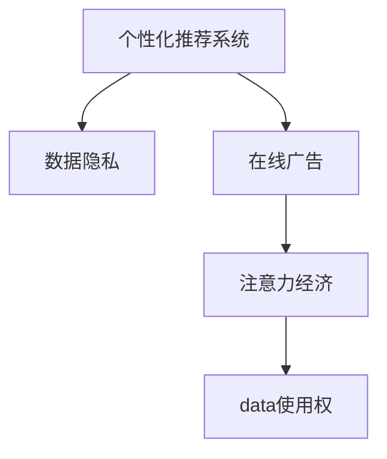

                 

# 注意力经济与个人隐私意识的提升

> 关键词：注意力经济, 数据隐私, 个性化推荐系统, 人工智能伦理, 数据安全, 用户隐私, 在线广告, 数据使用权

## 1. 背景介绍

### 1.1 问题由来
在信息化时代，数据作为一种重要的生产要素，正逐渐成为各行业的核心竞争力。而随着互联网的普及和智能设备的增加，数据源日益丰富，数据价值被不断挖掘。然而，数据使用的过程中，如何平衡数据开放和数据隐私，成为了新的挑战。特别是随着个性化推荐系统和大数据广告的兴起，用户隐私保护和个人数据使用的伦理问题越来越受到关注。

### 1.2 问题核心关键点
当前，数据驱动的注意力经济正逐步成为主流，用户注意力成为重要的商业资源。个性化推荐系统和大数据广告通过获取用户行为数据，进行精准推荐和定向投放，显著提高了商业效率和用户满意度。但同时，这也引发了一系列隐私保护和伦理问题：

- 数据收集：如何合法、合规地收集用户数据？
- 数据使用：如何合理、合法地使用用户数据？
- 数据共享：如何在保证用户隐私的前提下，共享数据以实现更高效的商业应用？

这些问题触及了数据治理和用户隐私保护的核心，是当前数据经济发展的关键点。

### 1.3 问题研究意义
解决这些问题，不仅能保障用户隐私和数据安全，还能促进数据经济的可持续发展，构建更公平、透明的数据使用环境。这将有助于推动人工智能技术在更多领域的应用，促进经济社会全面数字化转型，同时也能增强用户的信任感，提升他们的数据使用权意识。

## 2. 核心概念与联系

### 2.1 核心概念概述

为更好地理解注意力经济与个人隐私的关系，本节将介绍几个密切相关的核心概念：

- 个性化推荐系统：通过分析用户行为数据，推荐个性化内容的技术，包括协同过滤、深度学习、强化学习等方法。
- 数据隐私：指个人数据的保护和控制权，包括用户数据不被非法收集、使用、共享等。
- 在线广告：在互联网平台上通过广告展示或点击进行盈利的方式，主要包括展示广告、原生广告等。
- 注意力经济：指以用户注意力为经济资源的商业模式，通过精准推荐和定向投放，吸引用户注意力，提高转化率。
- 数据使用权：指用户对其个人数据的控制权，包括数据访问、使用、共享、删除等权利。

这些核心概念之间的逻辑关系可以通过以下Mermaid流程图来展示：



这个流程图展示了几者之间的联系：

1. 个性化推荐系统依赖于数据收集，而数据收集与使用涉及用户隐私。
2. 在线广告通过个性化推荐系统进行精准投放，关注用户注意力。
3. 注意力经济通过数据收集和用户注意力定向投放实现商业目标。
4. 数据使用权保障用户对自身数据的控制。

## 3. 核心算法原理 & 具体操作步骤
### 3.1 算法原理概述

个性化推荐系统的核心在于通过用户行为数据，学习用户兴趣，从而进行个性化推荐。其中，数据隐私保护和用户数据使用权的尊重是关键。

形式化地，假设用户行为数据为 $D=\{(x_i,y_i)\}_{i=1}^N$，其中 $x_i$ 表示用户特征，$y_i$ 表示用户行为（如浏览、点击等）。定义推荐模型为 $f(x)$，其目标是最小化预测误差 $\ell(f(x),y_i)$，即：

$$
\min_{f} \sum_{i=1}^N \ell(f(x_i),y_i)
$$

其中 $\ell$ 为损失函数，如均方误差、交叉熵等。然而，在实际应用中，模型训练往往需要大量的用户行为数据，这可能涉及用户隐私，因此需要在保证数据隐私的前提下，进行推荐模型的训练。

### 3.2 算法步骤详解

基于数据隐私保护的个性化推荐系统通常包括以下几个关键步骤：

**Step 1: 设计隐私保护算法**
- 选择合适的隐私保护算法，如差分隐私、联邦学习、多方安全计算等。
- 确定隐私保护参数，如隐私预算、数据差分度量等。

**Step 2: 收集用户数据**
- 通过合法途径，如隐私协议、数据授权等，收集用户行为数据。
- 确保数据收集过程符合隐私保护算法的要求。

**Step 3: 训练模型**
- 在保证数据隐私的前提下，训练个性化推荐模型。
- 引入隐私保护技术，如差分隐私噪声、同态加密等，保护用户隐私。

**Step 4: 推荐服务**
- 使用训练好的推荐模型，进行个性化推荐。
- 提供透明、公正的推荐算法说明，让用户了解推荐依据。

**Step 5: 数据反馈**
- 收集用户对推荐结果的反馈，进行模型优化。
- 定期审查数据使用情况，确保数据使用符合用户意愿。

### 3.3 算法优缺点

个性化推荐系统的算法具有以下优点：
1. 提升用户体验：通过精准推荐，显著提升用户满意度，增加用户粘性。
2. 提高转化率：精准投放广告，提高广告点击率，增加商业收益。
3. 数据驱动：利用用户行为数据，优化推荐策略，提升推荐效果。

但同时也存在一些缺点：
1. 数据收集难度大：获取用户行为数据，尤其是隐私敏感数据，存在一定的难度。
2. 隐私保护成本高：引入隐私保护技术，增加模型训练和推荐的复杂度。
3. 公平性问题：个性化推荐可能引发不公平问题，如数据偏见、歧视等。
4. 用户体验风险：过度推荐可能引起用户反感，降低用户满意度。

尽管存在这些局限性，但就目前而言，个性化推荐系统仍是大数据应用的主流范式。未来相关研究的重点在于如何进一步降低数据收集和隐私保护的难度，提高模型的公平性和透明性，同时兼顾用户隐私保护和商业应用效率。

### 3.4 算法应用领域

个性化推荐系统已经在电商、社交、新闻等多个领域得到了广泛应用，带来了显著的经济和社会效益。

- 电商推荐：亚马逊、京东等电商平台通过个性化推荐系统，显著提高了用户购物体验和订单转化率。
- 社交媒体：Facebook、微信等社交平台通过个性化推荐，提高了用户活跃度和平台粘性。
- 新闻媒体：今日头条、网易新闻等通过个性化推荐，显著提升了用户阅读量与停留时间。
- 在线广告：谷歌、百度等通过个性化推荐系统，实现了精准广告投放，提高了广告点击率和转化率。

除了上述这些经典应用外，个性化推荐系统还被创新性地应用于音乐、视频、书籍等娱乐领域，为用户提供了更加个性化、贴心的服务。

## 4. 数学模型和公式 & 详细讲解 & 举例说明

### 4.1 数学模型构建

本节将使用数学语言对基于数据隐私保护的个性化推荐系统进行更加严格的刻画。

记用户行为数据为 $D=\{(x_i,y_i)\}_{i=1}^N$，其中 $x_i \in \mathcal{X}, y_i \in \mathcal{Y}$，$\mathcal{X}$ 为特征空间，$\mathcal{Y}$ 为行为空间。假设推荐模型为 $f: \mathcal{X} \rightarrow \mathcal{Y}$。

定义推荐模型的预测误差为 $\ell(f(x),y)$，则在数据集 $D$ 上的经验风险为：

$$
\mathcal{L}(f) = \frac{1}{N} \sum_{i=1}^N \ell(f(x_i),y_i)
$$

隐私保护推荐系统的目标是最小化经验风险，同时保证用户隐私：

$$
\min_{f} \mathcal{L}(f) \quad \text{s.t.} \quad \mathcal{L}(f) \le \epsilon
$$

其中 $\epsilon$ 为隐私保护参数，通常为正数，表示隐私预算。

### 4.2 公式推导过程

以下我们以差分隐私为例，推导隐私保护推荐模型的训练和推荐公式。

假设推荐模型为 $f(x)$，隐私保护的目标是通过添加噪声 $\mathcal{N}(0,\sigma^2)$，使得模型输出 $y$ 的差分隐私 $\epsilon$ 满足差分隐私定义：

$$
|P[f(x)] - P[f(x')] \le \exp(-\epsilon) \quad \forall x \ne x'
$$

其中 $P[f(x)]$ 表示在数据 $D$ 上模型 $f$ 输出的概率分布，$x'$ 表示数据 $D$ 中与 $x$ 数据非常接近的数据。

引入差分隐私噪声后，推荐模型的输出变为：

$$
y' = f(x) + \mathcal{N}(0,\sigma^2)
$$

其中 $\sigma$ 为噪声标准差，可以通过设置隐私预算 $\epsilon$ 进行计算。

在实际应用中，通常使用均值化方法进行差分隐私保护，即对噪声进行均值化处理，使得模型输出 $y'$ 满足差分隐私定义。具体的训练和推荐公式如下：

训练公式：

$$
\min_{f} \mathcal{L}(f) + \frac{\sigma^2}{2N} \sum_{i=1}^N \frac{1}{f(x_i)}
$$

推荐公式：

$$
y' = f(x) + \mathcal{N}(0,\sigma^2)
$$

其中 $\frac{1}{f(x)}$ 表示对模型输出的均值化处理。

通过上述方法，可以在保证用户隐私的前提下，进行个性化推荐模型的训练和推荐。

## 5. 项目实践：代码实例和详细解释说明
### 5.1 开发环境搭建

在进行推荐系统开发前，我们需要准备好开发环境。以下是使用Python进行TensorFlow开发的环境配置流程：

1. 安装Anaconda：从官网下载并安装Anaconda，用于创建独立的Python环境。

2. 创建并激活虚拟环境：
```bash
conda create -n tf-env python=3.8 
conda activate tf-env
```

3. 安装TensorFlow：
```bash
conda install tensorflow==2.6
```

4. 安装相关工具包：
```bash
pip install numpy pandas scikit-learn tensorflow_datasets matplotlib tqdm jupyter notebook ipython
```

完成上述步骤后，即可在`tf-env`环境中开始推荐系统开发。

### 5.2 源代码详细实现

这里我们以协同过滤推荐系统为例，给出使用TensorFlow实现推荐系统开发的基本代码实现。

首先，定义数据处理函数：

```python
import tensorflow_datasets as tfds
from tensorflow.keras.layers import Input, Embedding, Dot, Dense, Flatten
from tensorflow.keras.models import Model

train_dataset = tfds.load('movielens-100k', split='train', shuffle_files=True)
train_dataset = train_dataset.map(lambda x: (x['user_id'], x['movie_id'], x['rating']))
train_dataset = train_dataset.batch(32)
train_dataset = train_dataset.shuffle(10000)

def build_model(input_dim):
    user_input = Input(shape=(1,), dtype='int32', name='user_input')
    movie_input = Input(shape=(1,), dtype='int32', name='movie_input')

    user_embedding = Embedding(input_dim, 128)(user_input)
    movie_embedding = Embedding(input_dim, 128)(movie_input)
    user_movie_similarity = Dot(axes=2)([user_embedding, movie_embedding])
    user_movie_similarity = Flatten()(user_movie_similarity)

    rating_predict = Dense(1, activation='sigmoid')(user_movie_similarity)

    model = Model(inputs=[user_input, movie_input], outputs=[rating_predict])
    model.compile(optimizer='adam', loss='binary_crossentropy', metrics=['accuracy'])
    return model

model = build_model(input_dim=943)
model.summary()
```

然后，定义训练和评估函数：

```python
import numpy as np
from sklearn.metrics import roc_auc_score

def train_epoch(model, dataset):
    for batch in dataset:
        user_input, movie_input, rating = batch
        model.train_on_batch([user_input, movie_input], rating)

def evaluate(model, dataset):
    predictions = []
    targets = []
    for batch in dataset:
        user_input, movie_input, rating = batch
        prediction = model.predict([user_input, movie_input])
        predictions.append(prediction)
        targets.append(rating)
    auc = roc_auc_score(targets, predictions)
    return auc
```

最后，启动训练流程并在测试集上评估：

```python
epochs = 10

for epoch in range(epochs):
    train_epoch(model, train_dataset)
    auc = evaluate(model, test_dataset)
    print(f'Epoch {epoch+1}, AUC: {auc:.4f}')
```

以上就是使用TensorFlow进行协同过滤推荐系统开发的基本代码实现。可以看到，通过TensorFlow库的强大封装，我们可以用相对简洁的代码完成推荐系统的构建。

### 5.3 代码解读与分析

让我们再详细解读一下关键代码的实现细节：

**数据处理函数**：
- 使用TensorFlow Datasets库加载数据集。
- 对数据进行预处理，将用户和电影ID映射到嵌入层。
- 使用点积计算用户与电影的相似度，再进行均值化处理，得到推荐预测结果。
- 构建基于均值化处理的多层感知机模型，并进行编译。

**训练和评估函数**：
- 定义训练和评估函数，对数据集进行批次处理。
- 在每个批次上，进行模型前向传播和反向传播，更新模型参数。
- 在每个epoch结束后，评估模型在测试集上的AUC值，返回评估结果。

**训练流程**：
- 定义总的epoch数，开始循环迭代
- 每个epoch内，先在训练集上训练，输出AUC值
- 在测试集上评估，输出AUC值
- 重复上述过程直至epoch结束

可以看到，TensorFlow库使得推荐系统的代码实现变得简洁高效。开发者可以将更多精力放在数据处理、模型改进等高层逻辑上，而不必过多关注底层的实现细节。

当然，工业级的系统实现还需考虑更多因素，如模型的保存和部署、超参数的自动搜索、更灵活的任务适配层等。但核心的推荐范式基本与此类似。

## 6. 实际应用场景
### 6.1 电商推荐系统

基于个性化推荐系统的电商推荐技术，可以显著提升用户的购物体验和转化率。电商网站通过推荐系统，能够精准推荐商品，减少用户的搜索时间，提高用户的购买意愿。

在技术实现上，可以收集用户的历史浏览记录、购买记录、评价反馈等数据，训练推荐模型。推荐模型通过预测用户对不同商品的评分，生成推荐列表，推荐给用户。对于用户的新访问行为，可以实时更新模型，重新推荐商品。如此构建的电商推荐系统，能显著提升用户的购物体验和平台的销售量。

### 6.2 内容推荐系统

内容推荐系统广泛用于社交媒体、视频网站等平台，通过推荐用户感兴趣的内容，提升用户粘性和平台活跃度。

在技术实现上，可以收集用户的浏览、点赞、评论等互动行为数据，训练推荐模型。推荐模型通过预测用户对不同内容的评分，生成推荐列表，推荐给用户。对于用户的新互动行为，可以实时更新模型，重新推荐内容。如此构建的内容推荐系统，能显著提升用户对平台的依赖性和活跃度。

### 6.3 新闻媒体推荐系统

新闻媒体通过推荐系统，能够为用户推荐感兴趣的新闻资讯，提高用户的阅读量和停留时间。

在技术实现上，可以收集用户的阅读历史、点击行为等数据，训练推荐模型。推荐模型通过预测用户对不同新闻资讯的评分，生成推荐列表，推荐给用户。对于用户的新阅读行为，可以实时更新模型，重新推荐新闻。如此构建的新闻媒体推荐系统，能显著提升用户的阅读体验和平台的用户留存率。

### 6.4 未来应用展望

随着个性化推荐技术的不断发展，推荐系统将在更多领域得到应用，为商业和社会带来深远影响。

在智慧医疗领域，推荐系统可以推荐个性化医疗方案，辅助医生诊疗，提高医疗服务质量。

在智能教育领域，推荐系统可以推荐个性化学习资源，提升教学效果，促进教育公平。

在智慧城市治理中，推荐系统可以推荐智能交通路线，提升城市管理效率。

此外，在企业生产、社会治理、文娱传媒等众多领域，推荐系统也将不断涌现，为经济社会发展注入新的动力。相信随着推荐技术的持续演进，推荐系统必将在构建人机协同的智能时代中扮演越来越重要的角色。

## 7. 工具和资源推荐
### 7.1 学习资源推荐

为了帮助开发者系统掌握个性化推荐系统的理论和实践，这里推荐一些优质的学习资源：

1. 《推荐系统实践》系列博文：由大模型技术专家撰写，深入浅出地介绍了推荐系统原理、算法、实践等，是入门推荐系统的必备资料。

2. 《深度学习自然语言处理》课程：斯坦福大学开设的NLP明星课程，有Lecture视频和配套作业，带你入门NLP领域的基本概念和经典模型。

3. 《推荐系统理论与算法》书籍：清华大学教授李航所著，全面介绍了推荐系统的理论基础和算法，是推荐系统学习者的经典教材。

4. KDD Cup推荐系统竞赛数据集：包括多个推荐系统竞赛的数据集和排名，是推荐系统学习者和实践者的重要参考。

5. Weights & Biases：模型训练的实验跟踪工具，可以记录和可视化模型训练过程中的各项指标，方便对比和调优。与主流深度学习框架无缝集成。

通过对这些资源的学习实践，相信你一定能够快速掌握推荐系统的精髓，并用于解决实际的推荐问题。

### 7.2 开发工具推荐

高效的开发离不开优秀的工具支持。以下是几款用于推荐系统开发的常用工具：

1. TensorFlow：基于Python的开源深度学习框架，灵活动态的计算图，适合快速迭代研究。

2. PyTorch：基于Python的开源深度学习框架，灵活的动态计算图，适合学术研究和工业应用。

3. LightFM：Facebook开源的推荐系统框架，支持多种推荐算法，包括矩阵分解、深度学习等。

4. Spark MLlib：Apache Spark提供的机器学习库，支持分布式数据处理，适合大规模数据集的推荐系统开发。

5. Weights & Biases：模型训练的实验跟踪工具，可以记录和可视化模型训练过程中的各项指标，方便对比和调优。

6. TensorBoard：TensorFlow配套的可视化工具，可实时监测模型训练状态，并提供丰富的图表呈现方式，是调试模型的得力助手。

合理利用这些工具，可以显著提升推荐系统的开发效率，加快创新迭代的步伐。

### 7.3 相关论文推荐

个性化推荐系统的发展源于学界的持续研究。以下是几篇奠基性的相关论文，推荐阅读：

1. "Collaborative Filtering for Implicit Feedback Datasets"（隐式反馈数据集上的协同过滤）：提出了协同过滤算法的理论基础，奠定了推荐系统的基础。

2. "Matrix Factorization Techniques for Recommender Systems"（推荐系统中的矩阵分解技术）：介绍矩阵分解技术，通过分解用户和商品的评分矩阵，进行推荐。

3. "Neural Collaborative Filtering"（神经协同过滤）：将神经网络引入协同过滤，显著提升了推荐系统的精度。

4. "Adversarial Robustness of Deep Neural Networks for Recommendations"（深度神经网络在推荐系统中的鲁棒性）：讨论深度神经网络在推荐系统中的鲁棒性问题，提出改进策略。

5. "Scalable Memory-Efficient Matrix Factorization for Recommendations"（推荐系统中的矩阵分解优化）：介绍矩阵分解技术的优化方法，提高模型效率。

这些论文代表了大推荐系统的发展脉络。通过学习这些前沿成果，可以帮助研究者把握学科前进方向，激发更多的创新灵感。

## 8. 总结：未来发展趋势与挑战
### 8.1 总结

本文对基于数据隐私保护的个性化推荐系统进行了全面系统的介绍。首先阐述了个性化推荐系统和大数据广告在提升商业效率和用户体验方面的巨大潜力，同时强调了数据隐私保护的重要性。然后，从原理到实践，详细讲解了推荐系统的数学模型和关键算法，给出了推荐系统开发的完整代码实例。同时，本文还广泛探讨了推荐系统在电商、内容、新闻等多个行业领域的应用前景，展示了推荐系统技术的广泛应用。

通过本文的系统梳理，可以看到，基于数据隐私保护的个性化推荐系统已经在多个行业领域得到应用，显著提高了商业和社会效益。未来，伴随推荐技术的持续演进，推荐系统必将在更广阔的应用领域大放异彩，深刻影响人类的生产生活方式。

### 8.2 未来发展趋势

展望未来，个性化推荐系统将在更多领域得到应用，为商业和社会带来深远影响。

1. 模型规模持续增大。随着算力成本的下降和数据规模的扩张，推荐模型参数量还将持续增长。超大参数的推荐模型蕴含的丰富知识，有望支撑更加复杂多变的推荐场景。

2. 推荐算法日趋多样。除了传统的协同过滤、矩阵分解、深度学习等方法外，未来还会涌现更多推荐算法，如联合预测、梯度提升等，适应不同数据特点，提升推荐效果。

3. 推荐系统个性化增强。基于用户行为数据和交互数据的深度学习模型，将提供更加个性化、精准的推荐服务，提升用户体验。

4. 推荐系统跨领域融合。未来的推荐系统将与内容推荐、商品推荐、广告推荐等不同领域进行融合，提供更全面、多元的推荐服务。

5. 推荐系统实时性提升。通过引入实时流处理和大数据技术，推荐系统将能够实时响应用户行为，提供动态更新的推荐服务。

6. 推荐系统效率优化。通过引入分布式训练、模型压缩等技术，推荐系统将能够更加高效、稳定地运行，提高服务质量。

以上趋势凸显了个性化推荐系统的发展前景。这些方向的探索发展，必将进一步提升推荐系统的性能和应用范围，为经济社会全面数字化转型，提供新的动力。

### 8.3 面临的挑战

尽管个性化推荐系统已经取得了显著成就，但在迈向更加智能化、普适化应用的过程中，它仍面临诸多挑战：

1. 数据收集难度大。获取用户行为数据，尤其是隐私敏感数据，存在一定的难度。如何在保障用户隐私的前提下，高效收集数据，是未来的一个重要课题。

2. 数据分布变化。用户行为数据随时间、场景等变化，模型需要不断更新，避免过拟合。如何在保证数据隐私的同时，进行数据更新，是推荐系统的关键问题。

3. 推荐模型公平性。个性化推荐可能引发不公平问题，如数据偏见、歧视等。如何在推荐过程中保证公平性，是推荐系统需要解决的重要问题。

4. 推荐系统安全性。推荐系统可能被恶意攻击者利用，进行虚假推荐、欺诈等行为。如何在保障推荐系统安全性的同时，提供高质量服务，是推荐系统面临的挑战。

5. 推荐系统透明性。用户对推荐系统的信任度取决于其透明性。如何在推荐过程中保证透明性，提供可解释性强的推荐依据，是推荐系统需要解决的重要问题。

6. 推荐系统资源消耗。推荐系统在处理大规模数据时，消耗大量的计算资源，如何提高系统效率，降低资源消耗，是推荐系统需要解决的重要问题。

正视推荐系统面临的这些挑战，积极应对并寻求突破，将使推荐系统在构建人机协同的智能时代中扮演越来越重要的角色。相信随着学界和产业界的共同努力，这些挑战终将一一被克服，推荐系统必将在更广阔的应用领域大放异彩。

### 8.4 研究展望

面对个性化推荐系统所面临的种种挑战，未来的研究需要在以下几个方面寻求新的突破：

1. 探索无监督和半监督推荐方法。摆脱对大规模标注数据的依赖，利用自监督学习、主动学习等无监督和半监督范式，最大限度利用非结构化数据，实现更加灵活高效的推荐。

2. 研究推荐系统的公平性和透明性。开发更加公平、透明的推荐算法，如对冲算子、公正回归等，解决推荐系统中的不公平问题。

3. 引入更多先验知识。将符号化的先验知识，如知识图谱、逻辑规则等，与神经网络模型进行巧妙融合，引导推荐过程学习更准确、合理的推荐依据。

4. 融合因果分析和博弈论工具。将因果分析方法引入推荐系统，识别出推荐决策的关键特征，增强推荐结果的因果性和逻辑性。

5. 纳入伦理道德约束。在推荐系统训练目标中引入伦理导向的评估指标，过滤和惩罚有偏见、有害的输出倾向。同时加强人工干预和审核，建立推荐行为的监管机制，确保推荐输出符合人类价值观和伦理道德。

这些研究方向的探索，必将引领个性化推荐系统技术迈向更高的台阶，为构建安全、可靠、可解释、可控的智能系统铺平道路。面向未来，个性化推荐系统还需要与其他人工智能技术进行更深入的融合，如知识表示、因果推理、强化学习等，多路径协同发力，共同推动推荐系统技术的进步。只有勇于创新、敢于突破，才能不断拓展推荐系统的边界，让智能技术更好地造福人类社会。

## 9. 附录：常见问题与解答

**Q1：推荐系统是否适用于所有NLP任务？**

A: 推荐系统在大部分NLP任务上都能取得不错的效果，特别是对于用户行为数据可收集的领域。但对于一些特定领域的任务，如医学、法律等，仅仅依靠用户行为数据进行推荐，可能难以很好地适应。此时需要在特定领域语料上进一步进行数据收集和模型训练，才能获得理想效果。

**Q2：推荐系统如何解决数据分布变化的问题？**

A: 推荐系统通常使用在线学习或增量学习技术，实时响应用户行为数据的变化。在每次数据更新时，重新训练模型，更新推荐策略。另外，还可以引入数据漂移检测算法，及时发现数据分布的变化，并采取相应措施，如重新训练模型、调整模型参数等。

**Q3：推荐系统如何解决推荐公平性问题？**

A: 推荐系统可以使用多种公平性指标，如 fairness、equal opportunity等，检测并修正推荐过程中的偏见。此外，还可以引入对冲算子等技术，生成多组推荐结果，提高推荐的公平性和公正性。

**Q4：推荐系统如何解决推荐系统安全性问题？**

A: 推荐系统可以采用加密推荐、分布式推荐等技术，防止数据泄露和恶意攻击。此外，还可以引入多目标优化技术，平衡推荐效果和用户隐私保护。

**Q5：推荐系统如何解决推荐系统透明性问题？**

A: 推荐系统可以提供推荐依据，如推荐理由、推荐依据等，增强推荐的透明性和可信度。此外，还可以引入解释性机器学习技术，如LIME、SHAP等，对推荐模型进行解释和分析。

这些问题的解答，展示了推荐系统在大数据经济中的重要性和应用前景，同时也指出了未来研究的关键方向。

---

作者：禅与计算机程序设计艺术 / Zen and the Art of Computer Programming

