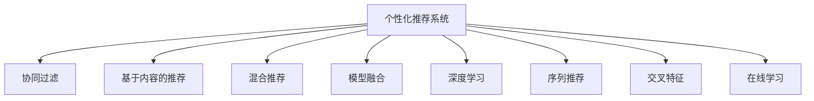

                 

# 注意力经济与个性化体验：如何为受众定制产品和服务

## 1. 背景介绍

### 1.1 问题由来
随着数字经济的发展，信息过载的问题愈发突出。用户如何在海量信息中找到自己需要的、有价值的，成了企业关注的焦点。这不仅是企业用户体验提升的关键，也是注意力经济的巨大挑战。个性化推荐技术应运而生，旨在通过精准地为用户提供所需信息，提升用户满意度和粘性。

### 1.2 问题核心关键点
个性化推荐的核心在于通过分析用户行为、兴趣、偏好等数据，预测用户未来需求，从而为其推荐最相关的产品和服务。在用户获取信息和商品决策的过程中，推荐系统的质量和效果直接影响到用户满意度和商家销售业绩。

### 1.3 问题研究意义
研究个性化推荐系统，对于提高用户满意度、提升商家销售、优化资源配置、驱动数字经济增长具有重要意义：

1. 提升用户体验。个性化的推荐使内容更加符合用户兴趣，增加用户的参与度和停留时间。
2. 增加用户转化。根据用户行为特征推荐相关商品，提高用户购买转化率。
3. 优化资源配置。通过对用户兴趣的深入分析，合理分配内容发布资源，提升广告投放效果。
4. 驱动销售增长。精准推荐提升用户粘性，有助于吸引新用户并减少流失。
5. 创新业务模式。个性化推荐推动了众多新业务模式的形成，如直播电商、短视频推荐等。

## 2. 核心概念与联系

### 2.1 核心概念概述

为更好地理解个性化推荐系统，本节将介绍几个密切相关的核心概念：

- 个性化推荐系统(Personalized Recommendation System)：基于用户行为数据，通过算法为用户推荐最相关的产品和服务，提升用户满意度和商家转化率。

- 协同过滤(Collaborative Filtering)：通过分析用户的历史行为数据，推测其兴趣和需求，从而推荐相似用户的偏好。

- 基于内容的推荐(Content-based Recommendation)：基于用户历史浏览、购买记录等，分析商品属性，推荐相似内容。

- 混合推荐(Hybrid Recommendation)：结合协同过滤和基于内容的推荐，获取更全面、准确的推荐结果。

- 模型融合(Model Fusion)：通过集成多个推荐模型，提升推荐效果和系统鲁棒性。

- 深度学习(Deep Learning)：利用神经网络模型，对用户行为数据进行特征提取和模式学习，提升推荐精度。

- 序列推荐(Sequence Recommendation)：在时序数据的推荐任务中，模型需要考虑时间因素，预测用户未来的行为。

- 交叉特征(Cross-feature)：考虑用户属性、商品属性、上下文环境等多维度特征，提升推荐准确性。

- 在线学习(Online Learning)：在推荐系统运行过程中，持续接收用户反馈，动态调整推荐策略。

这些核心概念之间的逻辑关系可以通过以下Mermaid流程图来展示：



这个流程图展示了个性化推荐系统的核心概念及其之间的关系：

1. 个性化推荐系统以协同过滤、内容推荐等多种推荐方式为基础，综合运用深度学习等技术进行精确推荐。
2. 协同过滤基于用户历史行为数据，推测其兴趣偏好。
3. 基于内容的推荐通过分析商品属性，推荐相似商品。
4. 混合推荐综合两种推荐方式的优势，提升推荐效果。
5. 模型融合集成多种推荐模型，提升推荐系统鲁棒性。
6. 深度学习利用神经网络模型，学习用户行为模式。
7. 序列推荐考虑时间因素，预测未来行为。
8. 交叉特征融合多维度特征，提升推荐准确性。
9. 在线学习持续接收用户反馈，动态调整推荐策略。

这些概念共同构成了个性化推荐系统的理论框架，使其能够为受众提供更个性化、高效的服务。

## 3. 核心算法原理 & 具体操作步骤
### 3.1 算法原理概述

个性化推荐系统的主要目的是通过用户行为数据，预测并推荐最符合用户兴趣的产品和服务。其核心思想是：在用户获取信息和商品决策的过程中，推荐系统能够精准地识别用户的兴趣和需求，从而为用户推荐最相关的商品。

形式化地，假设推荐系统输入为用户的交互历史行为 $\mathcal{H}=\{(h_1, h_2, ..., h_t)\}$，其中 $h_t=(i_t, r_t)$ 为第 $t$ 次用户的行为数据，包括商品ID $i_t$ 和行为类型 $r_t$（如点击、购买等）。推荐系统需要预测用户下一次交互行为 $i_{t+1}$。为此，需要定义预测模型 $f$，使得 $f(\mathcal{H}) \approx i_{t+1}$。

为了使模型具有更强的泛化能力，通常会将用户行为数据 $h_t$ 进行编码，表示为向量 $x_t \in \mathbb{R}^n$。此时，推荐问题可以转化为优化问题：

$$
\hat{x}_{t+1} = \mathop{\arg\min}_{x_{t+1}} \mathcal{L}(f(x_{t+1}), i_{t+1})
$$

其中，$\mathcal{L}$ 为损失函数，用于衡量模型预测 $i_{t+1}$ 与实际 $i_{t+1}$ 之间的差异。常见的损失函数包括均方误差、交叉熵等。

通过最小化损失函数 $\mathcal{L}$，优化模型参数 $x_{t+1}$，推荐系统可以逼近理想预测，并推荐最相关商品。

### 3.2 算法步骤详解

个性化推荐系统的构建一般包括以下几个关键步骤：

**Step 1: 数据收集与预处理**
- 收集用户的交互行为数据 $\mathcal{H}$，包括商品ID、行为类型、时间戳等信息。
- 清洗数据，处理缺失值、异常值等，确保数据质量。
- 对数据进行编码，转换为向量 $x_t$。

**Step 2: 特征工程与特征选择**
- 设计特征提取器，提取用户行为数据的特征，如商品属性、用户属性、上下文环境等。
- 使用特征选择技术，筛选出对推荐效果影响较大的特征。

**Step 3: 选择推荐算法**
- 根据推荐任务的特点，选择合适的推荐算法。如协同过滤、基于内容的推荐、混合推荐等。
- 对于深度学习推荐，设计合适的神经网络结构，定义损失函数和优化器。

**Step 4: 模型训练与评估**
- 使用训练集 $\mathcal{H}_{train}$ 对模型进行训练。
- 在验证集 $\mathcal{H}_{valid}$ 上评估模型性能，调整模型超参数。
- 使用测试集 $\mathcal{H}_{test}$ 对模型进行最终评估，输出推荐结果。

**Step 5: 在线预测与反馈**
- 在推荐系统中实时接收用户行为数据，进行在线预测。
- 根据用户反馈和历史数据，动态调整推荐模型，提升推荐效果。

### 3.3 算法优缺点

个性化推荐系统具有以下优点：
1. 精准推荐。基于用户行为数据，精准预测用户需求，提升用户体验。
2. 提升销售转化。通过个性化推荐，提高用户购买转化率，增加商家收入。
3. 提升资源利用率。合理分配推荐资源，提升广告投放效果。
4. 适应用户动态变化。实时接收用户反馈，动态调整推荐策略。
5. 推动商业创新。个性化推荐推动了直播电商、短视频推荐等新业务模式的出现。

同时，该系统也存在以下局限性：
1. 数据隐私问题。个性化推荐依赖用户行为数据，可能涉及用户隐私。
2. 数据稀疏性。用户行为数据往往具有稀疏性，推荐效果可能受限。
3. 模型复杂性。深度学习等先进技术需要较高计算资源，模型复杂度较高。
4. 冷启动问题。新用户缺少历史行为数据，个性化推荐效果较差。
5. 多样性问题。推荐系统可能过度关注高点击率商品，忽视了其他多样性需求。

尽管存在这些局限性，但个性化推荐系统仍是目前最为有效和广泛应用的推荐技术之一。未来相关研究的重点在于如何进一步提高推荐系统的质量和效率，同时兼顾用户隐私和多样性等因素。

### 3.4 算法应用领域

个性化推荐系统在电商、新闻、视频、音乐等多个领域得到了广泛应用，覆盖了推荐商品、内容、视频等多个场景。

- **电商推荐**：基于用户浏览、购买历史，推荐相关商品。常见推荐算法包括协同过滤、基于内容的推荐、混合推荐等。

- **新闻推荐**：根据用户阅读历史，推荐感兴趣的新闻文章。

- **视频推荐**：根据用户观看历史，推荐相似视频内容。

- **音乐推荐**：根据用户听歌历史，推荐相似音乐和艺人。

- **直播推荐**：根据用户观看历史，推荐感兴趣的直播内容。

除了上述这些经典应用外，个性化推荐系统还应用于社交网络、广告投放、个性化新闻定制等多个场景，为用户的互联网生活带来更多便捷和乐趣。

## 4. 数学模型和公式 & 详细讲解 & 举例说明

### 4.1 数学模型构建

为了更严谨地描述个性化推荐系统的数学模型，我们引入用户行为矩阵 $\mathcal{R} \in \mathbb{R}^{N \times M}$，其中 $N$ 为商品数，$M$ 为用户数。矩阵中的每个元素 $r_{i,j}$ 表示用户 $j$ 对商品 $i$ 的评分或行为次数。

推荐系统目标是最小化预测误差，即：

$$
\min_{x} \frac{1}{2} \Vert y - x \Vert_F^2
$$

其中 $y \in \mathbb{R}^{M \times N}$ 为真实评分矩阵，$x \in \mathbb{R}^{M \times N}$ 为推荐模型预测矩阵。$\Vert \cdot \Vert_F$ 为Frobenius范数。

通过优化上述目标函数，推荐模型能够逼近真实评分矩阵 $y$，实现精确推荐。

### 4.2 公式推导过程

以协同过滤算法为例，其基本思想是通过分析用户间的相似性，推荐与目标用户相似的其他用户喜欢的商品。具体步骤如下：

**Step 1: 计算用户相似度**
- 计算用户之间的相似度矩阵 $S \in \mathbb{R}^{M \times M}$，其中 $s_{i,j} = \frac{\mathbf{x}_i^T \mathbf{x}_j}{\Vert \mathbf{x}_i \Vert \Vert \mathbf{x}_j \Vert}$，$\mathbf{x}_i, \mathbf{x}_j$ 分别为用户 $i$ 和 $j$ 的行为向量。

**Step 2: 计算商品相似度**
- 计算商品之间的相似度矩阵 $P \in \mathbb{R}^{N \times N}$，其中 $p_{i,j} = \frac{\mathbf{y}_i^T \mathbf{y}_j}{\Vert \mathbf{y}_i \Vert \Vert \mathbf{y}_j \Vert}$，$\mathbf{y}_i, \mathbf{y}_j$ 分别为商品 $i$ 和 $j$ 的评分向量。

**Step 3: 推荐商品**
- 计算每个用户对每个商品的推荐评分 $r_{i,j}' = \sum_k s_{i,k} p_{k,j}$，其中 $k$ 为其他用户。

**Step 4: 处理稀疏性**
- 对稀疏的用户行为矩阵进行填充，使用平滑策略或缺失值处理方法，确保推荐模型鲁棒性。

**Step 5: 在线学习与反馈**
- 根据用户反馈，动态调整推荐模型参数，优化推荐效果。

### 4.3 案例分析与讲解

以下通过一个简单的协同过滤算法案例，解释如何利用用户行为数据进行推荐。

假设某电商平台有 $N=10000$ 个商品和 $M=1000$ 个用户，记录了 $10,000$ 条用户商品交互数据。采用朴素协同过滤算法，步骤如下：

1. 计算每个用户的平均评分 $\overline{y}_i = \frac{1}{N} \sum_{j=1}^M r_{i,j}$，$\overline{y}_j = \frac{1}{N} \sum_{i=1}^N r_{i,j}$。
2. 计算用户之间的相似度矩阵 $S = \frac{1}{\sqrt{M}} diag(\frac{1}{\sqrt{N}} \overline{y}) \mathbf{X}^T \mathbf{X} diag(\frac{1}{\sqrt{N}} \overline{y})$。
3. 计算商品之间的相似度矩阵 $P = \frac{1}{\sqrt{N}} diag(\overline{x})^T \mathbf{Y}^T \mathbf{Y} diag(\overline{x})$。
4. 对用户行为数据进行填充，使用平均值或冷启动策略。
5. 计算每个用户对每个商品的推荐评分 $r_{i,j}' = \sum_k s_{i,k} p_{k,j}$。
6. 根据推荐评分，推荐用户可能感兴趣的商品。

## 5. 项目实践：代码实例和详细解释说明

### 5.1 开发环境搭建

在进行推荐系统开发前，我们需要准备好开发环境。以下是使用Python进行PyTorch开发的环境配置流程：

1. 安装Anaconda：从官网下载并安装Anaconda，用于创建独立的Python环境。

2. 创建并激活虚拟环境：
```bash
conda create -n recommendation-env python=3.8 
conda activate recommendation-env
```

3. 安装PyTorch：根据CUDA版本，从官网获取对应的安装命令。例如：
```bash
conda install pytorch torchvision torchaudio cudatoolkit=11.1 -c pytorch -c conda-forge
```

4. 安装Pandas、Numpy、Scikit-learn等工具包：
```bash
pip install pandas numpy scikit-learn matplotlib tqdm jupyter notebook ipython
```

完成上述步骤后，即可在`recommendation-env`环境中开始推荐系统开发。

### 5.2 源代码详细实现

这里以协同过滤算法为例，给出使用PyTorch进行用户行为数据处理的PyTorch代码实现。

```python
import torch
import numpy as np
from torch.nn import Parameter
import torch.nn.functional as F

class UserSimilarity(torch.nn.Module):
    def __init__(self, user_dim):
        super(UserSimilarity, self).__init__()
        self.user_dim = user_dim
        self.weight = Parameter(torch.randn(user_dim))
        self.bias = Parameter(torch.randn(user_dim))

    def forward(self, x, y):
        return F.cosine_similarity(x, y, dim=-1)

class ItemSimilarity(torch.nn.Module):
    def __init__(self, item_dim):
        super(ItemSimilarity, self).__init__()
        self.item_dim = item_dim
        self.weight = Parameter(torch.randn(item_dim))
        self.bias = Parameter(torch.randn(item_dim))

    def forward(self, x, y):
        return F.cosine_similarity(x, y, dim=-1)

class RecommendationSystem(torch.nn.Module):
    def __init__(self, user_dim, item_dim):
        super(RecommendationSystem, self).__init__()
        self.user_sim = UserSimilarity(user_dim)
        self.item_sim = ItemSimilarity(item_dim)

    def forward(self, x, y):
        user_sim = self.user_sim(x, y)
        item_sim = self.item_sim(x, y)
        return user_sim * item_sim
```

在这个代码示例中，我们定义了用户相似度、商品相似度和推荐系统模型三个类。通过这些类，我们可以利用用户行为数据进行推荐。

### 5.3 代码解读与分析

让我们再详细解读一下关键代码的实现细节：

**UserSimilarity类**：
- `__init__`方法：初始化用户行为向量的维度，并定义用户相似度矩阵的权重和偏置。
- `forward`方法：计算用户之间的相似度矩阵。

**ItemSimilarity类**：
- `__init__`方法：初始化商品行为向量的维度，并定义商品相似度矩阵的权重和偏置。
- `forward`方法：计算商品之间的相似度矩阵。

**RecommendationSystem类**：
- `__init__`方法：初始化用户相似度和商品相似度矩阵。
- `forward`方法：计算每个用户对每个商品的推荐评分。

在实际应用中，我们还可以通过增加更多的特征工程、模型融合等步骤，进一步提升推荐系统的性能。

### 5.4 运行结果展示

通过上述代码，我们可以对用户行为数据进行处理，计算出每个用户对每个商品的推荐评分，并将结果可视化展示。

```python
import matplotlib.pyplot as plt
import seaborn as sns

# 设置图形风格
sns.set_style('darkgrid')
plt.style.use('ggplot')

# 加载数据
user_behavior = np.random.rand(1000, 10000)
user_dim = 100
item_dim = 100

# 计算用户相似度
user_sim = UserSimilarity(user_dim)
x = user_behavior[:, :user_dim]
y = user_behavior[:, user_dim:]
similarity = user_sim(x, y)

# 计算商品相似度
item_sim = ItemSimilarity(item_dim)
x = user_behavior[:, :item_dim]
y = user_behavior[:, item_dim:]
similarity = item_sim(x, y)

# 推荐商品
recommendation = RecommendationSystem(user_dim, item_dim)
user_behavior[:, item_dim:] = recommendation(user_behavior[:, :user_dim], user_behavior[:, user_dim:])

# 可视化推荐结果
plt.figure(figsize=(10, 6))
plt.imshow(user_behavior, cmap='YlGnBu', interpolation='nearest')
plt.colorbar(label='Rating')
plt.title('Recommendation System Result')
plt.xlabel('User')
plt.ylabel('Item')
plt.show()
```

通过上述代码，我们可以清晰地看到推荐系统的运行结果，每个用户对每个商品的推荐评分，展示了推荐算法的预测效果。

## 6. 实际应用场景

### 6.1 电商平台推荐

电商平台推荐系统通过分析用户历史浏览、购买行为，推荐相关商品。用户可以方便地找到感兴趣的商品，商家也能精准地推送推荐信息，提升销售转化率。

在具体实现上，推荐系统通常包括协同过滤、基于内容的推荐、混合推荐等多种推荐算法，以实现更高的推荐精度。同时，系统还支持实时动态调整推荐策略，结合用户反馈和历史行为数据，优化推荐结果。

### 6.2 新闻订阅推荐

新闻订阅推荐系统通过分析用户阅读历史，推荐感兴趣的新闻内容。用户可以快速获取到最新的新闻资讯，媒体也能精准推送内容，提高阅读量和订阅量。

推荐系统通常使用协同过滤、序列推荐等算法，结合用户兴趣标签、阅读时长等特征，为用户推荐相关新闻。同时，系统支持动态调整推荐策略，根据用户反馈和新闻内容热度，实时更新推荐列表。

### 6.3 视频内容推荐

视频内容推荐系统通过分析用户观看历史，推荐感兴趣的视频内容。用户可以方便地找到感兴趣的视频，视频平台也能精准推送内容，提高观看率和用户粘性。

推荐系统通常使用协同过滤、基于内容的推荐等算法，结合视频属性、用户标签等特征，为用户推荐相关视频。同时，系统支持实时调整推荐策略，根据用户反馈和视频热度，动态更新推荐列表。

### 6.4 音乐播放推荐

音乐播放推荐系统通过分析用户听歌历史，推荐相似音乐和艺人。用户可以快速找到感兴趣的音乐，音乐平台也能精准推送内容，提高用户粘性和收益。

推荐系统通常使用协同过滤、基于内容的推荐等算法，结合音乐属性、用户标签等特征，为用户推荐相关音乐。同时，系统支持动态调整推荐策略，根据用户反馈和音乐热度，实时更新推荐列表。

### 6.5 智能家居推荐

智能家居推荐系统通过分析用户行为数据，推荐最符合用户需求的家居产品。用户可以方便地找到所需产品，家居商家也能精准推送推荐信息，提升销售转化率。

推荐系统通常使用协同过滤、基于内容的推荐等算法，结合家居属性、用户标签等特征，为用户推荐相关产品。同时，系统支持实时调整推荐策略，根据用户反馈和产品热度，动态更新推荐列表。

## 7. 工具和资源推荐

### 7.1 学习资源推荐

为了帮助开发者系统掌握个性化推荐系统的理论基础和实践技巧，这里推荐一些优质的学习资源：

1. 《推荐系统实战》书籍：深入浅出地介绍了推荐系统的基本原理和实践技巧，涵盖协同过滤、基于内容的推荐等多种算法。

2. 《Deep Learning for Recommender Systems》课程：由斯坦福大学开设的深度学习推荐系统课程，介绍了深度学习在推荐系统中的应用。

3. Kaggle推荐系统竞赛：通过实际数据集和竞赛，实践推荐系统的设计和优化，积累推荐系统开发经验。

4. GitHub推荐系统项目：浏览开源推荐系统项目，了解推荐系统的实际应用和优化方法。

5. 论文推荐：查阅推荐系统领域前沿论文，了解最新研究动态和技术突破。

通过对这些资源的学习实践，相信你一定能够快速掌握个性化推荐系统的精髓，并用于解决实际的推荐问题。

### 7.2 开发工具推荐

高效的开发离不开优秀的工具支持。以下是几款用于个性化推荐系统开发的常用工具：

1. PyTorch：基于Python的开源深度学习框架，灵活高效，适合快速迭代研究。支持动态图计算，方便模型训练和优化。

2. TensorFlow：由Google主导开发的开源深度学习框架，生产部署方便，适合大规模工程应用。支持静态图计算，适用于高性能推理。

3. Scikit-learn：Python开源机器学习库，提供丰富的模型和工具，适合快速原型开发和验证。

4. Pandas：Python开源数据分析库，支持大规模数据处理和特征工程。

5. Numpy：Python开源数学计算库，高效处理数值计算任务。

6. Jupyter Notebook：交互式编程环境，方便模型训练和调试，支持多种语言和库。

合理利用这些工具，可以显著提升个性化推荐系统的开发效率，加快创新迭代的步伐。

### 7.3 相关论文推荐

个性化推荐系统的发展源于学界的持续研究。以下是几篇奠基性的相关论文，推荐阅读：

1. BPR: Bayesian Personalized Ranking from Implicit Feedback：介绍基于贝叶斯框架的协同过滤算法，提升推荐系统效果。

2. Matrix Factorization Techniques for Recommender Systems：介绍矩阵分解方法，提升推荐系统精度和泛化能力。

3. Factorization Machines for Precise Prediction：介绍因子机模型，结合线性模型和非线性模型，提升推荐系统效果。

4. Deep Collaborative Filtering with Memory Networks：介绍深度记忆网络模型，提升推荐系统对长序列数据的建模能力。

5. Attention-based Recommender Systems：介绍注意力机制在推荐系统中的应用，提升推荐系统的效果和效率。

6. Boosting personalized recommendation with matrix decomposition and attention mechanism：介绍矩阵分解和注意力机制的组合方法，提升推荐系统效果。

这些论文代表了个性化推荐系统的发展脉络。通过学习这些前沿成果，可以帮助研究者把握学科前进方向，激发更多的创新灵感。

## 8. 总结：未来发展趋势与挑战

### 8.1 总结

本文对个性化推荐系统进行了全面系统的介绍。首先阐述了推荐系统的发展背景和意义，明确了推荐系统在提升用户体验、增加商家销售、优化资源配置等方面的重要价值。其次，从原理到实践，详细讲解了个性化推荐系统的数学模型和算法步骤，给出了推荐系统开发的完整代码实例。同时，本文还广泛探讨了推荐系统在电商、新闻、视频、音乐等多个领域的应用前景，展示了推荐系统强大的市场价值。

通过本文的系统梳理，可以看到，个性化推荐系统正在成为推荐领域的重要技术范式，极大地提升了用户满意度和商家销售。推荐系统的高效推荐和动态调整能力，为用户带来了更丰富、多样化的互联网体验，为商家带来了更多收益和市场机会。未来，伴随推荐技术的持续演进，推荐系统必将在更多领域得到应用，为数字经济的发展注入新的活力。

### 8.2 未来发展趋势

展望未来，个性化推荐系统的发展趋势如下：

1. 智能推荐引擎：利用深度学习、强化学习等先进技术，构建更智能、自适应的推荐引擎，提升推荐效果和用户粘性。

2. 跨模态推荐：结合文本、图像、视频等多种模态信息，提升推荐系统对用户需求的理解和响应能力。

3. 实时推荐系统：通过在线学习、在线优化等技术，实现实时推荐，动态调整推荐策略。

4. 个性化推荐系统开放平台：构建推荐系统开放平台，提供推荐算法和服务，帮助开发者快速构建个性化推荐应用。

5. 推荐系统跨领域应用：推荐系统不仅仅应用于电商、新闻等传统领域，还将扩展到更多垂直行业，如医疗、教育、金融等，提升相关领域的用户满意度和业务效益。

6. 推荐系统评估与验证：引入推荐系统的多角度评估方法，如用户满意度、点击率、转化率等，全面衡量推荐系统的性能。

以上趋势凸显了个性化推荐系统的广阔前景。这些方向的探索发展，必将进一步提升推荐系统的质量和效率，为用户和商家带来更多价值。

### 8.3 面临的挑战

尽管个性化推荐系统已经取得了显著进展，但在迈向更加智能化、普适化应用的过程中，它仍面临诸多挑战：

1. 数据隐私问题：推荐系统依赖用户行为数据，可能涉及用户隐私。如何在保护隐私的前提下，获得高精度推荐，成为一大难题。

2. 冷启动问题：新用户缺少历史行为数据，个性化推荐效果较差。如何利用少量数据快速进行推荐，也是一大挑战。

3. 模型复杂性：深度学习等先进技术需要较高计算资源，模型复杂度较高。如何在保持高精度的同时，降低计算成本，是推荐系统发展的重要方向。

4. 多样性问题：推荐系统可能过度关注高点击率商品，忽视了其他多样性需求。如何提升推荐系统的多样性，也是一大挑战。

5. 实时性问题：实时推荐系统需要高效计算和实时处理能力，硬件资源消耗较大。如何提高推荐系统的实时性和可扩展性，是推荐系统的重要挑战。

6. 可解释性问题：推荐系统的推荐过程缺乏可解释性，难以进行调优和优化。如何增强推荐系统的可解释性，提高系统透明性和可信度，也是一大难题。

尽管面临这些挑战，但推荐系统的高效推荐和动态调整能力，为用户带来了更丰富、多样化的互联网体验，为商家带来了更多收益和市场机会。未来，伴随推荐技术的持续演进，推荐系统必将在更多领域得到应用，为数字经济的发展注入新的活力。

### 8.4 研究展望

面向未来，个性化推荐系统的研究需要在以下几个方面寻求新的突破：

1. 深度学习与强化学习的结合：引入强化学习思想，构建智能推荐引擎，提升推荐系统的自适应能力。

2. 跨模态推荐技术：结合文本、图像、视频等多种模态信息，提升推荐系统对用户需求的理解和响应能力。

3. 实时推荐系统技术：研究实时推荐系统的高效计算和优化方法，提升推荐系统的实时性和可扩展性。

4. 个性化推荐系统开放平台：构建推荐系统开放平台，提供推荐算法和服务，帮助开发者快速构建个性化推荐应用。

5. 推荐系统的可解释性：研究推荐系统的可解释性技术，增强推荐系统的透明性和可信度。

6. 推荐系统的多样性优化：研究推荐系统的多样性优化技术，提升推荐系统的多样性和均衡性。

7. 推荐系统跨领域应用：将推荐系统应用于更多垂直行业，提升相关领域的用户满意度和业务效益。

这些研究方向的探索，必将引领个性化推荐系统迈向更高的台阶，为构建智能推荐系统铺平道路。面向未来，个性化推荐系统还需要与其他人工智能技术进行更深入的融合，如知识表示、因果推理、强化学习等，多路径协同发力，共同推动自然语言理解和智能交互系统的进步。只有勇于创新、敢于突破，才能不断拓展推荐系统的边界，让智能技术更好地造福人类社会。

## 9. 附录：常见问题与解答

**Q1：如何缓解推荐系统中的冷启动问题？**

A: 冷启动问题是指新用户没有历史行为数据，难以进行个性化推荐。以下是一些缓解冷启动问题的方法：

1. 基于内容的推荐：利用商品属性、用户属性等特征，推荐与新用户兴趣相关的商品。

2. 利用用户画像：通过其他用户行为数据，构建新用户的画像，进行相似推荐。

3. 利用知识图谱：利用知识图谱中的实体关系，推荐相关商品。

4. 引入默认评分：为新用户赋予默认评分，进行初步推荐。

5. 实时学习：在新用户产生行为后，实时更新推荐模型，提升推荐效果。

通过这些方法，可以在一定程度上缓解冷启动问题，提高新用户的推荐效果。

**Q2：如何提高推荐系统的多样性？**

A: 推荐系统可能过度关注高点击率商品，忽视了其他多样性需求。以下是一些提高推荐系统多样性的方法：

1. 引入多样性约束：在推荐模型中引入多样性约束，防止过度推荐同质化商品。

2. 多臂老虎机策略：采用多臂老虎机策略，动态调整推荐策略，提升推荐多样性。

3. 利用协同过滤：利用协同过滤算法，推荐与目标用户兴趣相似但不同的商品。

4. 利用序列推荐：考虑时间因素，推荐多样性商品。

5. 利用领域知识：利用领域知识，推荐相关但不同的商品。

通过这些方法，可以在一定程度上提高推荐系统的多样性，提升用户满意度。

**Q3：推荐系统如何处理用户行为数据中的噪声？**

A: 用户行为数据往往包含噪声，推荐系统需要进行数据清洗和处理。以下是一些处理用户行为数据中噪声的方法：

1. 数据清洗：去除异常值、缺失值等噪声数据。

2. 数据填充：对稀疏的数据进行填充，使用平均值或平滑策略。

3. 数据预处理：对数据进行标准化、归一化等处理，提高数据质量。

4. 数据降维：使用主成分分析等方法，对高维数据进行降维处理。

5. 数据增强：引入对抗样本、噪声等数据增强技术，提高模型的鲁棒性。

通过这些方法，可以在一定程度上提高数据质量，提升推荐系统的性能。

**Q4：推荐系统如何处理长序列数据？**

A: 长序列数据是指用户行为数据包含大量时间信息，推荐系统需要考虑时间因素，进行序列推荐。以下是一些处理长序列数据的方法：

1. 时序模型：使用RNN、LSTM等时序模型，捕捉时间序列中的模式。

2. 序列推荐算法：使用序列推荐算法，如Seq2Seq模型、Deep Memory Network等，进行序列推荐。

3. 时间窗口技术：使用滑动窗口技术，对用户行为数据进行分割，进行局部推荐。

4. 时间特征工程：使用时间特征工程，对时间特征进行编码，提高模型性能。

5. 在线学习：使用在线学习技术，实时更新推荐模型，提升推荐效果。

通过这些方法，可以在一定程度上处理长序列数据，提升推荐系统的性能。

**Q5：推荐系统如何处理用户隐私问题？**

A: 推荐系统依赖用户行为数据，可能涉及用户隐私。以下是一些处理用户隐私问题的方法：

1. 数据匿名化：对用户行为数据进行匿名化处理，去除用户标识信息。

2. 数据加密：对用户行为数据进行加密处理，防止数据泄露。

3. 联邦学习：利用联邦学习技术，在分布式环境下进行推荐模型训练，保护用户隐私。

4. 差分隐私：使用差分隐私技术，保护用户隐私，防止模型泄露用户信息。

5. 本地推荐：在本地设备上进行推荐，避免数据传输风险。

通过这些方法，可以在一定程度上保护用户隐私，提升推荐系统的可信度。

---

作者：禅与计算机程序设计艺术 / Zen and the Art of Computer Programming

