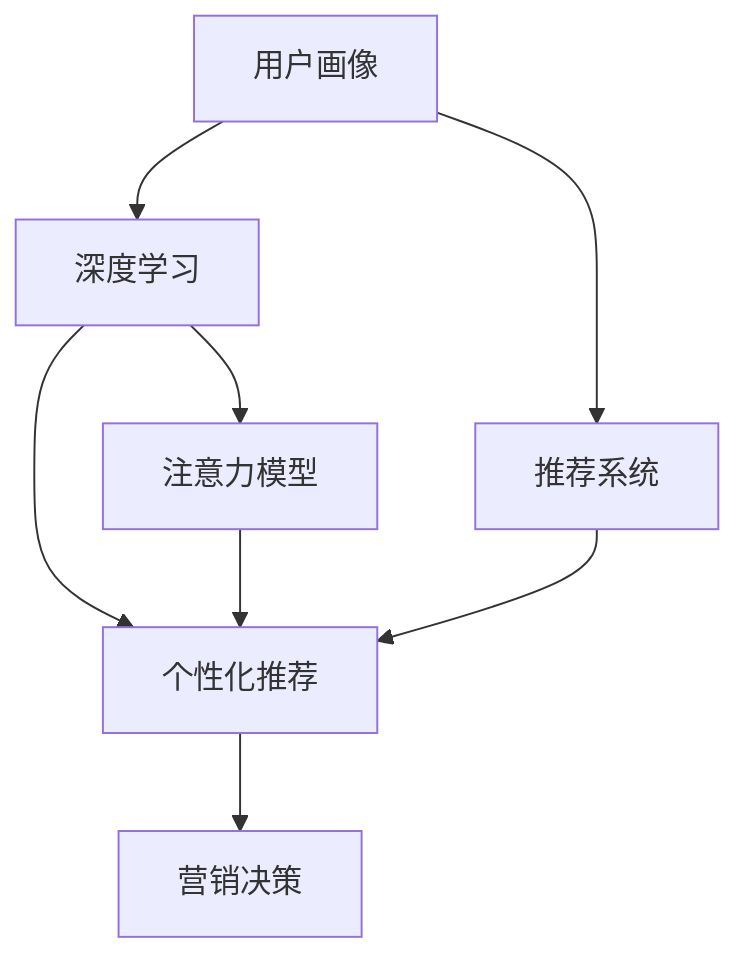

                 

# 注意力经济与个性化营销：如何针对受众定制你的信息

## 1. 背景介绍

在数字化时代，信息的洪流以爆炸式增长，如何在这海量的信息中吸引目标受众的注意力，并实现有效的个性化营销，成为企业和市场营销者面临的重大挑战。随着大数据、机器学习等技术的发展，注意力经济与个性化营销也进入了一个全新的阶段。本文将深入探讨这一领域，帮助企业和营销者理解和掌握如何在数字化浪潮中实现有效的信息定制和用户互动。

## 2. 核心概念与联系

### 2.1 核心概念概述

在注意力经济与个性化营销中，以下几个核心概念是必不可少的：

- **注意力经济**：信息爆炸时代，如何吸引和保持用户对产品或服务的关注成为焦点。注意力经济强调对用户注意力的管理和分配，以实现最优的营销效果。
- **个性化营销**：根据用户行为、偏好、兴趣等个性化特征，定制化提供相关信息和产品，以提升用户满意度和忠诚度。
- **用户画像**：通过数据分析技术，构建用户完整的画像，包括年龄、性别、地域、兴趣、行为等，为个性化营销提供数据支持。
- **推荐系统**：基于用户画像和用户行为，推荐符合用户兴趣的产品或信息，提升用户互动和转化率。
- **深度学习**：通过深度学习算法，分析大量用户数据，挖掘潜在的用户行为模式和兴趣偏好。

这些概念之间相互作用，共同构成了注意力经济与个性化营销的基础框架。

### 2.2 核心概念原理和架构的 Mermaid 流程图



这个流程图展示了从用户画像、深度学习到个性化推荐，最终到达营销决策的核心流程。其中，深度学习分析用户行为数据，构建注意力模型，为用户提供个性化推荐，而推荐系统则结合用户画像和行为数据，实现精准的个性化营销。

## 3. 核心算法原理 & 具体操作步骤

### 3.1 算法原理概述

个性化推荐系统通常基于协同过滤、内容推荐、基于内容的推荐、混合推荐等算法。这些算法通过对用户行为数据进行分析，构建用户画像，从而实现个性化推荐。推荐系统的工作原理大致如下：

1. **数据采集**：收集用户的历史行为数据，如浏览记录、购买记录等。
2. **用户画像构建**：利用数据挖掘技术，分析用户的行为模式和兴趣偏好，构建用户画像。
3. **物品特征提取**：对物品进行特征提取，如商品类别、价格、评价等。
4. **相似度计算**：根据用户画像和物品特征，计算用户与物品之间的相似度。
5. **推荐生成**：根据相似度计算结果，生成推荐列表。

### 3.2 算法步骤详解

个性化推荐系统的构建过程如下：

1. **数据采集**：通过API接口、日志文件、网站点击流等方式收集用户的行为数据。
2. **数据预处理**：清洗、去重、归一化数据，构建数据集。
3. **用户画像构建**：利用聚类、分类、关联规则等方法，分析用户的行为数据，构建用户画像。
4. **物品特征提取**：对物品进行特征提取，生成特征向量。
5. **相似度计算**：使用余弦相似度、皮尔逊相关系数、协同过滤等方法，计算用户与物品之间的相似度。
6. **推荐生成**：根据相似度计算结果，生成推荐列表。

### 3.3 算法优缺点

个性化推荐系统的优点包括：

- **精准度**：根据用户行为和兴趣，提供高度个性化的推荐。
- **用户满意度提升**：用户接收到的信息更符合自身需求，提升满意度和忠诚度。
- **商业价值**：通过精准的推荐，提升销售和转化率。

其缺点包括：

- **数据隐私**：用户行为数据可能涉及隐私问题，需要谨慎处理。
- **模型复杂**：个性化推荐系统涉及复杂的算法和数据处理，开发和维护成本高。
- **冷启动问题**：对于新用户，无法提供有效的个性化推荐。

### 3.4 算法应用领域

个性化推荐系统广泛应用于电商、新闻媒体、视频平台、社交网络等多个领域。例如：

- **电商**：根据用户历史购买记录，推荐相似商品。
- **视频平台**：根据用户观看记录，推荐相关视频内容。
- **社交网络**：根据用户互动历史，推荐可能感兴趣的内容或用户。

## 4. 数学模型和公式 & 详细讲解 & 举例说明

### 4.1 数学模型构建

个性化推荐系统常用的数学模型包括协同过滤模型、基于内容的推荐模型、深度学习模型等。这里以协同过滤模型为例，构建推荐系统。

协同过滤模型基于用户与物品的协同矩阵，构建用户画像和物品特征，计算用户与物品的相似度，从而生成推荐列表。协同过滤模型包括以下三个核心部分：

- **用户-物品矩阵**：收集用户与物品之间的交互数据，构建用户-物品矩阵。
- **用户画像**：对用户-物品矩阵进行降维和聚类，生成用户画像。
- **相似度计算**：使用余弦相似度等方法，计算用户与物品之间的相似度。

### 4.2 公式推导过程

协同过滤模型的余弦相似度公式如下：

$$
\text{similarity}(u,i) = \cos(\theta) = \frac{A_{ui} \cdot B_{ui}}{\|A_u\| \cdot \|B_i\|}
$$

其中 $A_{ui}$ 表示用户 $u$ 对物品 $i$ 的评分，$\|A_u\|$ 和 $\|B_i\|$ 分别表示用户 $u$ 和物品 $i$ 的评分向量模长。

### 4.3 案例分析与讲解

假设我们有一个电商网站，用户 $u$ 购买了物品 $i$ 和 $j$，评分分别为 $4$ 和 $3$。物品 $i$ 和 $j$ 的评分向量分别为 $A_i = [4, 3, 2]$ 和 $B_j = [5, 4, 3]$。根据余弦相似度公式，可以计算出用户 $u$ 与物品 $k$ 的相似度为：

$$
\text{similarity}(u,k) = \frac{A_{uk} \cdot B_{uk}}{\|A_u\| \cdot \|B_k\|} = \frac{4 \cdot 5 + 3 \cdot 4 + 2 \cdot 3}{\sqrt{29} \cdot \sqrt{50}} = 0.833
$$

根据相似度，可以为用户 $u$ 生成推荐物品列表。

## 5. 项目实践：代码实例和详细解释说明

### 5.1 开发环境搭建

以下是在Python环境下搭建推荐系统的开发环境：

1. 安装Python环境：
```
sudo apt-get update
sudo apt-get install python3-pip
```

2. 安装推荐系统依赖库：
```
pip install scipy pandas numpy
```

3. 安装推荐系统库：
```
pip install Surprise
```

4. 安装深度学习库：
```
pip install tensorflow keras
```

### 5.2 源代码详细实现

以下是一个简单的协同过滤推荐系统的代码实现，通过Python实现：

```python
from surprise import Dataset, Reader
from surprise.model_selection import train_test_split
from surprise.prediction_algorithms.matrix_factorization import SVD

# 读取数据
reader = Reader(rating_scale=(1, 5))
data = Dataset.load_from_file('movie_ratings.txt', reader=reader)

# 将数据集划分为训练集和测试集
trainset, testset = train_test_split(data, test_size=0.2, random_state=42)

# 初始化协同过滤算法
algo = SVD()

# 训练模型
algo.fit(trainset)

# 预测结果
predictions = algo.test(testset)

# 输出预测结果
for uid, iid, estimate in predictions:
    print('User %d predicts item %d as %.5f' % (uid, iid, estimate))
```

这段代码实现了基于协同过滤的推荐系统，对用户 $u$ 的评分进行预测，并输出预测结果。

### 5.3 代码解读与分析

这段代码主要分为四个部分：

1. **数据读取**：使用 `Dataset.load_from_file` 方法读取数据文件，并使用 `Reader` 类设置评分范围。
2. **数据划分**：使用 `train_test_split` 方法将数据集划分为训练集和测试集。
3. **模型初始化**：初始化协同过滤算法 `SVD`。
4. **模型训练和预测**：使用 `fit` 方法训练模型，使用 `test` 方法对测试集进行预测，并输出预测结果。

## 6. 实际应用场景

### 6.1 电商平台个性化推荐

电商网站可以通过个性化推荐系统，根据用户的历史购买记录和浏览行为，推荐相似的商品，提高用户的购买率和满意度。例如，淘宝、京东等电商平台都采用了个性化推荐系统，帮助用户发现符合其兴趣的商品。

### 6.2 视频平台内容推荐

视频平台如YouTube、Netflix等，可以根据用户的历史观看记录和评分，推荐相关的视频内容。例如，YouTube会根据用户观看的视频和互动情况，推荐其他相关视频，提高用户停留时间和观看率。

### 6.3 社交网络内容推荐

社交网络平台如Facebook、Twitter等，可以根据用户的历史互动情况，推荐可能感兴趣的内容或用户。例如，Facebook会根据用户的朋友和兴趣，推荐可能感兴趣的文章和视频。

## 7. 工具和资源推荐

### 7.1 学习资源推荐

以下是一些推荐系统的学习资源，帮助读者深入了解这一领域：

1. **《推荐系统实践》**：王宏志著，详细介绍了推荐系统的算法和应用。
2. **《Python推荐系统》**：Holger Karl, Michał Zalewski著，使用Python实现推荐系统。
3. **Coursera推荐系统课程**：由斯坦福大学开设，涵盖推荐系统理论和算法。
4. **Kaggle推荐系统竞赛**：提供实战经验，了解推荐系统开发流程。

### 7.2 开发工具推荐

以下是一些常用的推荐系统开发工具：

1. **PyTorch**：基于Python的开源深度学习框架，支持多种深度学习模型。
2. **TensorFlow**：由Google开发的深度学习框架，支持分布式计算和GPU加速。
3. **Scikit-learn**：基于Python的机器学习库，提供了多种机器学习算法和工具。
4. **Surprise**：基于Python的推荐系统库，支持协同过滤、基于内容的推荐等多种算法。
5. **Pandas**：基于Python的数据分析库，方便数据处理和分析。

### 7.3 相关论文推荐

以下是一些推荐系统领域的经典论文，推荐阅读：

1. **Trust and Exploit: Privacy-Preserving Collaborative Filtering**：Amir Ghandi, Jérémie Ecoffet, Yves-Michel Marianneau著，介绍了隐私保护下的协同过滤算法。
2. **Collaborative Filtering for Implicit Feedback Datasets**：Ian Adams, Philippe Kranzlmüller, Bernd Gärtler著，探讨了协同过滤在隐式反馈数据集上的应用。
3. **The Best Choice in Bayesian NMF**：Cengiz Pehlevan, Neil Houlsby著，使用贝叶斯NMF算法进行推荐系统优化。

## 8. 总结：未来发展趋势与挑战

### 8.1 研究成果总结

基于协同过滤的个性化推荐系统已经成为现代互联网应用中不可或缺的一部分，为电商、视频、社交等多个领域提供了强大的技术支撑。通过深度学习和协同过滤的结合，个性化推荐系统实现了更高的精准度和用户满意度。

### 8.2 未来发展趋势

未来，推荐系统将在以下几个方面进一步发展：

1. **多模态推荐**：结合文本、图像、语音等多模态信息，提供更加全面、精准的推荐。
2. **实时推荐**：使用流式数据处理技术，实现实时推荐，提升用户体验。
3. **跨平台推荐**：在不同平台之间实现数据共享和推荐，提升推荐效果。
4. **深度学习推荐**：使用深度学习模型，提高推荐系统的精度和泛化能力。

### 8.3 面临的挑战

推荐系统虽然取得了一定的成就，但也面临诸多挑战：

1. **数据隐私**：用户行为数据可能涉及隐私问题，需要谨慎处理。
2. **模型复杂**：推荐系统涉及复杂的算法和数据处理，开发和维护成本高。
3. **冷启动问题**：对于新用户，无法提供有效的个性化推荐。
4. **鲁棒性不足**：推荐系统可能受到数据异常和噪声的影响，导致推荐结果不准确。

### 8.4 研究展望

未来的研究可以从以下几个方面进行探索：

1. **多模态推荐**：结合多种模态信息，提高推荐系统的精准度。
2. **实时推荐**：使用流式数据处理技术，实现实时推荐。
3. **跨平台推荐**：在不同平台之间实现数据共享和推荐，提升推荐效果。
4. **深度学习推荐**：使用深度学习模型，提高推荐系统的精度和泛化能力。

## 9. 附录：常见问题与解答

**Q1: 如何构建用户画像？**

A: 构建用户画像通常需要以下几个步骤：

1. **数据收集**：收集用户的历史行为数据，如浏览记录、购买记录等。
2. **数据清洗**：清洗、去重、归一化数据，构建数据集。
3. **特征提取**：对数据进行特征提取，生成特征向量。
4. **聚类分析**：使用聚类算法对用户进行分群，构建用户画像。
5. **画像维护**：定期更新用户画像，反映用户行为变化。

**Q2: 如何评估推荐系统的性能？**

A: 推荐系统的性能评估通常使用以下指标：

1. **准确率**：推荐的物品是否符合用户兴趣。
2. **召回率**：推荐列表中是否包含用户感兴趣物品的比例。
3. **覆盖率**：推荐列表中物品的覆盖度。
4. **新颖度**：推荐列表中是否包含用户未曾见过的物品。
5. **多样性**：推荐列表中物品的多样性。

**Q3: 推荐系统中的协同过滤算法有哪些？**

A: 推荐系统中的协同过滤算法主要分为以下两类：

1. **基于用户的协同过滤**：根据用户的历史行为数据，计算用户与用户之间的相似度，生成推荐列表。
2. **基于物品的协同过滤**：根据物品之间的相似度，生成推荐列表。

**Q4: 推荐系统中的深度学习模型有哪些？**

A: 推荐系统中的深度学习模型主要包括以下几种：

1. **基于FM（Factorization Machine）的模型**：利用FM算法进行推荐。
2. **基于NN（神经网络）的模型**：使用深度神经网络进行推荐。
3. **基于GAN（生成对抗网络）的模型**：使用GAN生成推荐数据。

**Q5: 推荐系统中的数据隐私保护有哪些方法？**

A: 推荐系统中的数据隐私保护主要包括以下几种方法：

1. **差分隐私**：通过添加噪声，保护用户隐私。
2. **联邦学习**：在分布式环境中，保护用户数据隐私。
3. **多方安全计算**：在多方环境中，保护用户数据隐私。

作者：禅与计算机程序设计艺术 / Zen and the Art of Computer Programming

