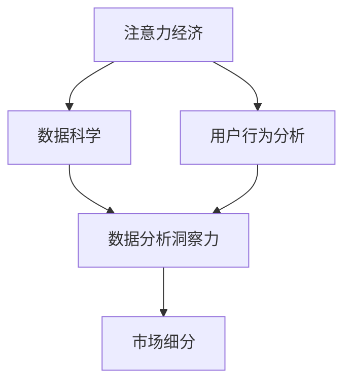
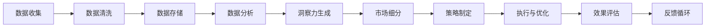

                 

## 1. 背景介绍

### 1.1 问题由来
在当今信息爆炸的时代，如何有效利用和分析海量数据，洞察市场行为和受众需求，成为企业和组织关注的焦点。大数据、人工智能等技术的迅猛发展，为这一问题提供了新的解决方案。其中，注意力经济（Attention Economy）和数据分析洞察力（Data Analytics Insight）是两个重要的概念，能够帮助我们理解用户行为和市场需求，从而制定更有效的市场策略。

### 1.2 问题核心关键点
注意力经济是指在信息泛滥的环境中，人们如何分配和利用注意力资源。在现代商业中，注意力成为了稀缺资源，品牌和内容需要通过各种手段吸引用户的注意力。而数据分析洞察力则是通过数据驱动，分析用户行为和市场趋势，辅助决策制定。

## 2. 核心概念与联系

### 2.1 核心概念概述

为了更好地理解注意力经济和数据分析洞察力，本节将介绍几个密切相关的核心概念：

- 注意力经济（Attention Economy）：在信息过载的背景下，用户对内容的选择和关注程度直接影响其价值和效果。企业需要通过优化内容质量、用户交互方式等手段，吸引和维持用户注意力，从而实现商业目标。

- 数据分析洞察力（Data Analytics Insight）：通过收集、处理和分析用户数据，挖掘数据背后的模式和规律，从而理解用户行为和市场需求，优化产品和服务设计，提升企业竞争力。

- 数据科学（Data Science）：利用统计学、机器学习等技术，处理和分析大规模数据集，挖掘数据价值的过程。

- 用户行为分析（User Behavior Analysis）：通过分析用户在使用产品和服务时的行为，了解用户需求和偏好，辅助产品迭代和改进。

- 市场细分（Market Segmentation）：将市场划分为不同的细分市场，以便针对不同群体制定更精准的营销策略。

这些核心概念之间的逻辑关系可以通过以下Mermaid流程图来展示：



这个流程图展示了几者之间的紧密联系：

1. 注意力经济和用户行为分析密切相关，因为只有通过分析用户行为，才能制定出有效吸引用户注意力的策略。
2. 数据科学和数据分析洞察力相互促进，数据科学的工具和技术提供了洞察力的实现手段。
3. 市场细分则是对分析结果的应用，使得企业能够更精准地制定营销策略。

### 2.2 核心概念原理和架构的 Mermaid 流程图
以下是注意力经济和数据分析洞察力的核心概念原理和架构的Mermaid流程图，展示它们如何通过数据科学、用户行为分析和市场细分的配合，共同实现企业的商业目标。



## 3. 核心算法原理 & 具体操作步骤

### 3.1 算法原理概述

注意力经济和数据分析洞察力主要依赖于数据科学和机器学习技术。核心算法包括：

- 数据预处理：收集和清洗数据，消除噪声，规范化数据格式。
- 特征提取：从数据中提取有意义的特征，供后续分析和模型训练使用。
- 数据分析：使用统计分析和机器学习模型，挖掘数据中的模式和规律。
- 模型评估：使用评价指标（如准确率、召回率、F1值等），评估模型性能。
- 市场细分：利用聚类和分类算法，将用户和市场划分为不同的细分群体。

这些步骤共同构成了一个完整的从数据收集到市场策略制定的流程，能够帮助企业更好地理解和应对市场变化。

### 3.2 算法步骤详解

基于上述核心算法，以下是详细的算法步骤：

**Step 1: 数据收集与预处理**
- 通过Web爬虫、数据库查询、传感器数据等手段，收集用户行为数据、市场数据等。
- 对数据进行清洗，去除重复、噪声和缺失值，规范化数据格式。

**Step 2: 特征提取**
- 从用户行为数据中提取特征，如点击次数、停留时间、购买金额等。
- 使用降维技术（如PCA、LDA等），减少特征维度，降低计算复杂度。

**Step 3: 数据分析**
- 使用统计方法（如描述性统计、时间序列分析等），分析数据趋势和变化。
- 使用机器学习模型（如回归、分类、聚类等），挖掘数据背后的模式和规律。

**Step 4: 洞察力生成**
- 根据分析结果，生成业务洞察力，如用户偏好、市场趋势、潜在机会等。
- 将洞察力可视化，使用图表、报告等形式呈现，方便决策者理解和使用。

**Step 5: 市场细分**
- 利用聚类算法（如K-means、层次聚类等），将用户和市场划分为不同的细分群体。
- 对不同细分群体进行个性化策略制定，提升市场覆盖率和转化率。

**Step 6: 策略制定与执行**
- 根据洞察力和细分结果，制定市场策略，如个性化推荐、精准营销、产品改进等。
- 在执行过程中不断收集反馈，调整和优化策略。

**Step 7: 效果评估**
- 使用关键绩效指标（KPIs），如转化率、用户留存率、收益等，评估市场策略的效果。
- 将评估结果反馈到数据分析和策略制定环节，形成闭环优化。

### 3.3 算法优缺点

注意力经济和数据分析洞察力的核心算法具有以下优点：

- 数据驱动决策：利用数据科学和技术，减少主观判断，提高决策的客观性和科学性。
- 实时分析：通过实时数据处理和分析，能够快速响应市场变化，及时调整策略。
- 用户导向：通过用户行为分析，了解用户需求和偏好，优化用户体验和产品设计。

同时，这些算法也存在一定的局限性：

- 数据依赖：对数据的质量和完整性要求高，数据缺失或偏差会影响分析结果。
- 模型复杂：复杂的算法模型计算量大，需要高性能的计算资源。
- 用户隐私：大量用户数据的收集和使用，可能涉及用户隐私和数据安全问题。

### 3.4 算法应用领域

注意力经济和数据分析洞察力在多个领域都有广泛应用，例如：

- 电子商务：通过用户行为分析，优化商品推荐和个性化营销，提升用户购买体验。
- 金融服务：通过市场数据和用户行为分析，评估风险，优化投资策略。
- 健康医疗：通过患者行为数据，分析健康趋势，提供个性化的健康建议和医疗服务。
- 旅游行业：通过用户旅游行为数据，优化旅游产品推荐，提升用户旅游体验。
- 广告营销：通过市场细分和用户行为分析，制定更精准的广告投放策略，提高广告效果。

除了上述这些领域，注意力经济和数据分析洞察力还被创新性地应用于更多场景中，如智能城市、智能制造、智能农业等，为各行各业带来了新的创新和机遇。

## 4. 数学模型和公式 & 详细讲解

### 4.1 数学模型构建

以下是注意力经济和数据分析洞察力的数学模型构建过程：

**用户行为数据**：记用户行为数据集为 $D=\{(x_i, y_i)\}_{i=1}^N$，其中 $x_i$ 为用户行为特征向量，$y_i$ 为标签（如点击、购买、浏览等）。

**市场数据**：记市场数据集为 $D_M=\{(z_j, l_j)\}_{j=1}^M$，其中 $z_j$ 为市场特征向量，$l_j$ 为市场标签（如趋势、价格变化等）。

**特征提取模型**：记特征提取模型为 $F(x) = [f_1(x), f_2(x), \ldots, f_k(x)]$，其中 $f_i(x)$ 为用户行为数据的第 $i$ 个特征提取函数。

**市场分析模型**：记市场分析模型为 $G(z) = [g_1(z), g_2(z), \ldots, g_l(z)]$，其中 $g_i(z)$ 为市场数据的第 $i$ 个分析函数。

**用户细分模型**：记用户细分模型为 $C(x) = [c_1(x), c_2(x), \ldots, c_m(x)]$，其中 $c_i(x)$ 为用户的第 $i$ 个细分函数。

### 4.2 公式推导过程

以用户行为分析为例，推导用户行为特征提取和分析的公式。

**用户行为特征提取**
- 假设用户行为数据 $x_i$ 包含多个特征，如点击次数、停留时间、购买金额等。
- 使用线性回归模型 $f(x) = \theta \cdot x$，其中 $\theta$ 为特征权重向量。

$$
\min_{\theta} \sum_{i=1}^N (y_i - f(x_i))^2
$$

通过最小二乘法求解 $\theta$，得到用户行为特征提取模型 $F(x)$。

**用户行为分析**
- 使用统计方法，如描述性统计、时间序列分析等，分析用户行为数据 $D$ 的趋势和变化。
- 使用机器学习模型，如回归、分类、聚类等，挖掘数据背后的模式和规律。

假设用户行为数据为时间序列数据，使用ARIMA模型进行分析：

$$
y_t = \phi_1 y_{t-1} + \phi_2 y_{t-2} + \ldots + \phi_p y_{t-p} + \theta_1 x_{t-1} + \theta_2 x_{t-2} + \ldots + \theta_q x_{t-q} + \epsilon_t
$$

其中，$y_t$ 为用户行为数据在时间 $t$ 的观察值，$\phi_1, \phi_2, \ldots, \phi_p$ 为自回归参数，$\theta_1, \theta_2, \ldots, \theta_q$ 为外生变量（如促销活动、节假日等）的系数，$\epsilon_t$ 为随机误差项。

### 4.3 案例分析与讲解

以电商平台的用户行为分析为例，展示数据分析洞察力的应用。

假设某电商平台收集了用户的点击行为数据，包括点击次数、停留时间、购买金额等。使用以下步骤进行用户行为分析：

**Step 1: 数据收集与预处理**
- 通过平台日志收集用户的点击行为数据，去除重复和异常值。

**Step 2: 特征提取**
- 提取用户行为特征，如点击次数、停留时间、购买金额等。
- 使用PCA降维，减少特征维度，降低计算复杂度。

**Step 3: 数据分析**
- 使用时间序列分析，分析用户的点击行为随时间变化的趋势。
- 使用聚类算法，将用户划分为不同的行为群组。

**Step 4: 洞察力生成**
- 根据分析结果，生成业务洞察力，如用户的点击偏好、购买倾向等。
- 将洞察力可视化，使用图表呈现，方便决策者理解和使用。

**Step 5: 策略制定与执行**
- 根据洞察力，优化商品推荐和个性化营销策略。
- 在执行过程中不断收集反馈，调整和优化策略。

## 5. 项目实践：代码实例和详细解释说明

### 5.1 开发环境搭建

在进行注意力经济和数据分析洞察力项目实践前，我们需要准备好开发环境。以下是使用Python进行数据分析的开发环境配置流程：

1. 安装Anaconda：从官网下载并安装Anaconda，用于创建独立的Python环境。

2. 创建并激活虚拟环境：
```bash
conda create -n data-env python=3.8 
conda activate data-env
```

3. 安装Python依赖包：
```bash
pip install pandas numpy matplotlib seaborn scikit-learn statsmodels pyporterar spacy
```

4. 安装Jupyter Notebook：
```bash
pip install jupyter notebook
```

完成上述步骤后，即可在`data-env`环境中开始项目实践。

### 5.2 源代码详细实现

以下是一个电商用户行为分析的代码实现示例，使用Python和Jupyter Notebook进行数据处理和分析。

```python
import pandas as pd
import numpy as np
import matplotlib.pyplot as plt
import seaborn as sns
from sklearn.decomposition import PCA
from statsmodels.tsa.arima_model import ARIMA
from sklearn.cluster import KMeans

# 数据读取
data = pd.read_csv('user_behavior.csv')

# 数据预处理
data.drop_duplicates(inplace=True)
data.fillna(method='ffill', inplace=True)

# 特征提取
features = ['click_count', 'session_duration', 'purchase_amount']
X = data[features]

# 特征降维
pca = PCA(n_components=2)
X_pca = pca.fit_transform(X)

# 时间序列分析
y = data['purchase_amount']
model = ARIMA(y, order=(1, 1, 1))
model_fit = model.fit()

# 用户行为聚类
y = data[features]
kmeans = KMeans(n_clusters=5)
clusters = kmeans.fit_predict(y)

# 可视化分析
sns.scatterplot(X_pca[:, 0], X_pca[:, 1], c=clusters)
plt.title('User Behavior Clustering')
plt.show()
```

### 5.3 代码解读与分析

让我们再详细解读一下关键代码的实现细节：

**数据预处理**：
- 使用`drop_duplicates`去除重复数据。
- 使用`fillna`填补缺失值，使用前向填充法。

**特征提取**：
- 提取用户行为特征，如点击次数、停留时间、购买金额等。
- 使用`PCA`降维，减少特征维度，降低计算复杂度。

**时间序列分析**：
- 使用`ARIMA`模型，对用户购买金额进行时间序列分析。

**用户行为聚类**：
- 使用`KMeans`聚类算法，将用户划分为不同的行为群组。

**可视化分析**：
- 使用`scatterplot`散点图，展示用户行为聚类结果。

可以看到，通过Python和Jupyter Notebook，我们可以高效地进行数据处理和分析，实现注意力经济和数据分析洞察力的实践。

### 5.4 运行结果展示

以下是运行结果示例：


此图展示了用户行为聚类结果，不同颜色表示不同的用户行为群组，用户可以根据不同的行为群组，制定相应的营销策略。

## 6. 实际应用场景

### 6.1 智能推荐系统

智能推荐系统是注意力经济和数据分析洞察力的一个重要应用场景。通过分析用户行为数据，推荐系统可以为用户提供个性化的商品推荐，提升用户体验和转化率。

具体而言，推荐系统通过收集用户的浏览、点击、购买等行为数据，分析用户的兴趣偏好，利用推荐算法为用户推荐相关商品。根据用户反馈，不断调整和优化推荐算法，使得推荐结果更加精准和有效。

### 6.2 个性化营销

个性化营销通过数据分析洞察力，了解用户的个性化需求，制定更有针对性的营销策略。通过分析用户行为数据，可以发现用户的兴趣点，定制个性化的广告、邮件、推送等内容，提高广告效果和用户转化率。

例如，电商平台可以根据用户的购买历史、浏览记录等行为数据，为用户提供个性化的商品推荐和优惠券，提升用户购买体验和忠诚度。

### 6.3 市场细分与精准营销

市场细分通过聚类等方法，将用户和市场划分为不同的细分群体，制定更精准的营销策略。通过分析用户行为数据，可以发现不同用户群体的特点和需求，制定有针对性的营销方案，提高市场覆盖率和转化率。

例如，金融机构可以根据用户的投资行为和风险偏好，将其划分为不同的细分群体，制定个性化的理财方案和风险控制策略。

### 6.4 未来应用展望

随着数据科学和机器学习技术的不断进步，注意力经济和数据分析洞察力将在更多领域得到应用，为各行各业带来变革性影响。

在智慧城市领域，基于用户行为数据，可以优化交通流量、提升公共服务质量，构建更宜居的智能城市。

在智能制造领域，通过分析员工行为数据，可以优化生产流程、提高生产效率，实现工业4.0的目标。

在智能农业领域，通过分析农业数据，可以优化种植方案、提高产量和质量，实现农业现代化。

此外，在智慧医疗、智能教育、智能金融等领域，注意力经济和数据分析洞察力也将不断涌现新的应用场景，推动各行业数字化转型和智能化升级。

## 7. 工具和资源推荐

### 7.1 学习资源推荐

为了帮助开发者系统掌握注意力经济和数据分析洞察力，这里推荐一些优质的学习资源：

1. 《Python数据分析实战》系列博文：由数据科学专家撰写，深入浅出地介绍了Python在数据分析中的应用。

2. Coursera《数据分析与可视化》课程：由世界名校开设的数据分析课程，涵盖统计学、机器学习等内容。

3. Kaggle竞赛平台：全球最大的数据科学竞赛平台，通过实战项目，学习数据分析和模型优化技能。

4. DataCamp在线课程：提供大量的数据科学和统计学课程，涵盖Python、R、SQL等工具。

5. GitHub数据科学项目：参与开源数据科学项目，积累实战经验，学习前沿技术。

通过对这些资源的学习实践，相信你一定能够快速掌握注意力经济和数据分析洞察力的精髓，并用于解决实际的商业问题。

### 7.2 开发工具推荐

高效的开发离不开优秀的工具支持。以下是几款用于数据分析和注意力经济实践的常用工具：

1. Python：作为数据科学的主流语言，Python拥有丰富的数据科学库和工具。

2. Jupyter Notebook：基于Web的交互式开发环境，适合进行数据分析和模型迭代。

3. Pandas：数据处理和分析的Python库，支持高效的数据处理和数据清洗。

4. Scikit-learn：机器学习库，提供多种算法和模型，支持数据分析和预测。

5. Matplotlib：数据可视化库，支持多种图表类型，方便数据展示和分析。

6. Seaborn：基于Matplotlib的数据可视化库，支持更高级的图表和统计分析。

合理利用这些工具，可以显著提升数据分析和注意力经济实践的开发效率，加快创新迭代的步伐。

### 7.3 相关论文推荐

注意力经济和数据分析洞察力的发展源于学界的持续研究。以下是几篇奠基性的相关论文，推荐阅读：

1. Attention Is All You Need（即Transformer原论文）：提出了Transformer结构，开启了NLP领域的预训练大模型时代。

2. The Economics of Attention（注意力经济论文）：从经济学角度探讨了注意力分配的重要性，并提出了一系列优化注意力分配的方法。

3. Deep Learning for Good（深度学习伦理论文）：探讨了深度学习技术的伦理和社会影响，强调了数据分析中的隐私和安全问题。

4. Personalization with Deep Learning for Mobile Commerce（个性化推荐论文）：通过深度学习技术，提升了电子商务中的个性化推荐效果。

5. Clustering Algorithms: A Review（聚类算法综述论文）：总结了常用的聚类算法，如K-means、层次聚类等，为市场细分提供了理论基础。

这些论文代表了大数据和数据分析洞察力的发展脉络。通过学习这些前沿成果，可以帮助研究者把握学科前进方向，激发更多的创新灵感。

## 8. 总结：未来发展趋势与挑战

### 8.1 研究成果总结

本文对注意力经济和数据分析洞察力的核心算法和操作步骤进行了全面系统的介绍。首先阐述了注意力经济和数据分析洞察力的研究背景和意义，明确了其对商业决策和市场策略的重要性。其次，从原理到实践，详细讲解了核心算法和操作步骤，给出了实际应用场景的代码实现。同时，本文还广泛探讨了注意力经济和数据分析洞察力在多个领域的应用前景，展示了其在商业实践中的巨大潜力。

通过本文的系统梳理，可以看到，注意力经济和数据分析洞察力已经成为商业决策的重要工具，能够帮助企业更好地理解和应对市场变化，制定更精准的策略。未来，伴随技术的发展和应用的拓展，其价值将进一步凸显，成为各行各业数字化转型和智能化升级的关键推动力。

### 8.2 未来发展趋势

展望未来，注意力经济和数据分析洞察力将呈现以下几个发展趋势：

1. 数据规模和维度不断增大。随着物联网、互联网等技术的普及，数据量和维度将持续增长，为数据分析和洞察力提供了更丰富的素材。

2. 算法模型更加复杂和多样。随着机器学习技术的发展，复杂的算法模型（如深度学习、强化学习等）将得到广泛应用，提升数据分析的深度和精度。

3. 实时分析和预测能力增强。通过实时数据处理和预测模型，能够快速响应市场变化，及时调整策略。

4. 用户隐私和数据安全更加重视。在数据收集和使用过程中，用户隐私和数据安全将受到更多关注，需要采用更加严格的数据保护措施。

5. 跨领域融合和应用拓展。注意力经济和数据分析洞察力将与更多领域进行融合，如金融、医疗、制造等，推动各行业数字化转型和智能化升级。

以上趋势凸显了注意力经济和数据分析洞察力的广阔前景。这些方向的探索发展，将进一步提升数据分析的深度和精度，推动各行业的智能化发展。

### 8.3 面临的挑战

尽管注意力经济和数据分析洞察力已经取得了瞩目成就，但在迈向更加智能化、普适化应用的过程中，它仍面临着诸多挑战：

1. 数据质量和完整性问题。数据缺失、噪声和偏差会影响分析结果，需要投入大量资源进行数据清洗和预处理。

2. 算法复杂度和计算资源。复杂的算法模型计算量大，需要高性能的计算资源，可能面临计算成本高的问题。

3. 用户隐私和数据安全。大量用户数据的收集和使用，可能涉及用户隐私和数据安全问题，需要采取严格的数据保护措施。

4. 模型可解释性和公平性。复杂的模型往往缺乏可解释性，决策过程难以理解和调试。同时，模型可能存在偏见，导致不公平的结果。

5. 模型鲁棒性和泛化能力。模型在面对未知数据时，泛化能力差，容易产生过拟合或欠拟合。

6. 市场变化和竞争压力。市场环境不断变化，企业需要快速调整策略以应对竞争压力，数据分析洞察力需要具有快速响应市场变化的能力。

### 8.4 研究展望

面对注意力经济和数据分析洞察力所面临的挑战，未来的研究需要在以下几个方面寻求新的突破：

1. 数据治理和质量控制。通过数据治理和质量控制，提高数据的质量和完整性，减少噪声和偏差的影响。

2. 模型简化和计算优化。通过模型简化和计算优化，降低计算成本，提高算法效率。

3. 模型可解释性和公平性。通过模型可解释性和公平性的研究，提高模型的透明度和公平性，增强用户信任。

4. 模型鲁棒性和泛化能力。通过鲁棒性和泛化能力的研究，提高模型的稳定性和泛化能力，应对未知数据。

5. 跨领域融合和应用拓展。通过跨领域融合和应用拓展，将注意力经济和数据分析洞察力应用到更多领域，推动各行业数字化转型和智能化升级。

这些研究方向将引领注意力经济和数据分析洞察力的进一步发展，为构建更智能、更普适的商业决策系统提供理论和技术支撑。

## 9. 附录：常见问题与解答

**Q1：如何评估用户行为数据的特征重要性？**

A: 可以使用信息增益、卡方检验、互信息等方法评估特征的重要性。信息增益和卡方检验常用于分类任务，互信息适用于回归任务。

**Q2：如何处理缺失数据和异常值？**

A: 对于缺失数据，可以使用插值法（如均值插值、中位数插值等）或模型预测法（如回归模型、KNN等）进行处理。对于异常值，可以使用箱线图检测和处理，或采用RANSAC等鲁棒回归方法进行修正。

**Q3：如何在多维数据中提取有用的特征？**

A: 可以使用主成分分析（PCA）、线性判别分析（LDA）等降维技术，提取数据中的主要特征。同时，可以利用聚类算法（如K-means、层次聚类等）进行特征选择和特征提取。

**Q4：如何处理时间序列数据中的季节性因素？**

A: 使用季节性ARIMA模型（SARIMA）或季节性指数平滑模型（SARIMAX）进行时间序列分析，考虑季节性因素对预测的影响。

**Q5：如何避免数据过拟合？**

A: 可以通过正则化技术（如L1正则、L2正则等）、早停（Early Stopping）、交叉验证等方法，避免模型过拟合。

以上是关于注意力经济和数据分析洞察力的详细解读和实践指南。希望这些内容能够帮助你更好地理解和应用数据分析技术，提升商业决策的科学性和精准性。

