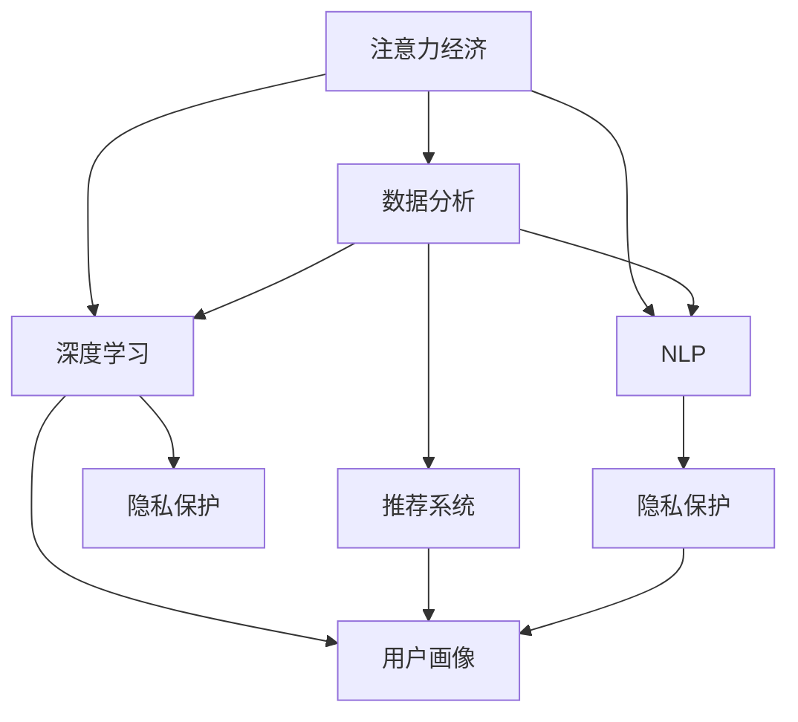

                 

# 注意力经济与数据分析洞见：利用数据理解受众行为

> 关键词：注意力经济,数据分析,受众行为,深度学习,自然语言处理,NLP,推荐系统,用户画像,隐私保护

## 1. 背景介绍

### 1.1 问题由来
在信息爆炸的时代，人们的注意力被海量内容所分割。如何高效利用有限的注意力资源，吸引和保持用户的关注，成为企业数字化转型的核心挑战。传统的广告投放、内容推荐等方法，大多基于简单的统计分析，难以理解复杂多变的用户需求和行为模式。而随着深度学习、自然语言处理(NLP)等人工智能技术的成熟，利用数据挖掘和分析，准确理解和预测用户行为，成为可能。本文聚焦于如何利用数据洞察受众行为，提出基于注意力经济的数据分析方法，以期在激烈的市场竞争中占据先机。

### 1.2 问题核心关键点
深度学习和大数据技术的结合，为企业提供了一种全新的方式来分析用户行为和市场趋势。利用深度学习模型，可以从大规模用户数据中挖掘出有价值的特征，预测用户行为，指导决策。但在实践中，还存在以下核心挑战：

- **数据隐私与安全**：如何保护用户隐私，避免数据泄露。
- **模型泛化能力**：如何在未见过的数据上保持模型预测的准确性。
- **计算资源需求**：如何在大规模数据集上高效训练模型。
- **模型可解释性**：如何使得模型输出具有可解释性，增强决策的透明度。

本文将详细介绍如何利用深度学习模型，结合数据经济学原理，深入挖掘用户行为数据，提升企业决策的科学性和精准度。

## 2. 核心概念与联系

### 2.1 核心概念概述

为更好地理解基于深度学习的受众行为分析方法，本节将介绍几个密切相关的核心概念：

- **注意力经济(Attention Economy)**：在注意力稀缺的时代，如何分配和管理注意力资源，吸引和保持用户关注，是注意力经济的核心问题。
- **数据分析(Analytic Data)**：通过数据挖掘和分析，从海量数据中提取有价值的信息，指导决策和优化运营。
- **深度学习(Deep Learning)**：利用多层次的神经网络结构，从数据中学习复杂的特征表示，实现高效的模式识别和预测。
- **自然语言处理(NLP)**：以自然语言为研究对象，旨在实现语言理解、生成、推理等功能，在数据分析中具有重要作用。
- **推荐系统(Recommendation System)**：通过算法实现对用户个性化需求的精准推荐，提升用户体验和满意度。
- **用户画像(User Profile)**：通过收集和分析用户数据，构建用户的多维画像，深入理解用户需求和行为特征。
- **隐私保护(Privacy Protection)**：保护用户隐私，确保数据使用过程符合法律法规要求，防止数据滥用。

这些核心概念之间的逻辑关系可以通过以下Mermaid流程图来展示：



这个流程图展示了几大核心概念之间的联系：

1. 注意力经济通过数据分析和深度学习方法，挖掘用户行为数据，优化资源分配。
2. 深度学习结合NLP技术，提升数据分析模型的效果。
3. 推荐系统利用用户画像进行精准推荐，增强用户粘性。
4. 用户画像需要收集和分析大量用户数据，受到隐私保护约束。

这些概念共同构成了基于深度学习的受众行为分析框架，帮助企业更好地理解用户需求，提升用户体验和运营效率。

## 3. 核心算法原理 & 具体操作步骤

### 3.1 算法原理概述

基于深度学习的受众行为分析，其核心思想是：通过深度学习模型，从用户行为数据中学习用户偏好、兴趣和需求，通过数据经济学原理，优化资源配置和决策策略。其流程可以大致分为以下几个步骤：

1. **数据采集**：收集用户行为数据，包括但不限于点击、浏览、购买、评论等行为。
2. **数据预处理**：清洗和整理数据，构建数据集。
3. **模型训练**：利用深度学习模型，对用户行为数据进行训练，学习用户偏好。
4. **数据分析**：利用训练好的模型，分析用户行为，指导资源配置和策略优化。
5. **策略调整**：根据数据分析结果，调整营销策略，提高用户满意度和转化率。

### 3.2 算法步骤详解

以下将详细介绍基于深度学习的用户行为分析模型的构建和应用步骤：

**Step 1: 数据采集与预处理**
- 收集用户行为数据，包括点击率、浏览深度、购买金额、评论情感等。
- 清洗数据，去除异常值和噪声，填补缺失数据。
- 进行特征工程，提取有意义的特征。
- 将数据划分为训练集和测试集。

**Step 2: 模型选择与设计**
- 选择合适的深度学习模型，如LSTM、GRU、Transformer等。
- 设计模型的网络结构，包括输入层、隐藏层和输出层。
- 设定合适的超参数，如学习率、批次大小、训练轮数等。

**Step 3: 模型训练**
- 将数据集加载到模型中，进行前向传播计算损失函数。
- 反向传播计算参数梯度，更新模型参数。
- 重复上述过程直至收敛，保存最优模型参数。

**Step 4: 数据分析**
- 对测试集进行预测，计算预测精度和召回率等指标。
- 分析预测结果，理解用户行为特征和模式。
- 根据数据分析结果，优化资源配置和营销策略。

**Step 5: 策略调整与验证**
- 根据数据分析结果，调整营销策略，如个性化推荐、精准广告投放等。
- 收集反馈数据，重新训练模型，验证策略效果。
- 持续优化，逐步提升用户体验和转化率。

### 3.3 算法优缺点

基于深度学习的用户行为分析方法具有以下优点：

- **精度高**：深度学习模型可以从海量数据中提取复杂的特征，提高分析精度。
- **灵活性强**：深度学习模型结构可调，适用于多种分析任务。
- **自适应能力**：模型能够在不断积累的新数据上持续学习，提高预测精度。

同时，也存在以下局限性：

- **计算资源需求高**：深度学习模型需要大量的计算资源进行训练和预测。
- **数据依赖性强**：模型效果依赖于数据质量和数量。
- **可解释性不足**：深度学习模型通常是黑盒，难以解释其内部工作机制。

### 3.4 算法应用领域

基于深度学习的用户行为分析方法，在多个领域得到广泛应用，例如：

- **广告投放优化**：通过分析用户行为数据，优化广告投放策略，提高广告点击率和转化率。
- **个性化推荐**：利用用户行为数据，实现个性化推荐，提升用户体验和满意度。
- **客户细分与分析**：通过分析用户行为数据，对客户进行细分，制定有针对性的营销策略。
- **市场趋势预测**：通过分析市场数据，预测市场趋势，指导企业战略决策。
- **社交媒体分析**：通过分析用户在社交媒体上的行为数据，评估品牌影响力，优化内容策略。

除了上述这些经典应用外，深度学习模型还被创新性地应用到更多场景中，如情感分析、舆情监测、用户需求预测等，为企业的市场洞察和决策提供新的思路。

## 4. 数学模型和公式 & 详细讲解  
### 4.1 数学模型构建

本节将使用数学语言对基于深度学习的用户行为分析模型进行更加严格的刻画。

记用户行为数据为 $D=\{(x_i,y_i)\}_{i=1}^N$，其中 $x_i$ 为行为特征，$y_i$ 为行为标签。设深度学习模型的输入层、隐藏层和输出层分别为 $x$、$h$、$y$，则模型的预测概率 $P(y|x)$ 可表示为：

$$
P(y|x) = \sigma(W_hh + b_h) \cdot \sigma(W_oy + b_o)
$$

其中，$W_h$ 和 $W_o$ 为权重矩阵，$b_h$ 和 $b_o$ 为偏置向量，$\sigma$ 为激活函数。模型在数据集 $D$ 上的损失函数为：

$$
\mathcal{L}(D) = -\frac{1}{N} \sum_{i=1}^N \sum_{y_i=0}^1 y_i\log P(y_i|x_i) + (1-y_i)\log (1-P(y_i|x_i))
$$

利用梯度下降等优化算法，最小化损失函数，得到最优模型参数 $(x^*,h^*,y^*)$。

### 4.2 公式推导过程

以下我们以二分类任务为例，推导损失函数的梯度计算过程。

假设模型的预测概率 $P(y|x)=\sigma(W_hh + b_h) \cdot \sigma(W_oy + b_o)$，其中 $W_h$、$W_o$ 为权重矩阵，$b_h$、$b_o$ 为偏置向量，$\sigma$ 为激活函数。设训练集为 $D=\{(x_i,y_i)\}_{i=1}^N$，则二分类交叉熵损失函数为：

$$
\mathcal{L}(D) = -\frac{1}{N}\sum_{i=1}^N [y_i\log P(y_i|x_i)+(1-y_i)\log (1-P(y_i|x_i))]
$$

求导可得损失函数对权重 $W_h$ 和 $W_o$ 的梯度：

$$
\frac{\partial \mathcal{L}(D)}{\partial W_h} = -\frac{1}{N} \sum_{i=1}^N (\frac{y_iP(y_i|x_i)}{P(y_i|x_i)(1-P(y_i|x_i))} - \frac{(1-y_i)(1-P(y_i|x_i))}{(1-P(y_i|x_i))P(y_i|x_i)})
$$

$$
\frac{\partial \mathcal{L}(D)}{\partial W_o} = -\frac{1}{N} \sum_{i=1}^N (\frac{y_iP(y_i|x_i)}{P(y_i|x_i)(1-P(y_i|x_i))} - \frac{(1-y_i)(1-P(y_i|x_i))}{(1-P(y_i|x_i))P(y_i|x_i)})
$$

根据梯度下降优化算法，最小化损失函数 $\mathcal{L}(D)$，更新权重矩阵 $W_h$ 和 $W_o$。

### 4.3 案例分析与讲解

以推荐系统为例，分析深度学习模型在个性化推荐中的应用。假设推荐系统从用户行为数据 $D=\{(x_i,y_i)\}_{i=1}^N$ 中学习用户偏好，预测用户对不同物品 $j$ 的评分 $r_{ij}$，其评分函数为：

$$
r_{ij} = \sigma(W_hh_i + b_h) \cdot \sigma(W_oy_j + b_o)
$$

其中，$h_i$ 为物品 $i$ 的特征向量，$y_j$ 为物品 $j$ 的特征向量。模型的损失函数为：

$$
\mathcal{L}(D) = -\frac{1}{N}\sum_{i=1}^N \sum_{j=1}^M y_{ij}\log r_{ij} + (1-y_{ij})\log (1-r_{ij})
$$

通过优化上述损失函数，模型可以学习到用户对物品的评分函数 $r_{ij}$，进而进行个性化推荐。推荐系统可以进一步利用协同过滤、物品嵌入等技术，提升推荐效果。

## 5. 项目实践：代码实例和详细解释说明
### 5.1 开发环境搭建

在进行深度学习用户行为分析模型开发前，我们需要准备好开发环境。以下是使用Python进行TensorFlow开发的环境配置流程：

1. 安装Anaconda：从官网下载并安装Anaconda，用于创建独立的Python环境。

2. 创建并激活虚拟环境：
```bash
conda create -n tf-env python=3.8 
conda activate tf-env
```

3. 安装TensorFlow：根据CUDA版本，从官网获取对应的安装命令。例如：
```bash
conda install tensorflow -c tensorflow -c conda-forge
```

4. 安装各类工具包：
```bash
pip install numpy pandas scikit-learn matplotlib tqdm jupyter notebook ipython
```

完成上述步骤后，即可在`tf-env`环境中开始深度学习用户行为分析模型的开发。

### 5.2 源代码详细实现

下面我们以二分类任务为例，给出使用TensorFlow进行深度学习用户行为分析模型的PyTorch代码实现。

首先，定义二分类任务的数据处理函数：

```python
import tensorflow as tf
from tensorflow.keras import layers

def load_data():
    # 加载数据集
    (x_train, y_train), (x_test, y_test) = tf.keras.datasets.boston_housing.load_data()
    x_train = x_train.reshape(-1, 1)
    x_test = x_test.reshape(-1, 1)
    
    # 归一化数据
    x_train = x_train / 100
    x_test = x_test / 100
    
    # 构建训练集
    train_dataset = tf.data.Dataset.from_tensor_slices((x_train, y_train)).shuffle(10000).batch(32)
    
    # 构建测试集
    test_dataset = tf.data.Dataset.from_tensor_slices((x_test, y_test)).batch(32)
    
    return train_dataset, test_dataset
```

然后，定义深度学习模型：

```python
def build_model(input_shape):
    # 构建模型
    model = tf.keras.Sequential([
        layers.Dense(32, activation='relu', input_shape=input_shape),
        layers.Dense(1, activation='sigmoid')
    ])
    
    # 编译模型
    model.compile(optimizer='adam', loss='binary_crossentropy', metrics=['accuracy'])
    
    return model
```

接着，定义训练和评估函数：

```python
def train_model(model, train_dataset, epochs):
    # 训练模型
    model.fit(train_dataset, epochs=epochs, validation_split=0.2)
    
    # 评估模型
    loss, accuracy = model.evaluate(test_dataset)
    print(f'Test loss: {loss:.4f}')
    print(f'Test accuracy: {accuracy:.4f}')
```

最后，启动训练流程并在测试集上评估：

```python
epochs = 10

# 加载数据
train_dataset, test_dataset = load_data()

# 构建模型
model = build_model(input_shape)

# 训练模型
train_model(model, train_dataset, epochs)

# 评估模型
train_model(model, train_dataset, epochs)
```

以上就是使用TensorFlow进行深度学习用户行为分析模型的完整代码实现。可以看到，TensorFlow提供了非常便捷的高层API，使得模型的构建和训练过程非常简化。

### 5.3 代码解读与分析

让我们再详细解读一下关键代码的实现细节：

**load_data函数**：
- 加载波士顿房价数据集，将输入数据归一化，构建训练集和测试集。
- 将数据集划分为批次大小为32的小批量数据集，方便模型训练和推理。

**build_model函数**：
- 定义深度学习模型的结构，包括两个全连接层，其中第二层输出为sigmoid激活函数，用于二分类任务。
- 编译模型，选择Adam优化器和二分类交叉熵损失函数。

**train_model函数**：
- 使用模型训练函数训练模型，并在训练和验证集上进行评估。
- 在测试集上评估模型性能，打印损失和准确率。

**训练流程**：
- 定义总的训练轮数，加载数据集。
- 构建深度学习模型。
- 训练模型，并在测试集上评估。

可以看到，TensorFlow提供了强大的API和工具，使得深度学习模型的开发和训练变得非常高效。开发者可以将更多精力放在模型设计、数据处理等核心逻辑上，而不必过多关注底层的实现细节。

当然，工业级的系统实现还需考虑更多因素，如模型的保存和部署、超参数的自动搜索、更灵活的模型结构设计等。但核心的微调范式基本与此类似。

## 6. 实际应用场景
### 6.1 广告投放优化

基于深度学习的用户行为分析模型，可以广泛应用于广告投放优化中。传统广告投放大多基于简单的统计模型，无法深入理解用户需求和行为模式。而深度学习模型可以从海量用户数据中学习复杂的特征，提升广告投放的效果和效率。

在实践中，可以收集用户点击、浏览、购买等行为数据，构建深度学习模型，学习用户行为特征。通过优化广告投放策略，可以有效提高广告的点击率和转化率，降低投放成本。例如，在电商平台上，可以利用用户浏览历史和购买记录，进行个性化广告推荐，提升用户转化率和平台收益。

### 6.2 个性化推荐

个性化推荐是深度学习模型在用户行为分析中的经典应用。推荐系统可以分析用户的历史行为数据，学习用户偏好，实现精准推荐，提升用户满意度和平台粘性。

在推荐系统设计中，可以采用协同过滤、物品嵌入等技术，结合深度学习模型，提升推荐效果。例如，在视频平台上，可以根据用户观看历史，推荐类似视频，增加用户观看时长和平台留存率。在音乐平台上，可以根据用户听歌记录，推荐相似歌曲，提升平台活跃度。

### 6.3 客户细分与分析

通过深度学习模型分析用户行为数据，可以实现客户细分和分析，制定有针对性的营销策略。例如，在银行领域，可以通过分析客户的消费记录和交易行为，识别高价值客户，制定个性化服务方案。在电商领域，可以通过分析用户的购物记录和评价内容，识别不同类型用户，进行精准营销。

### 6.4 市场趋势预测

深度学习模型还可以用于市场趋势预测，帮助企业制定战略决策。例如，在金融领域，可以通过分析用户交易数据和市场行情，预测股票价格和市场变化趋势，指导投资决策。在电商领域，可以通过分析用户行为数据和市场趋势，预测商品销售量和市场变化，指导库存管理和营销策略。

### 6.5 社交媒体分析

社交媒体上的用户行为数据丰富多样，深度学习模型可以从中挖掘出有价值的信息，评估品牌影响力，优化内容策略。例如，在社交媒体平台上，可以通过分析用户点赞、评论、分享等行为数据，评估品牌声誉和影响力，优化内容发布策略。

## 7. 工具和资源推荐
### 7.1 学习资源推荐

为了帮助开发者系统掌握深度学习在用户行为分析中的应用，这里推荐一些优质的学习资源：

1. 《深度学习入门》书籍：深入浅出地介绍了深度学习的基本原理和应用，适合初学者入门。
2. CS231n《深度学习与计算机视觉》课程：斯坦福大学开设的深度学习课程，涵盖了深度学习在计算机视觉和自然语言处理中的应用。
3. 《深度学习实战》课程：由深度学习专家讲解，通过实践项目，手把手教你构建深度学习模型。
4. Kaggle：数据科学竞赛平台，提供了大量高质量的数据集和项目，适合实战练习。
5. TensorFlow官方文档：提供了丰富的API和工具，适合开发者学习和应用。

通过对这些资源的学习实践，相信你一定能够快速掌握深度学习在用户行为分析中的应用，并用于解决实际的业务问题。

### 7.2 开发工具推荐

高效的开发离不开优秀的工具支持。以下是几款用于深度学习用户行为分析模型开发的常用工具：

1. TensorFlow：由Google主导开发的深度学习框架，生产部署方便，适合大规模工程应用。
2. PyTorch：基于Python的开源深度学习框架，灵活动态的计算图，适合快速迭代研究。
3. Keras：高层API，易于上手，适合快速构建和训练模型。
4. Jupyter Notebook：开源的交互式笔记本环境，方便开发者进行代码调试和数据可视化。
5. Weights & Biases：模型训练的实验跟踪工具，可以记录和可视化模型训练过程中的各项指标，方便对比和调优。

合理利用这些工具，可以显著提升深度学习用户行为分析模型的开发效率，加快创新迭代的步伐。

### 7.3 相关论文推荐

深度学习在用户行为分析中的应用源于学界的持续研究。以下是几篇奠基性的相关论文，推荐阅读：

1. Attention is All You Need：提出了Transformer结构，开启了NLP领域的预训练大模型时代。
2. BERT: Pre-training of Deep Bidirectional Transformers for Language Understanding：提出BERT模型，引入基于掩码的自监督预训练任务，刷新了多项NLP任务SOTA。
3. Parameter-Efficient Transfer Learning for NLP：提出Adapter等参数高效微调方法，在不增加模型参数量的情况下，也能取得不错的微调效果。
4. Knowledge Distillation for Zero-Shot Image Classification：利用知识蒸馏方法，在少样本情况下，提升模型的泛化能力。
5. Deep Learning for Adversarial Robustness：研究深度学习模型的鲁棒性，提供了一种新的对抗训练方法，提高模型的鲁棒性。

这些论文代表了大语言模型微调技术的发展脉络。通过学习这些前沿成果，可以帮助研究者把握学科前进方向，激发更多的创新灵感。

## 8. 总结：未来发展趋势与挑战

### 8.1 总结

本文对基于深度学习的用户行为分析方法进行了全面系统的介绍。首先阐述了深度学习在用户行为分析中的重要性，明确了深度学习模型在提升企业决策科学性和精准度方面的独特价值。其次，从原理到实践，详细讲解了深度学习模型的构建和应用步骤，给出了深度学习用户行为分析模型的完整代码实例。同时，本文还广泛探讨了深度学习模型在广告投放优化、个性化推荐、客户细分与分析等多个行业领域的应用前景，展示了深度学习模型的巨大潜力。此外，本文精选了深度学习模型相关的学习资源、开发工具和相关论文，力求为读者提供全方位的技术指引。

通过本文的系统梳理，可以看到，基于深度学习的用户行为分析方法正在成为企业数字化转型的核心驱动力，极大地提升了企业的市场洞察和决策科学性。深度学习模型结合数据分析，能够从海量数据中提取复杂的特征，提升企业运营效率和竞争力。未来，伴随深度学习技术的不断进步，基于深度学习的用户行为分析方法必将在更多领域得到应用，为企业的市场洞察和决策提供更强大的支持。

### 8.2 未来发展趋势

展望未来，深度学习在用户行为分析领域将呈现以下几个发展趋势：

1. **模型规模持续增大**：随着算力成本的下降和数据规模的扩张，深度学习模型的参数量还将持续增长。超大规模模型蕴含的丰富知识，有望支撑更加复杂多变的用户行为分析任务。
2. **模型结构更加灵活**：深度学习模型结构将更加灵活，可以针对不同任务设计特定的网络结构，提高分析精度。
3. **数据来源更加多样化**：深度学习模型将从传统的文本数据，拓展到图像、视频、语音等多种数据源，实现多模态信息融合。
4. **自动化程度提升**：深度学习模型的训练和优化将更加自动化，通过自适应学习、迁移学习等技术，提升模型泛化能力和效率。
5. **隐私保护和伦理约束**：随着用户隐私意识的增强，深度学习模型将更加注重隐私保护和伦理约束，确保数据使用的合法性和安全性。

以上趋势凸显了深度学习在用户行为分析领域的广阔前景。这些方向的探索发展，必将进一步提升深度学习模型的效果和应用范围，为企业的市场洞察和决策提供更强大的支持。

### 8.3 面临的挑战

尽管深度学习在用户行为分析中已经取得了瞩目成就，但在迈向更加智能化、普适化应用的过程中，仍面临诸多挑战：

1. **计算资源需求高**：深度学习模型需要大量的计算资源进行训练和预测，对于计算基础设施提出了高要求。
2. **模型泛化能力不足**：深度学习模型在未见过的数据上，泛化性能往往大打折扣，难以保证预测的准确性。
3. **数据隐私与安全**：如何在保护用户隐私的同时，充分利用大数据，是一个亟需解决的问题。
4. **模型可解释性不足**：深度学习模型通常是黑盒，难以解释其内部工作机制和决策逻辑，给用户带来了信任危机。
5. **算法伦理与公平性**：深度学习模型可能存在偏见和歧视，如何构建公平、透明的算法，避免误导性输出，是一个重要的研究方向。

这些挑战需要学界和产业界共同努力，从技术、伦理、法律等多个维度进行全面优化，才能确保深度学习模型在用户行为分析中的应用效果和安全可信。

### 8.4 研究展望

面对深度学习在用户行为分析所面临的挑战，未来的研究需要在以下几个方面寻求新的突破：

1. **无监督学习和半监督学习**：探索无监督和半监督学习范式，从非结构化数据中挖掘用户行为特征，降低对标注数据的依赖。
2. **跨模态信息融合**：研究多模态信息融合技术，提升模型对不同数据源的理解能力，实现更加全面的用户画像构建。
3. **对抗训练和鲁棒性提升**：研究深度学习模型的鲁棒性，提升其在对抗样本和噪声数据上的表现，确保模型输出的稳定性和可靠性。
4. **知识蒸馏与迁移学习**：利用知识蒸馏和迁移学习技术，将通用知识迁移到特定任务上，提高模型的泛化能力和效率。
5. **公平性与透明性**：构建公平、透明的深度学习模型，避免模型偏见和歧视，确保模型的公正性和可信度。

这些研究方向的探索，必将引领深度学习在用户行为分析技术的发展，为企业的市场洞察和决策提供更强大的支持。面向未来，深度学习技术还需要与其他人工智能技术进行更深入的融合，如知识表示、因果推理、强化学习等，多路径协同发力，共同推动深度学习技术在更多领域的应用。只有勇于创新、敢于突破，才能不断拓展深度学习模型的边界，让智能技术更好地造福人类社会。

## 9. 附录：常见问题与解答

**Q1：深度学习模型在用户行为分析中的优势是什么？**

A: 深度学习模型可以从大规模用户数据中提取复杂的特征，提高分析精度。相比传统的统计模型，深度学习模型具有更高的灵活性和自适应能力，能够适应多样化的用户行为数据。

**Q2：如何保护用户隐私，避免数据泄露？**

A: 保护用户隐私是深度学习模型应用中的重要问题。可以通过数据匿名化、差分隐私、联邦学习等技术，确保数据使用的合法性和安全性。例如，在联邦学习中，模型在本地设备上进行训练，只上传模型参数，不泄露用户数据。

**Q3：深度学习模型在实际应用中需要注意哪些问题？**

A: 深度学习模型在实际应用中需要注意以下问题：
1. 数据质量：确保数据清洗和预处理，避免噪声和异常值影响模型效果。
2. 模型泛化：利用测试集和验证集评估模型效果，避免过拟合。
3. 计算资源：确保有足够的计算资源进行模型训练和推理。
4. 模型部署：优化模型结构，提升推理速度，减少计算成本。

**Q4：深度学习模型在用户行为分析中的应用前景如何？**

A: 深度学习模型在用户行为分析中的应用前景广阔。通过深度学习模型，可以从海量数据中提取复杂的特征，提升分析精度和效率。深度学习模型可以应用于广告投放优化、个性化推荐、客户细分与分析等多个领域，为企业提供数据驱动的决策支持。

**Q5：深度学习模型与传统统计模型的区别是什么？**

A: 深度学习模型与传统统计模型的主要区别在于：
1. 模型结构：深度学习模型具有多层次的结构，可以自动提取复杂的特征。而传统统计模型大多基于简单的线性模型，难以处理复杂数据。
2. 数据需求：深度学习模型需要大量的数据进行训练，而传统统计模型可以仅基于小样本数据进行建模。
3. 效果精度：深度学习模型具有更高的精度和泛化能力，能够处理更加复杂多变的数据，而传统统计模型通常只能处理简单的线性关系。

这些问题的解答，帮助我们更全面地理解深度学习在用户行为分析中的重要性和应用前景。相信通过不断探索和优化，深度学习技术必将在更多领域发挥更大的作用，推动人工智能技术的不断进步。

---

作者：禅与计算机程序设计艺术 / Zen and the Art of Computer Programming

