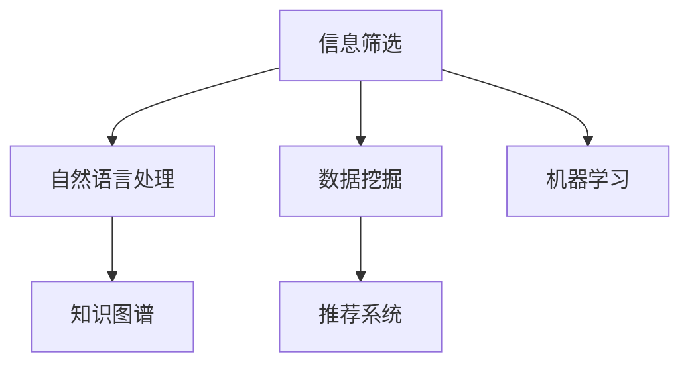
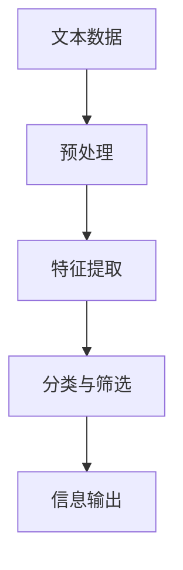

                 

# 注意力经济中的信息筛选能力培养

在信息爆炸的时代，信息的筛选和处理变得尤为重要。特别是在注意力经济中，如何高效地获取、筛选和利用信息，直接决定了企业和个人在市场中的竞争力。本文将从信息筛选的原理、技术和实践等方面进行探讨，旨在帮助读者培养强大的信息筛选能力。

## 1. 背景介绍

### 1.1 问题由来
在信息时代，互联网和社交媒体的兴起使得信息量呈指数级增长。无论是企业获取市场数据、分析竞争对手，还是个人规划职业、学习新知，都面临着海量信息的挑战。如何在这片信息海洋中准确、高效地抓取和筛选有用的信息，成为每个从业者必须面对的问题。

### 1.2 问题核心关键点
信息筛选的关键在于以下几个方面：

- **目标明确**：明确筛选信息的目的是什么，是市场调研、竞争分析，还是学习知识。
- **数据来源可靠**：确保数据来源的权威性和准确性，避免误导性的信息。
- **算法高效**：使用高效的算法和技术手段，提升信息筛选的速度和准确性。
- **持续学习**：根据筛选结果不断调整策略，提升筛选能力。

## 2. 核心概念与联系

### 2.1 核心概念概述

为更好地理解信息筛选的原理和实践，本节将介绍几个关键概念：

- **信息筛选**：从大量信息中选出有价值、有针对性的信息的过程。
- **自然语言处理(NLP)**：一种人工智能技术，通过机器学习和语言模型，实现对文本信息的理解和处理。
- **数据挖掘**：从大数据中自动发现有用信息和知识的过程。
- **推荐系统**：根据用户行为和偏好，推荐相关内容的技术。
- **机器学习**：利用数据训练模型，实现自动化的信息筛选和分析。
- **知识图谱**：一种结构化的知识表示方式，用于整合和管理复杂信息。

这些概念之间的联系紧密，共同构成了信息筛选和利用的技术框架，如图1所示：



这个流程图展示了一些核心概念之间的逻辑关系：

1. **自然语言处理(NLP)**：通过语言模型对文本信息进行处理，提取关键特征和实体信息。
2. **数据挖掘**：从大规模数据中自动发现有用的模式和规律，为信息筛选提供依据。
3. **推荐系统**：利用用户行为数据，为用户推荐相关内容，提升信息获取效率。
4. **机器学习**：训练模型进行信息筛选和分类，提升筛选的准确性和效率。
5. **知识图谱**：构建结构化的知识网络，整合和推理信息，提升信息利用深度。

## 3. 核心算法原理 & 具体操作步骤

### 3.1 算法原理概述

信息筛选的算法原理主要基于自然语言处理(NLP)和机器学习等技术手段。其核心思想是通过算法对文本信息进行预处理、特征提取、分类等操作，筛选出符合目标需求的信息。具体流程如图2所示：



其中，预处理包括文本清洗、分词、词性标注等步骤，特征提取通常通过TF-IDF、词嵌入等方法获得，分类与筛选则通过训练好的模型实现。

### 3.2 算法步骤详解

信息筛选的详细步骤包括：

1. **数据收集**：从互联网、数据库、社交媒体等渠道收集数据。
2. **文本预处理**：对收集到的文本数据进行清洗、分词、词性标注等预处理操作。
3. **特征提取**：使用TF-IDF、词嵌入等方法提取文本特征。
4. **模型训练**：使用机器学习算法（如SVM、LSTM、BERT等）训练分类模型。
5. **信息筛选**：根据目标需求，使用训练好的模型筛选出有价值的信息。
6. **信息输出**：将筛选出的信息以报告、图表等形式展示或存储。

### 3.3 算法优缺点

信息筛选算法具有以下优点：

- **高效性**：自动化处理大量文本信息，显著提升筛选速度。
- **准确性**：通过机器学习模型，提升筛选的准确性。
- **可扩展性**：适用于各种类型的数据，可方便地扩展到不同领域。

但同时，也存在一些局限性：

- **数据依赖**：需要大量标注数据进行模型训练，数据量不足时效果不佳。
- **算法复杂**：某些高级算法（如BERT、RNN）计算复杂度高，对硬件资源要求较高。
- **模型解释性不足**：模型结果缺乏解释性，难以理解其内部工作机制。

### 3.4 算法应用领域

信息筛选技术在多个领域得到了广泛应用，包括但不限于：

- **市场调研**：分析竞争对手、客户反馈、市场趋势等。
- **社交媒体分析**：分析用户评论、情感倾向、热点话题等。
- **个性化推荐**：根据用户行为推荐商品、文章、视频等。
- **知识管理**：整合和检索大量知识文档，辅助知识工作。
- **情报分析**：获取和分析开源情报，辅助决策制定。

## 4. 数学模型和公式 & 详细讲解

### 4.1 数学模型构建

信息筛选的数学模型通常基于分类问题的构建。假设有$N$个文本样本，每个样本$x_i$包含$n$个特征，对应一个类别标签$y_i \in \{1, 2, \cdots, K\}$，其中$K$为类别数。构建的数学模型为：

$$
\max_{\theta} \sum_{i=1}^{N} \log P(y_i | x_i; \theta)
$$

其中$\theta$为模型参数，$P(y_i | x_i; \theta)$为给定特征$x_i$下，样本$y_i$属于类别$k$的概率。

### 4.2 公式推导过程

以常用的SVM分类模型为例，其决策函数为：

$$
f(x) = \sum_{i=1}^{n} \alpha_i y_i k(x_i, x) + b
$$

其中$\alpha_i$为拉格朗日乘子，$k(x_i, x)$为核函数，$b$为截距。SVM的目标是最小化间隔函数：

$$
\min_{\alpha} \frac{1}{2} \sum_{i=1}^{n} \alpha_i \alpha_j y_i y_j k(x_i, x_j) - \sum_{i=1}^{n} \alpha_i y_i
$$

通过求解上述优化问题，得到最优的分类超平面。

### 4.3 案例分析与讲解

以金融领域为例，假设需要从新闻、报告、社交媒体中筛选出与股市相关的信息。可以使用NLP技术提取文本的关键词、情感倾向等特征，构建词袋模型或TF-IDF模型，然后使用SVM、LSTM等算法训练分类模型，对文本进行分类筛选。

## 5. 项目实践：代码实例和详细解释说明

### 5.1 开发环境搭建

在进行信息筛选实践前，我们需要准备好开发环境。以下是使用Python进行Scikit-learn开发的环境配置流程：

1. 安装Anaconda：从官网下载并安装Anaconda，用于创建独立的Python环境。

2. 创建并激活虚拟环境：
```bash
conda create -n sklearn-env python=3.8 
conda activate sklearn-env
```

3. 安装Scikit-learn：
```bash
pip install scikit-learn
```

4. 安装Natural Language Toolkit (NLTK)：
```bash
pip install nltk
```

5. 安装相关数据集：
```bash
pip install datasets
```

完成上述步骤后，即可在`sklearn-env`环境中开始信息筛选实践。

### 5.2 源代码详细实现

下面以情感分析任务为例，给出使用Scikit-learn对文本数据进行情感分类的代码实现。

首先，导入必要的库和数据集：

```python
from sklearn.datasets import fetch_20newsgroups
from sklearn.feature_extraction.text import CountVectorizer
from sklearn.model_selection import train_test_split
from sklearn.naive_bayes import MultinomialNB
from sklearn.metrics import classification_report

# 加载20个新闻组数据集
newsgroups = fetch_20newsgroups(subset='train')
```

然后，进行文本预处理：

```python
# 分词和去除停用词
vectorizer = CountVectorizer(stop_words='english')
X = vectorizer.fit_transform(newsgroups.data)
```

接着，进行数据分割和模型训练：

```python
# 分割数据集
X_train, X_test, y_train, y_test = train_test_split(X, newsgroups.target, test_size=0.2, random_state=42)

# 训练朴素贝叶斯分类器
clf = MultinomialNB()
clf.fit(X_train, y_train)
```

最后，评估模型性能：

```python
# 在测试集上评估模型性能
y_pred = clf.predict(X_test)
print(classification_report(y_test, y_pred))
```

以上就是使用Scikit-learn对文本数据进行情感分类的完整代码实现。可以看到，使用Scikit-learn进行信息筛选的代码实现相对简单。

### 5.3 代码解读与分析

让我们再详细解读一下关键代码的实现细节：

**fetch_20newsgroups函数**：
- 从Scikit-learn数据集中加载新闻组数据集，包含20个不同的新sgroups，包括体育、政治、科技等。

**CountVectorizer类**：
- 实现文本向量化，将文本转换为稀疏矩阵形式，方便模型训练。
- 使用nltk库中英文停用词列表，去除无意义词汇。

**train_test_split函数**：
- 将数据集随机分为训练集和测试集，用于模型训练和评估。

**MultinomialNB类**：
- 实现朴素贝叶斯分类器，适合处理多分类问题。
- 通过训练数据拟合模型，预测测试集标签。

**classification_report函数**：
- 输出模型在测试集上的精确度、召回率和F1分数等指标，用于评估模型性能。

**fit_transform方法**：
- 对训练集数据进行向量化和拟合，生成特征矩阵。

可以看到，Scikit-learn提供了从数据预处理到模型训练、评估的全面支持，极大地方便了信息筛选任务的开发。

当然，工业级的系统实现还需考虑更多因素，如特征工程、模型选择、超参数调优等。但核心的信息筛选范式基本与此类似。

## 6. 实际应用场景

### 6.1 智能客服系统

智能客服系统通过信息筛选技术，能够从用户输入的文本中筛选出关键信息，快速响应用户需求。例如，在用户咨询保险问题时，系统能够自动提取保险类型、理赔金额等信息，调用相关服务进行处理。

### 6.2 广告投放优化

在广告投放中，通过信息筛选技术，能够从大量广告数据中筛选出点击率高、转化率高的广告素材，提高投放效果。例如，利用情感分析模型筛选出用户对某产品的正面评论，推荐给潜在用户。

### 6.3 舆情监测

舆情监测中，通过信息筛选技术，能够从社交媒体、新闻报道中筛选出与品牌、产品相关的信息，及时发现舆情变化，进行危机公关。例如，利用情感分析模型筛选出对某品牌产品的负面评论，及时处理和回应。

### 6.4 推荐系统

推荐系统中，通过信息筛选技术，能够从用户行为数据中筛选出用户的兴趣偏好，推荐相关商品、文章、视频等。例如，利用协同过滤算法筛选出用户感兴趣的电影，推荐给用户。

## 7. 工具和资源推荐

### 7.1 学习资源推荐

为了帮助开发者系统掌握信息筛选的原理和实践，这里推荐一些优质的学习资源：

1. 《Python数据科学手册》：全面介绍Python在数据科学中的应用，包括文本处理、机器学习等。
2. Coursera《自然语言处理》课程：由斯坦福大学教授讲授，涵盖自然语言处理的基本概念和前沿技术。
3. Kaggle平台：提供大量的NLP竞赛数据集和开源代码，适合实战练习。
4. Scikit-learn官方文档：详细介绍Scikit-learn库的用法和应用案例。
5. NLTK官方文档：提供自然语言处理的基本工具和算法，适合入门学习。

通过对这些资源的学习实践，相信你一定能够快速掌握信息筛选的精髓，并用于解决实际的NLP问题。

### 7.2 开发工具推荐

高效的开发离不开优秀的工具支持。以下是几款用于信息筛选开发的常用工具：

1. Python：强大的编程语言，拥有丰富的科学计算和机器学习库。
2. Scikit-learn：Python的机器学习库，提供丰富的分类、回归、聚类算法。
3. NLTK：自然语言处理工具库，提供分词、词性标注、情感分析等功能。
4. TensorFlow：谷歌的深度学习框架，支持分布式计算和模型部署。
5. PyTorch：Facebook的深度学习框架，支持动态图和高效的模型训练。

合理利用这些工具，可以显著提升信息筛选任务的开发效率，加快创新迭代的步伐。

### 7.3 相关论文推荐

信息筛选技术的发展源于学界的持续研究。以下是几篇奠基性的相关论文，推荐阅读：

1. Text Mining: Concepts, Techniques, and Methods：介绍文本挖掘的基本概念和技术方法。
2. Mining Massive Datasets: Parallel Algorithms for Big Data：介绍大规模数据挖掘的算法和技术。
3. Semantic Analysis of User Comments in Online Reviews：介绍如何从用户评论中提取情感倾向和产品评价。
4. Topic Modeling for Text Mining：介绍如何构建主题模型，从文本中自动发现主题和模式。
5. Deep Learning for Natural Language Processing：介绍深度学习在自然语言处理中的应用，包括情感分析、机器翻译等。

这些论文代表了大语言模型微调技术的发展脉络。通过学习这些前沿成果，可以帮助研究者把握学科前进方向，激发更多的创新灵感。

## 8. 总结：未来发展趋势与挑战

### 8.1 总结

本文对信息筛选的原理、技术和实践等方面进行了全面系统的介绍。首先阐述了信息筛选的重要性和基本流程，明确了信息筛选在数据驱动决策中的核心地位。其次，从数学模型和代码实现等方面，详细讲解了信息筛选的核心算法和具体操作步骤。同时，本文还广泛探讨了信息筛选在智能客服、广告投放、舆情监测等实际应用场景中的广泛应用，展示了信息筛选技术的强大潜力。此外，本文精选了信息筛选技术的各类学习资源，力求为读者提供全方位的技术指引。

通过本文的系统梳理，可以看到，信息筛选技术正在成为数据科学中的重要范式，极大地提升了信息获取和处理的效率，为决策制定提供了坚实的数据基础。未来，伴随技术的不断进步，信息筛选方法还将进一步优化，为人工智能技术的应用提供更强的支持。

### 8.2 未来发展趋势

展望未来，信息筛选技术将呈现以下几个发展趋势：

1. **深度学习应用广泛**：深度学习在信息筛选中的应用将越来越广泛，特别是在自然语言处理、图像识别等领域，将大幅提升信息处理的速度和准确性。
2. **多模态信息融合**：未来的信息筛选将不仅仅依赖文本信息，而是综合利用视觉、听觉等多模态数据，提升信息的全面性和准确性。
3. **实时处理能力增强**：通过流式处理和分布式计算技术，信息筛选系统将具备更强的实时处理能力，支持在线决策和实时推荐。
4. **跨领域应用扩展**：信息筛选技术将进一步扩展到更多领域，如医疗、金融、教育等，为各行各业带来智能决策支持。
5. **增强学习与强化学习**：通过增强学习和强化学习技术，信息筛选系统将具备更强的自适应和学习能力，提升自动化水平。

这些趋势凸显了信息筛选技术的广阔前景。这些方向的探索发展，必将进一步提升信息筛选系统的性能和应用范围，为人工智能技术的应用提供更强的支持。

### 8.3 面临的挑战

尽管信息筛选技术已经取得了显著成就，但在迈向更加智能化、普适化应用的过程中，仍面临诸多挑战：

1. **数据隐私和安全**：在处理海量数据时，如何保证数据隐私和安全，防止数据泄露和滥用，是一个重要的问题。
2. **模型解释性不足**：信息筛选模型往往缺乏解释性，难以理解其内部工作机制，这限制了其在某些领域的应用。
3. **跨领域适应性**：信息筛选模型在不同领域上的适应性有限，需要针对特定领域进行模型微调。
4. **计算资源限制**：信息筛选模型通常计算复杂度较高，对硬件资源要求高，限制了其在资源受限环境中的应用。
5. **多语言支持**：现有信息筛选技术多依赖英文数据和模型，对多语言支持不足，限制了其在全球范围内的推广。

这些挑战需要通过技术创新和工程优化来解决，才能进一步拓展信息筛选技术的应用范围，提升其在各领域的普及度。

### 8.4 研究展望

面对信息筛选所面临的挑战，未来的研究需要在以下几个方面寻求新的突破：

1. **多语言和多领域模型**：开发支持多语言和多领域的信息筛选模型，提升模型的泛化能力和适应性。
2. **可解释性增强**：引入可解释性技术，如特征重要性分析、模型可视化等，提升信息筛选模型的透明度和可信度。
3. **分布式计算优化**：通过分布式计算和流式处理技术，优化信息筛选模型的计算性能，支持大规模实时数据处理。
4. **隐私保护技术**：引入隐私保护技术，如差分隐私、联邦学习等，确保数据隐私和安全。
5. **跨学科融合**：与其他学科（如认知科学、心理学等）进行跨学科融合，提升信息筛选模型的认知能力和决策支持能力。

这些研究方向将推动信息筛选技术的进一步发展，为人工智能技术的应用提供更强的支持。面向未来，信息筛选技术还需要与其他人工智能技术进行更深入的融合，共同推动智能决策和智能交互系统的进步。只有勇于创新、敢于突破，才能不断拓展信息筛选技术的边界，让智能技术更好地造福人类社会。

## 9. 附录：常见问题与解答

**Q1：信息筛选算法的核心是什么？**

A: 信息筛选算法的核心在于特征提取和分类。通过提取文本中的关键特征，并构建合适的分类模型，筛选出符合目标需求的信息。特征提取通常包括TF-IDF、词嵌入等方法，分类模型包括朴素贝叶斯、SVM、LSTM等算法。

**Q2：如何选择合适的水处理算法？**

A: 选择合适的水处理算法需要根据具体应用场景和数据特点进行评估。常见的水处理算法包括朴素贝叶斯、决策树、随机森林、支持向量机等。可以通过交叉验证和超参数调优，选择最优的算法。

**Q3：如何提升信息筛选的准确性？**

A: 提升信息筛选的准确性需要从数据预处理、特征提取、模型训练等多个环节进行优化。具体方法包括：
1. 数据清洗和预处理：去除噪声和无用数据，提升数据质量。
2. 特征提取：选择合适的方法提取关键特征，如TF-IDF、词嵌入等。
3. 模型训练：使用合适的算法和模型，进行多轮训练和调参。
4. 模型集成：使用集成学习技术，如Bagging、Boosting等，提升模型的泛化能力和准确性。

**Q4：信息筛选技术在实际应用中需要注意哪些问题？**

A: 在实际应用中，信息筛选技术需要注意以下问题：
1. 数据隐私和安全：确保数据来源合法，保护用户隐私。
2. 计算资源限制：选择合适的数据处理和存储方式，优化计算性能。
3. 模型解释性：提供模型的可解释性，提升用户信任度。
4. 跨领域适应性：针对特定领域进行模型微调，提升模型的适应性。
5. 实时处理能力：优化信息筛选系统的实时处理能力，支持在线决策和实时推荐。

这些问题的解决需要综合考虑技术、工程和法律等多方面的因素，才能在实际应用中发挥信息筛选技术的最大效能。

---

作者：禅与计算机程序设计艺术 / Zen and the Art of Computer Programming

