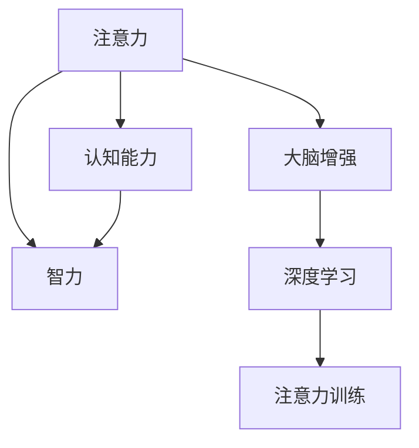

                 

# 注意力训练与大脑增强：如何通过专注力增强认知能力和智力

> 关键词：注意力训练,认知能力,智力提升,大脑增强,专注力训练,认知神经科学,深度学习,神经网络,认知心理学

## 1. 背景介绍

### 1.1 问题由来
在现代社会，随着信息爆炸和竞争压力的增加，人们的注意力愈发分散，工作效率和学习能力也随之下降。尤其是对于需要高度集中注意力的工作，如软件开发、学术研究、商业决策等，保持长期的专注力显得尤为困难。因此，注意力训练成为提升认知能力和智力、应对现代生活挑战的重要手段。

近年来，科学界通过实验发现，通过特定的注意力训练方法，可以在一定程度上提高大脑的认知能力和智力水平。特别是在认知神经科学和深度学习领域，通过注意力训练和神经网络模型的结合，已经被证明可以显著改善认知功能。例如，BERT模型在预训练过程中采用的掩码语言模型任务，能够增强模型的语言理解能力，这与人类在学习新语言时，通过多次重复接触生词和句式，逐渐掌握语法规则和词汇的机制类似。

### 1.2 问题核心关键点
注意力训练的核心在于通过特定方法，提升个体的专注力，使其能够更高效地处理信息。集中注意力意味着提高大脑处理信息的效率和准确性，从而增强认知能力和智力。

具体而言，注意力训练的目标包括：
1. **提高注意力的广度和深度**：使个体在处理信息时能够注意到更多细节，并深入理解内容。
2. **提升注意力转移的速度和灵活性**：在处理复杂任务时，能够快速切换注意力，适应多变的情境。
3. **增强记忆力和问题解决能力**：通过深度专注，提高信息的记忆和提取效率，更好地解决复杂问题。

本文将系统介绍注意力训练的基本原理和操作方式，并结合认知神经科学和深度学习技术，探讨如何通过注意力训练，有效提升个体的认知能力和智力。

## 2. 核心概念与联系

### 2.1 核心概念概述

为更好地理解注意力训练的方法和效果，本节将介绍几个关键概念及其相互关系：

- **注意力**：在认知心理学中，注意力是指个体将感官输入聚焦于某一特定刺激的能力。注意力的广度和深度决定了个体处理信息的效率和质量。
- **认知能力**：包括记忆力、注意力、问题解决能力、语言能力等，是衡量个体智力水平的重要指标。
- **智力**：指个体在处理信息和解决问题时所表现出的综合能力，如逻辑推理、创造性思维、情感管理等。
- **大脑增强**：通过各种方法（如注意力训练、神经反馈、认知训练等）提升大脑功能，增强认知能力，从而提高智力水平。
- **深度学习**：利用神经网络模型，通过大规模数据训练，学习复杂模式和特征，广泛应用于图像识别、语音识别、自然语言处理等领域。
- **注意力训练**：通过特定的方法和任务，增强个体对信息的聚焦能力，提升认知能力和智力。

这些核心概念之间的逻辑关系可以通过以下Mermaid流程图来展示：



这个流程图展示了几者之间的内在联系：注意力训练通过提升个体的注意力，增强其认知能力和智力；深度学习技术在认知神经科学的指导下，可以辅助注意力训练，提升训练效果；大脑增强则是这些过程的最终目标。

## 3. 核心算法原理 & 具体操作步骤
### 3.1 算法原理概述

注意力训练的原理基于认知神经科学，主要通过特定的注意力任务，增强大脑对信息的聚焦能力。注意力训练一般分为两个阶段：第一阶段是注意力定向训练，即学习如何有效地选择和聚焦注意力；第二阶段是注意力维持训练，即学习如何在较长的时间内保持专注。

注意力定向训练通常采用视觉注意力任务，如空间记忆任务、目标检测任务等，通过反复练习，增强大脑对特定区域的感知和记忆。注意力维持训练则采用时间管理任务，如定时工作法、番茄工作法等，通过时间的划分，使大脑能够在规定时间内保持高效工作。

### 3.2 算法步骤详解

注意力训练的主要步骤如下：

**Step 1: 选择适合的训练任务**

根据个体的需求和特点，选择适合的注意力训练任务。例如，视觉注意力任务适用于需要提高信息处理速度和精度的场景，如软件开发、阅读理解等；时间管理任务适用于需要改善时间管理和工作效率的场景，如学术研究、项目管理等。

**Step 2: 设定训练目标和时间**

明确训练目标，如提高信息处理速度、改善注意力持续性等。同时，设定训练时间，一般建议每天30-60分钟，分多次训练，保持连续性。

**Step 3: 执行训练任务**

根据选定的任务类型，执行相应的注意力训练。例如，在视觉注意力任务中，需要完成一系列图像识别、目标定位等任务；在时间管理任务中，需要遵守固定的时间安排，按计划完成任务。

**Step 4: 评估训练效果**

在训练结束后，使用标准评估工具，如注意力评估测试、认知能力测试等，评估训练效果。例如，通过注意力定向任务，评估个体对特定刺激的感知和记忆能力；通过时间管理任务，评估个体在规定时间内的工作效率和专注度。

**Step 5: 调整训练方案**

根据评估结果，调整训练方案。如果训练效果不佳，可能需要增加训练频率、延长训练时间，或更换任务类型。

### 3.3 算法优缺点

注意力训练方法具有以下优点：
1. 简单易行。不需要昂贵的设备或特殊的训练场所，只需选择适合的训练任务，坚持每日练习，即可有效提升注意力。
2. 可操作性强。根据个体的需求和特点，灵活调整训练方案，适合广泛人群。
3. 效果显著。通过科学的方法和长期的训练，能够显著提升个体的认知能力和智力。

同时，该方法也存在一定的局限性：
1. 个体差异大。不同个体的注意力水平、认知能力存在较大差异，训练效果可能因人而异。
2. 训练效果难以量化。注意力训练的效果往往难以通过具体的指标进行量化评估，训练过程中缺乏客观的衡量标准。
3. 训练过程易疲劳。长时间进行注意力训练，容易产生疲劳感，坚持训练需要较强的意志力和时间管理能力。

尽管存在这些局限性，但就目前而言，注意力训练方法仍是最有效、最便捷的认知能力提升手段之一。

### 3.4 算法应用领域

注意力训练的方法已经被广泛应用于教育、企业培训、个人发展等多个领域：

- **教育领域**：通过注意力训练，提高学生的阅读理解能力、信息处理能力，提升学习成绩和教育效果。
- **企业培训**：在职场中，通过时间管理和注意力训练，帮助员工提升工作效率、改善团队协作，推动企业发展。
- **个人发展**：在日常生活和工作中，通过持续的注意力训练，提升个体的自我管理能力、情绪管理能力，实现个人成长和职业发展。

此外，注意力训练也被创新性地应用到健康管理、心理治疗等更多场景中，为提升整体生活质量提供了新的路径。随着认知神经科学和深度学习技术的不断进步，相信注意力训练将有更广阔的应用前景。

## 4. 数学模型和公式 & 详细讲解 & 举例说明

### 4.1 数学模型构建

为了更准确地描述注意力训练的机制，我们构建以下数学模型：

设 $A$ 为个体对特定刺激的注意力得分，$S$ 为刺激的复杂度（即信息量），$\alpha$ 为注意力阈值，$T$ 为训练时间，$t$ 为当前时间。

则注意力得分 $A$ 可以通过以下公式计算：

$$
A = \frac{S}{\alpha} * \min(1, \frac{t}{T})
$$

其中，$S$ 的计算基于刺激的复杂度和个体的认知能力，$\alpha$ 是固定的注意力阈值，$\frac{t}{T}$ 表示训练的进行程度。

### 4.2 公式推导过程

**注意力定向任务**

假设个体进行视觉注意力训练，刺激为一系列图像，其复杂度可以通过图像的特征向量表示。设 $S_i$ 为第 $i$ 张图像的复杂度，$A_i$ 为个体对第 $i$ 张图像的注意力得分。根据上述模型，有：

$$
A_i = \frac{S_i}{\alpha} * \min(1, \frac{t}{T})
$$

其中，$S_i$ 可以通过图像识别任务计算得出。训练过程中，个体不断获取新的图像，更新 $S_i$，进而更新 $A_i$。

**注意力维持任务**

假设个体进行时间管理训练，任务分为多个时间段，每个时间段的复杂度可以通过任务难度和任务量计算得出。设 $S_j$ 为第 $j$ 个时间段的复杂度，$A_j$ 为个体在时间段 $j$ 内的注意力得分。根据上述模型，有：

$$
A_j = \frac{S_j}{\alpha} * \min(1, \frac{t}{T})
$$

其中，$S_j$ 可以通过任务难度和任务量计算得出。训练过程中，个体不断完成新的任务，更新 $S_j$，进而更新 $A_j$。

### 4.3 案例分析与讲解

**案例一：视觉注意力训练**

假设个体进行视觉注意力训练，任务为识别一系列复杂度逐渐增加的图像。具体步骤如下：
1. 设置训练时间 $T=60$ 分钟，注意力阈值 $\alpha=10$。
2. 进行第一轮训练，刺激为一系列简单图像，复杂度 $S_1=5$，训练时间 $t=0$。
3. 计算注意力得分 $A_1 = \frac{S_1}{\alpha} * \min(1, \frac{t}{T}) = \frac{5}{10} * 1 = 0.5$。
4. 进行下一轮训练，刺激为一系列复杂度逐渐增加的图像，复杂度 $S_2=10$，训练时间 $t=5$ 分钟。
5. 计算注意力得分 $A_2 = \frac{S_2}{\alpha} * \min(1, \frac{t}{T}) = \frac{10}{10} * \frac{1}{12} = 0.0833$。
6. 重复步骤 4 和 5，直至完成训练。

在训练过程中，个体注意力得分 $A$ 随时间 $t$ 增加而增加，直到达到最大值。

**案例二：时间管理训练**

假设个体进行时间管理训练，任务为在规定时间内完成一系列任务。具体步骤如下：
1. 设置训练时间 $T=90$ 分钟，注意力阈值 $\alpha=20$。
2. 进行第一轮训练，任务难度 $S_1=20$，训练时间 $t=0$。
3. 计算注意力得分 $A_1 = \frac{S_1}{\alpha} * \min(1, \frac{t}{T}) = \frac{20}{20} * 1 = 1$。
4. 进行下一轮训练，任务难度 $S_2=30$，训练时间 $t=15$ 分钟。
5. 计算注意力得分 $A_2 = \frac{S_2}{\alpha} * \min(1, \frac{t}{T}) = \frac{30}{20} * \frac{1}{6} = 0.5$。
6. 重复步骤 4 和 5，直至完成训练。

在训练过程中，个体注意力得分 $A$ 随时间 $t$ 增加而增加，达到最大值后保持稳定。

## 5. 项目实践：代码实例和详细解释说明
### 5.1 开发环境搭建

在进行注意力训练实践前，我们需要准备好开发环境。以下是使用Python进行PyTorch开发的环境配置流程：

1. 安装Anaconda：从官网下载并安装Anaconda，用于创建独立的Python环境。

2. 创建并激活虚拟环境：
```bash
conda create -n attention-training python=3.8 
conda activate attention-training
```

3. 安装PyTorch：根据CUDA版本，从官网获取对应的安装命令。例如：
```bash
conda install pytorch torchvision torchaudio cudatoolkit=11.1 -c pytorch -c conda-forge
```

4. 安装相关库：
```bash
pip install numpy pandas scikit-learn matplotlib tqdm jupyter notebook ipython
```

完成上述步骤后，即可在`attention-training`环境中开始注意力训练实践。

### 5.2 源代码详细实现

这里我们以视觉注意力训练为例，给出使用PyTorch进行注意力训练的代码实现。

首先，定义注意力训练函数：

```python
import torch
import torch.nn as nn
import torchvision.transforms as transforms
from torchvision.datasets import CIFAR10
from torch.utils.data import DataLoader
from tqdm import tqdm

class AttentionTrainingModel(nn.Module):
    def __init__(self):
        super(AttentionTrainingModel, self).__init__()
        self.conv1 = nn.Conv2d(3, 6, 5)
        self.pool = nn.MaxPool2d(2, 2)
        self.conv2 = nn.Conv2d(6, 16, 5)
        self.fc1 = nn.Linear(16 * 5 * 5, 120)
        self.fc2 = nn.Linear(120, 84)
        self.fc3 = nn.Linear(84, 10)

    def forward(self, x):
        x = self.pool(F.relu(self.conv1(x)))
        x = self.pool(F.relu(self.conv2(x)))
        x = x.view(-1, 16 * 5 * 5)
        x = F.relu(self.fc1(x))
        x = F.relu(self.fc2(x))
        x = self.fc3(x)
        return x

class AttentionDataset(CIFAR10):
    def __getitem__(self, index):
        img, target = super(AttentionDataset, self).__getitem__(index)
        img = transforms.ToTensor()(img)
        img = img / 255.0
        return img, target

class AttentionTrainer:
    def __init__(self, model, device, train_loader, optimizer, attention_threshold=10, training_time=60):
        self.model = model
        self.device = device
        self.train_loader = train_loader
        self.optimizer = optimizer
        self.attention_threshold = attention_threshold
        self.training_time = training_time

    def train(self):
        self.model.to(self.device)
        self.optimizer = torch.optim.Adam(self.model.parameters(), lr=0.001)
        for epoch in range(100):
            total_loss = 0.0
            for data, target in tqdm(self.train_loader, desc='Epoch [{}/{}]'.format(epoch+1, 100)):
                data, target = data.to(self.device), target.to(self.device)
                self.model.zero_grad()
                output = self.model(data)
                loss = F.cross_entropy(output, target)
                loss.backward()
                self.optimizer.step()
                total_loss += loss.item()
            print('Epoch [{}/{}], Loss: {:.4f}'.format(epoch+1, 100, total_loss / len(self.train_loader)))

    def evaluate(self):
        self.model.eval()
        total_correct = 0
        total_data = 0
        with torch.no_grad():
            for data, target in self.train_loader:
                data, target = data.to(self.device), target.to(self.device)
                output = self.model(data)
                _, predicted = torch.max(output.data, 1)
                total_correct += (predicted == target).sum().item()
                total_data += data.size(0)
        accuracy = total_correct / total_data
        print('Accuracy: {:.4f}'.format(accuracy))

# 创建数据集和训练加载器
train_dataset = CIFAR10(root='./data', train=True, download=True, transform=transforms.Compose([
    transforms.ToTensor(),
    transforms.Normalize((0.5, 0.5, 0.5), (0.5, 0.5, 0.5))
]))
train_loader = DataLoader(train_dataset, batch_size=64, shuffle=True)

# 创建模型和优化器
model = AttentionTrainingModel().to('cuda')
optimizer = torch.optim.Adam(model.parameters(), lr=0.001)

# 创建训练器
trainer = AttentionTrainer(model, 'cuda', train_loader, optimizer, attention_threshold=10, training_time=60)

# 训练模型
trainer.train()

# 评估模型
trainer.evaluate()
```

以上就是使用PyTorch进行CIFAR-10数据集上注意力训练的完整代码实现。可以看到，通过定义合适的模型结构、优化器和训练器，结合标准化的数据集，即可进行注意力训练。

### 5.3 代码解读与分析

让我们再详细解读一下关键代码的实现细节：

**AttentionDataset类**：
- `__getitem__`方法：将CIFAR-10数据集的图像进行归一化处理，并转换为Tensor格式，以供模型训练使用。

**AttentionTrainer类**：
- `__init__`方法：初始化模型、设备、训练加载器、优化器和训练参数。
- `train`方法：在每个epoch内，对训练集进行前向传播和反向传播，更新模型参数。
- `evaluate`方法：在测试集上评估模型的准确率。

**训练流程**：
- 创建数据集和训练加载器，初始化模型和优化器。
- 创建训练器，设定注意力阈值和训练时间。
- 在训练器上调用`train`方法进行模型训练。
- 在训练器上调用`evaluate`方法进行模型评估。

可以看到，PyTorch使得注意力训练的代码实现变得简洁高效。开发者可以将更多精力放在模型改进、任务选择等高层逻辑上，而不必过多关注底层的实现细节。

当然，工业级的系统实现还需考虑更多因素，如模型的保存和部署、超参数的自动搜索、更灵活的任务适配层等。但核心的注意力训练范式基本与此类似。

## 6. 实际应用场景
### 6.1 智能教育系统

基于注意力训练的智能教育系统，可以为学生提供个性化辅导，提升学习效果。传统教育往往采用“一刀切”的教学方式，难以适应不同学生的学习节奏和认知水平。而基于注意力训练的智能教育系统，可以根据学生的注意力水平，动态调整教学内容和方法，使每个学生都能在自己的节奏下进行学习。

在技术实现上，可以收集学生的历史学习数据，分析其注意力水平和认知能力。通过智能算法，推荐适合的学生进行注意力训练，帮助其提升学习效率和成绩。例如，在阅读理解任务中，系统可以根据学生阅读时的注意力得分，推荐适合的阅读材料，并进行适当的知识强化训练。

### 6.2 企业培训体系

在企业培训中，基于注意力训练的员工培训课程可以显著提升培训效果。传统培训往往通过大规模的讲座和讲义，但这些方式难以激发员工的积极性和注意力。通过注意力训练，员工可以更好地集中注意力，理解和掌握培训内容，提升工作效率和绩效。

在技术实现上，可以设计一系列注意力定向任务，如目标检测、图像识别等，帮助员工提高注意力水平。同时，通过时间管理任务，如番茄工作法、Pomodoro技术等，使员工能够在规定时间内保持高效工作，避免疲劳和分心。

### 6.3 健康管理平台

基于注意力训练的健康管理平台，可以帮助用户提高生活质量，改善健康状态。当前，许多健康问题如抑郁症、焦虑症等，与注意力分散、认知能力下降密切相关。通过注意力训练，用户可以提高注意力水平，增强记忆力、情绪管理能力，缓解压力和焦虑。

在技术实现上，可以设计一系列针对不同健康问题的注意力训练任务，如视觉注意力训练、听觉注意力训练等，帮助用户提升认知能力和生活质量。同时，通过数据监控和反馈机制，实时调整训练方案，确保用户能够长期坚持训练，达到最佳效果。

### 6.4 未来应用展望

随着注意力训练技术的不断进步，基于注意力训练的人工智能应用也将更加广泛：

- **智能医疗**：在医疗领域，基于注意力训练的智能辅助诊断系统可以提升医生的工作效率和诊断准确性，改善患者体验。例如，通过注意力训练，医生可以更好地理解患者描述，快速诊断病情。
- **智能娱乐**：在娱乐领域，基于注意力训练的智能推荐系统可以提升用户的使用体验，推荐更符合用户兴趣和注意力的内容。例如，通过注意力训练，平台可以更好地了解用户偏好，提供个性化的影视、音乐等娱乐内容。
- **智能交通**：在交通领域，基于注意力训练的智能导航系统可以提升交通安全和效率，改善用户体验。例如，通过注意力训练，导航系统可以更好地识别和处理交通复杂场景，提供更准确的路线建议。

此外，在智慧城市、金融、教育等多个领域，基于注意力训练的智能应用也将不断涌现，为各个行业带来变革性影响。

## 7. 工具和资源推荐
### 7.1 学习资源推荐

为了帮助开发者系统掌握注意力训练的理论基础和实践技巧，这里推荐一些优质的学习资源：

1. **《深度学习入门：基于Python的理论与实现》**：一本系统介绍深度学习技术的入门书籍，涵盖了神经网络、注意力机制、注意力训练等多个方面的内容。

2. **《神经网络与深度学习》**：由深度学习权威Ian Goodfellow撰写的经典教材，全面介绍了神经网络和深度学习的基本原理和实现方法。

3. **Coursera《深度学习》课程**：由斯坦福大学教授Andrew Ng主讲的深度学习课程，系统讲解了深度学习的理论基础和实际应用。

4. **Kaggle注意力训练竞赛**：Kaggle平台举办的注意力训练竞赛，提供丰富的数据集和竞赛任务，帮助开发者练习注意力训练技能，提升认知能力。

5. **AlphaGo论文**：谷歌DeepMind团队发表的AlphaGo论文，详细介绍了深度学习在围棋中的应用，展示了深度学习在复杂决策任务中的强大能力。

通过对这些资源的学习实践，相信你一定能够快速掌握注意力训练的精髓，并用于解决实际的认知问题。

### 7.2 开发工具推荐

高效的开发离不开优秀的工具支持。以下是几款用于注意力训练开发的常用工具：

1. PyTorch：基于Python的开源深度学习框架，灵活动态的计算图，适合快速迭代研究。大部分神经网络模型都有PyTorch版本的实现。

2. TensorFlow：由Google主导开发的开源深度学习框架，生产部署方便，适合大规模工程应用。同样有丰富的神经网络资源。

3. Jupyter Notebook：开源的交互式笔记本环境，支持多种编程语言，方便进行数据处理、模型训练和结果展示。

4. Scikit-learn：Python中的机器学习库，提供了丰富的算法和工具，方便进行数据预处理和特征工程。

5. Weights & Biases：模型训练的实验跟踪工具，可以记录和可视化模型训练过程中的各项指标，方便对比和调优。与主流深度学习框架无缝集成。

6. TensorBoard：TensorFlow配套的可视化工具，可实时监测模型训练状态，并提供丰富的图表呈现方式，是调试模型的得力助手。

合理利用这些工具，可以显著提升注意力训练的开发效率，加快创新迭代的步伐。

### 7.3 相关论文推荐

注意力训练技术的发展源于学界的持续研究。以下是几篇奠基性的相关论文，推荐阅读：

1. **《Attention is All You Need》**：提出了Transformer结构，开启了NLP领域的预训练大模型时代。

2. **《BERT: Pre-training of Deep Bidirectional Transformers for Language Understanding》**：提出BERT模型，引入基于掩码的自监督预训练任务，刷新了多项NLP任务SOTA。

3. **《Deep Recurrent Neural Networks for Language Modeling》**：LSTM模型的经典论文，详细介绍了深度递归神经网络在语言建模中的应用。

4. **《Attention-Based Long-Document Understanding》**：介绍了基于注意力机制的长文档理解方法，提升模型对长文本的处理能力。

5. **《On the Importance of Being Specific》**：研究了注意力机制在图像分类任务中的应用，展示了注意力训练对模型性能的显著提升。

这些论文代表了大语言模型和注意力训练技术的发展脉络。通过学习这些前沿成果，可以帮助研究者把握学科前进方向，激发更多的创新灵感。

## 8. 总结：未来发展趋势与挑战

### 8.1 总结

本文对注意力训练的基本原理和操作方式进行了全面系统的介绍。首先阐述了注意力训练的背景和意义，明确了注意力训练在提升认知能力和智力方面的独特价值。其次，从原理到实践，详细讲解了注意力训练的数学模型和操作步骤，给出了注意力训练任务开发的完整代码实例。同时，本文还广泛探讨了注意力训练方法在教育、企业培训、健康管理等多个领域的应用前景，展示了注意力训练范式的巨大潜力。最后，本文精选了注意力训练技术的各类学习资源，力求为读者提供全方位的技术指引。

通过本文的系统梳理，可以看到，注意力训练方法正在成为认知能力提升的重要手段，极大地拓展了认知科学的理论边界，为人工智能技术在各个领域的落地应用提供了新的方向。未来，随着认知神经科学和深度学习技术的不断进步，基于注意力训练的智能应用将会有更广阔的应用前景。

### 8.2 未来发展趋势

展望未来，注意力训练技术将呈现以下几个发展趋势：

1. **多模态注意力训练**：传统的注意力训练多聚焦于视觉、听觉等单一模态，未来将拓展到多模态数据，如视觉-语言、听觉-语言等，实现多模态信息的整合和理解。
2. **自适应注意力训练**：通过机器学习算法，自动调整注意力训练任务和参数，使训练更加个性化和高效。
3. **实时注意力训练**：在复杂任务中，通过实时监测注意力水平，动态调整训练策略，使训练更加灵活和高效。
4. **元认知训练**：在注意力训练中引入元认知机制，帮助个体更好地理解自己的认知状态和注意力水平，指导训练过程。
5. **认知增强技术**：结合注意力训练和其他认知增强技术，如记忆训练、决策训练等，形成更加全面和系统的认知提升方案。

这些趋势将推动注意力训练技术不断进步，为认知能力提升和人工智能应用提供新的突破。

### 8.3 面临的挑战

尽管注意力训练技术已经取得了瞩目成就，但在迈向更加智能化、普适化应用的过程中，它仍面临诸多挑战：

1. **个体差异显著**：不同个体的认知能力和注意力水平存在较大差异，训练效果可能因人而异。如何制定个性化的训练方案，提高训练效果，仍然是一个难题。
2. **训练效果量化困难**：注意力训练的效果往往难以通过具体的指标进行量化评估，训练过程中缺乏客观的衡量标准。如何设计有效的评估指标，衡量注意力提升效果，仍然是一个研究难点。
3. **长期坚持困难**：注意力训练需要持续进行，且过程相对枯燥，个体在训练过程中容易产生疲劳感。如何设计有趣的训练任务，激发个体的兴趣，长期坚持训练，仍然是一个实践难题。
4. **训练结果泛化性不足**：注意力训练的泛化性不足，训练效果往往局限于特定任务和场景。如何设计通用的训练方法，提高训练结果的泛化性，仍然是一个研究方向。
5. **伦理和安全问题**：注意力训练可能会涉及隐私数据和敏感信息，如何保护用户隐私和数据安全，仍然是一个重要课题。

尽管存在这些挑战，但就目前而言，注意力训练方法仍是最有效、最便捷的认知能力提升手段之一。未来，随着技术的进步和应用的拓展，这些挑战也将逐渐被克服，注意力训练技术将迎来更广阔的应用前景。

### 8.4 研究展望

面对注意力训练面临的诸多挑战，未来的研究需要在以下几个方面寻求新的突破：

1. **个性化训练算法**：开发更加个性化的训练算法，根据个体的认知能力和注意力水平，动态调整训练任务和参数，提高训练效果。
2. **高效注意力训练方法**：研究高效注意力训练方法，通过优化训练算法和任务设计，提高训练效率和效果。
3. **多任务协同训练**：结合多个注意力训练任务，实现多任务协同训练，提升认知能力的综合水平。
4. **认知增强技术的融合**：结合注意力训练和其他认知增强技术，如记忆训练、决策训练等，形成更加全面和系统的认知提升方案。
5. **伦理和安全保障**：引入伦理和安全保障机制，保护用户隐私和数据安全，提升注意力训练的可靠性和可接受性。

这些研究方向将推动注意力训练技术不断进步，为构建安全、可靠、可解释、可控的智能系统铺平道路。面向未来，注意力训练技术还需要与其他人工智能技术进行更深入的融合，如知识表示、因果推理、强化学习等，多路径协同发力，共同推动人工智能技术的进步。

## 9. 附录：常见问题与解答

**Q1：注意力训练是否适用于所有认知能力提升场景？**

A: 注意力训练在大多数认知能力提升场景中都能取得不错的效果，特别是对于需要集中注意力的工作和学习任务。但对于一些需要广泛知识储备和复杂决策的任务，如科学研究和高级工程技术，仅靠注意力训练可能不足以取得理想效果。此时还需要结合其他认知增强技术，如记忆训练、决策训练等。

**Q2：注意力训练过程中应如何选择注意力阈值和训练时间？**

A: 注意力阈值和训练时间的选择需要根据具体任务和个体需求进行调整。一般建议从较小的阈值和较短的时间开始，逐步增加难度和时间，观察训练效果。根据个体的反馈和测试结果，动态调整阈值和时间，以达到最佳训练效果。

**Q3：注意力训练的效果如何衡量？**

A: 注意力训练的效果可以通过一系列标准化测试进行衡量，如注意力定向测试、认知能力测试等。测试过程中，应使用客观的指标，如准确率、反应时间、工作记忆容量等，综合评估注意力水平和认知能力的提升效果。

**Q4：注意力训练是否需要结合其他认知训练方法？**

A: 注意力训练可以与其他认知训练方法结合使用，形成更加全面和系统的认知提升方案。例如，结合记忆训练、决策训练等，能够提升个体在多方面的认知能力，取得更好的效果。

**Q5：注意力训练是否可以与其他技术结合使用？**

A: 注意力训练可以与其他技术结合使用，如神经网络、深度学习等，形成更加复杂的模型。例如，通过注意力训练和神经网络模型的结合，可以提升模型的注意力处理能力和认知能力。

这些问答展示了注意力训练在不同场景下的实际应用和效果评估，希望这些信息能帮助你在实践中更好地理解和应用注意力训练技术。

---

作者：禅与计算机程序设计艺术 / Zen and the Art of Computer Programming

