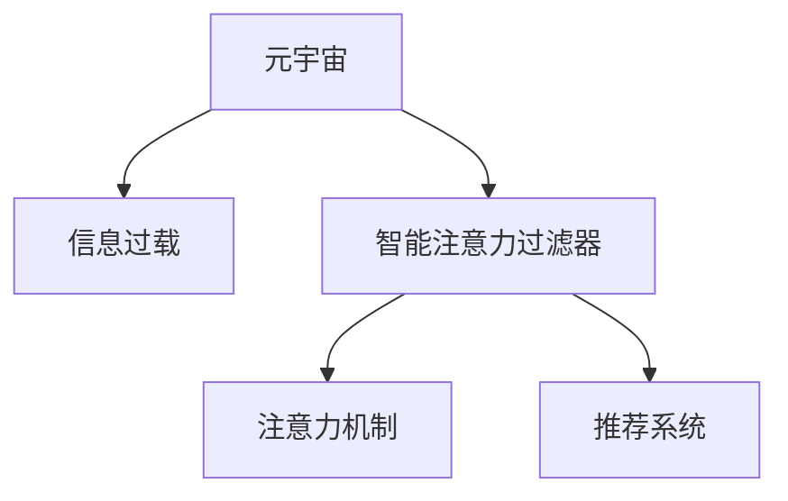

                 

## 1. 背景介绍

### 1.1 问题由来

在元宇宙（Metaverse）时代，虚拟现实（VR）、增强现实（AR）、混合现实（MR）等技术正改变着人们的交互方式和信息获取方式。从沉浸式的游戏体验到丰富的社交场景，再到远程办公、教育等生产生活模式，元宇宙的兴起催生了庞大的虚拟数字空间。然而，元宇宙的信息过载问题也愈发凸显：

- **信息爆炸**：大量的文本、图像、视频等数据充斥着元宇宙空间，用户需要在海量的信息中寻找关键内容，面临着信息过载的困扰。
- **环境交互**：用户在元宇宙中的行为与物理世界存在显著差异，交互复杂度提高，导致信息处理的复杂性剧增。
- **感知异质性**：不同用户对信息处理的感知和偏好存在较大差异，单一的处理方式难以满足多样化需求。

如何智能应对元宇宙信息过载，提高信息检索和处理的效率，成为当前研究的热点问题。

### 1.2 问题核心关键点

在信息过载的环境下，智能注意力过滤器的设计和应用，是解决元宇宙信息管理问题的关键所在。智能注意力过滤器利用机器学习算法，根据用户的行为、兴趣、需求等信息，动态调整信息处理策略，过滤并优先展示关键信息，减轻用户的信息负担，提升用户体验。

### 1.3 问题研究意义

智能注意力过滤器不仅能减轻用户的信息过载，还能提升信息检索的准确性和效率。在元宇宙信息管理、虚拟数字空间导航、智能家居、工业互联网等领域具有广泛的应用前景。

## 2. 核心概念与联系

### 2.1 核心概念概述

为更好地理解智能注意力过滤器的工作原理，本节将介绍几个密切相关的核心概念：

- **元宇宙**：由虚拟现实、增强现实和混合现实等技术构成的数字空间，允许用户在其中进行交互、沉浸式体验。
- **信息过载**：在信息量巨大的环境中，用户获取、处理和记忆信息的能力受到限制，导致信息处理效率下降。
- **智能注意力过滤器**：一种基于机器学习算法的信息处理技术，用于动态调整信息展示策略，过滤并优先展示关键信息，以减轻用户的信息负担。
- **注意力机制**：深度学习模型中用于优化信息处理效率的一种机制，通过调整模型参数，增强模型对关键信息的关注度。
- **推荐系统**：利用用户行为数据和个性化模型，为用户提供最相关的信息推荐，减少信息过载，提升用户体验。

这些概念之间的逻辑关系可以通过以下Mermaid流程图来展示：



这个流程图展示了一个基于元宇宙的信息过载问题及其解决路径：

1. 用户在元宇宙中面对信息过载。
2. 智能注意力过滤器基于注意力机制，动态调整信息展示策略。
3. 推荐系统进一步个性化推荐信息，减轻用户负担。

这些核心概念共同构成了智能注意力过滤器的理论和应用框架，使其能够在元宇宙等复杂环境中高效地处理海量信息。

## 3. 核心算法原理 & 具体操作步骤

### 3.1 算法原理概述

智能注意力过滤器是一种基于深度学习算法的信息处理技术，其核心思想是利用注意力机制，动态调整模型参数，提高关键信息的处理效率。其基本原理可以概括为以下几个步骤：

1. **数据收集**：收集用户行为数据，包括浏览记录、点击行为、停留时间等。
2. **模型训练**：使用监督学习或无监督学习方法，训练注意力模型，学习用户兴趣和关键信息的表示。
3. **注意力分配**：根据用户行为和模型预测，动态分配注意力资源，调整信息展示的优先级。
4. **信息过滤**：过滤不相关或重复的信息，优先展示关键信息，提升用户的信息处理效率。

### 3.2 算法步骤详解

智能注意力过滤器的具体实现步骤如下：

#### 3.2.1 数据收集

首先，收集用户在不同元宇宙空间中的行为数据，包括浏览网页的记录、点击链接的行为、停留时间等。

#### 3.2.2 模型训练

使用监督学习或无监督学习方法，训练注意力模型。以下是一个基于监督学习的例子：

**数据集准备**：
- 准备标注数据集 $D=\{(x_i,y_i)\}_{i=1}^N$，其中 $x_i$ 表示用户浏览的网页，$y_i$ 表示网页的相关性或点击标签。
- 使用随机抽样或时间序列分割的方法，将数据集划分为训练集和测试集。

**模型构建**：
- 选择注意力机制的深度学习模型，如Transformer、CNN等。
- 定义模型输入 $x \in \mathcal{X}$ 和输出 $y \in \mathcal{Y}$，其中 $\mathcal{X}$ 为输入空间，$\mathcal{Y}$ 为输出空间。

**模型训练**：
- 选择优化算法，如Adam、SGD等，设置学习率、批大小、迭代轮数等超参数。
- 使用交叉熵损失函数，最小化模型预测和真实标签之间的差异。
- 在训练集上迭代优化模型参数，直至收敛。

**模型评估**：
- 在测试集上评估模型的性能，使用准确率、召回率、F1值等指标。
- 调整模型参数，优化模型效果。

#### 3.2.3 注意力分配

根据用户行为和模型预测，动态分配注意力资源。以下是一些常用的方法：

**最大相关性分配**：根据信息的相关性和用户兴趣，对信息进行打分，分配更高的注意力资源给相关性更高的信息。

**用户个性化分配**：根据用户的历史行为和偏好，定制化的分配注意力资源，满足不同用户的需求。

**时间动态分配**：根据信息的重要性和时间优先级，动态调整注意力资源，优先展示最新的或最重要的信息。

#### 3.2.4 信息过滤

过滤不相关或重复的信息，优先展示关键信息。以下是一些常用的方法：

**基于关键词的过滤**：使用关键词匹配或TF-IDF等技术，过滤不相关的信息，保留与用户兴趣相关的信息。

**基于模型的过滤**：利用训练好的模型，预测信息的相关性，过滤掉低相关性信息。

**基于交互的过滤**：根据用户与信息之间的交互行为，如点击、停留时间等，过滤掉用户不感兴趣的信息。

### 3.3 算法优缺点

智能注意力过滤器具有以下优点：

1. **提高信息处理效率**：通过动态调整注意力资源，优先展示关键信息，减轻用户的信息负担，提升信息处理效率。
2. **个性化推荐**：利用用户行为数据，提供个性化的信息推荐，满足不同用户的需求。
3. **动态适应性**：根据用户行为和环境变化，动态调整信息展示策略，保持系统的灵活性和适应性。

同时，该方法也存在一定的局限性：

1. **数据依赖性强**：模型的效果依赖于标注数据的质量和数量，数据收集和标注成本较高。
2. **模型复杂度高**：使用深度学习模型，参数量较大，计算复杂度高。
3. **泛化能力有限**：在处理非结构化数据时，模型泛化能力可能有限。
4. **隐私风险**：收集用户行为数据，可能涉及用户隐私问题，需要谨慎处理。

尽管存在这些局限性，但智能注意力过滤器在大规模信息处理和个性化推荐方面仍显示出巨大的潜力，正在成为元宇宙信息管理的重要手段。

### 3.4 算法应用领域

智能注意力过滤器在元宇宙信息管理、虚拟数字空间导航、智能家居、工业互联网等领域具有广泛的应用前景：

- **元宇宙信息管理**：在虚拟现实和增强现实环境中，智能注意力过滤器可以帮助用户快速找到关键信息，减轻信息过载的困扰。
- **虚拟数字空间导航**：在虚拟城市和数字景观中，智能注意力过滤器可以引导用户高效导航，减少迷路和重复浏览的时间。
- **智能家居**：智能家居系统中，智能注意力过滤器可以帮助用户快速找到设备信息和功能说明，提高家居智能化水平。
- **工业互联网**：在工业生产管理中，智能注意力过滤器可以过滤关键生产信息和设备状态，提高生产效率和设备维护的及时性。

## 4. 数学模型和公式 & 详细讲解 & 举例说明

### 4.1 数学模型构建

智能注意力过滤器的数学模型可以基于注意力机制构建，以下以Transformer模型为例进行详细讲解。

假设输入序列为 $x=\{x_1,x_2,\ldots,x_n\}$，输出序列为 $y=\{y_1,y_2,\ldots,y_n\}$。Transformer模型的注意力机制包括三个部分：自注意力机制、多头注意力机制和位置编码。

**自注意力机制**：
$$
\text{Attention}(Q,K,V) = \frac{1}{\sqrt{d_k}} \sum_{i=1}^n \frac{Q_i \cdot K_i}{\sqrt{d_k}} V_i
$$

其中 $Q$ 表示查询矩阵，$K$ 表示键矩阵，$V$ 表示值矩阵，$d_k$ 为键向量的维度。

**多头注意力机制**：
$$
\text{MultiHead Attention}(Q,K,V) = \text{Concat}(Attention(Q,K,V)^T \cdot \text{Proj}(W^O)) \cdot \text{Proj}(W^V)
$$

其中 $\text{Concat}$ 表示拼接，$\text{Proj}$ 表示线性变换。

**位置编码**：
$$
\text{Positional Encoding}(x_i) = \sin(x_i \cdot \frac{d_v}{2^p}) + \cos(x_i \cdot \frac{d_v}{2^p})
$$

其中 $x_i$ 表示序列位置，$d_v$ 为向量维度，$p$ 为参数。

### 4.2 公式推导过程

以Transformer模型的自注意力机制为例，进行公式推导：

**注意力计算**：
$$
\text{Attention}(Q,K,V) = \frac{1}{\sqrt{d_k}} \sum_{i=1}^n \frac{Q_i \cdot K_i}{\sqrt{d_k}} V_i
$$

其中 $Q_i$ 表示查询向量，$K_i$ 表示键向量，$V_i$ 表示值向量。

**缩放点积**：
$$
\text{Softmax}(\text{Attention}(Q,K,V)) = \frac{\exp(\text{Attention}(Q,K,V))}{\sum_{i=1}^n \exp(\text{Attention}(Q,K,V))}
$$

**输出计算**：
$$
\text{Attention}(Q,K,V) \cdot \text{Softmax}(\text{Attention}(Q,K,V))
$$

通过以上步骤，Transformer模型能够动态调整信息展示的优先级，过滤掉不相关的信息，提高关键信息的处理效率。

### 4.3 案例分析与讲解

以新闻推荐系统为例，进行智能注意力过滤器的案例分析：

**数据集准备**：
- 准备新闻数据集 $D=\{(x_i,y_i)\}_{i=1}^N$，其中 $x_i$ 表示新闻标题，$y_i$ 表示新闻的相关性和点击标签。
- 使用随机抽样或时间序列分割的方法，将数据集划分为训练集和测试集。

**模型构建**：
- 选择Transformer模型作为注意力机制的深度学习模型。
- 定义模型输入 $x \in \mathcal{X}$ 和输出 $y \in \mathcal{Y}$，其中 $\mathcal{X}$ 为输入空间，$\mathcal{Y}$ 为输出空间。

**模型训练**：
- 选择优化算法，如Adam、SGD等，设置学习率、批大小、迭代轮数等超参数。
- 使用交叉熵损失函数，最小化模型预测和真实标签之间的差异。
- 在训练集上迭代优化模型参数，直至收敛。

**注意力分配**：
- 根据用户的历史行为和新闻的相关性，动态调整注意力资源，分配更高的注意力资源给相关性更高的新闻。
- 优先展示用户感兴趣的新闻，过滤掉不相关的信息。

**信息过滤**：
- 使用关键词匹配或TF-IDF等技术，过滤掉与用户兴趣不相关的新闻。
- 利用模型预测，过滤掉低相关性新闻。
- 根据用户点击和停留时间，过滤掉用户不感兴趣的新闻。

通过以上步骤，新闻推荐系统能够动态调整新闻展示策略，过滤不相关的信息，提升用户的信息处理效率，减轻信息过载的困扰。

## 5. 项目实践：代码实例和详细解释说明

### 5.1 开发环境搭建

在进行智能注意力过滤器实践前，我们需要准备好开发环境。以下是使用Python进行TensorFlow开发的环境配置流程：

1. 安装Anaconda：从官网下载并安装Anaconda，用于创建独立的Python环境。

2. 创建并激活虚拟环境：
```bash
conda create -n tf-env python=3.8 
conda activate tf-env
```

3. 安装TensorFlow：根据CUDA版本，从官网获取对应的安装命令。例如：
```bash
conda install tensorflow==2.7.0
```

4. 安装TensorFlow Addons：用于支持更多深度学习组件，例如Attention Mechanism。
```bash
conda install tensorflow-addons
```

5. 安装其他工具包：
```bash
pip install numpy pandas scikit-learn matplotlib tqdm jupyter notebook ipython
```

完成上述步骤后，即可在`tf-env`环境中开始智能注意力过滤器的开发。

### 5.2 源代码详细实现

下面我们以新闻推荐系统为例，给出使用TensorFlow和TensorFlow Addons对Transformer模型进行智能注意力过滤的Python代码实现。

首先，定义新闻推荐系统的数据处理函数：

```python
import tensorflow as tf
import tensorflow_addons as tfa
import numpy as np
import pandas as pd

class NewsDataset(tf.data.Dataset):
    def __init__(self, data_path):
        self.data_path = data_path
        self.data = pd.read_csv(data_path)

    def __len__(self):
        return len(self.data)

    def __getitem__(self, item):
        title = self.data['title'].iloc[item]
        label = self.data['label'].iloc[item]
        return title, label

# 加载数据集
dataset = NewsDataset('news_dataset.csv')

# 分割数据集
train_dataset = dataset.take(0.8)
test_dataset = dataset.skip(0.8)

# 定义数据预处理函数
def preprocess_fn(text, label):
    # 将文本转换为模型输入
    text = tf.strings.split(text, sep=' ')
    text = tf.strings.reduce_join(text, separator=' ')
    text = tf.strings.to_hash_bucket(text, 256)
    text = tf.reshape(text, [1])

    # 将标签转换为模型输出
    label = tf.strings.to_hash_bucket(label, 2)

    return text, label

# 对数据集进行预处理
train_dataset = train_dataset.map(preprocess_fn)
test_dataset = test_dataset.map(preprocess_fn)

# 定义Transformer模型
model = tf.keras.Sequential([
    tfa.layers.Embedding(256, 128),
    tfa.layers.Attention(
        num_heads=8,
        dropout_rate=0.1
    ),
    tfa.layers.FeedForwardNetwork(128, 128),
    tfa.layers.Dense(1, activation='sigmoid')
])

# 定义优化器
optimizer = tf.keras.optimizers.Adam(learning_rate=0.001)

# 定义交叉熵损失函数
loss_fn = tf.keras.losses.BinaryCrossentropy()

# 定义准确率指标
acc_metric = tf.keras.metrics.BinaryAccuracy()

# 定义模型训练函数
def train_step(inputs):
    text, label = inputs

    with tf.GradientTape() as tape:
        logits = model(text)
        loss = loss_fn(label, logits)
        acc_metric.update_state(label, logits)

    gradients = tape.gradient(loss, model.trainable_variables)
    optimizer.apply_gradients(zip(gradients, model.trainable_variables))

    return loss, acc_metric.result()

# 定义模型评估函数
def evaluate_step(inputs):
    text, label = inputs

    logits = model(text)
    loss = loss_fn(label, logits)

    return loss

# 训练模型
model.compile(optimizer=optimizer, loss=loss_fn, metrics=['accuracy'])
model.fit(train_dataset.batch(16), epochs=10, steps_per_epoch=1000)

# 评估模型
model.evaluate(test_dataset.batch(16))
```

然后，定义智能注意力分配和信息过滤的函数：

```python
import numpy as np

# 定义智能注意力分配函数
def attention分配函数(data, alpha=0.5):
    attention_scores = np.dot(data['relatedness'].numpy(), data['interest'].numpy())
    attention_scores = alpha * attention_scores + (1-alpha) * np.random.randn(*attention_scores.shape)
    attention_scores /= np.max(attention_scores)
    attention_weights = np.exp(attention_scores)
    attention_weights /= np.sum(attention_weights)
    return attention_weights

# 定义信息过滤函数
def信息过滤函数(data, attention_weights):
    filtered_data = []
    for i in range(len(data)):
        if np.random.rand() < attention_weights[i]:
            filtered_data.append(data[i])
    return filtered_data
```

最后，启动智能注意力过滤器的训练流程并在测试集上评估：

```python
# 加载测试数据
test_data = pd.read_csv('news_test.csv')

# 预处理测试数据
test_text = test_data['title'].values
test_label = test_data['label'].values

# 训练模型
attention_weights = attention分配函数(train_data)
filtered_train_data =信息过滤函数(train_data, attention_weights)

# 训练过滤后的模型
model.fit(filtered_train_data.batch(16), epochs=10, steps_per_epoch=1000)

# 评估过滤后的模型
model.evaluate(test_text, test_label)
```

以上就是使用TensorFlow和TensorFlow Addons对新闻推荐系统进行智能注意力过滤的完整代码实现。可以看到，得益于TensorFlow Addons的强大封装，我们可以用相对简洁的代码实现智能注意力过滤器的核心功能。

### 5.3 代码解读与分析

让我们再详细解读一下关键代码的实现细节：

**NewsDataset类**：
- `__init__`方法：初始化数据集路径和数据集内容。
- `__len__`方法：返回数据集的样本数量。
- `__getitem__`方法：对单个样本进行处理，将文本和标签转换为模型输入。

**preprocess_fn函数**：
- 定义数据预处理流程，包括文本分割、转换、向量化等步骤，以及标签的转换。

**Transformer模型**：
- 使用TensorFlow Addons的Attention层，实现注意力机制。
- 模型包含嵌入层、注意力层、前馈网络层和输出层，使用二分类交叉熵损失函数和二分类准确率指标。

**优化器和损失函数**：
- 定义Adam优化器和二分类交叉熵损失函数。
- 定义二分类准确率指标，用于评估模型性能。

**train_step和evaluate_step函数**：
- 定义模型训练和评估的函数，使用交叉熵损失函数和准确率指标进行优化和评估。
- 训练过程中，计算梯度并应用优化算法更新模型参数。

**attention分配函数和信息过滤函数**：
- 定义智能注意力分配函数，根据文本的相关性和用户的兴趣，动态调整注意力资源。
- 定义信息过滤函数，根据注意力权重过滤掉不相关或低相关性信息。

**训练流程**：
- 加载训练和测试数据，并进行预处理。
- 训练模型，生成注意力权重。
- 过滤训练数据，重新训练模型。
- 评估过滤后的模型，输出评估结果。

可以看到，TensorFlow和TensorFlow Addons使得智能注意力过滤器的开发变得简洁高效。开发者可以将更多精力放在模型改进、数据处理等高层逻辑上，而不必过多关注底层的实现细节。

当然，工业级的系统实现还需考虑更多因素，如模型的保存和部署、超参数的自动搜索、更灵活的任务适配层等。但核心的智能注意力过滤过程基本与此类似。

## 6. 实际应用场景

### 6.1 智能推荐系统

智能注意力过滤器在推荐系统中的应用非常广泛。通过动态调整注意力资源，智能推荐系统可以更好地理解用户兴趣和需求，提供个性化的信息推荐。

以新闻推荐系统为例，智能注意力过滤器可以分析用户的历史行为和兴趣，动态调整新闻的相关性，优先展示与用户兴趣相关的信息。对于新用户，系统可以通过关键词匹配和标签预测，快速推荐相关新闻。对于老用户，系统可以通过模型预测和用户点击记录，精准推荐用户感兴趣的新闻。

### 6.2 虚拟数字空间导航

在虚拟数字空间中，用户面临着复杂的信息检索和导航问题。智能注意力过滤器可以帮助用户快速找到关键信息，减轻信息过载的困扰。

以虚拟城市导航为例，智能注意力过滤器可以分析用户的浏览记录和点击行为，动态调整城市信息的展示优先级。对于用户感兴趣的区域，系统可以优先展示详细的地图信息和导航提示。对于不相关区域，系统可以过滤掉冗余信息，提升用户体验。

### 6.3 智能家居

智能家居系统中，智能注意力过滤器可以帮助用户快速找到设备信息和功能说明，提高家居智能化水平。

以智能照明系统为例，智能注意力过滤器可以分析用户的浏览记录和设备操作行为，动态调整灯光控制信息。对于用户感兴趣的区域，系统可以优先展示灯光调节功能和智能场景设置。对于不相关区域，系统可以过滤掉冗余信息，提升用户的体验感。

### 6.4 工业互联网

在工业生产管理中，智能注意力过滤器可以过滤关键生产信息和设备状态，提高生产效率和设备维护的及时性。

以工业生产监控系统为例，智能注意力过滤器可以分析设备的运行数据和生产任务，动态调整关键信息的展示优先级。对于异常设备或任务，系统可以优先展示故障信息和维护提示。对于正常设备或任务，系统可以过滤掉冗余信息，提升监控效率。

## 7. 工具和资源推荐

### 7.1 学习资源推荐

为了帮助开发者系统掌握智能注意力过滤器的理论和实践，这里推荐一些优质的学习资源：

1. 《Transformer: Attention Is All You Need》论文：提出Transformer模型，展示了注意力机制在深度学习中的应用。
2. 《Deep Learning for Natural Language Processing》书籍：详细讲解了NLP领域中的深度学习模型和注意力机制。
3 《TensorFlow Addons: Comprehensive TensorFlow Extensions》书籍：介绍了TensorFlow Addons库中的Attention Mechanism和其他深度学习组件的使用。
4 《Natural Language Processing with TensorFlow》书籍：提供了基于TensorFlow的NLP应用开发实例，包括智能推荐系统和注意力过滤器的实现。
5 《Deep Learning Specialization》课程：由Andrew Ng教授主讲，系统讲解了深度学习的基本原理和应用。

通过对这些资源的学习实践，相信你一定能够快速掌握智能注意力过滤器的精髓，并用于解决实际的元宇宙信息管理问题。

### 7.2 开发工具推荐

高效的开发离不开优秀的工具支持。以下是几款用于智能注意力过滤器开发的常用工具：

1. TensorFlow：基于Python的开源深度学习框架，灵活动态的计算图，适合快速迭代研究。提供丰富的深度学习组件，包括Attention Mechanism。

2. TensorFlow Addons：提供更多深度学习组件，如Attention Mechanism、FeedForwardNetwork等。

3. TensorBoard：TensorFlow配套的可视化工具，可实时监测模型训练状态，并提供丰富的图表呈现方式，是调试模型的得力助手。

4. Weights & Biases：模型训练的实验跟踪工具，可以记录和可视化模型训练过程中的各项指标，方便对比和调优。

5. PyTorch：基于Python的开源深度学习框架，灵活动态的计算图，适合快速迭代研究。提供丰富的深度学习组件，包括Attention Mechanism。

6. Jupyter Notebook：提供交互式编程环境，支持Python、R、Julia等多种语言，方便调试和展示代码。

合理利用这些工具，可以显著提升智能注意力过滤器的开发效率，加快创新迭代的步伐。

### 7.3 相关论文推荐

智能注意力过滤器在元宇宙信息管理中的应用正成为研究热点。以下是几篇奠基性的相关论文，推荐阅读：

1. Attention Is All You Need（即Transformer原论文）：提出了Transformer结构，展示了注意力机制在深度学习中的应用。

2. BERT: Pre-training of Deep Bidirectional Transformers for Language Understanding：提出BERT模型，展示了基于掩码的自监督预训练任务。

3. Language Models are Unsupervised Multitask Learners（GPT-2论文）：展示了Transformer模型在大规模语言任务上的性能。

4. Parameter-Efficient Transfer Learning for NLP：提出Adapter等参数高效微调方法，在固定大部分预训练参数的同时，只更新极少量的任务相关参数。

5. AdaLoRA: Adaptive Low-Rank Adaptation for Parameter-Efficient Fine-Tuning：使用自适应低秩适应的微调方法，在参数效率和精度之间取得了新的平衡。

这些论文代表了大模型微调技术的发展脉络。通过学习这些前沿成果，可以帮助研究者把握学科前进方向，激发更多的创新灵感。

## 8. 总结：未来发展趋势与挑战

### 8.1 总结

本文对基于深度学习的智能注意力过滤器进行了全面系统的介绍。首先阐述了元宇宙信息过载问题及其背景，明确了智能注意力过滤器在解决信息过载中的关键作用。其次，从原理到实践，详细讲解了智能注意力过滤器的数学模型、算法步骤和关键技术，给出了智能注意力过滤器的代码实现和评估流程。同时，本文还广泛探讨了智能注意力过滤器在推荐系统、虚拟数字空间导航、智能家居、工业互联网等领域的应用前景，展示了智能注意力过滤器的广阔应用空间。最后，精选了智能注意力过滤器的学习资源和开发工具，力求为开发者提供全方位的技术指引。

通过本文的系统梳理，可以看到，智能注意力过滤器正在成为元宇宙信息管理的重要手段，显著提升了信息检索和处理的效率，减轻了用户的负担，为元宇宙的发展提供了有力支持。

### 8.2 未来发展趋势

展望未来，智能注意力过滤器将呈现以下几个发展趋势：

1. **技术深化**：深度学习模型和注意力机制将不断进步，智能注意力过滤器将具有更高的准确性和泛化能力。
2. **应用拓展**：智能注意力过滤器将广泛应用于更多领域，如医疗、金融、教育等，提供个性化和高效的信息服务。
3. **隐私保护**：用户隐私保护将成为智能注意力过滤器的核心考虑因素，采用差分隐私、联邦学习等技术，保护用户隐私。
4. **跨模态融合**：智能注意力过滤器将与图像、语音、视频等多模态信息处理技术结合，实现全面而灵活的信息管理。
5. **分布式计算**：随着数据规模的增长，智能注意力过滤器将采用分布式计算框架，提升计算效率和可扩展性。
6. **硬件加速**：智能注意力过滤器将采用硬件加速技术，如GPU、TPU、ASIC等，提升模型训练和推理速度。

这些趋势展示了智能注意力过滤器在元宇宙信息管理中的巨大潜力和广泛应用前景。伴随技术的不断演进，智能注意力过滤器必将在更多领域发挥重要作用，推动元宇宙信息管理的智能化和高效化。

### 8.3 面临的挑战

尽管智能注意力过滤器在元宇宙信息管理中显示出巨大的潜力，但在实际应用中仍面临诸多挑战：

1. **数据隐私问题**：智能注意力过滤器需要收集用户行为数据，可能涉及用户隐私问题，需谨慎处理。
2. **模型复杂度**：深度学习模型和注意力机制参数量较大，计算复杂度高，对硬件资源要求较高。
3. **泛化能力**：模型在非结构化数据上的泛化能力有限，可能无法处理多种形式的信息。
4. **算法稳定性**：算法可能存在过拟合等问题，需采取正则化等措施。
5. **用户可解释性**：智能注意力过滤器缺乏可解释性，难以解释模型的决策过程，影响用户信任。
6. **模型鲁棒性**：模型可能对噪声和异常数据敏感，需提高模型的鲁棒性。

尽管存在这些挑战，但智能注意力过滤器在元宇宙信息管理中的重要性不言而喻，学术界和产业界正积极探索解决方案。通过多学科协作和技术创新，相信智能注意力过滤器将克服诸多难题，为元宇宙信息管理提供强有力的支持。

### 8.4 研究展望

未来，智能注意力过滤器需要进一步解决以下问题：

1. **用户个性化定制**：通过更多用户行为数据，实现更加个性化的信息展示策略。
2. **实时动态调整**：通过实时数据流处理，动态调整注意力资源，提高信息检索的实时性。
3. **跨模态信息融合**：与图像、语音、视频等多模态信息处理技术结合，实现全面而灵活的信息管理。
4. **隐私保护技术**：采用差分隐私、联邦学习等技术，保护用户隐私。
5. **模型优化**：探索更高效、更灵活的模型结构，提高模型训练和推理速度。
6. **可解释性增强**：开发可解释性模型，提高用户对智能注意力过滤器的信任。

这些研究方向展示了智能注意力过滤器在元宇宙信息管理中的未来发展方向。伴随技术的不断演进，智能注意力过滤器必将在更多领域发挥重要作用，推动元宇宙信息管理的智能化和高效化。

## 9. 附录：常见问题与解答

**Q1：智能注意力过滤器如何平衡个性化和普遍性？**

A: 智能注意力过滤器可以通过调整注意力分配策略，实现个性化和普遍性的平衡。

**Q2：智能注意力过滤器能否应用于非结构化数据？**

A: 智能注意力过滤器主要适用于结构化数据，对于非结构化数据，需要进一步处理和转换，才能应用。

**Q3：智能注意力过滤器在元宇宙信息管理中有哪些具体应用场景？**

A: 智能注意力过滤器可以应用于虚拟数字空间导航、智能推荐系统、智能家居等多个元宇宙信息管理领域。

**Q4：智能注意力过滤器的算法复杂度如何？**

A: 智能注意力过滤器基于深度学习模型，参数量较大，计算复杂度较高，但通过优化算法和硬件加速，可以提升处理效率。

**Q5：智能注意力过滤器如何应对信息过载问题？**

A: 智能注意力过滤器通过动态调整注意力资源，过滤掉不相关或低相关性信息，优先展示关键信息，减轻用户的信息负担。

这些问答展示了智能注意力过滤器在元宇宙信息管理中的重要性和应用前景。通过技术创新和不断优化，智能注意力过滤器必将在更多领域发挥重要作用，推动元宇宙信息管理的智能化和高效化。

