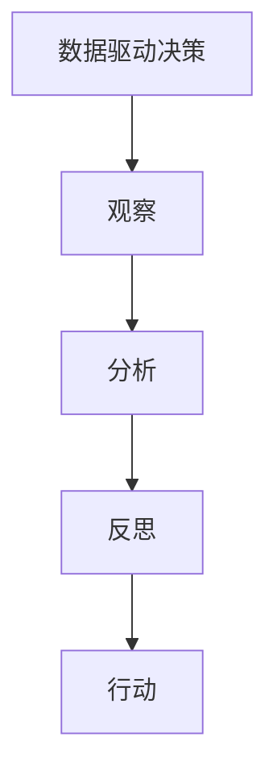

                 

## 1. 背景介绍

### 1.1 问题由来
在信息爆炸的时代，数据无处不在，但如何才能从中提炼出有价值的洞见？观察与反思，是形成洞见的两个重要环节。观察帮助我们发现现象，反思则引导我们深入理解其背后的原理和机制。然而，在数据驱动的今天，人们往往忽视了反思这一环节，仅凭借数据直接进行决策，导致结果事与愿违。因此，探讨洞见的形成过程，以及如何在数据观察的基础上进行有效反思，具有重要意义。

### 1.2 问题核心关键点
洞见的形成是一个多步骤的过程，包括数据收集、观察、分析、反思和行动五个环节。本文将重点讨论后三个环节，特别是反思环节的重要性，以及如何通过反思提升决策质量。

### 1.3 问题研究意义
反思是决策科学的核心要素之一，但在数据驱动的决策过程中，反思往往被忽视。通过对洞见的形成过程的研究，我们能够更好地理解决策的机制，提升决策的科学性和可解释性。同时，反思还能够帮助我们在面对复杂、多变的外部环境时，保持持续学习和适应能力，避免陷入数据陷阱，从而更好地指导实践。

## 2. 核心概念与联系

### 2.1 核心概念概述

为更好地理解洞见的形成过程，本节将介绍几个密切相关的核心概念：

- 数据驱动决策：基于数据分析和模型预测的决策方式，强调数据的重要性，但忽视了人类智慧的洞察。
- 观察：通过直接接触事物或现象，获取关于其属性和关系的直观信息。
- 分析：对观察到的信息进行量化和抽象，发现其背后的规律和模式。
- 反思：在分析的基础上，对现象背后的原因和机制进行深入思考，形成新的见解和假设。
- 行动：基于反思结果，制定和实施行动计划，验证假设并持续优化决策。

这些核心概念之间的逻辑关系可以通过以下Mermaid流程图来展示：



这个流程图展示了大语言模型的核心概念及其之间的关系：

1. 数据驱动决策是基础，通过数据收集和分析获取信息。
2. 观察是对数据进行直接接触和感知。
3. 分析将观察到的信息进行量化和抽象。
4. 反思是深入思考和推理，形成新的洞见。
5. 行动是依据反思结果制定和执行计划。

这些概念共同构成了洞见形成的全流程，帮助我们从现象中提炼出规律，并指导后续的实践活动。

## 3. 核心算法原理 & 具体操作步骤

### 3.1 算法原理概述

洞见的形成，本质上是一个多步骤的决策和验证过程。其核心思想是：在观察数据的基础上，通过分析发现现象背后的规律，进行深入反思，形成新的见解，并依据这些见解制定和执行行动计划。

形式化地，设 $D$ 为观察到的数据集，$A$ 为分析后得到的规律，$R$ 为反思过程中提出的假设，$O$ 为基于 $R$ 的行动方案。洞见形成的过程可表示为：

$$
\begin{aligned}
& D \rightarrow A \rightarrow R \rightarrow O \\
& O \rightarrow D', \quad \text{验证效果}
\end{aligned}
$$

其中 $D'$ 表示行动后的反馈数据，用于验证行动方案的效果。

### 3.2 算法步骤详解

洞见的形成过程一般包括以下几个关键步骤：

**Step 1: 数据收集和观察**
- 收集相关数据，确保数据的多样性和代表性。
- 通过观察和感知，获取对数据属性的直观理解。

**Step 2: 数据量化和分析**
- 使用统计方法或机器学习模型对数据进行量化，发现其背后的规律和模式。
- 通过可视化和解释性技术，帮助理解复杂数据的特征。

**Step 3: 反思和洞见形成**
- 对分析结果进行反思，探讨其背后的原因和机制。
- 通过多角度的思考，提出新的假设和见解，形成洞见。

**Step 4: 制定和执行行动计划**
- 基于洞见，制定具体的行动计划。
- 执行行动方案，并在执行过程中收集反馈数据。

**Step 5: 验证和持续优化**
- 使用反馈数据验证行动效果，评估洞见的有效性。
- 根据验证结果持续优化行动方案和洞见，迭代提升决策质量。

以上是洞见形成的全流程，每个步骤都需要精心设计和细心执行。只有将观察、分析、反思和行动有机结合起来，才能形成有价值的洞见，指导实践并持续改进。

### 3.3 算法优缺点

洞见形成的方法具有以下优点：

1. 系统性：通过系统的流程设计，确保每个环节都得到充分关注和处理，避免遗漏关键信息。
2. 逻辑性：在数据驱动的基础上，结合反思环节，增强决策的科学性和可解释性。
3. 灵活性：反思环节允许多角度思考，为创新和改进提供了空间。
4. 可操作性：反思后的洞见能够指导具体行动，提升决策的实践效果。

同时，该方法也存在一定的局限性：

1. 数据依赖：洞见形成需要大量高质量数据，数据质量不高或数据量不足，会影响洞见的形成效果。
2. 反思难度：反思环节需要高度的专业知识和经验，对思考能力要求较高。
3. 结果不确定性：洞见可能存在多解，选择错误的洞见会导致行动失败。
4. 反馈时滞：行动效果反馈到决策过程可能存在延迟，影响决策的时效性。

尽管存在这些局限性，但就目前而言，洞见形成的方法仍是决策过程中不可或缺的一部分。未来相关研究的重点在于如何进一步降低数据获取成本，提升反思的效率和质量，同时兼顾行动的即时性和灵活性等因素。

### 3.4 算法应用领域

洞见形成的方法在多个领域都有广泛的应用，例如：

- 商业决策：通过市场数据和用户反馈，发现市场趋势和用户需求，制定相应的市场营销策略。
- 医疗诊断：收集和分析患者数据，反思诊断过程，提升诊断的准确性和可解释性。
- 教育评估：收集和分析学生的学习数据，反思教学过程，优化教学方法和课程设计。
- 金融分析：分析市场数据和经济指标，反思投资策略，降低投资风险。
- 环境保护：收集和分析环境数据，反思环境变化趋势，制定环保政策。

除了上述这些经典应用外，洞见形成的方法还被创新性地应用到更多场景中，如风险管理、灾害预警、城市规划等，为各行业的发展提供新的思路和方法。

## 4. 数学模型和公式 & 详细讲解  
### 4.1 数学模型构建

本节将使用数学语言对洞见形成的过程进行更加严格的刻画。

设 $D = \{(x_i, y_i)\}_{i=1}^N$ 为观察到的数据集，其中 $x_i \in \mathcal{X}, y_i \in \mathcal{Y}$ 分别表示第 $i$ 个样本的特征和标签。设 $A = f(D)$ 为对数据集 $D$ 进行量化和分析后得到的结果。设 $R = g(A)$ 为对 $A$ 进行反思后提出的假设。设 $O = h(R)$ 为基于 $R$ 制定的行动方案。

假设 $D'$ 表示执行 $O$ 后反馈的数据集，则洞见形成的过程可以表示为：

$$
\begin{aligned}
& D \rightarrow A \rightarrow R \rightarrow O \rightarrow D' \\
& D' \sim O, \quad \text{验证效果}
\end{aligned}
$$

其中 $O$ 的执行过程和反馈数据 $D'$ 的生成过程均由具体业务逻辑和模型预测决定。

### 4.2 公式推导过程

以下我们以金融数据分析为例，推导如何通过洞见形成过程进行投资策略优化。

设 $D$ 为历史股票价格数据集，$A = \text{Correlation}(D)$ 表示股票之间的相关性矩阵。设 $R = \text{Principal Component Analysis}(A)$ 表示对相关性矩阵进行主成分分析后得到的投资组合。设 $O = \text{Portfolio Optimization}(R)$ 表示基于投资组合 $R$ 进行资产配置和优化策略。

假设 $D'$ 表示执行 $O$ 后的股票价格数据，则有：

$$
\begin{aligned}
& D \rightarrow A \rightarrow R \rightarrow O \rightarrow D' \\
& D' = f(O, D), \quad \text{验证效果}
\end{aligned}
$$

其中 $f$ 表示基于策略 $O$ 和市场数据 $D$ 的股票价格预测模型。

### 4.3 案例分析与讲解

以医疗诊断为例，说明如何通过洞见形成过程提高诊断准确性。

设 $D$ 为患者的临床数据集，包括年龄、性别、病史、检查结果等。设 $A = \text{Feature Selection}(D)$ 表示对数据集进行特征选择和提取。设 $R = \text{Rule-Based Reasoning}(A)$ 表示基于专家规则对特征进行推理和诊断。设 $O = \text{Therapy Optimization}(R)$ 表示基于诊断结果 $R$ 进行治疗方案优化。

假设 $D'$ 表示执行 $O$ 后患者的治疗效果数据，则有：

$$
\begin{aligned}
& D \rightarrow A \rightarrow R \rightarrow O \rightarrow D' \\
& D' = g(O, D), \quad \text{验证效果}
\end{aligned}
$$

其中 $g$ 表示基于治疗方案 $O$ 和患者数据 $D$ 的治疗效果评估模型。

## 5. 项目实践：代码实例和详细解释说明
### 5.1 开发环境搭建

在进行洞见形成实践前，我们需要准备好开发环境。以下是使用Python进行数据分析和可视化的环境配置流程：

1. 安装Anaconda：从官网下载并安装Anaconda，用于创建独立的Python环境。

2. 创建并激活虚拟环境：
```bash
conda create -n data-env python=3.8 
conda activate data-env
```

3. 安装相关库：
```bash
conda install pandas numpy matplotlib seaborn plotly
```

完成上述步骤后，即可在`data-env`环境中开始洞见形成实践。

### 5.2 源代码详细实现

下面我们以金融数据分析为例，给出使用Python进行数据分析和可视化的代码实现。

首先，定义数据加载和预处理函数：

```python
import pandas as pd
import numpy as np
import matplotlib.pyplot as plt

def load_data(file_path):
    data = pd.read_csv(file_path)
    data.fillna(method='ffill', inplace=True)
    return data

def normalize(data):
    return (data - data.mean()) / data.std()

def visualize(data, x, y, title):
    plt.figure(figsize=(10, 6))
    plt.scatter(x, y)
    plt.title(title)
    plt.xlabel(x)
    plt.ylabel(y)
    plt.show()

data = load_data('financial_data.csv')
data = normalize(data)
```

然后，进行数据统计和分析：

```python
correlation_matrix = data.corr()
visualize('Correlation Matrix', 'x', 'y', 'Correlation Matrix')
```

接着，进行主成分分析（PCA）：

```python
from sklearn.decomposition import PCA

pca = PCA(n_components=2)
pca_data = pca.fit_transform(data)
visualize('PCA', 'x', 'y', 'PCA')
```

最后，生成投资组合并进行优化：

```python
from sklearn.linear_model import LinearRegression

def optimize_portfolio(x, y):
    reg = LinearRegression()
    reg.fit(x, y)
    return reg

reg = optimize_portfolio(pca_data[:, 0], pca_data[:, 1])
optimal_weights = reg.coef_
print('Optimal Weights:', optimal_weights)
```

以上就是使用Python进行金融数据分析和优化的完整代码实现。可以看到，通过数据分析和可视化的手段，我们能够直观地发现数据中的规律，并进行反思和决策优化。

### 5.3 代码解读与分析

让我们再详细解读一下关键代码的实现细节：

**load_data函数**：
- 定义了数据加载和预处理函数，通过Pandas库读取CSV文件，并对缺失值进行填充，确保数据完整性。

**normalize函数**：
- 定义了数据归一化函数，通过标准化处理，消除数据间的量纲差异，便于后续分析。

**visualize函数**：
- 定义了数据可视化函数，使用Matplotlib库绘制散点图，帮助理解数据之间的相关性。

**主成分分析（PCA）**：
- 使用Scikit-learn库进行主成分分析，通过降维处理，简化数据复杂性，提取主要特征。

**投资组合优化**：
- 使用线性回归模型，基于主成分分析后的数据进行投资组合优化，生成最优权重。

可以看到，Python和相关库使得数据分析和可视化的流程变得简洁高效。开发者可以将更多精力放在数据处理和模型优化等高层逻辑上，而不必过多关注底层的实现细节。

当然，工业级的系统实现还需考虑更多因素，如数据的获取、清洗、存储等，以及模型的验证、部署、监控等环节。但核心的洞见形成流程基本与此类似。

## 6. 实际应用场景
### 6.1 智能客服系统

基于洞见形成的智能客服系统，能够实时分析客户咨询内容，发现客户普遍关注的问题，并根据分析结果制定和调整回答策略，提升客户满意度。例如，通过收集历史客服对话记录，分析常见问题类型和解决方式，发现新的客户需求和痛点，优化客服流程和回答内容。

### 6.2 金融舆情监测

金融机构通过洞见形成方法，能够实时监测市场舆情，发现突发事件和市场变化，快速调整投资策略，降低投资风险。例如，分析新闻、评论、社交媒体等来源的数据，识别舆情趋势和关键事件，及时进行投资预警和策略调整。

### 6.3 个性化推荐系统

电商和内容平台通过洞见形成方法，能够深入理解用户行为和偏好，优化推荐算法，提供个性化内容。例如，通过分析用户浏览、点击、评价等行为数据，反思用户需求的动态变化，调整推荐策略，提升用户体验和转化率。

### 6.4 未来应用展望

随着数据驱动的决策方式在各行各业的应用，洞见形成方法将发挥越来越重要的作用。未来，洞见形成技术将在以下几个方向上进一步发展：

1. 自动化数据分析：通过自动化工具和算法，提高数据处理和分析的效率，降低人工干预成本。
2. 多模态融合分析：结合文本、图像、音频等多种数据源，进行多模态融合分析，提高决策的全面性和准确性。
3. 实时数据分析：通过实时数据流处理技术，实现动态数据分析和优化，提高决策的时效性。
4. 交互式数据分析：通过交互式可视化工具，实现数据驱动的决策交互式分析和反馈，提升决策的透明性和参与性。
5. 集成化决策系统：将洞见形成技术与AI、专家系统等集成，构建一体化决策平台，提高决策的科学性和可解释性。

## 7. 工具和资源推荐
### 7.1 学习资源推荐

为了帮助开发者系统掌握洞见形成的方法和应用，这里推荐一些优质的学习资源：

1. 《数据分析实战》系列博文：由数据科学家撰写，深入浅出地介绍了数据分析、数据可视化、洞见形成等实战技巧。

2. CS229《机器学习》课程：斯坦福大学开设的经典课程，涵盖机器学习的基本原理和应用，是数据分析和洞见形成的重要基础。

3. 《Python数据分析与可视化》书籍：讲解如何使用Python进行数据处理、分析和可视化，是洞见形成实践的重要参考资料。

4. Kaggle数据科学竞赛：参与实战数据科学竞赛，提升数据分析和洞见形成能力，积累项目经验。

5. Tableau数据可视化工具：易于上手的数据可视化工具，适合非技术人员快速进行数据探索和洞见形成。

通过对这些资源的学习实践，相信你一定能够快速掌握洞见形成的精髓，并用于解决实际的决策问题。
###  7.2 开发工具推荐

高效的开发离不开优秀的工具支持。以下是几款用于洞见形成开发的常用工具：

1. Jupyter Notebook：交互式数据科学笔记本，支持Python和R等多种语言，方便实时分析数据和展示结果。

2. Excel：强大的电子表格工具，支持多种数据处理和分析功能，适合入门级数据分析。

3. Tableau：数据可视化工具，支持复杂的数据分析和交互式可视化，适合中高级数据分析师使用。

4. R语言：开源的数据分析语言，拥有丰富的统计分析和绘图库，适合学术研究和数据科学竞赛。

5. Power BI：微软推出的商业智能工具，支持企业级数据集成和可视化，适合大数据和商业分析应用。

合理利用这些工具，可以显著提升洞见形成的开发效率，加快创新迭代的步伐。

### 7.3 相关论文推荐

洞见形成的方法在多个领域都有广泛的应用，以下是几篇奠基性的相关论文，推荐阅读：

1. "Data-Driven Decision Making: A Review and Research Agenda"：总结了数据驱动决策的基本框架和方法，是洞见形成的重要理论基础。

2. "Machine Learning: A Probabilistic Perspective"：讲解了机器学习的基本原理和应用，是数据分析和洞见形成的重要工具。

3. "Holistic Data Driven Decision Making: An Intelligent Approach"：提出了全流程的数据驱动决策框架，涵盖数据收集、分析、反思和行动等多个环节。

4. "Feature Engineering for Data Mining"：介绍了特征工程的基本方法，是数据分析和洞见形成的重要技术。

5. "Deep Learning for NLP: A Survey"：总结了大语言模型在自然语言处理中的应用，为洞见形成提供了数据和算法的支持。

这些论文代表了大语言模型微调技术的发展脉络。通过学习这些前沿成果，可以帮助研究者把握学科前进方向，激发更多的创新灵感。

## 8. 总结：未来发展趋势与挑战

### 8.1 总结

本文对洞见的形成过程进行了全面系统的介绍。首先阐述了洞见的形成在数据驱动决策中的重要性，明确了洞见形成在提高决策质量和可解释性方面的独特价值。其次，从原理到实践，详细讲解了洞见形成的数学原理和关键步骤，给出了洞见形成任务开发的完整代码实例。同时，本文还广泛探讨了洞见形成方法在智能客服、金融舆情、个性化推荐等多个行业领域的应用前景，展示了洞见形成方法的巨大潜力。此外，本文精选了洞见形成技术的各类学习资源，力求为读者提供全方位的技术指引。

通过本文的系统梳理，可以看到，洞见形成方法在数据驱动的决策过程中扮演着不可或缺的角色，能够帮助我们在复杂多变的外部环境中，通过反思提升决策的科学性和可解释性，避免陷入数据陷阱，从而更好地指导实践。

### 8.2 未来发展趋势

展望未来，洞见形成技术将呈现以下几个发展趋势：

1. 自动化数据分析：通过自动化工具和算法，提高数据处理和分析的效率，降低人工干预成本。
2. 多模态融合分析：结合文本、图像、音频等多种数据源，进行多模态融合分析，提高决策的全面性和准确性。
3. 实时数据分析：通过实时数据流处理技术，实现动态数据分析和优化，提高决策的时效性。
4. 交互式数据分析：通过交互式可视化工具，实现数据驱动的决策交互式分析和反馈，提升决策的透明性和参与性。
5. 集成化决策系统：将洞见形成技术与AI、专家系统等集成，构建一体化决策平台，提高决策的科学性和可解释性。

以上趋势凸显了洞见形成技术的广阔前景。这些方向的探索发展，必将进一步提升决策的质量和效率，为数据驱动的决策方式带来新的突破。

### 8.3 面临的挑战

尽管洞见形成技术已经取得了瞩目成就，但在迈向更加智能化、普适化应用的过程中，它仍面临着诸多挑战：

1. 数据质量瓶颈：洞见形成依赖高质量数据，数据质量不高或数据量不足，会影响洞见的形成效果。如何进一步降低数据获取成本，提升数据质量，将是一大难题。
2. 反思难度：反思环节需要高度的专业知识和经验，对思考能力要求较高。如何降低反思难度，提升反思效率，将是重要的研究方向。
3. 结果不确定性：洞见可能存在多解，选择错误的洞见会导致行动失败。如何提高洞见选择的准确性，避免陷入数据陷阱，是关键挑战。
4. 反馈时滞：行动效果反馈到决策过程可能存在延迟，影响决策的时效性。如何缩短反馈时滞，提升决策的即时性，是重要的优化方向。

尽管存在这些挑战，但通过不断探索和创新，相信洞见形成技术能够克服这些难题，迈向更加智能化、普适化的应用场景。

### 8.4 研究展望

面对洞见形成技术面临的挑战，未来的研究需要在以下几个方面寻求新的突破：

1. 探索自动化数据分析工具：开发更多自动化数据处理和分析工具，降低人工干预成本，提升数据处理效率。
2. 研究多模态融合分析方法：结合多种数据源，进行多模态融合分析，提高决策的全面性和准确性。
3. 引入机器学习和深度学习技术：利用机器学习和深度学习技术，提升数据分析和洞见形成的自动化水平，增强决策的科学性和可解释性。
4. 优化反馈机制：通过引入实时反馈和动态调整机制，缩短反馈时滞，提升决策的时效性。
5. 加强人机协同：通过人机协同的方式，结合人工智慧和算法优化，提高洞见形成的效果和效率。

这些研究方向的探索，必将引领洞见形成技术迈向更高的台阶，为数据驱动的决策方式带来新的突破，推动数据科学和人工智能的进一步发展。总之，只有勇于创新、敢于突破，才能不断拓展数据科学和人工智能的边界，让数据驱动的决策方式更好地服务于人类社会。

## 9. 附录：常见问题与解答

**Q1：洞见形成是否适用于所有数据驱动决策？**

A: 洞见形成方法在大多数数据驱动决策过程中都有广泛的应用，特别是对于数据量较大、结构复杂的情况。但对于一些简单直接的任务，如规则驱动的决策，可能没有明显的洞见形成需求。

**Q2：如何在数据驱动的决策过程中引入反思环节？**

A: 引入反思环节，需要基于现有的数据驱动决策流程，增加反思和验证环节。可以通过以下步骤：
1. 收集和分析数据，发现现象和规律。
2. 对现象和规律进行反思，提出新的假设和见解。
3. 基于反思结果，制定和执行行动计划。
4. 收集反馈数据，验证行动效果，并持续优化。

**Q3：如何提升洞见形成的效率和效果？**

A: 提升洞见形成的效率和效果，需要从以下几个方面入手：
1. 使用自动化工具和算法，提高数据处理和分析的效率。
2. 结合多种数据源，进行多模态融合分析，提高决策的全面性和准确性。
3. 引入机器学习和深度学习技术，提升数据分析和洞见形成的自动化水平。
4. 加强人机协同，结合人工智慧和算法优化，提高洞见形成的效果和效率。

**Q4：如何降低洞见形成的反馈时滞？**

A: 降低洞见形成的反馈时滞，需要从以下几个方面入手：
1. 引入实时数据流处理技术，实现动态数据分析和优化。
2. 使用交互式可视化工具，实现数据驱动的决策交互式分析和反馈。
3. 优化数据处理和分析流程，减少数据传递和处理的延迟。

**Q5：如何提高洞见选择的准确性？**

A: 提高洞见选择的准确性，需要从以下几个方面入手：
1. 收集高质量数据，确保数据的多样性和代表性。
2. 使用多种数据分析方法，综合考虑数据的多方面特征。
3. 引入专家知识和经验，提升反思和洞见的可信度。
4. 进行多角度的思考和验证，避免单一视角的偏见。

这些问题的答案展示了洞见形成方法在不同场景中的应用和改进方向，帮助我们在数据驱动的决策过程中，更好地形成洞见，指导实践并持续改进。

---

作者：禅与计算机程序设计艺术 / Zen and the Art of Computer Programming

