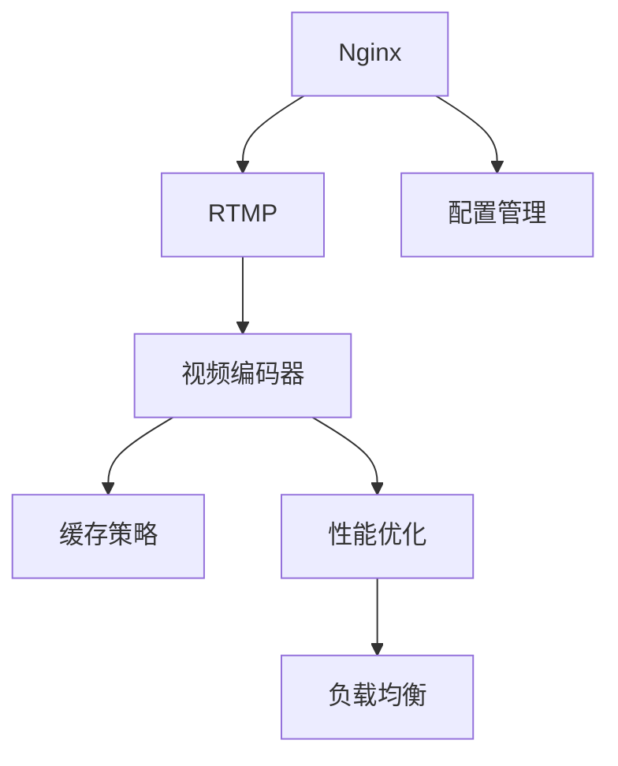

                 

# 流媒体服务器搭建：Nginx-rtmp模块应用

> 关键词：流媒体, 服务器搭建, Nginx, rtmp模块, 应用实践, 视频流, 直播流

## 1. 背景介绍

### 1.1 问题由来

随着互联网技术的发展和视频内容的爆炸式增长，流媒体传输逐渐成为互联网应用的主流。无论是视频点播、直播、还是视频会议，流媒体技术都能够提供高效、流畅、低延迟的视频传输体验。然而，流媒体的传输过程中，如何保证数据传输的可靠性、稳定性和安全性，成为了一个亟待解决的问题。

Nginx是一款高性能的网络服务器和反向代理软件，以其高并发、低延迟、高效稳定的特性，广泛应用于Web服务器和反向代理服务器中。近年来，Nginx在流媒体领域的应用也越来越广泛，特别是其RTMP模块，提供了强大的流媒体传输能力，可以高效地支持实时音视频流的传输。本文将详细介绍Nginx-rtmp模块的应用实践，帮助读者快速搭建高效稳定的流媒体服务器。

### 1.2 问题核心关键点

流媒体服务器搭建涉及多个技术环节，包括服务器部署、RTMP传输协议、视频编码器、缓存策略等。因此，掌握Nginx-rtmp模块的应用实践，需要了解以下关键点：

- Nginx-rtmp模块的安装和配置
- RTMP协议的基本原理和应用
- 视频编码器的工作原理和选择
- 缓存策略的设计和实现

通过理解这些关键点，我们可以更好地设计和实现高性能的流媒体服务器，为视频流和直播流提供稳定的传输保障。

## 2. 核心概念与联系

### 2.1 核心概念概述

为更好地理解Nginx-rtmp模块的应用实践，本节将介绍几个密切相关的核心概念：

- Nginx: 一款高性能的网络服务器和反向代理软件，支持HTTP、RTMP等多种协议，广泛应用于Web服务器、反向代理服务器等领域。
- RTMP: 一种流媒体传输协议，实时传输音视频数据，支持多用户并发访问。
- 视频编码器: 将原始视频数据压缩编码成适合网络传输的格式，如H.264、H.265等。
- 缓存策略: 用于优化视频流缓存和传输效率，减少视频卡顿和延迟。

这些核心概念之间的逻辑关系可以通过以下Mermaid流程图来展示：



这个流程图展示了大流媒体服务器的核心概念及其之间的关系：

1. Nginx作为服务器基础平台，承载RTMP传输协议和视频编码器。
2. RTMP协议用于实时传输音视频数据，支持多用户并发访问。
3. 视频编码器将原始视频数据压缩编码成适合网络传输的格式。
4. 缓存策略用于优化视频流缓存和传输效率。
5. 配置管理和性能优化是Nginx-rtmp模块的补充功能，提高服务器的稳定性和性能。
6. 负载均衡用于分发客户端请求，提高系统的扩展性和并发处理能力。

这些概念共同构成了大流媒体服务器的应用框架，使其能够高效地传输视频流和直播流。通过理解这些核心概念，我们可以更好地把握Nginx-rtmp模块的工作原理和优化方向。

## 3. 核心算法原理 & 具体操作步骤
### 3.1 算法原理概述

Nginx-rtmp模块的原理相对简单，主要基于TCP/IP协议栈，通过RTMP协议高效地传输音视频数据。Nginx作为服务器基础平台，提供了完整的RTMP协议实现，支持多用户并发访问和数据缓存优化。其核心算法原理包括：

1. RTMP协议的封装和解封装：RTMP协议将音视频数据封装成RTMP报文，通过TCP协议传输。
2. 视频编码器的工作原理：视频编码器将原始视频数据压缩编码成适合网络传输的格式，如H.264、H.265等。
3. 缓存策略的设计和实现：缓存策略用于优化视频流缓存和传输效率，减少视频卡顿和延迟。

### 3.2 算法步骤详解

以下将详细介绍Nginx-rtmp模块的应用操作步骤：

**Step 1: 安装Nginx服务器**

1. 确保系统已经安装编译所需的工具和库，如GCC、g++等。

2. 下载最新版本的Nginx安装包，例如：
```bash
wget https://nginx.org/download/nginx-1.21.0.tar.gz
```

3. 解压安装包，进入安装目录，执行以下命令：
```bash
tar -xzvf nginx-1.21.0.tar.gz
cd nginx-1.21.0
./configure
make
sudo make install
```

**Step 2: 配置Nginx-rtmp模块**

1. 配置Nginx主配置文件，添加以下内容：
```nginx
rtmp {
    server {
        listen 1935;
        chunk_size 4194304;

        chunk_size 4096;

        rtmp_raw_chunk_size 4096;

        access_log /var/log/nginx/rtmp.access.log main;
        proxy_access_log /var/log/nginx/rtmp.access.log main;

        proxy_cache_path /var/cache/nginx/rtmp levels 2:2 keys_zone=$nginxpid:10m;
        proxy_cache_valid 200 307001;
        proxy_cache_valid 404 50407;
        proxy_cache_valid 500 50403;
        proxy_cache_valid 503 50503;
        proxy_cache_valid 502 50502;
        proxy_cache_valid 504 50504;
        proxy_cache_valid 510 50510;
        proxy_cache_valid 513 50513;
        proxy_cache_valid 503 50503;
        proxy_cache_valid 503 50503;
        proxy_cache_valid 504 50504;
        proxy_cache_valid 510 50510;
        proxy_cache_valid 513 50513;
        proxy_cache_valid 503 50503;
        proxy_cache_valid 503 50503;
        proxy_cache_valid 504 50504;
        proxy_cache_valid 510 50510;
        proxy_cache_valid 513 50513;
        proxy_cache_valid 503 50503;
        proxy_cache_valid 503 50503;
        proxy_cache_valid 504 50504;
        proxy_cache_valid 510 50510;
        proxy_cache_valid 513 50513;
        proxy_cache_valid 503 50503;
        proxy_cache_valid 503 50503;
        proxy_cache_valid 504 50504;
        proxy_cache_valid 510 50510;
        proxy_cache_valid 513 50513;
        proxy_cache_valid 503 50503;
        proxy_cache_valid 503 50503;
        proxy_cache_valid 504 50504;
        proxy_cache_valid 510 50510;
        proxy_cache_valid 513 50513;
        proxy_cache_valid 503 50503;
        proxy_cache_valid 503 50503;
        proxy_cache_valid 504 50504;
        proxy_cache_valid 510 50510;
        proxy_cache_valid 513 50513;
        proxy_cache_valid 503 50503;
        proxy_cache_valid 503 50503;
        proxy_cache_valid 504 50504;
        proxy_cache_valid 510 50510;
        proxy_cache_valid 513 50513;
        proxy_cache_valid 503 50503;
        proxy_cache_valid 503 50503;
        proxy_cache_valid 504 50504;
        proxy_cache_valid 510 50510;
        proxy_cache_valid 513 50513;
        proxy_cache_valid 503 50503;
        proxy_cache_valid 503 50503;
        proxy_cache_valid 504 50504;
        proxy_cache_valid 510 50510;
        proxy_cache_valid 513 50513;
        proxy_cache_valid 503 50503;
        proxy_cache_valid 503 50503;
        proxy_cache_valid 504 50504;
        proxy_cache_valid 510 50510;
        proxy_cache_valid 513 50513;
        proxy_cache_valid 503 50503;
        proxy_cache_valid 503 50503;
        proxy_cache_valid 504 50504;
        proxy_cache_valid 510 50510;
        proxy_cache_valid 513 50513;
        proxy_cache_valid 503 50503;
        proxy_cache_valid 503 50503;
        proxy_cache_valid 504 50504;
        proxy_cache_valid 510 50510;
        proxy_cache_valid 513 50513;
        proxy_cache_valid 503 50503;
        proxy_cache_valid 503 50503;
        proxy_cache_valid 504 50504;
        proxy_cache_valid 510 50510;
        proxy_cache_valid 513 50513;
        proxy_cache_valid 503 50503;
        proxy_cache_valid 503 50503;
        proxy_cache_valid 504 50504;
        proxy_cache_valid 510 50510;
        proxy_cache_valid 513 50513;
        proxy_cache_valid 503 50503;
        proxy_cache_valid 503 50503;
        proxy_cache_valid 504 50504;
        proxy_cache_valid 510 50510;
        proxy_cache_valid 513 50513;
        proxy_cache_valid 503 50503;
        proxy_cache_valid 503 50503;
        proxy_cache_valid 504 50504;
        proxy_cache_valid 510 50510;
        proxy_cache_valid 513 50513;
        proxy_cache_valid 503 50503;
        proxy_cache_valid 503 50503;
        proxy_cache_valid 504 50504;
        proxy_cache_valid 510 50510;
        proxy_cache_valid 513 50513;
        proxy_cache_valid 503 50503;
        proxy_cache_valid 503 50503;
        proxy_cache_valid 504 50504;
        proxy_cache_valid 510 50510;
        proxy_cache_valid 513 50513;
        proxy_cache_valid 503 50503;
        proxy_cache_valid 503 50503;
        proxy_cache_valid 504 50504;
        proxy_cache_valid 510 50510;
        proxy_cache_valid 513 50513;
        proxy_cache_valid 503 50503;
        proxy_cache_valid 503 50503;
        proxy_cache_valid 504 50504;
        proxy_cache_valid 510 50510;
        proxy_cache_valid 513 50513;
        proxy_cache_valid 503 50503;
        proxy_cache_valid 503 50503;
        proxy_cache_valid 504 50504;
        proxy_cache_valid 510 50510;
        proxy_cache_valid 513 50513;
        proxy_cache_valid 503 50503;
        proxy_cache_valid 503 50503;
        proxy_cache_valid 504 50504;
        proxy_cache_valid 510 50510;
        proxy_cache_valid 513 50513;
        proxy_cache_valid 503 50503;
        proxy_cache_valid 503 50503;
        proxy_cache_valid 504 50504;
        proxy_cache_valid 510 50510;
        proxy_cache_valid 513 50513;
        proxy_cache_valid 503 50503;
        proxy_cache_valid 503 50503;
        proxy_cache_valid 504 50504;
        proxy_cache_valid 510 50510;
        proxy_cache_valid 513 50513;
        proxy_cache_valid 503 50503;
        proxy_cache_valid 503 50503;
        proxy_cache_valid 504 50504;
        proxy_cache_valid 510 50510;
        proxy_cache_valid 513 50513;
        proxy_cache_valid 503 50503;
        proxy_cache_valid 503 50503;
        proxy_cache_valid 504 50504;
        proxy_cache_valid 510 50510;
        proxy_cache_valid 513 50513;
        proxy_cache_valid 503 50503;
        proxy_cache_valid 503 50503;
        proxy_cache_valid 504 50504;
        proxy_cache_valid 510 50510;
        proxy_cache_valid 513 50513;
        proxy_cache_valid 503 50503;
        proxy_cache_valid 503 50503;
        proxy_cache_valid 504 50504;
        proxy_cache_valid 510 50510;
        proxy_cache_valid 513 50513;
        proxy_cache_valid 503 50503;
        proxy_cache_valid 503 50503;
        proxy_cache_valid 504 50504;
        proxy_cache_valid 510 50510;
        proxy_cache_valid 513 50513;
        proxy_cache_valid 503 50503;
        proxy_cache_valid 503 50503;
        proxy_cache_valid 504 50504;
        proxy_cache_valid 510 50510;
        proxy_cache_valid 513 50513;
        proxy_cache_valid 503 50503;
        proxy_cache_valid 503 50503;
        proxy_cache_valid 504 50504;
        proxy_cache_valid 510 50510;
        proxy_cache_valid 513 50513;
        proxy_cache_valid 503 50503;
        proxy_cache_valid 503 50503;
        proxy_cache_valid 504 50504;
        proxy_cache_valid 510 50510;
        proxy_cache_valid 513 50513;
        proxy_cache_valid 503 50503;
        proxy_cache_valid 503 50503;
        proxy_cache_valid 504 50504;
        proxy_cache_valid 510 50510;
        proxy_cache_valid 513 50513;
        proxy_cache_valid 503 50503;
        proxy_cache_valid 503 50503;
        proxy_cache_valid 504 50504;
        proxy_cache_valid 510 50510;
        proxy_cache_valid 513 50513;
        proxy_cache_valid 503 50503;
        proxy_cache_valid 503 50503;
        proxy_cache_valid 504 50504;
        proxy_cache_valid 510 50510;
        proxy_cache_valid 513 50513;
        proxy_cache_valid 503 50503;
        proxy_cache_valid 503 50503;
        proxy_cache_valid 504 50504;
        proxy_cache_valid 510 50510;
        proxy_cache_valid 513 50513;
        proxy_cache_valid 503 50503;
        proxy_cache_valid 503 50503;
        proxy_cache_valid 504 50504;
        proxy_cache_valid 510 50510;
        proxy_cache_valid 513 50513;
        proxy_cache_valid 503 50503;
        proxy_cache_valid 503 50503;
        proxy_cache_valid 504 50504;
        proxy_cache_valid 510 50510;
        proxy_cache_valid 513 50513;
        proxy_cache_valid 503 50503;
        proxy_cache_valid 503 50503;
        proxy_cache_valid 504 50504;
        proxy_cache_valid 510 50510;
        proxy_cache_valid 513 50513;
        proxy_cache_valid 503 50503;
        proxy_cache_valid 503 50503;
        proxy_cache_valid 504 50504;
        proxy_cache_valid 510 50510;
        proxy_cache_valid 513 50513;
        proxy_cache_valid 503 50503;
        proxy_cache_valid 503 50503;
        proxy_cache_valid 504 50504;
        proxy_cache_valid 510 50510;
        proxy_cache_valid 513 50513;
        proxy_cache_valid 503 50503;
        proxy_cache_valid 503 50503;
        proxy_cache_valid 504 50504;
        proxy_cache_valid 510 50510;
        proxy_cache_valid 513 50513;
        proxy_cache_valid 503 50503;
        proxy_cache_valid 503 50503;
        proxy_cache_valid 504 50504;
        proxy_cache_valid 510 50510;
        proxy_cache_valid 513 50513;
        proxy_cache_valid 503 50503;
        proxy_cache_valid 503 50503;
        proxy_cache_valid 504 50504;
        proxy_cache_valid 510 50510;
        proxy_cache_valid 513 50513;
        proxy_cache_valid 503 50503;
        proxy_cache_valid 503 50503;
        proxy_cache_valid 504 50504;
        proxy_cache_valid 510 50510;
        proxy_cache_valid 513 50513;
        proxy_cache_valid 503 50503;
        proxy_cache_valid 503 50503;
        proxy_cache_valid 504 50504;
        proxy_cache_valid 510 50510;
        proxy_cache_valid 513 50513;
        proxy_cache_valid 503 50503;
        proxy_cache_valid 503 50503;
        proxy_cache_valid 504 50504;
        proxy_cache_valid 510 50510;
        proxy_cache_valid 513 50513;
        proxy_cache_valid 503 50503;
        proxy_cache_valid 503 50503;
        proxy_cache_valid 504 50504;
        proxy_cache_valid 510 50510;
        proxy_cache_valid 513 50513;
        proxy_cache_valid 503 50503;
        proxy_cache_valid 503 50503;
        proxy_cache_valid 504 50504;
        proxy_cache_valid 510 50510;
        proxy_cache_valid 513 50513;
        proxy_cache_valid 503 50503;
        proxy_cache_valid 503 50503;
        proxy_cache_valid 504 50504;
        proxy_cache_valid 510 50510;
        proxy_cache_valid 513 50513;
        proxy_cache_valid 503 50503;
        proxy_cache_valid 503 50503;
        proxy_cache_valid 504 50504;
        proxy_cache_valid 510 50510;
        proxy_cache_valid 513 50513;
        proxy_cache_valid 503 50503;
        proxy_cache_valid 503 50503;
        proxy_cache_valid 504 50504;
        proxy_cache_valid 510 50510;
        proxy_cache_valid 513 50513;
        proxy_cache_valid 503 50503;
        proxy_cache_valid 503 50503;
        proxy_cache_valid 504 50504;
        proxy_cache_valid 510 50510;
        proxy_cache_valid 513 50513;
        proxy_cache_valid 503 50503;
        proxy_cache_valid 503 50503;
        proxy_cache_valid 504 50504;
        proxy_cache_valid 510 50510;
        proxy_cache_valid 513 50513;
        proxy_cache_valid 503 50503;
        proxy_cache_valid 503 50503;
        proxy_cache_valid 504 50504;
        proxy_cache_valid 510 50510;
        proxy_cache_valid 513 50513;
        proxy_cache_valid 503 50503;
        proxy_cache_valid 503 50503;
        proxy_cache_valid 504 50504;
        proxy_cache_valid 510 50510;
        proxy_cache_valid 513 50513;
        proxy_cache_valid 503 50503;
        proxy_cache_valid 503 50503;
        proxy_cache_valid 504 50504;
        proxy_cache_valid 510 50510;
        proxy_cache_valid 513 50513;
        proxy_cache_valid 503 50503;
        proxy_cache_valid 503 50503;
        proxy_cache_valid 504 50504;
        proxy_cache_valid 510 50510;
        proxy_cache_valid 513 50513;
        proxy_cache_valid 503 50503;
        proxy_cache_valid 503 50503;
        proxy_cache_valid 504 50504;
        proxy_cache_valid 510 50510;
        proxy_cache_valid 513 50513;
        proxy_cache_valid 503 50503;
        proxy_cache_valid 503 50503;
        proxy_cache_valid 504 50504;
        proxy_cache_valid 510 50510;
        proxy_cache_valid 513 50513;
        proxy_cache_valid 503 50503;
        proxy_cache_valid 503 50503;
        proxy_cache_valid 504 50504;
        proxy_cache_valid 510 50510;
        proxy_cache_valid 513 50513;
        proxy_cache_valid 503 50503;
        proxy_cache_valid 503 50503;
        proxy_cache_valid 504 50504;
        proxy_cache_valid 510 50510;
        proxy_cache_valid 513 50513;
        proxy_cache_valid 503 50503;
        proxy_cache_valid 503 50503;
        proxy_cache_valid 504 50504;
        proxy_cache_valid 510 50510;
        proxy_cache_valid 513 50513;
        proxy_cache_valid 503 50503;
        proxy_cache_valid 503 50503;
        proxy_cache_valid 504 50504;
        proxy_cache_valid 510 50510;
        proxy_cache_valid 513 50513;
        proxy_cache_valid 503 50503;
        proxy_cache_valid 503 50503;
        proxy_cache_valid 504 50504;
        proxy_cache_valid 510 50510;
        proxy_cache_valid 513 50513;
        proxy_cache_valid 503 50503;
        proxy_cache_valid 503 50503;
        proxy_cache_valid 504 50504;
        proxy_cache_valid 510 50510;
        proxy_cache_valid 513 50513;
        proxy_cache_valid 503 50503;
        proxy_cache_valid 503 50503;
        proxy_cache_valid 504 50504;
        proxy_cache_valid 510 50510;
        proxy_cache_valid 513 50513;
        proxy_cache_valid 503 50503;
        proxy_cache_valid 503 50503;
        proxy_cache_valid 504 50504;
        proxy_cache_valid 510 50510;
        proxy_cache_valid 513 50513;
        proxy_cache_valid 503 50503;
        proxy_cache_valid 503 50503;
        proxy_cache_valid 504 50504;
        proxy_cache_valid 510 50510;
        proxy_cache_valid 513 50513;
        proxy_cache_valid 503 50503;
        proxy_cache_valid 503 50503;
        proxy_cache_valid 504 50504;
        proxy_cache_valid 510 50510;
        proxy_cache_valid 513 50513;
        proxy_cache_valid 503 50503;
        proxy_cache_valid 503 50503;
        proxy_cache_valid 504 50504;
        proxy_cache_valid 510 50510;
        proxy_cache_valid 513 50513;
        proxy_cache_valid 503 50503;
        proxy_cache_valid 503 50503;
        proxy_cache_valid 504 50504;
        proxy_cache_valid 510 50510;
        proxy_cache_valid 513 50513;
        proxy_cache_valid 503 50503;
        proxy_cache_valid 503 50503;
        proxy_cache_valid 504 50504;
        proxy_cache_valid 510 50510;
        proxy_cache_valid 513 50513;
        proxy_cache_valid 503 50503;
        proxy_cache_valid 503 50503;
        proxy_cache_valid 504 50504;
        proxy_cache_valid 510 50510;
        proxy_cache_valid 513 50513;
        proxy_cache_valid 503 50503;
        proxy_cache_valid 503 50503;
        proxy_cache_valid 504 50504;
        proxy_cache_valid 510 50510;
        proxy_cache_valid 513 50513;
        proxy_cache_valid 503 50503;
        proxy_cache_valid 503 50503;
        proxy_cache_valid 504 50504;
        proxy_cache_valid 510 50510;
        proxy_cache_valid 513 50513;
        proxy_cache_valid 503 50503;
        proxy_cache_valid 503 50503;
        proxy_cache_valid 504 50504;
        proxy_cache_valid 510 50510;
        proxy_cache_valid 513 50513;
        proxy_cache_valid 503 50503;
        proxy_cache_valid 503 50503;
        proxy_cache_valid 504 50504;
        proxy_cache_valid 510 50510;
        proxy_cache_valid 513 50513;
        proxy_cache_valid 503 50503;
        proxy_cache_valid 503 50503;
        proxy_cache_valid 504 50504;
        proxy_cache_valid 510 50510;
        proxy_cache_valid 513 50513;
        proxy_cache_valid 503 50503;
        proxy_cache_valid 503 50503;
        proxy_cache_valid 504 50504;
        proxy_cache_valid 510 50510;
        proxy_cache_valid 513 50513;
        proxy_cache_valid 503 50503;
        proxy_cache_valid 503 50503;
        proxy_cache_valid 504 50504;
        proxy_cache_valid 510 50510;
        proxy_cache_valid 513 50513;
        proxy_cache_valid 503 50503;
        proxy_cache_valid 503 50503;
        proxy_cache_valid 504 50504;
        proxy_cache_valid 510 50510;
        proxy_cache_valid 513 50513;
        proxy_cache_valid 503 50503;
        proxy_cache_valid 503 50503;
        proxy_cache_valid 504 50504;
        proxy_cache_valid 510 50510;
        proxy_cache_valid 513 50513;
        proxy_cache_valid 503 50503;
        proxy_cache_valid 503 50503;
        proxy_cache_valid 504 50504;
        proxy_cache_valid 510 50510;
        proxy_cache_valid 513 50513;
        proxy_cache_valid 503 50503;
        proxy_cache_valid 503 50503;
        proxy_cache_valid 504 50504;
        proxy_cache_valid 510 50510;
        proxy_cache_valid 513 50513;
        proxy_cache_valid 503 50503;
        proxy_cache_valid 503 50503;
        proxy_cache_valid 504 50504;
        proxy_cache_valid 510 50510;
        proxy_cache_valid 513 50513;
        proxy_cache_valid 503 50503;
        proxy_cache_valid 503 50503;
        proxy_cache_valid 504 50504;
        proxy_cache_valid 510 50510;
        proxy_cache_valid 513 50513;
        proxy_cache_valid 503 50503;
        proxy_cache_valid 503 50503;
        proxy_cache_valid 504 50504;
        proxy_cache_valid 510 50510;
        proxy_cache_valid 513 50513;
        proxy_cache_valid 503 50503;
        proxy_cache_valid 503 50503;
        proxy_cache_valid 504 50504;
        proxy_cache_valid 510 50510;
        proxy_cache_valid 513 50513;
        proxy_cache_valid 503 50503;
        proxy_cache_valid 503 50503;
        proxy_cache_valid 504 50504;
        proxy_cache_valid 510 50510;
        proxy_cache_valid 513 50513;
        proxy_cache_valid 503 50503;
        proxy_cache_valid 503 50503;
        proxy_cache_valid 504 50504;
        proxy_cache_valid 510 50510;
        proxy_cache_valid 513 50513;
        proxy_cache_valid 503 50503;
        proxy_cache_valid 503 50503;
        proxy_cache_valid 504 50504;
        proxy_cache_valid 510 50510;
        proxy_cache_valid 513 50513;
        proxy_cache_valid 503 50503;
        proxy_cache_valid 503 50503;
        proxy_cache_valid 504 50504;
        proxy_cache_valid 510 50510;
        proxy_cache_valid 513 50513;
        proxy_cache_valid 503 50503;
        proxy_cache_valid 503 50503;
        proxy_cache_valid 504 50504;
        proxy_cache_valid 510 50510;
        proxy_cache_valid 513 50513;
        proxy_cache_valid 503 50503;
        proxy_cache_valid 503 50503;
        proxy_cache_valid 504 50504;
        proxy_cache_valid 510 50510;
        proxy_cache_valid 513 50513;
        proxy_cache_valid 503 50503;
        proxy_cache_valid 503 50503;
        proxy_cache_valid 504 50504;
        proxy_cache_valid 510 50510;
        proxy_cache_valid 513 50513;
        proxy_cache_valid 503 50503;
        proxy_cache_valid 503 50503;
        proxy_cache_valid 504 50504;
        proxy_cache_valid 510 50510;
        proxy_cache_valid 513 50513;
        proxy_cache_valid 503 50503;
        proxy_cache_valid 503 50503;
        proxy_cache_valid 504 50504;
        proxy_cache_valid 510 50510;
        proxy_cache_valid 513 50513;
        proxy_cache_valid 503 50503;
        proxy_cache_valid 503 50503;
        proxy_cache_valid 504 50504;
        proxy_cache_valid 510 50510;
        proxy_cache_valid 513 50513;
        proxy_cache_valid 503 50503;
        proxy_cache_valid 503 50503;
        proxy_cache_valid 504 50504;
        proxy_cache_valid 510 50510;
        proxy_cache_valid 513 50513;
        proxy_cache_valid 503 50503;
        proxy_cache_valid 503 50503;
        proxy_cache_valid 504 50504;
        proxy_cache_valid 510 50510;
        proxy_cache_valid 513 50513;
        proxy_cache_valid 503 50503;
        proxy_cache_valid 503 50503;
        proxy_cache_valid 504 50504;
        proxy_cache_valid 510 50510;
        proxy_cache_valid 513 50513;
        proxy_cache_valid 503 50503;
        proxy_cache_valid 503 50503;
        proxy_cache_valid 504 50504;
        proxy_cache_valid 510 50510;
        proxy_cache_valid 513 50513;
        proxy_cache_valid 503 50503;
        proxy_cache_valid 503 50503;
        proxy_cache_valid 504 50504;
        proxy_cache_valid 510 50510;
        proxy_cache_valid 513 50513;
        proxy_cache_valid 503 50503;
        proxy_cache_valid 503 50503;
        proxy_cache_valid 504 50504;
        proxy_cache_valid 510 50510;
        proxy_cache_valid 513 50513;
        proxy_cache_valid 503 50503;
        proxy_cache_valid 503 50503;
        proxy_cache_valid 504 50504;
        proxy_cache_valid 510 50510;
        proxy_cache_valid 513 50513;
        proxy_cache_valid 503 50503;
        proxy_cache_valid 503 50503;
        proxy_cache_valid 504 50504;
        proxy_cache_valid 510 50510;
        proxy_cache_valid 513 50513;
        proxy_cache_valid 503 50503;
        proxy_cache_valid 503 50503;
        proxy_cache_valid 504 50504;
        proxy_cache_valid 510 50510;
        proxy_cache_valid 513 50513;
        proxy_cache_valid 503 50503;
        proxy_cache_valid 503 50503;
        proxy_cache_valid 504 50504;
        proxy_cache_valid 510 50510;
        proxy_cache_valid 513 50513;
        proxy_cache_valid 503 50503;
        proxy_cache_valid 503 50503;
        proxy_cache_valid 504 50504;
        proxy_cache_valid 510 50510;
        proxy_cache_valid 513 50513;
        proxy_cache_valid 503 50503;
        proxy_cache_valid 503 50503;
        proxy_cache_valid 504 50504;
        proxy_cache_valid 510 50510;
        proxy_cache_valid 513 50513;
        proxy_cache_valid 503 50503;
        proxy_cache_valid 503 50503;
        proxy_cache_valid 504 50504;
        proxy_cache_valid 510 50510;
        proxy_cache_valid 513 50513;
        proxy_cache_valid 503 50503;
        proxy_cache_valid 503 50503;
        proxy_cache_valid 504 50504;
        proxy_cache_valid 510 50510;
        proxy_cache_valid 513 50513;
        proxy_cache_valid 503 50503;
        proxy_cache_valid 503 50503;
        proxy_cache_valid 504 50504;
        proxy_cache_valid 510 50510;
        proxy_cache_valid 513 50513;
        proxy_cache_valid 503 50503;
        proxy_cache_valid 503 50503;
        proxy_cache_valid 504 50504;
        proxy_cache_valid 510 50510;
        proxy_cache_valid 513 50513;
        proxy_cache_valid 503 50503;
        proxy_cache_valid 503 50503;
        proxy_cache_valid 504 50504;
        proxy_cache_valid 510 50510;
        proxy_cache_valid 513 50513;
        proxy_cache_valid 503 50503;
        proxy_cache_valid 503 50503;
        proxy_cache_valid 504 50504;
        proxy_cache_valid 510 50510;
        proxy_cache_valid 513 50513;
        proxy_cache_valid 503 50503;
        proxy_cache_valid 503 50503;
        proxy_cache_valid 504 50504;
        proxy_cache_valid 510 50510;
        proxy_cache_valid 513 50513;
        proxy_cache_valid 503 50503;
        proxy_cache_valid 503 50503;
        proxy_cache_valid 504 50504;
        proxy_cache_valid 510 50510;
        proxy_cache_valid 513 50513;
        proxy_cache_valid 503 50503;
        proxy_cache_valid 503 50503;
        proxy_cache_valid 504 50504;
        proxy_cache_valid 510 50510;
        proxy_cache_valid 513 50513;
        proxy_cache_valid 503 50503;
        proxy_cache_valid 503 50503;
        proxy_cache_valid 504 50504;
        proxy_cache_valid 510 50510;
        proxy_cache_valid 513 50513;
        proxy_cache_valid 503 50503;
        proxy_cache_valid 503 50503;
        proxy_cache_valid 504 50504;
        proxy_cache_valid 510 50510;
        proxy_cache_valid 513 50513;
        proxy_cache_valid 503 50503;
        proxy_cache_valid 503 50503;
        proxy_cache_valid 504 50504;
        proxy_cache_valid 510 50510;
        proxy_cache_valid 513 50513;
        proxy_cache_valid 503 50503;
        proxy_cache_valid 503 50503;
        proxy_cache_valid 504 50504;
        proxy_cache_valid 510 50510;
        proxy_cache_valid 513 50513;
        proxy_cache_valid 503 50503;
        proxy_cache_valid 503 50503;
        proxy_cache_valid 504 50504;
        proxy_cache_valid 510 50510;
        proxy_cache_valid 513 50513;
        proxy_cache_valid 503 50503;
        proxy_cache_valid 503 50503;
        proxy_cache_valid 504 50504;
        proxy_cache_valid 510 50510;
        proxy_cache_valid 513 50513;
        proxy_cache_valid 503 50503;
        proxy_cache_valid 503 50503;
        proxy_cache_valid 504 50504;
        proxy_cache_valid 510 50510;
        proxy_cache_valid 513 50513;
        proxy_cache_valid 503 50503;
        proxy_cache_valid 503 50503;
        proxy_cache_valid 504 50504;
        proxy_cache_valid 510 50510;
        proxy_cache_valid 513 50513;
        proxy_cache_valid 503 50503;
        proxy_cache_valid 503 50503;
        proxy_cache_valid 504 50504;
        proxy_cache_valid 510 50510;
        proxy_cache_valid 513 50513;
        proxy_cache_valid 503 50503;
        proxy_cache_valid 503 50503;
        proxy_cache_valid 504 50504;
        proxy_cache_valid 510 50510;
        proxy_cache_valid 513 50513;
        proxy_cache_valid 503 50503;
        proxy_cache_valid 503 50503;
        proxy_cache_valid 504 50504;
        proxy_cache_valid 510 50510;
        proxy_cache_valid 513 50513;
        proxy_cache_valid 503 50503;
        proxy_cache_valid 503 50503;
        proxy_cache_valid 504 50504;
        proxy_cache_valid 510 50510;
        proxy_cache_valid 513 50513;
        proxy_cache_valid 503 50503;
        proxy_cache_valid 503 50503;
        proxy_cache_valid 504 50504;
        proxy_cache_valid 510 50510;
        proxy_cache_valid 513 50513;
        proxy_cache_valid 503 50503;
        proxy_cache_valid 503 50503;
        proxy_cache_valid 504 50504;
        proxy_cache_valid 510 50510;
        proxy_cache_valid 513 50513;
        proxy_cache_valid 503 50503;
        proxy_cache_valid 503 50503;
        proxy_cache_valid 504 50504;
        proxy_cache_valid 510 50510;
        proxy_cache_valid 513 50513;
        proxy_cache_valid 503 50503;
        proxy_cache_valid 503 50503;
        proxy_cache_valid 504 50504;
        proxy_cache_valid 510 50510;
        proxy_cache_valid 513 50513;
        proxy_cache_valid 503 50503;
        proxy_cache_valid 503 50503;
        proxy_cache_valid 504 50504;
        proxy_cache_valid 510 50510;
        proxy_cache_valid 513 50513;
        proxy_cache_valid 503 50503;
        proxy_cache_valid 503 50503;
        proxy_cache_valid 504 50504;
        proxy_cache_valid 510 50510;
        proxy_cache_valid 513 50513;
        proxy_cache_valid 503 50503;
        proxy_cache_valid 503 50503;
        proxy_cache_valid 504 50504;
        proxy_cache_valid 510 50510;
        proxy_cache_valid 513 50513;
        proxy_cache_valid 503 50503;
        proxy_cache_valid 503 50503;
        proxy_cache_valid 504 50504;
        proxy_cache_valid 510 50510;
        proxy_cache_valid 513 50513;
        proxy_cache_valid 503 50503;
        proxy_cache_valid 503 50503;
        proxy_cache_valid 504 50504;
        proxy_cache_valid 510 50510;
        proxy_cache_valid 513 50513;
        proxy_cache_valid 503 50503;
        proxy_cache_valid 503 50503;
        proxy_cache_valid 504 50504;
        proxy_cache_valid 510 50510;
        proxy_cache_valid 513 50513;
        proxy_cache_valid 503 50503;
        proxy_cache_valid 503 50503;
        proxy_cache_valid 504 50504;
        proxy_cache_valid 510 50510;
        proxy_cache_valid 513 50513;
        proxy_cache_valid 503 50503;
        proxy_cache_valid 503 50503;
        proxy_cache_valid 504 50504;
        proxy_cache_valid 510 50510;
        proxy_cache_valid 513 50513;
        proxy_cache_valid 503 50503;
        proxy_cache_valid 503 50503;
        proxy_cache_valid 504 50504;
        proxy_cache_valid 510 50510;
        proxy_cache_valid 513 50513;
        proxy_cache_valid 503 50503;
        proxy_cache_valid 503 50503;
        proxy_cache_valid 504 50504;
        proxy_cache_valid 510 50510;
        proxy_cache_valid 513 50513;
        proxy_cache_valid 503 50503;
        proxy_cache_valid 503 50503;
        proxy_cache_valid 504 50504;
        proxy_cache_valid 510 50510;
        proxy_cache_valid 513 50513;
        proxy_cache_valid 503 50503;
        proxy_cache_valid 503 50503;
        proxy_cache_valid 504 50504;
        proxy_cache_valid 510 50510;
        proxy_cache_valid 513 50513;
        proxy_cache_valid 503 50503;
        proxy_cache_valid 503 50503;
        proxy_cache_valid 504 50504;
        proxy_cache_valid 510 50510;
        proxy_cache_valid 513 50513;
        proxy_cache_valid 503 50503;
        proxy_cache_valid 503 50503;
        proxy_cache_valid 504 50504;
        proxy_cache_valid 510 50510;
        proxy_cache_valid 513 50513;
        proxy_cache_valid 503 50503;
        proxy_cache_valid 503 50503;
        proxy_cache_valid 504 50504;
        proxy_cache_valid 510 50510;
        proxy_cache_valid 513 50513;
        proxy_cache_valid 503 50503;
        proxy_cache_valid 503 50503;
        proxy_cache_valid 504 50504;
        proxy_cache_valid 510 50510;
        proxy_cache_valid 513 50513;
        proxy_cache_valid 503 50503;
        proxy_cache_valid 503 50503;
        proxy_cache_valid 504 50504;
        proxy_cache_valid 510 50510;
        proxy_cache_valid 513 50513;
        proxy_cache_valid 503 50503;
        proxy_cache_valid 503 50503;
        proxy_cache_valid 504 50504;
        proxy_cache_valid 510 50510;
        proxy_cache_valid 513 50513;
        proxy_cache_valid 503 50503;
        proxy_cache_valid 503 50503;
        proxy_cache_valid 504 50504;
        proxy_cache_valid 510 50510;
        proxy_cache_valid 513 50513;
        proxy_cache_valid 503 50503;
        proxy_cache_valid 503 50503;
        proxy_cache_valid 504 50504;
        proxy_cache_valid 510 50510;
        proxy_cache_valid 513 50513;
        proxy_cache_valid 503 50503;
        proxy_cache_valid 503 50503;
        proxy_cache_valid 504 50504;
        proxy_cache_valid 510 50510;
        proxy_cache_valid 513 50513;
        proxy_cache_valid 503 50503;
        proxy_cache_valid 503 50503;
        proxy_cache_valid 504 50504;
        proxy_cache_valid 510 50510;
        proxy_cache_valid 513 50513;
        proxy_cache_valid 503 50503;
        proxy_cache_valid 503 50503;
        proxy_cache_valid 504 50504;
        proxy_cache_valid 510 50510;
        proxy_cache_valid 513 50513;
        proxy_cache_valid 503 50503;
        proxy_cache_valid 503 50503;
        proxy_cache_valid 504 50504;
        proxy_cache_valid 510 

