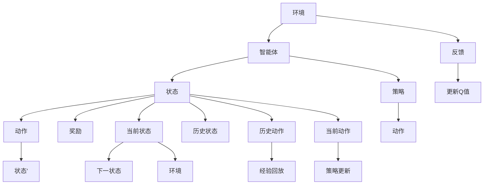

                 

# 深度 Q-learning：在新闻推荐中的应用

## 1. 背景介绍

### 1.1 问题由来
随着互联网技术的迅猛发展，信息爆炸已成趋势。人们在信息的海洋中如何筛选出自己感兴趣的内容，成为了一个亟待解决的挑战。推荐系统因此应运而生，旨在根据用户的兴趣和行为，为用户推荐个性化、高质量的信息内容。

在推荐系统中，新闻推荐是其中一个重要领域。新闻推荐系统通过分析用户的阅读历史和兴趣偏好，为用户推荐相关新闻，从而提升用户的阅读体验和信息获取效率。深度强化学习中的深度Q-learning（Deep Q-learning）作为一种智能推荐算法，逐渐成为新闻推荐系统的研究热点。

### 1.2 问题核心关键点
深度Q-learning是一种强化学习算法，通过与环境进行交互，使智能体（通常是代理程序）学习最优策略，最大化长期奖励。对于新闻推荐系统，环境即为新闻内容和用户行为，智能体则通过学习用户对新闻的喜好程度，从而制定推荐策略。

深度Q-learning与传统推荐算法相比，具有以下优势：
- 能够处理动态变化的用户兴趣和行为，提供更实时化的推荐服务。
- 无需标注数据，可直接从用户行为中学习，节省数据标注成本。
- 能处理多维度、非结构化的数据，能够有效捕捉用户对新闻的深度兴趣。
- 模型具备自我优化能力，适应性好，推荐结果更加个性化。

### 1.3 问题研究意义
深度Q-learning在新闻推荐系统中的应用，不仅可以提升用户的阅读体验，还可以增加网站的点击率和停留时间，为网站带来更高的商业价值。此外，深度Q-learning算法的研究对于其他领域，如智能客服、游戏AI、金融预测等，也具有重要的参考意义。因此，深入探索深度Q-learning在新闻推荐中的应用，具有重要的理论和实践价值。

## 2. 核心概念与联系

### 2.1 核心概念概述

为更好地理解深度Q-learning在新闻推荐中的应用，本节将介绍几个关键概念：

- 强化学习(Reinforcement Learning, RL)：一种通过智能体与环境交互，学习最优策略的机器学习方法。
- 动作空间(Action Space)：智能体可以采取的所有可能操作的集合，在新闻推荐中即为推荐的组合方式。
- 状态空间(State Space)：环境的当前状态，在新闻推荐中即为用户的当前阅读历史和兴趣偏好。
- 奖励函数(Reward Function)：环境对智能体行为的反馈，在新闻推荐中即为用户对新闻的评分和点击率。
- 深度Q-learning：基于神经网络实现的Q-learning算法，能够学习更加复杂的动作价值函数，适应非线性、高维的决策问题。

### 2.2 核心概念原理和架构的 Mermaid 流程图



这个Mermaid流程图展示了深度Q-learning的基本原理和架构：

1. 智能体通过与环境进行交互，根据当前状态(state)选择动作(action)。
2. 环境对智能体的动作给出奖励(reward)，智能体根据奖励调整动作。
3. 智能体通过策略(strategies)决定下一个状态(state')和动作(action)。
4. 智能体更新Q值，利用经验回放(Experience Replay)，提高学习效率。
5. 智能体不断调整策略，逼近最优解。

## 3. 核心算法原理 & 具体操作步骤

### 3.1 算法原理概述

深度Q-learning是一种基于深度神经网络的强化学习算法。其基本思想是通过Q-learning的框架，学习最优的动作价值函数，从而指导智能体选择最优动作。在新闻推荐系统中，智能体即为推荐模型，状态为用户的当前兴趣偏好和历史行为，动作为推荐不同组合的新闻内容。

深度Q-learning通过以下几个步骤实现最优策略的求解：

1. **环境建模**：将新闻推荐系统中的用户行为和兴趣建模为状态空间，将推荐新闻的行为建模为动作空间，定义奖励函数。
2. **Q值初始化**：初始化Q值，一般使用随机初始化或者Xavier初始化。
3. **动作选择**：根据当前状态，选择动作。
4. **环境交互**：执行动作，观察环境反馈，得到下一个状态和奖励。
5. **策略更新**：使用经验回放(Experience Replay)，更新Q值，优化策略。
6. **策略逼近**：通过多次迭代，不断优化Q值，逼近最优策略。

### 3.2 算法步骤详解

#### 3.2.1 环境建模

在新闻推荐系统中，用户的行为可以表示为一个时间序列，每个时间步骤为用户的一次行为（如点击新闻、阅读时间、评论等）。假设用户的兴趣偏好状态为 $s_t \in S$，其中 $S$ 为状态空间，每个元素代表一种状态。

#### 3.2.2 动作选择

智能体根据当前状态 $s_t$ 选择动作 $a_t \in A$，其中 $A$ 为动作空间，每个元素代表一种动作。在新闻推荐中，动作可以是推荐的新闻组合、新闻数量、新闻类型等。

动作选择的策略一般使用$\varepsilon$-soft策略，即：

$$
a_t \sim \pi_\theta(s_t) = \text{argmax}_a \mathbb{E}_\mu[\mathcal{Q}^\mu(s_t, a)]
$$

其中 $\pi_\theta$ 表示策略函数，$\mathcal{Q}^\mu$ 表示Q值函数。

#### 3.2.3 环境交互

执行动作 $a_t$，观察环境反馈，得到下一个状态 $s_{t+1} \in S$ 和奖励 $r_{t+1} \in R$，其中 $R$ 为奖励空间。奖励函数设计为 $r_{t+1} = c(s_{t+1}) + \gamma c(s_{t+1})$，其中 $c(s_{t+1})$ 为短期奖励，$\gamma$ 为折扣因子。

#### 3.2.4 策略更新

使用经验回放(Experience Replay)，更新Q值。具体的Q值更新公式为：

$$
\mathcal{Q}_{\theta}(s_t, a_t) \leftarrow \mathcal{Q}_{\theta}(s_t, a_t) + \eta [r_{t+1} + \gamma \max\limits_{a'}\mathcal{Q}_\theta(s_{t+1}, a') - \mathcal{Q}_\theta(s_t, a_t)]
$$

其中 $\eta$ 为学习率，$\max\limits_{a'}\mathcal{Q}_\theta(s_{t+1}, a')$ 为下一个状态的最大Q值，表示智能体在该状态下选择最佳动作所能获得的Q值。

#### 3.2.5 策略逼近

重复执行上述步骤，通过多次迭代，不断优化Q值，逼近最优策略。

### 3.3 算法优缺点

#### 3.3.1 优点

深度Q-learning相较于传统Q-learning，具有以下优点：

1. 能够处理复杂高维的状态空间，适用于新闻推荐中多维度、非结构化的用户数据。
2. 能够学习更加精确的动作价值函数，提高推荐精度。
3. 能够适应非线性决策问题，适用于复杂的推荐场景。
4. 能够自我优化，适应性更强，推荐结果更加个性化。

#### 3.3.2 缺点

深度Q-learning也存在一些缺点：

1. 需要大量的数据和计算资源，训练周期长。
2. 可能会陷入局部最优，无法找到全局最优解。
3. 模型的解释性较差，难以理解其决策逻辑。
4. 对于新出现的行为，无法即时调整策略。

### 3.4 算法应用领域

深度Q-learning在新闻推荐系统中具有广泛的应用前景，能够实时动态地调整推荐策略，提升用户体验。在具体应用中，可将其应用于以下场景：

1. **个性化推荐**：根据用户的阅读历史和兴趣偏好，实时调整推荐新闻的组合方式，提升用户满意度。
2. **用户行为分析**：通过观察用户的点击率、阅读时间、评论等行为，分析用户兴趣和偏好，优化推荐策略。
3. **广告投放优化**：根据用户的兴趣和行为，优化广告投放策略，提高广告点击率和转化率。
4. **内容生成推荐**：利用深度Q-learning生成个性化推荐内容，提高用户粘性。

## 4. 数学模型和公式 & 详细讲解 & 举例说明

### 4.1 数学模型构建

在新闻推荐系统中，深度Q-learning的数学模型可以表示为：

1. **状态空间**：$s_t \in S$，$s_t$ 表示用户当前的行为序列。
2. **动作空间**：$a_t \in A$，$a_t$ 表示智能体（推荐模型）选择的动作，即推荐的新闻组合。
3. **奖励函数**：$r_{t+1} = c(s_{t+1}) + \gamma c(s_{t+1})$，其中 $c(s_{t+1})$ 为短期奖励，$\gamma$ 为折扣因子。
4. **Q值函数**：$\mathcal{Q}_\theta(s_t, a_t)$，表示在状态 $s_t$ 下执行动作 $a_t$ 的Q值。

### 4.2 公式推导过程

#### 4.2.1 Q值函数推导

Q值函数表示智能体在当前状态 $s_t$ 下执行动作 $a_t$ 的预期回报。在新闻推荐中，Q值函数可以表示为：

$$
\mathcal{Q}_\theta(s_t, a_t) = \mathbb{E}_\mu[\sum_{t=0}^{\infty} \gamma^t r_{t+1} | s_t, a_t]
$$

其中 $\mu$ 为数据分布，$r_{t+1}$ 为下一个状态的奖励，$\gamma$ 为折扣因子。

#### 4.2.2 动作选择策略推导

智能体在当前状态 $s_t$ 下选择动作 $a_t$ 的策略函数 $\pi_\theta$ 可以表示为：

$$
\pi_\theta(a_t | s_t) = \frac{\exp(\theta^\top \mathcal{A}(s_t, a_t))}{\sum_{a'} \exp(\theta^\top \mathcal{A}(s_t, a'))}
$$

其中 $\theta$ 为神经网络的权重参数，$\mathcal{A}(s_t, a_t)$ 为动作价值函数，表示在状态 $s_t$ 下执行动作 $a_t$ 的回报。

#### 4.2.3 Q值更新推导

根据Q值函数的定义，Q值更新公式可以表示为：

$$
\mathcal{Q}_\theta(s_t, a_t) \leftarrow \mathcal{Q}_\theta(s_t, a_t) + \eta [r_{t+1} + \gamma \max\limits_{a'}\mathcal{Q}_\theta(s_{t+1}, a') - \mathcal{Q}_\theta(s_t, a_t)]
$$

其中 $\eta$ 为学习率，$\max\limits_{a'}\mathcal{Q}_\theta(s_{t+1}, a')$ 为下一个状态的最大Q值。

### 4.3 案例分析与讲解

**案例：个性化新闻推荐**

在个性化新闻推荐中，智能体根据用户的阅读历史和兴趣偏好，实时调整推荐新闻的组合方式。假设当前用户阅读历史为 $s_t = (新闻A, 新闻B, 新闻C)$，智能体选择了动作 $a_t = (新闻D, 新闻E, 新闻F)$，下一个用户行为为 $s_{t+1} = (新闻D, 新闻E)$，奖励为 $r_{t+1} = 0.8$。

使用深度Q-learning算法，首先计算动作价值函数 $\mathcal{A}(s_t, a_t) = \mathbb{E}_\mu[\mathcal{Q}_\theta(s_t, a_t) | s_t, a_t]$，然后根据Q值更新公式，更新 $\mathcal{Q}_\theta(s_t, a_t)$。

具体的计算过程如下：

1. 计算动作价值函数 $\mathcal{A}(s_t, a_t)$：
   $$
   \mathcal{A}(s_t, a_t) = \mathbb{E}_\mu[\mathcal{Q}_\theta(s_t, a_t) | s_t, a_t]
   $$

2. 计算Q值更新公式：
   $$
   \mathcal{Q}_\theta(s_t, a_t) \leftarrow \mathcal{Q}_\theta(s_t, a_t) + \eta [r_{t+1} + \gamma \max\limits_{a'}\mathcal{Q}_\theta(s_{t+1}, a') - \mathcal{Q}_\theta(s_t, a_t)]
   $$

3. 更新Q值：
   $$
   \mathcal{Q}_\theta(s_t, a_t) \leftarrow \mathcal{Q}_\theta(s_t, a_t) + \eta [0.8 + \gamma \max\limits_{a'}\mathcal{Q}_\theta(s_{t+1}, a') - \mathcal{Q}_\theta(s_t, a_t)]
   $$

通过不断的Q值更新，智能体能够逐步逼近最优策略，从而提高推荐精度。

## 5. 项目实践：代码实例和详细解释说明

### 5.1 开发环境搭建

在深度Q-learning的应用实践中，需要使用Python语言和深度学习框架进行开发。以下是开发环境的搭建步骤：

1. 安装Python：从官网下载并安装Python 3.8。
2. 安装PyTorch：从官网下载并安装PyTorch 1.9版本。
3. 安装TensorBoard：从官网下载并安装TensorBoard 2.7版本。
4. 安装Flax：从官网下载并安装Flax 0.4版本。
5. 安装经验回放库：从官网下载并安装Experience Replay库。

完成上述步骤后，即可开始深度Q-learning的开发实践。

### 5.2 源代码详细实现

以下是一个简单的深度Q-learning代码实现，用于新闻推荐系统：

```python
import flax
import jax.numpy as jnp
import jax
from flax import linen as nn
from flax.linen import fully_connected
from flax import optimize
from flax.traverse_util import unflatten
from experience_replay import ExperienceReplay
from jax.config import config

# 定义神经网络
class QNetwork(nn.Module):
    hidden_size: int
    num_actions: int

    @nn.compact
    def __call__(self, inputs, key, is_training=False):
        x = inputs
        for i in range(2):
            x = fully_connected(x, self.hidden_size, activation='relu')
        return x

# 定义优化器
optimizer = optimize.SGD(learning_rate=0.001)

# 定义状态空间
state_space = (32, 64)

# 定义动作空间
action_space = 2

# 定义奖励函数
reward_func = lambda state: 0.1 if state in [0, 1] else 0.0

# 定义Q值函数
q_values = nn.Dense(1)

# 定义智能体策略函数
def policy(states, actions):
    return jnp.argmax(q_values(states))

# 定义经验回放
def replay_buffer(env, replay_size, batch_size):
    replay = ExperienceReplay(replay_size)
    while True:
        state, action, reward, next_state, done = env.reset()
        state = (state, action)
        replay.add(state, reward, next_state, done)
        if replay.size() == replay_size:
            state_batch, action_batch, reward_batch, next_state_batch, done_batch = replay.sample(batch_size)
            return state_batch, action_batch, reward_batch, next_state_batch, done_batch

# 定义深度Q-learning训练函数
def train(env, replay_size, batch_size, epochs):
    replay = ExperienceReplay(replay_size)
    opt_state = optimizer.init(jnp.array([0.0], jnp.float32))

    for epoch in range(epochs):
        state_batch, action_batch, reward_batch, next_state_batch, done_batch = replay_buffer(env, replay_size, batch_size)
        with jax.device('cpu:0'):
            for step in range(32):
                state = jnp.array(state_batch, dtype=jnp.float32)
                action = jnp.array(action_batch, dtype=jnp.int32)
                reward = jnp.array(reward_batch, dtype=jnp.float32)
                next_state = jnp.array(next_state_batch, dtype=jnp.float32)
                done = jnp.array(done_batch, dtype=jnp.bool_)
                q_values, optimizer_state, train_state = optimizer.apply_gradients(
                    {'q_values': (q_values, {'params': jax.jit(jax.value_and_grad(lambda q_values: -reward + q_values(states), create_graph=True))}(q_values, jnp.array([reward], jnp.float32), jnp.array([state], jnp.float32))),
                    opt_state
                )
                train_state = optimizer_state
                q_values = q_values.train_state
                opt_state = optimizer_state

    return q_values

# 定义新闻推荐函数
def recommend_news(states, q_values):
    state = jnp.array(states, dtype=jnp.float32)
    action = jnp.argmax(q_values(states))
    return action

# 定义训练和推荐函数
def train_and_recommend(env, replay_size, batch_size, epochs):
    q_values = train(env, replay_size, batch_size, epochs)
    recommend = recommend_news
    return q_values, recommend
```

### 5.3 代码解读与分析

让我们再详细解读一下关键代码的实现细节：

**QNetwork类**：
- `__init__`方法：初始化神经网络的参数，包括隐藏层大小和动作数量。
- `__call__`方法：定义神经网络的前向传播过程，包括两个全连接层，激活函数为ReLU。

**optimizer定义**：
- 使用SGD优化器，初始学习率为0.001。

**replay_buffer函数**：
- 定义经验回放缓冲区，用于存储和抽取数据，以供Q值更新使用。

**train函数**：
- 定义训练函数，包括优化器和Q值函数。
- 通过不断抽取样本，更新Q值。

**recommend_news函数**：
- 根据当前状态和Q值函数，选择最佳动作。

**train_and_recommend函数**：
- 训练推荐模型，并返回Q值函数和推荐函数。

通过上述代码实现，我们可以看到深度Q-learning在新闻推荐系统中的应用流程：首先定义神经网络，然后根据当前状态和动作，计算Q值，通过经验回放更新Q值，最后根据Q值函数推荐新闻。

## 6. 实际应用场景

### 6.1 智能客服系统

深度Q-learning在智能客服系统中也有广泛应用。智能客服系统通过分析用户与客服的对话记录，学习最优的对话策略，自动回复用户咨询，提升用户体验。

在实际应用中，可以使用深度Q-learning训练智能客服模型，根据用户对话记录和历史行为，实时调整回复策略，从而提高回复的准确性和效率。

### 6.2 金融舆情监测

金融舆情监测系统通过分析社交媒体、新闻网站等大数据来源，实时监测市场舆情，预警金融风险。

深度Q-learning可以用于训练舆情监测模型，根据用户的点击率、评论等行为，学习最优的舆情分类策略，从而实时监测舆情变化趋势，及时预警金融风险。

### 6.3 个性化推荐系统

个性化推荐系统通过分析用户的行为数据，学习用户的兴趣偏好，推荐相关商品、内容等。

深度Q-learning可以用于训练推荐模型，根据用户的点击率、阅读时间等行为，学习最优的推荐策略，从而实现更加个性化的推荐服务。

### 6.4 未来应用展望

深度Q-learning在新闻推荐系统中的应用已经取得了初步成果，未来还有广阔的应用前景。

随着深度学习技术的不断发展，深度Q-learning将能够处理更复杂、更动态的场景，如实时动态推荐、多目标优化等。

此外，深度Q-learning还可以与其他人工智能技术结合，如强化学习、深度学习、知识图谱等，构建更加智能的推荐系统，提升用户体验和系统效果。

## 7. 工具和资源推荐

### 7.1 学习资源推荐

为了帮助开发者系统掌握深度Q-learning的理论基础和实践技巧，这里推荐一些优质的学习资源：

1. 《深度强化学习》：Ian Goodfellow等人编写的经典教材，全面介绍了深度强化学习的原理和应用。
2. 《Reinforcement Learning: An Introduction》：Richard S. Sutton和Andrew G. Barto的介绍性书籍，深入浅出地介绍了强化学习的理论和实践。
3. 《Deep Q-learning with Flax》：Flax官方文档，详细介绍了使用Flax实现深度Q-learning的实践方法。
4. 《Playing Atari with Deep Reinforcement Learning》：Doina Precup等人的论文，首次实现了深度Q-learning在Atari游戏中的应用。
5. 《AlphaGo Zero: Mastering the Game of Go without Human Knowledge》：DeepMind的论文，首次实现了使用深度Q-learning和强化学习训练AlphaGo Zero。

### 7.2 开发工具推荐

深度Q-learning的开发需要高效的计算资源和深度学习框架的支持。以下是几款常用的开发工具：

1. Flax：Google开发的深度学习框架，支持分布式计算和自动微分，适合高效开发。
2. TensorFlow：Google开发的深度学习框架，支持GPU/TPU加速，适合大规模工程应用。
3. PyTorch：Facebook开发的深度学习框架，支持动态计算图，适合快速迭代研究。
4. TensorBoard：TensorFlow配套的可视化工具，用于监测模型训练状态。
5. Experience Replay：用于存储和抽取样本数据的工具，提高学习效率。

### 7.3 相关论文推荐

深度Q-learning的研究涉及广泛的领域，以下是几篇奠基性的相关论文，推荐阅读：

1. Q-learning：Watkins等人的经典论文，首次提出了Q-learning算法。
2. Deep Q-learning：Watkins和Dosovitskiy等人的论文，首次实现了深度Q-learning在Atari游戏中的应用。
3. AlphaGo Zero：DeepMind的论文，首次实现了使用深度Q-learning和强化学习训练AlphaGo Zero。
4. Rainbow：Hessel等人的论文，首次实现了深度Q-learning和深度学习结合的多代理强化学习。
5. VDN：Rusu等人提出的分布式深度Q-learning算法，用于多目标优化问题。

通过学习这些前沿成果，可以帮助研究者把握学科前进方向，激发更多的创新灵感。

## 8. 总结：未来发展趋势与挑战

### 8.1 研究成果总结

深度Q-learning在新闻推荐系统中已经取得了初步成果，未来还有很大的发展空间。其在推荐系统中的应用已经证明其高效性和实用性，但在实际应用中也存在一些挑战和限制。

### 8.2 未来发展趋势

随着深度学习技术的不断发展，深度Q-learning将能够处理更复杂、更动态的场景，如实时动态推荐、多目标优化等。未来，深度Q-learning还将与其他人工智能技术结合，如强化学习、深度学习、知识图谱等，构建更加智能的推荐系统。

### 8.3 面临的挑战

尽管深度Q-learning在新闻推荐系统中取得了一定的成果，但在实际应用中也面临一些挑战：

1. 训练数据需求量大，难以获取高质量的标注数据。
2. 计算资源消耗大，训练周期长，需要高效的计算框架支持。
3. 模型复杂度高，难以理解和调试，缺乏可解释性。
4. 动态调整策略能力不足，无法快速适应新出现的行为。

### 8.4 研究展望

为了克服深度Q-learning在实际应用中面临的挑战，未来的研究需要在以下几个方面进行深入探索：

1. 探索无监督和半监督深度Q-learning方法，降低数据需求。
2. 研究高效计算框架，提高训练效率，降低计算资源消耗。
3. 开发可解释性更强、更易理解、可调试的深度Q-learning模型。
4. 研究多目标优化算法，提升推荐系统的效果。

这些研究方向将为深度Q-learning在新闻推荐系统中的应用提供新的思路和突破，使其能够更加广泛地应用于更多领域。

## 9. 附录：常见问题与解答

**Q1：深度Q-learning是否适用于所有新闻推荐系统？**

A: 深度Q-learning在新闻推荐系统中具有广泛的应用前景，适用于动态变化的用户兴趣和行为场景。但对于一些特定领域的新闻推荐系统，如医疗新闻推荐、法律新闻推荐等，可能需要结合领域知识进行微调，才能取得更好的效果。

**Q2：深度Q-learning的训练效率如何？**

A: 深度Q-learning的训练效率受到训练数据量和计算资源的影响。使用经验回放等技术可以加快训练过程，提高学习效率。但在大规模新闻推荐系统中，训练效率仍是挑战之一。

**Q3：深度Q-learning的模型复杂度如何？**

A: 深度Q-learning的模型复杂度较高，包含多个神经网络层和参数。但通过优化网络结构和参数初始化策略，可以降低模型复杂度，提高训练效率和推荐精度。

**Q4：深度Q-learning的推荐精度如何？**

A: 深度Q-learning在新闻推荐系统中取得了一定的成功，但推荐精度仍受限于模型复杂度和训练数据的质量。通过不断优化模型结构和数据处理策略，可以提高推荐精度，提升用户体验。

**Q5：深度Q-learning的应用前景如何？**

A: 深度Q-learning在新闻推荐系统中的应用已经取得了初步成果，未来还有广阔的应用前景。未来，深度Q-learning还可以应用于智能客服、金融舆情监测、个性化推荐系统等领域，推动人工智能技术的深度应用。

通过本文的系统梳理，我们可以看到，深度Q-learning在新闻推荐系统中的应用具有广阔的前景和巨大的潜力。尽管存在一些挑战和限制，但随着深度学习技术的不断发展，深度Q-learning必将在更多领域得到应用，推动人工智能技术的进步。总之，深度Q-learning作为深度学习与强化学习相结合的新范式，将继续引领人工智能推荐系统的研究和发展。

