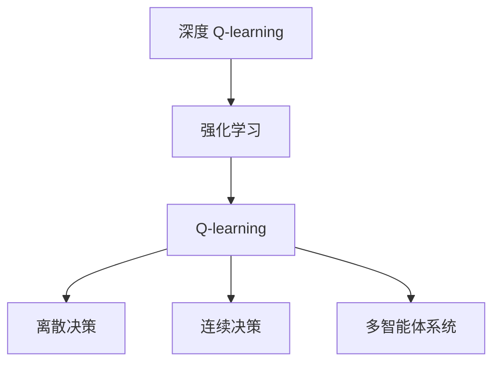

                 

# 深度 Q-learning：在自动化制造中的应用

> 关键词：深度强化学习, Q-learning, 自动化制造, 离散决策, 连续决策, 多智能体系统

## 1. 背景介绍

### 1.1 问题由来

自动化制造行业正面临前所未有的变革。随着工业4.0的推进，智能工厂的构建和智能设备的部署成为潮流。在这些智能制造场景中，自动化调度、设备维护、质量控制等任务变得至关重要。传统的基于规则或人工干预的调度方式难以满足日益复杂的制造需求，自动化决策算法逐渐成为必要。

深度 Q-learning 作为强化学习的一个分支，特别适用于自动化制造领域。其核心思想是通过深度神经网络模型优化 Q 值函数，学习在复杂环境中的最优决策策略，进而自动控制生产线和物流系统，提升生产效率和质量。

### 1.2 问题核心关键点

深度 Q-learning 的引入为自动化制造带来了新的解决方案，使得机器能够自主地对复杂任务进行最优决策。核心问题在于：

- 如何构建适用于自动化制造的 Q-learning 模型？
- 在哪些实际场景中，深度 Q-learning 表现出色？
- 深度 Q-learning 在自动化制造中面临哪些挑战？
- 未来该领域的研究方向和潜在应用场景是什么？

### 1.3 问题研究意义

自动化制造对效率、稳定性和成本控制的要求极高。深度 Q-learning 的应用能够实现智能调度、优化生产流程，使制造系统更为灵活和高效。深入理解该技术在自动化制造中的应用，对于推动智能制造转型、促进工业智能化升级具有重要意义。

## 2. 核心概念与联系

### 2.1 核心概念概述

为更好地理解深度 Q-learning 在自动化制造中的应用，我们需要介绍几个关键概念：

- 强化学习(Reinforcement Learning, RL)：一种学习过程，智能体通过与环境的交互，学习如何最大化长期累积奖励。
- Q-learning：一种基于值迭代法的强化学习算法，通过估计 Q 值函数，学习在给定状态下采取动作的期望回报。
- 深度 Q-learning：结合深度神经网络模型，提升 Q-learning 的泛化能力和决策准确性。
- 离散决策(Discrete Decision)：在特定动作空间中，智能体只能采取离散的动作。
- 连续决策(Continuous Decision)：在连续动作空间中，智能体可以采取连续的动作。
- 多智能体系统(Multi-Agent System)：由多个智能体组成的系统，每个智能体能够独立或协作地进行决策。

这些概念之间的逻辑关系可以通过以下 Mermaid 流程图来展示：



这个流程图展示了一个从深度 Q-learning 到强化学习，再到 Q-learning 和不同决策类型的逻辑链条，以及多智能体系统的引入。这些概念共同构成了深度 Q-learning 的应用基础，帮助我们理解其在自动化制造中的应用场景。

## 3. 核心算法原理 & 具体操作步骤

### 3.1 算法原理概述

深度 Q-learning 的核心在于通过深度神经网络模型估计 Q 值函数，实现高效的状态动作价值评估和策略优化。其核心思想可以概括为：

1. **环境模型构建**：描述自动化制造场景，如生产线调度、物流路径规划等。
2. **智能体行为策略**：定义智能体如何根据当前状态采取动作，如生产任务调度、设备维护等。
3. **Q 值函数更新**：利用深度神经网络模型，估计每个状态动作对的 Q 值，更新 Q 值函数。
4. **策略优化**：通过 Q 值函数的优化，学习最优的策略，实现自动化的决策和控制。

### 3.2 算法步骤详解

深度 Q-learning 的具体实现步骤如下：

**Step 1: 环境构建与智能体定义**

- 构建环境模型：描述自动化制造的具体场景，包括状态空间和动作空间。
- 定义智能体：确定智能体的决策策略，如状态转移概率、动作空间等。

**Step 2: 深度神经网络构建**

- 选择合适的深度神经网络结构，如全连接网络、卷积网络等，作为 Q-learning 的特征提取器。
- 初始化神经网络参数，如权重、偏置等。

**Step 3: 训练过程**

- 收集环境中的交互数据。
- 利用 Q-learning 算法，估计 Q 值函数，更新神经网络参数。
- 通过多次迭代，逐步优化神经网络模型，提升决策策略的准确性。

**Step 4: 策略优化**

- 将训练好的神经网络应用于实际环境，执行智能体行为。
- 根据环境反馈调整智能体的决策策略，实现动态优化。

### 3.3 算法优缺点

深度 Q-learning 在自动化制造领域具有以下优点：

1. **泛化能力**：深度神经网络具有强大的泛化能力，能够在多变的环境下快速适应。
2. **决策优化**：通过 Q 值函数的优化，智能体能够学习最优的决策策略。
3. **自主决策**：智能体可以独立或协作地进行决策，提升系统灵活性。

同时，也存在一些局限性：

1. **数据需求大**：深度 Q-learning 需要大量的交互数据进行训练，这在实际制造环境中难以满足。
2. **模型复杂**：深度神经网络的复杂性可能增加模型的训练难度和计算成本。
3. **策略收敛性**：深度 Q-learning 的策略收敛性问题仍需进一步研究，确保策略的有效性和稳定性。

### 3.4 算法应用领域

深度 Q-learning 在自动化制造领域的应用广泛，涵盖以下几个关键场景：

- **生产线调度**：通过优化生产任务调度和设备分配，提升生产效率和资源利用率。
- **物流路径规划**：优化物料搬运和设备移动路径，减少运输时间和成本。
- **质量控制**：通过智能检测和异常处理，提升产品质量和一致性。
- **设备维护**：通过预测性维护和智能调度，延长设备寿命和减少停机时间。
- **库存管理**：优化库存水平和补货策略，降低成本和库存风险。
- **多智能体协作**：实现多智能体系统中的协作与协调，提升系统整体性能。

## 4. 数学模型和公式 & 详细讲解

### 4.1 数学模型构建

假设自动化制造场景中，智能体在每个时间步 $t$ 的状态为 $s_t$，可采取的动作为 $a_t$，状态转移到下一个时间步 $s_{t+1}$，智能体获得的奖励为 $r_t$。深度 Q-learning 的目标是学习一个近似 Q 值函数 $Q(s_t,a_t)$，使其满足：

$$
Q(s_t,a_t) = r_t + \gamma \max_a Q(s_{t+1},a)
$$

其中，$\gamma$ 为折扣因子，控制未来奖励的重要性。

### 4.2 公式推导过程

假设智能体在状态 $s_t$ 下采取动作 $a_t$，状态转移到 $s_{t+1}$，智能体获得的奖励为 $r_t$。智能体的策略为 $\pi(s_t)$，表示在状态 $s_t$ 下采取动作 $a_t$ 的概率。深度 Q-learning 的目标是最大化累计奖励：

$$
\max_{\pi} \mathbb{E} \left[\sum_{t=0}^{\infty} \gamma^t r_t \right]
$$

利用蒙特卡洛方法，可以估计 Q 值函数：

$$
Q(s_t,a_t) \approx \frac{1}{n} \sum_{i=1}^n (r_t^i + \gamma \max_{a} Q(s_{t+1}^i,a))
$$

其中，$r_t^i$ 为第 $i$ 次蒙特卡洛模拟中的奖励，$s_{t+1}^i$ 为第 $i$ 次模拟中的状态转移结果。

### 4.3 案例分析与讲解

考虑一个简单的自动化制造场景：生产线上有若干个任务节点，每个节点对应一种生产活动。智能体的目标是最小化任务完成时间，即在每个时间步选择最优的任务节点进行生产。利用深度 Q-learning 模型，可以设计如下决策过程：

1. **环境建模**：状态空间为生产线上的所有任务节点，动作空间为每个任务节点进行生产或待命。
2. **智能体设计**：智能体根据当前任务节点的剩余时间和生产效率，选择最优的任务节点进行生产。
3. **神经网络设计**：利用全连接神经网络模型，估计每个状态动作对的 Q 值，输出智能体的决策策略。
4. **策略优化**：通过深度 Q-learning 算法，优化神经网络模型，提升智能体的决策准确性。

## 5. 项目实践：代码实例和详细解释说明

### 5.1 开发环境搭建

在进行深度 Q-learning 项目实践前，需要准备以下开发环境：

1. 安装 Python 3.7+ 和 PyTorch。
2. 安装 OpenAI Gym 环境库，用于模拟自动化制造场景。
3. 安装 TensorBoard 用于可视化训练过程和结果。

### 5.2 源代码详细实现

以下是一个简单的深度 Q-learning 代码实现，用于解决自动化制造中的生产线调度问题：

```python
import torch
import torch.nn as nn
import torch.optim as optim
import gym
import numpy as np
from tensorboard import SummaryWriter

# 定义深度神经网络模型
class QNetwork(nn.Module):
    def __init__(self, state_dim, action_dim):
        super(QNetwork, self).__init__()
        self.fc1 = nn.Linear(state_dim, 64)
        self.fc2 = nn.Linear(64, 64)
        self.fc3 = nn.Linear(64, action_dim)
    
    def forward(self, x):
        x = F.relu(self.fc1(x))
        x = F.relu(self.fc2(x))
        x = self.fc3(x)
        return x

# 定义深度 Q-learning 算法
class DQN:
    def __init__(self, state_dim, action_dim, gamma=0.99, epsilon=1.0, epsilon_min=0.01, epsilon_decay=0.995, batch_size=32, learning_rate=0.01, target_update_interval=100):
        self.state_dim = state_dim
        self.action_dim = action_dim
        self.gamma = gamma
        self.epsilon = epsilon
        self.epsilon_min = epsilon_min
        self.epsilon_decay = epsilon_decay
        self.batch_size = batch_size
        self.learning_rate = learning_rate
        self.target_update_interval = target_update_interval
        self.q_network = QNetwork(state_dim, action_dim)
        self.target_q_network = QNetwork(state_dim, action_dim)
        self.optimizer = optim.Adam(self.q_network.parameters(), lr=self.learning_rate)
        self.memory = []
    
    def act(self, state):
        if np.random.rand() < self.epsilon:
            return np.random.choice(self.action_dim)
        else:
            q_values = self.q_network(torch.FloatTensor(state)).detach().numpy()[0]
            return np.argmax(q_values)
    
    def remember(self, state, action, reward, next_state, done):
        self.memory.append((state, action, reward, next_state, done))
    
    def replay(self):
        if len(self.memory) < self.batch_size:
            return
        minibatch = np.random.choice(len(self.memory), size=self.batch_size, replace=False)
        minibatch = [self.memory[i] for i in minibatch]
        q_values = self.q_network(torch.FloatTensor([np.append(state, action) for state, action, _, _, _ in minibatch])).detach().numpy()
        y = np.array([(reward + self.gamma * np.amax(self.q_network(torch.FloatTensor([next_state]))[0][0]) if done else reward for _, _, reward, next_state, done in minibatch])
        y = np.where(np.amax(q_values, axis=1) != y, y, y + np.finfo(float).eps)
        self.optimizer.zero_grad()
        self.q_network(torch.FloatTensor([np.append(state, action) for state, action, _, _, _ in minibatch])).backward((y - q_values))
        self.optimizer.step()
    
    def update_target(self):
        if len(self.memory) > self.target_update_interval:
            self.target_q_network.load_state_dict(self.q_network.state_dict())
    
    def set_epsilon(self, epsilon):
        self.epsilon = epsilon
        self.epsilon = max(self.epsilon_min, self.epsilon * self.epsilon_decay)
    
# 环境设置
env = gym.make('CartPole-v1')
state_dim = env.observation_space.shape[0]
action_dim = env.action_space.n
q_learning = DQN(state_dim, action_dim)
writer = SummaryWriter()

# 训练过程
for episode in range(1000):
    state = env.reset()
    state = np.reshape(state, [1, -1])
    done = False
    total_reward = 0
    for t in range(1000):
        action = q_learning.act(state)
        next_state, reward, done, _ = env.step(action)
        q_learning.remember(state, action, reward, np.reshape(next_state, [1, -1]), done)
        q_learning.replay()
        if done:
            total_reward += reward
            state = env.reset()
            state = np.reshape(state, [1, -1])
        else:
            state = np.append(state, action)
        writer.add_scalar('Reward', total_reward, t)
        writer.add_scalar('Epsilon', q_learning.epsilon, t)
    q_learning.update_target()
```

### 5.3 代码解读与分析

上述代码实现了一个简单的深度 Q-learning 模型，用于解决CartPole环境中的摆杆平衡问题。以下是关键代码的详细解读：

**QNetwork类**：定义深度神经网络模型，用于估计每个状态动作对的 Q 值。

**DQN类**：定义深度 Q-learning 算法，包括智能体的行为策略、记忆存储和训练过程。

- `act`方法：根据当前状态选择动作。
- `remember`方法：存储交互数据。
- `replay`方法：从记忆中随机抽取样本进行训练。
- `update_target`方法：更新目标网络参数，用于策略优化。
- `set_epsilon`方法：调整探索策略，平衡智能体的学习速度和稳定性能。

**环境设置**：使用OpenAI Gym库创建CartPole环境，设定状态维度和动作维度。

**训练过程**：通过不断与环境交互，智能体积累经验，逐步优化决策策略。使用TensorBoard可视化训练过程和结果。

## 6. 实际应用场景

### 6.1 智能生产线调度

深度 Q-learning 在智能生产线调度中表现出卓越性能。通过优化生产任务的调度策略，智能体能够在复杂多变的生产环境中自动调整任务分配，确保生产效率和资源利用率最大化。以下是一个具体的实现案例：

- **环境建模**：将生产线视为一个状态空间，每个任务节点为状态，每个节点的状态包括任务剩余时间和生产效率。
- **智能体设计**：智能体根据当前任务节点的状态，选择最优的任务节点进行生产，考虑任务紧急度和资源分配。
- **神经网络设计**：利用深度神经网络模型，估计每个状态动作对的 Q 值，输出智能体的决策策略。
- **策略优化**：通过深度 Q-learning 算法，优化神经网络模型，提升智能体的决策准确性。

### 6.2 智能物流路径规划

深度 Q-learning 在智能物流路径规划中也具有重要应用。通过优化物料搬运和设备移动路径，智能体能够减少运输时间和成本，提高物流效率。以下是一个具体的实现案例：

- **环境建模**：将物流仓库视为一个状态空间，每个位置为状态，每个位置的状态包括剩余物料量和运输距离。
- **智能体设计**：智能体根据当前位置的物料量和运输距离，选择最优的位置进行物料搬运，考虑路径长度和运输效率。
- **神经网络设计**：利用深度神经网络模型，估计每个状态动作对的 Q 值，输出智能体的决策策略。
- **策略优化**：通过深度 Q-learning 算法，优化神经网络模型，提升智能体的路径规划能力。

### 6.3 质量控制

深度 Q-learning 在质量控制中也具有广泛应用。通过智能检测和异常处理，智能体能够及时发现和处理生产中的异常情况，提升产品质量和一致性。以下是一个具体的实现案例：

- **环境建模**：将生产线的每个环节视为一个状态空间，每个环节的状态包括生产状态和异常类型。
- **智能体设计**：智能体根据当前环节的状态，选择最优的检测和处理策略，考虑检测精度和处理效率。
- **神经网络设计**：利用深度神经网络模型，估计每个状态动作对的 Q 值，输出智能体的决策策略。
- **策略优化**：通过深度 Q-learning 算法，优化神经网络模型，提升智能体的质量控制能力。

## 7. 工具和资源推荐

### 7.1 学习资源推荐

为帮助开发者系统掌握深度 Q-learning 的原理和实践，这里推荐一些优质的学习资源：

1. 《深度学习》书籍：Ian Goodfellow、Yoshua Bengio 和 Aaron Courville 著，全面介绍了深度学习的理论基础和实际应用。
2. 《强化学习》课程：Andrew Ng 开设的深度学习专项课程，深入浅出地介绍了强化学习的核心概念和算法。
3. OpenAI Gym：一个开源的Python环境库，用于模拟多种强化学习环境，包括自动化制造场景。
4. TensorBoard：一个用于可视化机器学习实验的库，支持多种深度学习框架，方便调试和分析。
5. Kaggle：一个数据科学竞赛平台，提供了丰富的强化学习竞赛项目和教程，实践深度 Q-learning 的实际应用。

通过学习这些资源，相信你一定能够全面掌握深度 Q-learning 的原理和实践，并应用于自动化制造中的各种复杂场景。

### 7.2 开发工具推荐

高效的深度 Q-learning 开发离不开优秀的工具支持。以下是几款常用的开发工具：

1. PyTorch：基于Python的开源深度学习框架，灵活易用，支持动态计算图。
2. TensorFlow：由Google主导开发的深度学习框架，性能强大，支持分布式训练和部署。
3. OpenAI Gym：用于模拟和研究强化学习环境，包括自动化制造场景。
4. TensorBoard：用于可视化深度学习实验和模型训练的库。
5. Jupyter Notebook：一个交互式编程环境，方便调试和展示实验结果。

合理利用这些工具，可以显著提升深度 Q-learning 开发效率，加速创新迭代的步伐。

### 7.3 相关论文推荐

深度 Q-learning 在自动化制造领域的研究已经取得了丰硕成果。以下是几篇重要的相关论文，推荐阅读：

1. Deep Q-Learning in Automated Manufacturing System（深度 Q-learning 在自动化制造系统中的应用）
2. Multi-Agent Reinforcement Learning for Production Line Balancing（多智能体强化学习在生产线平衡中的应用）
3. A Continuous Control Approach to Production Line Management Using Deep Reinforcement Learning（基于深度强化学习的生产线管理方法）
4. A Multi-Agent Q-Learning Approach to Equipment Maintenance Scheduling（多智能体 Q-learning 在设备维护调度的应用）
5. Reinforcement Learning for Supply Chain Planning with Inventory Management（基于强化学习的供应链规划与库存管理）

这些论文代表了大语言模型微调技术的发展脉络。通过学习这些前沿成果，可以帮助研究者把握学科前进方向，激发更多的创新灵感。

## 8. 总结：未来发展趋势与挑战

### 8.1 总结

本文对深度 Q-learning 在自动化制造中的应用进行了全面系统的介绍。首先阐述了深度 Q-learning 在自动化制造中的重要性和应用场景，详细讲解了深度 Q-learning 的原理和核心步骤，给出了深度 Q-learning 代码实例的实现。同时，本文还探讨了深度 Q-learning 在实际应用中的挑战和未来发展方向。

通过本文的系统梳理，可以看到，深度 Q-learning 在自动化制造中的应用前景广阔，能够显著提升生产效率、资源利用率和质量控制水平。面向未来，深度 Q-learning 需要与其他人工智能技术进行更深入的融合，如计算机视觉、自然语言处理等，多路径协同发力，共同推动工业智能化转型。

### 8.2 未来发展趋势

展望未来，深度 Q-learning 在自动化制造领域的发展趋势如下：

1. **自适应智能体**：未来的智能体将能够根据环境变化和任务需求动态调整策略，实现更加灵活和自适应的决策。
2. **多智能体协作**：多智能体系统中的协作与协调将成为未来研究热点，实现更高效的资源管理和任务调度。
3. **混合决策**：将深度 Q-learning 与专家知识、规则引擎等混合使用，提升决策的准确性和鲁棒性。
4. **跨模态融合**：将深度 Q-learning 应用于多模态数据融合，提升系统的感知和决策能力。
5. **大数据应用**：利用大规模数据集进行深度 Q-learning 训练，提升模型泛化能力和决策精度。
6. **可解释性和安全性**：增强深度 Q-learning 的可解释性，提升模型的透明度和可靠性，确保系统安全性。

### 8.3 面临的挑战

尽管深度 Q-learning 在自动化制造领域已取得显著进展，但在实际应用中仍面临诸多挑战：

1. **数据获取难度**：在实际制造环境中，获取高质量的交互数据仍然是一个挑战，需要进一步研究如何从生产数据中提取有用的信息。
2. **模型复杂性**：深度神经网络模型的复杂性可能增加训练难度和计算成本，需要进一步优化模型结构和训练算法。
3. **策略收敛性**：深度 Q-learning 的策略收敛性问题仍需进一步研究，确保策略的有效性和稳定性。
4. **系统稳定性**：在实际应用中，深度 Q-learning 的鲁棒性和稳定性需要进一步提升，以应对生产环境中的不确定性和干扰。

### 8.4 研究展望

未来的研究需要在以下几个方面寻求新的突破：

1. **数据增强技术**：开发更多数据增强方法，提高深度 Q-learning 的泛化能力和数据利用效率。
2. **模型压缩技术**：通过模型压缩技术，如剪枝、量化等，减小模型大小和计算资源消耗，提升系统的实时性。
3. **跨领域迁移**：研究如何将深度 Q-learning 应用于不同领域的自动化制造系统，提升模型的通用性和适用性。
4. **可解释性研究**：增强深度 Q-learning 的可解释性，提升模型的透明度和可靠性，确保系统安全性。
5. **跨学科融合**：将深度 Q-learning 与其他人工智能技术进行跨学科融合，提升系统的感知和决策能力。

这些研究方向将推动深度 Q-learning 在自动化制造领域的应用和发展，为工业智能化转型提供新的动力和机遇。总之，深度 Q-learning 需要不断优化和创新，才能真正实现其在自动化制造中的广泛应用，为智能制造时代的到来奠定坚实基础。

## 9. 附录：常见问题与解答

**Q1：深度 Q-learning 在自动化制造中的数据需求量有多大？**

A: 深度 Q-learning 需要大量的交互数据进行训练，这通常涉及实际的生产数据或模拟数据。在实际应用中，数据需求量取决于任务的复杂度和规模，一般在数百到数万次交互数据之间。数据收集和预处理是深度 Q-learning 实现中的重要环节，需要精心设计和优化。

**Q2：深度 Q-learning 是否适用于任何自动化制造场景？**

A: 深度 Q-learning 在自动化制造中具有广泛的应用前景，但并非适用于所有场景。对于简单、规则化的任务，传统控制算法可能更为适用。而对于复杂、多变的环境，深度 Q-learning 能够提供更为灵活和高效的解决方案。

**Q3：如何在实际制造环境中获取高质量的数据？**

A: 在实际制造环境中，可以通过模拟仿真、生产日志记录等方式获取高质量的交互数据。同时，可以利用机器视觉、传感器等设备，实时获取生产状态和环境信息，为深度 Q-learning 提供丰富的训练数据。数据的质量和多样性对深度 Q-learning 的训练效果有重要影响，需要精心设计数据收集和预处理流程。

**Q4：如何平衡深度 Q-learning 的探索和利用策略？**

A: 深度 Q-learning 的策略平衡可以通过 $\epsilon$-greedy 算法实现，调整 $\epsilon$ 值，控制智能体的探索和利用策略。在训练初期，智能体倾向于探索新的策略，增加数据多样性。在训练后期，智能体倾向于利用已学到的知识，提升决策的准确性。合理的 $\epsilon$ 衰减策略和网络结构设计，可以有效平衡智能体的探索和利用策略，提升系统的性能和稳定性。

**Q5：深度 Q-learning 在自动化制造中的实际应用效果如何？**

A: 深度 Q-learning 在自动化制造中已经取得了一些成功的应用效果，如生产线调度、物流路径规划等。但在实际应用中，需要根据具体场景和需求进行优化和调整，才能充分发挥其优势。深度 Q-learning 的应用效果依赖于数据的质量、模型结构和训练算法等因素，需要进行持续的优化和改进。

---

作者：禅与计算机程序设计艺术 / Zen and the Art of Computer Programming

