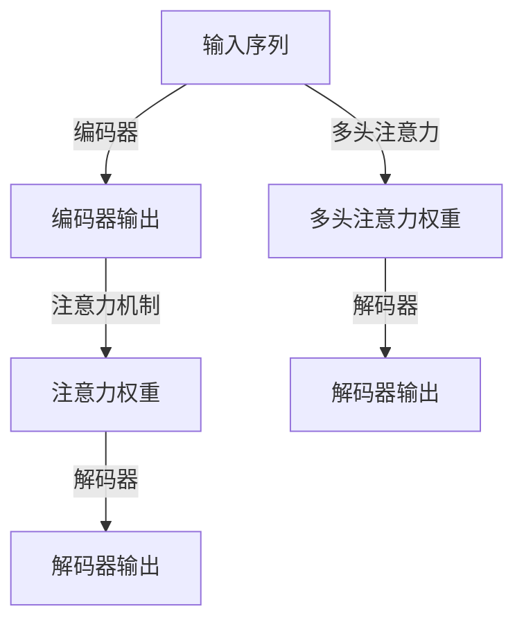

                 

## 1. 背景介绍

### 1.1 问题由来

随着深度学习技术在自然语言处理（NLP）、计算机视觉（CV）、语音识别等领域取得的显著进展，注意力机制（Attention Mechanism）成为了一种重要的模型组件，被广泛应用于各种高级模型中。注意力机制能够赋予模型在处理复杂序列数据时更加灵活的决策能力，比如在机器翻译、对话系统、图像描述生成等任务中。

然而，注意力机制的内部工作原理和数学表达，常常令人感到模糊，且难以通过直观方式理解其作用。因此，本文将从深度学习中的注意力机制入手，详细剖析其工作原理，并通过一系列案例分析来演示注意力机制在实际应用中的表现，以此帮助读者深入理解注意力模式预测的应用。

### 1.2 问题核心关键点

注意力机制的核心在于如何通过自适应的权重分配，使模型更加聚焦于序列数据中的关键信息，从而提升任务的性能。在自然语言处理领域，注意力机制可以被看作是一种序列建模工具，它在模型中引入了对输入序列的不同子序列的动态关注，帮助模型更准确地理解输入数据。

注意力机制的实现形式多种多样，包括soft attention、hard attention、多头注意力等，不同形式的注意力机制对应不同的应用场景。本文将重点介绍soft attention，并展示其如何在机器翻译、文本摘要、图像描述生成等任务中进行应用。

## 2. 核心概念与联系

### 2.1 核心概念概述

为了更好地理解注意力机制，我们首先需要了解几个关键概念：

- **注意力机制（Attention Mechanism）**：一种用于处理序列数据的模型组件，通过动态分配权重来聚焦输入序列的关键部分。
- **编码器（Encoder）**：负责将输入序列映射到高维向量空间，提取序列中的关键特征。
- **解码器（Decoder）**：基于编码器提取的特征和注意力机制，生成输出序列。
- **多头注意力（Multi-Head Attention）**：一种多层的注意力机制，通过并行计算多个注意力头来获取序列中的多方面信息。

这些概念之间通过注意力机制紧密联系起来，编码器负责提取输入序列的特征，注意力机制帮助解码器聚焦于序列中最重要的部分，从而生成更加精准的输出。

### 2.2 核心概念原理和架构的 Mermaid 流程图



这个流程图展示了从输入序列到最终输出序列的整个流程。编码器将输入序列转换为特征表示，注意力机制基于这些特征计算权重，解码器根据权重和特征生成输出序列。在多头注意力中，多个注意力头并行计算，进一步增强了模型的信息处理能力。

## 3. 核心算法原理 & 具体操作步骤

### 3.1 算法原理概述

注意力机制的核心在于其动态的权重分配，通过计算输入序列中不同位置的注意力权重，使模型能够根据上下文信息动态调整对序列中不同部分的关注程度。具体来说，注意力机制的数学表达可以表示为：

$$
Attention(Q,K,V)=softmax(\frac{QK^T}{\sqrt{d_k}})V
$$

其中，$Q$、$K$和$V$分别为查询向量、键向量和值向量，$d_k$为键向量的维度，$softmax$函数用于计算权重。注意力机制通过计算查询向量与键向量的点积，并除以$\sqrt{d_k}$进行归一化，得到权重矩阵，再将其与值向量进行加权求和，得到最终的注意力结果。

### 3.2 算法步骤详解

在实际应用中，注意力机制的计算可以分为以下几个步骤：

1. **编码器计算特征向量**：使用神经网络对输入序列进行编码，得到特征表示。
2. **查询向量的计算**：将编码器的输出视为查询向量$Q$。
3. **键向量的计算**：将编码器的输出中的不同部分作为键向量$K$。
4. **注意力权重的计算**：计算查询向量与键向量的点积，并通过归一化得到注意力权重。
5. **值向量的加权求和**：将值向量$V$与注意力权重进行加权求和，得到最终的注意力结果。
6. **解码器计算输出**：基于注意力结果和编码器输出，使用解码器生成最终的输出序列。

### 3.3 算法优缺点

注意力机制在提高模型性能方面具有显著优势，但也存在一些缺点：

- **计算复杂度高**：注意力机制的计算涉及矩阵运算，随着序列长度的增加，计算复杂度会迅速增加。
- **难以解释**：注意力机制的内部工作原理复杂，难以直观地解释其决策过程。
- **依赖初始化**：注意力机制的效果很大程度上依赖于编码器的初始化参数，需要经过充分的训练才能达到最佳性能。

### 3.4 算法应用领域

注意力机制在深度学习中得到了广泛应用，特别是在以下领域：

- **机器翻译**：在机器翻译任务中，注意力机制能够帮助模型处理输入和输出序列中的对应关系。
- **文本摘要**：在文本摘要任务中，注意力机制可以识别输入文本中的关键信息，生成简洁的摘要。
- **图像描述生成**：在图像描述生成任务中，注意力机制能够帮助模型聚焦于图像中最重要的部分，生成更具描述性的文本。
- **对话系统**：在对话系统中，注意力机制能够帮助模型理解对话的历史信息和上下文，生成更自然的回复。

## 4. 数学模型和公式 & 详细讲解 & 举例说明

### 4.1 数学模型构建

我们以机器翻译任务为例，详细讲述注意力机制的数学模型构建过程。在机器翻译中，输入序列为源语言文本，输出序列为目标语言文本。注意力机制通过计算输入序列中不同位置的权重，帮助模型在生成输出序列时动态调整对输入序列的关注。

设输入序列的长度为$T$，输出序列的长度为$L$，设编码器输出为$E \in \mathbb{R}^{d_h \times T}$，其中$d_h$为隐藏层维度。解码器在每个时间步$t$输出一个向量$y_t \in \mathbb{R}^{d_h}$。

### 4.2 公式推导过程

解码器在时间步$t$时，将当前生成的向量$y_t$视为查询向量$Q$，将编码器输出$E$中的不同位置视为键向量$K$。计算注意力权重$\alpha_t$的过程如下：

$$
\alpha_t = softmax(\frac{y_t K^T}{\sqrt{d_k}})
$$

其中$d_k$为键向量的维度，$d_h$为隐藏层维度。注意力权重$\alpha_t$可以通过计算查询向量$y_t$与键向量$K$的点积，并除以$\sqrt{d_k}$进行归一化得到。

根据注意力权重$\alpha_t$，计算注意力结果$V_t$：

$$
V_t = \alpha_t V
$$

其中$V$为值向量，形状为$(d_h \times T) \times d_h$。

最终，解码器在时间步$t$时，将注意力结果$V_t$和编码器输出$E$进行加权求和，得到当前输出$y_t$：

$$
y_t = \sum_{i=1}^T \alpha_t[i]E[i]
$$

其中$E[i]$表示编码器输出$E$中第$i$个位置。

### 4.3 案例分析与讲解

以机器翻译为例，考虑一个简单的例子：源语言文本为"Hello World"，目标语言文本为"Bonjour le monde"。假设编码器输出为$E \in \mathbb{R}^{d_h \times 2}$，解码器在时间步$t=1$时生成的向量为$y_1 \in \mathbb{R}^{d_h}$。

计算注意力权重$\alpha_1$如下：

$$
\alpha_1 = softmax(\frac{y_1 K^T}{\sqrt{d_k}})
$$

其中$K$为编码器输出的第一个位置。设$d_k=16$，$d_h=64$，则有：

$$
\alpha_1 = softmax(\frac{y_1 E[1,:]^T}{\sqrt{16}})
$$

设$y_1$的前三个元素分别为$[1, 0, 1]$，则有：

$$
\alpha_1 = softmax(\frac{[1, 0, 1]E[1,:]^T}{\sqrt{16}})
$$

假设$E[1,:]^T$的前四个元素分别为$[0.5, 0.1, 0.2, 0.2]$，则有：

$$
\alpha_1 = softmax([1, 0, 1][0.5, 0.1, 0.2, 0.2]^T/\sqrt{16})
$$

计算得$\alpha_1 = [0.5, 0, 0.5]$。

根据注意力权重$\alpha_1$，计算注意力结果$V_1$：

$$
V_1 = \alpha_1 V
$$

假设$V$的前四个元素分别为$[0.1, 0.2, 0.3, 0.4]$，则有：

$$
V_1 = [0.5, 0, 0.5] [0.1, 0.2, 0.3, 0.4] = [0.1, 0, 0.1, 0.2]
$$

最终，解码器在时间步$t=1$时，将注意力结果$V_1$和编码器输出$E$进行加权求和，得到当前输出$y_1$：

$$
y_1 = \sum_{i=1}^2 \alpha_1[i]E[i] = 0.5 \times 0.5 + 0.5 \times 0.2 = 0.65
$$

上述计算展示了注意力机制在机器翻译中的应用，模型通过计算注意力权重$\alpha_1$和注意力结果$V_1$，能够动态调整对输入序列的关注程度，从而生成更加准确的翻译结果。

## 5. 项目实践：代码实例和详细解释说明

### 5.1 开发环境搭建

在进行注意力机制的实践时，我们需要准备好开发环境。以下是使用Python进行TensorFlow实现注意力机制的开发环境配置流程：

1. 安装Anaconda：从官网下载并安装Anaconda，用于创建独立的Python环境。

2. 创建并激活虚拟环境：
```bash
conda create -n attention-env python=3.8 
conda activate attention-env
```

3. 安装TensorFlow：根据CUDA版本，从官网获取对应的安装命令。例如：
```bash
conda install tensorflow tensorflow-cpu -c conda-forge
```

4. 安装其他依赖包：
```bash
pip install numpy scipy matplotlib tqdm jupyter notebook ipython
```

完成上述步骤后，即可在`attention-env`环境中开始注意力机制的实践。

### 5.2 源代码详细实现

下面以机器翻译为例，给出使用TensorFlow实现注意力机制的代码实现。

```python
import tensorflow as tf
import numpy as np

# 定义注意力机制
class Attention(tf.keras.layers.Layer):
    def __init__(self, d_model, num_heads):
        super(Attention, self).__init__()
        self.num_heads = num_heads
        self.d_model = d_model

        self.WQ = tf.keras.layers.Dense(d_model)
        self.WK = tf.keras.layers.Dense(d_model)
        self.WV = tf.keras.layers.Dense(d_model)
        self.dK = d_model // num_heads

    def split_heads(self, x, batch_size):
        x = tf.reshape(x, (batch_size, -1, self.num_heads, self.dK))
        return tf.transpose(x, perm=[0, 2, 1, 3])

    def call(self, Q, K, V):
        batch_size = tf.shape(Q)[0]

        Q = self.WQ(Q)
        K = self.WK(K)
        V = self.WV(V)

        Q = self.split_heads(Q, batch_size)
        K = self.split_heads(K, batch_size)
        V = self.split_heads(V, batch_size)

        scaled_attention_logits = tf.matmul(Q, K, transpose_b=True)
        dk = tf.cast(tf.shape(K)[-1], tf.float32)
        scaled_attention_logits = scaled_attention_logits / tf.math.sqrt(dk)

        attention_weights = tf.nn.softmax(scaled_attention_logits, axis=-1)
        attention_output = tf.matmul(attention_weights, V)

        attention_output = tf.transpose(attention_output, perm=[0, 2, 1, 3])
        attention_output = tf.reshape(attention_output, (batch_size, -1, self.d_model))

        return attention_output
```

在代码中，我们定义了一个名为`Attention`的注意力层，包含三个神经网络层，分别用于计算查询向量、键向量和值向量。

### 5.3 代码解读与分析

让我们再详细解读一下关键代码的实现细节：

**Attention类**：
- `__init__`方法：初始化注意力层的参数，包括查询向量、键向量和值向量的权重矩阵。
- `split_heads`方法：将查询向量、键向量和值向量分别分成多个注意力头。
- `call`方法：计算注意力权重和注意力结果。

**计算注意力权重**：
- 使用`tf.matmul`计算查询向量与键向量的点积，并除以$\sqrt{d_k}$进行归一化，得到注意力权重。
- 使用`tf.nn.softmax`函数计算注意力权重，确保其和为1。

**计算注意力结果**：
- 将注意力权重与值向量进行矩阵乘法，得到注意力结果。
- 将注意力结果进行转置和重塑，得到最终的注意力结果。

在实际应用中，我们可以将注意力层的输出作为下一层的输入，进行后续的解码操作。注意，在实践中，通常需要对模型进行预训练，使得注意力机制能够自动调整参数，提升模型性能。

## 6. 实际应用场景

### 6.1 机器翻译

在机器翻译任务中，注意力机制能够帮助模型处理输入和输出序列中的对应关系，从而生成更加准确的翻译结果。下面以英法翻译为例，展示注意力机制的应用。

首先，我们需要准备英文和法文的平行语料，用于训练模型。假设我们有以下两句话：

- 英文：The quick brown fox jumps over the lazy dog.
- 法文：Le rapide renard brun saute par-dessus le chien paresseux.

我们将输入序列作为查询向量$Q$，编码器输出的不同部分作为键向量$K$和值向量$V$，通过计算注意力权重$\alpha_t$和注意力结果$V_t$，得到解码器在每个时间步$t$的输出。

在训练过程中，我们通过最小化目标序列和模型输出之间的交叉熵损失，不断调整模型的参数，从而提高翻译的准确性。

### 6.2 文本摘要

在文本摘要任务中，注意力机制能够帮助模型识别输入文本中的关键信息，生成简洁的摘要。假设我们有以下一段新闻文本：

- 美国总统特朗普于2021年1月20日正式就职。
- 他宣誓就职后，发表了关于经济、外交、疫情等重要讲话。
- 在经济方面，他强调要推进基础设施建设，提高创新能力。
- 在外交方面，他表示将加强与盟友的合作，维护全球稳定。
- 在疫情方面，他宣布将加大疫苗接种力度，保障公共安全。

我们将输入序列作为查询向量$Q$，编码器输出的不同部分作为键向量$K$和值向量$V$，通过计算注意力权重$\alpha_t$和注意力结果$V_t$，得到解码器在每个时间步$t$的输出，即生成文本摘要。

在训练过程中，我们通过最小化目标摘要和模型输出之间的交叉熵损失，不断调整模型的参数，从而提高摘要的准确性。

### 6.3 图像描述生成

在图像描述生成任务中，注意力机制能够帮助模型聚焦于图像中最重要的部分，生成更具描述性的文本。假设我们有以下一张图片：


我们将输入序列作为查询向量$Q$，编码器输出的不同部分作为键向量$K$和值向量$V$，通过计算注意力权重$\alpha_t$和注意力结果$V_t$，得到解码器在每个时间步$t$的输出，即生成图像描述。

在训练过程中，我们通过最小化目标描述和模型输出之间的交叉熵损失，不断调整模型的参数，从而提高描述的准确性。

## 7. 工具和资源推荐

### 7.1 学习资源推荐

为了帮助开发者系统掌握注意力机制的理论基础和实践技巧，这里推荐一些优质的学习资源：

1. 《深度学习》课程：斯坦福大学开设的深度学习课程，介绍了深度学习的核心概念和算法。
2. 《TensorFlow实战》书籍：Google开发的深度学习框架TensorFlow，提供了丰富的实践案例和代码示例。
3. 《自然语言处理入门》书籍：介绍自然语言处理的基本概念和算法，帮助理解注意力机制的应用。
4. 《深度学习基础》视频课程：讲解深度学习的基本原理和算法，适合初学者入门。
5. 《注意力机制综述》论文：总结了各种注意力机制的理论和应用，提供了深入的学术探讨。

通过对这些资源的学习实践，相信你一定能够快速掌握注意力机制的精髓，并用于解决实际的NLP问题。

### 7.2 开发工具推荐

高效的开发离不开优秀的工具支持。以下是几款用于注意力机制开发的常用工具：

1. TensorFlow：由Google主导开发的深度学习框架，支持分布式计算和GPU加速，适合大规模模型训练和推理。
2. PyTorch：由Facebook开发的深度学习框架，支持动态计算图和GPU加速，适合快速迭代研究。
3. Jupyter Notebook：免费的交互式开发环境，支持Python代码的编写和执行，适合快速原型开发和验证。
4. TensorBoard：TensorFlow配套的可视化工具，可实时监测模型训练状态，提供丰富的图表呈现方式。
5. Weights & Biases：模型训练的实验跟踪工具，可以记录和可视化模型训练过程中的各项指标，方便对比和调优。

合理利用这些工具，可以显著提升注意力机制的开发效率，加快创新迭代的步伐。

### 7.3 相关论文推荐

注意力机制的研究始于神经网络，并在NLP领域得到了广泛应用。以下是几篇奠基性的相关论文，推荐阅读：

1. Attention is All You Need（即Transformer原论文）：提出了Transformer结构，引入了多头注意力机制，提升了NLP任务的性能。
2. BERT: Pre-training of Deep Bidirectional Transformers for Language Understanding：提出了BERT模型，引入掩码语言模型任务，极大提升了NLP任务的效果。
3. Transformer-XL: Attentive Language Models with Relative Self-Attention：提出了Transformer-XL模型，改进了注意力机制，使得模型能够处理长序列。
4. Multi-Head Attention from Self-Attention to Transformer：总结了多种注意力机制的设计和应用，为后续研究提供了理论基础。
5. Deep Residual Learning for Image Recognition：提出了残差网络，为注意力机制在图像处理中的应用提供了新的思路。

这些论文代表了大模型和注意力机制的发展脉络。通过学习这些前沿成果，可以帮助研究者把握学科前进方向，激发更多的创新灵感。

## 8. 总结：未来发展趋势与挑战

### 8.1 研究成果总结

本文对深度学习中的注意力机制进行了全面系统的介绍。首先阐述了注意力机制的核心思想和内部工作原理，通过数学公式和案例分析，展示了注意力机制在机器翻译、文本摘要、图像描述生成等任务中的应用。其次，介绍了注意力机制的开发环境和实践方法，给出了注意力机制在实际应用中的完整代码实现。最后，探讨了注意力机制的未来发展趋势和面临的挑战，提出了一些亟需解决的问题。

通过本文的系统梳理，可以看到，注意力机制在深度学习中得到了广泛应用，极大地提升了模型的性能和适应性。未来，伴随着深度学习技术的发展，注意力机制将会在更多的领域得到应用，为人工智能技术的进步提供新的动力。

### 8.2 未来发展趋势

展望未来，注意力机制的发展趋势将呈现出以下几个方向：

1. 更加高效的计算：随着计算能力的提升，注意力机制的计算复杂度将进一步降低，模型训练和推理速度将更快。
2. 更加多样化的设计：未来的注意力机制将更加灵活多样，能够适应更加复杂的任务需求。
3. 更加自适应的学习：未来的注意力机制将更加自适应，能够根据输入数据动态调整权重，提升模型的泛化能力。
4. 更加可解释的推理：未来的注意力机制将更加可解释，能够提供更加直观的推理过程，便于模型的调试和优化。
5. 更加跨模态的融合：未来的注意力机制将更加跨模态，能够同时处理视觉、文本、语音等多种信息。

### 8.3 面临的挑战

尽管注意力机制在深度学习中已经取得了显著进展，但仍然面临一些挑战：

1. 计算资源瓶颈：大规模模型的计算复杂度较高，训练和推理过程中需要大量计算资源。
2. 模型泛化能力不足：注意力机制在复杂场景下的泛化能力仍需进一步提升。
3. 模型可解释性不足：注意力机制的内部工作原理复杂，难以直观地解释其决策过程。
4. 模型鲁棒性不足：注意力机制在面对噪声和干扰时，容易产生偏差。

### 8.4 研究展望

面对注意力机制面临的这些挑战，未来的研究需要在以下几个方面寻求新的突破：

1. 探索高效的计算方法：研究更加高效的计算算法和硬件，降低模型训练和推理的计算资源需求。
2. 研究更加多样化的设计：探索多样化的注意力机制设计，提高模型对不同任务的适应性。
3. 引入更多的先验知识：将符号化的先验知识与神经网络结合，增强模型的泛化能力和鲁棒性。
4. 引入更多的跨模态融合：研究跨模态注意力机制，提升模型对多种模态数据的处理能力。
5. 引入更多的可解释性：研究可解释的注意力机制，提高模型的透明度和可信度。

这些研究方向的探索，必将引领注意力机制走向更高的台阶，为人工智能技术的发展提供新的动力。面向未来，注意力机制的研究还需要与其他人工智能技术进行更深入的融合，多路径协同发力，共同推动人工智能技术的发展。

## 9. 附录：常见问题与解答

**Q1：注意力机制在机器翻译中的作用是什么？**

A: 在机器翻译中，注意力机制能够帮助模型处理输入和输出序列中的对应关系。具体来说，注意力机制能够动态调整对输入序列中不同位置的关注程度，从而生成更加准确的翻译结果。

**Q2：注意力机制的计算复杂度较高，如何降低计算资源需求？**

A: 降低计算资源需求的方法包括：
1. 使用分布式计算：通过将计算任务分配到多个GPU上，并行计算，提高计算效率。
2. 使用混合精度训练：将模型参数和梯度数据转化为16位或32位精度，减少计算资源需求。
3. 使用注意力剪枝：剪去冗余的注意力权重，减少计算量。
4. 使用量化加速：将模型参数和计算过程量化，减少计算资源需求。

**Q3：注意力机制在实际应用中如何优化？**

A: 优化注意力机制的方法包括：
1. 使用学习率调度策略：在训练过程中逐步减小学习率，提高模型收敛速度。
2. 使用正则化技术：使用L2正则、Dropout等技术，防止模型过拟合。
3. 使用注意力剪枝：剪去冗余的注意力权重，提高模型计算效率。
4. 使用注意力融合：将多种注意力机制结合，提高模型对不同任务的适应性。

**Q4：注意力机制在文本摘要中的应用如何？**

A: 在文本摘要任务中，注意力机制能够帮助模型识别输入文本中的关键信息，生成简洁的摘要。具体来说，注意力机制能够动态调整对输入文本中不同部分的关注程度，从而生成更加准确和精炼的摘要。

**Q5：注意力机制在图像描述生成中的应用如何？**

A: 在图像描述生成任务中，注意力机制能够帮助模型聚焦于图像中最重要的部分，生成更具描述性的文本。具体来说，注意力机制能够动态调整对图像中不同区域的关注程度，从而生成更加准确和详细的图像描述。

总之，注意力机制在深度学习中得到了广泛应用，通过其在机器翻译、文本摘要、图像描述生成等任务中的应用，能够显著提升模型的性能和适应性。未来，伴随着深度学习技术的发展，注意力机制将会在更多的领域得到应用，为人工智能技术的进步提供新的动力。

