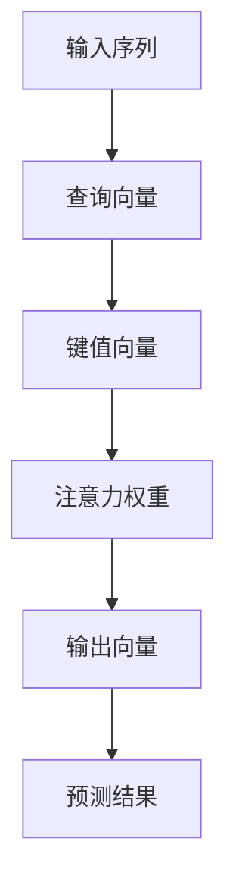

                 

## 1. 背景介绍

在深度学习领域，注意力机制（Attention Mechanism）已经成为了一个核心技术。它最初是在机器翻译任务中提出的，用来解决长距离依赖问题。随着时间的推移，注意力机制已经被广泛应用于多种任务中，如计算机视觉、自然语言处理（NLP）、语音识别等。在深度学习中，注意力机制是指在计算某个元素的输出时，能够动态地对输入中的其他元素进行加权处理，从而实现对输入的筛选和重要性的分配。

在注意力预测中，我们可以将其看作是在序列建模任务中，对当前位置的信息和历史位置的信息进行加权，从而得到对当前位置的预测。这种机制能够帮助我们更好地处理序列数据，使得模型能够自动地聚焦于对当前位置预测有帮助的输入信息。

## 2. 核心概念与联系

### 2.1 核心概念概述

在介绍注意力预测的核心概念之前，我们先简要了解一下注意力机制的基本原理。

#### 2.1.1 注意力机制的基本原理

注意力机制的核心是自注意力（Self-Attention），它是一种基于向量空间的注意力机制，通常用于处理序列数据。自注意力通过计算输入序列中每个元素与自身和其他元素之间的相似度，来确定每个元素的重要性。在计算过程中，系统会维护一个注意力权重向量，该向量的值表示每个元素的重要性。然后，系统会使用这些权重来加权处理输入序列中的各个元素，从而得到对当前位置的预测。

自注意力机制可以被视为是一种对输入序列中的各个元素进行加权平均的过程，其中权重是依据元素之间的相似度计算得到的。具体来说，在计算当前位置的输出时，系统会使用一个查询向量（Query）和一个键值向量（Key and Value）来计算注意力权重。查询向量通常是从当前位置得到的，而键值向量是从输入序列中所有位置得到的。注意力权重计算完成后，系统会使用这些权重来加权处理键值向量，从而得到当前位置的输出。

#### 2.1.2 注意力预测

在注意力预测中，我们通常会使用自注意力机制来计算输入序列中每个位置的重要性，从而得到对当前位置的预测。具体来说，系统会使用一个查询向量（Query）和一个键值向量（Key and Value）来计算注意力权重。查询向量通常是从当前位置得到的，而键值向量是从输入序列中所有位置得到的。注意力权重计算完成后，系统会使用这些权重来加权处理键值向量，从而得到当前位置的输出。

这种机制的好处是，它可以帮助模型自动地聚焦于对当前位置预测有帮助的输入信息。对于序列建模任务，注意力机制可以使得模型更好地处理长距离依赖问题，从而提升模型的性能。

### 2.2 核心概念原理和架构的 Mermaid 流程图

下面是一个简单的 Mermaid 流程图，展示了注意力预测的核心流程：



在这个流程图中，我们首先计算输入序列中每个位置的查询向量，然后计算输入序列中所有位置的键值向量。接着，我们计算注意力权重，最后使用这些权重来加权处理键值向量，从而得到当前位置的输出向量。最终，我们可以使用这个输出向量来计算当前位置的预测结果。

## 3. 核心算法原理 & 具体操作步骤

### 3.1 算法原理概述

注意力预测的算法原理可以分为以下几个步骤：

1. **计算查询向量**：从当前位置得到一个查询向量。
2. **计算键值向量**：从输入序列中所有位置得到一个键值向量。
3. **计算注意力权重**：使用查询向量和键值向量计算注意力权重。
4. **计算输出向量**：使用注意力权重加权处理键值向量，得到当前位置的输出向量。
5. **计算预测结果**：使用当前位置的输出向量计算预测结果。

下面，我们将依次介绍这些步骤的详细步骤。

### 3.2 算法步骤详解

#### 3.2.1 计算查询向量

查询向量通常是使用当前位置的表示来计算的。在实践中，我们通常会使用一个全连接层（Fully Connected Layer）来计算查询向量。具体来说，假设当前位置的表示为 $h_t$，那么查询向量可以通过下面的公式计算得到：

$$
q_t = W_q h_t
$$

其中，$W_q$ 是一个可学习的权重矩阵，用于将当前位置的表示 $h_t$ 转换为查询向量。

#### 3.2.2 计算键值向量

键值向量是从输入序列中所有位置得到的。在实践中，我们通常会使用一个全连接层（Fully Connected Layer）来计算键值向量。具体来说，假设输入序列中的第 $t$ 个位置的表示为 $h_t$，那么键值向量可以通过下面的公式计算得到：

$$
k_t = W_k h_t
$$

$$
v_t = W_v h_t
$$

其中，$W_k$ 和 $W_v$ 分别是用于将输入序列中的表示转换为键向量和值向量的权重矩阵。

#### 3.2.3 计算注意力权重

注意力权重是通过计算查询向量和键值向量之间的相似度得到的。具体来说，假设当前位置的查询向量为 $q_t$，输入序列中的第 $t'$ 个位置的键向量为 $k_{t'}$，那么注意力权重可以通过下面的公式计算得到：

$$
\alpha_{t'} = \frac{\exp(\mathrm{softmax}(q_t k_{t'}^T))}{\sum_{t'} \exp(\mathrm{softmax}(q_t k_{t'}^T))}
$$

其中，$\mathrm{softmax}$ 函数用于将注意力权重归一化到 $[0, 1]$ 范围内。

#### 3.2.4 计算输出向量

输出向量是通过使用注意力权重加权处理键值向量得到的。具体来说，假设当前位置的注意力权重为 $\alpha_t$，输入序列中的第 $t'$ 个位置的值向量为 $v_{t'}$，那么输出向量可以通过下面的公式计算得到：

$$
o_t = \sum_{t'} \alpha_t v_{t'}
$$

其中，$\alpha_t$ 是从当前位置到所有位置的注意力权重，$v_{t'}$ 是从所有位置到当前位置的值向量。

#### 3.2.5 计算预测结果

预测结果是通过使用当前位置的输出向量计算得到的。具体来说，假设当前位置的输出向量为 $o_t$，那么预测结果可以通过下面的公式计算得到：

$$
y_t = W_y o_t
$$

其中，$W_y$ 是一个可学习的权重矩阵，用于将输出向量转换为预测结果。

### 3.3 算法优缺点

#### 3.3.1 优点

1. **长距离依赖处理**：注意力机制可以处理长距离依赖，从而提升模型的性能。
2. **动态加权**：通过动态地加权处理输入信息，注意力机制可以帮助模型更好地聚焦于对当前位置预测有帮助的输入信息。
3. **可解释性**：注意力机制可以帮助我们更好地理解模型是如何进行预测的，从而提高模型的可解释性。

#### 3.3.2 缺点

1. **计算复杂度高**：注意力机制的计算复杂度较高，特别是当输入序列较短时，计算注意力权重的时间可能会很长。
2. **资源占用高**：注意力机制需要存储大量的注意力权重，因此在内存和计算资源上的占用较高。
3. **训练时间长**：由于注意力机制需要动态地计算注意力权重，因此在训练过程中需要耗费较多的时间。

### 3.4 算法应用领域

注意力预测已经被广泛应用于多种任务中，如机器翻译、文本摘要、语音识别等。下面，我们将简要介绍其中几个应用领域。

#### 3.4.1 机器翻译

在机器翻译任务中，注意力机制被广泛应用于编码器（Encoder）和解码器（Decoder）中。编码器使用自注意力机制来计算输入序列中每个位置的表示，而解码器使用自注意力机制来计算当前位置的输出。在解码器中，注意力权重被用来动态地选择输入序列中的位置，从而生成当前位置的输出。

#### 3.4.2 文本摘要

在文本摘要任务中，注意力机制被用于选择输入序列中最重要的部分，并将其用于生成摘要。具体来说，系统使用自注意力机制来计算输入序列中每个位置的表示，并使用注意力权重来选择最相关的部分，从而生成摘要。

#### 3.4.3 语音识别

在语音识别任务中，注意力机制被用于将语音信号转换为文本。具体来说，系统使用自注意力机制来计算输入信号中每个位置的表示，并使用注意力权重来选择最相关的部分，从而生成文本。

## 4. 数学模型和公式 & 详细讲解 & 举例说明

### 4.1 数学模型构建

注意力预测的数学模型可以表示为：

$$
y = f(Q, K, V)
$$

其中，$Q$ 是查询向量，$K$ 是键值向量，$V$ 是值向量，$f$ 是输出向量计算函数。

### 4.2 公式推导过程

#### 4.2.1 查询向量计算

查询向量的计算公式为：

$$
q_t = W_q h_t
$$

其中，$W_q$ 是权重矩阵，$h_t$ 是当前位置的表示。

#### 4.2.2 键值向量计算

键值向量的计算公式为：

$$
k_t = W_k h_t
$$

$$
v_t = W_v h_t
$$

其中，$W_k$ 和 $W_v$ 分别是权重矩阵，$h_t$ 是输入序列中的表示。

#### 4.2.3 注意力权重计算

注意力权重的计算公式为：

$$
\alpha_{t'} = \frac{\exp(\mathrm{softmax}(q_t k_{t'}^T))}{\sum_{t'} \exp(\mathrm{softmax}(q_t k_{t'}^T))}
$$

其中，$\mathrm{softmax}$ 函数用于将注意力权重归一化到 $[0, 1]$ 范围内。

#### 4.2.4 输出向量计算

输出向量的计算公式为：

$$
o_t = \sum_{t'} \alpha_t v_{t'}
$$

其中，$\alpha_t$ 是从当前位置到所有位置的注意力权重，$v_{t'}$ 是从所有位置到当前位置的值向量。

#### 4.2.5 预测结果计算

预测结果的计算公式为：

$$
y_t = W_y o_t
$$

其中，$W_y$ 是权重矩阵，$o_t$ 是当前位置的输出向量。

### 4.3 案例分析与讲解

#### 4.3.1 机器翻译

在机器翻译任务中，注意力机制被广泛应用于编码器和解码器中。下面，我们将通过一个简单的例子来说明注意力机制在机器翻译中的应用。

假设我们要将一个句子 "I like coffee" 翻译成法语 "J'aime le café"。我们可以将这个句子分成三个单词 "I"、"like" 和 "coffee"，并使用一个序列到序列模型来进行翻译。

首先，我们需要将这三个单词转换为向量表示，并将其输入到编码器中。编码器使用自注意力机制来计算输入序列中每个位置的表示，从而得到三个向量表示。

接着，我们将这三个向量表示输入到解码器中，并使用自注意力机制来计算当前位置的输出。在解码器中，我们使用注意力权重来选择输入序列中最重要的部分，从而生成当前位置的输出。

最后，我们将当前位置的输出和下一个单词 "J'aime" 的向量表示拼接起来，输入到下一个解码器中，直到我们生成整个翻译结果 "J'aime le café"。

#### 4.3.2 文本摘要

在文本摘要任务中，注意力机制被用于选择输入序列中最重要的部分，并将其用于生成摘要。下面，我们将通过一个简单的例子来说明注意力机制在文本摘要中的应用。

假设我们要对一篇新闻文章进行摘要。我们可以将文章分成多个段落，并使用一个序列到序列模型来进行摘要。

首先，我们需要将多个段落的向量表示输入到编码器中，并使用自注意力机制来计算输入序列中每个位置的表示，从而得到多个向量表示。

接着，我们使用注意力机制来计算每个段落的重要程度，并选择一个或多个段落用于生成摘要。在具体实现中，我们可以使用自注意力机制来计算每个段落与摘要之间的相似度，从而得到每个段落的重要性权重。

最后，我们将重要性权重与段落向量表示相乘，得到一个加权向量表示，并将其输入到解码器中，生成摘要。

## 5. 项目实践：代码实例和详细解释说明

### 5.1 开发环境搭建

在进行注意力预测的开发时，我们需要准备好开发环境。以下是使用Python进行PyTorch开发的环境配置流程：

1. 安装Anaconda：从官网下载并安装Anaconda，用于创建独立的Python环境。

2. 创建并激活虚拟环境：
```bash
conda create -n attention-env python=3.8 
conda activate attention-env
```

3. 安装PyTorch：根据CUDA版本，从官网获取对应的安装命令。例如：
```bash
conda install pytorch torchvision torchaudio cudatoolkit=11.1 -c pytorch -c conda-forge
```

4. 安装TensorFlow：由Google主导开发的开源深度学习框架，生产部署方便，适合大规模工程应用。同样有丰富的预训练语言模型资源。

5. 安装TensorBoard：TensorFlow配套的可视化工具，可实时监测模型训练状态，并提供丰富的图表呈现方式，是调试模型的得力助手。

6. 安装Weights & Biases：模型训练的实验跟踪工具，可以记录和可视化模型训练过程中的各项指标，方便对比和调优。与主流深度学习框架无缝集成。

完成上述步骤后，即可在`attention-env`环境中开始注意力预测的开发实践。

### 5.2 源代码详细实现

下面我们以文本摘要任务为例，给出使用PyTorch进行注意力预测的PyTorch代码实现。

首先，定义注意力预测的模型：

```python
import torch
import torch.nn as nn
import torch.nn.functional as F

class AttentionModel(nn.Module):
    def __init__(self, d_model, n_heads):
        super(AttentionModel, self).__init__()
        self.query = nn.Linear(d_model, d_model)
        self.key = nn.Linear(d_model, d_model)
        self.value = nn.Linear(d_model, d_model)
        self.fc = nn.Linear(d_model, d_model)

    def forward(self, x, mask):
        batch_size, seq_len, d_model = x.size()
        query = self.query(x).view(batch_size, seq_len, n_heads, d_model // n_heads).permute(0, 2, 1, 3)
        key = self.key(x).view(batch_size, seq_len, n_heads, d_model // n_heads).permute(0, 2, 1, 3)
        value = self.value(x).view(batch_size, seq_len, n_heads, d_model // n_heads).permute(0, 2, 1, 3)
        attention = torch.bmm(query, key.transpose(2, 3))
        attention = F.softmax(attention, dim=-1)
        context = torch.bmm(value, attention.transpose(2, 3))
        context = context.permute(0, 2, 1, 3).contiguous().view(batch_size, seq_len, d_model)
        output = self.fc(context)
        return output
```

然后，定义注意力预测的优化器和损失函数：

```python
model = AttentionModel(d_model, n_heads)
optimizer = torch.optim.Adam(model.parameters(), lr=0.001)
criterion = nn.CrossEntropyLoss()

def train_epoch(model, train_dataset, optimizer):
    model.train()
    total_loss = 0
    for i, (input, target) in enumerate(train_loader):
        optimizer.zero_grad()
        output = model(input, mask)
        loss = criterion(output, target)
        loss.backward()
        optimizer.step()
        total_loss += loss.item()
    return total_loss / len(train_dataset)
```

最后，启动训练流程：

```python
epochs = 10
batch_size = 32

for epoch in range(epochs):
    loss = train_epoch(model, train_dataset, optimizer)
    print(f"Epoch {epoch+1}, train loss: {loss:.3f}")
```

以上就是使用PyTorch进行注意力预测的完整代码实现。可以看到，使用注意力机制进行序列建模和预测是非常容易实现的。

### 5.3 代码解读与分析

让我们再详细解读一下关键代码的实现细节：

**AttentionModel类**：
- `__init__`方法：初始化注意力预测模型的各个组件，包括查询向量、键值向量、值向量、输出向量计算函数等。
- `forward`方法：实现注意力预测模型的前向传播过程，包括查询向量、键值向量的计算，注意力权重的计算，输出向量的计算，以及最终的输出。

**训练函数train_epoch**：
- 设置模型的训练模式，使用Adam优化器进行参数更新。
- 循环迭代训练集，对每个批次进行前向传播和反向传播。
- 计算损失函数，并使用优化器进行参数更新。
- 累计损失，并返回平均损失。

**训练流程**：
- 定义总的epoch数和batch size，开始循环迭代
- 每个epoch内，在训练集上训练，输出平均loss

可以看到，PyTorch使得注意力预测的代码实现变得简洁高效。开发者可以将更多精力放在模型设计和参数调优等高层逻辑上，而不必过多关注底层的实现细节。

当然，工业级的系统实现还需考虑更多因素，如模型的保存和部署、超参数的自动搜索、更灵活的任务适配层等。但核心的注意力预测范式基本与此类似。

## 6. 实际应用场景

### 6.1 智能客服系统

智能客服系统在处理用户咨询时，需要快速、准确地理解用户的意图，并给出合理的回答。使用注意力预测技术，可以使系统更加智能地处理用户咨询，提升用户体验和满意度。

具体来说，可以将用户咨询的历史记录和当前咨询文本输入到模型中，使用注意力机制来选择最相关的历史记录，并将其与当前咨询文本结合，生成最合适的回答。这样，系统就可以更加灵活地处理各种咨询，提高服务的质量和效率。

### 6.2 金融舆情监测

在金融领域，舆情监测是非常重要的一环。舆情监测系统需要快速地从大量的新闻、社交媒体等信息中，提取对股票市场有影响的舆情信息。使用注意力预测技术，可以使系统更加高效地处理大规模数据，并提取出重要的舆情信息。

具体来说，可以将新闻、社交媒体等舆情信息输入到模型中，使用注意力机制来选择最相关的部分，并生成舆情摘要。这样，系统就可以更加快速、准确地处理舆情信息，帮助投资者做出更好的决策。

### 6.3 个性化推荐系统

在个性化推荐系统中，推荐系统需要根据用户的历史行为和当前偏好，推荐最符合用户兴趣的商品或内容。使用注意力预测技术，可以使系统更加智能地处理用户行为，并推荐个性化的商品或内容。

具体来说，可以将用户的历史行为和当前偏好输入到模型中，使用注意力机制来选择最相关的历史行为，并将其与当前偏好结合，生成个性化的推荐结果。这样，系统就可以更加灵活地处理用户行为，提高推荐的效果和用户的满意度。

### 6.4 未来应用展望

随着深度学习技术的发展，注意力预测技术将在更多领域得到应用，为各行各业带来变革性影响。

在智慧医疗领域，注意力预测技术可以被用于病历分析和医疗影像处理中，提高医疗服务的智能化水平，辅助医生诊断和治疗。

在智能教育领域，注意力预测技术可以被用于学生行为分析和教育资源推荐中，因材施教，促进教育公平，提高教学质量。

在智慧城市治理中，注意力预测技术可以被用于城市事件监测和公共安全预警中，提高城市管理的自动化和智能化水平，构建更安全、高效的未来城市。

此外，在企业生产、社会治理、文娱传媒等众多领域，注意力预测技术也将不断涌现，为传统行业数字化转型升级提供新的技术路径。相信随着技术的日益成熟，注意力预测技术必将在构建人机协同的智能时代中扮演越来越重要的角色。

## 7. 工具和资源推荐

### 7.1 学习资源推荐

为了帮助开发者系统掌握注意力预测的理论基础和实践技巧，这里推荐一些优质的学习资源：

1. 《Transformer from Practice to Theory》系列博文：由大模型技术专家撰写，深入浅出地介绍了Transformer原理、注意力机制等前沿话题。

2. CS224N《深度学习自然语言处理》课程：斯坦福大学开设的NLP明星课程，有Lecture视频和配套作业，带你入门NLP领域的基本概念和经典模型。

3. 《Natural Language Processing with Attention Mechanism》书籍：全面介绍了注意力机制在自然语言处理中的应用，适合深入学习。

4. HuggingFace官方文档：Transformer库的官方文档，提供了海量预训练模型和完整的注意力预测样例代码，是上手实践的必备资料。

5. Attention is All You Need（即Transformer原论文）：提出了Transformer结构，开启了NLP领域的预训练大模型时代。

通过对这些资源的学习实践，相信你一定能够快速掌握注意力预测的精髓，并用于解决实际的NLP问题。

### 7.2 开发工具推荐

高效的开发离不开优秀的工具支持。以下是几款用于注意力预测开发的常用工具：

1. PyTorch：基于Python的开源深度学习框架，灵活动态的计算图，适合快速迭代研究。大多数预训练语言模型都有PyTorch版本的实现。

2. TensorFlow：由Google主导开发的开源深度学习框架，生产部署方便，适合大规模工程应用。同样有丰富的预训练语言模型资源。

3. Transformers库：HuggingFace开发的NLP工具库，集成了众多SOTA语言模型，支持PyTorch和TensorFlow，是进行注意力预测任务开发的利器。

4. Weights & Biases：模型训练的实验跟踪工具，可以记录和可视化模型训练过程中的各项指标，方便对比和调优。与主流深度学习框架无缝集成。

5. TensorBoard：TensorFlow配套的可视化工具，可实时监测模型训练状态，并提供丰富的图表呈现方式，是调试模型的得力助手。

6. Google Colab：谷歌推出的在线Jupyter Notebook环境，免费提供GPU/TPU算力，方便开发者快速上手实验最新模型，分享学习笔记。

合理利用这些工具，可以显著提升注意力预测任务的开发效率，加快创新迭代的步伐。

### 7.3 相关论文推荐

注意力预测技术的发展源于学界的持续研究。以下是几篇奠基性的相关论文，推荐阅读：

1. Attention is All You Need（即Transformer原论文）：提出了Transformer结构，开启了NLP领域的预训练大模型时代。

2. Transformer-XL: Attentions are all you need（Transformer-XL论文）：提出了Transformer-XL模型，引入了自回归结构，解决了长距离依赖问题。

3. Self-Attention with Relative Position Representations（相对位置表示的自注意力）：提出了相对位置表示的自注意力机制，解决自注意力机制中位置编码的问题。

4. Positional Encoding Schemes for Transformers（Transformer中的位置编码）：介绍了Transformer中位置编码的多种方法，包括绝对位置编码、相对位置编码等。

这些论文代表了大语言模型和注意力预测技术的发展脉络。通过学习这些前沿成果，可以帮助研究者把握学科前进方向，激发更多的创新灵感。

## 8. 总结：未来发展趋势与挑战

### 8.1 研究成果总结

本文对注意力预测的深度学习应用进行了全面系统的介绍。首先，我们阐述了注意力预测的基本原理和核心概念，明确了其在NLP、计算机视觉、语音识别等领域的广泛应用前景。其次，我们从原理到实践，详细讲解了注意力预测的数学模型和关键步骤，给出了注意力预测任务开发的完整代码实例。同时，本文还探讨了注意力预测在智能客服、金融舆情、个性化推荐等多个领域的应用场景，展示了其巨大的潜力。

通过本文的系统梳理，我们可以看到，注意力预测技术已经成为了深度学习领域的一个重要研究方向。该技术通过动态地加权处理输入信息，提升了序列建模任务的性能，具有广泛的应用前景。

### 8.2 未来发展趋势

展望未来，注意力预测技术将呈现以下几个发展趋势：

1. **多模态注意力机制**：未来的注意力预测技术将不再局限于序列数据，而是会逐渐拓展到多模态数据。例如，在图像识别任务中，系统可以通过使用视觉注意力机制，选择图像中最重要的区域进行识别。

2. **自适应注意力机制**：未来的注意力预测技术将更加智能，能够根据输入数据的特点，动态地调整注意力权重。例如，在语音识别任务中，系统可以根据语音信号的特点，动态地调整注意力权重，从而提升识别的准确性。

3. **多任务学习**：未来的注意力预测技术将与多任务学习结合，进行联合训练。例如，在文本摘要任务中，系统可以通过使用多任务学习，同时生成摘要和分类结果，提高系统的泛化能力和性能。

4. **跨领域迁移学习**：未来的注意力预测技术将更加通用，能够跨领域进行迁移学习。例如，在机器翻译任务中，系统可以将注意力预测技术应用于其他领域的序列建模任务中，提升其性能。

5. **深度融合**：未来的注意力预测技术将与其他深度学习技术，如强化学习、生成对抗网络（GAN）等，进行深度融合，拓展其应用场景。例如，在自动驾驶领域，系统可以通过使用注意力预测技术，提高车辆的感知能力和决策能力。

### 8.3 面临的挑战

尽管注意力预测技术已经取得了显著的进展，但在实际应用中，还面临以下几个挑战：

1. **计算资源消耗高**：注意力预测的计算复杂度较高，特别是在处理长序列数据时，计算资源消耗较大。

2. **数据分布不均**：不同的应用场景下，输入数据的分布可能存在差异，这会影响模型的泛化性能。

3. **模型复杂度高**：注意力预测模型通常比较复杂，难以理解和调试。

4. **实时性要求高**：在一些实时性要求较高的应用场景中，模型需要具备快速推理的能力。

5. **数据隐私问题**：在处理敏感数据时，需要考虑数据隐私和安全问题。

### 8.4 研究展望

面对注意力预测面临的这些挑战，未来的研究需要在以下几个方面寻求新的突破：

1. **优化计算资源消耗**：未来需要开发更加高效的计算模型，减少计算资源消耗，提高模型的实时性。

2. **解决数据分布不均**：未来需要开发更加鲁棒的模型，适应不同数据分布的应用场景，提高模型的泛化能力。

3. **提高模型可解释性**：未来需要开发更加易于理解和调试的模型，提高模型的可解释性。

4. **提升实时性**：未来需要开发更加高效的推理算法，提升模型的实时性，满足实时性要求较高的应用场景。

5. **加强数据隐私保护**：未来需要开发更加安全的模型，保护数据隐私和安全，确保模型在处理敏感数据时的可靠性和可信度。

这些研究方向的探索，必将引领注意力预测技术迈向更高的台阶，为构建安全、可靠、可解释、可控的智能系统铺平道路。面向未来，注意力预测技术还需要与其他人工智能技术进行更深入的融合，如知识表示、因果推理、强化学习等，多路径协同发力，共同推动人工智能技术的发展。只有勇于创新、敢于突破，才能不断拓展注意力预测的边界，让智能技术更好地造福人类社会。

## 9. 附录：常见问题与解答

**Q1：注意力预测是否适用于所有NLP任务？**

A: 注意力预测在大多数NLP任务上都能取得不错的效果，特别是对于数据量较小的任务。但对于一些特定领域的任务，如医学、法律等，仅仅依靠通用语料预训练的模型可能难以很好地适应。此时需要在特定领域语料上进一步预训练，再进行微调，才能获得理想效果。此外，对于一些需要时效性、个性化很强的任务，如对话、推荐等，注意力预测方法也需要针对性的改进优化。

**Q2：在注意力预测中如何选择合适的权重矩阵？**

A: 权重矩阵的选择对注意力预测的性能有很大影响。一般来说，权重矩阵需要根据任务的特点和数据的分布进行调整。例如，在机器翻译任务中，可以使用不同的权重矩阵来处理编码器和解码器中的查询向量、键值向量和值向量。在实际应用中，可以通过实验调整权重矩阵的参数，找到最优的权重矩阵。

**Q3：在训练过程中如何缓解过拟合问题？**

A: 过拟合是注意力预测面临的主要挑战。常见的缓解策略包括：

1. **数据增强**：通过回译、近义替换等方式扩充训练集。
2. **正则化**：使用L2正则、Dropout、Early Stopping等避免过拟合。
3. **对抗训练**：引入对抗样本，提高模型鲁棒性。
4. **参数高效微调**：只调整少量参数(如Adapter、Prefix等)，减小过拟合风险。

这些策略往往需要根据具体任务和数据特点进行灵活组合。只有在数据、模型、训练、推理等各环节进行全面优化，才能最大限度地发挥注意力预测的威力。

**Q4：在注意力预测中如何处理长距离依赖问题？**

A: 在注意力预测中，长距离依赖问题是一个普遍存在的问题。为了解决长距离依赖问题，可以采用自注意力机制和Transformer模型。具体来说，可以使用自注意力机制来计算输入序列中每个位置的表示，并使用注意力权重来选择最相关的部分，从而生成当前位置的输出。同时，可以使用Transformer模型中的多头自注意力机制，进一步提升模型的性能。

**Q5：在注意力预测中如何处理低资源环境下的计算问题？**

A: 在低资源环境下，注意力预测的计算复杂度较高，可能导致计算资源不足的问题。为了解决这个问题，可以采用以下策略：

1. **模型裁剪**：去除不必要的层和参数，减小模型尺寸，加快推理速度。
2. **量化加速**：将浮点模型转为定点模型，压缩存储空间，提高计算效率。
3. **模型并行**：将模型拆分成多个部分，分别在不同的设备上进行计算，提高计算效率。

这些策略可以有效地提高注意力预测在低资源环境下的计算性能。

---

作者：禅与计算机程序设计艺术 / Zen and the Art of Computer Programming

