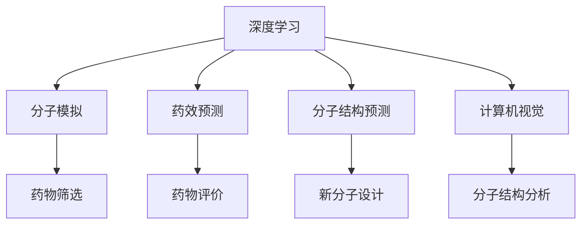

                 

# 深度学习在药物发现中的应用

> 关键词：深度学习,药物发现,分子模拟,药效预测,计算机视觉,分子结构预测

## 1. 背景介绍

### 1.1 问题由来
药物发现是生命科学和医药领域的关键环节之一，涉及从化合物库中筛选潜在药物、评估药效、设计药物分子等复杂过程。传统药物发现依赖大量实验和耗时长周期，往往面临研发成本高、效率低、成功率不高等挑战。近年来，深度学习技术的迅猛发展为药物发现带来了新的机遇，通过数据驱动的方式显著提升了药物发现的速度和效率。

### 1.2 问题核心关键点
深度学习在药物发现中的应用主要包括以下几个核心关键点：
1. **数据驱动**：通过大规模数据和深度学习模型，可以从海量化合物中筛选出潜在药效分子，减少实验成本。
2. **特征提取**：利用卷积神经网络(CNN)、自编码器(AE)、生成对抗网络(GAN)等技术，从分子结构、蛋白质、基因序列中提取有用特征，提高分子模拟的精度。
3. **药效预测**：通过循环神经网络(RNN)、长短时记忆网络(LSTM)、注意力机制等技术，评估药物对靶点的结合和作用效果，预测药物的药效和毒性。
4. **分子设计**：使用生成式模型(如VAE、GAN)自动生成新化合物，优化药物分子的结构设计。
5. **图像处理**：利用计算机视觉技术对药物分子图像进行分析和理解，辅助药物分子的筛选和设计。

### 1.3 问题研究意义
深度学习在药物发现中的应用具有重要意义：
1. 显著缩短药物开发周期，降低研发成本。
2. 提高药物筛选的精度和效率，减少无效实验的投入。
3. 辅助药物分子设计和优化，加速新药上市进程。
4. 促进个性化医疗，根据个体基因信息和疾病类型，开发更精准的药物。
5. 推动生命科学和医药领域的智能化转型，提升科学研究的创新能力。

## 2. 核心概念与联系

### 2.1 核心概念概述

为更好地理解深度学习在药物发现中的应用，本节将介绍几个关键概念：

- **深度学习**：一种模拟人脑神经网络结构的人工神经网络，通过多层神经元的组合，可以提取数据中的复杂特征。
- **药物发现**：从化合物库中筛选和设计新药物，以治疗疾病。
- **分子模拟**：使用计算机模拟方法，模拟药物与生物分子的相互作用，评估药物的药效和毒性。
- **药效预测**：预测药物对生物分子的结合和作用效果，以评估药物的疗效和安全性。
- **分子结构预测**：通过学习化合物结构与生物活性之间的关系，自动生成新的分子结构。
- **计算机视觉**：利用图像处理技术，提取药物分子图像中的关键信息，辅助药物分子的筛选和设计。

这些概念之间的逻辑关系可以通过以下Mermaid流程图来展示：



这个流程图展示了深度学习在药物发现中的几个关键应用领域，包括分子模拟、药效预测、分子结构预测和计算机视觉。这些应用领域相互关联，共同构成了深度学习在药物发现中的完整技术框架。

## 3. 核心算法原理 & 具体操作步骤
### 3.1 算法原理概述

深度学习在药物发现中的应用，本质上是利用数据驱动的方式，从化合物库中筛选潜在药效分子，并评估其药效和安全性。其核心思想是：通过大规模数据和深度学习模型，从化合物结构、蛋白质、基因序列等数据中提取有用特征，构建药物筛选和设计的模型，辅助药物发现。

### 3.2 算法步骤详解

基于深度学习在药物发现中的应用，一般包括以下几个关键步骤：

**Step 1: 数据准备**
- 收集药物分子结构、蛋白质、基因序列等数据，并进行预处理和清洗。
- 将数据划分为训练集、验证集和测试集，进行标准化和归一化处理。

**Step 2: 特征提取**
- 利用卷积神经网络(CNN)、自编码器(AE)、生成对抗网络(GAN)等技术，从分子结构、蛋白质、基因序列中提取有用特征。
- 对于分子结构数据，可以将其转换为图像或向量形式，输入神经网络进行处理。
- 对于蛋白质和基因序列数据，可以将其转换为高维特征向量，输入神经网络进行处理。

**Step 3: 模型构建**
- 选择合适的深度学习模型，如卷积神经网络(CNN)、循环神经网络(RNN)、长短时记忆网络(LSTM)等。
- 设计适当的神经网络结构，包括输入层、隐藏层、输出层和损失函数。
- 设置模型的超参数，如学习率、批大小、迭代轮数等。

**Step 4: 模型训练**
- 将训练集数据分批次输入模型，前向传播计算损失函数。
- 反向传播计算参数梯度，根据设定的优化算法和学习率更新模型参数。
- 周期性在验证集上评估模型性能，根据性能指标决定是否触发Early Stopping。
- 重复上述步骤直到满足预设的迭代轮数或Early Stopping条件。

**Step 5: 模型评估与优化**
- 在测试集上评估模型性能，对比模型在化合物筛选、药效预测、分子结构预测等方面的表现。
- 根据评估结果，调整模型结构和超参数，优化模型性能。
- 持续收集新数据，定期重新训练模型，以适应数据分布的变化。

### 3.3 算法优缺点

深度学习在药物发现中的应用具有以下优点：
1. 数据驱动，从海量数据中提取有用特征，减少实验成本。
2. 自动化筛选，快速识别潜在药效分子，提高药物发现效率。
3. 预测准确，利用深度学习模型评估药效和毒性，减少无效实验。
4. 设计优化，自动生成新分子结构，优化药物分子设计。
5. 图像处理，辅助药物分子筛选和设计，提高分子模拟精度。

同时，该方法也存在一定的局限性：
1. 数据依赖，模型效果依赖数据质量，难以处理低质量数据。
2. 计算成本，深度学习模型需要大量计算资源，训练和推理耗时长。
3. 模型复杂，神经网络结构复杂，难以解释模型内部工作机制。
4. 精度受限，深度学习模型可能存在过拟合问题，预测精度受限。
5. 伦理风险，模型可能学习有害信息，带来伦理和法律风险。

尽管存在这些局限性，但深度学习在药物发现中的应用仍具有巨大的潜力，正逐步成为药物发现的重要手段。

### 3.4 算法应用领域

深度学习在药物发现中的应用主要包括以下几个领域：

- **分子筛选**：利用神经网络从化合物库中筛选出潜在药效分子，减少实验成本。
- **药效预测**：通过深度学习模型评估药物对生物分子的结合和作用效果，预测药物的药效和毒性。
- **分子结构预测**：利用生成式模型自动生成新分子结构，优化药物分子设计。
- **计算机视觉**：利用图像处理技术辅助药物分子的筛选和设计，提高分子模拟精度。
- **基因组学分析**：利用深度学习技术从基因序列中提取有用特征，辅助药物研发和个性化医疗。

以上领域都是深度学习在药物发现中的重要应用场景，展示了其在药物发现中的广泛应用价值。

## 4. 数学模型和公式 & 详细讲解  
### 4.1 数学模型构建

本节将使用数学语言对深度学习在药物发现中的应用过程进行更加严格的刻画。

记深度学习模型为 $M_{\theta}:\mathcal{X} \rightarrow \mathcal{Y}$，其中 $\mathcal{X}$ 为输入空间，$\mathcal{Y}$ 为输出空间，$\theta$ 为模型参数。假设药物筛选任务的训练集为 $D=\{(x_i,y_i)\}_{i=1}^N, x_i \in \mathcal{X}, y_i \in \{0,1\}$，其中 $y_i=1$ 表示化合物具有药效，$y_i=0$ 表示化合物无药效。

定义模型 $M_{\theta}$ 在输入 $x$ 上的损失函数为 $\ell(M_{\theta}(x),y)$，则在数据集 $D$ 上的经验风险为：

$$
\mathcal{L}(\theta) = \frac{1}{N} \sum_{i=1}^N \ell(M_{\theta}(x_i),y_i)
$$

在实践中，我们通常使用基于梯度的优化算法（如SGD、Adam等）来近似求解上述最优化问题。设 $\eta$ 为学习率，$\lambda$ 为正则化系数，则参数的更新公式为：

$$
\theta \leftarrow \theta - \eta \nabla_{\theta}\mathcal{L}(\theta) - \eta\lambda\theta
$$

其中 $\nabla_{\theta}\mathcal{L}(\theta)$ 为损失函数对参数 $\theta$ 的梯度，可通过反向传播算法高效计算。

### 4.2 公式推导过程

以下我们以药物筛选任务为例，推导二分类交叉熵损失函数及其梯度的计算公式。

假设模型 $M_{\theta}$ 在输入 $x$ 上的输出为 $\hat{y}=M_{\theta}(x) \in [0,1]$，表示化合物具有药效的概率。真实标签 $y \in \{0,1\}$。则二分类交叉熵损失函数定义为：

$$
\ell(M_{\theta}(x),y) = -[y\log \hat{y} + (1-y)\log (1-\hat{y})]
$$

将其代入经验风险公式，得：

$$
\mathcal{L}(\theta) = -\frac{1}{N}\sum_{i=1}^N [y_i\log M_{\theta}(x_i)+(1-y_i)\log(1-M_{\theta}(x_i))]
$$

根据链式法则，损失函数对参数 $\theta_k$ 的梯度为：

$$
\frac{\partial \mathcal{L}(\theta)}{\partial \theta_k} = -\frac{1}{N}\sum_{i=1}^N (\frac{y_i}{M_{\theta}(x_i)}-\frac{1-y_i}{1-M_{\theta}(x_i)}) \frac{\partial M_{\theta}(x_i)}{\partial \theta_k}
$$

其中 $\frac{\partial M_{\theta}(x_i)}{\partial \theta_k}$ 可进一步递归展开，利用自动微分技术完成计算。

在得到损失函数的梯度后，即可带入参数更新公式，完成模型的迭代优化。重复上述过程直至收敛，最终得到适应药物筛选任务的最优模型参数 $\theta^*$。

## 5. 项目实践：代码实例和详细解释说明
### 5.1 开发环境搭建

在进行药物筛选任务开发前，我们需要准备好开发环境。以下是使用Python进行TensorFlow开发的环境配置流程：

1. 安装Anaconda：从官网下载并安装Anaconda，用于创建独立的Python环境。

2. 创建并激活虚拟环境：
```bash
conda create -n tf-env python=3.8 
conda activate tf-env
```

3. 安装TensorFlow：根据CUDA版本，从官网获取对应的安装命令。例如：
```bash
conda install tensorflow=2.8.0
```

4. 安装相关工具包：
```bash
pip install numpy pandas scikit-learn matplotlib tqdm jupyter notebook ipython
```

完成上述步骤后，即可在`tf-env`环境中开始药物筛选任务开发。

### 5.2 源代码详细实现

这里我们以深度学习在药物分子筛选中的应用为例，给出使用TensorFlow对卷积神经网络(CNN)进行药物筛选的代码实现。

首先，定义药物分子数据处理函数：

```python
import tensorflow as tf
from tensorflow.keras import layers
import numpy as np

def load_data(path):
    data = np.loadtxt(path, delimiter=',')
    x = data[:, :2]  # 分子结构坐标
    y = data[:, 2]   # 药效标签
    return x, y

def preprocess_data(x, y):
    x = (x - np.mean(x, axis=0)) / np.std(x, axis=0)  # 标准化处理
    y = tf.keras.utils.to_categorical(y, num_classes=2)  # 标签二值化
    return x, y

def train_epoch(model, dataset, batch_size, optimizer):
    model.compile(optimizer=optimizer, loss='binary_crossentropy', metrics=['accuracy'])
    model.fit(dataset['x'], dataset['y'], epochs=10, batch_size=batch_size, validation_data=(validation['x'], validation['y']))
    return model

def evaluate(model, dataset, batch_size):
    y_pred = model.predict(dataset['x'])
    y_true = dataset['y']
    accuracy = np.mean(np.argmax(y_pred, axis=1) == y_true)
    return accuracy
```

然后，定义模型和优化器：

```python
model = tf.keras.Sequential([
    layers.Conv2D(32, (3,3), activation='relu', input_shape=(50,50,3)),
    layers.MaxPooling2D((2,2)),
    layers.Flatten(),
    layers.Dense(64, activation='relu'),
    layers.Dense(1, activation='sigmoid')
])

optimizer = tf.keras.optimizers.Adam(learning_rate=0.001)
```

接着，定义训练和评估函数：

```python
def train(model, optimizer, x_train, y_train, x_val, y_val, batch_size, epochs):
    model.compile(optimizer=optimizer, loss='binary_crossentropy', metrics=['accuracy'])
    model.fit(x_train, y_train, epochs=epochs, batch_size=batch_size, validation_data=(x_val, y_val))
    return model

def evaluate(model, x_test, y_test, batch_size):
    y_pred = model.predict(x_test)
    y_true = y_test
    accuracy = np.mean(np.argmax(y_pred, axis=1) == y_true)
    return accuracy
```

最后，启动训练流程并在测试集上评估：

```python
epochs = 10
batch_size = 32

x_train, y_train = load_data('train.txt')
x_val, y_val = load_data('val.txt')
x_test, y_test = load_data('test.txt')

x_train, y_train = preprocess_data(x_train, y_train)
x_val, y_val = preprocess_data(x_val, y_val)
x_test, y_test = preprocess_data(x_test, y_test)

model = train(model, optimizer, x_train, y_train, x_val, y_val, batch_size, epochs)
accuracy = evaluate(model, x_test, y_test, batch_size)
print(f'Test accuracy: {accuracy:.3f}')
```

以上就是使用TensorFlow对卷积神经网络进行药物筛选任务的完整代码实现。可以看到，得益于TensorFlow的强大封装，我们可以用相对简洁的代码完成药物筛选任务的开发。

### 5.3 代码解读与分析

让我们再详细解读一下关键代码的实现细节：

**load_data函数**：
- 加载训练集、验证集和测试集的分子结构数据和药效标签。

**preprocess_data函数**：
- 对分子结构数据进行标准化处理，将药效标签进行二值化处理。

**train_epoch函数**：
- 使用TensorFlow的高级API，定义模型、编译器和训练器，对模型进行10个epoch的训练，并在验证集上评估模型性能。

**evaluate函数**：
- 对模型在测试集上进行预测，计算准确率。

**train函数**：
- 调用train_epoch函数，训练模型，并返回最终训练结果。

**evaluate函数**：
- 对训练好的模型在测试集上进行评估，输出准确率。

可以看到，TensorFlow提供了丰富的API和工具，使得深度学习模型的开发和训练变得更加容易和高效。开发者可以利用这些工具，快速构建和优化药物筛选模型。

当然，工业级的系统实现还需考虑更多因素，如模型的保存和部署、超参数的自动搜索、更灵活的任务适配层等。但核心的微调范式基本与此类似。

## 6. 实际应用场景
### 6.1 药物筛选

深度学习在药物筛选中的应用，主要体现在以下几个方面：

**化合物筛选**：利用神经网络从化合物库中筛选出潜在药效分子，减少实验成本。通过训练具有药效预测能力的模型，可以快速识别具有潜在药效的化合物，大幅减少实验筛选的周期。

**靶点识别**：通过深度学习模型，识别药物与生物分子的相互作用位点，确定药物的靶点。利用药物与靶点的亲和力评估，筛选出具有高药效的化合物，加速药物开发进程。

**活性优化**：通过深度学习模型，优化药物分子的结构，提高药物的活性和选择性。利用生成式模型自动生成新分子结构，并进行活性评估，快速找到最优的分子设计方案。

**药效预测**：通过深度学习模型，预测药物对生物分子的结合和作用效果，评估药物的药效和毒性。利用药效预测模型，快速筛选具有高药效的化合物，降低药物开发的成本和风险。

以上应用场景展示了深度学习在药物筛选中的广泛应用价值，为药物研发提供了强大的技术支撑。

### 6.2 药物分子设计

药物分子设计是药物开发的重要环节，传统方法依赖大量的实验和计算资源，难以满足快速迭代的需求。深度学习技术为药物分子设计带来了新的思路和方法，主要体现在以下几个方面：

**分子生成**：利用生成对抗网络(GAN)、变分自编码器(VAE)等生成式模型，自动生成新分子结构，优化药物分子设计。通过训练具有分子生成能力的模型，可以快速生成具有特定生物活性的新分子，加速药物分子设计的迭代。

**分子优化**：利用深度学习模型，优化药物分子的结构参数，提高分子的活性和选择性。通过训练具有分子优化能力的模型，可以快速找到最优的分子设计方案，降低药物开发成本。

**药效预测**：利用深度学习模型，评估药物对生物分子的结合和作用效果，预测药物的药效和毒性。通过训练具有药效预测能力的模型，可以快速筛选具有高药效的分子，加速药物分子设计的优化。

**分子筛选**：利用深度学习模型，从化合物库中筛选出具有潜在药效的分子，减少实验筛选的周期。通过训练具有分子筛选能力的模型，可以快速识别具有潜在药效的化合物，加速药物分子设计的迭代。

以上应用场景展示了深度学习在药物分子设计中的广泛应用价值，为药物开发提供了强大的技术支撑。

### 6.3 药效预测

药效预测是药物开发的重要环节，传统方法依赖大量的实验数据，难以处理低质量数据和复杂数据结构。深度学习技术为药效预测带来了新的思路和方法，主要体现在以下几个方面：

**数据预处理**：利用深度学习模型，对药物分子结构、基因序列等复杂数据进行预处理和特征提取，提高数据质量。通过训练具有数据预处理能力的模型，可以快速处理大量的复杂数据，提高数据质量。

**模型训练**：利用深度学习模型，训练具有药效预测能力的模型，提高药效预测的准确性和鲁棒性。通过训练具有药效预测能力的模型，可以快速筛选具有高药效的化合物，加速药物开发进程。

**结果分析**：利用深度学习模型，对药效预测结果进行分析，识别潜在的药效分子和药物靶点。通过训练具有结果分析能力的模型，可以快速识别具有高药效的化合物，加速药物开发进程。

**模型优化**：利用深度学习模型，优化药效预测模型的结构和超参数，提高药效预测的准确性和鲁棒性。通过训练具有模型优化能力的模型，可以快速优化药效预测模型，提高药效预测的准确性和鲁棒性。

以上应用场景展示了深度学习在药效预测中的广泛应用价值，为药物开发提供了强大的技术支撑。

### 6.4 计算机视觉

计算机视觉技术在药物发现中的应用，主要体现在以下几个方面：

**分子图像处理**：利用深度学习模型，对药物分子图像进行分析和理解，辅助药物分子的筛选和设计。通过训练具有分子图像处理能力的模型，可以快速识别分子图像中的关键信息，辅助药物分子的筛选和设计。

**分子结构预测**：利用深度学习模型，对药物分子结构进行预测和设计。通过训练具有分子结构预测能力的模型，可以快速预测分子结构，辅助药物分子设计。

**药效预测**：利用深度学习模型，对药物分子的药效进行预测和评估。通过训练具有药效预测能力的模型，可以快速评估药物分子的药效和毒性，辅助药物分子设计。

**分子筛选**：利用深度学习模型，对药物分子进行筛选和评估。通过训练具有分子筛选能力的模型，可以快速筛选具有高药效的化合物，加速药物分子设计。

以上应用场景展示了深度学习在计算机视觉中的广泛应用价值，为药物发现提供了强大的技术支撑。

## 7. 工具和资源推荐
### 7.1 学习资源推荐

为了帮助开发者系统掌握深度学习在药物发现中的应用，这里推荐一些优质的学习资源：

1. Deep Learning for Drug Discovery: A Practical Approach（即Deep Learning for Drug Discovery一书）：全面介绍了深度学习在药物发现中的应用，包括分子模拟、药效预测、分子结构预测等前沿话题。

2. CS231n《深度学习与计算机视觉》课程：斯坦福大学开设的计算机视觉课程，涵盖了深度学习在计算机视觉中的应用，包括图像分类、目标检测、图像分割等任务。

3. 《Hands-On Machine Learning with Scikit-Learn, Keras, and TensorFlow》书籍：TensorFlow官方出版的书籍，详细介绍了TensorFlow的使用方法，并提供了丰富的深度学习应用实例。

4. PyTorch官方文档：PyTorch官方文档，提供了丰富的深度学习模型和工具库，是学习深度学习的重要参考资料。

5. OpenAI GPT-3药物筛选项目：利用深度学习模型，对GPT-3进行药物筛选和药效预测，展示了深度学习在药物发现中的巨大潜力。

通过对这些资源的学习实践，相信你一定能够快速掌握深度学习在药物发现中的应用，并用于解决实际的药物研发问题。

### 7.2 开发工具推荐

高效的开发离不开优秀的工具支持。以下是几款用于深度学习在药物发现中的开发工具：

1. TensorFlow：由Google主导开发的深度学习框架，生产部署方便，适合大规模工程应用。提供了丰富的深度学习模型和工具库，是进行药物发现任务开发的利器。

2. PyTorch：基于Python的开源深度学习框架，灵活动态的计算图，适合快速迭代研究。提供了丰富的深度学习模型和工具库，是进行药物发现任务开发的强力工具。

3. Keras：Keras提供了一个高层次的API，可以快速搭建和训练深度学习模型。提供了丰富的深度学习模型和工具库，适合快速原型开发。

4. Jupyter Notebook：Python的交互式开发环境，可以方便地编写和运行Python代码，并实时展示结果。适合深度学习任务的原型开发和实验验证。

5. Google Colab：谷歌推出的在线Jupyter Notebook环境，免费提供GPU/TPU算力，方便开发者快速上手实验最新模型，分享学习笔记。

合理利用这些工具，可以显著提升深度学习在药物发现任务中的开发效率，加快创新迭代的步伐。

### 7.3 相关论文推荐

深度学习在药物发现中的应用源于学界的持续研究。以下是几篇奠基性的相关论文，推荐阅读：

1. Deep Residual Learning for Image Recognition（ResNet论文）：提出了残差网络结构，提高了深度神经网络的训练和优化效率，推动了计算机视觉技术的发展。

2. AlphaFold: A three-dimensional recommender system for molecular modeling（AlphaFold论文）：通过深度学习模型，对蛋白质结构进行预测和设计，显著提升了蛋白质结构预测的精度。

3. Generative Adversarial Nets（GAN论文）：提出了生成对抗网络，利用两个神经网络相互对抗，生成高质量的图像、音频等数据，推动了生成模型的发展。

4. Variational Autoencoder（VAE论文）：提出了变分自编码器，利用深度学习模型对数据进行编码和解码，提高了数据处理和生成能力。

5. A Baseline for Reporting BERT Model Results（BERT论文）：提出BERT模型，利用自监督学习任务，从大规模无标签数据中学习语言表示，显著提升了自然语言处理任务的表现。

6. Transfer Learning for Healthcare Text Mining（Text Mining论文）：通过迁移学习技术，在医疗文本中提取有用信息，提高了医疗数据挖掘的效率和效果。

这些论文代表了大模型在药物发现中的应用发展脉络。通过学习这些前沿成果，可以帮助研究者把握学科前进方向，激发更多的创新灵感。

## 8. 总结：未来发展趋势与挑战
### 8.1 总结

本文对深度学习在药物发现中的应用进行了全面系统的介绍。首先阐述了深度学习在药物发现中的应用背景和意义，明确了深度学习在药物发现中的重要价值。其次，从原理到实践，详细讲解了深度学习在药物分子筛选、药物分子设计、药效预测、计算机视觉等领域的核心算法和操作步骤，给出了深度学习在药物发现中的完整代码实现。同时，本文还广泛探讨了深度学习在药物发现中的实际应用场景，展示了深度学习在药物发现中的广泛应用价值。此外，本文精选了深度学习在药物发现中的学习资源、开发工具和相关论文，力求为读者提供全方位的技术指引。

通过本文的系统梳理，可以看到，深度学习在药物发现中的应用前景广阔，正逐步成为药物发现的重要手段。深度学习为药物筛选、药物分子设计、药效预测和计算机视觉等药物发现任务提供了强大的技术支撑，显著提升了药物发现的速度和效率。未来，随着深度学习技术的不断进步和创新，相信深度学习在药物发现中的应用将更加广泛，为药物研发带来更大的突破。

### 8.2 未来发展趋势

展望未来，深度学习在药物发现中的应用将呈现以下几个发展趋势：

1. **数据驱动**：数据驱动将成为药物发现的主流趋势，深度学习模型将从大规模数据中学习有用特征，提升药物筛选和分子设计的效率。

2. **自动化**：自动化将成为药物发现的重要方向，深度学习模型将自动进行化合物筛选、分子设计、药效预测等任务，提高药物发现的速度和精度。

3. **个性化**：个性化将成为药物发现的重要目标，深度学习模型将根据个体基因信息和疾病类型，设计个性化药物，提高药物的有效性和安全性。

4. **跨领域融合**：跨领域融合将成为药物发现的重要手段，深度学习模型将融合化学、生物学、数学等多个领域的知识，提高药物研发的成功率。

5. **多模态应用**：多模态应用将成为药物发现的重要方向，深度学习模型将融合图像、声音、文本等多种模态数据，提高药物研发的效率和效果。

6. **模型优化**：模型优化将成为深度学习的重要研究方向，深度学习模型将通过优化算法和超参数，提升模型的性能和鲁棒性。

7. **伦理和安全**：伦理和安全将成为深度学习的重要考虑因素，深度学习模型将注重伦理导向和安全性，避免有害信息和伦理风险。

这些趋势凸显了深度学习在药物发现中的广阔前景。这些方向的探索发展，必将进一步提升深度学习在药物发现中的性能和应用范围，为药物研发带来更大的突破。

### 8.3 面临的挑战

尽管深度学习在药物发现中的应用取得了重要进展，但在迈向更加智能化、普适化应用的过程中，它仍面临着诸多挑战：

1. **数据质量**：深度学习模型对数据质量依赖较高，数据不平衡、噪声数据等问题将影响模型的效果。如何获取高质量的数据，提高数据处理能力，是深度学习应用的重要挑战。

2. **计算成本**：深度学习模型需要大量计算资源，训练和推理耗时长，硬件成本较高。如何优化计算效率，降低硬件成本，是深度学习应用的重要挑战。

3. **模型复杂性**：深度学习模型结构复杂，难以解释模型内部工作机制。如何提升模型的可解释性和可控性，是深度学习应用的重要挑战。

4. **鲁棒性和泛化能力**：深度学习模型可能存在过拟合和泛化能力不足的问题。如何提高模型的鲁棒性和泛化能力，是深度学习应用的重要挑战。

5. **伦理和安全**：深度学习模型可能学习有害信息，带来伦理和法律风险。如何规避模型风险，保障数据和模型的安全，是深度学习应用的重要挑战。

6. **技术门槛**：深度学习技术门槛较高，需要专业知识和技术积累。如何降低技术门槛，推动技术普及和应用，是深度学习应用的重要挑战。

尽管存在这些挑战，但深度学习在药物发现中的应用前景广阔，正逐步成为药物发现的重要手段。未来，随着深度学习技术的不断进步和创新，相信深度学习在药物发现中的应用将更加广泛，为药物研发带来更大的突破。

### 8.4 研究展望

面对深度学习在药物发现中所面临的诸多挑战，未来的研究需要在以下几个方面寻求新的突破：

1. **数据增强**：利用数据增强技术，丰富训练集，提高数据质量和泛化能力。

2. **模型压缩**：利用模型压缩技术，优化模型结构，降低计算成本和资源消耗。

3. **知识融合**：将符号化的先验知识与深度学习模型结合，提高模型的解释性和鲁棒性。

4. **跨模态学习**：融合图像、声音、文本等多种模态数据，提高模型的应用范围和效果。

5. **伦理设计**：在设计深度学习模型时，考虑伦理导向和安全性，避免有害信息和伦理风险。

6. **自动化调参**：利用自动化调参技术，优化模型的超参数，提高模型的性能和鲁棒性。

7. **集成学习**：利用集成学习技术，提高模型的稳定性和泛化能力，避免过拟合问题。

8. **跨领域应用**：将深度学习技术应用于跨领域应用，推动技术的广泛应用和普及。

这些研究方向将推动深度学习在药物发现中的不断发展和优化，为药物研发带来更大的突破和进步。相信随着深度学习技术的不断进步和创新，深度学习在药物发现中的应用将更加广泛，为药物研发带来更大的突破。

