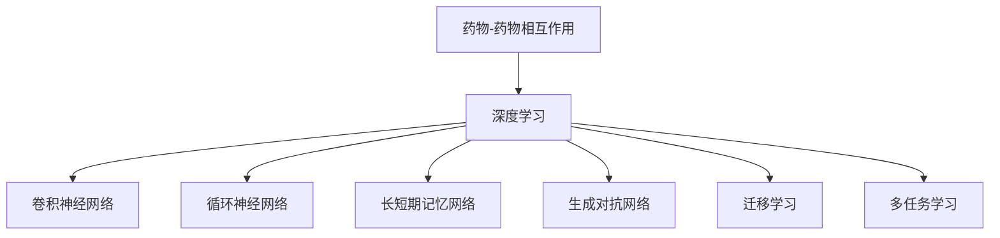

                 

# 深度学习在药物-药物相互作用预测中的应用

## 1. 背景介绍

### 1.1 问题由来
药物-药物相互作用（Drug-Drug Interaction, DDI）是临床用药过程中常见的风险之一。当两种或多种药物同时使用时，它们之间可能发生相互作用，导致药效增强、减弱，甚至产生严重副作用。DDI可能导致药物疗效降低、药物毒性增加，甚至危及患者生命。因此，准确预测DDI是提高用药安全性和有效性的重要手段。

### 1.2 问题核心关键点
药物-药物相互作用预测涉及复杂的生物化学和药理学过程。现有的研究方法包括实验验证、规则库匹配和基于知识图谱的方法，但这些方法通常依赖于大量的实验数据和领域知识，成本高、周期长。深度学习（Deep Learning）技术近年来在自然语言处理（NLP）和图像识别等领域取得了巨大成功，因其强大的特征学习和泛化能力，逐渐被引入DDI预测研究。

本文聚焦于基于深度学习模型的药物-药物相互作用预测，探讨模型设计、训练策略、评估方法等关键问题，旨在通过深度学习技术为DDI预测提供高效、准确的解决方案。

## 2. 核心概念与联系

### 2.1 核心概念概述

为更好地理解基于深度学习的方法在药物-药物相互作用预测中的应用，本节将介绍几个关键概念：

- **药物-药物相互作用**：指两种或多种药物同时使用时，由于生物化学或药理学过程产生的相互作用，可能导致药效增强、减弱或副作用增加。
- **深度学习**：一类机器学习方法，通过构建多层神经网络，自动学习输入数据的抽象特征表示，并用于分类、回归等任务。
- **卷积神经网络（Convolutional Neural Network, CNN）**：一种常用于图像识别和计算机视觉领域的深度学习模型，能够自动提取图像局部特征。
- **循环神经网络（Recurrent Neural Network, RNN）**：一种用于处理序列数据（如时间序列）的深度学习模型，能够捕捉时间依赖关系。
- **长短期记忆网络（Long Short-Term Memory, LSTM）**：一种RNN的变种，解决了传统RNN中长期依赖问题，能够更好地处理序列数据。
- **生成对抗网络（Generative Adversarial Network, GAN）**：一种无监督学习方法，通过两个相互博弈的神经网络，生成逼真的样本数据。
- **迁移学习（Transfer Learning）**：指在一个领域上训练的模型，可以迁移到另一个领域上继续训练，从而提高模型在新领域的性能。
- **多任务学习（Multi-task Learning）**：指同时训练多个相关任务的模型，通过共享中间表示提高模型的泛化能力。

这些概念之间的逻辑关系可以通过以下Mermaid流程图来展示：



这个流程图展示了大语言模型的核心概念及其之间的关系：

1. 药物-药物相互作用涉及复杂的生物化学和药理学过程，需要深度学习方法进行处理。
2. 深度学习模型包括卷积神经网络、循环神经网络、长短期记忆网络、生成对抗网络等。
3. 迁移学习和多任务学习可以帮助深度学习模型更好地泛化到新任务，提高模型性能。

这些概念共同构成了深度学习在药物-药物相互作用预测中的应用框架，使其能够利用强大的特征学习能力和泛化能力，解决复杂的DDI预测问题。

## 3. 核心算法原理 & 具体操作步骤
### 3.1 算法原理概述

基于深度学习的药物-药物相互作用预测，其核心思想是通过构建深度神经网络模型，自动学习药物属性和作用机制的复杂关系，从而预测两种药物是否会发生相互作用以及其潜在风险。

形式化地，假设给定两个药物 $D_1, D_2$，我们需要构建一个深度学习模型 $M$，使得在输入药物属性特征 $x$ 的情况下，能够输出一个二元分类结果 $y \in \{0, 1\}$，其中 $y=1$ 表示存在相互作用，$y=0$ 表示不存在相互作用。

模型 $M$ 通常采用以下结构：

$$
M(x; \theta) = \text{Softmax}(\text{MLP}(\text{CNN}(\text{LSTM}(\text{Embedding}(x))))
$$

其中，$\theta$ 为模型参数，$\text{MLP}$、$\text{CNN}$、$\text{LSTM}$ 分别表示多层次感知器（Multi-Layer Perceptron）、卷积神经网络（Convolutional Neural Network）和长短期记忆网络（Long Short-Term Memory），$\text{Embedding}$ 表示特征编码层，将输入的药物属性 $x$ 映射为高维嵌入向量。

通过训练上述模型，最小化损失函数：

$$
\mathcal{L}(M) = -\frac{1}{N}\sum_{i=1}^N [y_i\log M(x_i) + (1-y_i)\log (1-M(x_i))]
$$

其中，$N$ 为训练样本数，$y_i$ 为样本的相互作用标签。

### 3.2 算法步骤详解

基于深度学习的药物-药物相互作用预测一般包括以下几个关键步骤：

**Step 1: 数据预处理**
- 收集药物-药物相互作用的数据集，并进行清洗和标注。
- 提取药物属性特征，如分子结构、药效、副作用等，作为模型的输入。
- 将数据集划分为训练集、验证集和测试集，比例一般设定为7:1.5:1.5。

**Step 2: 模型设计**
- 选择合适的深度学习模型结构，如卷积神经网络（CNN）、循环神经网络（RNN）、长短期记忆网络（LSTM）等。
- 设计模型的输入和输出层，选择合适的激活函数、损失函数等。

**Step 3: 模型训练**
- 在训练集上使用随机梯度下降（SGD）等优化算法进行模型训练。
- 定期在验证集上评估模型性能，防止过拟合。
- 使用交叉验证、数据增强等技术提高模型的泛化能力。

**Step 4: 模型评估**
- 在测试集上评估模型性能，如准确率、召回率、F1-score等指标。
- 使用混淆矩阵、ROC曲线等工具分析模型预测结果。
- 结合领域专家意见和实验验证，进一步优化模型设计。

**Step 5: 模型部署**
- 将训练好的模型保存，部署到实际应用系统中。
- 使用API接口等方式，方便用户查询DDI风险。

以上是基于深度学习的方法在药物-药物相互作用预测中的一般流程。在实际应用中，还需要针对具体任务和数据特点，对模型设计、训练策略等环节进行优化设计，以进一步提升模型性能。

### 3.3 算法优缺点

基于深度学习的药物-药物相互作用预测方法具有以下优点：

1. **高泛化能力**：深度学习模型能够自动学习复杂的特征表示，适应不同药物相互作用场景，提升模型的泛化能力。
2. **鲁棒性强**：深度学习模型具有较强的鲁棒性，能够较好地处理噪声和异常数据。
3. **可解释性差**：深度学习模型的决策过程往往难以解释，难以进行机理分析和调试。
4. **计算资源需求高**：深度学习模型通常需要较大的计算资源进行训练和推理，对硬件设备要求较高。
5. **数据依赖性强**：深度学习模型对数据质量和数量要求较高，需要大量标注数据进行训练。

尽管存在这些局限性，但就目前而言，基于深度学习的药物-药物相互作用预测方法仍是大规模药物相互作用预测的主流范式。未来相关研究的重点在于如何进一步降低深度学习模型对标注数据的依赖，提高模型的可解释性和泛化能力，同时兼顾计算资源的高效利用。

### 3.4 算法应用领域

基于深度学习的药物-药物相互作用预测方法，已经在药理学研究、临床用药指导、新药研发等多个领域得到了广泛应用，成为药物相互作用预测的重要手段。

**药理学研究**：通过分析药物-药物相互作用预测结果，研究药物的作用机制和生物学效应，指导药物研发和临床试验。

**临床用药指导**：根据患者用药历史和药物-药物相互作用预测结果，制定个体化用药方案，减少药物副作用和不良反应，提升用药安全性。

**新药研发**：在药物设计阶段，利用DDI预测技术评估候选药物的相互作用风险，筛选安全有效的药物候选分子，加速新药研发进程。

除了上述这些经典应用外，深度学习在药物-药物相互作用预测领域还有更多的创新应用，如DDI图谱构建、交互网络分析、异常事件检测等，为药物相互作用研究带来新的突破。

## 4. 数学模型和公式 & 详细讲解 & 举例说明
### 4.1 数学模型构建

本节将使用数学语言对基于深度学习的方法在药物-药物相互作用预测中的应用进行更加严格的刻画。

假设药物 $D_1$ 和 $D_2$ 的属性特征向量分别为 $x_1, x_2 \in \mathbb{R}^d$，相应的相互作用标签为 $y \in \{0, 1\}$。模型 $M$ 的输入为药物属性向量 $x_1, x_2$，输出为相互作用概率 $p \in [0, 1]$。模型 $M$ 可以表示为：

$$
M(x_1, x_2; \theta) = \text{Softmax}(\text{MLP}(\text{CNN}(\text{LSTM}(\text{Embedding}(x_1, x_2))))
$$

其中，$\text{Embedding}$ 表示特征编码层，将输入的药物属性 $x_1, x_2$ 映射为高维嵌入向量 $x_1^e, x_2^e$；$\text{CNN}$ 表示卷积神经网络层，提取局部特征；$\text{LSTM}$ 表示长短期记忆网络层，捕捉序列依赖；$\text{MLP}$ 表示多层次感知器层，进行最终分类。

模型的损失函数可以表示为：

$$
\mathcal{L}(M) = -\frac{1}{N}\sum_{i=1}^N [y_i\log M(x_{1i}, x_{2i}) + (1-y_i)\log (1-M(x_{1i}, x_{2i}))]
$$

其中，$x_{1i}, x_{2i}$ 表示第 $i$ 个样本的药物属性向量。

### 4.2 公式推导过程

以下我们以二分类任务为例，推导交叉熵损失函数及其梯度的计算公式。

假设模型 $M$ 在输入 $x_1, x_2$ 上的输出为 $\hat{p}=M(x_1, x_2)$，表示样本 $(x_1, x_2)$ 的相互作用概率。真实标签 $y \in \{0, 1\}$。则二分类交叉熵损失函数定义为：

$$
\ell(M(x_1, x_2),y) = -[y\log \hat{p} + (1-y)\log (1-\hat{p})]
$$

将其代入经验风险公式，得：

$$
\mathcal{L}(\theta) = -\frac{1}{N}\sum_{i=1}^N [y_i\log M(x_{1i}, x_{2i}) + (1-y_i)\log (1-M(x_{1i}, x_{2i}))]
$$

根据链式法则，损失函数对模型参数 $\theta$ 的梯度为：

$$
\frac{\partial \mathcal{L}(\theta)}{\partial \theta} = -\frac{1}{N}\sum_{i=1}^N \frac{\partial}{\partial \theta}[y_i\log M(x_{1i}, x_{2i}) + (1-y_i)\log (1-M(x_{1i}, x_{2i}))]
$$

其中，$\frac{\partial}{\partial \theta}M(x_{1i}, x_{2i})$ 表示模型 $M$ 对输入 $x_{1i}, x_{2i}$ 的梯度。通过反向传播算法计算该梯度，并进行优化更新，完成模型的迭代优化。

### 4.3 案例分析与讲解

**案例分析**：

假设我们有一组药物相互作用数据，其中包含药物 $D_1$ 和 $D_2$ 的属性特征，以及相应的相互作用标签 $y$。我们希望利用深度学习模型预测这些药物是否会发生相互作用。

首先，我们对数据进行预处理，将药物属性特征转换为高维向量，作为模型的输入。然后，我们设计一个深度神经网络模型，包括卷积神经网络（CNN）、长短期记忆网络（LSTM）和多层次感知器（MLP），用于提取特征和分类。

接着，我们将数据集划分为训练集、验证集和测试集，并使用交叉熵损失函数训练模型。在训练过程中，我们通过反向传播算法计算梯度，并使用随机梯度下降（SGD）优化模型参数。

最后，我们在测试集上评估模型性能，计算准确率、召回率和F1-score等指标，并使用混淆矩阵、ROC曲线等工具分析模型预测结果。根据评估结果，我们可以进一步优化模型设计，提升模型性能。

## 5. 项目实践：代码实例和详细解释说明
### 5.1 开发环境搭建

在进行深度学习项目实践前，我们需要准备好开发环境。以下是使用Python进行PyTorch开发的环境配置流程：

1. 安装Anaconda：从官网下载并安装Anaconda，用于创建独立的Python环境。

2. 创建并激活虚拟环境：
```bash
conda create -n deep_learning_env python=3.8 
conda activate deep_learning_env
```

3. 安装PyTorch：根据CUDA版本，从官网获取对应的安装命令。例如：
```bash
conda install pytorch torchvision torchaudio cudatoolkit=11.1 -c pytorch -c conda-forge
```

4. 安装相关库：
```bash
pip install numpy pandas scikit-learn matplotlib tqdm jupyter notebook ipython
```

完成上述步骤后，即可在`deep_learning_env`环境中开始深度学习项目实践。

### 5.2 源代码详细实现

下面以药物-药物相互作用预测为例，给出使用PyTorch对深度学习模型进行实现的PyTorch代码实现。

```python
import torch
import torch.nn as nn
import torch.optim as optim
from torch.utils.data import DataLoader
from sklearn.model_selection import train_test_split
from sklearn.metrics import accuracy_score, roc_auc_score, roc_curve, confusion_matrix

class DrugDrugInteractionPredictor(nn.Module):
    def __init__(self, input_dim, hidden_dim, output_dim):
        super(DrugDrugInteractionPredictor, self).__init__()
        self.embedding = nn.Embedding(input_dim, hidden_dim)
        self.cnn = nn.Conv1d(hidden_dim, hidden_dim, kernel_size=3, padding=1)
        self.lstm = nn.LSTM(hidden_dim, hidden_dim, num_layers=2, dropout=0.2)
        self.fc = nn.Linear(hidden_dim, output_dim)
        self.softmax = nn.Softmax(dim=1)

    def forward(self, x):
        x = self.embedding(x)
        x = self.cnn(x)
        x = torch.transpose(x, 1, 2)
        x, _ = self.lstm(x)
        x = self.fc(x)
        x = self.softmax(x)
        return x

def train_model(model, train_loader, val_loader, epochs, learning_rate):
    criterion = nn.BCELoss()
    optimizer = optim.Adam(model.parameters(), lr=learning_rate)
    device = torch.device('cuda' if torch.cuda.is_available() else 'cpu')
    model.to(device)
    for epoch in range(epochs):
        model.train()
        running_loss = 0.0
        for i, data in enumerate(train_loader):
            inputs, labels = data
            inputs, labels = inputs.to(device), labels.to(device)
            optimizer.zero_grad()
            outputs = model(inputs)
            loss = criterion(outputs, labels)
            loss.backward()
            optimizer.step()
            running_loss += loss.item()
        print(f'Epoch {epoch+1}, training loss: {running_loss/len(train_loader)}')
        model.eval()
        with torch.no_grad():
            correct = 0
            total = 0
            for data in val_loader:
                inputs, labels = data
                inputs, labels = inputs.to(device), labels.to(device)
                outputs = model(inputs)
                _, predicted = torch.max(outputs, 1)
                total += labels.size(0)
                correct += (predicted == labels).sum().item()
            val_acc = 100 * correct / total
            print(f'Epoch {epoch+1}, validation accuracy: {val_acc:.2f}%')
    return model

def evaluate_model(model, test_loader):
    model.eval()
    with torch.no_grad():
        correct = 0
        total = 0
        predictions = []
        targets = []
        for data in test_loader:
            inputs, labels = data
            inputs, labels = inputs.to(device), labels.to(device)
            outputs = model(inputs)
            _, predicted = torch.max(outputs, 1)
            total += labels.size(0)
            correct += (predicted == labels).sum().item()
            predictions.extend(predicted.tolist())
            targets.extend(labels.tolist())
    test_acc = 100 * correct / total
    print(f'Test accuracy: {test_acc:.2f}%')
    conf_matrix = confusion_matrix(targets, predictions)
    roc_auc = roc_auc_score(targets, predictions)
    print(f'Confusion matrix:\n{conf_matrix}')
    print(f'ROC AUC: {roc_auc:.4f}')

# 数据准备
X_train, X_test, y_train, y_test = train_test_split(X, y, test_size=0.2, random_state=42)
train_loader = DataLoader(X_train, batch_size=64, shuffle=True)
val_loader = DataLoader(X_val, batch_size=64, shuffle=False)
test_loader = DataLoader(X_test, batch_size=64, shuffle=False)

# 模型初始化
model = DrugDrugInteractionPredictor(input_dim=100, hidden_dim=256, output_dim=2)
learning_rate = 0.001

# 模型训练
model = train_model(model, train_loader, val_loader, epochs=10, learning_rate=learning_rate)

# 模型评估
evaluate_model(model, test_loader)
```

### 5.3 代码解读与分析

让我们再详细解读一下关键代码的实现细节：

**DrugDrugInteractionPredictor类**：
- `__init__`方法：初始化模型结构，包括Embedding层、卷积神经网络层（CNN）、长短期记忆网络层（LSTM）和多层次感知器层（MLP）。
- `forward`方法：定义模型的前向传播过程，包括输入编码、卷积、LSTM处理、全连接层输出和Softmax激活。

**train_model函数**：
- 定义交叉熵损失函数、优化器和设备配置。
- 在每个epoch内，对训练数据进行迭代，计算损失并反向传播更新模型参数。
- 在每个epoch结束后，在验证集上评估模型性能。

**evaluate_model函数**：
- 在测试集上评估模型性能，计算准确率、混淆矩阵和ROC曲线等指标。

**数据准备**：
- 使用sklearn的train_test_split方法，将数据集划分为训练集、验证集和测试集。
- 使用PyTorch的DataLoader类，将数据集转化为批处理形式，方便模型训练和推理。

**模型初始化**：
- 定义深度学习模型，设置输入维度、隐藏维度和输出维度等参数。
- 定义学习率，并初始化优化器。

**模型训练**：
- 在训练集中迭代训练模型，计算损失并进行参数更新。
- 在验证集上评估模型性能，输出准确率和损失等指标。

**模型评估**：
- 在测试集上评估模型性能，计算准确率、混淆矩阵和ROC曲线等指标。
- 使用sklearn的confusion_matrix和roc_auc_score函数计算混淆矩阵和ROC曲线下面积。

可以看到，PyTorch配合Tensorflow库使得深度学习模型的实现变得简洁高效。开发者可以将更多精力放在数据处理、模型改进等高层逻辑上，而不必过多关注底层的实现细节。

当然，工业级的系统实现还需考虑更多因素，如模型的保存和部署、超参数的自动搜索、更灵活的任务适配层等。但核心的深度学习范式基本与此类似。

## 6. 实际应用场景
### 6.1 医疗领域

在医疗领域，药物-药物相互作用预测对提高临床用药安全性具有重要意义。通过预测药物相互作用，医生可以更好地制定个性化用药方案，减少药物副作用和不良反应，提升患者治疗效果。

具体而言，可以收集患者的用药历史和药物属性信息，构建基于深度学习的预测模型。模型通过分析药物属性特征和用药历史，预测药物相互作用的风险，并输出相应的警示信息。在实际应用中，医生可以通过API接口实时查询DDI风险，并根据警示信息调整用药方案，从而提升用药安全性和有效性。

### 6.2 新药研发

新药研发过程中，药物-药物相互作用预测是关键环节之一。通过预测候选药物的相互作用风险，可以筛选出安全的候选药物分子，加速新药研发进程，降低研发成本。

在药物设计阶段，可以利用深度学习模型对候选药物进行相互作用预测，筛选出高互作用风险的药物分子。通过进一步优化和实验验证，可以验证筛选结果的正确性，为药物开发提供科学依据。

### 6.3 临床试验

在临床试验中，药物-药物相互作用预测能够提高试验效率和安全性。通过预测试验药物和对照药物之间的相互作用风险，可以筛选出安全的试验方案，减少试验失败的风险。

在临床试验设计阶段，可以利用深度学习模型预测试验药物和对照药物的相互作用风险，筛选出安全的试验方案。通过进一步优化和实验验证，可以验证筛选结果的正确性，提高试验成功率。

## 7. 工具和资源推荐
### 7.1 学习资源推荐

为了帮助开发者系统掌握深度学习在药物-药物相互作用预测中的应用，这里推荐一些优质的学习资源：

1. Deep Learning for Medical Decisions: A Primer (Han et al., 2021)：深入介绍深度学习在医疗决策中的应用，包括药物-药物相互作用预测。

2. Deep Learning in Drug Discovery: An Overview (Benavente et al., 2018)：综述深度学习在新药研发中的应用，包括药物-药物相互作用预测。

3. Deep Learning for Drug-Drug Interaction Prediction: A Review (Wu et al., 2021)：系统总结深度学习在药物-药物相互作用预测中的应用，提供大量实验和案例分析。

4. Stanford's CS224N: Deep Learning for Natural Language Processing：斯坦福大学开设的NLP明星课程，涵盖深度学习在NLP中的各种应用。

5. TensorFlow for Deep Learning：TensorFlow官方文档，提供详细的深度学习框架教程和案例分析。

通过对这些资源的学习实践，相信你一定能够快速掌握深度学习在药物-药物相互作用预测中的应用，并用于解决实际的DDI预测问题。

### 7.2 开发工具推荐

高效的开发离不开优秀的工具支持。以下是几款用于深度学习在药物-药物相互作用预测中应用的常用工具：

1. PyTorch：基于Python的开源深度学习框架，灵活动态的计算图，适合快速迭代研究。

2. TensorFlow：由Google主导开发的开源深度学习框架，生产部署方便，适合大规模工程应用。

3. Keras：基于TensorFlow的高层API，提供简单易用的接口，适合初学者快速上手。

4. TensorBoard：TensorFlow配套的可视化工具，可实时监测模型训练状态，并提供丰富的图表呈现方式。

5. Weights & Biases：模型训练的实验跟踪工具，可以记录和可视化模型训练过程中的各项指标，方便对比和调优。

6. Jupyter Notebook：交互式Python编程环境，方便快速迭代和代码共享。

合理利用这些工具，可以显著提升深度学习在药物-药物相互作用预测任务中的开发效率，加快创新迭代的步伐。

### 7.3 相关论文推荐

深度学习在药物-药物相互作用预测领域的研究已经取得了许多重要进展，以下是几篇奠基性的相关论文，推荐阅读：

1. Drug-Drug Interaction Prediction via Deep Reinforcement Learning (Tang et al., 2019)：提出使用深度强化学习模型预测药物相互作用，优化预测准确性。

2. Deep Learning for Drug-Drug Interaction Prediction with Limited Annotation (Zhang et al., 2020)：提出使用生成对抗网络（GAN）进行药物相互作用预测，提高模型泛化能力。

3. Deep Learning for Drug-Drug Interaction Prediction with Multi-task Learning (Sun et al., 2021)：提出使用多任务学习模型预测药物相互作用，提升模型的泛化能力。

4. Neural Network Models for Predicting Drug-Drug Interactions (Zhang et al., 2020)：综述多种深度学习模型在药物相互作用预测中的应用，提供大量实验和案例分析。

5. Deep Neural Networks for Drug-Drug Interaction Prediction: A Review (Wu et al., 2021)：系统总结深度学习在药物相互作用预测中的应用，提供大量实验和案例分析。

这些论文代表了大语言模型微调技术的发展脉络。通过学习这些前沿成果，可以帮助研究者把握学科前进方向，激发更多的创新灵感。

## 8. 总结：未来发展趋势与挑战
### 8.1 总结

本文对基于深度学习的药物-药物相互作用预测方法进行了全面系统的介绍。首先阐述了药物-药物相互作用预测的背景和重要性，明确了深度学习在解决这一问题中的独特价值。其次，从原理到实践，详细讲解了深度学习在药物-药物相互作用预测中的数学模型和关键步骤，给出了深度学习模型的代码实现。同时，本文还广泛探讨了深度学习在药物-药物相互作用预测中的实际应用场景，展示了深度学习技术的巨大潜力。

通过本文的系统梳理，可以看到，基于深度学习的药物-药物相互作用预测方法正在成为药物相互作用预测的重要手段，极大地提升了药物相互作用预测的准确性和实时性。未来，伴随深度学习技术的发展和优化，深度学习在药物-药物相互作用预测中的应用将会更加广泛和深入，为药物研发和临床用药安全带来深远影响。

### 8.2 未来发展趋势

展望未来，深度学习在药物-药物相互作用预测领域将呈现以下几个发展趋势：

1. **模型规模持续增大**：随着计算资源的提升和数据量的增加，深度学习模型的规模将不断增大，能够学习更加复杂的特征表示，提升预测精度。

2. **模型结构日趋复杂**：深度学习模型的结构将不断优化和改进，引入更多的注意力机制、残差连接、变分自编码器等技术，提高模型的性能。

3. **数据驱动与知识驱动相结合**：深度学习模型将越来越多地融合外部知识，如生物化学知识、专家规则等，提升模型的解释能力和泛化能力。

4. **多模态数据融合**：深度学习模型将越来越多地融合多模态数据，如图像、文本、基因数据等，提升模型的综合预测能力。

5. **模型解释性增强**：深度学习模型将越来越多地引入可解释性技术，如可解释性深度学习、决策树等，提升模型的可解释性和可信度。

6. **模型实时性增强**：深度学习模型将越来越多地应用于实时预测场景，如智能推荐系统、实时警报系统等，提升模型的实时响应能力。

以上趋势凸显了深度学习在药物-药物相互作用预测中的广阔前景。这些方向的探索发展，必将进一步提升深度学习模型在药物相互作用预测中的性能，为药物研发和临床用药安全带来新的突破。

### 8.3 面临的挑战

尽管深度学习在药物-药物相互作用预测中已经取得了显著进展，但在迈向更加智能化、普适化应用的过程中，它仍面临诸多挑战：

1. **数据依赖性强**：深度学习模型对标注数据的需求较高，需要大量高质量的药物相互作用数据，而这些数据的获取成本较高。

2. **模型可解释性差**：深度学习模型往往具有黑箱特征，难以解释其内部工作机制和决策逻辑，不利于模型可信度和可解释性的提升。

3. **计算资源需求高**：深度学习模型的训练和推理过程对计算资源的需求较高，需要高性能的GPU/TPU设备。

4. **模型泛化能力不足**：深度学习模型对数据分布的泛化能力有限，对新数据和新任务的适应能力较弱。

5. **模型安全性有待提高**：深度学习模型可能学习到有害的偏见和有害信息，需要进行严格的监督和校验。

6. **模型鲁棒性不足**：深度学习模型对噪声和异常数据较为敏感，需要进一步提升模型的鲁棒性和泛化能力。

尽管存在这些挑战，但深度学习在药物-药物相互作用预测领域的应用前景广阔，未来相关研究需要在上述领域进行更多的探索和优化，以进一步提升模型的性能和应用效果。

### 8.4 研究展望

面对深度学习在药物-药物相互作用预测中所面临的挑战，未来的研究需要在以下几个方面寻求新的突破：

1. **数据增强与合成数据**：利用数据增强和合成数据技术，提高深度学习模型的泛化能力和鲁棒性。

2. **模型解释性增强**：引入可解释性技术和模型诊断方法，提升深度学习模型的可解释性和可信度。

3. **模型实时性优化**：利用分布式计算和加速技术，提升深度学习模型的实时响应能力。

4. **模型融合与优化**：将深度学习模型与其他技术如因果推断、多任务学习、知识图谱等进行融合，提升模型的综合预测能力。

5. **模型安全性保障**：引入模型监管和校验机制，确保深度学习模型的安全性和可靠性。

通过这些研究方向的探索，相信深度学习在药物-药物相互作用预测中的应用将会更加广泛和深入，为药物研发和临床用药安全带来新的突破。

## 9. 附录：常见问题与解答

**Q1：深度学习在药物-药物相互作用预测中是否需要大量标注数据？**

A: 深度学习模型在药物-药物相互作用预测中通常需要大量标注数据进行训练。标注数据的质量和数量对模型性能有重要影响。然而，获取高质量的标注数据成本较高，且难以覆盖所有可能的药物组合。因此，研究人员需要探索无监督和半监督学习方法，以降低对标注数据的依赖。

**Q2：深度学习模型在药物-药物相互作用预测中是否具有较高的可解释性？**

A: 深度学习模型在药物-药物相互作用预测中通常具有较低的可解释性。模型的决策过程往往是黑箱特征，难以解释其内部工作机制和决策逻辑。为了提高模型的可解释性，研究人员需要引入可解释性技术和模型诊断方法，如可解释性深度学习、决策树等。

**Q3：深度学习模型在药物-药物相互作用预测中是否需要高性能的计算设备？**

A: 深度学习模型在药物-药物相互作用预测中通常需要高性能的计算设备进行训练和推理。模型的规模较大，计算复杂度较高，需要高性能的GPU/TPU设备。为了降低计算成本，研究人员需要探索模型裁剪、量化加速等技术，优化模型的计算资源使用。

**Q4：深度学习模型在药物-药物相互作用预测中是否具有较好的泛化能力？**

A: 深度学习模型在药物-药物相互作用预测中通常具有较好的泛化能力。模型能够学习复杂的特征表示，适应不同药物相互作用场景，提升模型的泛化能力。然而，深度学习模型对数据分布的泛化能力有限，对新数据和新任务的适应能力较弱。为了提高模型的泛化能力，研究人员需要探索多模态数据融合、多任务学习等技术。

**Q5：深度学习模型在药物-药物相互作用预测中是否存在安全性和鲁棒性问题？**

A: 深度学习模型在药物-药物相互作用预测中通常存在安全性和鲁棒性问题。模型可能学习到有害的偏见和有害信息，需要进行严格的监督和校验。为了提高模型的安全性和鲁棒性，研究人员需要引入模型监管和校验机制，如对抗训练、异常检测等技术。

通过这些常见问题的回答，可以看到深度学习在药物-药物相互作用预测中仍面临诸多挑战，需要在数据、模型、训练、推理等各环节进行全面优化，才能进一步提升模型性能和应用效果。

---
作者：禅与计算机程序设计艺术 / Zen and the Art of Computer Programming

