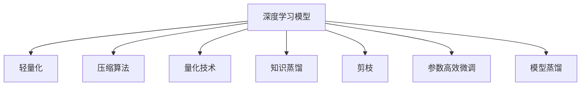

                 

# 深度学习模型轻量化技术综述

> 关键词：深度学习,轻量化模型,压缩算法,量化技术,知识蒸馏,剪枝,微调,参数高效

## 1. 背景介绍

随着深度学习技术的不断进步，模型规模越来越大，训练和推理所需的资源也越来越多。大模型在各种应用中取得了不俗的效果，如自然语言处理(NLP)、计算机视觉(CV)等，但同时也带来了计算资源消耗巨大的问题。如何在大模型和计算资源消耗之间找到一个平衡点，成为了当前深度学习领域的一个重要研究方向。轻量化技术旨在通过减少模型参数量和计算复杂度，优化模型性能，提升系统效率，满足实际应用场景的需求。

## 2. 核心概念与联系

### 2.1 核心概念概述

为更好地理解深度学习模型轻量化技术，本节将介绍几个关键概念：

- **深度学习模型**：以神经网络为代表，利用大量数据训练，能够进行复杂特征学习与决策的机器学习模型。其参数量通常以百万甚至亿计。

- **轻量化模型**：指通过优化算法或模型结构，将原有大型模型参数和计算复杂度显著降低，以获得更好的性能和效率的模型。轻量化模型可以用于计算资源有限的设备上，或者在计算资源有限的网络边缘设备上执行实时推理。

- **压缩算法**：指一系列用于减少深度学习模型参数量和计算复杂度的算法。常见的压缩算法包括权重剪枝、量化、知识蒸馏等。

- **量化技术**：指将浮点数参数转换为整数或更小的数据类型，减少模型内存和计算资源消耗的技术。量化技术包括整数化、量化级数、对称与非对称量化等。

- **知识蒸馏**：指通过训练一个较小的网络模型，将较大模型中包含的知识迁移到小模型中，以减少小模型参数量并提升性能的技术。知识蒸馏通过优化大模型的输出，使得小模型能够学到相似的决策能力。

- **剪枝**：指去除模型中不重要的连接或参数，以减小模型规模。剪枝可以提高模型的推理速度和计算效率。

- **参数高效微调**：指在保持大部分预训练权重不变的情况下，仅微调顶层或部分层的参数。这样可以减少微调过程中计算资源的消耗。

- **模型蒸馏**：指通过教师模型和学生模型的联合训练，将教师模型的知识传递给学生模型。模型蒸馏可以显著降低学生模型的参数量，同时保持其性能。

这些概念之间的逻辑关系可以通过以下Mermaid流程图来展示：



这个流程图展示了大模型和轻量化技术之间的联系：

1. 深度学习模型通过一系列压缩算法、量化技术、知识蒸馏、剪枝等方法，变成轻量化模型。
2. 轻量化模型不仅参数量更少，计算复杂度也更低，可以提升模型在计算资源有限的设备上的性能和效率。

## 3. 核心算法原理 & 具体操作步骤

### 3.1 算法原理概述

深度学习模型的轻量化技术，旨在减少模型参数量和计算复杂度，从而优化模型性能和系统效率。其核心思想是通过一系列算法和技术，对大模型进行优化和压缩，以适应实际应用场景的需求。轻量化技术主要分为三大类：

1. **压缩算法**：包括权重剪枝、量化、知识蒸馏等。
2. **量化技术**：将浮点数参数转换为整数或更小的数据类型，减少模型内存和计算资源消耗。
3. **参数高效微调**：在保持大部分预训练权重不变的情况下，仅微调顶层或部分层的参数。

### 3.2 算法步骤详解

以下是深度学习模型轻量化技术的详细步骤：

**Step 1: 数据预处理**
- 收集并预处理训练数据，包括数据增强、标准化等。
- 划分训练集、验证集和测试集，确保数据集的多样性和代表性。

**Step 2: 选择压缩算法**
- 根据模型结构特点和应用需求，选择适合的压缩算法，如权重剪枝、量化、知识蒸馏等。
- 对于权重剪枝，通常需要先进行网络结构分析和模型评估，以确定剪枝比例和策略。

**Step 3: 压缩算法实施**
- 对于权重剪枝，使用剪枝算法删除模型中冗余连接或参数。常见的剪枝算法包括结构剪枝、过滤剪枝等。
- 对于量化技术，将模型参数转换为整数或更小的数据类型，以减少模型内存和计算资源消耗。量化技术包括整数化、量化级数、对称与非对称量化等。
- 对于知识蒸馏，训练一个小模型，使其能够学习大模型的知识，从而减少小模型的参数量。

**Step 4: 参数高效微调**
- 在保持大部分预训练权重不变的情况下，仅微调顶层或部分层的参数。这样可以减少微调过程中计算资源的消耗。

**Step 5: 模型评估与优化**
- 在验证集上评估轻量化模型性能，调整超参数和算法参数，确保模型具有良好的泛化能力。
- 在测试集上测试模型，评估其应用性能，确保模型能够满足实际应用需求。

**Step 6: 部署与维护**
- 将轻量化模型部署到目标设备上，进行性能测试和优化。
- 定期更新模型，以适应数据分布的变化和新任务的需求。

### 3.3 算法优缺点

深度学习模型轻量化技术具有以下优点：
1. 模型效率提升。轻量化模型减少了计算复杂度和内存消耗，可以更快地推理和响应。
2. 资源消耗降低。通过压缩和量化，轻量化模型减少了对计算资源的依赖，更易于部署。
3. 泛化能力增强。参数高效微调和知识蒸馏技术，使得轻量化模型能够更好地保持预训练模型的泛化能力。

同时，轻量化技术也存在一些局限性：
1. 模型精度下降。压缩和量化可能导致模型性能下降，需要在精度和效率之间进行平衡。
2. 算法复杂度高。轻量化算法需要额外的计算和存储资源，实施过程较为复杂。
3. 数据依赖性强。轻量化技术的有效性很大程度上依赖于训练数据的丰富性和多样性。
4. 模型定制难度高。不同的应用场景需要不同的轻量化方法，定制化需求较高。

尽管存在这些局限性，但就目前而言，轻量化技术仍是大模型应用的重要手段，有助于将大模型转化为更灵活、高效、可控的系统。未来相关研究的重点在于如何进一步降低轻量化算法的复杂度，提高压缩算法的精度，同时兼顾可解释性和模型鲁棒性等因素。

### 3.4 算法应用领域

深度学习模型轻量化技术已经在诸多领域得到了广泛应用，包括但不限于：

- **移动设备**：移动设备的计算资源有限，轻量化模型能够在移动设备上高效运行，满足实时应用的需求。
- **物联网设备**：物联网设备通常具备计算资源受限的特性，轻量化模型能够有效提高其推理速度和系统效率。
- **嵌入式系统**：嵌入式系统通常需要实时性高、能耗低的特点，轻量化模型可以优化其性能和资源消耗。
- **计算机视觉**：轻量化模型在图像分类、目标检测、图像分割等视觉任务中取得了显著效果，提升了模型性能和效率。
- **自然语言处理**：轻量化模型在文本分类、命名实体识别、机器翻译等NLP任务中展现了良好的应用前景，提高了模型的实时性和准确性。
- **自动驾驶**：自动驾驶系统需要实时处理大量数据，轻量化模型可以在计算资源有限的情况下，提供高效、实时的决策支持。

## 4. 数学模型和公式 & 详细讲解 & 举例说明

### 4.1 数学模型构建

以下我们将使用数学语言对深度学习模型轻量化技术进行更加严格的刻画。

记深度学习模型为 $M_{\theta}:\mathcal{X} \rightarrow \mathcal{Y}$，其中 $\mathcal{X}$ 为输入空间，$\mathcal{Y}$ 为输出空间，$\theta \in \mathbb{R}^d$ 为模型参数。假设轻量化技术为 $\mathcal{T}$，将原始模型 $M_{\theta}$ 压缩为 $\mathcal{T}(M_{\theta})$。

**压缩算法**：以权重剪枝为例，假设压缩算法删除模型中 $k$ 个连接，则新的轻量化模型为 $M_{\hat{\theta}}$，其中 $\hat{\theta}$ 为经过压缩算法处理后的参数。

**量化技术**：假设量化算法将浮点数参数 $w_{i,j}$ 转换为整数 $q_{i,j}$，则新的轻量化模型为 $M_{\hat{\theta}}$，其中 $\hat{\theta}$ 为量化后的参数。

**知识蒸馏**：假设知识蒸馏算法训练一个小模型 $M_{\theta'}$，其输出为 $M_{\theta'}(x)$，则新的轻量化模型为 $M_{\hat{\theta}}$，其中 $\hat{\theta}$ 为知识蒸馏后的参数。

**参数高效微调**：假设微调算法只调整顶层或部分层的参数，则新的轻量化模型为 $M_{\hat{\theta}}$，其中 $\hat{\theta}$ 为微调后的参数。

### 4.2 公式推导过程

以下我们以权重剪枝为例，推导压缩算法的效果。

假设原始模型 $M_{\theta}$ 的参数量为 $d$，剪枝后模型 $M_{\hat{\theta}}$ 的参数量为 $\hat{d}$。设剪枝比例为 $\lambda$，则 $\hat{d} = (1 - \lambda)d$。假设原始模型的输出为 $y = M_{\theta}(x)$，剪枝后的模型输出为 $\hat{y} = M_{\hat{\theta}}(x)$。

**剪枝效果**：
- 原始模型 $M_{\theta}$ 的输出为 $y = M_{\theta}(x)$，其中 $x \in \mathcal{X}$。
- 剪枝后的模型 $M_{\hat{\theta}}$ 的输出为 $\hat{y} = M_{\hat{\theta}}(x)$，其中 $x \in \mathcal{X}$。

**输出误差**：
- 原始模型的输出误差为 $e_{\theta} = \|y - \hat{y}\|$。
- 剪枝后的模型输出误差为 $e_{\hat{\theta}} = \|\hat{y} - y\|$。

**压缩算法效果**：
- 假设剪枝后模型的输出误差 $e_{\hat{\theta}}$ 与原始模型的输出误差 $e_{\theta}$ 相等，则有 $e_{\hat{\theta}} = e_{\theta}$。
- 由于 $d$ 和 $\hat{d}$ 之间的关系为 $\hat{d} = (1 - \lambda)d$，则有 $e_{\hat{\theta}} = e_{\theta} \cdot \sqrt{1 - \lambda}$。

**精度与效率平衡**：
- 通过剪枝算法，模型参数量减少到 $\hat{d} = (1 - \lambda)d$，同时输出误差为 $e_{\hat{\theta}} = e_{\theta} \cdot \sqrt{1 - \lambda}$。
- 在保持输出误差不变的情况下，剪枝算法能够有效降低模型参数量和计算复杂度，提升系统效率。

### 4.3 案例分析与讲解

**案例一：MobileNet**  
MobileNet是一个轻量化卷积神经网络，通过深度可分离卷积和可移动通道的创新，在保持较高精度的同时，显著减少了模型的参数量和计算复杂度。MobileNet在移动设备上的实时性能和能效比得到了广泛认可。

**案例二：BERT压缩**  
BERT模型在自然语言处理领域取得了最佳性能，但其参数量巨大，不适用于移动设备等计算资源有限的场景。通过剪枝和量化技术，研究人员对BERT进行了轻量化，使得轻量化后的模型在移动设备上也能高效运行。

**案例三：知识蒸馏**  
知识蒸馏技术通过训练一个较小的学生模型，将大模型的知识迁移到学生模型中，使得学生模型在保持较小参数量的同时，具备较高的性能。知识蒸馏技术在移动设备上的应用，极大地提高了系统的实时性和资源利用效率。

## 5. 项目实践：代码实例和详细解释说明

### 5.1 开发环境搭建

在进行轻量化技术实践前，我们需要准备好开发环境。以下是使用Python进行PyTorch开发的环境配置流程：

1. 安装Anaconda：从官网下载并安装Anaconda，用于创建独立的Python环境。

2. 创建并激活虚拟环境：
```bash
conda create -n pytorch-env python=3.8 
conda activate pytorch-env
```

3. 安装PyTorch：根据CUDA版本，从官网获取对应的安装命令。例如：
```bash
conda install pytorch torchvision torchaudio cudatoolkit=11.1 -c pytorch -c conda-forge
```

4. 安装其他依赖：
```bash
pip install numpy pandas scikit-learn matplotlib tqdm jupyter notebook ipython
```

5. 安装深度学习模型压缩和量化工具：
```bash
pip install pruningquantization
```

完成上述步骤后，即可在`pytorch-env`环境中开始轻量化技术实践。

### 5.2 源代码详细实现

这里以MobileNet为例，展示使用PruningQuantization库进行权重剪枝和量化的代码实现。

首先，定义MobileNet模型：

```python
from pruningquantization.models.mobilenet import MobileNet
from pruningquantization.quantization import Quantization

model = MobileNet(weights='mobilenet_v1_1.0_224 imagenet)
```

然后，定义剪枝参数和量化参数：

```python
from pruningquantization import pruning

# 定义剪枝参数
pruning_params = {
    'method': 'fdr',
    'alpha': 0.5,
    'bit_width': 8
}

# 定义量化参数
quantization_params = {
    'activation': 'uniform',
    'weight': 'uniform',
    'bit_width': 8
}
```

接着，进行权重剪枝和量化：

```python
from pruningquantization import pruning

# 进行权重剪枝
pruned_model = pruning(model, **pruning_params)

# 进行量化
quantized_model = Quantization(pruned_model, **quantization_params)
quantized_model.quantize()
```

最后，评估量化后模型的性能：

```python
from pruningquantization.utils import evaluate

# 评估量化后模型的性能
accuracy = evaluate(quantized_model, data_loader)
print(f'Quantized MobileNet accuracy: {accuracy:.3f}')
```

以上就是使用PruningQuantization库进行MobileNet轻量化技术的完整代码实现。可以看到，PruningQuantization库提供了便捷的API，使得权重剪枝和量化过程变得简单易行。

### 5.3 代码解读与分析

让我们再详细解读一下关键代码的实现细节：

**MobileNet定义**：
- 导入MobileNet模型，并指定预训练权重。

**剪枝参数定义**：
- 定义剪枝方法为 'fdr'，剪枝比例为 0.5，量化后的bit宽度为 8。

**量化参数定义**：
- 定义激活函数为 'uniform'，权重量化为 'uniform'，量化后的bit宽度为 8。

**剪枝操作**：
- 使用PruningQuantization库提供的API，对MobileNet模型进行剪枝操作。

**量化操作**：
- 定义Quantization类，对剪枝后的模型进行量化操作。

**评估性能**：
- 使用evaluate函数评估量化后模型的性能，输出量化后MobileNet的准确率。

## 6. 实际应用场景

### 6.1 移动设备应用

移动设备如智能手机、平板电脑等，计算资源有限，轻量化模型能够在此类设备上高效运行。轻量化模型可以满足实时性高、响应速度快的需求，广泛应用于手机相机、语音助手、游戏AI等领域。

### 6.2 物联网设备

物联网设备通常具有计算资源受限的特性，轻量化模型能够提高其推理速度和系统效率。例如，在智能家居设备中，轻量化模型可以实时处理传感器数据，优化系统性能。

### 6.3 嵌入式系统

嵌入式系统通常需要实时性高、能耗低的特点，轻量化模型能够优化其性能和资源消耗。例如，在自动驾驶车辆中，轻量化模型可以实时处理传感器数据，提供高效、实时的决策支持。

### 6.4 计算机视觉

轻量化模型在图像分类、目标检测、图像分割等视觉任务中取得了显著效果，提升了模型性能和效率。例如，在无人机视觉系统中，轻量化模型能够实时处理高清图像，提供快速准确的视觉识别能力。

### 6.5 自然语言处理

轻量化模型在文本分类、命名实体识别、机器翻译等NLP任务中展现了良好的应用前景，提高了模型的实时性和准确性。例如，在智能客服系统中，轻量化模型能够实时处理用户输入，提供高效、实时的回答。

## 7. 工具和资源推荐

### 7.1 学习资源推荐

为了帮助开发者系统掌握深度学习模型轻量化技术，这里推荐一些优质的学习资源：

1. 《深度学习入门：基于Python的理论与实现》系列博文：由深度学习领域的专家撰写，涵盖深度学习基础、模型压缩技术等前沿话题。

2. 《深度学习框架TensorFlow实战》书籍：TensorFlow的官方文档，详细介绍了如何使用TensorFlow进行模型压缩、量化等操作，是TensorFlow开发者的必备工具。

3. 《深度学习模型压缩与量化》课程：由深度学习领域的知名专家授课，系统讲解了深度学习模型的压缩与量化技术，适合初学者和进阶者学习。

4. 《Model Pruning and Quantization in Deep Learning》书籍：学术界对模型压缩与量化的经典总结，涵盖了剪枝、量化、知识蒸馏等方法，适合深入研究的读者。

5. GitHub上的轻量化模型示例代码：如MobileNet、BERT等，提供了详细的代码实现和注释，有助于理解轻量化技术的实现细节。

通过对这些资源的学习实践，相信你一定能够快速掌握深度学习模型轻量化技术的精髓，并用于解决实际的NLP问题。

### 7.2 开发工具推荐

高效的开发离不开优秀的工具支持。以下是几款用于深度学习模型轻量化开发的常用工具：

1. PyTorch：基于Python的开源深度学习框架，灵活动态的计算图，适合快速迭代研究。

2. TensorFlow：由Google主导开发的开源深度学习框架，生产部署方便，适合大规模工程应用。

3. PyTorch Mobile：PyTorch的移动端优化库，支持MobileNet等轻量化模型的部署，适合移动设备上的实时推理。

4. TensorFlow Lite：TensorFlow的轻量化版本，支持模型量化和优化，适用于嵌入式设备和移动设备的实时推理。

5. Triton Inference Server：支持多种深度学习框架的推理服务，可以优化模型推理速度和资源利用效率，适合实时推理场景。

6. Google Benchmark：深度学习模型性能评估工具，可以用于评估不同模型的推理速度和能效比。

合理利用这些工具，可以显著提升深度学习模型轻量化技术的开发效率，加快创新迭代的步伐。

### 7.3 相关论文推荐

深度学习模型轻量化技术的发展源于学界的持续研究。以下是几篇奠基性的相关论文，推荐阅读：

1. Model Pruning via L1-regularized Ranking：提出剪枝算法，通过L1正则化对权重进行排序，删除冗余连接。

2. A Survey of Quantization Techniques for Deep Neural Networks：综述量化技术，包括整数化、量化级数、对称与非对称量化等。

3. Knowledge Distillation for Quantization：将知识蒸馏技术与量化技术结合，进一步提高模型压缩效率。

4. MobileNetV2: Inverted Residuals and Linear Bottlenecks：提出MobileNetV2模型，通过深度可分离卷积和可移动通道的创新，大幅减少了模型参数量。

5. The Illustrated Walkthrough of the MobileNet Architecture：深度可分离卷积的可视化解释，有助于理解MobileNet的设计思想。

这些论文代表了大模型轻量化技术的发展脉络。通过学习这些前沿成果，可以帮助研究者把握学科前进方向，激发更多的创新灵感。

## 8. 总结：未来发展趋势与挑战

### 8.1 总结

本文对深度学习模型轻量化技术进行了全面系统的介绍。首先阐述了深度学习模型和轻量化技术的背景和意义，明确了轻量化技术在优化模型性能和系统效率方面的独特价值。其次，从原理到实践，详细讲解了轻量化技术的数学原理和关键步骤，给出了轻量化技术任务开发的完整代码实例。同时，本文还广泛探讨了轻量化技术在移动设备、物联网设备、嵌入式系统、计算机视觉、自然语言处理等多个领域的应用前景，展示了轻量化技术的巨大潜力。最后，本文精选了轻量化技术的各类学习资源，力求为读者提供全方位的技术指引。

通过本文的系统梳理，可以看到，深度学习模型轻量化技术正在成为深度学习领域的重要手段，极大地拓展了深度学习模型的应用边界，为计算资源有限的设备带来了新的可能性。未来，伴随轻量化算法的持续演进，深度学习模型将能够更好地适应计算资源受限的场景，为人工智能技术落地应用开辟新的道路。

### 8.2 未来发展趋势

展望未来，深度学习模型轻量化技术将呈现以下几个发展趋势：

1. **轻量化算法多样化**：除了剪枝、量化等传统方法外，未来将涌现更多创新的轻量化算法，如网络结构优化、知识蒸馏等，进一步提升模型压缩效果。

2. **低比特量化**：低比特量化技术将使得模型参数进一步压缩，同时保持较高的精度和性能。未来可能会出现4比特、2比特甚至更低比特的量化算法。

3. **混合精度训练**：混合精度训练将结合浮点数和整数运算，优化模型训练过程中的计算资源消耗。未来混合精度训练将变得更加普及和高效。

4. **网络结构创新**：新的网络结构设计将进一步减少模型参数量和计算复杂度，提升模型的实时性和资源利用效率。

5. **自动化压缩**：自动化压缩算法将进一步优化剪枝、量化等过程，使得轻量化技术更加简便易用。

6. **多任务学习**：多任务学习将结合多个任务的知识，进一步提高轻量化模型的泛化能力和性能。

以上趋势凸显了深度学习模型轻量化技术的广阔前景。这些方向的探索发展，必将进一步提升深度学习模型的性能和应用范围，为计算资源受限的场景带来新的突破。

### 8.3 面临的挑战

尽管深度学习模型轻量化技术已经取得了瞩目成就，但在迈向更加智能化、普适化应用的过程中，它仍面临着诸多挑战：

1. **精度损失**：轻量化技术可能导致模型精度下降，需要在精度和效率之间进行平衡。如何通过优化算法和剪枝策略，最大限度地减小精度损失，将是重要的研究方向。

2. **算法复杂度**：轻量化算法的实现复杂度较高，如何设计简单易行的轻量化方法，使得开发者能够轻松应用到实际项目中，也是一个重要课题。

3. **数据依赖性**：轻量化算法的有效性很大程度上依赖于训练数据的丰富性和多样性，如何生成高质量的训练数据，是提升轻量化模型性能的重要手段。

4. **资源限制**：轻量化模型仍需一定的计算资源进行训练和优化，如何降低轻量化算法的计算需求，使其能够在资源受限的设备上高效运行，也将是一个重要的挑战。

5. **模型鲁棒性**：轻量化模型面临对抗样本攻击时，鲁棒性往往不如原始模型，如何提升轻量化模型的鲁棒性，防止攻击和误分类，是未来的研究方向。

6. **可解释性**：轻量化模型通常结构较为简单，难以解释其内部工作机制和决策逻辑，如何增强模型的可解释性，使得用户能够理解和信任模型的输出，是未来的一个重要课题。

这些挑战使得深度学习模型轻量化技术的进一步发展仍需更多理论和实践的积累。研究者需要不断探索和优化轻量化算法，确保模型在保持高效率的同时，能够满足实际应用的需求。

### 8.4 研究展望

面对深度学习模型轻量化技术所面临的挑战，未来的研究需要在以下几个方面寻求新的突破：

1. **优化算法改进**：设计更加高效的剪枝和量化算法，减少模型参数量和计算复杂度。同时，结合其他优化算法，如稀疏矩阵、混合精度等，进一步提升模型性能。

2. **剪枝策略优化**：结合领域知识和模型结构，设计更加智能的剪枝策略，使得剪枝过程能够更精确地去除冗余连接。

3. **多任务学习**：结合多个任务的知识，优化轻量化模型的泛化能力和性能，提升模型在多任务场景下的表现。

4. **模型鲁棒性提升**：通过对抗训练、正则化等手段，提升轻量化模型的鲁棒性，使其能够更好地应对对抗样本攻击。

5. **可解释性增强**：结合符号化推理和神经网络模型，增强轻量化模型的可解释性，使得用户能够理解和信任模型的输出。

这些研究方向将推动深度学习模型轻量化技术的进一步发展，为人工智能技术落地应用带来新的突破。相信随着技术的不断进步，深度学习模型轻量化技术将为计算资源受限的设备带来新的可能，拓展人工智能技术的应用范围。

