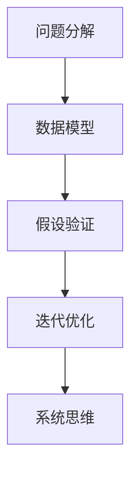

                 

# 深度思考:直击问题本质的利器

> 关键词：深度思考, 问题本质, 算法原理, 计算复杂性, 人工智能

## 1. 背景介绍

### 1.1 问题由来
在信息化时代，数据如海啸般涌入我们的生活，面对爆炸式增长的信息，如何在茫茫数据中直击问题的本质，找出最优解决方案，成为了每一个从事人工智能和数据科学工作者的日常挑战。深度思考是一种强大的思维工具，它可以帮助我们从复杂问题中抽丝剥茧，看清问题的本质，并找出解决之道。

### 1.2 问题核心关键点
深度思考的核心关键点包括但不限于以下几个方面：

- **数据分析**：深度思考离不开对数据的全面分析和理解，能够从数据中提炼出关键信息，洞察其背后的规律和趋势。
- **问题建模**：将问题抽象为数学或逻辑模型，用科学的方法探索问题的本质。
- **假设检验**：建立假设，通过实验或逻辑推理验证其正确性，不断修正和优化假设，逐步逼近问题真相。
- **迭代优化**：不断试错，快速调整策略，以最小的代价实现目标最优。
- **系统思维**：综合考虑问题各要素的关联性和整体性，避免陷入局部最优。

这些关键点构成了深度思考的核心理念，是解决复杂问题不可或缺的步骤。

### 1.3 问题研究意义
深度思考是人工智能领域的一种重要思维方法，对于提升人工智能算法的准确性和效率，优化决策过程，具有重要意义。

1. **算法优化**：深度思考能够帮助开发者更好地理解算法原理，发现算法中的瓶颈和缺陷，提出改进方案。
2. **问题解决**：深度思考为解决复杂问题提供了系统化的思维框架，能够帮助从业者更高效地找到问题的关键，实现创新突破。
3. **团队协作**：深度思考鼓励团队成员进行深度交流，激发更多的创新灵感，推动团队整体水平的提升。

## 2. 核心概念与联系

### 2.1 核心概念概述

深度思考是人工智能领域的一种高级思维模式，其核心理念是通过系统性分析和思维推导，逐步逼近问题本质。核心概念包括：

- **问题分解**：将复杂问题分解为可管理的小模块，逐一解决。
- **数据模型**：使用数学、逻辑等工具建立问题的模型，用科学的方法进行分析和推断。
- **假设验证**：通过实验或推理验证假设的正确性，修正假设，逐步逼近真相。
- **迭代优化**：在解决问题的过程中不断试错和调整策略，快速找到最优方案。
- **系统思维**：从全局角度综合考虑问题各要素的关系，避免陷入局部最优。

### 2.2 核心概念原理和架构的 Mermaid 流程图



这个流程图展示了深度思考的主要步骤：

1. **问题分解**：将复杂问题拆解成可管理的小模块。
2. **数据模型**：使用数学、逻辑等工具建立问题的模型。
3. **假设验证**：通过实验或推理验证假设的正确性，修正假设。
4. **迭代优化**：在解决问题的过程中不断试错和调整策略。
5. **系统思维**：从全局角度综合考虑问题各要素的关系。

## 3. 核心算法原理 & 具体操作步骤

### 3.1 算法原理概述

深度思考虽然不直接涉及具体的算法，但其背后的系统化分析和推理方法，对算法设计有着深远影响。深度思考可以帮助开发者理解算法原理，找到优化方案，提升算法性能。

### 3.2 算法步骤详解

深度思考的步骤通常包括：

1. **问题定义**：明确问题的边界和目标，确定解决问题的具体步骤。
2. **数据收集与分析**：收集与问题相关的数据，进行数据清洗和特征提取，建立数据模型。
3. **假设验证**：基于数据模型提出假设，设计实验验证假设的正确性。
4. **迭代优化**：根据实验结果调整假设，不断试错，逐步逼近最优解。
5. **结果验证**：通过对比实验结果与预期目标，验证算法的正确性和有效性。

### 3.3 算法优缺点

深度思考的优势包括：

- **系统性**：通过逐步分析和验证，深度思考能够全面系统地解决复杂问题。
- **创新性**：深度思考鼓励创新思维，有助于发现新方法和解决方案。
- **验证性**：通过实验验证假设的正确性，确保解决方案的有效性。

但深度思考也存在一些局限：

- **复杂度**：深度思考需要较高的时间和精力投入，对于复杂问题可能耗时较长。
- **依赖数据**：深度思考依赖于数据的质量和量级，数据质量不高时可能难以得到准确的结论。
- **主观性强**：假设的设定和推理方法可能受主观因素影响，导致结果偏差。

### 3.4 算法应用领域

深度思考广泛应用于人工智能的各个领域，包括但不限于：

- **机器学习**：通过系统化分析和推理，提升算法的准确性和效率。
- **自然语言处理**：理解语言模型和算法原理，提出改进方案。
- **计算机视觉**：分析图像和视频数据，寻找问题解决方案。
- **语音识别**：理解声学模型和算法原理，优化识别效果。
- **机器人学**：分析机器人行为，优化决策和控制算法。

## 4. 数学模型和公式 & 详细讲解 & 举例说明

### 4.1 数学模型构建

深度思考的数学模型构建通常涉及统计学、线性代数、概率论等领域。这里以线性回归为例，展示如何构建数学模型：

设有一组数据集 $\{(x_i, y_i)\}_{i=1}^N$，其中 $x_i$ 为自变量，$y_i$ 为因变量。线性回归模型假设因变量与自变量之间存在线性关系：

$$
y_i = \beta_0 + \beta_1 x_i + \epsilon_i
$$

其中 $\beta_0$ 和 $\beta_1$ 为模型参数，$\epsilon_i$ 为误差项，假设其服从均值为0、方差为 $\sigma^2$ 的正态分布。

### 4.2 公式推导过程

线性回归模型的最小二乘解为：

$$
\hat{\beta} = (X^T X)^{-1} X^T y
$$

其中 $X = \begin{bmatrix} 1 & x_1 \\ 1 & x_2 \\ \vdots & \vdots \\ 1 & x_N \end{bmatrix}$，$y = \begin{bmatrix} y_1 \\ y_2 \\ \vdots \\ y_N \end{bmatrix}$。

推导过程如下：

1. **误差平方和**：定义误差平方和 $J(\beta) = \sum_{i=1}^N (y_i - \hat{y}_i)^2$，其中 $\hat{y}_i = \beta_0 + \beta_1 x_i$。

2. **导数求解**：对 $J(\beta)$ 关于 $\beta_0$ 和 $\beta_1$ 求导，得：

$$
\frac{\partial J(\beta)}{\partial \beta_0} = -2\sum_{i=1}^N (y_i - \hat{y}_i) \\
\frac{\partial J(\beta)}{\partial \beta_1} = -2\sum_{i=1}^N (y_i - \hat{y}_i) x_i
$$

3. **最小化误差**：将导数设为0，求解最小值，得：

$$
\hat{\beta}_0 = \frac{\sum_{i=1}^N (y_i - \bar{y})}{\sum_{i=1}^N (x_i - \bar{x})^2} \\
\hat{\beta}_1 = \frac{\sum_{i=1}^N (x_i - \bar{x})(y_i - \bar{y})}{\sum_{i=1}^N (x_i - \bar{x})^2}
$$

其中 $\bar{x}$ 和 $\bar{y}$ 为自变量和因变量的均值。

### 4.3 案例分析与讲解

以房价预测为例，假设有一组房屋数据集，其中包含房屋面积、房间数、地理位置等信息，以及相应的房价。我们可以使用线性回归模型来预测新房屋的房价。

1. **数据准备**：收集房屋数据，包括面积、房间数、地理位置等，以及相应的房价。
2. **数据预处理**：对数据进行清洗、归一化、特征工程等预处理。
3. **模型建立**：构建线性回归模型，使用最小二乘法求解参数 $\beta_0$ 和 $\beta_1$。
4. **结果验证**：使用测试集验证模型的准确性，调整参数和模型结构，以提高预测效果。
5. **应用部署**：将模型部署到生产环境，实时预测新房屋的房价。

## 5. 项目实践：代码实例和详细解释说明

### 5.1 开发环境搭建

使用Python和PyTorch搭建深度思考实践环境，需要安装相关依赖：

```bash
conda create -n deep_learning python=3.8
conda activate deep_learning
pip install torch numpy pandas scikit-learn torchvision transformers
```

### 5.2 源代码详细实现

以下是一个简单的线性回归模型实现，包含数据准备、模型训练、结果验证等步骤：

```python
import numpy as np
from sklearn.linear_model import LinearRegression

# 数据准备
X = np.array([[1, 2], [3, 4], [5, 6]])
y = np.array([1, 2, 3])

# 模型训练
model = LinearRegression()
model.fit(X, y)

# 结果验证
X_test = np.array([[7, 8], [9, 10]])
y_pred = model.predict(X_test)

print(y_pred)
```

### 5.3 代码解读与分析

**数据准备**：使用NumPy库构建自变量 $X$ 和因变量 $y$ 的数组。

**模型训练**：使用Scikit-Learn库中的线性回归模型，调用 `fit` 方法训练模型。

**结果验证**：使用测试数据 $X_test$ 进行预测，输出预测结果。

## 6. 实际应用场景

### 6.1 金融风控

在金融风控领域，深度思考可以帮助分析交易数据，识别异常交易行为，预防欺诈风险。通过系统化分析和推理，找到数据中的异常模式和潜在风险，制定相应的风控策略。

### 6.2 医疗诊断

在医疗诊断领域，深度思考可以帮助分析病历数据，寻找病因和症状之间的关系，提高诊断准确性。通过系统化分析和推理，建立数学模型，识别出影响疾病发展的关键因素。

### 6.3 智能推荐

在智能推荐领域，深度思考可以帮助分析用户行为数据，寻找兴趣和行为之间的关系，优化推荐算法。通过系统化分析和推理，建立数学模型，预测用户对商品的兴趣，实现个性化推荐。

### 6.4 未来应用展望

未来，深度思考将在更多领域得到应用，为复杂问题提供系统化解决方案：

1. **智能制造**：通过深度思考优化生产流程，提高生产效率和产品质量。
2. **环境保护**：分析环境数据，识别出污染源和污染模式，提出环境保护方案。
3. **城市管理**：分析城市数据，优化城市规划和管理，提升城市运行效率。
4. **智能交通**：分析交通数据，优化交通管理，提高交通效率和安全性。

## 7. 工具和资源推荐

### 7.1 学习资源推荐

- **《深度学习》课程**：斯坦福大学的深度学习课程，系统讲解深度学习的基本概念和应用。
- **《机器学习实战》书籍**：介绍了机器学习的基本原理和应用，包含大量代码实现。
- **《Python数据科学手册》书籍**：全面介绍了Python在数据科学中的应用，包含大量实战案例。

### 7.2 开发工具推荐

- **PyTorch**：开源深度学习框架，支持动态计算图和模型优化。
- **Scikit-Learn**：开源机器学习库，包含多种算法和工具。
- **Jupyter Notebook**：交互式编程环境，方便编写和测试代码。

### 7.3 相关论文推荐

- **《深度学习》书籍**：Ian Goodfellow等著，全面介绍了深度学习的基本原理和应用。
- **《机器学习》书籍**：Tom Mitchell著，介绍了机器学习的基本概念和算法。
- **《Python数据科学手册》书籍**：Jake VanderPlas著，全面介绍了Python在数据科学中的应用。

## 8. 总结：未来发展趋势与挑战

### 8.1 研究成果总结

深度思考作为人工智能领域的高级思维模式，已经被广泛应用于多个领域，并取得了显著成效。未来，深度思考将在更多领域发挥重要作用，为复杂问题提供系统化解决方案。

### 8.2 未来发展趋势

深度思考的发展趋势包括：

1. **自动化**：随着AI技术的发展，深度思考将更多地应用于自动化领域，提升工作效率。
2. **跨领域**：深度思考将更多地应用于跨领域问题，综合多种数据和知识，提供全面解决方案。
3. **实时化**：深度思考将更多地应用于实时数据处理，提高决策的及时性和准确性。

### 8.3 面临的挑战

深度思考在应用过程中也面临一些挑战：

1. **数据质量**：深度思考依赖于高质量的数据，数据质量不高时难以得到准确的结论。
2. **算法复杂度**：深度思考需要较高的时间和精力投入，对于复杂问题可能耗时较长。
3. **模型泛化**：深度思考建立模型时需要考虑模型泛化性，避免过拟合。

### 8.4 研究展望

未来的深度思考研究将侧重于以下几个方面：

1. **数据处理**：研究高效的数据处理和预处理方法，提升数据质量。
2. **模型优化**：研究高效的模型构建和优化方法，提升算法效率和效果。
3. **自动化**：研究自动化的深度思考方法，提升应用场景的灵活性和可操作性。

## 9. 附录：常见问题与解答

**Q1：如何提高深度思考的效率？**

A: 提高深度思考的效率可以从以下几个方面入手：

1. **工具使用**：使用自动化工具，如Jupyter Notebook、PyTorch等，快速构建和验证模型。
2. **模型优化**：采用高效的模型构建和优化方法，如梯度下降、随机梯度下降等。
3. **数据处理**：使用数据预处理和特征工程方法，提升数据质量。

**Q2：深度思考在解决复杂问题时需要注意哪些问题？**

A: 深度思考在解决复杂问题时需要注意以下几个问题：

1. **数据质量**：保证数据的高质量，避免数据偏差和噪声。
2. **模型泛化**：建立模型时需要考虑模型泛化性，避免过拟合。
3. **假设验证**：通过实验或推理验证假设的正确性，不断调整策略。

**Q3：深度思考和机器学习有什么区别？**

A: 深度思考和机器学习的区别主要在于：

1. **方法论**：深度思考是一种系统化的思维方法，而机器学习是一种算法和模型。
2. **目标**：深度思考的目标是理解问题的本质，找到最优解决方案；机器学习的目标是训练模型，提高预测准确性。
3. **应用范围**：深度思考适用于各种复杂问题，而机器学习主要应用于数据驱动的问题。

**Q4：深度思考在实际应用中如何处理数据？**

A: 深度思考在实际应用中处理数据通常包括以下步骤：

1. **数据收集**：收集与问题相关的数据。
2. **数据清洗**：对数据进行清洗和预处理，去除噪声和异常值。
3. **特征提取**：对数据进行特征提取，选择合适的特征作为模型输入。
4. **数据建模**：使用数学、逻辑等工具建立问题的模型。

**Q5：深度思考和传统思维有什么区别？**

A: 深度思考和传统思维的区别主要在于：

1. **系统性**：深度思考是一种系统化的思维方法，能够全面分析问题；传统思维可能局限于局部，缺乏系统性。
2. **深度**：深度思考能够深入挖掘问题的本质，找到最优解决方案；传统思维可能停留在表面，难以深入分析。
3. **创新性**：深度思考鼓励创新思维，提出新方法和解决方案；传统思维可能缺乏创新性，缺乏突破。

---

作者：禅与计算机程序设计艺术 / Zen and the Art of Computer Programming

