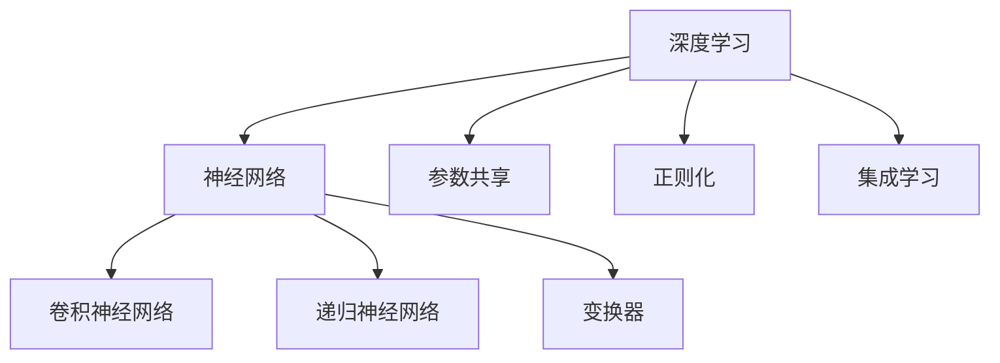
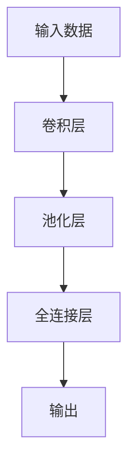

                 

## 1. 背景介绍

### 1.1 问题由来

在快速发展的信息技术时代，如何有效地利用数据和算法解决复杂问题已成为业界关注的焦点。深度学习技术，尤其是深度神经网络在图像识别、语音识别、自然语言处理等诸多领域取得显著成效，其背后的核心驱动力是深度思考的能力，即通过构建深层网络结构和复杂的模型参数，让机器从海量数据中学习到复杂的特征表示和关联模式，从而提升问题解决的精度和泛化能力。

### 1.2 问题核心关键点

深度思考的核心在于能够理解问题，并找到有效的解决方案。其关键点在于以下几个方面：

- **数据理解**：对数据进行预处理，提取关键特征，理解数据分布。
- **模型选择**：选择适合问题的模型结构，如卷积神经网络（CNN）、递归神经网络（RNN）、变换器（Transformer）等。
- **超参数优化**：调节模型参数，找到最优解。
- **模型训练**：通过反向传播算法，更新模型参数。
- **模型评估**：使用测试数据集评估模型性能。

这些问题点贯穿于深度学习模型的构建和训练过程，是模型能够从数据中学习并有效解决问题的关键步骤。

### 1.3 问题研究意义

深度思考能力在大数据时代尤为重要，其研究意义如下：

- **提升问题解决效率**：深度学习能够自动化复杂的数据处理和模型构建，提升问题解决的速度和精度。
- **拓展应用范围**：深度思考能力使得深度学习模型可以应用到更多领域，如医疗、金融、智能交通等。
- **推动技术创新**：深度思考的理论与方法推动了深度学习技术的发展，不断涌现新的模型和算法。
- **促进学术与产业融合**：深度思考技术的应用，推动了学术研究与产业应用的紧密结合。

## 2. 核心概念与联系

### 2.1 核心概念概述

为了更好地理解深度思考在深度学习中的作用，本节将介绍几个密切相关的核心概念：

- **深度学习（Deep Learning）**：一种基于多层神经网络的学习方法，能够处理复杂的数据结构和关系。
- **神经网络（Neural Network）**：由大量人工神经元构成的一种数学模型，可以处理非线性关系。
- **卷积神经网络（Convolutional Neural Network, CNN）**：一种专门用于图像处理的任务，能够提取图像中的局部特征。
- **递归神经网络（Recurrent Neural Network, RNN）**：一种适用于序列数据（如文本、音频）的神经网络，能够处理变长序列数据。
- **变换器（Transformer）**：一种通过自注意力机制进行信息交互的模型，适用于序列数据的生成和分类。
- **参数共享**：通过共享模型参数，减少模型大小和计算量。
- **正则化**：通过L2正则、Dropout等技术，避免模型过拟合。
- **集成学习**：通过多个模型的组合，提升预测准确性。

这些核心概念之间的关系可以用以下的Mermaid流程图表示：



## 3. 核心算法原理 & 具体操作步骤

### 3.1 算法原理概述

深度思考在深度学习中的具体实现通常是通过神经网络的多层结构来实现。模型的核心在于其学习机制，即通过前向传播计算输出，并通过反向传播计算梯度，更新模型参数。深度思考的过程如下：

1. **数据准备**：对数据进行预处理，包括数据清洗、特征提取、归一化等步骤。
2. **模型构建**：根据问题类型选择合适的模型结构，如卷积层、循环层、全连接层等。
3. **前向传播**：将输入数据输入模型，通过多层的非线性变换，得到模型的预测输出。
4. **损失计算**：计算模型输出与真实标签之间的差距，即损失函数。
5. **反向传播**：通过反向传播算法计算梯度，更新模型参数。
6. **模型评估**：使用测试数据集评估模型性能，选择最优模型。

### 3.2 算法步骤详解

以下详细讲解深度思考在深度学习中的应用步骤：

#### 3.2.1 数据准备

对数据进行预处理，包括数据清洗、特征提取、归一化等步骤。例如，对于图像数据，可以将其转换为张量形式，并进行归一化处理。

```python
import torch
import torchvision.transforms as transforms
from torchvision import datasets

# 定义数据预处理管道
transform = transforms.Compose([
    transforms.ToTensor(),
    transforms.Normalize((0.5, 0.5, 0.5), (0.5, 0.5, 0.5))
])

# 加载数据集并进行预处理
trainset = datasets.CIFAR10(root='./data', train=True,
                            download=True, transform=transform)
trainloader = torch.utils.data.DataLoader(trainset, batch_size=64,
                                          shuffle=True, num_workers=2)
```

#### 3.2.2 模型构建

根据问题类型选择合适的模型结构，如卷积层、循环层、全连接层等。例如，对于图像分类任务，可以使用卷积神经网络（CNN）。

```python
import torch.nn as nn
import torch.nn.functional as F

# 定义CNN模型
class Net(nn.Module):
    def __init__(self):
        super(Net, self).__init__()
        self.conv1 = nn.Conv2d(3, 6, 5)
        self.pool = nn.MaxPool2d(2, 2)
        self.conv2 = nn.Conv2d(6, 16, 5)
        self.fc1 = nn.Linear(16 * 5 * 5, 120)
        self.fc2 = nn.Linear(120, 84)
        self.fc3 = nn.Linear(84, 10)

    def forward(self, x):
        x = self.pool(F.relu(self.conv1(x)))
        x = self.pool(F.relu(self.conv2(x)))
        x = x.view(-1, 16 * 5 * 5)
        x = F.relu(self.fc1(x))
        x = F.relu(self.fc2(x))
        x = self.fc3(x)
        return x

# 实例化模型
net = Net()
```

#### 3.2.3 前向传播

将输入数据输入模型，通过多层的非线性变换，得到模型的预测输出。

```python
import torch

# 加载数据集并进行预处理
trainset = datasets.CIFAR10(root='./data', train=True,
                            download=True, transform=transform)
trainloader = torch.utils.data.DataLoader(trainset, batch_size=64,
                                          shuffle=True, num_workers=2)

# 定义训练循环
for epoch in range(2):
    for i, data in enumerate(trainloader, 0):
        # 获取输入数据
        inputs, labels = data

        # 将输入数据传入模型进行前向传播
        outputs = net(inputs)
        loss = F.cross_entropy(outputs, labels)
```

#### 3.2.4 损失计算

计算模型输出与真实标签之间的差距，即损失函数。

```python
# 计算损失函数
loss = F.cross_entropy(outputs, labels)
```

#### 3.2.5 反向传播

通过反向传播算法计算梯度，更新模型参数。

```python
# 计算梯度并更新模型参数
optimizer.zero_grad()
loss.backward()
optimizer.step()
```

#### 3.2.6 模型评估

使用测试数据集评估模型性能，选择最优模型。

```python
import torch

# 加载测试数据集并进行预处理
testset = datasets.CIFAR10(root='./data', train=False,
                           download=True, transform=transform)
testloader = torch.utils.data.DataLoader(testset, batch_size=64,
                                         shuffle=False, num_workers=2)

# 定义测试循环
with torch.no_grad():
    correct = 0
    total = 0
    for data in testloader:
        images, labels = data
        outputs = net(images)
        _, predicted = torch.max(outputs.data, 1)
        total += labels.size(0)
        correct += (predicted == labels).sum().item()

    print('Accuracy of the network on the 10000 test images: {} %'.format(
        100 * correct / total))
```

### 3.3 算法优缺点

深度思考在深度学习中的应用有以下优点：

- **复杂数据处理**：能够处理高维数据和复杂数据结构。
- **特征自动提取**：自动提取数据中的关键特征，提升模型精度。
- **泛化能力强**：通过大量数据训练，模型能够泛化到新数据。

同时，也存在一些缺点：

- **计算资源需求高**：需要大量计算资源，如GPU和TPU。
- **模型复杂度高**：构建和训练复杂模型需要较长时间。
- **过拟合风险高**：在训练过程中容易过拟合，导致模型泛化能力下降。

### 3.4 算法应用领域

深度思考在多个领域得到广泛应用，如计算机视觉、自然语言处理、语音识别等。具体应用如下：

- **计算机视觉**：图像分类、物体检测、人脸识别等。
- **自然语言处理**：文本分类、情感分析、机器翻译等。
- **语音识别**：语音识别、语音合成等。
- **推荐系统**：个性化推荐、广告推荐等。

## 4. 数学模型和公式 & 详细讲解 & 举例说明

### 4.1 数学模型构建

深度学习的数学模型通常基于神经网络。以卷积神经网络（CNN）为例，其模型结构如图1所示。



图1: CNN模型结构

### 4.2 公式推导过程

以CNN为例，其前向传播过程如下：

$$
y = \sigma (\mathbf{W} \mathbf{x} + \mathbf{b})
$$

其中 $\mathbf{x}$ 为输入数据，$\mathbf{W}$ 为卷积核权重，$\mathbf{b}$ 为偏置项，$\sigma$ 为激活函数。

在反向传播过程中，损失函数 $L$ 对 $\mathbf{W}$ 的梯度为：

$$
\frac{\partial L}{\partial \mathbf{W}} = \frac{\partial L}{\partial y} \frac{\partial y}{\partial \mathbf{W}}
$$

其中 $\frac{\partial L}{\partial y}$ 为损失函数对输出的梯度，$\frac{\partial y}{\partial \mathbf{W}}$ 为输出对权重 $\mathbf{W}$ 的导数。

### 4.3 案例分析与讲解

以图像分类任务为例，通过CNN模型进行分类。

```python
import torch
import torch.nn as nn
import torchvision.transforms as transforms
from torchvision.datasets import CIFAR10
from torch.utils.data import DataLoader

# 定义数据预处理管道
transform = transforms.Compose([
    transforms.ToTensor(),
    transforms.Normalize((0.5, 0.5, 0.5), (0.5, 0.5, 0.5))
])

# 加载数据集并进行预处理
trainset = CIFAR10(root='./data', train=True,
                   download=True, transform=transform)
trainloader = DataLoader(trainset, batch_size=64,
                         shuffle=True, num_workers=2)

# 定义CNN模型
class Net(nn.Module):
    def __init__(self):
        super(Net, self).__init__()
        self.conv1 = nn.Conv2d(3, 6, 5)
        self.pool = nn.MaxPool2d(2, 2)
        self.conv2 = nn.Conv2d(6, 16, 5)
        self.fc1 = nn.Linear(16 * 5 * 5, 120)
        self.fc2 = nn.Linear(120, 84)
        self.fc3 = nn.Linear(84, 10)

    def forward(self, x):
        x = self.pool(F.relu(self.conv1(x)))
        x = self.pool(F.relu(self.conv2(x)))
        x = x.view(-1, 16 * 5 * 5)
        x = F.relu(self.fc1(x))
        x = F.relu(self.fc2(x))
        x = self.fc3(x)
        return x

# 实例化模型
net = Net()

# 定义优化器
optimizer = torch.optim.Adam(net.parameters(), lr=0.001)

# 定义训练循环
for epoch in range(2):
    for i, data in enumerate(trainloader, 0):
        # 获取输入数据
        inputs, labels = data

        # 将输入数据传入模型进行前向传播
        outputs = net(inputs)
        loss = F.cross_entropy(outputs, labels)

        # 计算梯度并更新模型参数
        optimizer.zero_grad()
        loss.backward()
        optimizer.step()

# 模型评估
testset = CIFAR10(root='./data', train=False,
                  download=True, transform=transform)
testloader = DataLoader(testset, batch_size=64,
                        shuffle=False, num_workers=2)

with torch.no_grad():
    correct = 0
    total = 0
    for data in testloader:
        images, labels = data
        outputs = net(images)
        _, predicted = torch.max(outputs.data, 1)
        total += labels.size(0)
        correct += (predicted == labels).sum().item()

print('Accuracy of the network on the 10000 test images: {} %'.format(
    100 * correct / total))
```

## 5. 项目实践：代码实例和详细解释说明

### 5.1 开发环境搭建

在开始深度思考的应用之前，需要准备开发环境。以下是使用Python进行PyTorch开发的环境配置流程：

1. 安装Anaconda：从官网下载并安装Anaconda，用于创建独立的Python环境。

2. 创建并激活虚拟环境：
```bash
conda create -n pytorch-env python=3.8 
conda activate pytorch-env
```

3. 安装PyTorch：根据CUDA版本，从官网获取对应的安装命令。例如：
```bash
conda install pytorch torchvision torchaudio cudatoolkit=11.1 -c pytorch -c conda-forge
```

4. 安装Transformers库：
```bash
pip install transformers
```

5. 安装各类工具包：
```bash
pip install numpy pandas scikit-learn matplotlib tqdm jupyter notebook ipython
```

完成上述步骤后，即可在`pytorch-env`环境中开始深度思考的应用实践。

### 5.2 源代码详细实现

以下是一个深度思考应用的完整代码实例：

```python
import torch
import torch.nn as nn
import torchvision.transforms as transforms
from torchvision.datasets import CIFAR10
from torch.utils.data import DataLoader

# 定义数据预处理管道
transform = transforms.Compose([
    transforms.ToTensor(),
    transforms.Normalize((0.5, 0.5, 0.5), (0.5, 0.5, 0.5))
])

# 加载数据集并进行预处理
trainset = CIFAR10(root='./data', train=True,
                   download=True, transform=transform)
trainloader = DataLoader(trainset, batch_size=64,
                         shuffle=True, num_workers=2)

# 定义CNN模型
class Net(nn.Module):
    def __init__(self):
        super(Net, self).__init__()
        self.conv1 = nn.Conv2d(3, 6, 5)
        self.pool = nn.MaxPool2d(2, 2)
        self.conv2 = nn.Conv2d(6, 16, 5)
        self.fc1 = nn.Linear(16 * 5 * 5, 120)
        self.fc2 = nn.Linear(120, 84)
        self.fc3 = nn.Linear(84, 10)

    def forward(self, x):
        x = self.pool(F.relu(self.conv1(x)))
        x = self.pool(F.relu(self.conv2(x)))
        x = x.view(-1, 16 * 5 * 5)
        x = F.relu(self.fc1(x))
        x = F.relu(self.fc2(x))
        x = self.fc3(x)
        return x

# 实例化模型
net = Net()

# 定义优化器
optimizer = torch.optim.Adam(net.parameters(), lr=0.001)

# 定义训练循环
for epoch in range(2):
    for i, data in enumerate(trainloader, 0):
        # 获取输入数据
        inputs, labels = data

        # 将输入数据传入模型进行前向传播
        outputs = net(inputs)
        loss = F.cross_entropy(outputs, labels)

        # 计算梯度并更新模型参数
        optimizer.zero_grad()
        loss.backward()
        optimizer.step()

# 模型评估
testset = CIFAR10(root='./data', train=False,
                  download=True, transform=transform)
testloader = DataLoader(testset, batch_size=64,
                        shuffle=False, num_workers=2)

with torch.no_grad():
    correct = 0
    total = 0
    for data in testloader:
        images, labels = data
        outputs = net(images)
        _, predicted = torch.max(outputs.data, 1)
        total += labels.size(0)
        correct += (predicted == labels).sum().item()

print('Accuracy of the network on the 10000 test images: {} %'.format(
    100 * correct / total))
```

### 5.3 代码解读与分析

让我们再详细解读一下关键代码的实现细节：

**定义数据预处理管道**：
- `transforms.Compose`：将多个预处理步骤组合在一起。
- `transforms.ToTensor()`：将PIL图像转换为张量形式。
- `transforms.Normalize()`：对输入数据进行归一化处理。

**定义CNN模型**：
- `nn.Conv2d`：定义卷积层。
- `nn.MaxPool2d`：定义池化层。
- `nn.Linear`：定义全连接层。

**实例化模型**：
- `Net()`：实例化定义的CNN模型。

**定义优化器**：
- `torch.optim.Adam`：定义Adam优化器。

**训练循环**：
- 前向传播：将输入数据传入模型进行计算。
- 损失计算：计算损失函数。
- 梯度计算和参数更新：计算梯度并更新模型参数。

**模型评估**：
- 在测试集上评估模型性能，计算准确率。

## 6. 实际应用场景

### 6.1 智能医疗诊断

深度思考在医疗领域的应用可以显著提升诊断准确性。例如，通过卷积神经网络（CNN）对医学影像进行分类，可以自动诊断出癌症、肺部疾病等疾病。深度学习模型能够从大量医学影像中学习到复杂的特征，并在新样本上进行快速诊断。

### 6.2 金融风险预测

在金融领域，深度学习模型可以用于预测股票价格、评估信用风险等。通过卷积神经网络（CNN）和递归神经网络（RNN）的结合，能够处理时间序列数据，预测未来趋势。

### 6.3 智能推荐系统

在电商和互联网领域，推荐系统已经成为用户体验的重要组成部分。通过深度学习模型，可以根据用户历史行为和兴趣，推荐个性化的商品和服务。深度学习模型能够学习到复杂的用户行为模式，提升推荐系统的精准度。

### 6.4 未来应用展望

未来，深度思考将进一步拓展到更多领域，如自动驾驶、智能制造等。深度学习模型能够处理复杂的传感器数据，进行决策和控制。

## 7. 工具和资源推荐

### 7.1 学习资源推荐

为了帮助开发者系统掌握深度学习的基础理论和实践技巧，这里推荐一些优质的学习资源：

1. 《深度学习》：Ian Goodfellow等人著，是深度学习领域的经典教材。
2. Coursera《深度学习》课程：由Andrew Ng等人开设的深度学习课程，内容覆盖深度学习的基础知识和应用。
3. PyTorch官方文档：PyTorch的官方文档，包含丰富的API和样例代码。
4. TensorFlow官方文档：TensorFlow的官方文档，包含丰富的API和样例代码。
5. Kaggle：数据科学竞赛平台，提供丰富的数据集和模型竞赛，可进行实战练习。

通过对这些资源的学习实践，相信你一定能够快速掌握深度学习的基础理论和实践技巧，并用于解决实际的深度思考问题。

### 7.2 开发工具推荐

高效的开发离不开优秀的工具支持。以下是几款用于深度学习开发的常用工具：

1. PyTorch：基于Python的开源深度学习框架，灵活动态的计算图，适合快速迭代研究。
2. TensorFlow：由Google主导开发的开源深度学习框架，生产部署方便，适合大规模工程应用。
3. Keras：高层神经网络API，简单易用，适合快速原型开发。
4. Jupyter Notebook：交互式开发环境，支持代码、文档和数据共享，方便团队协作。

合理利用这些工具，可以显著提升深度思考的应用开发效率，加快创新迭代的步伐。

### 7.3 相关论文推荐

深度思考的研究始于1940年代，历经多个时代的演变，其理论和算法不断进步。以下是几篇奠基性的相关论文，推荐阅读：

1. 《深度学习》：Ian Goodfellow等人著，全面介绍了深度学习的基础理论和应用。
2. 《ImageNet Classification with Deep Convolutional Neural Networks》：Alex Krizhevsky等人所著，展示了CNN在图像分类上的优越性能。
3. 《Recurrent Neural Network for Video Classification》：Sukhbaatar等人所著，展示了RNN在视频分类上的应用。
4. 《Attention is All You Need》：Jascha Weston等人所著，提出了Transformer模型，开创了自注意力机制的时代。

这些论文代表了大深度学习的发展脉络。通过学习这些前沿成果，可以帮助研究者把握学科前进方向，激发更多的创新灵感。

## 8. 总结：未来发展趋势与挑战

### 8.1 总结

本文对深度思考在深度学习中的应用进行了全面系统的介绍。首先阐述了深度学习的基本原理和实现步骤，明确了深度思考在深度学习中的重要地位。其次，从原理到实践，详细讲解了深度思考的数学模型和实现流程，给出了深度思考任务开发的完整代码实例。同时，本文还广泛探讨了深度思考方法在多个领域的应用前景，展示了深度思考范式的巨大潜力。

通过本文的系统梳理，可以看到，深度思考能力在大数据时代尤为重要，其研究意义在于提升问题解决效率、拓展应用范围、推动技术创新和学术与产业融合。未来，深度思考的应用将在更多领域得到应用，为人类认知智能的进化带来深远影响。

### 8.2 未来发展趋势

展望未来，深度思考在深度学习中的应用将呈现以下几个发展趋势：

1. **模型规模持续增大**：随着算力成本的下降和数据规模的扩张，深度学习模型的参数量还将持续增长，超级模型将逐渐成为主流。
2. **多样化的模型结构**：深度学习模型将更加多样化，如卷积神经网络（CNN）、递归神经网络（RNN）、变换器（Transformer）等。
3. **持续学习的实现**：深度学习模型需要不断学习新数据，以保持其性能和适应性。
4. **多模态深度学习**：深度学习模型将学习多种模态数据（如图像、文本、语音等），实现多模态信息融合。
5. **增强学习的结合**：深度学习模型将结合增强学习，实现更加智能的决策和控制。
6. **自动机器学习**：自动化机器学习将大大降低深度学习模型的开发和优化成本，加速应用落地。

以上趋势凸显了深度学习技术的广阔前景。这些方向的探索发展，必将进一步提升深度学习模型的性能和应用范围，为人类认知智能的进化带来深远影响。

### 8.3 面临的挑战

尽管深度思考在深度学习中的应用取得了巨大成功，但在迈向更加智能化、普适化应用的过程中，仍面临诸多挑战：

1. **数据需求高**：深度学习模型需要大量数据进行训练，数据获取和标注成本较高。
2. **计算资源需求高**：深度学习模型需要高性能计算资源，如GPU、TPU等。
3. **模型复杂度高**：深度学习模型的构建和训练复杂，需要大量时间和计算资源。
4. **泛化能力不足**：深度学习模型容易出现过拟合，泛化能力不足。
5. **模型可解释性差**：深度学习模型通常被视为"黑盒"，难以解释其内部工作机制。
6. **伦理道德问题**：深度学习模型可能学习到有害信息和偏见，导致伦理道德问题。

### 8.4 研究展望

面对深度思考面临的挑战，未来的研究需要在以下几个方面寻求新的突破：

1. **无监督学习**：探索无监督学习范式，减少对大量标注数据的需求。
2. **参数共享**：开发更加参数共享的模型，提高模型效率和泛化能力。
3. **可解释性**：开发可解释性较强的深度学习模型，提升模型的可信度和可用性。
4. **伦理道德**：引入伦理道德约束，避免深度学习模型学习有害信息和偏见。

这些研究方向的探索，必将引领深度学习技术迈向更高的台阶，为构建安全、可靠、可解释、可控的智能系统铺平道路。面向未来，深度学习技术还需要与其他人工智能技术进行更深入的融合，如知识表示、因果推理、强化学习等，多路径协同发力，共同推动人工智能技术的发展。

## 9. 附录：常见问题与解答

**Q1: 深度学习模型是否适用于所有问题？**

A: 深度学习模型在处理高维数据和复杂数据结构方面具有优势，适用于图像、语音、自然语言处理等领域。但对于某些特定领域的问题，如医疗、法律等，需要结合领域知识进行改进。

**Q2: 如何选择适合的深度学习模型？**

A: 选择适合的深度学习模型需要考虑数据类型、任务类型和计算资源。例如，图像处理可以选择CNN，序列数据可以选择RNN或Transformer，文本处理可以选择LSTM或GRU等。

**Q3: 深度学习模型的泛化能力如何提升？**

A: 提升深度学习模型的泛化能力可以通过数据增强、正则化、集成学习等方式。例如，数据增强可以通过旋转、缩放、裁剪等方式扩充训练集，提高模型的泛化能力。

**Q4: 深度学习模型在实际应用中需要注意哪些问题？**

A: 在实际应用中，需要注意数据准备、模型构建、训练优化、模型评估等方面。例如，数据预处理需要考虑数据质量、特征提取等，模型构建需要选择合适的模型结构和参数，训练优化需要选择合适的优化算法和超参数等。

**Q5: 深度学习模型的计算资源需求高，如何解决？**

A: 可以通过模型裁剪、量化加速、分布式训练等方式提高深度学习模型的计算效率。例如，模型裁剪可以去除不必要的层和参数，减小模型尺寸，提高计算效率。量化加速可以将浮点模型转为定点模型，压缩存储空间，提高计算效率。分布式训练可以通过多机多卡并行计算，提高计算效率。

