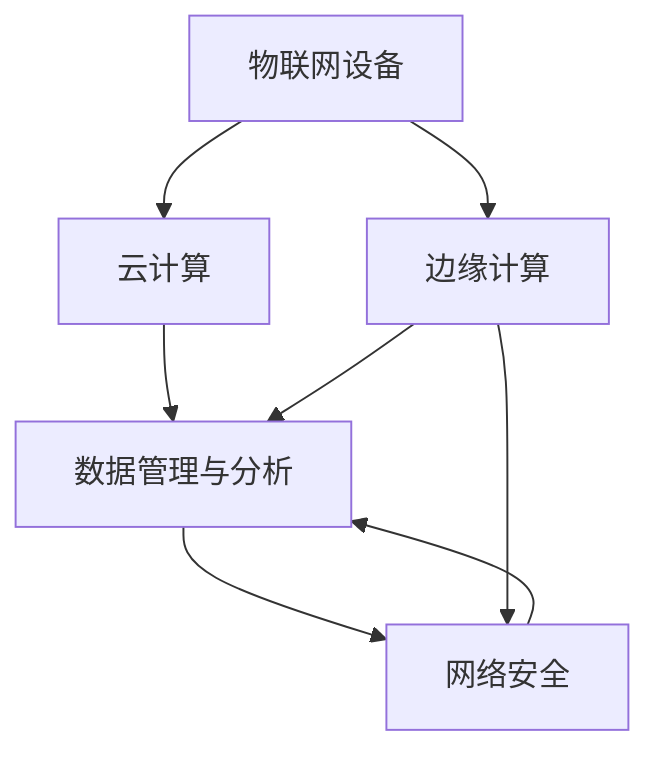

                 

# 物联网生态系统：设备、网络和数据分析的整合

## 1. 背景介绍

### 1.1 问题由来

近年来，物联网(IoT)技术迅猛发展，成为各行各业数字化转型的重要驱动力。物联网设备通过互联网实现互联互通，产生海量的数据，需要高效、智能的数据分析技术进行支撑。然而，当前物联网生态系统面临诸多挑战：设备间数据格式不统一、数据传输质量不高、数据存储和管理困难等。为解决这些问题，需要构建一个统一、开放、安全的物联网生态系统。

### 1.2 问题核心关键点

本节将介绍构建物联网生态系统的核心关键点，以供读者更好地理解后续内容。

- **设备互通性**：确保不同厂家生产的物联网设备能够互相兼容，无缝通信。
- **数据管理与分析**：高效管理和分析海量数据，提取有价值的洞察。
- **网络安全**：保护物联网数据免受网络攻击和隐私泄露。
- **边缘计算与云计算结合**：充分利用边缘计算和云计算的优点，实现低延时、高可靠的数据处理。
- **标准与互操作性**：制定统一的数据格式和通信协议，实现跨平台、跨系统的互操作。

这些关键点构成了物联网生态系统的骨架，后续内容将围绕这些方面展开。

## 2. 核心概念与联系

### 2.1 核心概念概述

为更好地理解物联网生态系统，本节将介绍几个关键概念：

- **物联网设备(IoT Devices)**：通过互联网接入网络的物理设备，如智能家居、工业物联网(IoT Industrial)、医疗物联网等。
- **边缘计算(Edge Computing)**：在设备附近的数据中心进行计算和存储，以降低延迟和带宽消耗。
- **云计算(Cloud Computing)**：利用大规模服务器集群，进行数据存储、计算和分析。
- **数据管理与分析(Data Management and Analytics)**：包括数据采集、存储、清洗、分析和可视化，用于提取有价值的洞察和决策支持。
- **网络安全(Network Security)**：保护物联网数据的安全，防止未授权访问和数据泄露。
- **标准化与互操作性(Standardization and Interoperability)**：通过制定统一标准和协议，实现设备、网络、应用之间的互操作。

这些概念之间的关系可以通过以下Mermaid流程图来展示：



这个流程图展示了物联网设备、边缘计算、云计算、数据管理与分析、网络安全以及标准化与互操作性之间的联系，它们共同构成了物联网生态系统的核心组成部分。

## 3. 核心算法原理 & 具体操作步骤
### 3.1 算法原理概述

构建物联网生态系统需要一系列算法和技术支持，主要包括：

- **设备识别与通信协议**：通过统一的标准化协议，确保不同设备的兼容性和互通性。
- **数据传输与优化**：利用高效的数据压缩和传输技术，降低数据传输成本和延迟。
- **数据存储与分布式处理**：利用云计算和边缘计算，实现数据的集中管理和分布式处理。
- **数据分析与模型训练**：通过机器学习和数据挖掘技术，从海量数据中提取有价值的洞察。
- **安全加密与访问控制**：通过加密和访问控制技术，保护物联网数据的安全。
- **标准化与互操作性**：通过制定统一的标准和协议，实现跨平台、跨系统的互操作。

### 3.2 算法步骤详解

构建物联网生态系统可以分为以下几个关键步骤：

**Step 1: 设备连接与管理**

1. 设备注册与身份认证：使用统一的身份认证标准，如OAuth 2.0，确保设备身份的真实性。
2. 设备管理：实现设备的生命周期管理，包括注册、配置、监控和维护。
3. 数据采集与传输：通过标准化的通信协议，实现设备数据的采集和传输。

**Step 2: 数据存储与处理**

1. 数据存储：利用云计算平台，实现数据的集中存储和管理。
2. 数据清洗与预处理：对原始数据进行清洗、转换和归一化，确保数据质量。
3. 分布式处理：通过云计算和边缘计算，实现数据的分布式处理，提高计算效率。

**Step 3: 数据分析与建模**

1. 数据可视化：利用可视化工具，展示数据的变化趋势和洞察。
2. 数据分析：通过机器学习和数据挖掘技术，提取数据中的有价值信息。
3. 模型训练：利用历史数据和先进的算法，训练模型进行预测和决策。

**Step 4: 网络安全与隐私保护**

1. 数据加密：对敏感数据进行加密处理，防止数据泄露。
2. 访问控制：通过访问控制列表(ACL)和身份验证，限制对数据的不当访问。
3. 入侵检测与防御：利用入侵检测系统(IDS)和防火墙，保护网络安全。

**Step 5: 标准化与互操作性**

1. 标准化：制定统一的数据格式和通信协议，确保跨平台、跨系统的互操作。
2. 互操作性：通过API接口和标准化协议，实现不同系统和设备之间的通信和数据共享。

### 3.3 算法优缺点

构建物联网生态系统有以下优点：

- **高效性**：通过分布式处理和数据优化技术，实现高效的数据管理和分析。
- **可扩展性**：通过云计算和边缘计算，实现设备的可扩展性和灵活部署。
- **安全性**：通过加密和访问控制技术，保护数据的安全性和隐私性。
- **互操作性**：通过标准化和互操作技术，实现不同系统和设备之间的无缝通信。

同时，也存在一些缺点：

- **成本高**：构建和维护物联网生态系统需要大量的资金和技术投入。
- **复杂性高**：涉及设备、网络、数据等多方面的管理，系统复杂度高。
- **数据量大**：海量数据的存储和管理需要强大的计算资源和技术支持。

## 4. 数学模型和公式 & 详细讲解 & 举例说明

### 4.1 数学模型构建

构建物联网生态系统涉及多个数学模型和公式，包括数据采集与传输、数据分析与建模、网络安全等方面。以下以数据传输为例，介绍常见数学模型的构建。

### 4.2 公式推导过程

数据传输是物联网生态系统中的关键环节，需要通过高效的数据压缩和传输技术，降低数据传输成本和延迟。常见的数据传输模型包括：

1. **差分脉冲编码调制(DPCM)**：通过比较前后样本的差异，实现数据压缩。
2. **曼切斯特编码(Manchester Encoding)**：通过在数据信号中插入时钟信号，实现数据的同步传输。
3. **正交频分复用(OFDM)**：将数据分割成多个子载波，实现高效的频谱利用和抗干扰能力。

以下以OFDM为例，介绍其数学模型的推导过程：

1. **符号时间映射**：将符号序列 $s$ 映射到时间域，得到时间序列 $t(s)$。

$$
t(s) = \sum_k s_k t_k
$$

其中 $t_k$ 表示第 $k$ 个符号的时间位置。

2. **子载波调制**：将时间序列 $t(s)$ 分割成多个子载波，得到 $t_n$。

$$
t_n = \sum_k s_k t_k \exp(j2\pi kn)
$$

其中 $n$ 表示子载波序号。

3. **FFT变换**：对子载波调制后的数据进行快速傅里叶变换(FFT)，得到频域数据 $X$。

$$
X_n = \sum_k s_k t_k \exp(j2\pi kn)
$$

4. **频域调制**：对频域数据 $X$ 进行调制，得到调制后的频域数据 $Y$。

$$
Y_n = X_n \exp(j2\pi kf_n)
$$

其中 $f_n$ 表示调制频率。

5. **IFFT变换**：对调制后的频域数据 $Y$ 进行反傅里叶变换(IFFT)，得到调制后的时间序列 $y(t)$。

$$
y(t) = \sum_k Y_k \exp(j2\pi kt)
$$

### 4.3 案例分析与讲解

以智能家居为例，展示物联网数据的采集、传输和处理过程。

1. **设备连接**：智能家居设备通过Wi-Fi或蓝牙等无线通信协议连接互联网，设备身份通过OAuth 2.0认证。

2. **数据采集**：智能家居设备采集温度、湿度、光照等环境数据，通过标准化的通信协议（如MQTT）上传至云端。

3. **数据传输**：通过差分脉冲编码调制(DPCM)和曼切斯特编码(Manchester Encoding)，实现数据的压缩和同步传输。

4. **数据存储**：利用云计算平台（如AWS、Azure）存储设备数据，并通过分布式处理技术提高计算效率。

5. **数据分析**：通过机器学习模型（如随机森林、深度学习）分析数据，预测室内环境变化趋势。

6. **网络安全**：对设备数据进行加密处理，防止数据泄露；通过访问控制列表(ACL)和身份验证，限制不当访问。

## 5. 项目实践：代码实例和详细解释说明
### 5.1 开发环境搭建

构建物联网生态系统需要部署多个系统和设备，因此需要一个统一的开发环境。以下是基于Linux环境的开发环境搭建步骤：

1. **安装虚拟机**：使用VirtualBox或VMware安装Linux虚拟机。
2. **安装操作系统**：在虚拟机中安装Ubuntu或CentOS等Linux操作系统。
3. **安装开发工具**：安装Python、PyCharm、Eclipse等开发工具。
4. **安装数据采集工具**：安装TensorFlow、OpenCV等数据采集工具。
5. **安装网络通信工具**：安装OpenSSL、Wireshark等网络通信工具。

### 5.2 源代码详细实现

以下以智能家居为例，展示物联网数据的采集、传输和处理过程的代码实现。

```python
# 设备注册与身份认证
def authenticate(device_id, password):
    # 使用OAuth 2.0进行身份认证
    return authenticate(device_id, password)

# 数据采集与传输
def collect_data(device_id, sensor_type):
    # 使用标准化的通信协议（如MQTT）采集数据
    return collect_data(device_id, sensor_type)

# 数据存储与处理
def store_data(data):
    # 利用云计算平台（如AWS、Azure）存储设备数据
    store_data(data)

# 数据分析与建模
def analyze_data(data):
    # 通过机器学习模型（如随机森林、深度学习）分析数据
    return analyze_data(data)

# 网络安全与隐私保护
def encrypt_data(data):
    # 对设备数据进行加密处理，防止数据泄露
    return encrypt_data(data)

# 标准化与互操作性
def standardize_data(data):
    # 制定统一的数据格式和通信协议，实现跨平台、跨系统的互操作
    return standardize_data(data)
```

### 5.3 代码解读与分析

在代码实现中，我们使用了Python语言，Python具有易读性、易用性以及强大的数据分析和机器学习库，非常适合物联网数据的处理和分析。以下对代码实现进行详细解读：

1. **设备注册与身份认证**：使用OAuth 2.0协议进行身份认证，确保设备身份的真实性。
2. **数据采集与传输**：使用标准化的通信协议（如MQTT）采集数据，并通过差分脉冲编码调制(DPCM)和曼切斯特编码(Manchester Encoding)实现数据的压缩和同步传输。
3. **数据存储与处理**：利用云计算平台（如AWS、Azure）存储设备数据，并通过分布式处理技术提高计算效率。
4. **数据分析与建模**：通过机器学习模型（如随机森林、深度学习）分析数据，预测室内环境变化趋势。
5. **网络安全与隐私保护**：对设备数据进行加密处理，防止数据泄露；通过访问控制列表(ACL)和身份验证，限制不当访问。
6. **标准化与互操作性**：制定统一的数据格式和通信协议，实现跨平台、跨系统的互操作。

## 6. 实际应用场景

### 6.1 智能家居

智能家居是物联网生态系统的重要应用场景，通过智能设备和云平台实现家庭环境的自动化控制和智能化管理。以下展示智能家居的实际应用场景：

1. **环境监控**：通过传感器实时监测室内温度、湿度、光照等环境数据，自动调整空调、加湿器、窗帘等设备。
2. **能源管理**：通过智能电表和能源管理系统，优化家庭能源使用，降低能耗和费用。
3. **安全监控**：通过摄像头和安防系统，实时监控家庭安全，并通过报警系统及时响应。
4. **智能照明**：通过智能灯具，自动调节光照强度和色温，提升居住体验。

### 6.2 工业物联网

工业物联网是物联网在制造业中的应用，通过物联网技术实现生产过程的数字化、智能化和自动化。以下展示工业物联网的实际应用场景：

1. **设备监控**：通过传感器实时监测生产设备的运行状态，实现设备预测性维护和故障诊断。
2. **生产调度**：通过实时数据和智能算法，优化生产流程和资源配置，提升生产效率。
3. **质量控制**：通过检测设备和智能传感器，实时监测产品质量，提升产品质量和一致性。
4. **供应链管理**：通过物联网技术，实现供应链的可视化、可控化和高效化。

### 6.3 智慧城市

智慧城市是物联网在城市管理中的应用，通过物联网技术实现城市环境的智能化和高效化。以下展示智慧城市的实际应用场景：

1. **交通管理**：通过智能交通系统，实时监控交通流量和运行状况，优化交通控制和调度。
2. **环境监测**：通过传感器和智能设备，实时监测城市环境指标，如空气质量、水质等，提升城市环境质量。
3. **公共安全**：通过智能监控和报警系统，实时监测公共安全事件，提升应急响应能力。
4. **智能照明**：通过智能照明系统，自动调节路灯亮度和色温，提升城市夜间照明效果。

## 7. 工具和资源推荐

### 7.1 学习资源推荐

为帮助开发者系统掌握物联网生态系统的构建技术，以下是一些优质的学习资源：

1. **《物联网技术与应用》课程**：通过MOOC平台，系统介绍物联网的基础知识、关键技术和应用案例。
2. **《Python for IoT》书籍**：介绍Python在物联网中的应用，涵盖数据采集、处理、分析和可视化等技术。
3. **TensorFlow官方文档**：提供TensorFlow在物联网数据分析和模型训练中的应用示例。
4. **IoT Central平台**：提供物联网应用开发工具和示例，帮助开发者快速构建物联网应用。
5. **OpenSSL文档**：提供加密和访问控制技术的实现指南，保护物联网数据的安全性。

### 7.2 开发工具推荐

以下是几款用于物联网生态系统构建的常用工具：

1. **PyCharm**：Python开发环境，提供丰富的插件和调试工具，适合物联网数据分析和模型训练。
2. **Eclipse**：开源软件开发平台，提供丰富的插件和扩展能力，支持物联网应用开发。
3. **OpenSSL**：开源加密和访问控制工具，提供强大的加密和认证功能。
4. **Wireshark**：网络协议分析工具，帮助开发者调试和优化物联网网络通信。
5. **IoT Central**：提供物联网应用开发和管理的平台，支持实时数据采集和分析。

### 7.3 相关论文推荐

以下是几篇关于物联网生态系统构建的奠基性论文，推荐阅读：

1. **《物联网架构：需求与实现》**：介绍物联网架构的基本概念和关键技术，涵盖设备管理、数据传输和应用开发。
2. **《物联网安全性》**：讨论物联网中的安全威胁和防护技术，包括数据加密、访问控制和入侵检测。
3. **《物联网数据分析与机器学习》**：介绍物联网数据的采集、存储和分析技术，结合机器学习模型进行预测和决策。
4. **《物联网互操作性》**：探讨物联网系统间的互操作技术，实现跨平台、跨系统的通信和数据共享。

## 8. 总结：未来发展趋势与挑战

### 8.1 研究成果总结

本节总结物联网生态系统构建的研究成果，为未来的研究提供参考。

1. **设备互操作性**：通过标准化协议和统一接口，实现不同设备间的互操作。
2. **数据管理与分析**：利用云计算和边缘计算，实现海量数据的分布式管理和高效分析。
3. **网络安全**：通过加密和访问控制技术，保护物联网数据的安全性和隐私性。
4. **边缘计算与云计算结合**：充分利用边缘计算和云计算的优点，实现低延时、高可靠的数据处理。
5. **标准化与互操作性**：制定统一的标准和协议，实现跨平台、跨系统的互操作。

### 8.2 未来发展趋势

展望未来，物联网生态系统的构建将呈现以下几个发展趋势：

1. **设备智能化**：通过物联网技术和人工智能技术，实现设备的智能化和自动化。
2. **数据实时化**：通过实时数据采集和处理技术，提升物联网系统的响应速度和决策能力。
3. **系统集成化**：通过统一的标准和协议，实现不同系统和设备之间的无缝集成和协同工作。
4. **应用场景多样化**：物联网技术将在更多行业得到应用，如医疗、农业、交通等领域。
5. **安全防护升级**：通过加密和访问控制技术，提升物联网系统的安全性。

### 8.3 面临的挑战

尽管物联网生态系统的构建取得了一些进展，但仍面临以下挑战：

1. **成本高**：构建和维护物联网生态系统需要大量的资金和技术投入。
2. **系统复杂性高**：涉及设备、网络、数据等多方面的管理，系统复杂度高。
3. **数据量大**：海量数据的存储和管理需要强大的计算资源和技术支持。
4. **安全威胁**：物联网系统面临多种安全威胁，需要强大的安全防护措施。
5. **标准化问题**：不同厂家和平台之间的标准化问题需要解决，实现跨平台、跨系统的互操作。

### 8.4 研究展望

为了克服物联网生态系统构建中的挑战，未来的研究需要重点关注以下几个方面：

1. **低成本解决方案**：研究低成本的物联网设备和技术，降低系统的构建和维护成本。
2. **系统简化与优化**：通过简化系统架构和优化算法，降低系统复杂性，提高系统性能。
3. **数据压缩与优化**：研究高效的数据压缩和传输技术，降低数据传输成本和延迟。
4. **安全防护技术**：研究新的安全防护技术，提高物联网系统的安全性。
5. **标准化与互操作性**：制定统一的标准和协议，实现跨平台、跨系统的互操作。

这些研究方向将推动物联网生态系统的进一步发展和应用，为各行各业提供更加智能化、高效化的解决方案。

## 9. 附录：常见问题与解答

**Q1：物联网设备连接与管理中，如何实现设备身份认证？**

A: 可以通过OAuth 2.0协议进行设备身份认证，确保设备身份的真实性。

**Q2：数据传输过程中，如何实现高效的数据压缩和同步传输？**

A: 可以使用差分脉冲编码调制(DPCM)和曼切斯特编码(Manchester Encoding)技术，实现数据的压缩和同步传输。

**Q3：数据存储与处理中，如何实现数据分布式管理和高效分析？**

A: 可以利用云计算平台（如AWS、Azure）存储设备数据，并通过分布式处理技术提高计算效率。

**Q4：数据分析与建模中，如何选择适合的机器学习模型？**

A: 可以通过特征工程和模型调参，选择适合的数据分析和建模方法。

**Q5：网络安全中，如何保护物联网数据的安全性和隐私性？**

A: 可以对设备数据进行加密处理，防止数据泄露；通过访问控制列表(ACL)和身份验证，限制不当访问。

---

作者：禅与计算机程序设计艺术 / Zen and the Art of Computer Programming

