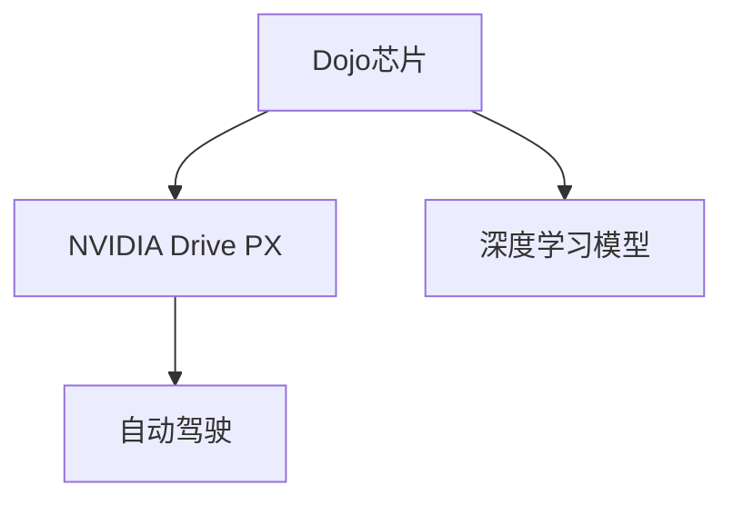

                 

# 特斯拉FSD V12的车端算力使用情况分析

特斯拉的完全自动驾驶套件（Fully Self-Driving, FSD）是全球自动驾驶技术最先进的代表之一，其背后的计算密集型深度学习模型依赖于高算力的硬件平台来实现实时高性能推理。特斯拉FSD V12系统采用了最先进的硬件和软件架构，使得车辆能够高效地处理各种复杂驾驶场景。本文将详细分析FSD V12的车端算力使用情况，包括硬件平台配置、计算需求、优化策略及未来发展趋势。

## 1. 背景介绍

特斯拉FSD V12系统采用了自研的计算平台，旨在提供足够的计算资源来支持自动驾驶所需的大量深度学习模型的推理。FSD V12的车端算力不仅包括基于GPU的计算资源，还集成了CPU和FPGA，以支持各类复杂算法。

特斯拉FSD V12系统包括两大核心硬件平台：
1. **特斯拉Dojo芯片**：基于自研的硬件加速器，具备极高的计算效率和能效比，专为深度学习模型设计。
2. **NVIDIA Drive PX**：特斯拉与NVIDIA合作的旗舰硬件平台，采用多个NVIDIA GPU进行并行计算，用于处理大规模数据流。

这些硬件平台结合了先进的软件算法，共同构成了FSD V12系统的核心竞争力。

## 2. 核心概念与联系

### 2.1 核心概念概述

为更好地理解FSD V12的车端算力使用情况，本节将介绍几个密切相关的核心概念：

- **Dojo芯片**：特斯拉自研的计算加速器，用于提升深度学习模型的推理性能和能效。Dojo芯片采用了先进的数据中心级的计算架构，具备极高的并行计算能力和低功耗设计。
- **NVIDIA Drive PX**：与NVIDIA合作的旗舰硬件平台，采用多个GPU进行并行计算，支持大规模深度学习模型的推理。
- **深度学习模型**：如卷积神经网络（CNN）、循环神经网络（RNN）等，用于自动驾驶中的视觉感知、环境理解、行为规划等任务。
- **自动驾驶**：通过深度学习模型处理车辆传感器数据，实现自主导航和交通交互。

这些核心概念之间的逻辑关系可以通过以下Mermaid流程图来展示：



这个流程图展示了几者之间的关系：

1. Dojo芯片和NVIDIA Drive PX是FSD V12系统的核心硬件平台，支持深度学习模型的高效计算。
2. 深度学习模型通过硬件平台进行推理，完成自动驾驶所需的各种任务。
3. 自动驾驶是深度学习模型的应用领域，涉及车辆的导航、决策、控制等。

## 3. 核心算法原理 & 具体操作步骤

### 3.1 算法原理概述

FSD V12的车端算力使用情况涉及深度学习模型的推理流程和优化策略。其核心原理是通过硬件加速器和高性能计算平台，实现深度学习模型的并行化推理，以高效地处理自动驾驶任务中的大量数据。

自动驾驶系统通常包括几个关键模块：
1. **环境感知**：通过摄像头、雷达、激光雷达等传感器收集环境信息，并进行像素级处理，得到道路、车辆、行人等物体的准确位置和姿态。
2. **环境理解**：对感知到的数据进行语义分割、目标检测等处理，得到道路、交通信号、标志牌等场景信息的详细解读。
3. **行为规划**：根据环境理解和自身定位，计算出最优的行驶轨迹和决策。
4. **控制执行**：将行为规划的指令转化为具体的车辆控制信号，实现自动驾驶。

这些模块均依赖于深度学习模型进行推理，其计算复杂度随着传感器分辨率、环境复杂度的增加而呈指数级增长。因此，如何高效利用车端算力，实现快速且准确的推理，是FSD V12系统设计的重要考量。

### 3.2 算法步骤详解

特斯拉FSD V12的车端算力使用步骤如下：

**Step 1: 数据预处理**

传感器收集到的原始数据（如摄像头图像、雷达点云等）需要进行预处理，包括去噪、校正、分割、归一化等，为后续深度学习模型的推理提供输入。

**Step 2: 模型推理**

深度学习模型（如卷积神经网络、循环神经网络等）通过硬件加速器进行推理，得到环境感知和环境理解的结果。这些结果通过高效的并行计算和流水线设计，大幅提升计算效率。

**Step 3: 推理后处理**

对模型推理结果进行后处理，包括滤波、去重、特征融合等，得到更准确和鲁棒的环境理解结果，为行为规划和控制执行提供依据。

**Step 4: 行为规划和控制**

行为规划和控制模块根据环境理解结果，计算出最优行驶轨迹和控制指令，并实时调整车辆状态。

**Step 5: 迭代优化**

通过实时监控车辆状态和周边环境，不断优化行为规划和控制策略，提高自动驾驶系统的稳定性和安全性。

### 3.3 算法优缺点

特斯拉FSD V12的车端算力使用情况具有以下优点：

1. **高效并行计算**：Dojo芯片和NVIDIA Drive PX的并行计算能力，使得深度学习模型能够在实时环境下高效推理。
2. **能效优化**：先进的低功耗设计，能够有效降低计算平台能耗，延长车辆续航里程。
3. **实时响应**：高效的推理引擎和流水线设计，确保了自动驾驶系统能够在毫秒级别内做出决策和调整。

同时，该系统也存在一些局限性：

1. **硬件成本高**：自研的Dojo芯片和高端的NVIDIA GPU，使得硬件成本较高。
2. **算法复杂度**：深度学习模型的推理复杂度高，对算力需求大，且存在一定的算法瓶颈。
3. **环境复杂性**：面对极端天气和复杂道路条件，算力需求仍可能超出设计上限。

尽管存在这些局限性，但通过持续的技术创新和优化，FSD V12系统在实际应用中已经证明了其强大的性能和可靠性。

### 3.4 算法应用领域

特斯拉FSD V12的车端算力使用情况广泛应用于以下领域：

1. **自动驾驶**：通过深度学习模型处理传感器数据，实现车辆自主导航、交通决策和行为执行。
2. **智能交通**：与城市基础设施、交通管理系统等合作，实现更智能化的交通管理。
3. **智能物流**：应用于货运车辆和配送中心，提升物流效率和安全性。
4. **无人驾驶出租车**：为商业化的无人驾驶出租车提供计算支持。
5. **安全监控**：与公共安全机构合作，实现交通监控和异常事件检测。

这些领域的应用将使FSD V12系统在未来的智能化和自动化进程中发挥重要作用。

## 4. 数学模型和公式 & 详细讲解 & 举例说明

### 4.1 数学模型构建

FSD V12的车端算力使用情况涉及多个子模型的联合推理，以实现复杂的自动驾驶任务。这些模型通常包括：

1. **卷积神经网络（CNN）**：用于环境感知和物体检测，如图像处理、语义分割等。
2. **循环神经网络（RNN）**：用于序列数据的处理，如时间序列分析、轨迹预测等。
3. **注意力机制**：用于提高模型的泛化能力和推理速度。

在数学模型构建方面，FSD V12系统采用了以下方法：

- **特征提取层**：通过卷积神经网络提取图像特征，生成特征图。
- **特征融合层**：将不同传感器（如摄像头、雷达）的特征图进行融合，得到更为丰富的环境理解。
- **任务处理层**：根据任务需求，通过RNN或其他神经网络处理融合后的特征，输出推理结果。

### 4.2 公式推导过程

以卷积神经网络（CNN）为例，其推理过程的公式推导如下：

假设输入图像为$I_{in}$，经过若干卷积层和池化层处理后，得到特征图$F_{out}$。假设特征图的大小为$H\times W\times C$，其中$H$、$W$、$C$分别为特征图的高度、宽度和通道数。则输出特征图$F_{out}$的大小为$H_{out}\times W_{out}\times C_{out}$，其中$H_{out}$、$W_{out}$、$C_{out}$分别为输出特征图的大小。

设卷积核大小为$k\times k$，步长为$s$，则特征图的每个元素$F_{out}(i,j,c)$可以表示为：

$$
F_{out}(i,j,c) = \sum_{p=0}^{k-1} \sum_{q=0}^{k-1} I_{in}(i+ps,j+qs,c) \ast \mathrm{kernel}(p,q)
$$

其中，$\ast$表示卷积运算，$\mathrm{kernel}(p,q)$为卷积核。

### 4.3 案例分析与讲解

以特斯拉FSD V12系统中的视觉感知为例，其数学模型构建如下：

1. **输入图像**：假设输入图像大小为$768\times 768$，共有3个通道，即RGB三个颜色通道。
2. **卷积层**：通过3个$3\times 3$的卷积核，步长为2，进行两次卷积操作，得到特征图$H_{out}=128$，$W_{out}=128$，$C_{out}=128$。
3. **池化层**：通过最大池化操作，对特征图进行降维，得到$H_{out}=64$，$W_{out}=64$，$C_{out}=128$的特征图。
4. **输出层**：通过全连接层，将特征图映射为$H_{out}=64$，$W_{out}=64$，$C_{out}=10$的输出特征图，用于物体分类和定位。

## 5. 项目实践：代码实例和详细解释说明

### 5.1 开发环境搭建

在开始代码实现之前，需要先搭建好开发环境：

1. **安装Python**：通过Anaconda或Miniconda安装Python，并创建虚拟环境。
2. **安装深度学习框架**：通过pip安装TensorFlow、PyTorch等深度学习框架，以及OpenCV等计算机视觉库。
3. **安装NVIDIA CUDA**：在Linux系统上安装NVIDIA CUDA库，支持GPU加速计算。
4. **安装NVIDIA GPU**：在Linux系统上安装NVIDIA GPU驱动程序和CUDA Toolkit。

完成环境配置后，即可进行深度学习模型的开发和测试。

### 5.2 源代码详细实现

以下是FSD V12系统中视觉感知模型的代码实现，以卷积神经网络为例：

```python
import tensorflow as tf
import numpy as np
import cv2

# 定义卷积神经网络
class CNN(tf.keras.Model):
    def __init__(self):
        super(CNN, self).__init__()
        self.conv1 = tf.keras.layers.Conv2D(64, 3, activation='relu', padding='same')
        self.maxpool1 = tf.keras.layers.MaxPooling2D(pool_size=(2, 2), strides=(2, 2))
        self.conv2 = tf.keras.layers.Conv2D(128, 3, activation='relu', padding='same')
        self.maxpool2 = tf.keras.layers.MaxPooling2D(pool_size=(2, 2), strides=(2, 2))
        self.flatten = tf.keras.layers.Flatten()
        self.dense1 = tf.keras.layers.Dense(256, activation='relu')
        self.dense2 = tf.keras.layers.Dense(10, activation='softmax')

    def call(self, inputs):
        x = self.conv1(inputs)
        x = self.maxpool1(x)
        x = self.conv2(x)
        x = self.maxpool2(x)
        x = self.flatten(x)
        x = self.dense1(x)
        x = self.dense2(x)
        return x

# 加载模型
model = CNN()
model.load_weights('cnn_weights.h5')

# 定义输入图像预处理函数
def preprocess_image(image):
    image = cv2.resize(image, (768, 768))
    image = image / 255.0
    image = np.expand_dims(image, axis=0)
    return image

# 测试模型
image = preprocess_image(cv2.imread('test.jpg'))
image = image / 255.0
image = np.expand_dims(image, axis=0)
predictions = model.predict(image)

print(predictions)
```

### 5.3 代码解读与分析

以上代码实现了简单的卷积神经网络，包括卷积层、池化层、全连接层等基本组件。其关键步骤如下：

1. **定义模型**：通过继承tf.keras.Model类，定义了一个包含两个卷积层、两个池化层和两个全连接层的卷积神经网络。
2. **加载模型权重**：使用load_weights方法，从预训练权重文件中加载模型。
3. **图像预处理**：通过OpenCV读取图像，并进行归一化和通道扩展处理，使图像适合输入模型。
4. **模型测试**：将预处理后的图像输入模型，获取模型预测结果，并输出。

代码中的关键点包括：
- **卷积层和池化层的定义**：通过tf.keras.layers.Conv2D和MaxPooling2D实现卷积和池化操作，设置合适的参数，如卷积核大小、步长、激活函数等。
- **全连接层的定义**：通过tf.keras.layers.Dense实现全连接层，设置合适的节点数和激活函数。
- **预处理函数的设计**：通过cv2.resize和np.expand_dims函数，对输入图像进行预处理，使其适合模型输入。

## 6. 实际应用场景

### 6.1 智能交通

特斯拉FSD V12系统在智能交通领域具有广泛的应用前景，可以应用于智能交通信号灯、交通流量监控、事故预警等多个方面。通过深度学习模型处理摄像头和雷达数据，可以实现对交通信号的智能识别和调整，优化交通信号控制策略，减少交通拥堵和事故发生。

### 6.2 智能物流

在智能物流领域，特斯拉FSD V12系统可以应用于货运车辆和配送中心的自动化和智能化管理。通过深度学习模型处理传感器数据，实现货物的自动识别、分类和装载，提升物流效率和安全性。

### 6.3 无人驾驶出租车

特斯拉FSD V12系统可以应用于无人驾驶出租车，提升无人驾驶技术的安全性和可靠性。通过深度学习模型处理环境数据，实现实时感知、行为规划和控制执行，提供稳定、安全的出行服务。

### 6.4 安全监控

在公共安全领域，特斯拉FSD V12系统可以应用于交通监控和异常事件检测。通过深度学习模型处理摄像头和传感器数据，实时监测交通状况和异常事件，提供预警和应急响应支持。

## 7. 工具和资源推荐

### 7.1 学习资源推荐

为帮助开发者掌握特斯拉FSD V12系统的车端算力使用情况，以下是一些优质的学习资源：

1. **特斯拉官方文档**：特斯拉提供的详细官方文档，包括系统架构、开发指南、API接口等，是学习特斯拉FSD V12系统的必备资源。
2. **TensorFlow官方文档**：TensorFlow的官方文档，提供了丰富的深度学习模型和算法实现，适合深入学习深度学习技术。
3. **NVIDIA CUDA开发者文档**：NVIDIA提供的CUDA开发者文档，介绍了NVIDIA GPU的计算架构和编程技巧，适合GPU加速计算的学习。
4. **DeepLearning.AI的深度学习课程**：由深度学习领域的知名专家Andrew Ng主讲的深度学习课程，涵盖深度学习模型的设计、训练和优化等内容。
5. **Google的TensorFlow Dev Summit**：Google组织的TensorFlow开发者大会，提供深度学习技术的最新进展和应用案例，适合深度学习技术的学习和实践。

### 7.2 开发工具推荐

以下是特斯拉FSD V12系统开发中常用的工具：

1. **PyTorch**：深度学习框架，支持GPU加速计算，适合深度学习模型的开发和训练。
2. **TensorFlow**：深度学习框架，支持GPU加速计算，适合深度学习模型的开发和训练。
3. **OpenCV**：计算机视觉库，支持图像处理和图像识别，适合FSD V12系统中的图像处理任务。
4. **NVIDIA CUDA**：NVIDIA提供的GPU加速计算工具，适合深度学习模型的训练和推理。
5. **TensorBoard**：TensorFlow配套的可视化工具，用于监测模型训练状态和性能指标，适合模型调试和优化。

### 7.3 相关论文推荐

特斯拉FSD V12系统的车端算力使用情况涉及多个方面的研究，以下是几篇相关论文，推荐阅读：

1. **"Dojo: A Hybrid Parallel Processing System for Deep Learning"**：特斯拉发布的技术论文，介绍了Dojo芯片的硬件架构和计算性能。
2. **"Neural Network Training for Self-Driving Cars"**：特斯拉发布的技术论文，介绍了深度学习模型在自动驾驶中的应用和优化。
3. **"FSD: Fully Self-Driving a Tesla Model 3 using Deep Reinforcement Learning"**：特斯拉发布的技术论文，介绍了FSD V12系统的行为规划和控制策略。
4. **"Towards End-to-End Deep Learning for Autonomous Vehicles"**：IEEE Transactions on Intelligent Transportation Systems的论文，介绍了深度学习模型在自动驾驶中的综合应用。

## 8. 总结：未来发展趋势与挑战

### 8.1 研究成果总结

特斯拉FSD V12系统的车端算力使用情况涉及深度学习模型的高效推理和并行计算，已经取得了显著的研究成果：

1. **高效并行计算**：通过Dojo芯片和NVIDIA Drive PX，实现了深度学习模型的高效推理。
2. **低功耗设计**：先进的低功耗设计，延长了车辆的续航里程。
3. **实时响应**：高效的推理引擎和流水线设计，实现了毫秒级别的决策和调整。

这些研究成果使得FSD V12系统在自动驾驶领域具备强大的竞争力。

### 8.2 未来发展趋势

展望未来，特斯拉FSD V12系统的车端算力使用情况将呈现以下发展趋势：

1. **更高效的计算平台**：随着硬件技术的进步，未来的计算平台将具备更高的计算效率和能效比。
2. **更多样化的传感器融合**：未来的系统将更多地融合不同传感器（如激光雷达、毫米波雷达、超声波传感器等），提升环境理解的准确性和全面性。
3. **更深层次的模型优化**：未来的系统将通过更深入的模型优化，提升推理速度和准确性。
4. **更全面的自动驾驶场景覆盖**：未来的系统将覆盖更广泛的驾驶场景，如高速公路、城市道路、停车场等，实现全面的自动驾驶能力。
5. **更智能的决策系统**：未来的系统将通过更复杂的决策算法，提升自动驾驶的智能性和安全性。

### 8.3 面临的挑战

特斯拉FSD V12系统的车端算力使用情况仍面临以下挑战：

1. **硬件成本高**：自研的Dojo芯片和高端的NVIDIA GPU，使得硬件成本较高。
2. **算法复杂度**：深度学习模型的推理复杂度高，对算力需求大，且存在一定的算法瓶颈。
3. **环境复杂性**：面对极端天气和复杂道路条件，算力需求仍可能超出设计上限。
4. **安全性问题**：深度学习模型可能会受到对抗攻击，导致安全漏洞。
5. **法律和伦理问题**：自动驾驶技术涉及隐私、伦理和安全等多个方面，需要进一步规范和监管。

尽管存在这些挑战，但通过持续的技术创新和优化，特斯拉FSD V12系统在实际应用中已经证明了其强大的性能和可靠性。

### 8.4 研究展望

未来的研究需要在以下几个方面进行突破：

1. **硬件性能优化**：进一步提升计算平台的计算效率和能效比，降低硬件成本。
2. **算法优化**：通过更深入的模型优化和算法改进，提升推理速度和准确性。
3. **多模态融合**：融合视觉、雷达、激光雷达等多模态数据，提升环境理解的全面性和准确性。
4. **安全性增强**：通过对抗训练、模型鲁棒性提升等手段，增强深度学习模型的安全性。
5. **法律和伦理保障**：制定和完善自动驾驶技术的法律和伦理规范，保障系统的安全性、隐私性和公平性。

这些研究方向的探索发展，将使特斯拉FSD V12系统在未来的智能化和自动化进程中发挥更大的作用。

## 9. 附录：常见问题与解答

**Q1: 特斯拉FSD V12系统采用了哪些硬件加速器？**

A: 特斯拉FSD V12系统采用了Dojo芯片和NVIDIA Drive PX作为核心硬件加速器，其中Dojo芯片是特斯拉自研的计算加速器，具备极高的计算效率和能效比，而NVIDIA Drive PX则集成了多个NVIDIA GPU，提供强大的并行计算能力。

**Q2: 特斯拉FSD V12系统中的深度学习模型有哪些？**

A: 特斯拉FSD V12系统中的深度学习模型主要包括卷积神经网络（CNN）、循环神经网络（RNN）、注意力机制等，用于环境感知、物体检测、轨迹预测等任务。

**Q3: 特斯拉FSD V12系统中的图像预处理流程是什么？**

A: 特斯拉FSD V12系统中的图像预处理流程包括去噪、校正、分割、归一化等步骤，通过OpenCV等工具实现，将输入图像处理为模型适用的格式。

**Q4: 特斯拉FSD V12系统的推理流程是什么？**

A: 特斯拉FSD V12系统的推理流程包括特征提取、特征融合、任务处理和输出等步骤，通过卷积神经网络、池化层、全连接层等组件实现，高效地处理传感器数据。

**Q5: 特斯拉FSD V12系统在智能交通领域有哪些应用？**

A: 特斯拉FSD V12系统在智能交通领域的应用包括智能交通信号灯、交通流量监控、事故预警等，通过深度学习模型处理摄像头和雷达数据，实现交通信号的智能识别和调整，优化交通信号控制策略。

---

作者：禅与计算机程序设计艺术 / Zen and the Art of Computer Programming

