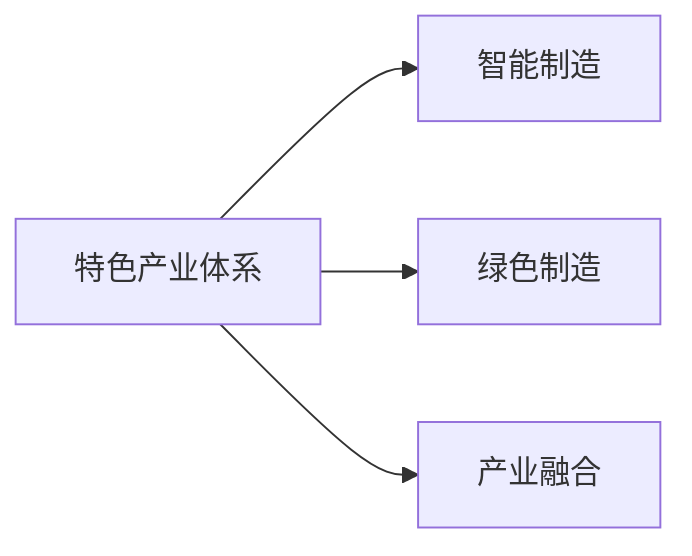

                 

# 特色产业体系的构建与新质生产力发展

## 1. 背景介绍

在全球经济发展的历史长河中，产业体系从农业、工业到服务业，不断地演变升级。而今天，随着数字技术的飞速发展，智能制造、云计算、大数据等新一代信息技术正催生着新的产业形态，推动着传统产业向智能、绿色、可持续发展方向转变。构建特色产业体系，不仅仅是顺应全球产业变革的大势所趋，也是提升区域竞争力和国家综合国力的关键所在。

### 1.1 问题由来

随着人工智能、大数据、物联网等新一代信息技术的广泛应用，传统产业正面临着前所未有的变革。然而，在技术应用过程中，我们也面临着资源浪费、环境污染、产业同质化等问题。因此，构建高效、绿色、可持续发展的新型产业体系，成为各国政府、企业及学术界共同关注的话题。

### 1.2 问题核心关键点

为了更好地理解构建特色产业体系的必要性及其实现路径，我们需要聚焦于以下几个关键点：

- **产业转型升级**：如何将传统产业通过数字化、智能化手段进行升级改造。
- **资源环境平衡**：如何在追求经济效益的同时，实现资源节约和环境保护。
- **产业结构优化**：如何通过优化产业布局，促进产业间的协同发展。
- **国际竞争力提升**：如何提升产业在全球价值链中的地位。
- **政策支撑与保障**：如何通过政策支持，为产业体系构建提供有力保障。

## 2. 核心概念与联系

### 2.1 核心概念概述

构建特色产业体系，核心在于将优势资源、技术、人才等要素集聚到某一特定领域，形成具有国际竞争力、创新能力、辐射力的产业集群。这不仅仅是产业结构的调整和优化，更是一个复杂的系统工程，涉及到技术、市场、政策、文化等多个层面。

以下将介绍几个关键概念及其联系：

- **特色产业体系**：围绕某一特定领域，集成优势资源和要素，形成具有竞争力和创新能力的产业集群。
- **智能制造**：通过应用新一代信息技术，提升制造业的智能化水平，实现生产效率和产品质量的提升。
- **绿色制造**：在生产过程中采用节能减排、循环利用的措施，实现可持续发展。
- **产业融合**：不同产业间的融合，形成跨界创新。

这些概念之间的联系可以用以下Mermaid流程图表示：



## 3. 核心算法原理 & 具体操作步骤
### 3.1 算法原理概述

构建特色产业体系的算法原理，主要涉及以下几个方面：

- **需求分析**：通过市场调研、数据分析等手段，确定某一特定领域的需求和发展方向。
- **资源评估**：评估该领域现有的资源、技术、人才等要素，确定优势和劣势。
- **规划设计**：设计产业发展的规划和路径，确定产业发展目标、重点任务和实施步骤。
- **政策支撑**：制定相关政策和措施，为产业体系构建提供保障。

### 3.2 算法步骤详解

构建特色产业体系的算法步骤如下：

1. **需求调研与分析**：通过问卷调查、专家访谈、数据分析等方法，收集目标领域的需求信息，确定产业发展方向。
2. **资源评估与规划**：评估目标领域的资源和要素，包括技术、人才、资金等，制定产业发展规划。
3. **政策制定与落实**：根据规划内容，制定相关政策和措施，包括财政支持、税收优惠、园区建设等。
4. **执行与监控**：根据规划和政策，组织实施产业发展项目，同时进行动态监控和调整。
5. **评估与反馈**：定期对产业发展效果进行评估，根据评估结果调整策略和政策。

### 3.3 算法优缺点

构建特色产业体系的优势包括：

- **提升区域竞争力**：通过集聚优势资源，形成具有竞争力的产业集群。
- **促进创新发展**：通过产业融合和技术创新，推动产业升级。
- **实现可持续发展**：通过绿色制造和资源节约，实现环境保护和资源高效利用。

然而，该方法也存在一些缺点：

- **周期长、成本高**：产业体系构建需要较长时间和较大资金投入。
- **风险较高**：产业体系构建涉及多个要素和环节，风险较大。
- **依赖政策**：政策支撑和环境对产业体系的成功构建至关重要。

### 3.4 算法应用领域

构建特色产业体系的方法可以应用于多个领域，包括但不限于：

- **智能制造**：通过新一代信息技术，提升制造业的智能化水平。
- **绿色农业**：采用现代农业技术和循环利用方法，实现农业可持续发展。
- **文化创意产业**：通过创新和融合，提升文化产业的国际竞争力。
- **生物医药**：通过技术创新和产业融合，提升生物医药产业的竞争力。

## 4. 数学模型和公式 & 详细讲解 & 举例说明

### 4.1 数学模型构建

构建特色产业体系的数学模型主要包括以下几个部分：

- **需求模型**：通过市场调研和数据分析，建立目标领域的需求模型。
- **资源模型**：评估目标领域的资源和要素，建立资源模型。
- **规划模型**：基于需求和资源模型，制定产业发展规划。
- **政策模型**：根据产业发展规划，制定相关政策措施。

### 4.2 公式推导过程

以智能制造为例，其数学模型和公式推导如下：

设目标领域为 $A$，智能制造为 $B$，资源模型为 $R$，需求模型为 $D$，政策模型为 $P$。

1. **需求模型**：
   $$
   D(A) = f(A, D_1, D_2, D_3)
   $$
   其中 $D_i$ 为第 $i$ 个需求指标。

2. **资源模型**：
   $$
   R(A) = g(A, R_1, R_2, R_3)
   $$
   其中 $R_i$ 为第 $i$ 个资源要素。

3. **规划模型**：
   $$
   P(A, B) = h(D(A), R(A), B)
   $$
   其中 $B$ 为智能制造的应用方案。

4. **政策模型**：
   $$
   P(A, B) = i(D(A), R(A), B, P_1, P_2, P_3)
   $$
   其中 $P_i$ 为第 $i$ 个政策措施。

### 4.3 案例分析与讲解

以智能制造为例，通过数学模型和公式推导，可以建立智能制造的规划方案。具体步骤如下：

1. **需求调研**：通过问卷调查、专家访谈等方式，收集智能制造的需求信息。
2. **资源评估**：评估目标区域的资源和要素，如技术、人才、资金等。
3. **方案设计**：根据需求和资源评估结果，设计智能制造的应用方案。
4. **政策制定**：根据方案设计，制定相应的政策措施，如财政支持、税收优惠等。
5. **实施与监控**：实施智能制造项目，同时进行动态监控和调整。

## 5. 项目实践：代码实例和详细解释说明
### 5.1 开发环境搭建

构建特色产业体系的项目开发需要搭建一个完整的开发环境，包括以下几个部分：

- **数据环境**：搭建数据存储和处理平台，如Hadoop、Spark等。
- **计算环境**：搭建高性能计算环境，如GPU、FPGA等。
- **软件环境**：安装和配置所需的软件和工具，如Python、R、Matlab等。
- **网络环境**：搭建高性能网络环境，支持数据的实时传输和处理。

### 5.2 源代码详细实现

以智能制造为例，其代码实现可以分为以下几个步骤：

1. **需求调研与分析**：
   - 收集智能制造需求数据。
   - 进行数据清洗和处理。
   - 使用Python进行数据分析和建模。

2. **资源评估与规划**：
   - 收集智能制造资源数据。
   - 进行资源评估和建模。
   - 使用Python进行资源规划和优化。

3. **政策制定与落实**：
   - 根据规划结果，制定相关政策措施。
   - 使用Python进行政策模拟和优化。

4. **执行与监控**：
   - 实施智能制造项目。
   - 使用Python进行实时监控和反馈。

5. **评估与反馈**：
   - 收集智能制造效果数据。
   - 进行效果评估和反馈。
   - 使用Python进行效果分析和优化。

### 5.3 代码解读与分析

智能制造的代码实现涉及到数据收集、处理、分析和建模等多个环节。以智能制造需求调研为例，代码实现如下：

```python
import pandas as pd
import numpy as np

# 数据收集
data = pd.read_csv('demand.csv')

# 数据清洗
data = data.dropna()

# 数据分析
mean_demand = np.mean(data['demand'])
std_demand = np.std(data['demand'])
skewness = np.mean(data['demand'].skew())

# 结果输出
print(f"Mean Demand: {mean_demand}")
print(f"Standard Deviation: {std_demand}")
print(f"Skewness: {skewness}")
```

这段代码实现了对智能制造需求数据的收集、清洗和分析。数据处理和分析是构建特色产业体系的重要环节，其代码实现需要根据具体需求和场景进行调整。

### 5.4 运行结果展示

通过上述代码，可以得出智能制造需求的均值、方差和偏度等指标。这些指标可以为制定智能制造政策提供数据支持。

## 6. 实际应用场景
### 6.1 智能制造

智能制造是构建特色产业体系的重要应用场景之一。通过应用新一代信息技术，智能制造可以提高生产效率，降低生产成本，提升产品质量，增强企业竞争力。具体应用包括：

- **智能设备**：通过传感器、物联网等技术，实现设备互联和智能化。
- **智能生产**：通过AI、机器学习等技术，实现生产过程的自动化和智能化。
- **智能管理**：通过大数据、云计算等技术，实现生产管理的高效化和智能化。

### 6.2 绿色农业

绿色农业是构建特色产业体系的另一重要应用场景。通过应用现代农业技术和循环利用方法，绿色农业可以实现资源节约和环境保护。具体应用包括：

- **精准农业**：通过遥感、物联网等技术，实现农业生产的精准化管理。
- **循环农业**：通过循环利用、废弃物处理等技术，实现资源的循环利用。
- **智慧农业**：通过大数据、人工智能等技术，实现农业决策的智能化。

### 6.3 文化创意产业

文化创意产业是构建特色产业体系的新兴领域。通过创新和融合，文化创意产业可以提升文化产业的国际竞争力。具体应用包括：

- **数字媒体**：通过数字技术，实现文化的数字化传播和展示。
- **创意设计**：通过创意设计，实现文化的创新和融合。
- **文化旅游**：通过数字化手段，实现文化的旅游开发和传播。

### 6.4 生物医药

生物医药是构建特色产业体系的另一重要应用场景。通过技术创新和产业融合，生物医药产业可以提升其国际竞争力。具体应用包括：

- **精准医疗**：通过大数据、人工智能等技术，实现精准医疗和诊断。
- **新药研发**：通过基因编辑、蛋白工程等技术，实现新药的研发和创新。
- **健康管理**：通过智能穿戴设备、云计算等技术，实现健康管理的智能化。

## 7. 工具和资源推荐
### 7.1 学习资源推荐

为了帮助开发者系统掌握构建特色产业体系的理论基础和实践技巧，这里推荐一些优质的学习资源：

1. **《产业经济学》**：深入解析产业结构、市场竞争、政策支持等内容，是理解产业体系构建的基础。
2. **《智能制造技术与应用》**：涵盖智能制造的各个技术领域，包括智能设备、智能生产、智能管理等。
3. **《绿色农业技术与应用》**：介绍绿色农业的现代技术和管理方法，帮助实现资源节约和环境保护。
4. **《文化创意产业》**：分析文化创意产业的创新和发展趋势，提供创意设计、数字媒体、文化旅游等应用案例。
5. **《生物医药技术与应用》**：涵盖生物医药的现代技术和管理方法，帮助实现新药研发和健康管理。

### 7.2 开发工具推荐

高效的开发离不开优秀的工具支持。以下是几款用于构建特色产业体系的常用工具：

1. **Jupyter Notebook**：一个交互式的编程环境，支持Python、R、MATLAB等多种编程语言。
2. **Tableau**：一个数据可视化工具，可以直观展示和分析数据。
3. **Hadoop**：一个分布式计算平台，支持大规模数据的存储和处理。
4. **Spark**：一个快速的大数据处理引擎，支持分布式计算和数据处理。
5. **TensorFlow**：一个开源的机器学习框架，支持深度学习算法和模型训练。

### 7.3 相关论文推荐

构建特色产业体系的最新研究成果，可以追踪以下几个领域的论文：

1. **《智能制造与工业互联网》**：研究智能制造的实现路径和未来发展趋势。
2. **《绿色农业与可持续发展》**：探讨绿色农业的现代技术和可持续发展模式。
3. **《文化创意产业创新与发展》**：分析文化创意产业的创新和发展趋势，提供创意设计、数字媒体、文化旅游等应用案例。
4. **《生物医药技术与应用》**：涵盖生物医药的现代技术和管理方法，帮助实现新药研发和健康管理。

## 8. 总结：未来发展趋势与挑战
### 8.1 研究成果总结

构建特色产业体系的算法原理和操作步骤，已经帮助我们系统地理解了如何通过需求分析、资源评估、规划设计、政策支撑等环节，构建具有竞争力和创新能力的产业集群。具体步骤包括需求调研与分析、资源评估与规划、政策制定与落实、执行与监控、评估与反馈等。

### 8.2 未来发展趋势

展望未来，构建特色产业体系将呈现以下几个发展趋势：

1. **数字化、智能化**：通过新一代信息技术，实现产业的数字化、智能化转型。
2. **绿色化、可持续发展**：实现资源节约和环境保护，推动绿色制造和可持续发展。
3. **国际化和全球竞争力**：提升产业的国际竞争力和全球竞争力，构建具有全球影响力的产业集群。
4. **多行业融合**：实现不同产业间的融合，推动跨界创新和协同发展。

### 8.3 面临的挑战

尽管构建特色产业体系的方法在理论和实践中取得了一定进展，但在实施过程中，仍面临诸多挑战：

1. **资源和资金限制**：构建特色产业体系需要较大的资金和资源投入。
2. **技术和人才短缺**：缺乏相应的技术和人才支持，难以实现创新和提升。
3. **政策支持不足**：政策环境不稳定，难以提供有力的政策保障。
4. **市场竞争激烈**：面对全球市场竞争，产业集群需要不断创新和提升竞争力。
5. **风险和不确定性**：产业体系构建涉及多个环节和要素，风险较高。

### 8.4 研究展望

未来的研究应在以下几个方面进一步突破：

1. **多行业融合**：推动不同产业间的融合，实现跨界创新和协同发展。
2. **技术创新和突破**：加快技术创新和突破，提升产业竞争力。
3. **政策支持和环境**：制定有利于产业发展的政策环境，提供稳定的政策保障。
4. **人才培养和引进**：加强技术和人才的培养和引进，提升产业竞争力。
5. **风险管理和控制**：建立风险管理体系，降低产业体系构建的风险。

## 9. 附录：常见问题与解答

**Q1：构建特色产业体系需要哪些关键资源？**

A: 构建特色产业体系需要以下关键资源：

- **技术资源**：包括研发平台、技术积累、技术标准等。
- **人才资源**：包括专业人才、管理人才、技能人才等。
- **资金资源**：包括项目资金、融资渠道等。
- **设备资源**：包括生产设备、实验设备等。
- **政策资源**：包括政策支持、法规标准等。

**Q2：如何选择合适的技术路径？**

A: 选择合适的技术路径需要考虑以下几个方面：

- **市场需求**：根据市场需求选择合适的技术路径。
- **技术成熟度**：选择成熟度高、可靠性强的技术路径。
- **技术先进性**：选择先进的技术路径，推动产业升级。
- **技术可行性**：评估技术的可行性和实施成本。
- **技术环境**：考虑技术路径所处的环境和生态系统。

**Q3：如何制定有效的产业政策？**

A: 制定有效的产业政策需要考虑以下几个方面：

- **目标明确**：明确政策目标，聚焦产业发展方向。
- **科学合理**：科学评估和规划，制定合理政策。
- **灵活调整**：根据实际情况灵活调整政策。
- **全面覆盖**：覆盖产业发展各个环节和要素。
- **多方协同**：多方协同推进，共同推动产业政策落实。

**Q4：如何应对市场风险？**

A: 应对市场风险需要考虑以下几个方面：

- **市场调研**：进行深入的市场调研，了解市场需求和竞争情况。
- **风险评估**：进行风险评估和预警，及时发现和应对风险。
- **多元化发展**：多元化发展，降低单一市场的风险。
- **应急预案**：制定应急预案，应对突发事件。
- **风险管理**：建立风险管理体系，加强风险控制。

**Q5：如何提升产业国际竞争力？**

A: 提升产业国际竞争力需要考虑以下几个方面：

- **技术创新**：加快技术创新和突破，提升产品竞争力。
- **品牌建设**：加强品牌建设，提升品牌影响力。
- **国际化布局**：拓展国际市场，提升国际竞争力。
- **人才引进**：引进国际化人才，提升国际竞争力。
- **政策支持**：制定有利于国际竞争力的政策环境。

---

作者：禅与计算机程序设计艺术 / Zen and the Art of Computer Programming

