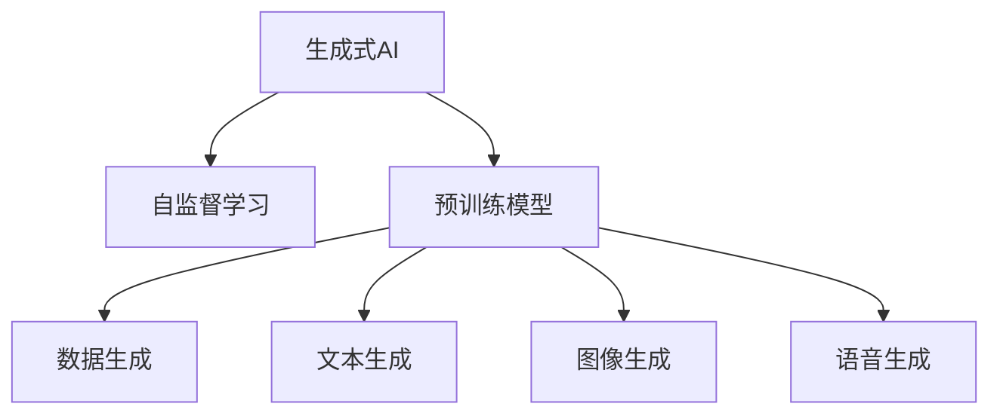

                 

# 生成式AIGC：AI技术的商业应用

> 关键词：生成式AI, 人工智能商业应用, 自监督学习, 数据生成, 文本生成, 图像生成, 语音生成

## 1. 背景介绍

随着人工智能技术的飞速发展，生成式AI（Generative AI）成为了当前最炙手可热的领域之一。生成式AI通过对大数据的建模，能够产生逼真的图像、视频、音频、文本等内容，广泛应用于内容创作、市场营销、智能客服、医疗诊断等领域。相比于传统的监督学习AI，生成式AI在数据标注方面要求较低，能够基于少量标注数据或无标注数据进行高效的模型训练。

生成式AI技术的核心在于自监督学习。自监督学习是指利用数据中的内在关系（如自相关性、序列依赖性）进行模型训练，无需手动标注数据，能够从数据中自动学习到特征表示和模式。目前，生成式AI技术在文本生成、图像生成、语音生成等多个领域取得了显著进展，广泛应用于商业应用中。

本文将深入探讨生成式AI技术的原理、操作步骤以及商业应用的场景和未来发展趋势。

## 2. 核心概念与联系

### 2.1 核心概念概述

为了更好地理解生成式AI技术，本节将介绍几个关键概念：

- **生成式AI（Generative AI）**：基于生成模型（如生成对抗网络GAN、变分自编码器VAE、Transformer等）进行内容生成的AI技术。能够生成高质量的文本、图像、音频等内容，广泛应用于内容创作、市场营销、智能客服等场景。

- **自监督学习（Self-supervised Learning）**：利用数据中的内在关系进行模型训练，无需手动标注数据，能够从数据中自动学习到特征表示和模式。自监督学习是生成式AI技术的基础。

- **预训练模型（Pre-trained Model）**：在大规模无标签数据上进行预训练的模型，具有较强的泛化能力和特征提取能力。常见的预训练模型包括BERT、GPT、VQ-VAE等。

- **数据生成（Data Generation）**：通过AI模型自动生成数据，用于内容创作、模拟训练、数据扩充等场景。数据生成是生成式AI技术的核心应用之一。

- **文本生成（Text Generation）**：通过AI模型生成自然语言文本，应用于自动摘要、内容创作、智能客服等场景。

- **图像生成（Image Generation）**：通过AI模型生成逼真的图像，应用于视觉特效、虚拟现实、医学影像等领域。

- **语音生成（Speech Generation）**：通过AI模型生成自然流畅的语音，应用于语音助手、语音翻译、语音合成等场景。

这些概念之间的联系可以通过以下Mermaid流程图来展示：



这个流程图展示了大语言模型的核心概念及其之间的关系：

1. 生成式AI通过自监督学习从数据中自动学习到特征表示和模式。
2. 生成式AI构建在预训练模型的基础上，利用预训练模型的泛化能力和特征提取能力。
3. 生成式AI能够生成高质量的数据，如文本、图像、语音等。

## 3. 核心算法原理 & 具体操作步骤

### 3.1 算法原理概述

生成式AI的核心在于自监督学习。自监督学习的目标是利用数据中的内在关系进行模型训练，无需手动标注数据。自监督学习的算法框架包括数据生成、模型训练、评估和优化等步骤。

自监督学习的核心思想是：利用数据中的内在关系（如自相关性、序列依赖性）进行模型训练，从而自动学习到数据的特征表示和模式。常见的自监督学习任务包括预测数据中的缺失部分、分类数据中的噪声标签、排序数据中的相对顺序等。

### 3.2 算法步骤详解

生成式AI的训练过程包括以下几个关键步骤：

**Step 1: 数据准备与预处理**
- 收集大规模无标签数据集，并进行数据清洗、标准化、分块等预处理操作。
- 将数据集分为训练集、验证集和测试集。

**Step 2: 模型设计**
- 选择合适的生成模型，如GAN、VAE、Transformer等。
- 定义模型架构，包括编码器、解码器、生成器等组件。
- 设置模型的超参数，如学习率、批大小、迭代轮数等。

**Step 3: 训练模型**
- 将数据集分批次输入模型，前向传播计算损失函数。
- 反向传播计算参数梯度，根据设定的优化算法和学习率更新模型参数。
- 周期性在验证集上评估模型性能，根据性能指标决定是否触发 Early Stopping。
- 重复上述步骤直到满足预设的迭代轮数或 Early Stopping 条件。

**Step 4: 模型评估**
- 在测试集上评估模型的性能，如生成质量、多样性、保真度等指标。
- 分析模型的输出，并根据需要进行优化调整。

### 3.3 算法优缺点

生成式AI技术具有以下优点：

1. **数据利用效率高**：自监督学习能够高效利用大规模无标签数据进行模型训练，无需手动标注数据。
2. **生成质量高**：基于预训练模型和自监督学习，生成式AI能够生成高质量的内容，如逼真的图像、自然流畅的语音、自然语言文本等。
3. **泛化能力强**：生成式AI能够将学到的知识泛化到新的数据上，具有较强的适应能力。
4. **应用场景广泛**：生成式AI广泛应用于内容创作、市场营销、智能客服等领域，具有广阔的市场前景。

生成式AI技术也存在一些缺点：

1. **模型复杂度高**：生成式AI模型通常较为复杂，训练和推理过程需要大量的计算资源。
2. **生成结果可控性差**：生成式AI模型生成的结果具有较强的随机性，难以完全控制生成内容的风格和质量。
3. **数据分布假设较强**：生成式AI模型依赖于数据的分布假设，如果数据分布与实际应用场景不符，模型的性能可能会下降。
4. **对抗样本敏感**：生成式AI模型对对抗样本的鲁棒性较差，容易受到小扰动的影响。

### 3.4 算法应用领域

生成式AI技术在多个领域都具有广泛的应用前景：

- **内容创作**：通过生成式AI生成高质量的文本、图像、音频等内容，应用于自动摘要、自动新闻撰写、视频特效等场景。
- **市场营销**：利用生成式AI生成逼真的产品广告、虚拟试穿、虚拟场景等，提升用户的购物体验。
- **智能客服**：通过生成式AI生成自然流畅的回复，提升客服的智能化水平，降低人力成本。
- **医疗诊断**：利用生成式AI生成高质量的医疗影像、医学报告等，辅助医生进行诊断和治疗。
- **教育培训**：利用生成式AI生成个性化的教育内容和培训材料，提升教学效果和学习效率。
- **娱乐文化**：通过生成式AI生成逼真的虚拟角色、虚拟场景、虚拟音乐等，丰富用户的娱乐体验。

## 4. 数学模型和公式 & 详细讲解 & 举例说明

### 4.1 数学模型构建

生成式AI的训练过程通常使用自监督学习任务进行模型训练。常见的自监督学习任务包括数据生成、预测数据中的缺失部分、分类数据中的噪声标签、排序数据中的相对顺序等。

假设输入数据的编码为 $X$，模型生成的编码为 $Y$，模型的目标函数为 $\mathcal{L}$，训练过程可以表示为：

$$
\hat{Y} = f(X)
$$

$$
\mathcal{L} = \mathcal{L}(\hat{Y}, Y)
$$

其中 $\mathcal{L}$ 为损失函数，$\hat{Y}$ 为模型生成的数据，$Y$ 为真实数据。

### 4.2 公式推导过程

以生成式AI中的VAE为例，推导其数学公式。

VAE（Variational Autoencoder）是一种常用的生成模型，其目标是从已知数据中学习出数据分布，并能够生成新的数据。VAE的训练过程可以表示为：

$$
\hat{X} = f_{\theta}(z)
$$

其中 $z$ 为潜变量，$f_{\theta}$ 为解码器。VAE的目标函数为：

$$
\mathcal{L} = \mathcal{L}_{\text{reconstr}} + \mathcal{L}_{\text{latent}} + \mathcal{L}_{\text{KL}}(z)
$$

其中 $\mathcal{L}_{\text{reconstr}}$ 为重构损失，$\mathcal{L}_{\text{latent}}$ 为潜变量损失，$\mathcal{L}_{\text{KL}}(z)$ 为KL散度损失。

重构损失表示模型生成的数据与真实数据的差异，定义为：

$$
\mathcal{L}_{\text{reconstr}} = -\mathbb{E}_{p_{\text{data}}(x)}\log p_{\theta}(x)
$$

潜变量损失表示模型生成的潜变量与先验分布的差异，定义为：

$$
\mathcal{L}_{\text{latent}} = -\mathbb{E}_{p_{\text{data}}(x)}\log p_{\theta}(z|x)
$$

KL散度损失表示模型生成的潜变量与先验分布之间的距离，定义为：

$$
\mathcal{L}_{\text{KL}}(z) = \mathbb{E}_{p_{\text{latent}}(z|x)}\log\frac{p_{\text{latent}}(z|x)}{p_{\text{prior}}(z)}
$$

### 4.3 案例分析与讲解

以生成式AI中的GAN为例，分析其原理和应用。

GAN（Generative Adversarial Networks）是一种生成模型，通过两个神经网络进行对抗训练，生成逼真的数据。GAN的训练过程可以表示为：

$$
\hat{X} = f_{G}(z)
$$

$$
\mathcal{L} = \mathcal{L}_{\text{gen}} + \mathcal{L}_{\text{disc}}
$$

其中 $G$ 为生成器，$D$ 为判别器，$\mathcal{L}_{\text{gen}}$ 为生成器损失，$\mathcal{L}_{\text{disc}}$ 为判别器损失。

生成器损失表示模型生成的数据与真实数据的差异，定义为：

$$
\mathcal{L}_{\text{gen}} = \mathbb{E}_{p_{\text{latent}}(z)}\log(1 - D(G(z)))
$$

判别器损失表示模型对生成数据的判别能力，定义为：

$$
\mathcal{L}_{\text{disc}} = -\mathbb{E}_{p_{\text{data}}(x)}\log D(x) - \mathbb{E}_{p_{\text{latent}}(z)}\log(1 - D(G(z)))
$$

GAN的训练过程可以分为两个阶段：生成器训练和判别器训练。生成器训练过程表示生成器的对抗训练，判别器训练过程表示判别器的对抗训练。

## 5. 项目实践：代码实例和详细解释说明

### 5.1 开发环境搭建

在进行生成式AI实践前，我们需要准备好开发环境。以下是使用Python进行PyTorch开发的环境配置流程：

1. 安装Anaconda：从官网下载并安装Anaconda，用于创建独立的Python环境。

2. 创建并激活虚拟环境：
```bash
conda create -n pytorch-env python=3.8 
conda activate pytorch-env
```

3. 安装PyTorch：根据CUDA版本，从官网获取对应的安装命令。例如：
```bash
conda install pytorch torchvision torchaudio cudatoolkit=11.1 -c pytorch -c conda-forge
```

4. 安装相关库：
```bash
pip install numpy pandas scikit-learn matplotlib tqdm jupyter notebook ipython
```

完成上述步骤后，即可在`pytorch-env`环境中开始生成式AI实践。

### 5.2 源代码详细实现

这里以VAE模型为例，展示生成式AI的代码实现。

首先，定义VAE模型的数据处理函数：

```python
import torch
import torch.nn as nn
import torch.nn.functional as F

class VAE(nn.Module):
    def __init__(self, z_dim):
        super(VAE, self).__init__()
        self.encoder = nn.Sequential(
            nn.Linear(784, 500),
            nn.ReLU(),
            nn.Linear(500, z_dim)
        )
        self.decoder = nn.Sequential(
            nn.Linear(z_dim, 500),
            nn.ReLU(),
            nn.Linear(500, 784),
            nn.Sigmoid()
        )
    
    def encode(self, x):
        mu = self.encoder(x)
        log_var = self.encoder(x)
        return mu, log_var
    
    def decode(self, z):
        x_hat = self.decoder(z)
        return x_hat
    
    def reparameterize(self, mu, log_var):
        std = torch.exp(0.5 * log_var)
        epsilon = torch.randn_like(std)
        return epsilon * std + mu
    
    def loss_function(self, x, x_hat, mu, log_var):
        reconstr_loss = F.binary_cross_entropy(x_hat, x, reduction='sum')
        kl_loss = -0.5 * torch.sum(1 + log_var - mu.pow(2) - log_var.exp())
        return reconstr_loss + kl_loss
    
    def forward(self, x):
        mu, log_var = self.encode(x)
        z = self.reparameterize(mu, log_var)
        x_hat = self.decode(z)
        return x_hat, mu, log_var
```

然后，定义模型和优化器：

```python
import torch.optim as optim

device = torch.device('cuda') if torch.cuda.is_available() else torch.device('cpu')

batch_size = 64
epochs = 200
z_dim = 2

model = VAE(z_dim).to(device)
optimizer = optim.Adam(model.parameters(), lr=0.001)

x_train = torch.randn(batch_size, 784).to(device)
```

接着，定义训练和评估函数：

```python
def train_epoch(model, optimizer, train_loader, device):
    model.train()
    running_loss = 0
    for i, data in enumerate(train_loader):
        x, _ = data
        x = x.to(device)
        optimizer.zero_grad()
        x_hat, mu, log_var = model(x)
        loss = model.loss_function(x, x_hat, mu, log_var)
        loss.backward()
        optimizer.step()
        running_loss += loss.item()
    return running_loss / len(train_loader)

def evaluate(model, test_loader, device):
    model.eval()
    running_loss = 0
    with torch.no_grad():
        for i, data in enumerate(test_loader):
            x, _ = data
            x = x.to(device)
            x_hat, mu, log_var = model(x)
            loss = model.loss_function(x, x_hat, mu, log_var)
            running_loss += loss.item()
    return running_loss / len(test_loader)
```

最后，启动训练流程并在测试集上评估：

```python
train_loader = torch.utils.data.DataLoader(train_dataset, batch_size=batch_size, shuffle=True)
test_loader = torch.utils.data.DataLoader(test_dataset, batch_size=batch_size, shuffle=False)

for epoch in range(epochs):
    loss = train_epoch(model, optimizer, train_loader, device)
    print(f'Epoch {epoch+1}, train loss: {loss:.3f}')
    
    print(f'Epoch {epoch+1}, test loss: {evaluate(model, test_loader, device)}')
```

以上就是使用PyTorch进行VAE模型训练的完整代码实现。可以看到，VAE模型的代码实现相对简单，通过定义编码器、解码器、重参数化函数和损失函数，即可实现模型的训练和推理。

### 5.3 代码解读与分析

让我们再详细解读一下关键代码的实现细节：

**VAE类**：
- `__init__`方法：初始化编码器、解码器等组件。
- `encode`方法：将输入数据编码为潜变量。
- `decode`方法：将潜变量解码为生成数据。
- `repertorize`方法：利用正态分布进行重参数化，避免直接采样。
- `loss_function`方法：定义重构损失和KL散度损失。
- `forward`方法：完成前向传播，并返回生成数据和潜变量。

**训练函数train_epoch**：
- 对训练集数据进行迭代，将数据输入模型，计算损失函数。
- 反向传播更新模型参数。
- 返回训练集上的平均损失。

**评估函数evaluate**：
- 对测试集数据进行迭代，将数据输入模型，计算损失函数。
- 返回测试集上的平均损失。

**训练流程**：
- 定义总的epoch数和batch size，开始循环迭代。
- 每个epoch内，在训练集上训练，输出平均损失。
- 在测试集上评估，输出测试集上的平均损失。

可以看到，PyTorch配合TensorFlow提供了方便的自动微分功能，使得模型的训练和推理变得简单易行。开发者可以将更多精力放在模型设计和数据处理上，而不必过多关注底层实现细节。

当然，工业级的系统实现还需考虑更多因素，如模型的保存和部署、超参数的自动搜索、更灵活的任务适配层等。但核心的生成式AI训练过程基本与此类似。

## 6. 实际应用场景

### 6.1 智能客服系统

生成式AI技术在智能客服系统中具有广泛的应用前景。通过生成式AI技术，智能客服系统可以自动生成自然流畅的回复，提升客服的智能化水平，降低人力成本。

具体而言，可以收集企业的历史客服对话记录，将问题和最佳答复构建成监督数据，在此基础上对生成式AI模型进行微调。微调后的模型能够自动理解用户意图，匹配最合适的回答模板进行回复。对于客户提出的新问题，还可以接入检索系统实时搜索相关内容，动态组织生成回答。

### 6.2 金融舆情监测

金融机构需要实时监测市场舆论动向，以便及时应对负面信息传播，规避金融风险。传统的舆情监测方式依赖于人工分析，成本高、效率低。生成式AI技术可以通过自动分析社交媒体、新闻报道等文本数据，实时监测市场舆情，及时发现异常情况。

具体而言，可以收集金融领域相关的新闻、报道、评论等文本数据，并对其进行情感分析和主题分类。在此基础上对生成式AI模型进行微调，使其能够自动判断文本的情感倾向和主题分类，实时监测不同主题下的舆情变化趋势，一旦发现负面信息激增等异常情况，系统便会自动预警，帮助金融机构快速应对潜在风险。

### 6.3 个性化推荐系统

当前的推荐系统往往只依赖用户的历史行为数据进行物品推荐，难以深入理解用户的真实兴趣偏好。生成式AI技术可以应用于个性化推荐系统，通过自动分析用户的兴趣点，生成个性化的推荐内容。

具体而言，可以收集用户浏览、点击、评论、分享等行为数据，提取和用户交互的物品标题、描述、标签等文本内容。将文本内容作为模型输入，用户的后续行为（如是否点击、购买等）作为监督信号，在此基础上对生成式AI模型进行微调。微调后的模型能够从文本内容中准确把握用户的兴趣点，生成个性化的推荐列表，提升推荐效果和用户满意度。

### 6.4 未来应用展望

随着生成式AI技术的不断发展，其在更多领域的应用前景将更加广阔。

在智慧医疗领域，生成式AI技术可以应用于医疗影像生成、医疗报告自动撰写、医疗知识图谱构建等领域，提高医疗诊断和治疗的效率和准确性。

在智能教育领域，生成式AI技术可以应用于个性化教育内容生成、智能辅助教学、学习效果评估等领域，提升教学效果和学习体验。

在智慧城市治理中，生成式AI技术可以应用于智能交通管理、智能安防、城市环境监测等领域，提升城市管理的智能化水平，构建更安全、高效的未来城市。

此外，在企业生产、社会治理、文娱传媒等众多领域，生成式AI技术也将不断涌现，为经济社会发展注入新的动力。相信随着技术的日益成熟，生成式AI技术将成为人工智能落地应用的重要范式，推动人工智能技术向更广阔的领域加速渗透。

## 7. 工具和资源推荐

### 7.1 学习资源推荐

为了帮助开发者系统掌握生成式AI的理论基础和实践技巧，这里推荐一些优质的学习资源：

1. 《Generative Adversarial Networks: An Overview》（ArXiv）：生成对抗网络（GAN）的入门经典，介绍了GAN的基本原理和应用。

2. 《Variational Autoencoders for Computational Photography》（Nature）：变分自编码器（VAE）在计算摄影领域的应用，展示了VAE生成高质量图像的能力。

3. 《Natural Language Generation with Transformers》（ArXiv）：Transformer在文本生成中的应用，介绍了文本生成任务的基本框架和算法。

4. CS231n《Convolutional Neural Networks for Visual Recognition》课程：斯坦福大学开设的计算机视觉课程，介绍了计算机视觉领域的基本概念和算法。

5. DeepLearning.AI《AI for Everyone》课程：吴恩达教授的人工智能入门课程，介绍了人工智能的基本概念和应用。

通过对这些资源的学习实践，相信你一定能够快速掌握生成式AI技术的精髓，并用于解决实际的NLP问题。

### 7.2 开发工具推荐

高效的开发离不开优秀的工具支持。以下是几款用于生成式AI微调开发的常用工具：

1. PyTorch：基于Python的开源深度学习框架，灵活动态的计算图，适合快速迭代研究。大部分生成式AI模型都有PyTorch版本的实现。

2. TensorFlow：由Google主导开发的开源深度学习框架，生产部署方便，适合大规模工程应用。同样有丰富的生成式AI模型资源。

3. Transformers库：HuggingFace开发的NLP工具库，集成了众多SOTA生成式AI模型，支持PyTorch和TensorFlow，是进行生成式AI微调任务开发的利器。

4. Weights & Biases：模型训练的实验跟踪工具，可以记录和可视化模型训练过程中的各项指标，方便对比和调优。与主流深度学习框架无缝集成。

5. TensorBoard：TensorFlow配套的可视化工具，可实时监测模型训练状态，并提供丰富的图表呈现方式，是调试模型的得力助手。

6. Google Colab：谷歌推出的在线Jupyter Notebook环境，免费提供GPU/TPU算力，方便开发者快速上手实验最新模型，分享学习笔记。

合理利用这些工具，可以显著提升生成式AI微调的开发效率，加快创新迭代的步伐。

### 7.3 相关论文推荐

生成式AI技术的核心在于自监督学习。以下是几篇奠基性的相关论文，推荐阅读：

1. Generative Adversarial Nets（NIPS 2014）：生成对抗网络（GAN）的奠基性论文，提出了GAN的基本原理和算法。

2. Variational Autoencoders（ICML 2013）：变分自编码器（VAE）的奠基性论文，介绍了VAE的基本原理和应用。

3. Attention is All You Need（NIPS 2017）：Transformer的奠基性论文，提出了Transformer的结构和自监督预训练方法。

4. Improving Language Understanding by Generative Pre-training（NIPS 2018）：BERT的奠基性论文，介绍了BERT的预训练方法和微调方法。

5. Multi-Modal Adversarial Learning for Zero-Shot Image Generation（ICLR 2019）：生成式AI在图像生成中的应用，展示了多模态生成对抗网络的潜力。

这些论文代表了大语言模型微调技术的发展脉络。通过学习这些前沿成果，可以帮助研究者把握学科前进方向，激发更多的创新灵感。

## 8. 总结：未来发展趋势与挑战

### 8.1 研究成果总结

生成式AI技术在近年来取得了显著进展，广泛应用于内容创作、市场营销、智能客服、医疗诊断等领域。通过自监督学习和大规模预训练，生成式AI模型能够生成高质量的内容，具有较强的泛化能力和适应能力。

### 8.2 未来发展趋势

展望未来，生成式AI技术将呈现以下几个发展趋势：

1. **模型规模持续增大**：随着算力成本的下降和数据规模的扩张，生成式AI模型的参数量还将持续增长。超大规模生成式AI模型蕴含的丰富知识，有望支撑更加复杂多变的生成任务。

2. **自监督学习技术不断提升**：自监督学习技术将不断提升，生成式AI模型将能够从更加复杂、多样化的数据中学习到更好的特征表示和模式，提升生成内容的自然度和多样性。

3. **生成任务不断扩展**：生成式AI技术将应用于更多领域，如语音生成、图像生成、视频生成、虚拟现实等，生成内容的种类和形式将更加丰富。

4. **生成内容质量不断提升**：随着预训练模型和自监督学习技术的不断发展，生成式AI模型的生成质量将不断提升，能够生成更加逼真、自然的内容。

5. **跨模态生成技术不断涌现**：生成式AI技术将与计算机视觉、自然语言处理等领域的技术进行更深入的融合，实现跨模态生成，生成更加丰富、多样化的内容。

6. **生成式AI技术将与NLP深度融合**：生成式AI技术与自然语言处理技术将进行更深层次的融合，实现自动摘要、自动新闻撰写、智能客服等任务，提升NLP应用的效果和用户体验。

### 8.3 面临的挑战

尽管生成式AI技术已经取得了显著进展，但在迈向更加智能化、普适化应用的过程中，它仍面临着诸多挑战：

1. **生成内容的可控性**：生成式AI模型的生成内容具有较强的随机性，难以完全控制生成内容的风格和质量，需要更多的技术手段进行引导和优化。

2. **生成内容的真实性**：生成式AI模型的生成内容可能存在虚假信息，需要进行更多的伦理和安全约束，确保生成内容的真实性和可信度。

3. **生成内容的实用性**：生成式AI模型的生成内容可能不符合实际应用场景，需要进行更多的领域适配和任务定制，确保生成内容的实用性和适用性。

4. **生成内容的可解释性**：生成式AI模型的生成过程和决策机制缺乏可解释性，难以对其输出进行理解和调试，需要更多的技术手段进行解释和验证。

5. **生成内容的伦理问题**：生成式AI模型的生成内容可能存在偏见和歧视，需要进行更多的伦理导向和审查，确保生成内容的公正性和合理性。

### 8.4 研究展望

面对生成式AI技术所面临的挑战，未来的研究需要在以下几个方面寻求新的突破：

1. **生成内容可控性**：开发更加可控的生成式AI模型，利用条件生成技术、正则化技术等手段，确保生成内容的风格和质量符合要求。

2. **生成内容真实性**：引入更多的真实性约束和验证技术，如生成内容的事实核查、生成内容的可信度评估等，确保生成内容的真实性和可信度。

3. **生成内容实用性**：开发更多的领域适配和任务定制技术，如多模态生成技术、跨领域生成技术等，确保生成内容的实用性和适用性。

4. **生成内容可解释性**：引入更多的可解释性技术，如生成过程可视化、生成结果解释等，确保生成内容的可解释性和可理解性。

5. **生成内容伦理问题**：引入更多的伦理导向和审查技术，如生成内容的公正性审查、生成内容的合理性评估等，确保生成内容的公正性和合理性。

这些研究方向的探索，必将引领生成式AI技术迈向更高的台阶，为构建安全、可靠、可解释、可控的智能系统铺平道路。面向未来，生成式AI技术还需要与其他人工智能技术进行更深入的融合，如知识表示、因果推理、强化学习等，多路径协同发力，共同推动人工智能技术向更广阔的领域加速渗透。

## 9. 附录：常见问题与解答

**Q1：生成式AI技术的核心是什么？**

A: 生成式AI技术的核心在于自监督学习，通过利用数据中的内在关系进行模型训练，无需手动标注数据，能够从数据中自动学习到特征表示和模式。

**Q2：生成式AI技术在内容创作中的应用场景有哪些？**

A: 生成式AI技术在内容创作中的应用场景包括自动摘要、自动新闻撰写、视频特效、虚拟试穿、虚拟场景等，能够显著提升内容创作的效率和质量。

**Q3：生成式AI技术在医疗诊断中的应用有哪些？**

A: 生成式AI技术在医疗诊断中的应用包括医疗影像生成、医学报告自动撰写、医疗知识图谱构建等，能够提高医疗诊断和治疗的效率和准确性。

**Q4：生成式AI技术在智能客服中的应用有哪些？**

A: 生成式AI技术在智能客服中的应用包括自动理解用户意图、匹配最佳回答、动态生成回复等，能够显著提升客服的智能化水平，降低人力成本。

**Q5：生成式AI技术的未来发展趋势有哪些？**

A: 生成式AI技术的未来发展趋势包括模型规模持续增大、自监督学习技术不断提升、生成任务不断扩展、生成内容质量不断提升、跨模态生成技术不断涌现、生成式AI技术将与NLP深度融合等。

**Q6：生成式AI技术在实际应用中面临的主要挑战有哪些？**

A: 生成式AI技术在实际应用中面临的主要挑战包括生成内容的可控性、生成内容的真实性、生成内容的实用性、生成内容的可解释性、生成内容的伦理问题等。

**Q7：如何提升生成式AI技术的生成质量？**

A: 提升生成式AI技术的生成质量需要引入更多的技术手段，如条件生成技术、正则化技术、真实性约束和验证技术、多模态生成技术、跨领域生成技术、可解释性技术、伦理导向和审查技术等。

---

作者：禅与计算机程序设计艺术 / Zen and the Art of Computer Programming

