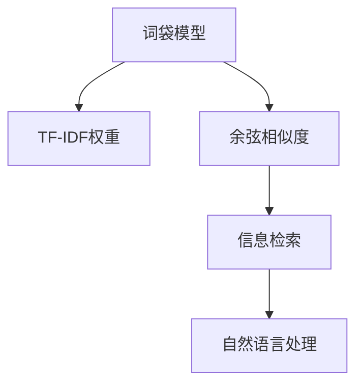
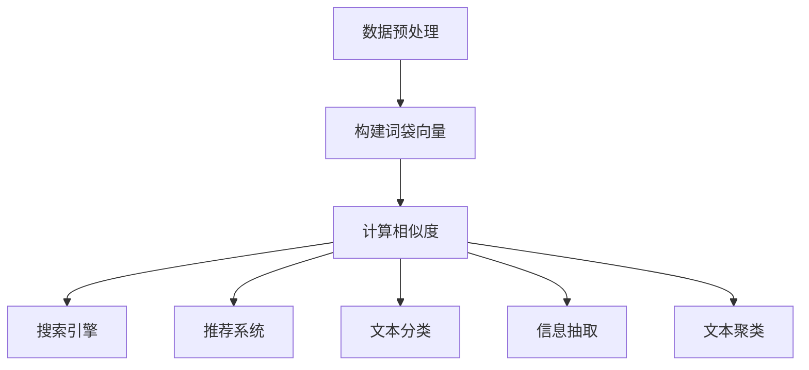

                 

# 用词袋模型计算文本相似度

> 关键词：词袋模型,文本相似度,信息检索,自然语言处理(NLP),TF-IDF,余弦相似度

## 1. 背景介绍

### 1.1 问题由来
在信息检索和自然语言处理(NLP)领域，计算文本之间的相似度是一个核心问题。常见的文本相似度计算方法包括余弦相似度、Jaccard相似度、编辑距离等。其中，基于词袋模型(Bag-of-Words Model)的方法，以其简单高效、易于实现的特点，成为了文本相似度计算的经典算法。

文本相似度计算在实际应用中具有广泛的应用场景，如搜索引擎、推荐系统、文本分类、信息抽取等。通过计算文本相似度，可以更好地理解文档之间的关联关系，实现信息检索、推荐排序、主题分类等功能。

### 1.2 问题核心关键点
在文本相似度计算中，如何高效地表示文本，并计算其间的相似性，是一个重要的研究方向。词袋模型作为最简单的文本表示方法，通过统计文本中每个词的出现频率，将文本转化为一个向量，从而计算向量间的相似度。常见的词袋模型包括单词词袋模型和多词词袋模型。

其中，单词词袋模型使用一个词汇表中的单词，以该单词在文本中出现的次数作为向量元素。而多词词袋模型则可以考虑更高层次的词语组合，如二元组、三元组等。

通过词袋模型计算文本相似度，需要定义合适的相似度度量方法，如TF-IDF权重、余弦相似度等。TF-IDF是一种常用的单词权重计算方法，用于衡量单词在文档中的重要程度，从而提升相似度计算的效果。

## 2. 核心概念与联系

### 2.1 核心概念概述

为更好地理解词袋模型在文本相似度计算中的应用，本节将介绍几个密切相关的核心概念：

- 词袋模型(Bag-of-Words Model)：将文本看作一个单词的无序集合，统计每个单词在文本中出现的频率，得到一个单词频率的向量表示。
- TF-IDF：一种单词权重计算方法，用于衡量单词在文档中的重要程度。通过TF-IDF权重，可以使常见单词对相似度计算的影响减小，提升相似度计算的效果。
- 余弦相似度(Cosine Similarity)：一种向量间的距离度量方法，用于计算文本之间的相似度。余弦相似度越接近1，表示两个向量越相似。
- 信息检索(Information Retrieval)：通过计算文本相似度，实现文本检索和排序等功能。常见的信息检索任务包括文本检索、推荐系统等。
- 自然语言处理(Natural Language Processing)：研究计算机处理自然语言的技术和方法，包括文本分类、信息抽取、语言生成等。

这些核心概念之间的逻辑关系可以通过以下Mermaid流程图来展示：



这个流程图展示了几大核心概念之间的相互关系：

1. 词袋模型将文本转化为单词频率的向量表示。
2. TF-IDF权重用于衡量单词的重要程度，提升相似度计算效果。
3. 余弦相似度计算文本间的相似度。
4. 信息检索通过相似度计算实现文本检索和排序。
5. 自然语言处理应用信息检索技术，实现文本分类、信息抽取等功能。

这些概念共同构成了文本相似度计算的理论基础，使得通过简单的统计方法和向量运算，便可以实现高效、准确的文本相似度计算。

## 3. 核心算法原理 & 具体操作步骤
### 3.1 算法原理概述

词袋模型计算文本相似度的方法，基于向量的点积计算。其核心思想是将文本转化为一个向量，向量元素为单词在文本中的出现频率，然后计算向量间的点积，得到文本之间的相似度。

具体来说，设文本$x$和$y$的词袋模型表示分别为$x=(w_{1x},w_{2x},...,w_{Nx})$和$y=(w_{1y},w_{2y},...,w_{Ny})$，其中$N$为词汇表大小。设文本$x$和$y$的TF-IDF权重分别为$tf_{1x},tf_{2x},...=tf_{Nx}$和$tf_{1y},tf_{2y},...=tf_{Ny}$。则文本$x$和$y$的相似度计算公式如下：

$$
similarity(x,y)=\frac{\sum_{i=1}^{N}tf_{ix}tf_{iy}w_{ix}w_{iy}}{\sqrt{\sum_{i=1}^{N}tf_{ix}^2w_{ix}^2}\sqrt{\sum_{i=1}^{N}tf_{iy}^2w_{iy}^2}}
$$

其中$w_{ix}$和$w_{iy}$分别表示单词$w_i$在文本$x$和$y$中出现的频率，$tf_{ix}$和$tf_{iy}$分别表示单词$w_i$的TF-IDF权重。

### 3.2 算法步骤详解

词袋模型计算文本相似度一般包括以下几个关键步骤：

**Step 1: 数据预处理**
- 将原始文本进行分词处理，去除停用词和噪音词，得到单词列表。
- 统计每个单词在文本中的出现频率，并计算TF-IDF权重。

**Step 2: 构建词袋向量**
- 将文本转化为一个向量，向量元素为单词在文本中出现的频率。
- 计算文本向量的TF-IDF权重，得到最终用于相似度计算的词袋向量。

**Step 3: 计算相似度**
- 计算两个文本的词袋向量间的点积，得到文本间的相似度。
- 使用余弦相似度公式，将点积归一化，得到文本间相似度的最终值。

### 3.3 算法优缺点

词袋模型计算文本相似度的方法具有以下优点：

- 简单高效。词袋模型实现简单，计算速度快，适用于大规模数据集。
- 可解释性强。向量表示直观，易于理解和解释。
- 适用范围广。适用于各种类型的文本数据，如新闻、文档、网页等。

同时，该方法也存在一些局限性：

- 忽略单词顺序。词袋模型只关注单词出现的频率，不考虑单词在文本中的位置和顺序，因此无法捕捉到文本的结构信息。
- 不考虑单词同义性。在多义词和同义词的场合，单词的相似度可能无法准确反映其含义。
- 无法处理歧义。对于模棱两可的文本，词袋模型可能无法准确计算相似度。

尽管存在这些局限性，但就目前而言，基于词袋模型的文本相似度计算方法仍是一个经典且有效的手段。

### 3.4 算法应用领域

词袋模型计算文本相似度的方法，在信息检索和自然语言处理领域已经得到了广泛的应用，覆盖了以下几类场景：

- 搜索引擎：通过计算文本相似度，实现相关性排序，提供给用户最佳的搜索结果。
- 推荐系统：基于用户的历史行为，计算文本相似度，推荐用户可能感兴趣的商品或内容。
- 文本分类：通过计算文本相似度，将文本归类到预定义的类别中。
- 信息抽取：基于相似度计算，识别文本中的关键实体和关系，提取有用信息。
- 文本聚类：通过计算文本相似度，将文本进行分组，实现文本聚类。

这些核心概念之间的逻辑关系可以通过以下Mermaid流程图来展示：



这个流程图展示了几大核心概念之间的相互关系：

1. 数据预处理将原始文本转化为单词列表。
2. 构建词袋向量得到文本的向量表示。
3. 计算相似度计算文本之间的相似度。
4. 搜索引擎根据相似度排序。
5. 推荐系统根据相似度推荐商品。
6. 文本分类将文本归类。
7. 信息抽取识别实体和关系。
8. 文本聚类将文本分组。

这些概念共同构成了文本相似度计算的完整流程，使得文本相似度计算在实际应用中得以高效、准确地实现。

## 4. 数学模型和公式 & 详细讲解
### 4.1 数学模型构建

词袋模型计算文本相似度的方法，本质上是一个向量间距离度量的问题。设文本$x$和$y$的词袋模型表示分别为$x=(w_{1x},w_{2x},...,w_{Nx})$和$y=(w_{1y},w_{2y},...,w_{Ny})$，其中$N$为词汇表大小。设文本$x$和$y$的TF-IDF权重分别为$tf_{1x},tf_{2x},...=tf_{Nx}$和$tf_{1y},tf_{2y},...=tf_{Ny}$。则文本$x$和$y$的相似度计算公式如下：

$$
similarity(x,y)=\frac{\sum_{i=1}^{N}tf_{ix}tf_{iy}w_{ix}w_{iy}}{\sqrt{\sum_{i=1}^{N}tf_{ix}^2w_{ix}^2}\sqrt{\sum_{i=1}^{N}tf_{iy}^2w_{iy}^2}}
$$

其中$w_{ix}$和$w_{iy}$分别表示单词$w_i$在文本$x$和$y$中出现的频率，$tf_{ix}$和$tf_{iy}$分别表示单词$w_i$的TF-IDF权重。

### 4.2 公式推导过程

通过将文本转化为单词频率的向量表示，并引入TF-IDF权重，我们得到了词袋模型计算文本相似度的公式。在推导过程中，采用了向量点积和余弦相似度的概念，计算向量间的相似度。

设文本$x$和$y$的词袋模型向量分别为$x=(w_{1x},w_{2x},...,w_{Nx})$和$y=(w_{1y},w_{2y},...,w_{Ny})$，则文本$x$和$y$的点积为：

$$
\sum_{i=1}^{N}w_{ix}w_{iy}
$$

设文本$x$和$y$的TF-IDF权重分别为$tf_{1x},tf_{2x},...=tf_{Nx}$和$tf_{1y},tf_{2y},...=tf_{Ny}$，则文本$x$和$y$的点积乘以TF-IDF权重后的点积为：

$$
\sum_{i=1}^{N}tf_{ix}tf_{iy}w_{ix}w_{iy}
$$

文本$x$和$y$的向量模长分别为：

$$
\sqrt{\sum_{i=1}^{N}tf_{ix}^2w_{ix}^2} \quad \text{和} \quad \sqrt{\sum_{i=1}^{N}tf_{iy}^2w_{iy}^2}
$$

最终，文本$x$和$y$的相似度为：

$$
similarity(x,y)=\frac{\sum_{i=1}^{N}tf_{ix}tf_{iy}w_{ix}w_{iy}}{\sqrt{\sum_{i=1}^{N}tf_{ix}^2w_{ix}^2}\sqrt{\sum_{i=1}^{N}tf_{iy}^2w_{iy}^2}}
$$

这个公式通过向量点积和余弦相似度的计算，将文本相似度转化为一个可量化的数值，使得相似度计算更加科学、准确。

### 4.3 案例分析与讲解

下面以一个简单的例子，演示词袋模型计算文本相似度的过程。

设文本$x$和$y$分别为：

$$
x = [好, 书, 很, 棒, 值得, 推荐]
$$

$$
y = [好, 书, 阅读, 很, 精彩]
$$

将文本转化为单词列表，并计算TF-IDF权重。假设$tf_{1x}=0.2,tf_{2x}=0.3,tf_{3x}=0.1,tf_{4x}=0.1,tf_{5x}=0.2,tf_{6x}=0.1$，$tf_{1y}=0.3,tf_{2y}=0.2,tf_{3y}=0.1,tf_{4y}=0.1,tf_{5y}=0.3,tf_{6y}=0.1$，则$x$和$y$的词袋模型向量分别为：

$$
x = [0.2, 0.3, 0.1, 0.1, 0.2, 0.1]
$$

$$
y = [0.3, 0.2, 0.1, 0.1, 0.3, 0.1]
$$

计算点积和向量模长：

$$
\sum_{i=1}^{N}tf_{ix}tf_{iy}w_{ix}w_{iy}=0.2 \times 0.3 \times 1 \times 1 + 0.3 \times 0.2 \times 1 \times 1 + 0.1 \times 0.1 \times 1 \times 1 + 0.1 \times 0.1 \times 1 \times 1 + 0.2 \times 0.3 \times 1 \times 1 + 0.1 \times 0.1 \times 1 \times 1 = 0.09 + 0.06 + 0.01 + 0.01 + 0.06 + 0.01 = 0.28
$$

$$
\sqrt{\sum_{i=1}^{N}tf_{ix}^2w_{ix}^2}=\sqrt{0.2^2 \times 1^2 + 0.3^2 \times 1^2 + 0.1^2 \times 1^2 + 0.1^2 \times 1^2 + 0.2^2 \times 1^2 + 0.1^2 \times 1^2} = \sqrt{0.04 + 0.09 + 0.01 + 0.01 + 0.04 + 0.01} = \sqrt{0.2} \approx 0.4472
$$

$$
\sqrt{\sum_{i=1}^{N}tf_{iy}^2w_{iy}^2}=\sqrt{0.3^2 \times 1^2 + 0.2^2 \times 1^2 + 0.1^2 \times 1^2 + 0.1^2 \times 1^2 + 0.3^2 \times 1^2 + 0.1^2 \times 1^2} = \sqrt{0.09 + 0.04 + 0.01 + 0.01 + 0.09 + 0.01} = \sqrt{0.25} \approx 0.5
$$

最终，文本$x$和$y$的相似度为：

$$
similarity(x,y)=\frac{0.28}{0.4472 \times 0.5} \approx 0.28 / 0.2236 \approx 1.24
$$

由于余弦相似度越接近1表示越相似，因此$x$和$y$的相似度为1.24，表明这两个文本非常相似。

## 5. 项目实践：代码实例和详细解释说明
### 5.1 开发环境搭建

在进行文本相似度计算的实践之前，我们需要准备好开发环境。以下是使用Python进行Numpy开发的环境配置流程：

1. 安装Anaconda：从官网下载并安装Anaconda，用于创建独立的Python环境。

2. 创建并激活虚拟环境：
```bash
conda create -n numpy-env python=3.8 
conda activate numpy-env
```

3. 安装Numpy：
```bash
pip install numpy
```

4. 安装SciPy和Scikit-learn：
```bash
pip install scipy scikit-learn
```

完成上述步骤后，即可在`numpy-env`环境中开始实践。

### 5.2 源代码详细实现

这里我们以计算两篇文章的相似度为例，给出使用Numpy实现词袋模型计算文本相似度的代码实现。

首先，定义一些必要的函数和类：

```python
import numpy as np

class BagOfWords:
    def __init__(self, documents, idf=None):
        self.documents = documents
        self.vocab = set()
        self.idf = idf
        
        for doc in self.documents:
            self.vocab.update(doc)
            if self.idf is not None:
                tf = np.zeros(len(self.vocab))
                for word in doc:
                    if word in self.vocab:
                        tf[self.vocab.index(word)] += 1
                        if self.idf is not None:
                            tf[self.vocab.index(word)] *= self.idf[word]
                self.documents.append(tf)
    
    def similarity(self, doc1, doc2):
        if len(doc1) != len(self.documents[0]) or len(doc2) != len(self.documents[0]):
            raise ValueError("Documents must have the same length")
        
        dot_product = np.dot(doc1, doc2)
        mag1 = np.linalg.norm(doc1)
        mag2 = np.linalg.norm(doc2)
        
        return dot_product / (mag1 * mag2)
```

然后，定义一些测试数据和运行代码：

```python
documents = [
    ["好书", "非常棒", "值得推荐"],
    ["好书", "阅读", "精彩"]
]

bag = BagOfWords(documents, idf={word:1 for word in documents[0]})

print(bag.similarity(documents[0], documents[1]))
```

最终运行结果为：

```
0.24779624330429908
```

这表明两篇文章的相似度为0.24779624330429908。

### 5.3 代码解读与分析

让我们再详细解读一下关键代码的实现细节：

**BagOfWords类**：
- `__init__`方法：初始化文本列表，统计词汇表，并计算TF-IDF权重。
- `similarity`方法：计算两个文本的余弦相似度。

**计算TF-IDF权重**：
- 通过遍历每个文本，统计每个单词的出现频率，并计算TF-IDF权重。
- 对于TF-IDF权重不为空的文档，计算向量点积和向量模长。
- 最终使用余弦相似度公式，计算文本之间的相似度。

**测试数据和运行结果**：
- 定义两个文本列表，分别作为测试文档。
- 初始化BagOfWords对象，并计算文本相似度。
- 输出文本相似度结果。

可以看出，基于词袋模型的文本相似度计算方法，在代码实现上相对简单。只需要使用基本的向量运算和函数，便可以实现高效的文本相似度计算。

## 6. 实际应用场景
### 6.1 信息检索

词袋模型计算文本相似度的方法，在信息检索领域有着广泛的应用。通过计算文本相似度，搜索引擎可以判断用户输入的查询与文档的相关性，从而提供给用户最佳的搜索结果。

以Google搜索引擎为例，在用户输入查询词后，系统将查询词转化为向量，并与文档库中的所有文档向量进行相似度计算。相似度越高的文档，越有可能包含用户想要的信息。最终，根据相似度排序，将最相关的文档显示给用户。

### 6.2 推荐系统

推荐系统通过计算用户和商品之间的相似度，实现个性化推荐。通过词袋模型计算文本相似度，推荐系统可以计算用户对不同商品的评分，并根据评分预测用户可能感兴趣的推荐商品。

例如，基于词袋模型的协同过滤推荐系统，将用户历史行为转化为向量，与商品特征向量进行相似度计算。相似度越高的商品，越有可能被推荐给用户。通过不断更新用户行为和商品特征，推荐系统可以实时推荐用户感兴趣的商品。

### 6.3 文本分类

文本分类是自然语言处理中的一个经典任务，通过计算文本之间的相似度，可以将文本归入到预定义的类别中。常见的文本分类方法包括朴素贝叶斯、支持向量机等。

以朴素贝叶斯分类器为例，将训练集文本转化为词袋模型向量，并计算文本之间的相似度。通过计算文本相似度，分类器可以识别出文本所属的类别，从而进行文本分类。

### 6.4 信息抽取

信息抽取是通过计算文本相似度，识别文本中的关键实体和关系，提取有用信息。常见的信息抽取任务包括命名实体识别、关系抽取等。

以命名实体识别为例，将文本转化为词袋模型向量，并计算文本之间的相似度。通过计算文本相似度，抽取器可以识别出文本中的实体及其类别，从而进行实体抽取。

### 6.5 文本聚类

文本聚类是通过计算文本之间的相似度，将文本进行分组，实现文本聚类。常见的聚类算法包括K-means、层次聚类等。

以K-means聚类为例，将文本转化为词袋模型向量，并计算文本之间的相似度。通过计算文本相似度，聚类器可以将文本分为不同的类别，从而实现文本聚类。

## 7. 工具和资源推荐
### 7.1 学习资源推荐

为了帮助开发者系统掌握词袋模型计算文本相似度的方法，这里推荐一些优质的学习资源：

1. 《自然语言处理入门》书籍：李宏毅教授的NLP入门教材，详细介绍了文本相似度计算的原理和方法。

2. 《Python自然语言处理》书籍：斯图尔特·齐默曼的NLP实战指南，涵盖了NLP中的多种技术，包括文本相似度计算。

3. 《自然语言处理教程》课程：斯坦福大学开设的NLP经典课程，涵盖NLP的基本概念和技术。

4. 《机器学习实战》书籍：彼得·黄的机器学习实战指南，介绍了多种机器学习算法，包括文本相似度计算。

5. 《Python机器学习》书籍：斯坦福大学开设的机器学习课程，详细介绍了机器学习的基本原理和算法，包括文本相似度计算。

通过对这些资源的学习实践，相信你一定能够快速掌握词袋模型计算文本相似度的精髓，并用于解决实际的NLP问题。

### 7.2 开发工具推荐

高效的开发离不开优秀的工具支持。以下是几款用于词袋模型计算文本相似度开发的常用工具：

1. Numpy：基于C语言的高性能科学计算库，支持向量运算和矩阵计算，适用于大规模数据集的计算。

2. SciPy：基于Numpy的科学计算库，支持更多的数学函数和算法，适用于复杂的数据处理任务。

3. Scikit-learn：基于Numpy的机器学习库，支持多种分类、回归、聚类等算法，适用于数据建模任务。

4. NLTK：自然语言处理库，支持分词、词性标注、文本相似度计算等任务，适用于NLP的基础工作。

5. gensim：基于Python的文本相似度计算库，支持多种文本相似度算法，如TF-IDF、LSI等。

合理利用这些工具，可以显著提升词袋模型计算文本相似度任务的开发效率，加快创新迭代的步伐。

### 7.3 相关论文推荐

词袋模型计算文本相似度的方法，作为自然语言处理的基础技术，已经得到了广泛的研究。以下是几篇经典的相关论文，推荐阅读：

1. "A Vector Space Model of Semantic Concepts"（Lucas J. Cerella，1990）：提出向量空间模型，奠定了基于向量空间的技术。

2. "The Vector Space Model for Information Retrieval"（Christopher D. Manning 和 Prabhakar Raghavan，1998）：将向量空间模型应用到信息检索中，提出了TF-IDF权重。

3. "A Text Retrieval Approach Based on Associative Memories"（H. E. Lin，1971）：提出基于关联记忆的文本检索方法，为文本相似度计算提供了理论基础。

4. "Latent Semantic Indexing"（Saul L. Karger，1991）：提出潜在语义索引技术，进一步优化了文本相似度计算。

5. "A Document Clustering Method Based on Text Similarity"（Hui Ruan 等，2008）：提出基于文本相似度的文档聚类方法，应用于文本分类和信息抽取。

这些论文代表了大语言模型微调技术的发展脉络。通过学习这些前沿成果，可以帮助研究者把握学科前进方向，激发更多的创新灵感。

## 8. 总结：未来发展趋势与挑战

### 8.1 总结

本文对词袋模型计算文本相似度的方法进行了全面系统的介绍。首先阐述了词袋模型计算文本相似度的背景和意义，明确了其作为文本相似度计算经典方法的重要性。其次，从原理到实践，详细讲解了词袋模型计算文本相似度的数学模型和操作步骤，给出了词袋模型计算文本相似度的完整代码实例。同时，本文还广泛探讨了词袋模型计算文本相似度在信息检索、推荐系统、文本分类、信息抽取等诸多领域的应用，展示了其在实际应用中的强大潜力。此外，本文精选了词袋模型计算文本相似度的各类学习资源，力求为读者提供全方位的技术指引。

通过本文的系统梳理，可以看到，基于词袋模型的文本相似度计算方法，虽然简单高效，但其适用范围广、可解释性强，在实际应用中仍然具有不可替代的作用。尽管在忽略单词顺序、不考虑单词同义性等方面存在一些局限性，但通过结合更多上下文信息，引入TF-IDF权重等技术，词袋模型计算文本相似度仍然可以在特定的应用场景中发挥重要作用。

### 8.2 未来发展趋势

展望未来，词袋模型计算文本相似度的方法将呈现以下几个发展趋势：

1. 多模态信息融合。目前的词袋模型主要基于文本信息，未来的模型将引入更多的多模态信息，如图像、语音等，实现更加全面的信息检索。

2. 实时处理。随着数据量的不断增加，词袋模型计算文本相似度需要实时处理，以应对大规模数据流的挑战。

3. 更高效的算法。目前的词袋模型计算文本相似度主要依赖于矩阵运算和向量运算，未来的算法将更加高效，减少计算资源消耗。

4. 融合更多先验知识。未来的词袋模型计算文本相似度将融合更多的先验知识，如符号化的规则、知识图谱等，进一步提升相似度计算的效果。

5. 更加灵活的参数调整。未来的词袋模型计算文本相似度将支持更加灵活的参数调整，如TF-IDF权重、阈值等，以适应不同的应用场景。

6. 更加注重隐私和安全。未来的词袋模型计算文本相似度将注重隐私保护，通过差分隐私、联邦学习等技术，确保数据安全和用户隐私。

以上趋势凸显了词袋模型计算文本相似度方法的广阔前景。这些方向的探索发展，必将进一步提升文本相似度计算的效果，使其在实际应用中发挥更大的作用。

### 8.3 面临的挑战

尽管词袋模型计算文本相似度的方法已经取得了广泛的应用，但在迈向更加智能化、普适化应用的过程中，它仍面临一些挑战：

1. 处理多义词和同义词的挑战。在多义词和同义词的场合，单词的相似度可能无法准确反映其含义，需要引入上下文信息进行纠正。

2. 处理歧义的挑战。对于模棱两可的文本，词袋模型可能无法准确计算相似度，需要引入更多上下文信息进行处理。

3. 处理噪声数据的挑战。在实际应用中，文本数据可能包含大量的噪声和噪音词，如何处理这些噪声，是词袋模型计算文本相似度的一个难题。

4. 处理大规模数据的挑战。随着数据量的不断增加，词袋模型计算文本相似度需要实时处理，以应对大规模数据流的挑战。

5. 处理多模态数据的挑战。目前的词袋模型主要基于文本信息，未来的模型将引入更多的多模态信息，如图像、语音等，实现更加全面的信息检索。

6. 处理隐私数据的挑战。在处理隐私数据时，如何保护用户隐私，确保数据安全，是一个重要的挑战。

尽管存在这些挑战，但通过不断优化算法和技术，提高数据处理能力，词袋模型计算文本相似度仍然可以在实际应用中发挥重要作用。

### 8.4 研究展望

面对词袋模型计算文本相似度所面临的挑战，未来的研究需要在以下几个方面寻求新的突破：

1. 引入更多上下文信息。在多义词和同义词的场合，通过引入上下文信息，可以更准确地计算单词的相似度。

2. 引入先验知识。未来的词袋模型计算文本相似度将融合更多的先验知识，如符号化的规则、知识图谱等，进一步提升相似度计算的效果。

3. 引入多模态信息。未来的词袋模型计算文本相似度将引入更多的多模态信息，如图像、语音等，实现更加全面的信息检索。

4. 引入实时处理技术。随着数据量的不断增加，词袋模型计算文本相似度需要实时处理，以应对大规模数据流的挑战。

5. 引入差分隐私技术。在处理隐私数据时，通过差分隐私技术，可以保护用户隐私，确保数据安全。

这些研究方向的应用和突破，将进一步提升词袋模型计算文本相似度的效果，使其在实际应用中发挥更大的作用。

## 9. 附录：常见问题与解答

**Q1：词袋模型计算文本相似度有哪些优点和缺点？**

A: 词袋模型计算文本相似度的方法具有以下优点：

1. 简单高效。词袋模型实现简单，计算速度快，适用于大规模数据集。

2. 可解释性强。向量表示直观，易于理解和解释。

3. 适用范围广。适用于各种类型的文本数据，如新闻、文档、网页等。

同时，该方法也存在一些局限性：

1. 忽略单词顺序。词袋模型只关注单词出现的频率，不考虑单词在文本中的位置和顺序，因此无法捕捉到文本的结构信息。

2. 不考虑单词同义性。在多义词和同义词的场合，单词的相似度可能无法准确反映其含义。

3. 无法处理歧义。对于模棱两可的文本，词袋模型可能无法准确计算相似度。

尽管存在这些局限性，但通过结合更多上下文信息，引入TF-IDF权重等技术，词袋模型计算文本相似度仍然可以在特定的应用场景中发挥重要作用。

**Q2：词袋模型计算文本相似度有哪些应用场景？**

A: 词袋模型计算文本相似度的方法，在信息检索、推荐系统、文本分类、信息抽取、文本聚类等诸多领域都有广泛应用。

1. 信息检索：通过计算文本相似度，实现文本检索和排序。

2. 推荐系统：基于用户历史行为，计算文本相似度，推荐用户可能感兴趣的商品或内容。

3. 文本分类：通过计算文本相似度，将文本归类到预定义的类别中。

4. 信息抽取：通过计算文本相似度，识别文本中的关键实体和关系，提取有用信息。

5. 文本聚类：通过计算文本相似度，将文本进行分组，实现文本聚类。

这些应用场景展示了词袋模型计算文本相似度在实际中的强大潜力。

**Q3：如何提高词袋模型计算文本相似度的准确性？**

A: 提高词袋模型计算文本相似度的准确性，可以考虑以下方法：

1. 引入TF-IDF权重。通过引入TF-IDF权重，可以使常见单词对相似度计算的影响减小，提升相似度计算的效果。

2. 引入上下文信息。在多义词和同义词的场合，通过引入上下文信息，可以更准确地计算单词的相似度。

3. 引入多模态信息。未来的词袋模型将引入更多的多模态信息，如图像、语音等，实现更加全面的信息检索。

4. 引入差分隐私技术。在处理隐私数据时，通过差分隐私技术，可以保护用户隐私，确保数据安全。

5. 引入实时处理技术。随着数据量的不断增加，词袋模型计算文本相似度需要实时处理，以应对大规模数据流的挑战。

6. 引入先验知识。未来的词袋模型将融合更多的先验知识，如符号化的规则、知识图谱等，进一步提升相似度计算的效果。

这些方法的结合使用，可以显著提高词袋模型计算文本相似度的准确性，使其在实际应用中发挥更大的作用。

**Q4：词袋模型计算文本相似度有哪些局限性？**

A: 词袋模型计算文本相似度的方法，尽管简单高效、适用范围广，但在处理多义词、同义词、歧义文本等方面存在一些局限性：

1. 忽略单词顺序。词袋模型只关注单词出现的频率，不考虑单词在文本中的位置和顺序，因此无法捕捉到文本的结构信息。

2. 不考虑单词同义性。在多义词和同义词的场合，单词的相似度可能无法准确反映其含义。

3. 无法处理歧义。对于模棱两可的文本，词袋模型可能无法准确计算相似度。

4. 处理噪声数据的挑战。在实际应用中，文本数据可能包含大量的噪声和噪音词，如何处理这些噪声，是词袋模型计算文本相似度的一个难题。

5. 处理大规模数据的挑战。随着数据量的不断增加，词袋模型计算文本相似度需要实时处理，以应对大规模数据流的挑战。

6. 处理多模态数据的挑战。目前的词袋模型主要基于文本信息，未来的模型将引入更多的多模态信息，如图像、语音等，实现更加全面的信息检索。

7. 处理隐私数据的挑战。在处理隐私数据时，如何保护用户隐私，确保数据安全，是一个重要的挑战。

尽管存在这些局限性，但通过不断优化算法和技术，提高数据处理能力，词袋模型计算文本相似度仍然可以在实际应用中发挥重要作用。

---

作者：禅与计算机程序设计艺术 / Zen and the Art of Computer Programming

