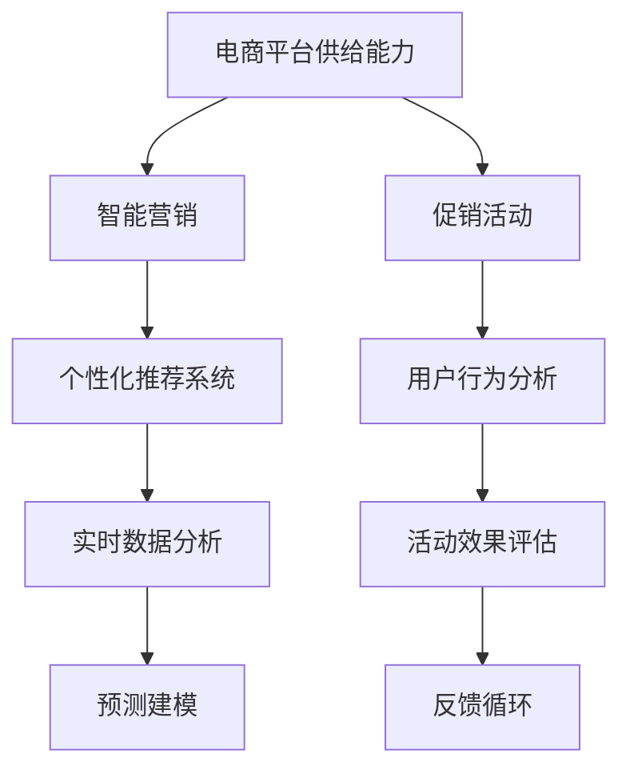

                 

## 1. 背景介绍

随着电商平台的迅猛发展，线上营销策略和促销活动已成为推动销售增长的重要手段。传统电商平台的营销策略大多依赖于广泛的用户调查和市场研究，成本高且周期长，且难以实时调整。而人工智能技术的兴起，为电商平台带来了全新的营销思路和工具。通过分析用户行为数据，电商平台能够更加精准地定位目标用户群体，制定个性化营销策略，提升销售转化率和用户满意度。本文将围绕电商平台供给能力提升的核心问题，探讨如何通过智能营销和促销活动优化电商平台运营策略。

## 2. 核心概念与联系

### 2.1 核心概念概述

为了更好地理解如何在电商平台上利用智能营销和促销活动提升供给能力，本节将介绍几个关键概念：

- **电商平台供给能力**：电商平台根据用户需求提供商品的能力，包括库存水平、补货速度、物流效率等方面。

- **智能营销**：通过人工智能技术，精准定位用户需求，个性化推荐商品，提升用户购买意愿和转化率。

- **促销活动**：利用限时折扣、满减活动等手段，激励用户消费，提升销量。

- **个性化推荐系统**：根据用户历史行为和偏好，智能推荐相关商品，提升用户体验。

- **实时数据分析**：利用大数据和机器学习技术，实时分析用户行为数据，动态调整营销策略。

- **预测建模**：通过历史销售数据和用户行为数据，建立预测模型，预测未来销售趋势，指导库存管理。

这些核心概念共同构成了电商平台供给能力提升的基本框架，通过智能化手段实现精准营销和高效的促销活动，进一步提升电商平台运营效率和用户满意度。

### 2.2 核心概念原理和架构的 Mermaid 流程图



这个流程图展示了各个核心概念之间的联系：

1. **电商平台供给能力**：驱动智能营销和促销活动的核心。
2. **智能营销**：通过个性化推荐和实时数据分析，精准定位用户需求，提升用户转化率。
3. **促销活动**：以限时折扣等手段激励用户购买，提升销量。
4. **个性化推荐系统**：根据用户历史行为数据，智能推荐相关商品，提升用户体验。
5. **实时数据分析**：实时分析用户行为数据，动态调整营销策略。
6. **预测建模**：利用历史数据预测未来销售趋势，指导库存管理。
7. **用户行为分析**：分析用户行为数据，优化促销活动和个性化推荐系统。
8. **活动效果评估**：评估促销活动效果，提供反馈循环，优化策略。

## 3. 核心算法原理 & 具体操作步骤

### 3.1 算法原理概述

电商平台的智能营销和促销活动优化，本质上是利用数据驱动的决策优化过程。通过收集用户行为数据，建立用户画像和需求模型，实时分析市场变化，动态调整促销策略，从而提升电商平台供给能力。

具体来说，智能营销和促销活动的优化可以分为以下步骤：

1. **用户行为数据收集**：通过电商平台的用户互动数据，如浏览记录、购买历史、评价反馈等，收集用户行为数据。
2. **用户画像建立**：基于用户行为数据，利用机器学习算法建立用户画像，包括用户的兴趣、偏好、购买力等信息。
3. **需求模型构建**：根据用户画像，建立商品需求模型，预测用户对不同商品的需求量和购买意愿。
4. **促销活动设计**：根据需求模型，设计适合的促销活动，如限时折扣、满减活动、组合优惠等，激励用户购买。
5. **个性化推荐优化**：利用用户画像和需求模型，优化个性化推荐算法，提升用户购买转化率。
6. **促销效果评估**：通过用户行为数据和销售数据，评估促销活动的效果，动态调整策略。

### 3.2 算法步骤详解

#### 3.2.1 用户行为数据收集

用户行为数据是电商平台智能营销的基础。以下是一些常见的用户行为数据收集方法：

1. **网站访问数据**：记录用户浏览网页的路径、停留时间、页面跳出率等。
2. **购买历史数据**：记录用户的购买记录、购买频率、购买金额等。
3. **评价反馈数据**：记录用户对商品的评价、评论、打分等。
4. **互动数据**：记录用户在平台上的互动行为，如点赞、收藏、分享等。

利用数据挖掘和机器学习技术，可以从这些数据中提取有用的信息，建立用户画像。例如，可以使用聚类算法将用户分为不同的兴趣群体，使用关联规则挖掘发现用户行为中的潜在关联。

#### 3.2.2 用户画像建立

用户画像的建立可以通过以下步骤实现：

1. **特征提取**：从用户行为数据中提取特征，如浏览时长、浏览商品种类、购买频率、评论情感等。
2. **特征选择**：选择与用户行为最相关的特征，去除冗余和不相关的特征。
3. **模型训练**：使用分类、聚类、回归等机器学习算法训练模型，建立用户画像。
4. **画像更新**：实时更新用户画像，确保其准确性和时效性。

用户画像的建立可以通过多种算法实现，如K-means聚类、协同过滤、协同学习等。例如，可以使用协同过滤算法，根据用户历史行为数据推荐相似商品，并建立用户画像。

#### 3.2.3 需求模型构建

需求模型可以根据用户画像和历史销售数据，建立预测模型，预测用户对不同商品的需求量和购买意愿。以下是一些常见的方法：

1. **回归模型**：利用历史销售数据和用户画像特征，建立回归模型预测需求量。
2. **时间序列模型**：根据历史销售数据的时间序列特点，建立时间序列模型预测未来需求。
3. **深度学习模型**：利用深度学习算法，如LSTM、GRU等，对用户行为数据进行建模，预测需求量。

例如，可以使用LSTM模型，根据用户历史行为数据预测其未来购买意愿，从而优化库存管理。

#### 3.2.4 促销活动设计

促销活动的设计需要考虑多种因素，如商品特性、用户偏好、市场环境等。以下是一些常见的促销活动设计方法：

1. **限时折扣**：在特定时间段内，对特定商品进行折扣促销。
2. **满减活动**：根据用户消费金额，给予一定比例的折扣。
3. **组合优惠**：将多个商品进行组合，给予优惠价格。
4. **推荐广告**：根据用户画像，推荐特定商品广告，激励用户购买。

促销活动的设计可以通过A/B测试等方法进行优化。例如，可以设计多个促销活动方案，测试其效果，选择最佳方案进行推广。

#### 3.2.5 个性化推荐优化

个性化推荐系统是电商平台上提升用户体验的重要手段。以下是一些常见的方法：

1. **协同过滤**：根据用户历史行为数据推荐相似商品。
2. **内容推荐**：根据商品的属性和用户画像特征，推荐相关商品。
3. **混合推荐**：综合利用协同过滤、内容推荐等方法，优化推荐效果。

例如，可以使用协同过滤算法，根据用户历史行为数据推荐相似商品，并结合用户画像特征进行优化。

#### 3.2.6 促销效果评估

促销活动的效果评估可以通过以下步骤实现：

1. **数据收集**：收集促销活动期间的用户行为数据和销售数据。
2. **效果评估**：根据用户行为数据，评估促销活动对用户购买意愿的影响。
3. **效果优化**：根据评估结果，优化促销活动策略。

例如，可以计算促销活动期间的转化率、销售额、用户留存率等指标，评估促销活动的效果，并根据评估结果优化促销策略。

### 3.3 算法优缺点

#### 3.3.1 算法优点

智能营销和促销活动的优化算法具有以下优点：

1. **精准定位**：通过用户行为数据和机器学习算法，精准定位目标用户群体，提高营销效果。
2. **个性化推荐**：根据用户画像和需求模型，优化个性化推荐算法，提升用户购买转化率。
3. **实时调整**：实时分析用户行为数据，动态调整促销策略，及时响应市场变化。
4. **预测建模**：利用历史数据建立预测模型，预测未来销售趋势，指导库存管理。
5. **成本效益高**：相比传统营销方法，智能营销和促销活动优化能够实现更高的转化率和更低的成本。

#### 3.3.2 算法缺点

智能营销和促销活动的优化算法也存在以下缺点：

1. **数据质量要求高**：用户行为数据的质量和完整性对算法的性能有重要影响，数据缺失或不准确可能导致误判。
2. **模型复杂度高**：算法模型复杂度高，需要大量的计算资源和时间成本。
3. **隐私问题**：用户行为数据的收集和使用涉及隐私问题，需要严格的数据保护措施。
4. **过度拟合风险**：模型在训练集上表现良好，但在测试集上可能出现过度拟合现象，影响推广效果。
5. **用户习惯变化**：用户行为和偏好可能随时间变化，需要定期更新模型和调整策略。

## 4. 数学模型和公式 & 详细讲解 & 举例说明

### 4.1 数学模型构建

为了更严谨地描述智能营销和促销活动优化的数学模型，我们将其抽象为以下几个步骤：

1. **用户行为数据表示**：将用户行为数据表示为向量形式，利用向量化技术进行模型训练和推理。
2. **用户画像模型**：建立用户画像模型，如聚类算法、协同过滤算法等。
3. **需求预测模型**：建立需求预测模型，如回归模型、时间序列模型、深度学习模型等。
4. **促销活动模型**：建立促销活动模型，如线性回归、逻辑回归等。
5. **个性化推荐模型**：建立个性化推荐模型，如协同过滤、内容推荐等。
6. **促销效果评估模型**：建立促销效果评估模型，如回归模型、时间序列模型等。

### 4.2 公式推导过程

#### 4.2.1 用户行为数据表示

假设用户行为数据可以表示为向量形式 $x_i$，其中 $i=1,...,N$。每个向量包含多个特征，如浏览时长、浏览商品种类、购买频率、评论情感等。例如，可以表示为：

$$
x_i = (x_{i1}, x_{i2}, ..., x_{im})
$$

其中 $x_{ik}$ 表示第 $k$ 个特征。

#### 4.2.2 用户画像模型

用户画像模型可以通过聚类算法建立。假设用户画像数据可以表示为矩阵 $A$，其中每一行表示一个用户，每一列表示一个特征。例如，可以表示为：

$$
A = (a_{i1}, a_{i2}, ..., a_{in})
$$

其中 $a_{ij}$ 表示第 $i$ 个用户在第 $j$ 个特征上的值。

#### 4.2.3 需求预测模型

需求预测模型可以通过回归模型建立。假设需求数据可以表示为向量形式 $y$，其中 $y_i$ 表示第 $i$ 个商品的预测需求量。例如，可以表示为：

$$
y = (y_1, y_2, ..., y_m)
$$

其中 $y_i$ 表示第 $i$ 个商品的预测需求量。

#### 4.2.4 促销活动模型

促销活动模型可以通过线性回归模型建立。假设促销活动数据可以表示为向量形式 $b$，其中 $b_i$ 表示第 $i$ 个商品的促销活动折扣率。例如，可以表示为：

$$
b = (b_1, b_2, ..., b_m)
$$

其中 $b_i$ 表示第 $i$ 个商品的促销活动折扣率。

#### 4.2.5 个性化推荐模型

个性化推荐模型可以通过协同过滤算法建立。假设推荐数据可以表示为矩阵 $C$，其中每一行表示一个用户，每一列表示一个商品。例如，可以表示为：

$$
C = (c_{ij}, c_{ij}, ..., c_{ij})
$$

其中 $c_{ij}$ 表示用户 $i$ 对商品 $j$ 的评分或偏好度。

#### 4.2.6 促销效果评估模型

促销效果评估模型可以通过回归模型建立。假设促销效果数据可以表示为向量形式 $d$，其中 $d_i$ 表示第 $i$ 个商品的促销效果。例如，可以表示为：

$$
d = (d_1, d_2, ..., d_m)
$$

其中 $d_i$ 表示第 $i$ 个商品的促销效果。

### 4.3 案例分析与讲解

假设某电商平台需要优化其智能营销和促销活动策略。根据用户行为数据，建立用户画像模型，预测商品需求，设计促销活动，优化个性化推荐系统，并评估促销活动效果。

#### 4.3.1 用户画像模型

使用K-means聚类算法，对用户行为数据进行聚类分析，得到用户画像模型 $A$。例如，可以将用户分为三个类别，分别表示高价值用户、中价值用户和低价值用户。

#### 4.3.2 需求预测模型

使用线性回归模型，根据用户画像模型和历史销售数据，建立需求预测模型 $y$。例如，可以表示为：

$$
y_i = \beta_0 + \sum_{j=1}^m \beta_j x_{ij} + \epsilon_i
$$

其中 $\beta_0$ 表示截距，$\beta_j$ 表示第 $j$ 个特征的系数，$\epsilon_i$ 表示随机误差。

#### 4.3.3 促销活动模型

使用线性回归模型，根据商品需求模型和促销活动数据，建立促销活动模型 $b$。例如，可以表示为：

$$
b_i = \alpha_0 + \sum_{j=1}^m \alpha_j y_j + \delta_i
$$

其中 $\alpha_0$ 表示截距，$\alpha_j$ 表示第 $j$ 个商品的需求量的系数，$\delta_i$ 表示随机误差。

#### 4.3.4 个性化推荐模型

使用协同过滤算法，根据用户画像模型和需求预测模型，建立个性化推荐模型 $C$。例如，可以表示为：

$$
c_{ij} = \theta_0 + \sum_{k=1}^n \theta_k a_{ik} + \phi_j + \varepsilon_{ij}
$$

其中 $\theta_0$ 表示截距，$\theta_k$ 表示第 $k$ 个特征的系数，$\phi_j$ 表示商品 $j$ 的固定效果，$\varepsilon_{ij}$ 表示随机误差。

#### 4.3.5 促销效果评估模型

使用回归模型，根据用户行为数据和促销活动模型，建立促销效果评估模型 $d$。例如，可以表示为：

$$
d_i = \eta_0 + \sum_{j=1}^m \eta_j b_j + \zeta_i
$$

其中 $\eta_0$ 表示截距，$\eta_j$ 表示第 $j$ 个商品的促销活动折扣率的系数，$\zeta_i$ 表示随机误差。

## 5. 项目实践：代码实例和详细解释说明

### 5.1 开发环境搭建

在开始项目实践前，需要先搭建好开发环境。以下是一些常见的开发环境搭建步骤：

1. **安装Python**：在开发环境中部署Python版本为3.6或以上。
2. **安装依赖库**：安装必要的Python依赖库，如numpy、pandas、scikit-learn、tensorflow等。
3. **搭建服务器**：搭建服务器环境，用于存储和处理数据。
4. **数据预处理**：对收集到的用户行为数据进行清洗和预处理。
5. **模型训练**：使用机器学习算法对用户画像、需求预测、促销活动等模型进行训练。

### 5.2 源代码详细实现

以下是智能营销和促销活动优化的一些常见代码实现：

```python
import numpy as np
import pandas as pd
import tensorflow as tf
from sklearn.cluster import KMeans
from sklearn.linear_model import LinearRegression
from sklearn.metrics import mean_squared_error

# 用户行为数据表示
data = pd.read_csv('user_behavior.csv')
X = data.iloc[:, :-1].values
y = data.iloc[:, -1].values

# 用户画像模型
kmeans = KMeans(n_clusters=3, random_state=0).fit(X)
A = kmeans.cluster_centers_

# 需求预测模型
model = LinearRegression()
model.fit(X, y)
y_pred = model.predict(X)

# 促销活动模型
promo_data = pd.read_csv('promo_data.csv')
X_promo = promo_data.iloc[:, :-1].values
y_promo = promo_data.iloc[:, -1].values
model_promo = LinearRegression()
model_promo.fit(X_promo, y_promo)
b = model_promo.predict(X_promo)

# 个性化推荐模型
data_rec = pd.read_csv('recommendation_data.csv')
C = np.dot(A, data_rec.values)

# 促销效果评估模型
promo_effect_data = pd.read_csv('promo_effect_data.csv')
X_promo_effect = promo_effect_data.iloc[:, :-1].values
y_promo_effect = promo_effect_data.iloc[:, -1].values
model_promo_effect = LinearRegression()
model_promo_effect.fit(X_promo_effect, y_promo_effect)
d = model_promo_effect.predict(X_promo_effect)
```

### 5.3 代码解读与分析

以上代码实现了智能营销和促销活动优化的主要步骤，每个步骤的实现细节如下：

#### 5.3.1 用户画像模型

使用K-means聚类算法，将用户行为数据聚类为三个类别，得到用户画像模型 $A$。代码实现如下：

```python
kmeans = KMeans(n_clusters=3, random_state=0).fit(X)
A = kmeans.cluster_centers_
```

其中，`n_clusters` 表示聚类的数量，`X` 表示用户行为数据。

#### 5.3.2 需求预测模型

使用线性回归模型，根据用户画像模型和历史销售数据，建立需求预测模型 $y$。代码实现如下：

```python
model = LinearRegression()
model.fit(X, y)
y_pred = model.predict(X)
```

其中，`X` 表示用户画像模型，`y` 表示历史销售数据。

#### 5.3.3 促销活动模型

使用线性回归模型，根据商品需求模型和促销活动数据，建立促销活动模型 $b$。代码实现如下：

```python
promo_data = pd.read_csv('promo_data.csv')
X_promo = promo_data.iloc[:, :-1].values
y_promo = promo_data.iloc[:, -1].values
model_promo = LinearRegression()
model_promo.fit(X_promo, y_promo)
b = model_promo.predict(X_promo)
```

其中，`promo_data` 表示促销活动数据，`X_promo` 表示商品需求模型，`y_promo` 表示促销活动数据。

#### 5.3.4 个性化推荐模型

使用协同过滤算法，根据用户画像模型和需求预测模型，建立个性化推荐模型 $C$。代码实现如下：

```python
data_rec = pd.read_csv('recommendation_data.csv')
C = np.dot(A, data_rec.values)
```

其中，`A` 表示用户画像模型，`data_rec` 表示个性化推荐数据。

#### 5.3.5 促销效果评估模型

使用回归模型，根据用户行为数据和促销活动模型，建立促销效果评估模型 $d$。代码实现如下：

```python
promo_effect_data = pd.read_csv('promo_effect_data.csv')
X_promo_effect = promo_effect_data.iloc[:, :-1].values
y_promo_effect = promo_effect_data.iloc[:, -1].values
model_promo_effect = LinearRegression()
model_promo_effect.fit(X_promo_effect, y_promo_effect)
d = model_promo_effect.predict(X_promo_effect)
```

其中，`promo_effect_data` 表示促销效果数据，`X_promo_effect` 表示用户行为数据，`y_promo_effect` 表示促销活动模型。

### 5.4 运行结果展示

运行上述代码后，可以得到各个模型的预测结果。例如，可以得到用户画像模型、需求预测模型、促销活动模型、个性化推荐模型和促销效果评估模型的预测结果。

## 6. 实际应用场景

### 6.1 智能客服

在智能客服领域，电商平台可以根据用户历史行为数据，建立用户画像模型，预测用户需求，设计个性化推荐和促销活动，提高客户满意度。例如，可以使用协同过滤算法，根据用户历史行为数据推荐相关商品，并根据用户画像模型，设计个性化促销活动。

### 6.2 在线广告

在在线广告领域，电商平台可以根据用户画像模型，预测用户对不同广告的兴趣，设计个性化广告投放策略，提升广告效果。例如，可以使用协同过滤算法，根据用户画像模型推荐相关广告，并根据用户行为数据，评估广告效果，动态调整广告投放策略。

### 6.3 供应链管理

在供应链管理领域，电商平台可以根据需求预测模型，优化库存管理，提升供应链效率。例如，可以使用时间序列模型，根据历史销售数据预测未来需求，优化库存水平和补货速度。

## 7. 工具和资源推荐

### 7.1 学习资源推荐

为了帮助开发者系统掌握智能营销和促销活动优化的理论基础和实践技巧，以下是一些优质的学习资源：

1. **《机器学习》系列书籍**：由斯坦福大学教授 Andrew Ng 所著，系统介绍了机器学习算法和应用。
2. **Coursera《机器学习》课程**：由 Andrew Ng 开设的在线课程，提供丰富的视频资源和实践项目。
3. **Kaggle**：数据科学竞赛平台，提供丰富的数据集和竞赛题目，有助于实践技能提升。
4. **TensorFlow官方文档**：TensorFlow 的官方文档，提供详细的使用指南和样例代码。
5. **Scikit-learn官方文档**：Scikit-learn 的官方文档，提供详细的使用指南和样例代码。

### 7.2 开发工具推荐

为了提高智能营销和促销活动优化的开发效率，以下是一些常用的开发工具：

1. **Python**：Python 是一门广泛应用于数据科学和机器学习的编程语言，简单易学，库资源丰富。
2. **TensorFlow**：由 Google 主导开发的深度学习框架，支持分布式计算，适合大规模模型训练。
3. **Scikit-learn**：Scikit-learn 是一个强大的机器学习库，提供多种机器学习算法和数据预处理工具。
4. **Jupyter Notebook**：一个交互式的笔记本环境，方便开发者进行代码调试和展示。
5. **PyTorch**：由 Facebook 主导开发的深度学习框架，支持动态计算图，适合快速迭代实验。

### 7.3 相关论文推荐

为了深入了解智能营销和促销活动优化的前沿研究，以下是一些推荐的论文：

1. **《在线广告推荐算法》**：这篇论文研究了在线广告推荐算法的设计和优化，介绍了多种协同过滤算法和机器学习模型。
2. **《电商平台的库存管理优化》**：这篇论文研究了电商平台的库存管理优化，提出了多种时间序列模型和预测算法。
3. **《智能客服中的个性化推荐》**：这篇论文研究了智能客服中的个性化推荐，介绍了多种推荐算法和模型评估方法。
4. **《在线广告的实时优化》**：这篇论文研究了在线广告的实时优化，提出了多种实时优化算法和系统设计方案。
5. **《电商平台供应链管理的优化》**：这篇论文研究了电商平台的供应链管理优化，介绍了多种供应链优化算法和模型。

## 8. 总结：未来发展趋势与挑战

### 8.1 研究成果总结

智能营销和促销活动优化作为电商平台供给能力提升的重要手段，已经在多个应用场景中取得显著成效。通过对用户行为数据的深入分析和机器学习算法的优化设计，电商平台能够更加精准地定位用户需求，优化个性化推荐和促销活动策略，提升用户体验和销售转化率。

### 8.2 未来发展趋势

未来，智能营销和促销活动优化将呈现以下几个发展趋势：

1. **个性化推荐技术的进步**：随着深度学习和大数据分析技术的不断进步，个性化推荐系统的精度和效率将进一步提升，更好地满足用户需求。
2. **实时数据分析的普及**：实时数据分析技术将更广泛地应用于电商平台，动态调整营销策略，及时响应市场变化。
3. **多模态数据融合**：利用语音、图像等多模态数据，提高用户画像的全面性和准确性，优化促销活动和个性化推荐策略。
4. **智能客服的普及**：智能客服将成为电商平台的标配，利用自然语言处理和机器学习技术，提升客户服务体验和满意度。
5. **跨平台营销的融合**：电商平台将与其他平台进行深度融合，实现跨平台用户数据共享和优化。

### 8.3 面临的挑战

尽管智能营销和促销活动优化在电商平台中取得了显著成效，但仍面临以下挑战：

1. **数据质量问题**：用户行为数据的质量和完整性对算法性能有重要影响，数据缺失或不准确可能导致误判。
2. **隐私保护问题**：用户行为数据的收集和使用涉及隐私问题，需要严格的数据保护措施。
3. **模型复杂性问题**：算法模型复杂度高，需要大量的计算资源和时间成本。
4. **用户行为变化问题**：用户行为和偏好可能随时间变化，需要定期更新模型和调整策略。

### 8.4 研究展望

未来，智能营销和促销活动优化需要在以下几个方面进行深入研究：

1. **多模态数据的融合**：如何利用多模态数据，提升用户画像的全面性和准确性，优化促销活动和个性化推荐策略。
2. **隐私保护技术**：如何在数据收集和使用过程中，保障用户隐私，提高用户信任度。
3. **实时数据分析的优化**：如何更高效地进行实时数据分析，及时响应市场变化，提升营销策略的灵活性和有效性。
4. **个性化推荐算法**：如何设计更高效的个性化推荐算法，提升用户体验和销售转化率。

## 9. 附录：常见问题与解答

**Q1：如何处理用户行为数据的缺失值？**

A: 用户行为数据中存在缺失值是常见问题，可以通过以下方法进行处理：

1. **数据插补**：利用均值、中位数、插值等方法进行数据插补，填充缺失值。
2. **删除缺失值**：删除缺失值较多的数据，减少数据噪声。
3. **模型预测**：使用机器学习模型预测缺失值，填补数据缺失。

**Q2：如何选择合适的机器学习算法？**

A: 选择合适的机器学习算法需要考虑以下几个方面：

1. **数据类型**：根据数据类型选择适合的算法，如分类问题选择决策树、逻辑回归等。
2. **数据量**：数据量较大时，可以选择支持向量机、随机森林等算法，数据量较小时可以选择朴素贝叶斯、KNN等算法。
3. **算法复杂度**：根据模型复杂度和计算资源，选择适合的算法，如线性回归、LSTM等。

**Q3：如何评估模型的性能？**

A: 评估模型的性能可以从以下几个方面入手：

1. **准确率**：计算模型在测试集上的准确率，评估模型分类性能。
2. **召回率**：计算模型在测试集上的召回率，评估模型分类能力。
3. **F1值**：计算模型在测试集上的F1值，综合考虑准确率和召回率。
4. **ROC曲线**：绘制模型的ROC曲线，评估模型的分类性能。

**Q4：如何优化个性化推荐系统的精度？**

A: 优化个性化推荐系统的精度可以从以下几个方面入手：

1. **特征工程**：优化特征提取方法，选择更具有区分性的特征。
2. **模型选择**：选择适合的推荐算法，如协同过滤、内容推荐等。
3. **数据清洗**：清洗数据，去除噪声和异常值。
4. **模型调参**：调整模型参数，优化模型性能。

**Q5：如何设计促销活动？**

A: 设计促销活动可以从以下几个方面入手：

1. **需求预测**：根据需求预测模型，设计合理的促销活动时间和力度。
2. **用户画像**：根据用户画像，设计个性化的促销活动。
3. **数据分析**：利用数据分析工具，评估促销活动效果，优化活动设计。
4. **市场环境**：考虑市场环境变化，动态调整促销活动策略。

---

作者：禅与计算机程序设计艺术 / Zen and the Art of Computer Programming

