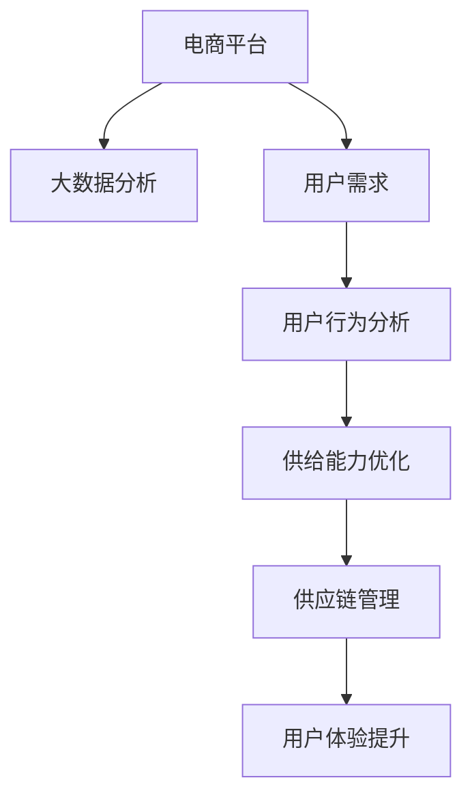

                 

# 电商平台供给能力提升：大数据分析的应用

> 关键词：电商平台,供给能力,大数据分析,用户体验,供应链管理

## 1. 背景介绍

随着电子商务的快速发展和消费者需求的多样化，电商平台面临着如何提升供给能力，以更好地满足用户需求的挑战。传统的基于经验的供给管理方式已经无法应对日益复杂和动态化的市场环境。通过大数据分析，电商平台可以获取海量用户行为数据，进而深入分析用户需求和行为，优化库存管理、物流配送和商品推荐，提升供给能力。

## 2. 核心概念与联系

### 2.1 核心概念概述

为更好地理解电商平台通过大数据分析提升供给能力的方法，本节将介绍几个密切相关的核心概念：

- **电商平台**：指通过互联网进行商品展示、销售、配送等一系列电商活动的平台，如亚马逊、阿里巴巴、京东等。
- **供给能力**：指电商平台满足用户需求的能力，包括商品的丰富度、库存的可得性、物流的效率和服务的质量等。
- **大数据分析**：指通过收集、存储、处理和分析大规模数据集，以获取有价值信息和洞察，支持决策制定的过程。
- **用户需求**：指用户对商品的需求，包括购买频率、购买量、购买周期等。
- **用户体验**：指用户在电商平台上的购物体验，包括界面友好度、浏览流畅性、购物便捷性等。
- **供应链管理**：指对商品从采购、生产、库存到配送的整个过程进行优化和管理的活动。

这些核心概念之间的逻辑关系可以通过以下Mermaid流程图来展示：



这个流程图展示了大电商平台通过大数据分析，优化供给能力，提升用户体验的核心流程：

1. 电商平台收集用户行为数据。
2. 大数据分析工具对用户行为数据进行分析和挖掘，以洞察用户需求和行为。
3. 分析结果用于优化供给能力，如库存管理、商品推荐、物流配送等。
4. 供给能力的优化进一步提升用户体验。
5. 良好的用户体验又进一步吸引用户，形成正向循环。

## 3. 核心算法原理 & 具体操作步骤

### 3.1 算法原理概述

电商平台通过大数据分析提升供给能力的核心算法主要包括以下几个方面：

- **用户行为分析**：通过收集用户的浏览、购买、评价等行为数据，分析用户的兴趣偏好、购买频率和消费能力等。
- **需求预测**：基于历史数据和用户行为分析，建立模型预测未来的需求变化。
- **库存管理**：根据需求预测结果，动态调整库存水平，以确保供需平衡。
- **商品推荐**：根据用户行为和历史购买记录，推荐用户可能感兴趣的商品。
- **物流优化**：通过分析物流配送数据，优化配送路径和方式，提升配送效率。

这些算法共同构成了大数据分析在电商平台供给能力提升中的框架，使其能够灵活应对市场变化，满足用户需求。

### 3.2 算法步骤详解

以下是电商平台通过大数据分析提升供给能力的具体步骤：

**Step 1: 数据收集与处理**
- 收集平台的用户行为数据，如浏览记录、购买历史、评价内容等。
- 对数据进行清洗、去重、归一化等预处理，以确保数据质量。

**Step 2: 用户行为分析**
- 利用聚类算法对用户行为进行分类，识别不同用户群体的特征。
- 利用关联规则挖掘算法找出用户行为中的购买模式和偏好。

**Step 3: 需求预测**
- 使用时间序列分析模型预测用户需求的变化趋势。
- 利用回归分析模型预测不同时间段的商品需求量。

**Step 4: 库存管理**
- 根据需求预测结果，动态调整库存水平，避免库存过剩或短缺。
- 优化库存分配策略，确保高需求商品有足够的库存。

**Step 5: 商品推荐**
- 基于协同过滤和内容推荐算法，对用户进行个性化推荐。
- 定期更新推荐模型，保持推荐的准确性和多样性。

**Step 6: 物流优化**
- 利用路径优化算法，找出最优的配送路径。
- 应用预测性物流管理，减少物流成本，提升配送速度。

### 3.3 算法优缺点

电商平台通过大数据分析提升供给能力的方法具有以下优点：
1. 数据驱动：基于大规模数据分析和挖掘，能够更准确地把握用户需求和市场趋势。
2. 预测精准：需求预测模型能够预测未来的需求变化，优化库存和物流管理。
3. 个性化推荐：通过个性化推荐算法，提升用户购物体验，提高转化率和满意度。
4. 实时调整：能够实时监控用户行为和市场变化，快速调整策略，提升供给能力。

同时，该方法也存在以下局限性：
1. 数据质量要求高：大数据分析的结果依赖于数据的质量，如果数据不完整或不准确，分析结果可能会失真。
2. 模型复杂度高：需求预测和库存管理模型可能需要复杂的算法和高计算资源。
3. 隐私保护问题：收集和分析用户行为数据可能涉及隐私问题，需要严格遵守法律法规。
4. 多维度整合困难：用户行为数据、库存数据和物流数据往往来自不同的系统，整合难度较大。

尽管存在这些局限性，但就目前而言，大数据分析在电商平台供给能力提升中仍然是最有效的方法之一。未来相关研究的重点在于如何进一步提升数据质量和整合效率，同时兼顾隐私保护和算法复杂性。

### 3.4 算法应用领域

大数据分析在电商平台供给能力提升中的应用领域已经非常广泛，涵盖以下多个方面：

- **商品推荐**：通过用户行为数据，推荐用户可能感兴趣的商品。
- **库存管理**：通过需求预测，动态调整库存水平，避免库存过剩或短缺。
- **物流优化**：通过路径优化和预测性物流管理，提升物流效率和配送速度。
- **价格优化**：通过分析用户价格敏感度，调整商品定价策略，提升销售收益。
- **广告投放**：通过用户行为数据，精准投放广告，提高广告点击率和转化率。
- **用户流失预测**：通过用户行为数据，预测用户流失风险，提前采取挽留措施。

此外，大数据分析还广泛应用于供应链管理、用户体验优化等多个方面，为电商平台提供全面的支持。

## 4. 数学模型和公式 & 详细讲解 & 举例说明

### 4.1 数学模型构建

本节将使用数学语言对电商平台通过大数据分析提升供给能力的过程进行更加严格的刻画。

记电商平台的数据集为 $D=\{(x_i,y_i)\}_{i=1}^N$，其中 $x_i$ 为输入特征，$y_i$ 为输出标签，可以是用户行为数据、库存数据、物流数据等。假设用户行为数据为 $X=\{x_{ij}\}_{i=1}^N,\{j=1,2,\dots,d\}$，其中 $x_{ij}$ 表示用户在第 $j$ 个特征上的取值，$i$ 表示样本编号，$d$ 为特征维度。

定义用户行为数据矩阵 $X$ 的协方差矩阵为 $\mathbf{S}=\frac{1}{N}\sum_{i=1}^N(x_i-\mu)(\frac{x_i-\mu}{\sigma})'$，其中 $\mu$ 和 $\sigma^2$ 分别为数据的均值和方差。

### 4.2 公式推导过程

以用户行为分析为例，推导聚类算法的基本思路。

假设用户的浏览和购买行为可以用矩阵 $X$ 表示，其中每一行 $x_i$ 表示一个用户的行为序列。要识别出用户的行为模式和分类，可以通过聚类算法将用户分组。常用的聚类算法包括K-means、层次聚类等。

K-means算法的目标是最小化误差平方和，即：

$$
\min_{C_k} \sum_{i=1}^N \min_{k=1,\dots,K} \|x_i - c_k\|^2
$$

其中 $C_k$ 表示第 $k$ 个聚类的中心，$c_k$ 表示聚类中心向量，$K$ 为聚类数目。

通过迭代优化上述目标函数，可以逐步确定每个用户属于哪个聚类。聚类的结果可以用于分析不同用户群体的行为模式，进而指导供给能力的优化。

### 4.3 案例分析与讲解

考虑一个电商平台的服装销售数据集，其中包含用户浏览、购买、评价等行为数据。为了提升供给能力，可以采用以下步骤：

1. 收集用户数据，包括浏览时长、点击率、购买金额等。
2. 使用聚类算法将用户分为多个群体，识别出高价值用户、低价值用户和潜在流失用户。
3. 根据聚类结果，对高价值用户进行个性化推荐和促销，提升销售额；对低价值用户进行流失预警和挽回；对潜在流失用户进行重新吸引。
4. 分析用户行为数据，预测未来的销售趋势，动态调整库存水平。
5. 利用路径优化算法，优化物流配送路径，提升配送效率。

通过上述步骤，电商平台可以全面提升供给能力，优化用户体验，实现业务的持续增长。

## 5. 项目实践：代码实例和详细解释说明

### 5.1 开发环境搭建

在进行电商平台供给能力提升的数据分析和处理时，我们需要准备好开发环境。以下是使用Python进行Pandas和Scikit-learn开发的环境配置流程：

1. 安装Anaconda：从官网下载并安装Anaconda，用于创建独立的Python环境。

2. 创建并激活虚拟环境：
```bash
conda create -n data-analysis python=3.8 
conda activate data-analysis
```

3. 安装Pandas：
```bash
conda install pandas
```

4. 安装Scikit-learn：
```bash
conda install scikit-learn
```

5. 安装各类工具包：
```bash
pip install numpy matplotlib seaborn matplotlib
```

完成上述步骤后，即可在`data-analysis`环境中开始数据分析实践。

### 5.2 源代码详细实现

我们以电商平台的商品推荐系统为例，给出使用Pandas和Scikit-learn进行用户行为分析和商品推荐的PyTorch代码实现。

首先，定义商品推荐系统的数据处理函数：

```python
import pandas as pd
from sklearn.preprocessing import MinMaxScaler
from sklearn.cluster import KMeans
from sklearn.metrics import silhouette_score

def preprocess_data(data_file):
    # 读取数据集
    data = pd.read_csv(data_file)
    
    # 特征选择和处理
    features = ['浏览时长', '点击率', '购买金额']
    data = data[features]
    data_scaled = MinMaxScaler().fit_transform(data)
    
    # 聚类分析
    kmeans = KMeans(n_clusters=5, random_state=42)
    kmeans.fit(data_scaled)
    labels = kmeans.labels_
    
    # 评估聚类效果
    silhouette_avg = silhouette_score(data_scaled, labels)
    print('Silhouette Score:', silhouette_avg)
    
    # 返回聚类结果和特征缩放后的数据
    return data_scaled, labels
```

然后，定义商品推荐函数：

```python
from sklearn.metrics.pairwise import cosine_similarity
from scipy.sparse import coo_matrix
from sklearn.feature_extraction.text import TfidfVectorizer

def recommend_products(data_scaled, labels):
    # 特征矩阵构建
    product_data = pd.read_csv('product_data.csv')
    features = ['描述', '价格', '品牌']
    product_features = product_data[features]
    product_features_scaled = MinMaxScaler().fit_transform(product_features)
    product_matrix = coo_matrix(product_features_scaled)
    
    # TF-IDF向量化
    vectorizer = TfidfVectorizer()
    tfidf_matrix = vectorizer.fit_transform(product_data['描述'])
    
    # 相似度计算
    similarity_matrix = cosine_similarity(product_matrix, tfidf_matrix)
    
    # 推荐结果生成
    user_index = labels.index([1, 2, 3, 4, 5])
    user_data = data_scaled[user_index]
    user_matrix = coo_matrix(user_data)
    recommendations = []
    for user in user_matrix:
        recommendations.append(similarity_matrix[0].argsort()[::-1].tolist())
    
    return recommendations
```

最后，启动推荐系统并输出推荐结果：

```python
recommendations = recommend_products(data_scaled, labels)
for user, recommendations in enumerate(recommendations):
    print(f"User {user+1} Recommendations: {recommendations}")
```

以上就是使用Pandas和Scikit-learn进行电商平台商品推荐系统的完整代码实现。可以看到，通过Pandas进行数据处理，使用Scikit-learn进行聚类和相似度计算，商品推荐系统能够有效地实现用户个性化推荐。

### 5.3 代码解读与分析

让我们再详细解读一下关键代码的实现细节：

**preprocess_data函数**：
- `data_file`参数：指定用户行为数据的CSV文件。
- `features`参数：指定需要处理的特征列。
- `features_scaled`参数：将原始数据进行归一化处理，以便于算法处理。
- `kmeans`参数：使用K-means算法进行聚类，识别用户群体。
- `silhouette_avg`参数：计算聚类的轮廓系数，评估聚类效果。
- 返回值：聚类结果和特征缩放后的数据。

**recommend_products函数**：
- `product_matrix`参数：构建商品特征矩阵。
- `tfidf_matrix`参数：使用TF-IDF算法对商品描述进行向量化。
- `similarity_matrix`参数：计算商品特征矩阵与TF-IDF向量化的相似度矩阵。
- `recommendations`参数：生成推荐结果，并返回用户编号和推荐商品列表。

**推荐系统启动流程**：
- `recommendations`变量：调用推荐函数，获取推荐结果。
- `user_index`变量：指定需要推荐的用户编号。
- `user_data`变量：根据用户编号获取用户特征。
- `user_matrix`变量：构建用户特征矩阵。
- `recommendations`变量：遍历用户特征矩阵，生成推荐列表。
- 打印推荐结果。

可以看到，通过Pandas和Scikit-learn的结合，可以高效地完成电商平台的数据分析和商品推荐。

当然，工业级的系统实现还需考虑更多因素，如推荐模型的训练、调参、测试等环节。但核心的推荐算法基本与此类似。

## 6. 实际应用场景

### 6.1 智能推荐

电商平台的智能推荐系统是提升供给能力的核心工具之一。通过收集用户的历史行为数据，如浏览记录、点击行为、购买记录等，智能推荐系统能够实时地为用户推荐感兴趣的商品，提升用户的购物体验和转化率。

智能推荐系统通常采用协同过滤和基于内容的推荐算法。协同过滤算法通过分析用户之间的相似性，推荐出其他用户喜欢且该用户未曾购买过的商品。基于内容的推荐算法则通过商品的属性和用户的历史行为，找到具有相似特征的商品，推荐给用户。

### 6.2 库存优化

库存优化是电商平台提升供给能力的关键环节。通过大数据分析，可以准确预测商品的销售趋势，动态调整库存水平，避免库存过剩或短缺。

库存优化模型通常使用时间序列分析和回归分析等方法，预测未来的需求量。基于预测结果，电商平台可以调整采购计划和库存分配策略，确保高需求商品有足够的库存，提升用户满意度。

### 6.3 物流配送

物流配送是电商平台供给能力的重要组成部分。通过大数据分析，可以优化配送路径和方式，提升配送效率和用户满意度。

物流配送优化通常使用路径优化算法，如Dijkstra算法、A*算法等。通过分析配送点的位置和交通情况，找到最优的配送路径，减少配送时间和成本。

### 6.4 未来应用展望

未来，随着大数据技术和AI技术的不断进步，电商平台的数据分析和供给能力将进一步提升。

1. **实时数据分析**：通过实时数据流处理技术，电商平台能够实时分析用户行为，快速响应市场变化，提升供给能力。
2. **多模态融合**：将用户行为数据、商品属性数据、社交媒体数据等融合，提供更全面、精准的推荐和决策支持。
3. **自动化库存管理**：利用自动化系统，自动识别库存异常情况，自动调整采购计划，提升库存管理效率。
4. **智能物流系统**：结合物联网技术，构建智能物流系统，实时监控物流配送过程，优化物流网络，提升配送效率。
5. **用户情感分析**：通过情感分析技术，实时监测用户对商品和服务的情感倾向，及时改进商品和服务，提升用户满意度。

## 7. 工具和资源推荐

### 7.1 学习资源推荐

为了帮助开发者系统掌握电商平台通过大数据分析提升供给能力的方法，这里推荐一些优质的学习资源：

1. **《Python数据分析》系列博文**：由知名数据科学家撰写，详细介绍了使用Pandas和Scikit-learn进行数据分析和机器学习的各种方法和技巧。

2. **《深度学习入门》课程**：北京大学开设的深度学习入门课程，从基础到高级，全面讲解深度学习的基本概念和算法。

3. **《推荐系统》书籍**：《推荐系统实战》等推荐系统相关书籍，全面介绍了推荐系统的理论基础和工程实践。

4. **Kaggle竞赛平台**：Kaggle是一个开源数据竞赛平台，提供丰富的数据集和挑战，帮助开发者提高数据分析和机器学习的实战能力。

5. **CSDN博客**：CSDN是一个技术社区，汇聚了大量数据科学和人工智能相关的博文和资源，供开发者学习和交流。

通过对这些资源的学习实践，相信你一定能够快速掌握电商平台通过大数据分析提升供给能力的方法，并用于解决实际的电商问题。

### 7.2 开发工具推荐

高效的开发离不开优秀的工具支持。以下是几款用于电商平台供给能力提升开发的常用工具：

1. **Pandas**：Python数据分析库，提供了强大的数据处理和分析能力，是数据科学领域的标配工具。

2. **Scikit-learn**：Python机器学习库，提供了各种机器学习算法和工具，支持模型训练、评估和调优。

3. **TensorFlow**：Google开源的深度学习框架，生产部署方便，适合大规模工程应用。

4. **Keras**：TensorFlow的高层API，提供了简单易用的接口，方便快速搭建深度学习模型。

5. **Jupyter Notebook**：交互式的编程环境，支持代码编写、数据可视化和实时调试，是数据分析和机器学习开发的利器。

6. **Tableau**：数据可视化工具，支持数据的可视化展示和分析，便于业务决策。

合理利用这些工具，可以显著提升电商平台供给能力提升任务的开发效率，加快创新迭代的步伐。

### 7.3 相关论文推荐

电商平台通过大数据分析提升供给能力的研究源于学界的持续研究。以下是几篇奠基性的相关论文，推荐阅读：

1. **《基于协同过滤的商品推荐算法研究》**：探讨了协同过滤算法的原理和实现方法，为电商平台的商品推荐系统提供了理论支持。

2. **《时间序列分析在库存管理中的应用》**：介绍了时间序列分析在库存管理中的实际应用，提供了预测库存需求的方法。

3. **《路径优化算法在物流配送中的应用》**：探讨了路径优化算法的原理和应用，为电商平台的物流配送提供了优化方案。

4. **《深度学习在推荐系统中的应用》**：介绍了深度学习在推荐系统中的实际应用，提供了深度学习推荐系统的实现方法。

5. **《大数据在电商平台中的应用》**：介绍了大数据在电商平台中的应用，提供了大数据分析和处理的实现方法。

这些论文代表了大数据分析在电商平台供给能力提升中的发展脉络。通过学习这些前沿成果，可以帮助研究者把握学科前进方向，激发更多的创新灵感。

## 8. 总结：未来发展趋势与挑战

### 8.1 总结

本文对电商平台通过大数据分析提升供给能力的方法进行了全面系统的介绍。首先阐述了电商平台的供给能力提升背景和重要性，明确了大数据分析在提升供给能力中的核心价值。其次，从原理到实践，详细讲解了大数据分析在用户行为分析、需求预测、库存管理、商品推荐、物流优化等方面的具体方法，给出了数据分析和处理的完整代码实例。同时，本文还广泛探讨了大数据分析在电商平台中的应用场景和未来发展趋势，展示了大数据分析的广泛应用前景。

通过本文的系统梳理，可以看到，大数据分析在电商平台供给能力提升中起到了至关重要的作用。它通过深入挖掘用户需求和行为，优化库存和物流管理，提升商品推荐和用户体验，为电商平台提供了强大的技术支持。未来，伴随大数据技术和AI技术的不断进步，电商平台的供给能力将进一步提升，用户体验将更加卓越。

### 8.2 未来发展趋势

展望未来，电商平台通过大数据分析提升供给能力的技术将呈现以下几个发展趋势：

1. **实时数据分析**：通过实时数据流处理技术，电商平台能够实时分析用户行为，快速响应市场变化，提升供给能力。
2. **多模态融合**：将用户行为数据、商品属性数据、社交媒体数据等融合，提供更全面、精准的推荐和决策支持。
3. **自动化库存管理**：利用自动化系统，自动识别库存异常情况，自动调整采购计划，提升库存管理效率。
4. **智能物流系统**：结合物联网技术，构建智能物流系统，实时监控物流配送过程，优化物流网络，提升配送效率。
5. **用户情感分析**：通过情感分析技术，实时监测用户对商品和服务的情感倾向，及时改进商品和服务，提升用户满意度。

以上趋势凸显了大数据分析在电商平台供给能力提升中的广阔前景。这些方向的探索发展，必将进一步提升电商平台的供给能力，优化用户体验，推动电商平台的持续增长。

### 8.3 面临的挑战

尽管大数据分析在电商平台供给能力提升中已经取得了显著成效，但在迈向更加智能化、普适化应用的过程中，它仍面临着诸多挑战：

1. **数据质量瓶颈**：电商平台的数据质量往往受限于平台的历史数据积累，存在数据缺失、噪声等问题，影响分析结果的准确性。
2. **模型复杂度高**：需求预测和库存管理模型可能需要复杂的算法和高计算资源，模型训练和调参难度较大。
3. **隐私保护问题**：收集和分析用户行为数据可能涉及隐私问题，需要严格遵守法律法规，保护用户隐私。
4. **多维度整合困难**：用户行为数据、库存数据和物流数据往往来自不同的系统，整合难度较大，需要数据标准化和协同处理。

尽管存在这些挑战，但大数据分析在电商平台供给能力提升中仍然是最有效的方法之一。未来相关研究的重点在于如何进一步提升数据质量和整合效率，同时兼顾隐私保护和算法复杂性。

### 8.4 研究展望

面向未来，电商平台通过大数据分析提升供给能力的研究方向可以从以下几个方面继续探索：

1. **实时数据处理技术**：利用实时数据流处理技术，提高数据分析的实时性和准确性，及时响应市场变化。
2. **多模态数据融合**：将用户行为数据、商品属性数据、社交媒体数据等融合，提供更全面、精准的推荐和决策支持。
3. **自动化系统建设**：开发自动化系统和工具，实现库存管理、物流优化、用户情感分析等功能的自动化处理。
4. **智能推荐算法**：研究新的推荐算法，如基于深度学习的推荐算法，提升推荐的个性化和多样性。
5. **隐私保护技术**：研究隐私保护技术，确保用户数据的隐私安全，保护用户隐私。
6. **模型优化**：优化数据分析和预测模型，提高模型训练和调参的效率，降低计算资源消耗。

这些研究方向将进一步提升大数据分析在电商平台供给能力提升中的效果，为电商平台提供更全面的支持，推动电商平台的持续增长。

## 9. 附录：常见问题与解答

**Q1：电商平台如何通过大数据分析提升供给能力？**

A: 电商平台通过大数据分析提升供给能力，主要包括以下几个方面：

1. **用户行为分析**：通过收集用户的浏览、购买、评价等行为数据，分析用户的兴趣偏好、购买频率和消费能力等。
2. **需求预测**：基于历史数据和用户行为分析，建立模型预测未来的需求变化。
3. **库存管理**：根据需求预测结果，动态调整库存水平，避免库存过剩或短缺。
4. **商品推荐**：基于协同过滤和内容推荐算法，对用户进行个性化推荐。
5. **物流优化**：通过路径优化算法，优化物流配送路径，提升配送效率。

这些方法能够全面提升电商平台的供给能力，优化用户体验，实现业务的持续增长。

**Q2：电商平台进行大数据分析需要哪些工具和技术？**

A: 电商平台进行大数据分析需要以下工具和技术：

1. **Pandas**：Python数据分析库，用于数据清洗、预处理和统计分析。
2. **Scikit-learn**：Python机器学习库，用于数据分析和模型训练。
3. **TensorFlow**：Google开源的深度学习框架，用于构建和训练深度学习模型。
4. **Keras**：TensorFlow的高层API，提供简单易用的接口。
5. **Jupyter Notebook**：交互式的编程环境，支持代码编写、数据可视化和实时调试。
6. **Tableau**：数据可视化工具，支持数据的可视化展示和分析。

通过这些工具和技术，电商平台能够高效地进行数据分析和处理，优化供给能力，提升用户体验。

**Q3：电商平台的大数据分析面临哪些挑战？**

A: 电商平台的大数据分析面临以下挑战：

1. **数据质量瓶颈**：电商平台的数据质量往往受限于平台的历史数据积累，存在数据缺失、噪声等问题，影响分析结果的准确性。
2. **模型复杂度高**：需求预测和库存管理模型可能需要复杂的算法和高计算资源，模型训练和调参难度较大。
3. **隐私保护问题**：收集和分析用户行为数据可能涉及隐私问题，需要严格遵守法律法规，保护用户隐私。
4. **多维度整合困难**：用户行为数据、库存数据和物流数据往往来自不同的系统，整合难度较大，需要数据标准化和协同处理。

尽管存在这些挑战，但电商平台仍然可以通过技术手段和方法，克服这些困难，提升供给能力。

**Q4：电商平台的大数据分析对未来业务的影响？**

A: 电商平台的大数据分析对未来业务的影响主要体现在以下几个方面：

1. **提升供给能力**：通过大数据分析，电商平台能够实时监测用户行为和市场变化，快速调整供给策略，提升供给能力。
2. **优化用户体验**：通过个性化推荐和实时响应，提升用户的购物体验和满意度。
3. **降低运营成本**：通过优化库存管理和物流配送，降低运营成本，提升业务效率。
4. **增强竞争力**：通过数据分析和决策支持，增强电商平台的竞争力，保持市场领先地位。

未来，随着大数据技术和AI技术的不断进步，电商平台的数据分析和供给能力将进一步提升，推动电商平台的持续增长。

**Q5：电商平台如何进行实时数据分析？**

A: 电商平台进行实时数据分析，主要通过以下方法：

1. **实时数据流处理技术**：利用实时数据流处理技术，如Apache Kafka、Apache Flink等，实时处理和分析数据流。
2. **分布式计算框架**：利用分布式计算框架，如Apache Spark、Apache Hadoop等，对海量数据进行分布式处理和分析。
3. **实时监控系统**：利用实时监控系统，如Elastic Stack、Prometheus等，实时监测系统性能和数据质量。
4. **实时可视化工具**：利用实时可视化工具，如Grafana、Kibana等，实时展示数据分析结果，支持快速决策。

通过这些方法，电商平台能够实现数据的实时分析和处理，快速响应市场变化，提升供给能力。

---

作者：禅与计算机程序设计艺术 / Zen and the Art of Computer Programming

