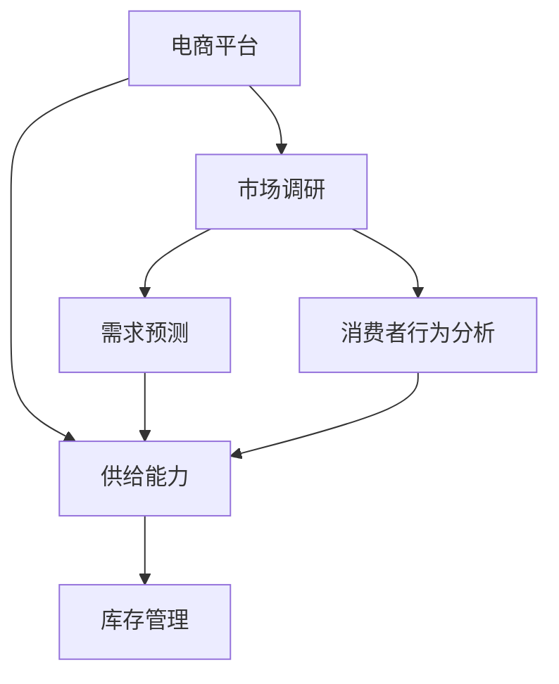

                 

## 1. 背景介绍

在现代电商平台上，供给能力的优化成为了企业保持竞争力的关键因素之一。电商平台面临着多变的市场环境、波动的消费需求以及不断变化的消费者行为。如何精准地了解市场趋势、消费者偏好以及库存管理，从而提升供给能力，成为了电商平台亟需解决的问题。

### 1.1 问题由来

电商平台的供给能力涉及多个方面，包括但不限于商品种类、库存管理、物流配送等。传统的供给能力优化方法往往基于历史数据和简单的统计分析，缺乏对市场动态和消费者行为的深度理解。随着大数据和人工智能技术的发展，通过市场调研和消费者行为分析来提升电商平台供给能力成为了一种更科学、高效的方法。

### 1.2 问题核心关键点

在电商平台供给能力提升的过程中，市场调研和消费者行为分析的关键点包括：
- **数据获取**：从多个渠道获取全面的市场数据，包括历史销售数据、市场趋势、竞争对手动态等。
- **数据分析**：运用统计分析、机器学习等方法，从数据中挖掘出有价值的信息，如消费者偏好、需求预测、库存优化策略等。
- **策略制定**：根据数据分析结果，制定科学的供给策略，如商品上架策略、库存管理、物流优化等。
- **实施与评估**：将策略实施到电商平台上，并实时监控效果，根据反馈进行策略调整。

### 1.3 问题研究意义

通过市场调研和消费者行为分析，电商平台可以更准确地预测市场需求，优化库存管理，提升供给能力，从而在激烈的市场竞争中占据有利地位。其研究意义主要体现在：

1. **提升销售额**：通过精准的商品推荐和库存管理，增加销售机会，提高销售额。
2. **降低库存成本**：优化库存水平，减少库存积压，降低仓储和物流成本。
3. **提高客户满意度**：满足消费者需求，提升用户体验，增强客户粘性。
4. **增强市场竞争力**：及时响应市场变化，快速调整供给策略，保持竞争优势。

## 2. 核心概念与联系

### 2.1 核心概念概述

为了更好地理解市场调研和消费者行为分析，本节将介绍几个关键概念及其相互关系：

- **电商平台**：在线销售平台，提供商品展示、购买、支付、物流等服务。
- **供给能力**：平台提供商品的能力，包括商品种类、库存量、物流速度等。
- **市场调研**：通过收集和分析市场数据，了解市场动态和消费者需求。
- **消费者行为分析**：研究消费者购买行为、偏好、需求变化等，以指导电商平台供给策略。
- **库存管理**：通过科学的库存策略，合理控制库存水平，减少资金占用。
- **需求预测**：基于历史销售数据和市场趋势，预测未来需求，指导商品采购和库存管理。

这些概念之间的逻辑关系可以通过以下Mermaid流程图来展示：



这个流程图展示了几者的关系：

1. 电商平台通过市场调研和消费者行为分析，获取市场动态和消费者需求信息。
2. 需求预测基于市场调研和消费者行为分析的数据，预测未来的需求。
3. 供给能力受需求预测和库存管理策略的共同影响，最终影响平台的服务质量。

## 3. 核心算法原理 & 具体操作步骤
### 3.1 算法原理概述

电商平台供给能力的提升，可以通过市场调研和消费者行为分析来实现。其核心思想是：通过数据分析和模型建立，识别市场需求、消费者偏好和库存管理的规律，进而制定和优化供给策略。

具体而言，基于市场调研和消费者行为分析的供给能力提升，可以分解为以下几个关键步骤：

1. **数据收集**：从电商平台、第三方数据源等渠道获取全面的市场数据。
2. **数据预处理**：清洗和整理数据，处理缺失值、异常值等。
3. **数据分析**：运用统计分析和机器学习模型，挖掘数据中的模式和趋势。
4. **策略制定**：根据数据分析结果，制定科学的供给策略。
5. **实施与评估**：在电商平台实施策略，并根据反馈进行迭代优化。

### 3.2 算法步骤详解

下面将详细介绍每个步骤的具体操作。

#### 3.2.1 数据收集

数据收集是市场调研和消费者行为分析的基础。电商平台需要从多个渠道获取全面的市场数据，包括但不限于：

- **内部数据**：电商平台的销售数据、用户行为数据、库存数据等。
- **外部数据**：行业报告、竞争对手动态、社交媒体数据等。

具体实现时，可以使用数据抓取工具和API接口，从不同渠道获取数据。数据格式可能包括JSON、CSV等，需要进行统一处理。

#### 3.2.2 数据预处理

数据预处理是将原始数据转换为可用于分析的格式，主要包括数据清洗、数据归一化等操作。

1. **数据清洗**：处理缺失值、异常值、重复值等。可以使用Python的Pandas库进行数据清洗。
2. **数据归一化**：将不同来源的数据进行标准化处理，如将销售量归一化为标准单位。可以使用Min-Max归一化或Z-Score归一化方法。

#### 3.2.3 数据分析

数据分析是市场调研和消费者行为分析的核心环节，可以通过以下方法进行：

1. **描述性统计分析**：计算平均值、中位数、标准差等统计量，了解数据的分布情况。
2. **相关性分析**：使用皮尔逊相关系数、斯皮尔曼相关系数等方法，分析变量之间的关系。
3. **时间序列分析**：使用ARIMA模型、指数平滑等方法，分析时间序列数据的趋势和季节性。
4. **预测模型**：使用回归模型、时间序列模型、机器学习模型等，进行需求预测和库存管理。

#### 3.2.4 策略制定

根据数据分析结果，制定科学的供给策略，如：

1. **商品上架策略**：根据需求预测和市场趋势，选择合适的商品进行上架。
2. **库存管理策略**：根据需求预测和实际销售情况，调整库存水平，避免积压或断货。
3. **物流优化策略**：根据用户分布和订单量，优化物流路径和配送时间。

#### 3.2.5 实施与评估

将策略实施到电商平台上，并实时监控效果，根据反馈进行策略调整。具体实施步骤包括：

1. **策略部署**：在电商平台上部署新的供给策略，如自动补货系统、智能推荐系统等。
2. **效果监控**：实时监控平台的各项指标，如销售额、库存水平、用户满意度等。
3. **策略优化**：根据监控结果，及时调整策略，进行迭代优化。

### 3.3 算法优缺点

市场调研和消费者行为分析的供给能力提升方法，具有以下优点：

1. **数据驱动**：基于数据驱动的决策，更科学、客观。
2. **实时性**：通过实时数据分析和策略调整，能够迅速响应市场变化。
3. **灵活性**：可以根据市场动态和消费者需求，灵活调整策略。

同时，该方法也存在一定的局限性：

1. **数据质量**：数据质量直接影响到分析结果，需要高质量的数据源和清洗方法。
2. **计算复杂度**：数据分析和模型训练需要较大的计算资源和时间。
3. **模型假设**：部分模型方法对数据分布和假设条件有要求，可能不适用于所有情况。
4. **策略执行**：策略实施过程中需要电商平台的支持，可能面临执行难度。

### 3.4 算法应用领域

市场调研和消费者行为分析的供给能力提升方法，在电商平台上具有广泛的应用，包括但不限于：

1. **需求预测**：通过时间序列分析和机器学习模型，预测未来需求，指导商品采购和库存管理。
2. **商品推荐**：通过分析消费者行为和偏好，提供个性化的商品推荐，提高用户购买率。
3. **库存优化**：基于需求预测和历史销售数据，调整库存水平，降低库存成本。
4. **物流管理**：分析用户分布和订单量，优化物流路径和配送时间，提高配送效率。
5. **价格优化**：根据市场需求和竞争对手动态，调整商品价格，提高销售效果。

## 4. 数学模型和公式 & 详细讲解  
### 4.1 数学模型构建

在本节中，我们将使用数学语言对市场调研和消费者行为分析的具体过程进行详细阐述。

假设电商平台的历史销售数据为 $Y = \{y_t\}_{t=1}^T$，其中 $y_t$ 为第 $t$ 天的销售量。市场需求 $D$ 可以表示为 $D = f(X)$，其中 $X$ 为影响需求的变量，如季节性、促销活动、节假日等。电商平台的目标是最大化总销售量 $Y$，同时控制库存水平 $I$。

数学模型构建如下：

1. **需求函数**：
   $$
   D = f(X) = \alpha_1 + \alpha_2 X_1 + \alpha_3 X_2 + \ldots + \alpha_n X_n + \epsilon
   $$

2. **库存优化模型**：
   $$
   \min_{i_t} \left\{ \sum_{t=1}^T \mathcal{L}(y_t, i_t) \right\}
   $$
   其中，$i_t$ 为第 $t$ 天的库存水平，$\mathcal{L}$ 为损失函数，如均方误差损失。

3. **策略调整模型**：
   $$
   \min_{\theta} \mathcal{L}(D, Y)
   $$
   其中，$\theta$ 为策略调整参数，如商品上架时间、促销活动等。

### 4.2 公式推导过程

接下来，我们将对上述模型进行推导和解释。

1. **需求函数推导**：
   假设需求 $D$ 可以通过线性模型表示，且 $X_i$ 为独立的随机变量，则：
   $$
   D = \alpha_1 + \alpha_2 X_1 + \alpha_3 X_2 + \ldots + \alpha_n X_n + \epsilon
   $$
   其中，$\epsilon$ 为随机误差项。

2. **库存优化模型推导**：
   假设平台每天的销售量和库存水平满足线性关系，即：
   $$
   y_t = \beta_1 D + \beta_2 i_t + \beta_3 + \epsilon
   $$
   其中，$i_t$ 为库存水平，$\beta_1$、$\beta_2$、$\beta_3$ 为回归系数。
   根据最小二乘法，可以解得最优库存水平 $i_t$。

3. **策略调整模型推导**：
   假设策略调整参数 $\theta$ 对需求 $D$ 有影响，则：
   $$
   D = f(X, \theta) = \alpha_1 + \alpha_2 X_1 + \alpha_3 X_2 + \ldots + \alpha_n X_n + \theta_1 + \theta_2 + \ldots + \theta_k + \epsilon
   $$
   其中，$\theta_i$ 为策略调整参数，$\epsilon$ 为随机误差项。
   通过最小化损失函数 $\mathcal{L}$，可以求得最优策略调整参数 $\theta$。

### 4.3 案例分析与讲解

为了更好地理解这些模型，我们将以一家电商平台的季节性促销活动为例，进行分析。

1. **数据收集**：
   假设电商平台有3个月的历史销售数据，包括日期、销售额、促销活动等。通过数据清洗和归一化处理，得到标准化的数据集。

2. **数据分析**：
   使用ARIMA模型对历史销售数据进行时间序列分析，得到需求预测模型：
   $$
   D_t = \alpha + \beta t + \gamma \sin(\delta t) + \epsilon
   $$
   其中，$\alpha$、$\beta$、$\gamma$、$\delta$ 为模型参数。

3. **策略制定**：
   根据需求预测模型，制定促销活动策略，选择最佳促销时间和促销方式，以提高销售额和减少库存积压。

4. **实施与评估**：
   将策略实施到电商平台上，实时监控销售额和库存水平，根据反馈进行策略调整。

## 5. 项目实践：代码实例和详细解释说明
### 5.1 开发环境搭建

在进行市场调研和消费者行为分析的供给能力提升实践前，我们需要准备好开发环境。以下是使用Python进行开发的环境配置流程：

1. 安装Anaconda：从官网下载并安装Anaconda，用于创建独立的Python环境。

2. 创建并激活虚拟环境：
```bash
conda create -n market_analysis_env python=3.8 
conda activate market_analysis_env
```

3. 安装必要的Python库：
```bash
pip install pandas numpy matplotlib scikit-learn statsmodels
```

4. 安装Python开发环境：
```bash
pip install jupyter notebook ipython
```

完成上述步骤后，即可在`market_analysis_env`环境中开始项目实践。

### 5.2 源代码详细实现

下面我们以电商平台需求预测为例，给出使用Python和Pandas进行市场调研和消费者行为分析的代码实现。

首先，导入必要的库：

```python
import pandas as pd
import numpy as np
import matplotlib.pyplot as plt
from statsmodels.tsa.arima.model import ARIMA
from sklearn.linear_model import LinearRegression
from sklearn.metrics import mean_squared_error
```

然后，定义数据处理函数：

```python
def load_data(file_path):
    df = pd.read_csv(file_path, parse_dates=['date'], index_col='date')
    return df

def preprocess_data(df):
    # 处理缺失值和异常值
    df.dropna(inplace=True)
    df = df[(df['sales'] > 0) & (df['promotion'] != 0)]
    return df
```

接着，进行数据加载和预处理：

```python
file_path = 'sales_data.csv'
df = load_data(file_path)
df = preprocess_data(df)
```

然后，进行需求预测：

```python
# 划分训练集和测试集
train_df = df.iloc[:400]
test_df = df.iloc[400:]

# 时间序列分析
model = ARIMA(train_df['sales'], order=(1, 1, 0))
model_fit = model.fit()

# 预测需求
train_predictions = model_fit.predict(start=0, end=400-1)
test_predictions = model_fit.predict(start=400, end=600-1)

# 计算误差
train_rmse = np.sqrt(mean_squared_error(train_df['sales'], train_predictions))
test_rmse = np.sqrt(mean_squared_error(test_df['sales'], test_predictions))
print(f'Train RMSE: {train_rmse:.2f}')
print(f'Test RMSE: {test_rmse:.2f}')
```

最后，评估预测结果：

```python
# 可视化预测结果
plt.figure(figsize=(10, 5))
plt.plot(train_df['sales'], label='True Sales')
plt.plot(train_predictions, label='Predicted Sales')
plt.plot(test_df['sales'], label='True Sales')
plt.plot(test_predictions, label='Predicted Sales')
plt.legend()
plt.show()
```

以上代码展示了使用ARIMA模型进行需求预测的基本流程。通过加载和预处理数据、拟合ARIMA模型、预测需求并评估误差，可以得出较为准确的需求预测结果。

### 5.3 代码解读与分析

让我们再详细解读一下关键代码的实现细节：

**load_data函数**：
- 从指定路径加载数据，解析日期并设置日期为索引。

**preprocess_data函数**：
- 处理缺失值和异常值，删除无效数据，确保数据质量和完整性。

**时间序列分析**：
- 使用ARIMA模型进行时间序列分析，通过训练集数据拟合模型。
- 使用训练好的模型进行需求预测，分别计算训练集和测试集的预测误差。

**可视化预测结果**：
- 使用Matplotlib库绘制真实销售和预测销售的对比图，直观展示预测效果。

通过以上代码实现，我们可以看到市场调研和消费者行为分析在电商平台的实际应用。该方法基于数据驱动，能够快速响应市场需求，优化供给策略，提高平台整体运营效率。

## 6. 实际应用场景
### 6.1 智能推荐系统

电商平台可以利用市场调研和消费者行为分析，构建智能推荐系统，提升用户购物体验。通过分析用户历史行为、偏好和反馈，电商平台可以提供个性化的商品推荐，增加用户粘性。

具体实现时，可以采用协同过滤、内容推荐等算法，结合市场调研和消费者行为分析的结果，生成个性化的推荐列表。实时监控推荐效果，并根据反馈进行优化调整。

### 6.2 库存管理优化

库存管理是电商平台运营中重要的环节，需要精确掌握库存水平，避免积压和断货。市场调研和消费者行为分析可以用于优化库存管理策略。

例如，通过分析用户购买行为和季节性需求，预测未来的销售趋势，调整库存水平。同时，根据库存水平和需求预测结果，制定自动补货策略，减少人工干预。

### 6.3 促销活动策略

电商平台定期进行促销活动，可以吸引用户增加消费，但需要确保活动效果最大化。市场调研和消费者行为分析可以用于制定科学的促销活动策略。

例如，分析用户对不同促销方式的反应，选择最佳的促销时机和方式。同时，根据市场调研结果，预测促销活动的销售效果，进行实时监控和调整。

### 6.4 未来应用展望

随着数据和计算能力的提升，市场调研和消费者行为分析在电商平台中的应用将更加广泛和深入。未来可能的应用场景包括：

1. **跨平台数据融合**：整合不同平台的数据，进行全渠道的市场调研和消费者行为分析。
2. **实时数据处理**：使用流处理技术，实时处理和分析大量数据，快速响应市场变化。
3. **个性化推荐引擎**：结合市场调研和消费者行为分析结果，构建更加智能的推荐引擎，提升用户体验。
4. **精准营销**：基于市场调研和消费者行为分析，制定更加精准的营销策略，提高广告效果。
5. **供应链优化**：整合供应链数据，进行实时分析，优化库存和物流管理，降低运营成本。

通过不断优化和创新，市场调研和消费者行为分析将为电商平台提供更强的市场洞察力和决策支持，推动电商行业的可持续发展。

## 7. 工具和资源推荐
### 7.1 学习资源推荐

为了帮助开发者系统掌握市场调研和消费者行为分析的理论基础和实践技巧，这里推荐一些优质的学习资源：

1. 《Python数据分析》：通过实战案例，介绍数据分析的基本方法和工具。
2. 《时间序列分析与Python应用》：详细讲解时间序列分析的原理和应用场景。
3. 《消费者行为学》：介绍消费者行为的基础理论和模型，适用于市场调研和消费者行为分析。
4. 《电商数据分析实战》：结合电商行业的实际案例，介绍市场调研和消费者行为分析的方法。

通过学习这些资源，相信你一定能够快速掌握市场调研和消费者行为分析的精髓，并用于解决实际的电商问题。

### 7.2 开发工具推荐

高效的开发离不开优秀的工具支持。以下是几款用于市场调研和消费者行为分析开发的常用工具：

1. Jupyter Notebook：开源的交互式笔记本，支持Python、R等多种语言，方便数据分析和模型验证。
2. Python：开源的编程语言，功能强大，生态丰富，广泛应用于数据科学领域。
3. Pandas：Python数据分析库，支持数据清洗、处理和分析，是市场调研和消费者行为分析的必备工具。
4. NumPy：Python数值计算库，支持高效的数组操作和矩阵运算，适用于数据处理和模型计算。
5. Matplotlib：Python数据可视化库，支持绘制多种类型的图表，用于结果展示和分析。

合理利用这些工具，可以显著提升市场调研和消费者行为分析的开发效率，加快创新迭代的步伐。

### 7.3 相关论文推荐

市场调研和消费者行为分析的研究源于学界的持续研究。以下是几篇奠基性的相关论文，推荐阅读：

1. 《消费者行为预测模型研究综述》：总结了消费者行为预测的多种方法，适用于市场调研和消费者行为分析。
2. 《电商平台的库存管理优化》：介绍了电商平台的库存管理优化方法，适用于库存管理优化。
3. 《基于时间序列分析的需求预测》：详细讲解了时间序列分析的方法和应用，适用于需求预测。

这些论文代表了大数据和人工智能技术在市场调研和消费者行为分析中的应用。通过学习这些前沿成果，可以帮助研究者把握学科前进方向，激发更多的创新灵感。

## 8. 总结：未来发展趋势与挑战
### 8.1 总结

本文对电商平台市场调研和消费者行为分析的供给能力提升方法进行了全面系统的介绍。首先阐述了供给能力提升的问题由来和核心关键点，明确了市场调研和消费者行为分析在优化供给策略中的重要性。其次，从原理到实践，详细讲解了市场调研和消费者行为分析的数学模型和具体操作步骤，给出了代码实例和详细解释说明。同时，本文还广泛探讨了市场调研和消费者行为分析在智能推荐、库存管理、促销活动等实际应用场景中的应用前景，展示了方法论的广泛适用性。

通过本文的系统梳理，可以看到，市场调研和消费者行为分析在电商平台供给能力提升中具有重要意义。基于数据驱动的决策，能够更科学、高效地优化供给策略，提升电商平台的运营效率和用户满意度。未来，伴随数据和计算能力的进一步提升，市场调研和消费者行为分析将得到更广泛的应用，为电商平台的发展提供更强大的技术支撑。

### 8.2 未来发展趋势

展望未来，市场调研和消费者行为分析在电商平台中的应用将呈现以下几个发展趋势：

1. **全渠道数据融合**：整合线上线下数据，进行全渠道的市场调研和消费者行为分析，提供更全面的市场洞察力。
2. **实时数据分析**：使用流处理技术，实时处理和分析大量数据，快速响应市场变化，实现即时决策。
3. **智能化推荐系统**：结合市场调研和消费者行为分析结果，构建更加智能的推荐引擎，提升用户体验和购买转化率。
4. **个性化营销**：基于用户行为和偏好，制定个性化的营销策略，提高广告效果和用户粘性。
5. **供应链优化**：整合供应链数据，进行实时分析，优化库存和物流管理，降低运营成本。

这些趋势凸显了市场调研和消费者行为分析的广泛应用前景，为电商平台提供更强大、更灵活的决策支持。

### 8.3 面临的挑战

尽管市场调研和消费者行为分析在电商平台中具有显著优势，但在实际应用中也面临以下挑战：

1. **数据质量问题**：市场调研和消费者行为分析依赖高质量的数据，数据获取和处理中的质量问题会影响结果的准确性。
2. **模型复杂度**：使用复杂模型进行需求预测和库存优化时，需要较高的计算资源和时间。
3. **策略执行难度**：市场调研和消费者行为分析的结果需要电商平台的支持才能实施，可能面临执行难度。
4. **隐私和数据安全**：市场调研和消费者行为分析需要收集和处理大量用户数据，涉及隐私和数据安全问题，需要严格遵守法律法规。
5. **模型鲁棒性**：在多变的市场环境中，市场调研和消费者行为分析模型需要具备较高的鲁棒性，以应对数据分布变化和异常情况。

### 8.4 研究展望

面对市场调研和消费者行为分析在电商平台应用中的挑战，未来的研究需要在以下几个方面寻求新的突破：

1. **数据治理**：建立数据治理体系，提高数据质量，确保数据可靠性和完整性。
2. **模型轻量化**：开发轻量化模型，提高计算效率，降低资源消耗。
3. **策略执行机制**：优化策略执行机制，提高实施效果和用户满意度。
4. **隐私保护**：引入隐私保护技术，确保用户数据安全和隐私。
5. **鲁棒性提升**：研究和应用鲁棒性模型，提高市场调研和消费者行为分析的稳定性和可靠性。

这些研究方向的探索，将推动市场调研和消费者行为分析技术在电商平台的更广泛应用，为电商行业的可持续发展提供更强有力的技术支撑。

## 9. 附录：常见问题与解答

**Q1：市场调研和消费者行为分析需要哪些数据？**

A: 市场调研和消费者行为分析需要收集多方面的数据，包括但不限于：
- 内部数据：电商平台的销售数据、用户行为数据、库存数据等。
- 外部数据：行业报告、竞争对手动态、社交媒体数据等。

**Q2：如何选择合适的市场调研方法？**

A: 选择合适的市场调研方法需要考虑数据来源、调研目的、预算和时间等因素。常用的方法包括问卷调查、焦点小组讨论、深度访谈等。可以根据具体情况选择合适的方法。

**Q3：如何处理市场调研中的数据质量问题？**

A: 数据质量问题需要通过数据清洗、异常值处理、数据验证等手段进行处理。可以使用Python的Pandas库进行数据预处理，确保数据可靠性和完整性。

**Q4：如何进行有效的市场调研和消费者行为分析？**

A: 进行有效的市场调研和消费者行为分析需要科学的方法和工具支持。可以使用时间序列分析、回归模型、机器学习模型等方法，结合数据可视化工具，进行深入分析和结果展示。

**Q5：如何评估市场调研和消费者行为分析的效果？**

A: 评估市场调研和消费者行为分析的效果可以从多个维度进行，如准确性、鲁棒性、可解释性等。可以通过误差计算、模型评估指标、用户反馈等方法进行评估。

---

作者：禅与计算机程序设计艺术 / Zen and the Art of Computer Programming

