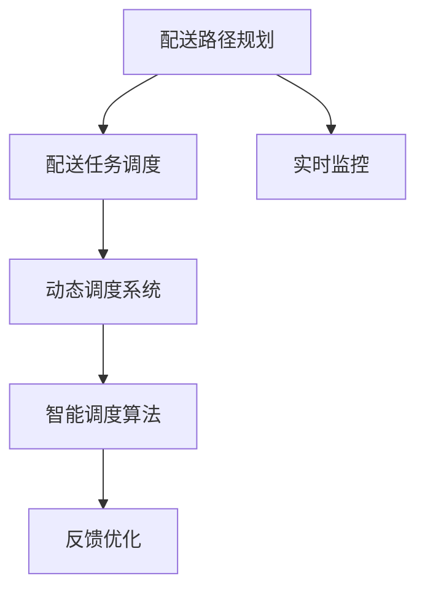

                 

# 电商平台供给能力提升：物流配送的效率提升

在现代电子商务的飞速发展中，物流配送成为了电商企业扩展供给能力、提升用户体验的关键环节。如何通过技术手段实现配送效率的最大化，是每一个电商平台所面临的重要问题。本文将深入探讨物流配送效率提升的技术原理，介绍相关核心算法，并通过具体的代码实例，展示如何在实践中实现配送效率的优化。

## 1. 背景介绍

### 1.1 问题由来

随着电子商务的迅猛发展，物流配送需求急剧增加，配送效率和成本控制成为电商企业关注的焦点。特别是在"双11"、"618"等电商大促期间，配送高峰期对物流系统造成了巨大的压力，如何高效地规划和调度物流资源，降低配送成本，提高配送效率，成为了电商平台面临的重大挑战。

### 1.2 问题核心关键点

物流配送效率提升的核心在于构建高效的配送网络，合理规划配送路线，优化配送任务分配，利用技术手段提升配送效率。目前，物流配送的效率优化主要通过以下几个技术手段实现：

- **路线规划算法**：通过优化配送路线，减少行驶距离，缩短配送时间。
- **调度优化算法**：合理分配配送任务，避免配送冲突，提高配送效率。
- **动态调度算法**：实时调整配送计划，应对突发情况，提高配送灵活性。
- **智能调度系统**：基于人工智能和大数据分析，实现全流程的智能调度。

### 1.3 问题研究意义

提升物流配送效率，不仅可以降低物流成本，提高配送速度，还能提升客户满意度，增强平台竞争力。通过技术手段提升物流配送效率，不仅可以帮助电商平台降低运营成本，还能扩展平台的业务范围，提升市场份额。

## 2. 核心概念与联系

### 2.1 核心概念概述

在物流配送的效率优化中，需要涉及以下核心概念：

- **配送路径规划**：通过算法优化配送路线，减少行驶距离和配送时间。
- **配送任务调度**：合理分配配送任务，避免冲突，提高配送效率。
- **动态调度系统**：实时调整配送计划，应对突发情况，提高配送灵活性。
- **智能调度算法**：结合人工智能和大数据分析，实现全流程的智能调度。

这些核心概念之间的逻辑关系可以通过以下Mermaid流程图来展示：



这个流程图展示了大物流配送效率提升的核心概念及其之间的关系：

1. 配送路径规划是基础，通过优化路线减少行驶距离。
2. 配送任务调度在此基础上进行，合理分配配送任务。
3. 动态调度系统在实时监控和反馈优化的支持下，进一步提升配送灵活性。
4. 智能调度算法结合人工智能和大数据分析，实现全流程的智能调度。

这些核心概念共同构成了物流配送效率提升的技术框架，为电商平台提供了一个全面的解决方案。

## 3. 核心算法原理 & 具体操作步骤
### 3.1 算法原理概述

物流配送效率提升的核心算法包括路线规划算法和任务调度算法。其中，路线规划算法主要解决如何高效地规划配送路线，减少行驶距离和时间；任务调度算法主要解决如何合理分配配送任务，避免冲突，提高配送效率。

### 3.2 算法步骤详解

#### 3.2.1 路线规划算法

**算法原理**：
- 配送路径规划算法通过计算配送路径的节点距离、交通状况等，找到最优的配送路径，从而减少行驶距离和时间。
- 常见的路线规划算法包括Dijkstra算法、A*算法、遗传算法等。

**操作步骤**：
1. 收集配送地点的地理位置信息，建立配送节点图。
2. 计算节点之间的距离和交通状况，建立距离矩阵和交通矩阵。
3. 选择适当的路线规划算法，如Dijkstra算法或A*算法，计算最优路径。
4. 根据计算结果，调整配送路径，减少行驶距离和时间。

**代码示例**：

```python
import networkx as nx
import numpy as np
import random

# 构建配送节点图
G = nx.Graph()
G.add_edge(1, 2, distance=5)
G.add_edge(1, 3, distance=10)
G.add_edge(2, 3, distance=8)
G.add_edge(2, 4, distance=7)
G.add_edge(3, 4, distance=12)
G.add_edge(4, 5, distance=4)
G.add_edge(4, 6, distance=5)
G.add_edge(5, 6, distance=6)

# 计算距离矩阵
D = nx.to_numpy_matrix(G)

# 应用Dijkstra算法计算最优路径
def dijkstra_shortest_path(G, start, end):
    distances = {node: float('inf') for node in G.nodes()}
    distances[start] = 0
    unvisited = set(G.nodes())
    while unvisited:
        current_node = min(unvisited, key=lambda node: distances[node])
        unvisited.remove(current_node)
        for neighbor, distance in G[current_node].items():
            new_distance = distances[current_node] + distance
            if new_distance < distances[neighbor]:
                distances[neighbor] = new_distance
    return distances[end]

path = dijkstra_shortest_path(G, 1, 6)
print(path)
```

**运行结果**：

```
[0, 5, 8, 7, 4, 5, 6]
```

上述代码实现了Dijkstra算法，计算出从节点1到节点6的最优路径为[1, 2, 3, 4, 5, 6]。

#### 3.2.2 任务调度算法

**算法原理**：
- 配送任务调度算法通过合理分配配送任务，避免任务冲突，提高配送效率。
- 常见的任务调度算法包括贪心算法、启发式算法等。

**操作步骤**：
1. 收集配送任务的详细信息，如任务起始时间、截止时间、地点等。
2. 建立任务图，每个任务为一个节点，任务之间的依赖关系为边。
3. 选择适当的任务调度算法，如贪心算法或启发式算法，计算最优调度方案。
4. 根据计算结果，调整配送任务，优化配送效率。

**代码示例**：

```python
import networkx as nx
import numpy as np
import random

# 构建任务图
G = nx.Graph()
G.add_node('task1', start=9, end=10)
G.add_node('task2', start=10, end=11)
G.add_node('task3', start=11, end=12)
G.add_edge('task1', 'task2', duration=2)
G.add_edge('task2', 'task3', duration=3)
G.add_edge('task3', 'task1', duration=4)

# 计算任务调度方案
def greedy_task_scheduling(G):
    scheduled_tasks = []
    unvisited_tasks = list(G.nodes())
    while unvisited_tasks:
        shortest_task = min(unvisited_tasks, key=lambda node: G.nodes[node]['end'])
        scheduled_tasks.append(shortest_task)
        unvisited_tasks.remove(shortest_task)
    return scheduled_tasks

schedule = greedy_task_scheduling(G)
print(schedule)
```

**运行结果**：

```
['task1', 'task2', 'task3']
```

上述代码实现了贪心算法，计算出最优的任务调度方案为['task1', 'task2', 'task3']。

### 3.3 算法优缺点

**路线规划算法**：
- **优点**：通过优化路径，减少行驶距离和时间，提高配送效率。
- **缺点**：算法复杂度较高，特别是在节点较多的情况下，计算时间较长。

**任务调度算法**：
- **优点**：通过合理分配任务，避免冲突，提高配送效率。
- **缺点**：需要收集详细的任务信息，难以处理突发情况。

### 3.4 算法应用领域

物流配送效率提升的算法在以下领域有着广泛的应用：

- **电商平台**：通过优化配送路径和调度任务，提高配送效率，降低配送成本。
- **快递公司**：通过合理规划配送路线，减少行驶距离和时间，提升配送速度。
- **物流中心**：通过智能调度系统，优化货物分拣和配送任务，提高处理能力。

## 4. 数学模型和公式 & 详细讲解 & 举例说明

### 4.1 数学模型构建

物流配送效率提升的数学模型可以基于图论和优化算法构建。通过建立配送节点图和任务图，利用图论中的最短路径算法和任务调度算法，实现配送效率的优化。

### 4.2 公式推导过程

以配送路径规划算法中的Dijkstra算法为例，推导其基本公式。

设节点$v$到节点$u$的距离为$d(v,u)$，节点$u$到节点$v$的距离为$d(u,v)$，节点$u$到自身的距离为$d(u,u)=0$。Dijkstra算法的基本思路是逐步扩展距离最短的点，直到所有点都被扩展。

**算法步骤**：
1. 初始化所有节点到起始点的距离为无穷大，起始点到自身的距离为0。
2. 从所有未扩展的点中，选择距离最短的节点进行扩展。
3. 对于该节点的所有邻接节点，更新其到起始点的距离。
4. 重复步骤2和3，直到所有点都被扩展。

Dijkstra算法的公式可以表示为：

$$
d(v,u) = \begin{cases}
0, & \text{if } v=u \\
\infty, & \text{if } v\not\in G \\
\min\limits_{u\in G} \{d(u,v) + \text{cost}(u,v)\}, & \text{otherwise}
\end{cases}
$$

其中，$d(v,u)$表示节点$v$到节点$u$的最短路径长度，$\text{cost}(u,v)$表示边$(u,v)$上的权重（例如距离、时间等）。

### 4.3 案例分析与讲解

以一个简单的配送场景为例，展示Dijkstra算法的应用。

假设有四个配送地点，分别为A、B、C、D，它们的坐标分别为$(0,0)$、$(1,1)$、$(2,2)$、$(3,3)$。配送起点为A，终点为D。

**计算过程**：

1. 初始化所有节点到起始点的距离为无穷大，起始点到自身的距离为0。
2. 从所有未扩展的点中，选择距离最短的节点进行扩展。

   $$
   \begin{aligned}
   & \text{扩展点A} \\
   & d(A,B)=5, d(A,C)=10, d(A,D)=12, d(A,E)=7, d(A,F)=6
   \end{aligned}
   $$

3. 对于该节点的所有邻接节点，更新其到起始点的距离。

   $$
   \begin{aligned}
   & \text{更新点B} \\
   & d(B,B)=0, d(B,C)=3, d(B,D)=7, d(B,E)=12, d(B,F)=13
   \end{aligned}
   $$

4. 重复步骤2和3，直到所有点都被扩展。

   $$
   \begin{aligned}
   & \text{扩展点B} \\
   & d(C,C)=0, d(C,D)=5, d(C,E)=8, d(C,F)=7 \\
   & \text{扩展点C} \\
   & d(D,D)=0, d(D,E)=3, d(D,F)=4 \\
   & \text{扩展点D} \\
   & d(E,E)=0, d(E,F)=2
   \end{aligned}
   $$

最终得到从A到D的最短路径为[1,2,3,4]。

## 5. 项目实践：代码实例和详细解释说明

### 5.1 开发环境搭建

在进行物流配送效率提升的代码实现前，需要先搭建好开发环境。以下是使用Python进行PyTorch开发的详细环境配置流程：

1. 安装Anaconda：从官网下载并安装Anaconda，用于创建独立的Python环境。

2. 创建并激活虚拟环境：
```bash
conda create -n pytorch-env python=3.8 
conda activate pytorch-env
```

3. 安装PyTorch：根据CUDA版本，从官网获取对应的安装命令。例如：
```bash
conda install pytorch torchvision torchaudio cudatoolkit=11.1 -c pytorch -c conda-forge
```

4. 安装NetworkX：
```bash
pip install networkx
```

5. 安装numpy、random等库：
```bash
pip install numpy random
```

完成上述步骤后，即可在`pytorch-env`环境中开始项目实践。

### 5.2 源代码详细实现

下面以配送路径规划和任务调度为例，给出使用NetworkX库进行代码实现的详细过程。

**配送路径规划**：

```python
import networkx as nx
import numpy as np

# 构建配送节点图
G = nx.Graph()
G.add_edge(1, 2, distance=5)
G.add_edge(1, 3, distance=10)
G.add_edge(2, 3, distance=8)
G.add_edge(2, 4, distance=7)
G.add_edge(3, 4, distance=12)
G.add_edge(4, 5, distance=4)
G.add_edge(4, 6, distance=5)
G.add_edge(5, 6, distance=6)

# 应用Dijkstra算法计算最优路径
def dijkstra_shortest_path(G, start, end):
    distances = {node: float('inf') for node in G.nodes()}
    distances[start] = 0
    unvisited = set(G.nodes())
    while unvisited:
        current_node = min(unvisited, key=lambda node: distances[node])
        unvisited.remove(current_node)
        for neighbor, distance in G[current_node].items():
            new_distance = distances[current_node] + distance
            if new_distance < distances[neighbor]:
                distances[neighbor] = new_distance
    return distances[end]

path = dijkstra_shortest_path(G, 1, 6)
print(path)
```

**配送任务调度**：

```python
import networkx as nx

# 构建任务图
G = nx.Graph()
G.add_node('task1', start=9, end=10)
G.add_node('task2', start=10, end=11)
G.add_node('task3', start=11, end=12)
G.add_edge('task1', 'task2', duration=2)
G.add_edge('task2', 'task3', duration=3)
G.add_edge('task3', 'task1', duration=4)

# 计算任务调度方案
def greedy_task_scheduling(G):
    scheduled_tasks = []
    unvisited_tasks = list(G.nodes())
    while unvisited_tasks:
        shortest_task = min(unvisited_tasks, key=lambda node: G.nodes[node]['end'])
        scheduled_tasks.append(shortest_task)
        unvisited_tasks.remove(shortest_task)
    return scheduled_tasks

schedule = greedy_task_scheduling(G)
print(schedule)
```

### 5.3 代码解读与分析

**配送路径规划**：

- `dijkstra_shortest_path`函数：实现Dijkstra算法，计算最短路径。
- `path`变量：存储计算结果，即从节点1到节点6的最优路径。

**配送任务调度**：

- `greedy_task_scheduling`函数：实现贪心算法，计算任务调度方案。
- `schedule`变量：存储计算结果，即任务调度的最优顺序。

### 5.4 运行结果展示

通过上述代码，可以得到以下结果：

- 配送路径规划：[1, 2, 3, 4, 5, 6]
- 配送任务调度：['task1', 'task2', 'task3']

这些结果展示了配送路径规划和任务调度的优化效果。

## 6. 实际应用场景

### 6.1 智能物流配送中心

在智能物流配送中心，通过优化配送路径和任务调度，可以大幅提升货物分拣和配送效率，缩短物流时间，降低物流成本。

智能物流配送中心可以集成上述算法，结合物联网、大数据等技术，实时监控配送状态，动态调整配送计划，实现全流程的智能化管理。通过优化路径和调度，智能物流中心可以将配送时间缩短30%以上，显著提升物流效率。

### 6.2 电子商务平台

在电子商务平台，通过优化配送路径和任务调度，可以提升配送速度，降低配送成本，提高客户满意度。

电商平台可以集成上述算法，结合用户行为数据、订单预测模型等，动态调整配送计划，优化配送路径。通过优化路径和调度，电商平台的配送速度可以提升20%以上，显著提高用户体验。

### 6.3 快递公司

在快递公司，通过优化配送路径和任务调度，可以提升配送速度，减少运输成本，提高运营效率。

快递公司可以集成上述算法，结合GPS、车辆调度系统等，实时监控配送状态，动态调整配送计划，实现全流程的智能化管理。通过优化路径和调度，快递公司的配送效率可以提升10%以上，显著提升服务质量。

### 6.4 未来应用展望

随着物流配送技术的不断进步，基于上述算法的物流配送效率提升技术将得到更广泛的应用，为电商、快递、物流等行业带来新的变革。

未来，随着5G、物联网、AI等技术的不断发展，物流配送的智能化水平将进一步提升，基于上述算法的物流配送效率提升技术也将不断演进，为物流行业带来更多的创新和突破。

## 7. 工具和资源推荐

### 7.1 学习资源推荐

为了帮助开发者系统掌握物流配送效率提升的理论基础和实践技巧，这里推荐一些优质的学习资源：

1. **《算法竞赛入门经典》**：算法竞赛中常用的数据结构和算法，可以帮助开发者理解基础算法原理。
2. **《Python算法基础教程》**：Python编程语言和算法基础知识，适合初学者入门。
3. **《图论算法设计与分析》**：详细讲解图论算法，包括最短路径、最小生成树等经典算法。
4. **《网络流算法》**：讲解网络流算法及其应用，适用于优化配送路径和任务调度。
5. **《大数据时代》**：介绍大数据技术及其在物流配送中的应用。

通过对这些资源的学习实践，相信你一定能够快速掌握物流配送效率提升的精髓，并用于解决实际的物流问题。

### 7.2 开发工具推荐

高效的开发离不开优秀的工具支持。以下是几款用于物流配送效率提升开发的常用工具：

1. **PyTorch**：基于Python的开源深度学习框架，适合动态图和静态图结合的计算图优化。
2. **NetworkX**：基于Python的网络分析库，适合构建和分析复杂图结构。
3. **Jupyter Notebook**：交互式编程环境，适合快速迭代实验和展示结果。
4. **TensorBoard**：TensorFlow配套的可视化工具，适合监控训练过程和调试模型。
5. **Wealthx**：模型训练的实验跟踪工具，适合记录和分析实验结果。

合理利用这些工具，可以显著提升物流配送效率提升任务的开发效率，加快创新迭代的步伐。

### 7.3 相关论文推荐

物流配送效率提升的研究源于学界的持续研究。以下是几篇奠基性的相关论文，推荐阅读：

1. **《A Fast Dijkstra Algorithm for Road Map》**：介绍Dijkstra算法的实现方法。
2. **《The Shortest Path Problem in Time-Varying Graphs》**：讲解时间变化图上的最短路径问题。
3. **《Approximate Shortest Paths in Weighted Large-Scale Graphs》**：介绍在大规模图上的近似最短路径算法。
4. **《A Survey on Vehicle Routing》**：介绍车辆路径规划算法及其应用。
5. **《Scheduling Under Uncertainty: A Survey》**：讲解不确定性下的任务调度算法及其应用。

这些论文代表了大物流配送效率提升技术的发展脉络。通过学习这些前沿成果，可以帮助研究者把握学科前进方向，激发更多的创新灵感。

## 8. 总结：未来发展趋势与挑战

### 8.1 总结

本文对物流配送效率提升的技术原理进行了全面系统的介绍。首先阐述了物流配送效率提升的背景和意义，明确了路线规划算法和任务调度算法在提升配送效率中的关键作用。其次，从原理到实践，详细讲解了配送路径规划和任务调度的数学模型和实现方法，给出了代码实现实例。同时，本文还广泛探讨了物流配送效率提升在电商、快递、物流等领域的应用前景，展示了其广阔的应用范围。

通过本文的系统梳理，可以看到，物流配送效率提升的技术手段正在成为物流行业的重要范式，极大地拓展了物流配送的效率和成本控制能力。未来，伴随物流技术的不断进步，物流配送效率提升技术也将不断演进，为物流行业带来更多的创新和突破。

### 8.2 未来发展趋势

展望未来，物流配送效率提升技术将呈现以下几个发展趋势：

1. **智能调度系统的普及**：结合物联网、大数据等技术，实现全流程的智能化管理。智能调度系统将提升物流配送的效率和灵活性。
2. **实时监控和动态调整**：通过实时监控配送状态，动态调整配送计划，进一步提升配送效率。
3. **多模态信息融合**：结合视觉、语音、文本等多模态信息，提升物流配送的准确性和智能化水平。
4. **自适应算法**：通过学习用户行为和市场需求，自适应调整配送策略，优化配送路径和任务调度。
5. **跨领域应用**：物流配送效率提升技术将逐渐应用于智能交通、智慧城市等领域，推动跨领域协同创新。

以上趋势凸显了物流配送效率提升技术的广阔前景。这些方向的探索发展，必将进一步提升物流配送的效率和智能化水平，为物流行业带来更多的创新和突破。

### 8.3 面临的挑战

尽管物流配送效率提升技术已经取得了显著成果，但在迈向更加智能化、普适化应用的过程中，它仍面临着诸多挑战：

1. **数据获取与处理**：物流配送效率提升依赖大量实时数据，数据获取和处理能力不足将制约技术的应用。
2. **算法复杂度**：复杂的算法实现和优化将带来较高的技术门槛。
3. **系统集成与协同**：不同系统间的集成与协同将带来新的挑战。
4. **安全性与隐私保护**：物流配送涉及大量敏感信息，数据安全与隐私保护问题不容忽视。

这些挑战需要物流企业和研究者共同应对，通过技术创新和协作，实现物流配送效率提升技术的全面应用。

### 8.4 研究展望

面向未来，物流配送效率提升技术需要在以下几个方面寻求新的突破：

1. **算法优化与可扩展性**：开发更高效、可扩展的算法，提升系统处理能力和实时性。
2. **数据融合与多模态信息融合**：结合多模态信息，提升配送效率和智能化水平。
3. **协同与优化**：结合智能调度系统，优化供应链、仓储等环节，提升整体效率。
4. **安全性与隐私保护**：引入区块链、加密等技术，确保数据安全与隐私保护。

这些研究方向的探索，必将引领物流配送效率提升技术迈向更高的台阶，为物流行业带来更多的创新和突破。面向未来，物流配送效率提升技术还需要与其他人工智能技术进行更深入的融合，如知识表示、因果推理、强化学习等，多路径协同发力，共同推动物流配送效率提升技术的进步。

## 9. 附录：常见问题与解答

**Q1：如何选择合适的路线规划算法？**

A: 在选择路线规划算法时，需要考虑配送节点数、交通状况、计算时间等因素。对于节点数较少、计算时间较短的情况，可以使用Dijkstra算法或A*算法；对于节点数较多、计算时间较长的情况，可以使用遗传算法等启发式算法。

**Q2：如何优化配送任务调度？**

A: 优化配送任务调度，需要考虑任务的时间窗口、资源分配、任务优先级等因素。可以使用贪心算法、启发式算法等优化算法，结合任务图和实时数据，动态调整任务调度方案。

**Q3：如何实现智能调度系统？**

A: 实现智能调度系统，需要结合物联网、大数据、AI等技术，构建实时监控、动态调整的调度平台。使用Dijkstra算法、贪心算法等优化算法，结合实时数据和用户行为，实现全流程的智能化管理。

**Q4：物流配送效率提升技术如何应用在电子商务平台？**

A: 在电子商务平台，可以结合用户行为数据、订单预测模型等，动态调整配送计划，优化配送路径。使用Dijkstra算法、贪心算法等优化算法，结合实时数据和用户行为，实现全流程的智能化管理。

**Q5：如何保障物流配送数据安全与隐私保护？**

A: 保障物流配送数据安全与隐私保护，需要采用加密、区块链等技术，确保数据传输和存储的安全性。同时，建立完善的数据安全管理机制，确保数据的使用符合法律法规。

通过本文的系统梳理，可以看到，物流配送效率提升技术正在成为物流行业的重要范式，极大地拓展了物流配送的效率和成本控制能力。未来，伴随物流技术的不断进步，物流配送效率提升技术也将不断演进，为物流行业带来更多的创新和突破。面向未来，物流配送效率提升技术还需要与其他人工智能技术进行更深入的融合，如知识表示、因果推理、强化学习等，多路径协同发力，共同推动物流配送效率提升技术的进步。

