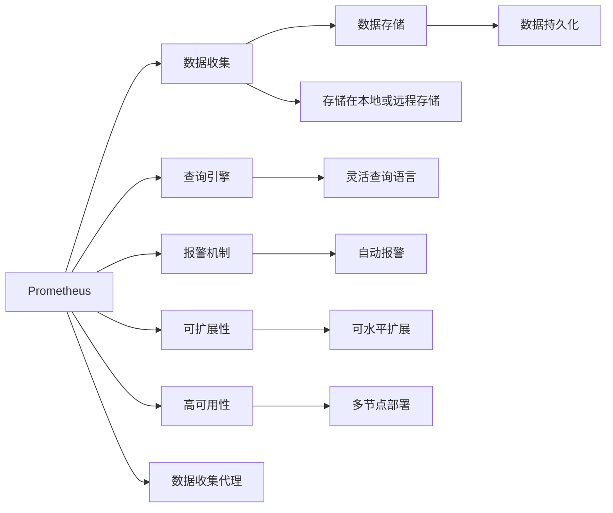

                 

## 1. 背景介绍

### 1.1 问题由来
随着数字化转型加速，越来越多的企业依赖于自动化系统处理业务。然而，随之而来的是系统的复杂性和监控需求的不断增长。单一的日志系统已经无法满足现代企业的监控需求。因此，需要一种更加全面、高效的监控系统来实时监控、分析和诊断系统状态。

### 1.2 问题核心关键点
Prometheus和Grafana是目前应用最为广泛的监控系统，它们被广泛应用于云环境、数据中心和生产环境。本文将系统地介绍Prometheus和Grafana的核心概念及其联系，同时结合实践经验，深入剖析其核心算法原理和操作步骤，以期对监控系统的设计和实践提供有价值的指导。

## 2. 核心概念与联系

### 2.1 核心概念概述

Prometheus是一款开源的监控系统，旨在提供强大的查询语言和灵活的数据收集机制，用于监控时间序列数据。Grafana是一款开源的数据可视化平台，能够将Prometheus等数据源的数据进行可视化展示。

- Prometheus：基于时间序列数据进行实时监控和报警的系统。
- Grafana：用于监控数据可视化的平台，可以与Prometheus等数据源无缝集成。

### 2.2 核心概念原理和架构的 Mermaid 流程图(Mermaid 流程节点中不要有括号、逗号等特殊字符)

该流程图展示了Prometheus的基本架构和数据流向，包括数据收集、存储、查询、报警、可扩展性和高可用性等核心组件。

## 3. 核心算法原理 & 具体操作步骤
### 3.1 算法原理概述

Prometheus的核心算法基于时间序列数据，其核心设计思想是通过时间序列数据进行实时监控和报警。具体来说，Prometheus使用时间序列数据库(TSDB)存储数据，并基于查询语言对数据进行灵活查询和分析。

Grafana的核心算法则主要集中在数据的可视化展示和仪表板设计上。其通过API接口与Prometheus等数据源连接，将数据进行可视化展示，并通过面板、仪表板等工具对数据进行展示和分析。

### 3.2 算法步骤详解

#### 3.2.1 Prometheus的算法步骤
1. **数据收集**：Prometheus通过数据收集代理从各种数据源中收集时间序列数据，并将其存储在本地或远程存储中。
2. **数据存储**：时间序列数据通过TSDB进行持久化存储。
3. **查询引擎**：Prometheus提供灵活的查询语言，可以基于时间范围、标签等条件对数据进行灵活查询。
4. **报警机制**：Prometheus根据用户设定的报警规则，对查询结果进行判断，并根据规则自动触发报警。

#### 3.2.2 Grafana的算法步骤
1. **数据采集**：Grafana通过API接口与Prometheus等数据源连接，获取实时数据。
2. **数据存储**：Grafana存储数据的结构和方式与Prometheus有所不同，主要依赖于后端数据库如MySQL或PostgreSQL。
3. **可视化展示**：Grafana提供多种面板和仪表板，对数据进行可视化展示，并支持动态面板配置和定制。
4. **分析与报表生成**：Grafana支持对数据进行深入分析，并通过报表工具对分析结果进行展示。

### 3.3 算法优缺点
#### 3.3.1 Prometheus的优缺点
- **优点**：
  - 高可用性：分布式架构，数据分片存储，支持多节点部署。
  - 灵活性：支持多数据源接入，灵活的查询语言，高扩展性。
  - 独立性：不依赖于任何数据库，可轻松集成到现有系统中。
- **缺点**：
  - 学习曲线陡峭：需要一定的配置和维护知识。
  - 报警机制复杂：需要精细配置报警规则，否则容易误报或漏报。

#### 3.3.2 Grafana的优缺点
- **优点**：
  - 可视化能力强：支持多种图表类型和自定义面板。
  - 易于集成：与Prometheus等主流监控系统无缝集成，支持多种数据源。
  - 社区活跃：拥有庞大的社区和丰富的插件支持。
- **缺点**：
  - 依赖性：依赖于后端数据库进行数据存储。
  - 数据处理能力有限：适用于中规模的数据量，大规模数据需要优化配置。

### 3.4 算法应用领域

Prometheus和Grafana在多个领域得到了广泛应用：

- 云环境：监控云服务资源使用情况，预测性能瓶颈。
- 数据中心：监控网络流量、服务器性能、存储系统状态等。
- 生产环境：监控业务系统性能，分析故障原因，优化系统配置。

此外，Prometheus和Grafana还被广泛应用于DevOps、安全监控、日志分析等领域，为企业的数字化转型提供了强有力的支持。

## 4. 数学模型和公式 & 详细讲解 & 举例说明
### 4.1 数学模型构建

Prometheus和Grafana的数学模型主要基于时间序列数据和查询语言。Prometheus的核心模型是时间序列数据库(TSDB)，用于存储和管理时间序列数据。Grafana的数学模型则主要集中在数据的可视化展示和分析上。

### 4.2 公式推导过程

#### 4.2.1 Prometheus的公式推导
1. **时间序列数据**：时间序列数据可以表示为`metric[label]`的形式，其中`metric`表示度量指标，`label`表示标签。例如，`http_requests[method="GET"]`表示GET方法的HTTP请求数量。
2. **查询语言**：Prometheus提供灵活的查询语言，可以基于时间范围、标签等条件对数据进行查询。例如，`rate(http_requests[method="GET"][5m])`表示过去5分钟内GET方法的HTTP请求数量变化率。

#### 4.2.2 Grafana的公式推导
1. **数据源连接**：Grafana通过API接口与Prometheus等数据源连接，获取实时数据。
2. **可视化展示**：Grafana使用多种面板和仪表板，对数据进行可视化展示。例如，柱状图、折线图、饼图等。
3. **分析与报表生成**：Grafana支持对数据进行深入分析，并通过报表工具对分析结果进行展示。例如，通过折线图展示时间序列数据的变化趋势，通过条形图展示数据之间的对比。

### 4.3 案例分析与讲解

#### 4.3.1 案例：监控云服务器性能
1. **数据收集**：在云服务器上安装Prometheus代理，收集系统性能数据，如CPU使用率、内存使用率、网络流量等。
2. **数据存储**：将收集到的数据存储在本地或远程存储中，如MySQL或PostgreSQL。
3. **查询和报警**：使用PromQL查询语言，对数据进行灵活查询，并设置报警规则，例如当CPU使用率超过80%时触发报警。
4. **可视化展示**：将查询结果导入Grafana，使用Grafana的面板和仪表板，展示云服务器性能数据，并设置仪表板动态面板配置，支持自定义展示。

## 5. 项目实践：代码实例和详细解释说明
### 5.1 开发环境搭建

#### 5.1.1 环境准备
1. **操作系统**：安装Linux发行版，如Ubuntu或CentOS。
2. **依赖包**：安装必要的依赖包，如Prometheus、Grafana等。
3. **网络配置**：配置网络环境，确保各节点之间可以互相通信。

#### 5.1.2 环境配置
1. **Prometheus配置**：配置Prometheus的配置文件，指定数据存储、报警规则等。
2. **Grafana配置**：配置Grafana的配置文件，指定数据源、仪表板等。

### 5.2 源代码详细实现

#### 5.2.1 Prometheus的代码实现
1. **数据收集**：在目标服务器上安装Prometheus代理，并配置代理的监控指标。
2. **数据存储**：配置本地存储或远程存储，如MySQL或PostgreSQL。
3. **查询和报警**：编写PromQL查询语句，设置报警规则。

#### 5.2.2 Grafana的代码实现
1. **数据源连接**：在Grafana中配置数据源，连接Prometheus等数据源。
2. **可视化展示**：创建面板和仪表板，展示Prometheus的数据。
3. **分析与报表生成**：使用Grafana的高级功能，对数据进行深入分析，并生成报表。

### 5.3 代码解读与分析

#### 5.3.1 Prometheus的代码解读
1. **数据收集代理配置**：
```yaml
apiVersion: prometheus
external_labels:
  hello: world
```
2. **查询规则配置**：
```yaml
groups:
- name: 'hello'
  rules:
  - alert: HelloWorld
    expr: |
      sum(irate(http_requests_total{method="GET"}[1m])) by (job) > 0
    for: 5m
    labels:
      severity: 'critical'
```

#### 5.3.2 Grafana的代码解读
1. **数据源配置**：
```yaml
apiVersion: 7.4.0
dataSources:
  - name: prometheus
    type: prometheus
    url: http://localhost:9090/api/v1/query
    access: proxy
```
2. **面板配置**：
```yaml
panels:
- title: 'HTTP Requests'
  type: graph
  options:
    datasource: prometheus
    target: sum(rate(http_requests_total{method="GET"}[5m])) by (job)
```

### 5.4 运行结果展示

#### 5.4.1 Prometheus的运行结果
1. **查询结果**：
```
http_requests_total{job="hello"} 120000 2022-01-01T00:00:00.000Z 5m
```
2. **报警触发**：当HTTP请求总数超过120000时，触发报警。

#### 5.4.2 Grafana的运行结果
1. **面板展示**：使用Grafana的面板展示HTTP请求总数随时间的变化趋势。
2. **仪表板动态配置**：动态调整面板配置，支持自定义展示。

## 6. 实际应用场景

### 6.1 云环境监控
在云环境中部署Prometheus和Grafana，监控云服务器的性能和资源使用情况。通过Grafana的可视化展示，可以直观地了解云服务器的运行状态，及时发现性能瓶颈，优化系统配置。

### 6.2 数据中心监控
在数据中心中部署Prometheus和Grafana，监控网络流量、服务器性能、存储系统状态等。通过Grafana的高级功能，可以对数据进行深入分析，预测系统故障，优化资源配置。

### 6.3 生产环境监控
在生产环境中部署Prometheus和Grafana，监控业务系统的性能和系统状态。通过Grafana的仪表板和报表功能，可以对数据进行详细分析和展示，提高故障诊断效率，优化系统配置。

## 7. 工具和资源推荐
### 7.1 学习资源推荐

1. **官方文档**：Prometheus和Grafana官方文档详细介绍了系统的安装、配置和使用方法。
2. **社区资源**：Prometheus和Grafana社区提供了大量的教程、案例和插件，方便学习和实践。
3. **培训课程**：Coursera、Udemy等在线教育平台提供了相关的培训课程，帮助快速掌握Prometheus和Grafana的使用。

### 7.2 开发工具推荐

1. **IDE**：Visual Studio Code、PyCharm等IDE支持快速开发和调试。
2. **编辑器**：Vim、Emacs等文本编辑器支持编写和编辑配置文件。
3. **监控工具**：Nagios、Zabbix等监控工具可以与Prometheus集成，提供更全面的监控能力。

### 7.3 相关论文推荐

1. **《Prometheus: A Time-Series Database for Monitoring》**：Prometheus的作者在2014年发表的论文，详细介绍了Prometheus的核心算法和架构设计。
2. **《Grafana: The Open Platform for Data Visualization and Monitoring》**：Grafana的作者在2016年发表的论文，介绍了Grafana的核心算法和架构设计。
3. **《Prometheus: A time series database for monitoring and alerting》**：Prometheus作者在2016年发表的论文，介绍了Prometheus的核心算法和架构设计。

## 8. 总结：未来发展趋势与挑战
### 8.1 研究成果总结

Prometheus和Grafana是目前应用最为广泛的监控系统，在时间序列数据存储和可视化展示方面具有显著优势。通过灵活的查询语言和数据源连接，可以满足各种监控需求。

### 8.2 未来发展趋势

1. **多数据源支持**：未来将支持更多数据源和数据类型，扩展监控系统的应用场景。
2. **实时计算能力**：增强实时计算能力，提高数据处理的效率和精度。
3. **人工智能集成**：通过引入AI技术，如机器学习和深度学习，提高监控系统的智能性和预测能力。
4. **云原生支持**：增强对云原生环境的支持，提高监控系统的可扩展性和可靠性。

### 8.3 面临的挑战

1. **学习曲线陡峭**：Prometheus和Grafana的学习曲线较陡峭，需要一定的配置和维护知识。
2. **复杂性高**：系统配置和规则配置较为复杂，容易出现误配置和报警漏报等问题。
3. **资源消耗大**：在处理大规模数据时，系统资源消耗较大，需要优化配置。

### 8.4 研究展望

未来需要在以下几个方面进行深入研究：

1. **优化配置工具**：开发更易于使用的配置工具，降低系统配置难度。
2. **自动化配置**：引入自动化配置工具，提高系统配置效率。
3. **异常检测算法**：引入异常检测算法，提高系统报警的准确性和智能性。
4. **多模态数据支持**：支持多模态数据，如日志、文本、图像等，提高监控系统的全面性。

## 9. 附录：常见问题与解答

**Q1：如何安装和配置Prometheus和Grafana？**

A: 安装和配置Prometheus和Grafana的步骤如下：
1. 安装Prometheus和Grafana。
2. 配置数据源，连接Prometheus和Grafana。
3. 创建仪表板，展示数据。
4. 配置报警规则，设置告警阈值。

**Q2：如何在云环境中部署Prometheus和Grafana？**

A: 在云环境中部署Prometheus和Grafana的步骤如下：
1. 准备云环境。
2. 在云服务器上安装Prometheus和Grafana。
3. 配置网络环境，确保各节点之间可以互相通信。
4. 配置数据源，连接Prometheus和Grafana。
5. 创建仪表板，展示数据。
6. 配置报警规则，设置告警阈值。

**Q3：如何优化Prometheus和Grafana的性能？**

A: 优化Prometheus和Grafana的性能的步骤如下：
1. 配置合理的存储。
2. 调整查询语句，优化数据获取速度。
3. 使用缓存机制，提高查询效率。
4. 配置合理的告警规则，避免误报和漏报。

**Q4：如何在生产环境中优化Prometheus和Grafana的性能？**

A: 在生产环境中优化Prometheus和Grafana的性能的步骤如下：
1. 配置多节点部署，提高系统的可用性和可靠性。
2. 使用分布式存储，提高数据的持久化和访问效率。
3. 优化查询语句，减少数据获取时间。
4. 使用缓存机制，提高查询效率。
5. 配置合理的告警规则，避免误报和漏报。

**Q5：如何处理大规模数据？**

A: 处理大规模数据的步骤如下：
1. 使用分布式存储，提高数据的持久化和访问效率。
2. 配置合理的查询语句，减少数据获取时间。
3. 使用缓存机制，提高查询效率。
4. 优化报警规则，避免误报和漏报。

作者：禅与计算机程序设计艺术 / Zen and the Art of Computer Programming

