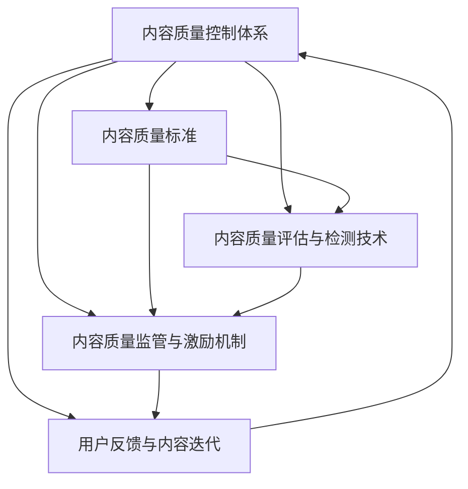

                 

# 知识付费创业中的内容质量控制体系

## 1. 背景介绍

在知识付费创业中，内容质量控制体系的重要性不言而喻。随着在线教育、知识社区、自媒体平台的兴起，越来越多的内容创作者开始提供高质量的课程、文章、视频等知识产品。然而，由于内容创作的门槛相对较低，创作者素质参差不齐，内容质量难以得到有效保证。如何在激烈的竞争中脱颖而出，确保内容的准确性、权威性和实用性，成为知识付费创业者关注的焦点。

### 1.1 问题由来

知识付费市场发展迅速，内容类型多样，涉及领域广泛。然而，由于缺乏统一的质量标准和监管机制，部分内容质量不高，甚至存在虚假信息、误导性内容，严重影响用户体验和平台声誉。为解决这些问题，内容质量控制体系应运而生，成为知识付费创业中不可或缺的一环。

### 1.2 问题核心关键点

知识付费创业中，内容质量控制体系的核心关键点包括：
- 内容质量的标准制定
- 内容质量评估与检测技术
- 内容质量监管与激励机制
- 用户反馈与内容迭代

这些关键点共同构成了内容质量控制体系的框架，确保高质量内容能够不断涌现，提升用户满意度和平台价值。

## 2. 核心概念与联系

### 2.1 核心概念概述

为更好地理解内容质量控制体系的构建，本节将介绍几个密切相关的核心概念：

- **内容质量控制体系**：一套系统化的流程和机制，用于规范内容创作与发布，确保内容符合特定标准和用户需求。

- **内容质量标准**：由行业专家制定的，关于内容形式、内容深度、作者资质等方面的具体要求，作为内容评估和监管的依据。

- **内容质量评估与检测技术**：利用算法和工具，自动化地检测和评估内容是否符合质量标准，识别内容问题并进行提示和纠正。

- **内容质量监管与激励机制**：通过平台规则和奖励机制，确保内容质量标准得到执行，同时激励创作者提供优质内容。

- **用户反馈与内容迭代**：收集用户对内容的评价和建议，反馈至创作者和平台，推动内容不断优化和更新。

这些核心概念之间的逻辑关系可以通过以下Mermaid流程图来展示：



这个流程图展示了一系列关键环节的逻辑关系：

1. 内容质量标准是内容评估和监管的依据。
2. 内容质量评估与检测技术，自动检测内容问题，并反馈至监管环节。
3. 内容质量监管与激励机制，确保内容标准得到执行，并激励创作者。
4. 用户反馈与内容迭代，持续收集用户意见，推动内容更新。

这些概念共同构成了内容质量控制体系的框架，确保内容质量得到有效控制和提升。

## 3. 核心算法原理 & 具体操作步骤
### 3.1 算法原理概述

内容质量控制体系的核心算法原理基于监督学习（Supervised Learning）和自然语言处理（Natural Language Processing, NLP）技术。通过构建标准化的内容质量评估模型，结合用户反馈和行业标准，自动化地检测和评估内容质量。

形式化地，假设内容集为 $D=\{(x_i,y_i)\}_{i=1}^N$，其中 $x_i$ 为内容，$y_i$ 为内容质量评分。目标是训练一个模型 $M_{\theta}$，使得对任意未标注内容 $x$，模型能够预测其质量评分 $y$。

设 $\ell$ 为损失函数，$\theta$ 为模型参数，则优化目标为：

$$
\hat{\theta} = \mathop{\arg\min}_{\theta} \mathcal{L}(M_{\theta},D)
$$

其中 $\mathcal{L}$ 为监督学习模型常用的损失函数，如交叉熵损失。训练过程中，不断调整模型参数 $\theta$，最小化经验风险。

### 3.2 算法步骤详解

内容质量控制体系的算法步骤包括：

1. **数据准备**：收集已标注的内容质量数据，构建训练集 $D$。
2. **模型选择与训练**：选择适合的任务模型（如分类模型、序列标注模型等），在训练集上训练并调优。
3. **内容检测与评估**：对新内容 $x$ 进行输入，模型输出质量评分 $y$。
4. **监管与激励**：根据内容质量评分，执行监管措施或提供激励。
5. **用户反馈**：收集用户对内容的评价和建议，用于后续模型迭代。

### 3.3 算法优缺点

内容质量控制体系具有以下优点：
1. 自动化：通过算法和工具，自动化检测和评估内容质量，减少人工审核成本。
2. 标准化：提供统一的质量标准和评估方法，确保内容质量的一致性和可比性。
3. 实时性：能够实时监控内容质量，及时发现和纠正问题。
4. 激励机制：通过奖励优质内容，激励创作者持续提供高质量内容。

同时，该体系也存在一些局限性：
1. 数据依赖：质量评估模型的性能高度依赖标注数据，标注成本较高。
2. 泛化能力：对于新领域的标注数据较少，模型的泛化能力可能受限。
3. 误判风险：算法模型可能存在误判，影响内容质量评估的准确性。
4. 平台依赖：内容质量标准和激励机制可能受到平台规则和算法限制。

尽管存在这些局限性，内容质量控制体系仍是大规模知识付费平台的重要工具，通过不断优化模型和完善机制，可以有效提升内容质量，确保平台的持续发展和用户满意度。

### 3.4 算法应用领域

内容质量控制体系在知识付费创业中具有广泛的应用领域，包括但不限于：

- **课程评估与监管**：对课程内容进行质量评估，确保内容符合教育标准。
- **文章与书籍审核**：检测文章与书籍的质量，避免误导性信息和错误。
- **视频与音频检测**：检测视频和音频内容，确保内容符合平台标准。
- **用户反馈分析**：分析用户评价，识别问题内容并反馈给创作者。

## 4. 数学模型和公式 & 详细讲解 & 举例说明
### 4.1 数学模型构建

在内容质量控制体系中，我们通常使用分类模型来评估内容的质量。假设内容 $x$ 的分类标签为 $y \in \{0,1\}$，表示是否符合质量标准。定义二分类交叉熵损失函数为：

$$
\ell(y, \hat{y}) = -y \log \hat{y} - (1-y) \log(1-\hat{y})
$$

其中 $\hat{y}$ 为模型的预测概率。

### 4.2 公式推导过程

对于二分类问题，常用的分类模型包括逻辑回归、支持向量机、随机森林等。这里以逻辑回归为例，进行模型推导。

逻辑回归模型的参数 $\theta$ 包括偏置项和特征系数，形式为 $\theta = (b, w_1, w_2, \ldots, w_n)$。模型输入 $x$ 为内容的文本表示，输出为内容质量评分的概率：

$$
\hat{y} = \sigma(\theta^T x)
$$

其中 $\sigma$ 为 sigmoid 函数。

使用二分类交叉熵损失函数，定义损失函数 $\mathcal{L}$ 为：

$$
\mathcal{L}(\theta) = -\frac{1}{N}\sum_{i=1}^N \ell(y_i, \hat{y}_i)
$$

其中 $\hat{y}_i$ 为模型对第 $i$ 个样本的预测概率。

在训练过程中，使用梯度下降算法最小化损失函数：

$$
\theta \leftarrow \theta - \eta \nabla_{\theta}\mathcal{L}(\theta)
$$

其中 $\eta$ 为学习率。

### 4.3 案例分析与讲解

以一篇文章的分类问题为例，假设 $x$ 为文章文本，$y$ 为文章质量评分，分类模型 $M_{\theta}$ 的结构如下：

$$
M_{\theta}(x) = \sigma(\theta^T \text{Embed}(x))
$$

其中 $\text{Embed}(x)$ 为文章的文本嵌入表示，$\theta$ 为模型参数。

假设训练集 $D$ 包含10000篇已标注的文章，每篇文章的质量评分为0或1。使用随机梯度下降法进行模型训练，学习率为0.01，迭代次数为1000次。模型训练过程如下：

1. 将训练集 $D$ 中的文章 $x$ 转化为文本嵌入表示 $\text{Embed}(x)$。
2. 将 $\text{Embed}(x)$ 输入模型 $M_{\theta}$，输出预测概率 $\hat{y}$。
3. 计算损失 $\ell(y, \hat{y})$，反向传播更新参数 $\theta$。
4. 重复上述过程，直至收敛。

最终，训练好的模型可以对新文章 $x'$ 进行质量评分预测，输出 $\hat{y}'$。

## 5. 项目实践：代码实例和详细解释说明
### 5.1 开发环境搭建

在进行内容质量控制体系的开发实践中，我们需要准备开发环境。以下是使用Python进行TensorFlow开发的示例：

1. 安装TensorFlow：
```bash
pip install tensorflow
```

2. 准备数据集：
```bash
import tensorflow as tf

# 假设数据集已经保存在文件中
train_data = tf.data.TextLineDataset('train_data.txt')
train_labels = tf.data.TextLineDataset('train_labels.txt')

# 使用ZipDataset将数据集和标签合并
train_dataset = tf.data.Dataset.zip((train_data, train_labels))
```

3. 定义模型结构：
```python
import tensorflow as tf

class ContentQualityModel(tf.keras.Model):
    def __init__(self, input_dim):
        super(ContentQualityModel, self).__init__()
        self.embedding = tf.keras.layers.Embedding(input_dim, 128)
        self.fc1 = tf.keras.layers.Dense(64, activation='relu')
        self.fc2 = tf.keras.layers.Dense(1, activation='sigmoid')
    
    def call(self, x):
        x = self.embedding(x)
        x = self.fc1(x)
        return self.fc2(x)
```

4. 定义训练流程：
```python
model = ContentQualityModel(input_dim)

optimizer = tf.keras.optimizers.Adam(learning_rate=0.01)
loss_fn = tf.keras.losses.BinaryCrossentropy()

@tf.function
def train_step(x, y):
    with tf.GradientTape() as tape:
        logits = model(x)
        loss = loss_fn(y, logits)
    gradients = tape.gradient(loss, model.trainable_variables)
    optimizer.apply_gradients(zip(gradients, model.trainable_variables))
    return loss

@tf.function
def evaluate_step(x, y):
    logits = model(x)
    return loss_fn(y, logits)

# 训练模型
for epoch in range(1000):
    total_loss = 0
    for batch in train_dataset:
        x, y = batch
        loss = train_step(x, y)
        total_loss += loss
    print(f'Epoch {epoch+1}, train loss: {total_loss/len(train_dataset)}')

# 评估模型
for batch in test_dataset:
    x, y = batch
    loss = evaluate_step(x, y)
    print(f'Test loss: {loss}')
```

### 5.2 源代码详细实现

以下是对逻辑回归模型进行内容质量评估的代码实现。

```python
import tensorflow as tf

# 准备数据集
train_data = tf.data.TextLineDataset('train_data.txt')
train_labels = tf.data.TextLineDataset('train_labels.txt')
train_dataset = tf.data.Dataset.zip((train_data, train_labels))

# 定义模型结构
class ContentQualityModel(tf.keras.Model):
    def __init__(self, input_dim):
        super(ContentQualityModel, self).__init__()
        self.embedding = tf.keras.layers.Embedding(input_dim, 128)
        self.fc1 = tf.keras.layers.Dense(64, activation='relu')
        self.fc2 = tf.keras.layers.Dense(1, activation='sigmoid')
    
    def call(self, x):
        x = self.embedding(x)
        x = self.fc1(x)
        return self.fc2(x)

# 定义训练流程
model = ContentQualityModel(input_dim)

optimizer = tf.keras.optimizers.Adam(learning_rate=0.01)
loss_fn = tf.keras.losses.BinaryCrossentropy()

@tf.function
def train_step(x, y):
    with tf.GradientTape() as tape:
        logits = model(x)
        loss = loss_fn(y, logits)
    gradients = tape.gradient(loss, model.trainable_variables)
    optimizer.apply_gradients(zip(gradients, model.trainable_variables))
    return loss

@tf.function
def evaluate_step(x, y):
    logits = model(x)
    return loss_fn(y, logits)

# 训练模型
for epoch in range(1000):
    total_loss = 0
    for batch in train_dataset:
        x, y = batch
        loss = train_step(x, y)
        total_loss += loss
    print(f'Epoch {epoch+1}, train loss: {total_loss/len(train_dataset)}')

# 评估模型
for batch in test_dataset:
    x, y = batch
    loss = evaluate_step(x, y)
    print(f'Test loss: {loss}')
```

### 5.3 代码解读与分析

上述代码实现了一个基于逻辑回归的文本分类模型，用于检测内容是否符合质量标准。模型通过文本嵌入、全连接层和sigmoid函数构成，输出内容质量评分的概率。训练过程中，使用随机梯度下降法最小化二分类交叉熵损失函数。

代码中，首先通过`tf.data.TextLineDataset`加载训练数据和标签，然后使用`zip`函数将两者合并为一个数据集。接着定义模型结构，包括嵌入层、全连接层和输出层。在`train_step`和`evaluate_step`函数中，分别定义训练和评估流程，使用`tf.GradientTape`记录梯度并更新模型参数。

## 6. 实际应用场景

### 6.1 课程评估与监管

在在线教育平台中，内容质量控制体系可以用于课程评估与监管，确保课程内容符合教育标准。平台通过自动化的内容检测工具，对每门课程的讲义、视频、练习题等进行质量评估，识别问题内容并反馈给创作者。对于存在问题的课程，平台可以采取删除、下架等监管措施，保障用户的学习效果和体验。

### 6.2 文章与书籍审核

在内容创作平台中，内容质量控制体系可以用于文章与书籍的审核。平台对用户上传的内容进行质量评估，识别低质量、误导性信息，并将其标记为待审核。创作者在发布内容前，可以收到审核提示，根据反馈进行修改。审核通过后，内容才会发布，确保平台内容的高质量和可信度。

### 6.3 视频与音频检测

在视频和音频内容平台上，内容质量控制体系可以用于视频和音频的检测。平台对视频和音频内容进行质量评估，识别低质量、误导性信息，并将其标记为待审核。创作者在发布内容前，可以收到审核提示，根据反馈进行修改。审核通过后，内容才会发布，确保平台内容的高质量和可信度。

### 6.4 用户反馈分析

在所有平台中，内容质量控制体系可以用于用户反馈分析。平台通过收集用户对内容的评价和建议，识别问题内容并反馈给创作者。创作者可以根据用户反馈，进行内容优化和更新，提升内容质量和用户体验。同时，平台可以统计用户反馈数据，分析常见问题和改进方向，不断优化内容质量控制体系。

## 7. 工具和资源推荐
### 7.1 学习资源推荐

为了帮助开发者掌握内容质量控制体系的理论基础和实践技巧，这里推荐一些优质的学习资源：

1. TensorFlow官方文档：提供了全面的TensorFlow教程和API文档，适合初学者和进阶开发者学习。
2. Keras官方文档：提供了易于上手的Keras教程和API文档，适合快速上手内容质量评估模型开发。
3. Coursera课程《TensorFlow for Deep Learning》：由Google提供，涵盖TensorFlow的实战应用，适合深入学习TensorFlow。
4. Udacity课程《TensorFlow for AI and Machine Learning》：由TensorFlow团队提供，涵盖TensorFlow在AI和机器学习中的应用，适合深入学习TensorFlow。
5. 《Python深度学习》书籍：由Francois Chollet编写，详细介绍了TensorFlow和Keras的实现原理和应用案例，适合深入学习。

通过对这些资源的学习实践，相信你一定能够快速掌握内容质量控制体系的理论基础和实践技巧，并用于解决实际的内容质量问题。

### 7.2 开发工具推荐

高效的开发离不开优秀的工具支持。以下是几款用于内容质量控制体系开发的常用工具：

1. TensorFlow：由Google主导开发的深度学习框架，功能强大，支持分布式计算和自动微分，适合复杂模型的开发。
2. Keras：Google开发的高级API，提供了简洁易用的接口，适合快速原型开发。
3. TensorBoard：TensorFlow配套的可视化工具，可以实时监测模型训练状态，提供丰富的图表呈现方式。
4. Weights & Biases：模型训练的实验跟踪工具，可以记录和可视化模型训练过程中的各项指标，方便对比和调优。
5. TensorFlow Extended（TFX）：Google开发的机器学习开发工具，提供了管道化（Pipeline）的开发方式，适合大规模工程的开发。

合理利用这些工具，可以显著提升内容质量控制体系的开发效率，加快创新迭代的步伐。

### 7.3 相关论文推荐

内容质量控制体系的研究源于学界的持续研究。以下是几篇奠基性的相关论文，推荐阅读：

1. TensorFlow: A System for Large-Scale Machine Learning: 介绍TensorFlow的架构和功能，是理解TensorFlow的入门必读。
2. Keras: Deep Learning for Humans: 介绍Keras的实现原理和应用案例，适合快速上手内容质量评估模型开发。
3. TensorFlow Extended: A TensorFlow-Based Platform for Flexible, Customizable End-to-End Machine Learning Pipelines: 介绍TFX的架构和功能，适合理解TensorFlow的工程化开发。
4. Deep Learning with Python: 由Francois Chollet编写，详细介绍了TensorFlow和Keras的实现原理和应用案例，适合深入学习。
5. Computer Vision: Algorithms and Applications: 由Richard Szeliski编写，涵盖了计算机视觉的全面知识，适合深入理解视频与音频内容的检测。

这些论文代表了大语言模型微调技术的发展脉络。通过学习这些前沿成果，可以帮助研究者把握学科前进方向，激发更多的创新灵感。

## 8. 总结：未来发展趋势与挑战

### 8.1 总结

本文对内容质量控制体系的理论基础和实践方法进行了全面系统的介绍。首先阐述了内容质量控制体系在知识付费创业中的重要性，明确了内容质量控制体系的核心关键点。其次，从原理到实践，详细讲解了内容质量评估模型的构建和优化，给出了内容质量控制体系的完整代码实例。同时，本文还广泛探讨了内容质量控制体系在教育、内容创作、视频音频检测等多个领域的应用前景，展示了内容质量控制体系的广阔应用潜力。

通过本文的系统梳理，可以看到，内容质量控制体系在知识付费创业中起到了至关重要的作用，能够有效提升内容质量，保障平台的用户体验和价值。未来，随着技术的不断演进，内容质量控制体系也将不断优化，助力知识付费创业的持续发展和用户满意度提升。

### 8.2 未来发展趋势

展望未来，内容质量控制体系将呈现以下几个发展趋势：

1. **自动化程度提升**：通过更先进的算法和技术，自动化检测和评估内容质量将更加高效和精准，减少人工审核成本。
2. **多模态内容检测**：视频、音频等多模态内容的自动检测将成为研究重点，检测手段将更加全面和多样化。
3. **语义理解和生成**：结合自然语言处理技术，内容质量控制体系将能够对文本内容进行更深入的语义理解和生成，提高检测的准确性和深度。
4. **实时性和交互性增强**：通过实时监控和用户反馈，内容质量控制体系将能够更及时地发现和修正内容问题，提升用户体验。
5. **跨平台协同**：内容质量控制体系将在不同平台间实现协同，提升整体内容质量标准和监管力度。

以上趋势凸显了内容质量控制体系的发展前景。这些方向的探索发展，必将进一步提升内容质量控制体系的性能和应用范围，为知识付费创业的持续发展和用户满意度提升提供坚实保障。

### 8.3 面临的挑战

尽管内容质量控制体系已经取得了显著进展，但在迈向更加智能化、普适化应用的过程中，仍面临诸多挑战：

1. **标注数据稀缺**：高质量的标注数据成本较高，获取难度大，导致内容质量评估模型的泛化能力有限。
2. **算法模型局限**：现有的检测算法模型可能存在误判，影响内容质量评估的准确性。
3. **平台依赖性强**：内容质量控制体系的执行依赖平台规则和算法，不同平台间的数据和标准可能存在差异。
4. **用户反馈处理**：用户反馈数据量大且复杂，如何有效处理和利用，成为亟待解决的问题。

尽管存在这些挑战，内容质量控制体系仍是大规模知识付费平台的重要工具，通过不断优化算法和机制，可以有效提升内容质量，确保平台的持续发展和用户满意度。

### 8.4 研究展望

未来，内容质量控制体系的研究方向将包括以下几个方面：

1. **无监督和半监督学习**：探索基于无监督和半监督学习的方法，减少标注数据需求，提高模型的泛化能力。
2. **多模态内容检测**：结合计算机视觉和自然语言处理技术，提升多模态内容的自动检测能力。
3. **语义理解和生成**：结合语义理解和生成技术，提升内容质量评估的深度和准确性。
4. **实时性和交互性增强**：通过实时监控和用户反馈，提升内容质量控制体系的实时性和交互性。
5. **跨平台协同**：实现不同平台间的协同和标准化，提升整体内容质量控制体系的性能。

这些研究方向将推动内容质量控制体系的技术进步和应用范围的拓展，为知识付费创业的持续发展和用户满意度提升提供坚实保障。总之，内容质量控制体系的研究将与知识付费创业的发展紧密结合，不断优化和提升，确保高质量内容能够不断涌现，提升用户满意度和平台价值。

## 9. 附录：常见问题与解答

**Q1: 内容质量控制体系如何确保内容质量的一致性？**

A: 内容质量控制体系通过标准化的内容质量评估模型和一致化的标注数据，确保内容质量的一致性。模型在训练过程中，使用标注数据进行监督学习，学习内容质量评估的规律和模式，从而对新内容进行一致性的评估。同时，平台可以定期更新和校验标注数据，确保其准确性和可靠性。

**Q2: 如何处理标注数据稀缺的问题？**

A: 标注数据稀缺是内容质量控制体系面临的常见挑战。解决该问题的方法包括：
1. 无监督和半监督学习：结合无监督和半监督学习技术，利用未标注数据进行训练，减少对标注数据的依赖。
2. 主动学习：通过主动学习算法，优先标注质量差的样本，提高标注数据的利用率。
3. 用户反馈机制：引入用户反馈机制，利用用户评价进行标注数据的增强和校正。

**Q3: 内容质量控制体系如何应对平台依赖问题？**

A: 内容质量控制体系依赖平台规则和算法，可能存在平台依赖问题。解决该问题的方法包括：
1. 标准化：制定统一的内容质量标准，确保不同平台间的内容质量控制一致性。
2. 跨平台协同：通过数据共享和算法融合，实现不同平台间的协同，提升整体内容质量控制体系的性能。

**Q4: 如何处理用户反馈数据？**

A: 用户反馈数据量大且复杂，处理和利用用户反馈数据是内容质量控制体系面临的重要挑战。解决该问题的方法包括：
1. 数据清洗：对用户反馈数据进行清洗和预处理，去除无效和噪音数据。
2. 情感分析：结合自然语言处理技术，对用户反馈进行情感分析，识别正负面反馈。
3. 聚类分析：对用户反馈进行聚类分析，识别常见问题和改进方向。

这些方法可以帮助平台有效处理和利用用户反馈数据，提升内容质量控制体系的性能和应用效果。

**Q5: 如何评估内容质量控制体系的效果？**

A: 评估内容质量控制体系的效果通常从以下几个方面进行：
1. 准确率：评估模型对内容质量的检测准确率，识别高误判率的内容。
2. 召回率：评估模型对所有问题内容的覆盖率，确保问题内容不被遗漏。
3. F1值：综合准确率和召回率，评估模型的综合性能。
4. 用户满意度：通过用户调查和反馈，评估用户对内容质量的满意度。

通过以上指标的评估，可以全面了解内容质量控制体系的效果，及时发现和修正问题，提升整体内容质量控制体系的性能。

---

作者：禅与计算机程序设计艺术 / Zen and the Art of Computer Programming

