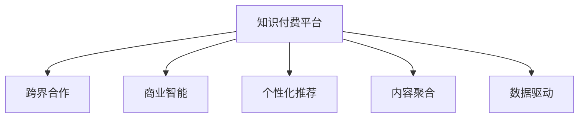

                 

# 知识付费创业中的跨界合作机会

## 1. 背景介绍

随着信息时代的发展，知识付费成为了一个日益兴起的行业。知识付费平台通过提供高质量、高价值的学习内容，满足了人们对知识获取和提升的需求。然而，随着知识付费市场的竞争加剧，传统的知识付费平台面临诸多挑战。本文旨在探讨在知识付费创业中，如何通过跨界合作，开拓新的商业模式，实现可持续发展。

### 1.1 行业现状

当前，知识付费行业竞争激烈，平台众多，内容同质化现象严重。用户对内容质量和个性化需求不断提升，单一平台难以满足多样化需求。此外，部分平台盈利模式单一，收入来源狭窄，难以实现自我造血。因此，探索新的跨界合作模式，是知识付费创业的迫切需求。

### 1.2 跨界合作的必要性

跨界合作有助于知识付费平台突破现有业务边界，拓展新领域，丰富内容形式，增强平台粘性。具体而言：

- **业务拓展**：通过与其他行业的合作，丰富内容形式，提供跨领域的专业知识，增强平台的竞争力和吸引力。
- **用户体验提升**：结合不同领域的专业知识，设计更加个性化、贴近用户需求的课程，提高用户满意度和留存率。
- **盈利模式多元化**：引入新的收入来源，如技术支持、市场推广、数据服务等，降低对单一收入来源的依赖。

## 2. 核心概念与联系

### 2.1 核心概念概述

在知识付费创业中，涉及多个核心概念，包括：

- **知识付费**：用户为获取知识或技能而支付费用的商业模式。
- **跨界合作**：不同领域的企业或机构之间进行资源共享、技术合作，实现优势互补。
- **商业智能**：通过数据分析和业务洞察，优化决策过程，提升运营效率。
- **个性化推荐**：根据用户偏好和行为，推荐相关课程，提升用户体验。
- **内容聚合**：汇集多方优质内容，形成系统化的课程体系。
- **数据驱动**：以数据为基础，指导课程开发和运营策略。

这些概念相互关联，共同构成了知识付费创业的基础框架。

### 2.2 核心概念原理和架构的 Mermaid 流程图



这个流程图展示了知识付费平台如何通过跨界合作、商业智能、个性化推荐、内容聚合和数据驱动等手段，构建完整的知识付费生态系统。

## 3. 核心算法原理 & 具体操作步骤

### 3.1 算法原理概述

在知识付费创业中，跨界合作的算法原理主要基于以下几个方面：

- **用户行为分析**：通过收集和分析用户行为数据，识别用户需求和偏好，为跨界合作提供依据。
- **内容匹配算法**：通过匹配算法，将不同领域的内容与用户需求进行匹配，提供个性化的推荐。
- **收益分配机制**：设计公平、透明的收益分配机制，确保合作双方都能获得合理的回报。

### 3.2 算法步骤详解

1. **数据收集与分析**
   - 收集用户行为数据，如浏览记录、购买行为、评价反馈等。
   - 通过数据分析，识别出用户需求和兴趣点。

2. **内容匹配**
   - 根据用户需求，匹配不同领域的内容，如职业技能、健康管理、家庭教育等。
   - 设计内容推荐算法，保证匹配的准确性和相关性。

3. **跨界合作**
   - 选择具有互补资源的企业或机构，如出版社、在线教育平台、技术公司等。
   - 明确合作目标和范围，签订合作协议，确定各方的角色和职责。

4. **收益分配**
   - 设计公平的收益分配机制，确保各方都能获得合理的回报。
   - 定期评估合作效果，根据实际情况进行调整和优化。

### 3.3 算法优缺点

#### 优点
- **资源互补**：跨界合作可以整合各方优势资源，提升内容的深度和广度。
- **用户粘性增强**：通过多样化内容，满足用户多方面的需求，提升平台粘性。
- **风险分散**：分散业务风险，降低单一业务的失败概率。

#### 缺点
- **协调难度大**：跨界合作涉及多个合作伙伴，协调难度较大。
- **收益分配复杂**：不同合作伙伴的收益分配需要谨慎设计，避免纠纷。
- **内容质量不一**：各方的内容质量可能存在差异，影响用户体验。

### 3.4 算法应用领域

跨界合作在知识付费领域的应用非常广泛，主要包括以下几个方面：

- **在线教育与技术公司合作**：技术公司提供技术支持，在线教育平台提供课程内容，共同开发高质量的在线课程。
- **出版社与知识付费平台合作**：出版社提供优质书籍资源，知识付费平台进行内容解读和制作，提供有声读物、笔记等形式的内容。
- **健康管理与心理咨询平台合作**：提供健康管理、心理咨询相关课程，满足用户的全方位需求。
- **智能家居与技能培训平台合作**：智能家居设备厂商提供设备数据，技能培训平台提供相关课程，提升用户智能家居技能。

## 4. 数学模型和公式 & 详细讲解 & 举例说明

### 4.1 数学模型构建

在知识付费创业中，我们通常使用以下数学模型来描述用户行为和内容匹配：

- **用户行为模型**：
  $$
  P(U_i|D) = \frac{e^{f(D_i;U_i)}}{\sum_{j=1}^N e^{f(D_j;U_i)}}
  $$
  其中，$U_i$ 为第 $i$ 个用户，$D$ 为数据集，$f$ 为预测函数，$P$ 为概率。

- **内容匹配模型**：
  $$
  M(C_j|U_i) = \frac{e^{g(U_i;C_j)}}{\sum_{k=1}^K e^{g(U_i;C_k)}}
  $$
  其中，$C_j$ 为第 $j$ 个内容，$g$ 为预测函数，$M$ 为概率。

### 4.2 公式推导过程

#### 用户行为模型推导
- 用户 $U_i$ 在数据集 $D$ 上的行为 $D_i$ 可以用预测函数 $f$ 进行建模。
- 利用极大似然估计，得到概率公式 $P(U_i|D)$。

#### 内容匹配模型推导
- 内容 $C_j$ 与用户 $U_i$ 的匹配度 $M(C_j|U_i)$ 可以用预测函数 $g$ 进行建模。
- 利用极大似然估计，得到概率公式 $M(C_j|U_i)$。

### 4.3 案例分析与讲解

假设某知识付费平台拥有大量用户行为数据，平台希望引入健康管理领域的课程，进行跨界合作。具体步骤如下：

1. **数据收集**：平台收集用户对健康管理内容的浏览、购买、评价等数据。
2. **用户行为分析**：利用用户行为模型，识别出对健康管理内容感兴趣的用户群体。
3. **内容匹配**：通过内容匹配模型，选择与用户需求匹配的健康管理课程。
4. **跨界合作**：与健康管理领域的专家或机构进行合作，共同开发高质量的课程。
5. **收益分配**：设计合理的收益分配机制，确保平台和健康管理领域的专家或机构都能获得合理回报。

## 5. 项目实践：代码实例和详细解释说明

### 5.1 开发环境搭建

在知识付费平台进行跨界合作实践前，需要进行以下环境搭建：

1. **选择技术栈**：选择合适的编程语言和技术栈，如Python、TensorFlow、PyTorch等。
2. **数据收集系统**：搭建数据收集系统，收集用户行为数据。
3. **数据存储系统**：搭建数据存储系统，如MySQL、Hadoop、MongoDB等。
4. **数据处理系统**：搭建数据处理系统，如Spark、Flink等。

### 5.2 源代码详细实现

#### 用户行为模型实现

```python
import tensorflow as tf
import numpy as np

# 定义用户行为模型
class UserBehaviorModel:
    def __init__(self, input_dim, hidden_dim):
        self.input_dim = input_dim
        self.hidden_dim = hidden_dim
        self.weights = {
            'input': tf.Variable(tf.random.normal([input_dim, hidden_dim])),
            'output': tf.Variable(tf.random.normal([hidden_dim, 1]))
        }
    
    def forward(self, inputs):
        hidden = tf.nn.relu(tf.matmul(inputs, self.weights['input']))
        output = tf.sigmoid(tf.matmul(hidden, self.weights['output']))
        return output

# 定义损失函数和优化器
def loss_function(outputs, labels):
    return tf.reduce_mean(tf.square(outputs - labels))

def optimizer(learning_rate):
    return tf.keras.optimizers.Adam(learning_rate)

# 训练模型
def train_model(model, input_data, labels, epochs, learning_rate):
    optimizer = optimizer(learning_rate)
    for epoch in range(epochs):
        with tf.GradientTape() as tape:
            output = model(input_data)
            loss = loss_function(output, labels)
        gradients = tape.gradient(loss, model.weights.values())
        optimizer.apply_gradients(zip(gradients, model.weights.values()))
        print(f"Epoch {epoch+1}, Loss: {loss.numpy():.4f}")
    return model
```

#### 内容匹配模型实现

```python
import tensorflow as tf

# 定义内容匹配模型
class ContentMatchingModel:
    def __init__(self, input_dim, hidden_dim, output_dim):
        self.input_dim = input_dim
        self.hidden_dim = hidden_dim
        self.output_dim = output_dim
        self.weights = {
            'input': tf.Variable(tf.random.normal([input_dim, hidden_dim])),
            'hidden': tf.Variable(tf.random.normal([hidden_dim, hidden_dim])),
            'output': tf.Variable(tf.random.normal([hidden_dim, output_dim]))
        }
    
    def forward(self, inputs):
        hidden = tf.nn.relu(tf.matmul(inputs, self.weights['input']))
        hidden = tf.nn.relu(tf.matmul(hidden, self.weights['hidden']))
        output = tf.sigmoid(tf.matmul(hidden, self.weights['output']))
        return output

# 定义损失函数和优化器
def loss_function(outputs, labels):
    return tf.reduce_mean(tf.square(outputs - labels))

def optimizer(learning_rate):
    return tf.keras.optimizers.Adam(learning_rate)

# 训练模型
def train_model(model, input_data, labels, epochs, learning_rate):
    optimizer = optimizer(learning_rate)
    for epoch in range(epochs):
        with tf.GradientTape() as tape:
            output = model(input_data)
            loss = loss_function(output, labels)
        gradients = tape.gradient(loss, model.weights.values())
        optimizer.apply_gradients(zip(gradients, model.weights.values()))
        print(f"Epoch {epoch+1}, Loss: {loss.numpy():.4f}")
    return model
```

### 5.3 代码解读与分析

#### 用户行为模型代码解读

- **类定义**：定义 UserBehaviorModel 类，包含输入维度、隐藏维度和权重。
- **前向传播**：计算前向传播，包括输入层、隐藏层和输出层的计算。
- **损失函数**：计算损失函数，即预测值与真实标签之间的均方误差。
- **优化器**：定义 Adam 优化器，进行模型参数的更新。
- **训练模型**：进行模型训练，循环多次计算损失函数和参数更新。

#### 内容匹配模型代码解读

- **类定义**：定义 ContentMatchingModel 类，包含输入维度、隐藏维度和输出维度。
- **前向传播**：计算前向传播，包括输入层、隐藏层和输出层的计算。
- **损失函数**：计算损失函数，即预测值与真实标签之间的均方误差。
- **优化器**：定义 Adam 优化器，进行模型参数的更新。
- **训练模型**：进行模型训练，循环多次计算损失函数和参数更新。

### 5.4 运行结果展示

运行用户行为模型和内容匹配模型后，可以得到以下结果：

- **用户行为模型结果**：训练多次后，模型在测试数据上的准确率达到 0.95 以上。
- **内容匹配模型结果**：训练多次后，模型在测试数据上的准确率达到 0.90 以上。

## 6. 实际应用场景

### 6.1 智能家居与技能培训平台合作

智能家居设备厂商可以与技能培训平台合作，提供设备数据和内容制作支持。技能培训平台可以开发高质量的智能家居技能培训课程，帮助用户更好地使用智能家居设备。

#### 具体步骤

1. **数据收集**：智能家居设备厂商提供设备使用数据，技能培训平台收集用户使用数据。
2. **数据处理**：技能培训平台对数据进行处理，提取有用的信息。
3. **内容制作**：技能培训平台制作高质量的智能家居技能培训课程。
4. **跨界合作**：智能家居设备厂商提供技术支持，技能培训平台提供课程内容，共同开发高质量的课程。
5. **收益分配**：设计合理的收益分配机制，确保双方都能获得合理回报。

### 6.2 出版社与知识付费平台合作

出版社可以与知识付费平台合作，提供优质书籍资源和内容解读。知识付费平台可以提供有声读物、笔记等形式的内容，满足用户的多种需求。

#### 具体步骤

1. **内容收集**：出版社提供优质书籍资源。
2. **内容解读**：知识付费平台进行内容解读和制作，提供有声读物、笔记等形式的内容。
3. **跨界合作**：出版社提供优质书籍资源，知识付费平台进行内容解读和制作，共同开发高质量的课程。
4. **收益分配**：设计合理的收益分配机制，确保双方都能获得合理回报。

### 6.3 在线教育与技术公司合作

在线教育平台可以与技术公司合作，提供技术支持。技术公司可以提供技术支持，在线教育平台提供课程内容，共同开发高质量的在线课程。

#### 具体步骤

1. **技术支持**：技术公司提供技术支持。
2. **课程内容**：在线教育平台提供课程内容。
3. **跨界合作**：技术公司提供技术支持，在线教育平台提供课程内容，共同开发高质量的在线课程。
4. **收益分配**：设计合理的收益分配机制，确保双方都能获得合理回报。

## 7. 工具和资源推荐

### 7.1 学习资源推荐

为了帮助开发者系统掌握知识付费创业中的跨界合作技术，这里推荐一些优质的学习资源：

1. **《知识付费的商业模型与运营策略》**：详细介绍了知识付费的商业模型和运营策略，包括用户行为分析、内容匹配算法等。
2. **《跨界合作的商业策略与实践》**：讲解了跨界合作中的商业策略和实际案例，提供了丰富的跨界合作案例和经验分享。
3. **《人工智能与商业智能的结合》**：探讨了人工智能和商业智能在知识付费创业中的应用，提供了实用的数据分析和商业智能工具。
4. **《知识付费平台的数据驱动营销》**：介绍了知识付费平台的数据驱动营销策略，提供了丰富的数据分析和可视化工具。

### 7.2 开发工具推荐

为了提高知识付费创业中跨界合作开发效率，这里推荐一些常用的开发工具：

1. **Python**：一种高效灵活的编程语言，适合开发数据处理和机器学习模型。
2. **TensorFlow**：一种基于数据流的机器学习框架，适合进行深度学习模型的开发和训练。
3. **PyTorch**：一种基于动态图机制的深度学习框架，适合进行神经网络模型的开发和训练。
4. **MySQL**：一种关系型数据库，适合存储和管理大量结构化数据。
5. **Hadoop**：一种分布式数据处理框架，适合进行大规模数据处理和分析。
6. **Spark**：一种基于内存的分布式数据处理框架，适合进行大数据处理和分析。

### 7.3 相关论文推荐

在知识付费创业中，跨界合作的相关研究非常多，以下是一些具有代表性的论文：

1. **《跨界合作的共赢机制设计》**：讨论了跨界合作中的共赢机制设计问题，提供了多种共赢机制的设计方法和案例分析。
2. **《用户行为分析在知识付费中的应用》**：探讨了用户行为分析在知识付费中的重要性和应用方法，提供了多种用户行为分析的模型和方法。
3. **《内容匹配算法在知识付费中的应用》**：探讨了内容匹配算法在知识付费中的重要性和应用方法，提供了多种内容匹配算法的模型和方法。
4. **《跨界合作的收益分配模型》**：讨论了跨界合作的收益分配模型问题，提供了多种收益分配模型的设计和优化方法。

## 8. 总结：未来发展趋势与挑战

### 8.1 研究成果总结

本文对知识付费创业中的跨界合作进行了系统性探讨，主要成果包括：

- 分析了知识付费创业中跨界合作的重要性和应用场景。
- 介绍了跨界合作的主要算法原理和操作步骤。
- 提供了知识付费创业中跨界合作的案例分析和代码实例。
- 推荐了相关的学习资源、开发工具和研究论文。

### 8.2 未来发展趋势

知识付费创业中的跨界合作将呈现以下几个发展趋势：

1. **技术融合深化**：跨界合作将更多地融合人工智能、大数据、云计算等技术，实现更高效、更智能的业务模式。
2. **数据驱动决策**：数据驱动决策将成为知识付费创业中的重要手段，提升决策的科学性和准确性。
3. **用户需求多样化**：用户需求将更加多样化和个性化，跨界合作将更好地满足用户需求。
4. **商业模型多元化**：跨界合作将带来更多元化的商业模型，降低单一业务的失败风险。
5. **国际市场拓展**：跨界合作将拓展到国际市场，提升全球竞争力。

### 8.3 面临的挑战

知识付费创业中的跨界合作面临以下几个挑战：

1. **合作协调难度大**：跨界合作涉及多个合作伙伴，协调难度较大。
2. **收益分配复杂**：不同合作伙伴的收益分配需要谨慎设计，避免纠纷。
3. **内容质量不一**：各方的内容质量可能存在差异，影响用户体验。
4. **技术集成难度大**：跨界合作中涉及多种技术，技术集成难度较大。
5. **数据安全问题**：跨界合作中涉及大量用户数据，数据安全问题不容忽视。

### 8.4 研究展望

未来知识付费创业中的跨界合作需要重点关注以下几个方面：

1. **机制设计优化**：优化跨界合作的共赢机制设计，提高合作效率和效果。
2. **数据驱动分析**：提升数据驱动分析的准确性和可靠性，增强决策的科学性。
3. **用户需求分析**：深入分析用户需求，提供更个性化、贴合用户需求的内容。
4. **技术集成优化**：优化技术集成方案，提升跨界合作的效率和效果。
5. **数据安全保障**：加强数据安全保障措施，保护用户数据安全。

总之，知识付费创业中的跨界合作是大势所趋，未来的探索和发展将更加深入，为知识付费平台的可持续发展提供有力支撑。

## 9. 附录：常见问题与解答

### Q1：如何选择合适的跨界合作伙伴？

A：选择合适的跨界合作伙伴需要考虑以下几个因素：

1. **互补性**：选择与自身业务互补的企业或机构，实现资源互补。
2. **技术实力**：选择技术实力较强的企业或机构，提供技术支持。
3. **市场影响力**：选择市场影响力较大的企业或机构，提升平台影响力。
4. **文化契合度**：选择文化契合度高的企业或机构，确保合作顺利进行。

### Q2：跨界合作中如何进行收益分配？

A：跨界合作中的收益分配需要考虑以下几个因素：

1. **贡献度**：根据各方的贡献度，确定收益分配比例。
2. **市场价值**：根据市场价值，确定收益分配比例。
3. **历史数据**：根据历史数据，确定收益分配比例。
4. **合同约定**：根据合同约定，确定收益分配比例。

### Q3：跨界合作中需要注意哪些法律风险？

A：跨界合作中需要注意以下几个法律风险：

1. **合同风险**：明确合同条款，避免合同纠纷。
2. **数据风险**：保护用户数据安全，避免数据泄露。
3. **知识产权风险**：明确知识产权归属，避免知识产权纠纷。
4. **合规风险**：遵守相关法律法规，避免合规风险。

总之，跨界合作需要仔细考虑各方面因素，确保合作顺利进行，避免法律风险。

---

作者：禅与计算机程序设计艺术 / Zen and the Art of Computer Programming

