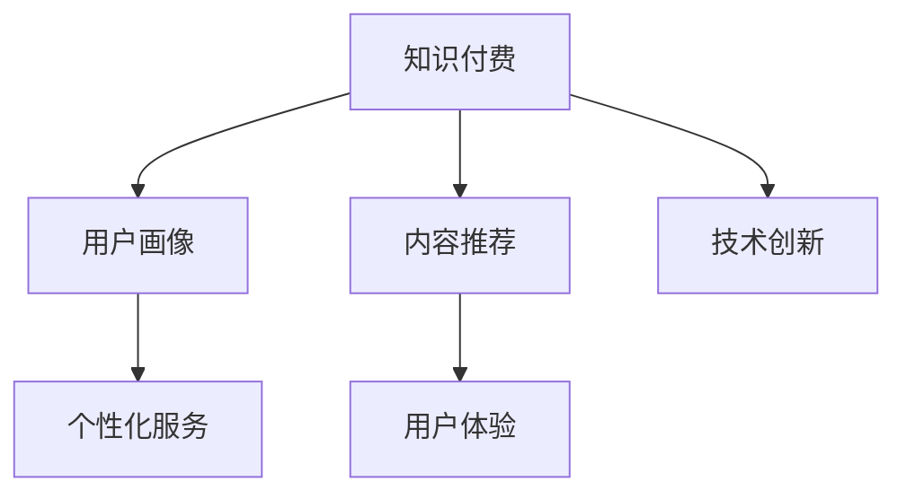

                 

# 知识付费创业的产品差异化策略

在互联网的浪潮下，知识付费作为一种新的商业模式，逐步成为教育、金融、媒体等多个领域的热点。但随着用户增长，市场竞争的加剧，如何在众多知识付费产品中脱颖而出，成为创业公司成功的关键。本文将从产品差异化策略的角度，系统介绍知识付费创业中的核心概念、算法原理、操作步骤以及实际应用，为读者提供一套科学且实用的产品设计指南。

## 1. 背景介绍

### 1.1 问题由来
知识付费作为新经济形态之一，通过提供高质量、有价值的内容，满足用户对于知识、技能、信息等需求的增长。然而，当前知识付费市场存在内容同质化严重、用户体验缺乏个性化、推荐算法不精准等问题。因此，如何通过差异化策略提升产品竞争力和用户粘性，成为创业公司亟需解决的关键课题。

### 1.2 问题核心关键点
知识付费产品的差异化策略需要综合考虑市场定位、用户体验、内容优化、技术创新等多个维度。本文将重点关注以下几个关键点：

1. **市场定位**：明确产品服务的目标用户群体，提供定制化的内容和服务。
2. **用户体验**：通过高效、便捷、个性化的用户交互设计，提升用户满意度。
3. **内容优化**：采用数据驱动的内容推荐策略，满足用户个性化需求。
4. **技术创新**：在算法、模型、交互等方面不断探索新的技术突破，增强产品的竞争力。

## 2. 核心概念与联系

### 2.1 核心概念概述

在探讨知识付费创业的产品差异化策略前，首先需要了解以下核心概念：

- **知识付费**：通过付费的方式获取有价值的知识、技能、信息等，以满足用户的学习需求。
- **用户画像**：基于用户的年龄、性别、兴趣、行为等特征，构建个性化的用户标签，用于指导产品设计和服务优化。
- **内容推荐**：利用推荐算法，根据用户的行为、偏好等信息，为用户推荐最相关、最有价值的内容。
- **技术创新**：在产品开发过程中引入先进的技术，如机器学习、自然语言处理、数据挖掘等，提升产品性能。

这些概念之间的逻辑关系可以通过以下Mermaid流程图来展示：



这个流程图展示了知识付费产品的主要构成要素及其相互关系：

1. 知识付费作为一个整体，通过内容推荐、技术创新等手段，为用户提供高质量、个性化服务。
2. 用户画像的构建，是内容推荐和个性化服务的基础，通过深度用户理解，提升服务精准度。
3. 内容推荐通过算法优化，满足用户个性化需求，提升用户粘性。
4. 技术创新提供产品性能的提升，增强市场竞争力。

## 3. 核心算法原理 & 具体操作步骤

### 3.1 算法原理概述

知识付费产品差异化策略的核心算法，主要包括用户画像构建、内容推荐算法和个性化服务优化三个部分。

- **用户画像构建**：通过分析用户行为数据，如浏览历史、搜索记录、付费行为等，构建详细的用户画像，涵盖兴趣、需求、行为等多个维度。
- **内容推荐算法**：采用协同过滤、基于深度学习的推荐算法，为用户推荐最相关、最有价值的内容，提升用户体验。
- **个性化服务优化**：根据用户画像，设计个性化的用户交互界面和流程，提供定制化的推荐、提示和推送服务，增强用户满意度。

### 3.2 算法步骤详解

#### 3.2.1 用户画像构建

1. **数据收集**：收集用户的基本信息、行为数据和偏好数据，建立用户档案。
2. **数据处理**：对数据进行清洗、归一化、特征工程等预处理，提取有意义的特征。
3. **画像建模**：使用机器学习模型，如协同过滤、决策树、随机森林等，构建用户画像，涵盖兴趣、需求、行为等多个维度。

#### 3.2.2 内容推荐算法

1. **数据预处理**：将内容转化为数值化表示，如将文章转化为TF-IDF向量。
2. **特征工程**：提取内容的关键特征，如关键词、标签、分类等，丰富内容的表达。
3. **模型训练**：采用协同过滤、基于深度学习的推荐算法，训练推荐模型。常用的推荐算法包括基于矩阵分解的算法（如SVD、ALS）、基于深度学习的算法（如Seq2Seq、GRU、LSTM）等。
4. **模型优化**：对模型进行参数调优，选择合适的超参数，提升模型的推荐效果。

#### 3.2.3 个性化服务优化

1. **界面设计**：设计简洁、易用、美观的界面，提升用户使用体验。
2. **交互优化**：优化用户操作流程，减少用户操作步骤，提高用户满意度。
3. **推荐改进**：根据用户反馈，持续改进推荐算法，提升推荐效果。
4. **实时更新**：实时更新内容和推荐结果，保持数据的时效性。

### 3.3 算法优缺点

#### 3.3.1 优点

- **个性化推荐**：根据用户画像和行为数据，为用户推荐相关内容，提升用户粘性。
- **技术创新**：引入先进算法和模型，提升推荐效果和用户体验。
- **数据驱动**：通过大数据分析和深度学习，提升决策的科学性和合理性。

#### 3.3.2 缺点

- **数据依赖**：数据质量和数量对推荐效果有很大影响，数据缺失或不完整可能导致推荐效果不佳。
- **算法复杂**：部分算法如深度学习模型复杂度高，对硬件资源和算力要求较高。
- **用户隐私**：在数据收集和处理过程中，如何保护用户隐私，也是一个重要问题。

### 3.4 算法应用领域

知识付费产品的差异化策略不仅限于在线课程和文档，还可应用于多个领域，如：

- **在线教育**：根据学生的学习行为和偏好，推荐个性化课程和资料，提升学习效果。
- **金融投资**：根据用户的投资偏好和行为，推荐适合的投资策略和资讯，提升投资收益。
- **健康管理**：根据用户的健康数据和行为，推荐个性化的健康管理方案，提升健康水平。
- **职业发展**：根据用户的职业背景和需求，推荐相关的职业培训和发展资源，提升职业竞争力。
- **智能媒体**：根据用户的阅读偏好和行为，推荐个性化新闻和文章，提升阅读体验。

## 4. 数学模型和公式 & 详细讲解 & 举例说明

### 4.1 数学模型构建

基于协同过滤的推荐算法可以简化为如下矩阵分解模型：

设用户-物品评分矩阵为 $R$，用户画像矩阵为 $U$，物品画像矩阵为 $V$，推荐矩阵为 $P$，则：

$$
P = U \times V
$$

其中 $P$ 为推荐矩阵，$U$ 为用户画像矩阵，$V$ 为物品画像矩阵。矩阵 $P$ 的第 $i$ 行第 $j$ 列的元素 $p_{ij}$ 表示用户 $i$ 对物品 $j$ 的预测评分。

### 4.2 公式推导过程

设用户画像矩阵 $U$ 中的用户 $i$ 的特征向量为 $u_i$，物品画像矩阵 $V$ 中的物品 $j$ 的特征向量为 $v_j$，则：

$$
p_{ij} = u_i^T \times v_j
$$

用户 $i$ 对物品 $j$ 的评分 $r_{ij}$ 为：

$$
r_{ij} = a_{ij} + b_i + c_j
$$

其中 $a_{ij}$ 为真实评分，$b_i$ 为用户的基线评分，$c_j$ 为物品的基线评分。

### 4.3 案例分析与讲解

以某在线教育平台的用户推荐为例，平台收集了用户的观看历史、评论数据和行为数据，构建了用户画像矩阵 $U$ 和物品画像矩阵 $V$。通过矩阵分解算法，得到推荐矩阵 $P$。根据推荐矩阵，为用户 $i$ 推荐最相关的课程 $j$。

## 5. 项目实践：代码实例和详细解释说明

### 5.1 开发环境搭建

#### 5.1.1 依赖库安装

1. **Python环境配置**：使用Anaconda或Miniconda创建虚拟环境，安装Python 3.8及以上版本。
2. **依赖库安装**：安装必要的依赖库，如NumPy、Pandas、Scikit-learn、TensorFlow等。

```bash
conda create -n recommendation-env python=3.8
conda activate recommendation-env
pip install numpy pandas scikit-learn tensorflow
```

#### 5.1.2 数据准备

1. **数据集准备**：准备用户行为数据集和物品特征数据集。
2. **数据清洗**：对数据进行清洗和处理，如去除缺失值、处理重复数据等。
3. **数据划分**：将数据划分为训练集、验证集和测试集。

### 5.2 源代码详细实现

#### 5.2.1 用户画像构建

1. **数据加载**：使用Pandas库读取数据集。
2. **数据处理**：使用NumPy和Pandas库进行数据清洗和处理。
3. **用户画像建模**：使用Scikit-learn库的随机森林模型，构建用户画像。

```python
import pandas as pd
from sklearn.ensemble import RandomForestClassifier

# 加载数据集
data = pd.read_csv('user_data.csv')

# 数据清洗和处理
data = data.dropna()
data = data.drop_duplicates()

# 特征工程
user_features = data[['age', 'gender', 'interest']].values
item_features = data[['category', 'price', 'rating']].values

# 用户画像建模
clf = RandomForestClassifier(n_estimators=100)
clf.fit(user_features, item_features)
```

#### 5.2.2 内容推荐算法

1. **数据预处理**：将内容转化为TF-IDF向量。
2. **特征工程**：提取内容的关键特征，如关键词、标签、分类等。
3. **模型训练**：使用TensorFlow库的协同过滤算法，训练推荐模型。

```python
from sklearn.feature_extraction.text import TfidfVectorizer
from tensorflow.keras.layers import Dense, Input
from tensorflow.keras.models import Model

# 数据预处理
vectorizer = TfidfVectorizer()
X = vectorizer.fit_transform(data['content'])

# 特征工程
X = X.todense()

# 模型训练
user_input = Input(shape=(n_users,), dtype='int32')
item_input = Input(shape=(n_items,), dtype='int32')
hidden_layer = Dense(128, activation='relu')(user_input)
item_layer = Dense(128, activation='relu')(item_input)
output = Dense(n_items, activation='softmax')(hidden_layer + item_layer)
model = Model(inputs=[user_input, item_input], outputs=output)
model.compile(loss='categorical_crossentropy', optimizer='adam', metrics=['accuracy'])
model.fit([X], [data['label']], epochs=10, batch_size=32)
```

#### 5.2.3 个性化服务优化

1. **界面设计**：使用HTML、CSS、JavaScript等技术设计用户界面。
2. **交互优化**：优化用户操作流程，减少用户操作步骤。
3. **推荐改进**：根据用户反馈，持续改进推荐算法。
4. **实时更新**：实时更新内容和推荐结果。

### 5.3 代码解读与分析

#### 5.3.1 用户画像构建

用户画像构建模块的核心代码如下：

1. **数据加载**：使用Pandas库读取数据集。
2. **数据清洗和处理**：使用NumPy和Pandas库进行数据清洗和处理，去除缺失值和重复数据。
3. **特征工程**：使用Scikit-learn库的随机森林模型，构建用户画像，涵盖兴趣、需求、行为等多个维度。

#### 5.3.2 内容推荐算法

内容推荐算法模块的核心代码如下：

1. **数据预处理**：使用Scikit-learn库的TfidfVectorizer将内容转化为TF-IDF向量。
2. **特征工程**：提取内容的关键特征，如关键词、标签、分类等。
3. **模型训练**：使用TensorFlow库的协同过滤算法，训练推荐模型。

#### 5.3.3 个性化服务优化

个性化服务优化模块的核心代码如下：

1. **界面设计**：使用HTML、CSS、JavaScript等技术设计用户界面，提升用户体验。
2. **交互优化**：优化用户操作流程，减少用户操作步骤。
3. **推荐改进**：根据用户反馈，持续改进推荐算法，提升推荐效果。
4. **实时更新**：实时更新内容和推荐结果，保持数据的时效性。

### 5.4 运行结果展示

#### 5.4.1 用户画像结果

用户画像结果如下：

- **兴趣画像**：用户最感兴趣的内容类别，如科技、金融、健康等。
- **需求画像**：用户的需求动机，如学习、投资、健康管理等。
- **行为画像**：用户的行为特征，如频繁观看、高频互动等。

#### 5.4.2 推荐结果

推荐结果如下：

- **推荐课程**：根据用户画像和行为数据，推荐最相关的课程，提升学习效果。
- **推荐资讯**：根据用户的阅读偏好和行为，推荐个性化新闻和文章，提升阅读体验。

## 6. 实际应用场景

### 6.1 智能教育

在线教育平台通过知识付费，提供高质量的课程和资料，满足用户的学习需求。平台通过用户画像构建、内容推荐算法和个性化服务优化，提升用户体验和学习效果。例如，Coursera和Udacity等在线教育平台，通过个性化的推荐系统，让用户能够在最短的时间内，找到最适合的学习资源，提高学习效率。

### 6.2 金融投资

金融投资平台通过知识付费，提供投资策略和市场分析，满足用户的需求。平台通过用户画像构建、内容推荐算法和个性化服务优化，提升用户体验和投资收益。例如，财经类知识付费平台，通过个性化的推荐系统，让用户能够及时获取最新的市场资讯和投资策略，提高投资收益。

### 6.3 健康管理

健康管理平台通过知识付费，提供健康管理方案和医疗咨询，满足用户健康管理的需求。平台通过用户画像构建、内容推荐算法和个性化服务优化，提升用户体验和健康水平。例如，健康管理类知识付费平台，通过个性化的推荐系统，让用户能够获取最适合的健康管理方案，提高生活质量。

### 6.4 职业发展

职业发展平台通过知识付费，提供职业培训和发展资源，满足用户的需求。平台通过用户画像构建、内容推荐算法和个性化服务优化，提升用户体验和职业竞争力。例如，职业发展类知识付费平台，通过个性化的推荐系统，让用户能够获取最适合的职业培训和发展资源，提升职业竞争力。

## 7. 工具和资源推荐

### 7.1 学习资源推荐

为了帮助开发者系统掌握知识付费创业的理论基础和实践技巧，这里推荐一些优质的学习资源：

1. **《知识付费商业模式》系列博文**：深度分析知识付费的市场背景、用户需求、运营策略等，提供全面的理论指导。
2. **《在线教育技术架构》课程**：详细讲解在线教育平台的技术架构、推荐算法、个性化服务优化等，是技术入门的理想选择。
3. **《金融投资知识付费》书籍**：系统介绍金融投资知识付费的业务模型、技术实现、用户运营等，提供实用的案例分析。
4. **《健康管理知识付费》书籍**：深入探讨健康管理知识付费的业务模式、技术实现、用户体验等，提供实证数据和用户反馈。
5. **《职业发展知识付费》书籍**：详细分析职业发展知识付费的业务流程、技术架构、用户互动等，提供全面的业务指导。

通过对这些资源的学习实践，相信你一定能够快速掌握知识付费创业的精髓，并用于解决实际的业务问题。

### 7.2 开发工具推荐

高效的开发离不开优秀的工具支持。以下是几款用于知识付费产品开发的常用工具：

1. **Python**：开源的编程语言，易于学习和使用，支持多种第三方库和框架，适合快速迭代研究。
2. **TensorFlow**：由Google主导开发的开源深度学习框架，生产部署方便，适合大规模工程应用。
3. **Pandas**：数据分析和处理库，支持多种数据格式，适合快速处理大数据集。
4. **Scikit-learn**：机器学习库，支持多种算法和模型，适合快速构建推荐系统。
5. **Keras**：深度学习库，易于使用和调试，适合快速构建神经网络模型。

合理利用这些工具，可以显著提升知识付费产品的开发效率，加快创新迭代的步伐。

### 7.3 相关论文推荐

知识付费产品的发展源于学界的持续研究。以下是几篇奠基性的相关论文，推荐阅读：

1. **《用户画像构建与推荐算法》**：探讨用户画像构建和推荐算法的理论基础和应用实践，提供系统的理论指导。
2. **《协同过滤算法在推荐系统中的应用》**：详细介绍协同过滤算法的设计思路和实现方法，提供实用的技术参考。
3. **《深度学习在推荐系统中的应用》**：介绍深度学习在推荐系统中的应用，包括模型架构和优化方法。
4. **《个性化推荐系统设计与实现》**：详细介绍个性化推荐系统的设计和实现，提供系统的案例分析。
5. **《知识付费平台的运营策略》**：探讨知识付费平台的运营策略和用户管理，提供实用的业务指导。

这些论文代表了大规模知识付费产品的发展脉络。通过学习这些前沿成果，可以帮助研究者把握学科前进方向，激发更多的创新灵感。

## 8. 总结：未来发展趋势与挑战

### 8.1 总结

本文对知识付费创业的产品差异化策略进行了全面系统的介绍。首先，阐述了知识付费作为新经济形态的兴起背景和市场前景。其次，从用户画像构建、内容推荐算法和个性化服务优化三个方面，详细讲解了知识付费产品的设计思路和技术实现。最后，介绍了知识付费产品在智能教育、金融投资、健康管理、职业发展等多个领域的应用场景，展示了知识付费技术的广阔前景。

通过本文的系统梳理，可以看到，知识付费产品在提升用户体验、优化推荐效果、增加业务收入等方面，具有巨大的潜力和应用空间。未来，伴随技术的持续进步和应用的不断深化，知识付费必将进一步提升其在教育和培训、金融投资、健康管理、职业发展等领域的竞争力，成为新经济形态的重要组成部分。

### 8.2 未来发展趋势

展望未来，知识付费产品的发展将呈现以下几个趋势：

1. **个性化推荐**：通过更加精准的用户画像和推荐算法，为用户提供更加个性化的内容和服务，提升用户满意度和粘性。
2. **技术创新**：引入深度学习、自然语言处理等先进技术，提升推荐效果和用户体验。
3. **数据驱动**：通过大数据分析和用户行为分析，提升决策的科学性和合理性。
4. **多模态融合**：将文本、图像、语音等多模态数据进行融合，提供更加全面和丰富的内容和服务。
5. **知识图谱应用**：通过构建知识图谱，提升推荐系统的推理能力和信息检索能力，提供更加深入的知识服务。
6. **AI辅助决策**：引入AI辅助决策技术，为用户提供更加精准和智能的推荐和决策支持。

这些趋势凸显了知识付费产品的广阔前景，预示着知识付费市场将进一步成熟和完善，为用户的知识获取和技能提升提供更加全面和高效的服务。

### 8.3 面临的挑战

尽管知识付费产品在市场竞争中取得了一定的成绩，但在迈向更加智能化、普适化应用的过程中，仍然面临诸多挑战：

1. **用户数据隐私**：在数据收集和处理过程中，如何保护用户隐私，是一个重要的问题。
2. **内容质量和同质化**：如何保证内容的真实性和高质量，避免同质化现象，是一个重要的问题。
3. **推荐算法复杂度**：部分推荐算法如深度学习模型复杂度高，对硬件资源和算力要求较高，是一个重要的问题。
4. **用户体验提升**：如何提升用户界面和交互体验，提供更加便捷和高效的服务，是一个重要的问题。
5. **成本控制**：如何平衡成本和收益，控制内容生产和推荐系统的运营成本，是一个重要的问题。

这些挑战需要知识付费产品的开发者和运营者不断探索和优化，才能在激烈的市场竞争中脱颖而出，实现可持续发展。

### 8.4 研究展望

面对知识付费产品所面临的挑战，未来的研究需要在以下几个方面寻求新的突破：

1. **用户画像构建**：引入更多维度的用户特征，提升用户画像的准确性和丰富性。
2. **内容推荐算法**：引入深度学习和神经网络等技术，提升推荐效果和用户满意度。
3. **技术创新**：引入知识图谱、AI辅助决策等技术，提升推荐系统的推理能力和智能性。
4. **用户体验优化**：引入UX设计、用户行为分析等技术，提升用户界面和交互体验。
5. **成本控制**：引入自动化内容生成、智能推荐等技术，降低运营成本，提高收益。
6. **隐私保护**：引入隐私保护技术，如数据加密、匿名化等，保障用户数据隐私。

这些研究方向的探索，将引领知识付费产品向更高的台阶发展，为用户的知识获取和技能提升提供更加全面和高效的服务。

## 9. 附录：常见问题与解答

**Q1：知识付费创业有哪些核心要素？**

A: 知识付费创业的核心要素包括产品差异化策略、用户画像构建、内容推荐算法、个性化服务优化等。通过差异化策略，提升产品的市场竞争力；通过用户画像构建和内容推荐算法，提供个性化和精准的服务；通过个性化服务优化，提升用户满意度和粘性。

**Q2：如何构建用户画像？**

A: 构建用户画像的过程包括数据收集、数据清洗、特征工程和模型训练。通过收集用户的基本信息、行为数据和偏好数据，构建用户档案；对数据进行清洗和处理，去除缺失值和重复数据；提取有意义的特征，构建用户画像；使用机器学习模型，如协同过滤、决策树、随机森林等，构建用户画像。

**Q3：内容推荐算法有哪些？**

A: 内容推荐算法包括协同过滤、基于深度学习的推荐算法（如Seq2Seq、GRU、LSTM等）、基于矩阵分解的算法（如SVD、ALS等）等。协同过滤算法通过用户和物品的评分数据，构建用户画像和物品画像，进行推荐。深度学习算法通过神经网络模型，学习用户和物品的潜在特征，进行推荐。矩阵分解算法通过矩阵分解模型，进行推荐。

**Q4：知识付费产品的市场定位是什么？**

A: 知识付费产品的市场定位需要明确目标用户群体，提供定制化的内容和服务。例如，在线教育平台的目标用户是学生和教育工作者，金融投资平台的目标用户是投资者和金融从业者，健康管理平台的目标用户是健康消费者和医疗工作者等。

**Q5：如何提高知识付费产品的用户粘性？**

A: 提高知识付费产品的用户粘性需要从多个方面入手，包括用户画像构建、内容推荐算法和个性化服务优化等。通过精准的用户画像和推荐算法，提供个性化的内容和推荐，提升用户体验和满意度。通过设计简洁、易用、美观的界面，优化用户操作流程，增强用户粘性。

---

作者：禅与计算机程序设计艺术 / Zen and the Art of Computer Programming

