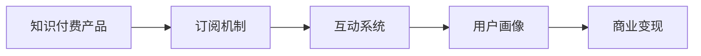

                 

## 1. 背景介绍

### 1.1 问题由来

近年来，知识付费市场正迎来爆发式增长，平台如喜马拉雅、得到、字节跳动旗下的猿辅导等，纷纷入局。然而，在行业迅猛发展的同时，也暴露出许多问题：内容同质化严重、订阅率低、难以持续变现、用户体验不佳等。如何打造有差异化、高质量、用户粘性强的产品矩阵，成为知识付费创业的关键问题。

### 1.2 问题核心关键点

核心在于如何构建一个多元化、高粘性的知识付费产品矩阵，提升用户订阅和留存率，实现可持续变现。

核心要点包括：
- 多元化：产品矩阵需涵盖不同类型内容，满足不同用户需求，避免单一产品风险。
- 高粘性：通过优质内容和丰富互动，增强用户黏性，提升用户参与度。
- 可变现：建立商业闭环，实现规模化、持续化的商业变现，保障平台收入。

## 2. 核心概念与联系

### 2.1 核心概念概述

为更好地理解知识付费产品矩阵构建策略，本节将介绍几个核心概念：

- **知识付费产品**：涵盖各类形式的知识产品，如文章、音频、视频、互动直播、社群、定制服务、专业咨询等。
- **订阅机制**：通过定期收费订阅，持续吸引用户付费，保障收入持续稳定。
- **互动系统**：如社区交流、学习小组、直播互动、内容评论、问答反馈等，提升用户粘性。
- **用户画像**：通过数据分析，定义用户人群，匹配个性化内容，提升用户体验。
- **商业变现**：通过广告、付费阅读、付费下载、付费社群、周边产品等形式，实现收入变现。

这些核心概念之间通过合理的搭配和整合，可以构建一个完善的、高粘性的知识付费产品矩阵，为知识付费创业提供有力的支撑。

### 2.2 核心概念原理和架构的 Mermaid 流程图



## 3. 核心算法原理 & 具体操作步骤

### 3.1 算法原理概述

知识付费产品矩阵构建策略，本质上是一种多维度的价值创造过程。其核心思想是通过产品多元化和用户交互，不断挖掘并满足用户需求，形成稳定的商业变现闭环。

产品矩阵的构建需基于以下三个原则：

1. **用户需求满足**：通过多元化的产品形态，覆盖不同用户需求，避免单一产品风险。
2. **用户粘性增强**：通过高质量内容、丰富的互动形式，提升用户参与度和停留时间，增强用户粘性。
3. **商业变现优化**：通过多层次、多渠道的变现方式，确保平台的商业可持续性。

### 3.2 算法步骤详解

基于以上原理，知识付费产品矩阵的构建流程主要包括：

**Step 1: 用户需求分析**
- 通过调研问卷、用户访谈等方式，收集用户的基本需求和偏好。
- 分析用户画像，识别主要用户群体及其需求特征。
- 根据不同用户群体的需求特征，设计差异化的产品内容。

**Step 2: 产品形态设计**
- 设计多样化的产品形态，涵盖文章、音频、视频、直播、社群、定制服务等多种形式。
- 针对不同产品类型，设计合理的价格策略和订阅机制。
- 引入互动系统，如社区交流、学习小组、直播互动、内容评论、问答反馈等，提升用户体验。

**Step 3: 内容产出与优化**
- 引进优质内容生产者，提供高质量的原创内容。
- 建立内容审核机制，确保内容的质量和合规性。
- 采用数据分析工具，实时监控内容表现，优化内容产出策略。

**Step 4: 商业变现策略**
- 结合平台特点，选择合理的商业变现方式，如广告、付费阅读、付费下载、付费社群、周边产品等。
- 设计精准的营销活动，吸引用户订阅和付费。
- 通过用户反馈和数据分析，不断优化商业变现策略，提升用户满意度和平台收益。

**Step 5: 用户反馈与改进**
- 建立用户反馈机制，收集用户意见和建议。
- 定期更新产品内容和功能，满足用户新的需求和期望。
- 持续优化用户体验，提升用户满意度和留存率。

### 3.3 算法优缺点

**优点**：
1. 提高用户粘性：通过丰富多样的产品形态和高质量的内容，提升用户参与度和留存率。
2. 稳定变现：通过多种商业变现渠道，确保平台收入的持续稳定。
3. 降低风险：通过多产品矩阵，分散单一产品风险。

**缺点**：
1. 初期成本高：需要投入大量资源进行内容生产和市场推广。
2. 运营复杂：产品矩阵管理需要高效的信息处理和数据分析能力。
3. 用户需求多样：需不断调整产品策略以应对用户需求变化。

## 4. 数学模型和公式 & 详细讲解 & 举例说明

### 4.1 数学模型构建

假设平台上有$N$类知识产品，第$i$类产品用户数为$U_i$，平均订阅周期为$P_i$，单价为$C_i$。设平台总用户数为$U$，则平台总收益$R$可以表示为：

$$
R = \sum_{i=1}^N P_i \times U_i \times C_i
$$

其中，$P_i$为第$i$类产品的用户续费率。

### 4.2 公式推导过程

假设第$i$类产品用户的续费率为$p_i$，则第$i$类产品的总订阅收入为$P_i \times U_i \times C_i$。因此，平台总收益$R$可以表示为：

$$
R = \sum_{i=1}^N p_i \times U_i \times C_i
$$

### 4.3 案例分析与讲解

以得到平台为例，其知识付费产品矩阵包含以下几种主要产品：

1. **得到高阶会员**：提供优质文章、听书、视频等多种内容形式，收费标准为49元/月。
2. **硬核能力卡**：提供特定领域深度学习课程，收费标准为199元/月。
3. **得到plus**：提供音频、文章、视频等内容的付费下载和听书功能，收费标准为9元/月。

通过多元化的产品设计，满足不同用户需求，提高用户粘性。例如，得到平台通过定期推送优质内容，并通过社区互动、直播答疑等形式提升用户参与度，形成稳定的用户基础。

## 5. 项目实践：代码实例和详细解释说明

### 5.1 开发环境搭建

在进行产品矩阵构建实践前，我们需要准备好开发环境。以下是使用Python进行Flask开发的环境配置流程：

1. 安装Anaconda：从官网下载并安装Anaconda，用于创建独立的Python环境。

2. 创建并激活虚拟环境：
```bash
conda create -n flask-env python=3.8 
conda activate flask-env
```

3. 安装Flask：
```bash
pip install flask
```

4. 安装相关库：
```bash
pip install flask_sqlalchemy flask_login flask_ckeditor
```

完成上述步骤后，即可在`flask-env`环境中开始产品矩阵构建的实践。

### 5.2 源代码详细实现

下面以用户画像分析功能为例，给出使用Flask框架进行知识付费产品矩阵构建的代码实现。

```python
from flask import Flask, request, jsonify
from flask_sqlalchemy import SQLAlchemy
from flask_login import LoginManager, UserMixin, login_required, current_user

app = Flask(__name__)
app.config['SQLALCHEMY_DATABASE_URI'] = 'sqlite:////mnt/data/users.db'
app.config['SECRET_KEY'] = 'secret_key'
app.config['CKEDITOR_SERVER_URL'] = 'http://127.0.0.1:8000/'

db = SQLAlchemy(app)
login_manager = LoginManager(app)

class User(UserMixin, db.Model):
    id = db.Column(db.Integer, primary_key=True)
    username = db.Column(db.String(100), unique=True)
    password_hash = db.Column(db.String(100))

@login_manager.user_loader
def load_user(user_id):
    return User.query.get(int(user_id))

@app.route('/login', methods=['POST'])
def login():
    data = request.json
    user = User.query.filter_by(username=data['username']).first()
    if not user or not check_password_hash(user.password_hash, data['password']):
        return jsonify({'message': 'Invalid credentials'}), 401
    login_manager.login_user(user)
    return jsonify({'message': 'Login successful'}), 200

@app.route('/logout')
@login_required
def logout():
    login_manager.logout_user()
    return jsonify({'message': 'Logout successful'}), 200

@app.route('/profile')
@login_required
def profile():
    user = current_user
    return jsonify({'user': {
        'id': user.id,
        'username': user.username,
        'email': user.email
    }})

@app.route('/users')
@login_required
def get_users():
    users = User.query.all()
    user_list = [{'id': user.id, 'username': user.username, 'email': user.email} for user in users]
    return jsonify({'users': user_list}), 200

@app.route('/user/<user_id>')
@login_required
def get_user(user_id):
    user = User.query.get(int(user_id))
    if not user:
        return jsonify({'message': 'User not found'}), 404
    return jsonify({'user': {
        'id': user.id,
        'username': user.username,
        'email': user.email
    }}), 200

if __name__ == '__main__':
    app.run(debug=True)
```

在上述代码中，我们通过Flask框架构建了一个简单的用户管理系统。用户信息通过SQLAlchemy进行存储，并提供基本的登录、登出、获取用户信息等功能。

### 5.3 代码解读与分析

让我们再详细解读一下关键代码的实现细节：

**Flask应用初始化**：
- 通过`Flask`类创建应用对象`app`，并设置数据库连接地址和Secret Key。
- 安装必要的扩展库`SQLAlchemy`和`Flask_Login`。

**用户模型**：
- 定义`User`类，继承`UserMixin`和`db.Model`，用于表示用户。
- 实现`UserMixin`的`id`、`username`、`password_hash`属性，并关联到数据库表。
- 通过`login_manager.user_loader`实现用户登录验证，并在用户成功登录后自动登录。

**路由函数**：
- `/login`路由处理用户登录，通过`check_password_hash`验证密码，登录成功后使用`login_manager.login_user`自动登录用户。
- `/logout`路由处理用户登出，使用`login_manager.logout_user`注销用户。
- `/profile`路由获取当前用户信息，使用`current_user`获取当前登录用户。
- `/users`路由获取所有用户信息，通过`User.query.all()`查询数据库。
- `/user/<user_id>`路由获取指定用户信息，通过`User.query.get()`查询指定用户。

**运行结果展示**：
- 启动应用后，可以通过访问`/login`路由进行用户登录，并获取`/profile`路由返回的当前用户信息。
- 访问`/users`路由和`/user/<user_id>`路由，获取所有用户和指定用户信息。

可以看到，Flask框架通过简洁的路由定义和模板机制，提供了快速构建Web应用的能力。开发者可以灵活扩展应用功能，如用户管理、内容发布、互动交流等，以满足知识付费产品矩阵的需求。

## 6. 实际应用场景

### 6.1 智能客服系统

知识付费平台通过智能客服系统，可以提供7x24小时的用户支持，提升用户满意度。系统可以通过自然语言处理技术，理解用户咨询，提供专业解答，并自动推荐相关课程。

### 6.2 内容推荐系统

通过用户画像和行为数据分析，平台可以构建个性化推荐引擎，向用户推荐最符合其兴趣和需求的内容，提高用户粘性和订阅率。

### 6.3 互动学习社区

通过社区功能，用户可以参与内容讨论、互动交流，分享学习心得，构建知识共同体。平台通过定期举办线上活动、专家答疑等方式，增强社区活跃度，提升用户参与感。

### 6.4 未来应用展望

随着人工智能和大数据技术的发展，知识付费产品矩阵将不断升级，实现更加智能化的内容推荐和用户交互。未来，平台可以通过更深入的机器学习模型，如推荐系统、情感分析、自然语言生成等，提升内容推荐和用户服务的智能化水平。

## 7. 工具和资源推荐

### 7.1 学习资源推荐

为了帮助开发者系统掌握知识付费产品矩阵构建的理论基础和实践技巧，这里推荐一些优质的学习资源：

1. 《知识付费创业指南》系列博文：由知识付费领域的资深专家撰写，详细讲解了知识付费产品矩阵的构建方法、运营策略等，为知识付费创业提供全面指导。

2. 《知识付费用户心理研究》课程：由著名心理学专家讲授，探讨了用户行为心理、付费意愿、平台满意度等关键因素，帮助开发者深入理解用户需求。

3. 《知识付费商业模式创新》书籍：深入剖析知识付费领域的商业模式，提出创新的变现策略和运营模式，为知识付费创业提供思路。

4. 《知识付费平台技术架构设计》课程：由资深技术架构师讲授，详细讲解了知识付费平台的技术架构设计，涵盖数据库、缓存、CDN、负载均衡等多个方面。

5. 《知识付费产品矩阵管理》书籍：全面介绍了知识付费产品矩阵的构建方法、管理策略等，为知识付费创业提供系统性的理论支持。

通过对这些资源的学习实践，相信你一定能够快速掌握知识付费产品矩阵构建的精髓，并用于解决实际的运营问题。

### 7.2 开发工具推荐

高效的开发离不开优秀的工具支持。以下是几款用于知识付费产品矩阵构建开发的常用工具：

1. Flask：轻量级的Web框架，适用于快速搭建Web应用，提供简洁的路由和模板机制。

2. SQLAlchemy：Python的ORM框架，支持SQL数据库的操作，提供便捷的数据库访问和查询。

3. Flask_Login：基于Flask的认证扩展，提供用户登录、注销、会话管理等功能。

4. CKEditor：强大的富文本编辑器，支持富文本格式、图片上传、嵌入式代码等功能，提升用户体验。

5. GitLab：开源代码管理平台，提供代码托管、CI/CD、DevOps等功能，支持团队协作开发。

6. Docker：容器化技术，提供轻量级、可移植的应用部署方案，支持快速搭建开发环境。

合理利用这些工具，可以显著提升知识付费产品矩阵构建的开发效率，加快创新迭代的步伐。

### 7.3 相关论文推荐

知识付费产品矩阵构建涉及多个领域的知识，以下是几篇前沿的相关论文，推荐阅读：

1. "A Survey on Knowledge Management in Higher Education"：探讨知识管理的理论、方法和应用，为知识付费产品矩阵提供理论基础。

2. "Towards a Knowledge Sharing and Collaboration Framework for e-Learning"：提出基于知识共享和协作的学习框架，为知识付费平台的社群建设提供思路。

3. "An Empirical Study on User Participation in Online Communities"：研究用户参与在线社区的因素，为知识付费平台的内容推荐和互动功能优化提供数据支持。

4. "Designing an E-Learning Management System Based on a Knowledge-Based Approach"：介绍基于知识工程的学习管理系统设计，为知识付费平台的用户画像和个性化推荐提供技术参考。

5. "A Case Study on the Impact of Social Media on Knowledge Sharing and Collaboration"：分析社交媒体对知识共享和协作的影响，为知识付费平台的社区建设提供实际案例。

这些论文代表了大数据和人工智能在知识付费领域的最新研究方向，通过学习这些前沿成果，可以帮助开发者深入理解知识付费产品矩阵构建的理论和方法，加速知识付费创业的实践。

## 8. 总结：未来发展趋势与挑战

### 8.1 总结

本文对知识付费产品矩阵构建方法进行了全面系统的介绍。首先阐述了知识付费产品的核心价值和构建策略，明确了产品矩阵的多元化、高粘性和可变现三原则。其次，从原理到实践，详细讲解了知识付费产品矩阵构建的理论基础和具体操作步骤。最后，讨论了知识付费产品矩阵在智能客服、内容推荐、互动社区等场景中的应用前景，并推荐了相关的学习资源、开发工具和前沿论文。

通过本文的系统梳理，可以看到，知识付费产品矩阵构建方法正在成为知识付费创业的重要手段，极大提升了平台的运营效率和用户满意度。未来，伴随人工智能和大数据技术的发展，知识付费产品矩阵将不断升级，实现更加智能化的内容推荐和用户服务。

### 8.2 未来发展趋势

展望未来，知识付费产品矩阵构建将呈现以下几个发展趋势：

1. 产品形态多元化：随着内容形式的不断丰富，知识付费产品矩阵将包含更多元化的内容形态，如视频、直播、社群、课程等，满足不同用户需求。

2. 内容推荐智能化：通过深度学习和大数据技术，平台将能够实现更加精准的用户画像和内容推荐，提升用户粘性和订阅率。

3. 互动系统多样化：平台将引入更多互动形式，如直播答疑、社区讨论、学习小组等，增强用户参与感和满意度。

4. 商业变现多样化：除了订阅制，知识付费平台还将探索更多变现方式，如内容付费、社群付费、周边产品等，实现多元化的收入来源。

5. 个性化服务深化：通过更深入的用户行为分析和机器学习，平台将提供更加个性化的内容推荐和互动服务，提升用户体验。

以上趋势凸显了知识付费产品矩阵构建技术的广阔前景，这些方向的探索发展，必将进一步提升知识付费产品的价值和用户满意度。

### 8.3 面临的挑战

尽管知识付费产品矩阵构建技术已经取得了显著成就，但在迈向更加智能化、普适化应用的过程中，仍面临诸多挑战：

1. 产品同质化风险：随着市场竞争加剧，各平台产品同质化风险增加，难以突出自身独特优势。

2. 用户需求多样性：用户需求不断变化，平台需要不断调整产品策略，以应对不同用户的需求。

3. 运营成本高：产品矩阵构建需要大量资源投入，平台需平衡内容质量和运营成本。

4. 内容管理复杂：随着内容形态多样化，平台需建立高效的内容管理系统，确保内容质量和安全。

5. 用户粘性维护：如何通过优质内容和互动形式，长期维护用户粘性，是知识付费平台面临的长期挑战。

6. 商业变现难度：如何实现商业变现的多样化和持续化，提升平台收入，是知识付费平台的重要课题。

7. 数据隐私问题：用户数据隐私和安全问题需引起重视，平台需建立严格的数据管理机制。

这些挑战需要在未来研究和实践中不断突破，才能使知识付费产品矩阵构建技术真正落地，发挥其应有的价值。

### 8.4 研究展望

面对知识付费产品矩阵构建所面临的诸多挑战，未来的研究需要在以下几个方面寻求新的突破：

1. 数据驱动的产品设计：通过数据分析和机器学习，深入挖掘用户需求和行为特征，设计更加符合用户期望的产品形态。

2. 内容质量保障机制：建立完善的内容审核和管理机制，确保内容的质量和合规性，提升用户信任度。

3. 智能推荐系统优化：通过引入先进的推荐算法和模型，优化内容推荐系统，提升用户满意度。

4. 用户互动形式创新：通过引入更多元化的互动形式，增强用户参与感和忠诚度，提升用户粘性。

5. 多渠道变现策略：结合平台特点，探索更多元化的变现策略，实现商业变现的多样化和持续化。

6. 数据隐私保护机制：建立完善的数据隐私保护机制，确保用户数据安全和隐私权益。

7. 实时反馈和迭代优化：建立用户反馈机制，通过实时数据分析和用户反馈，持续优化产品和服务，提升用户体验。

这些研究方向将引领知识付费产品矩阵构建技术迈向新的高度，为知识付费创业提供更强大的技术支持。

## 9. 附录：常见问题与解答

**Q1: 知识付费产品矩阵构建是否适用于所有类型的知识付费平台？**

A: 知识付费产品矩阵构建策略适用于各类知识付费平台，包括在线课程、内容订阅、社区互动、智能客服等。其核心在于通过多元化的产品形态，满足不同用户需求，提升用户粘性和留存率。但不同类型平台需根据自身特点，选择合适的产品形态和商业变现方式。

**Q2: 如何构建高质量的知识付费产品矩阵？**

A: 构建高质量的知识付费产品矩阵需从用户需求、内容质量、商业变现等多方面着手：
1. 进行充分的用户调研，深入了解用户需求和期望。
2. 引进优质内容生产者，提供高质量的原创内容。
3. 建立内容审核机制，确保内容的质量和合规性。
4. 设计合理的商业变现策略，实现多渠道、多层次的变现。
5. 不断优化用户体验，提升用户满意度和留存率。

**Q3: 知识付费产品矩阵的运营成本如何控制？**

A: 控制知识付费产品矩阵的运营成本需从多个方面入手：
1. 建立高效的内容管理系统，提高内容生产效率。
2. 采用数据驱动的产品设计，减少资源浪费。
3. 引入多种商业变现方式，实现多元化收入来源。
4. 通过社区互动、用户反馈等形式，提升用户粘性，减少流失率。

**Q4: 如何提升知识付费产品的用户粘性？**

A: 提升知识付费产品的用户粘性需从以下几个方面着手：
1. 提供高质量的内容，满足用户学习需求。
2. 引入丰富的互动形式，增强用户参与感。
3. 建立社群交流机制，构建知识共同体。
4. 定期举办线上活动，增强用户参与度。
5. 提供个性化推荐服务，提升用户体验。

**Q5: 知识付费产品矩阵的商业变现方式有哪些？**

A: 知识付费产品矩阵的商业变现方式包括：
1. 订阅制：通过定期收费订阅，保障平台持续收入。
2. 内容付费：提供付费文章、视频等优质内容，实现精准变现。
3. 付费下载：提供付费下载功能，增加收入渠道。
4. 付费社群：通过社群付费，提供专家答疑、专属内容等增值服务。
5. 周边产品：开发和销售与课程相关的周边产品，如笔记本、书籍等，实现跨界变现。

这些变现方式需根据平台特点和用户需求，灵活组合和优化，确保平台的商业可持续性。

---

作者：禅与计算机程序设计艺术 / Zen and the Art of Computer Programming

