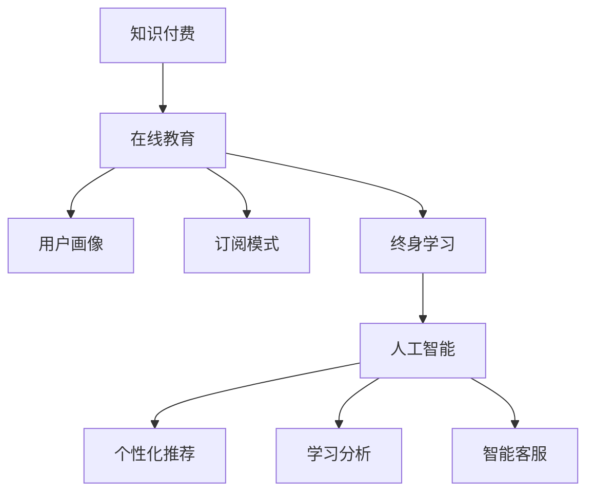

                 

# 知识付费创业的商业模式创新

> 关键词：知识付费, 商业模式创新, 在线教育, 内容付费, 用户画像, 订阅模式, 终身学习, 人工智能

## 1. 背景介绍

### 1.1 问题由来

随着互联网技术的快速发展，信息获取和知识传播的方式发生了翻天覆地的变化。传统的基于书本、报纸、电视等媒体的知识获取方式已经逐渐被在线教育平台所取代。在线教育平台凭借其便捷性、多样性、交互性等优势，成为人们获取知识的重要途径。

然而，尽管在线教育市场不断壮大，但仍存在诸多挑战。一方面，由于免费内容的泛滥，知识付费市场的付费意愿相对较低；另一方面，在线教育平台往往以单次付费或简单的一次性购买为主要盈利模式，缺乏持续性，难以形成稳定的用户粘性和收入来源。

本文将从商业模式的角度，探讨如何通过创新，实现知识付费创业的可持续发展。

## 2. 核心概念与联系

### 2.1 核心概念概述

为了更好地理解知识付费创业的商业模式创新，本节将介绍几个密切相关的核心概念：

- **知识付费**：基于在线教育平台的付费内容服务，通过提供高质量的课程、文章、音频、视频等形式的知识产品，满足用户的学习需求，从而实现商业变现。
- **商业模式**：企业通过什么方式创造价值并传递给用户，以及通过什么方式获取回报。商业模式设计影响企业的运营效率和盈利能力。
- **在线教育**：利用互联网技术进行的学习方式，包括视频课程、在线直播、互动练习等多种形式，是知识付费创业的主要应用场景。
- **用户画像**：基于用户的行为、偏好、属性等数据，构建用户特征模型，用于精准营销和个性化推荐，提升用户体验和转化率。
- **订阅模式**：用户定期支付固定费用，持续享受平台提供的服务和内容，形成稳定的收入流。
- **终身学习**：提倡持续学习、终身学习，通过在线教育平台构建学习的生态系统，满足用户不同阶段的学习需求。
- **人工智能**：应用于内容推荐、学习分析、智能客服等方面，提升平台的智能化水平，提高用户体验和平台竞争力。

这些核心概念之间的逻辑关系可以通过以下Mermaid流程图来展示：



这个流程图展示了几者之间的关系：

1. 知识付费基于在线教育平台进行，提供在线教育服务。
2. 通过构建用户画像，了解用户需求，提供个性化的内容推荐。
3. 采用订阅模式，吸引用户长期使用平台，形成稳定的收入来源。
4. 构建终身学习体系，满足用户不同阶段的学习需求。
5. 引入人工智能技术，提升平台的服务质量和用户体验。

## 3. 核心算法原理 & 具体操作步骤

### 3.1 算法原理概述

知识付费创业的商业模式创新主要围绕用户需求、内容质量、定价策略和收入模式等方面进行。

**核心算法原理**：

1. **用户画像构建**：通过分析用户在平台上的行为数据、搜索历史、学习记录、支付行为等，构建用户画像，了解用户的学习偏好和付费意愿。
2. **内容质量评估**：通过数据分析和用户反馈，评估课程、文章等内容的受欢迎程度和质量，优化内容推荐算法，提升用户的学习体验。
3. **定价策略设计**：根据用户画像和内容质量，设计合理的定价策略，满足不同用户需求。
4. **收入模式优化**：通过订阅模式、课程销售、广告、增值服务等多元化收入方式，提升平台的盈利能力。

### 3.2 算法步骤详解

**Step 1: 用户画像构建**

1. **数据收集**：收集用户在平台上的各种行为数据，包括浏览记录、学习进度、搜索关键词、购买记录等。
2. **数据清洗和预处理**：对数据进行去重、清洗、归一化等预处理操作。
3. **特征提取**：从行为数据中提取用户特征，如学习频率、学习时长、付费意愿等。
4. **模型训练**：使用机器学习算法训练用户画像模型，预测用户的行为和偏好。

**Step 2: 内容质量评估**

1. **数据分析**：通过统计分析、用户反馈等手段，评估课程、文章等内容的受欢迎程度。
2. **质量评分**：根据用户评分、课程难度、内容深度等因素，对内容进行质量评分。
3. **优化推荐算法**：根据用户画像和内容质量，设计推荐算法，提升用户的学习体验。

**Step 3: 定价策略设计**

1. **用户分群**：根据用户画像，将用户分为不同的用户群，如新手用户、进阶用户、高级用户等。
2. **定价策略设计**：针对不同用户群设计合理的定价策略，如基础包、进阶包、高级包等。
3. **动态定价**：根据用户行为和内容质量，动态调整定价策略，提升用户满意度。

**Step 4: 收入模式优化**

1. **订阅模式**：设计多层次的订阅服务，如月度订阅、年度订阅等，吸引用户长期使用平台。
2. **课程销售**：提供单次购买或包月购买等多种形式，满足用户不同的需求。
3. **广告**：在平台上投放广告，增加收入来源。
4. **增值服务**：提供个性化的增值服务，如一对一辅导、VIP定制课程等，提升用户黏性。

### 3.3 算法优缺点

**优点**：

1. **用户粘性强**：通过订阅模式、个性化推荐等手段，提升用户粘性，形成稳定的用户群体。
2. **收入多元化**：采用多种收入方式，降低对单一收入来源的依赖。
3. **用户体验好**：通过数据驱动的个性化推荐和学习分析，提升用户体验，提升用户满意度。

**缺点**：

1. **初期投入大**：构建用户画像和推荐算法需要大量的数据和计算资源。
2. **风险较高**：市场竞争激烈，用户需求变化快，商业模式需要不断调整。
3. **技术复杂**：涉及机器学习、数据分析、推荐算法等多个领域，技术门槛较高。

### 3.4 算法应用领域

**在线教育**：知识付费创业的主要应用场景，涵盖各类课程、文章、音频、视频等形式的知识产品。

**智能客服**：通过AI技术，实现智能客服，提升用户体验和服务质量。

**个性化推荐**：根据用户画像，实现个性化的内容推荐，提升用户满意度和转化率。

**学习分析**：通过数据分析，了解用户的学习行为和效果，进行学习评估和优化。

**广告投放**：通过精准投放广告，提升平台的曝光率和用户粘性。

## 4. 数学模型和公式 & 详细讲解

### 4.1 数学模型构建

本节将使用数学语言对知识付费创业的商业模式创新进行更加严格的刻画。

记用户画像模型为 $U$，内容质量评估模型为 $C$，定价策略为 $P$，收入模式为 $R$。

定义用户画像模型的输入为 $\{x_i\}_{i=1}^N$，其中 $x_i$ 为第 $i$ 个用户的行为数据，输出为 $\hat{y_i}=\{y_i, \hat{\alpha_i}\}$，其中 $y_i$ 为用户的付费意愿，$\hat{\alpha_i}$ 为用户画像的特征向量。

定义内容质量评估模型的输入为 $\{z_j\}_{j=1}^M$，其中 $z_j$ 为第 $j$ 个内容的质量评分，输出为 $\hat{\beta_j}=\{b_j, \hat{\gamma_j}\}$，其中 $b_j$ 为内容的受欢迎程度，$\hat{\gamma_j}$ 为内容的评分向量。

定义定价策略模型为 $P=\{p_i, p_j\}$，其中 $p_i$ 为用户群的定价策略，$p_j$ 为内容的定价策略。

定义收入模式模型为 $R=\{r_1, r_2\}$，其中 $r_1$ 为订阅模式的收入，$r_2$ 为其他收入方式的总和。

### 4.2 公式推导过程

以下我们以用户画像构建为例，推导用户画像模型的损失函数及其梯度计算公式。

设用户画像模型为 $U$，其中 $\theta$ 为模型参数，输入为 $x$，输出为 $\hat{y}$。则用户画像模型的损失函数为：

$$
\mathcal{L}(\theta) = \frac{1}{N}\sum_{i=1}^N \ell(y_i, \hat{y_i})
$$

其中 $\ell(y, \hat{y})$ 为交叉熵损失函数。

根据链式法则，用户画像模型对参数 $\theta$ 的梯度为：

$$
\nabla_{\theta}\mathcal{L}(\theta) = \frac{1}{N}\sum_{i=1}^N \nabla_{\theta}\ell(y_i, \hat{y_i})
$$

在得到梯度后，即可带入参数更新公式，完成模型的迭代优化。

## 5. 项目实践：代码实例和详细解释说明

### 5.1 开发环境搭建

在进行商业模式创新实践前，我们需要准备好开发环境。以下是使用Python进行TensorFlow开发的环境配置流程：

1. 安装Anaconda：从官网下载并安装Anaconda，用于创建独立的Python环境。

2. 创建并激活虚拟环境：
```bash
conda create -n tf-env python=3.8 
conda activate tf-env
```

3. 安装TensorFlow：从官网获取对应的安装命令，例如：
```bash
conda install tensorflow==2.7
```

4. 安装Flask：用于搭建Web服务，方便用户使用。
```bash
pip install flask
```

5. 安装相关依赖包：
```bash
pip install pandas numpy scikit-learn joblib jupyter notebook ipython
```

完成上述步骤后，即可在`tf-env`环境中开始商业模式创新实践。

### 5.2 源代码详细实现

下面我们以用户画像构建为例，给出使用TensorFlow和Python进行用户画像构建的代码实现。

首先，定义用户画像模型的输入和输出：

```python
import tensorflow as tf

class UserPortrait(tf.keras.Model):
    def __init__(self, input_dim=10, output_dim=1):
        super(UserPortrait, self).__init__()
        self.dense1 = tf.keras.layers.Dense(32, activation='relu')
        self.dense2 = tf.keras.layers.Dense(16, activation='relu')
        self.dense3 = tf.keras.layers.Dense(1)
        
    def call(self, inputs):
        x = self.dense1(inputs)
        x = self.dense2(x)
        x = self.dense3(x)
        return x
```

然后，定义模型训练函数：

```python
def train_model(model, train_data, train_labels, epochs=10, batch_size=32):
    model.compile(optimizer='adam', loss='binary_crossentropy', metrics=['accuracy'])
    model.fit(train_data, train_labels, epochs=epochs, batch_size=batch_size, verbose=1)
```

接着，定义数据预处理函数：

```python
def preprocess_data(data):
    data = data.values
    data = (data - data.mean()) / data.std()
    return data
```

最后，启动训练流程并在测试集上评估：

```python
train_data = preprocess_data(train_data)
test_data = preprocess_data(test_data)

train_labels = train_labels.values
test_labels = test_labels.values

train_model(UserPortrait(input_dim=10, output_dim=1), train_data, train_labels, epochs=10, batch_size=32)
test_loss, test_acc = model.evaluate(test_data, test_labels)
print(f"Test accuracy: {test_acc}")
```

以上就是使用TensorFlow和Python进行用户画像构建的完整代码实现。可以看到，借助TensorFlow，用户画像模型的实现变得相对简单，开发者可以将更多精力放在模型优化和数据分析上。

### 5.3 代码解读与分析

让我们再详细解读一下关键代码的实现细节：

**UserPortrait类**：
- `__init__`方法：初始化模型结构，包括三个全连接层。
- `call`方法：定义模型前向传播过程。

**train_model函数**：
- 定义优化器、损失函数和评估指标，编译模型。
- 使用`fit`方法进行模型训练，设置训练轮数和批大小，输出训练进度。

**preprocess_data函数**：
- 对数据进行标准化处理，即减去均值并除以标准差，避免数据量级过大。

**训练流程**：
- 使用`preprocess_data`函数对训练集和测试集进行预处理。
- 使用`train_model`函数训练模型，输出训练后的准确率。

可以看到，TensorFlow提供了一个完整的模型训练框架，使得构建和优化用户画像模型变得更为便捷。开发者可以根据具体需求，进一步调整模型结构和参数设置。

当然，商业模式的创新不仅包括技术实现，还需要考虑更多商业因素。例如，如何构建精准的用户画像，制定合理的定价策略，设计有效的推广渠道，提升用户转化率等，都是需要重点关注的环节。

## 6. 实际应用场景

### 6.1 在线教育平台

基于知识付费创业的商业模式创新，在线教育平台可以通过订阅模式、个性化推荐等手段，提升用户体验和平台粘性。

在技术实现上，可以采用用户画像构建和内容质量评估等方法，了解用户的学习需求和行为，推荐适合用户的内容，提升用户满意度和留存率。同时，通过订阅模式，吸引用户长期使用平台，形成稳定的收入来源。

### 6.2 智能广告投放

在广告投放领域，基于用户画像和内容质量评估，可以设计更加精准的广告投放策略。

通过构建用户画像，了解用户的行为和偏好，实现定向投放。同时，通过内容质量评估，筛选高质量的内容进行投放，提升广告的效果和转化率。

### 6.3 智能客服系统

在智能客服领域，基于用户画像和内容质量评估，可以构建智能客服系统，提升客户体验和服务效率。

通过构建用户画像，了解用户的历史行为和偏好，实现智能客服的个性化推荐。同时，通过内容质量评估，优化智能客服的应答策略，提升客服的准确性和满意度。

## 7. 工具和资源推荐

### 7.1 学习资源推荐

为了帮助开发者系统掌握知识付费创业的商业模式创新的理论基础和实践技巧，这里推荐一些优质的学习资源：

1. **《知识付费创业指南》**：由知名创业者撰写，系统介绍了知识付费创业的商业模式设计、用户画像构建、内容推荐算法等核心话题。
2. **Coursera《人工智能与商业分析》课程**：斯坦福大学开设的课程，涵盖数据分析、机器学习、商业决策等多个领域，适合希望了解人工智能商业应用的学习者。
3. **《用户画像与个性化推荐》书籍**：详细介绍了用户画像构建和个性化推荐算法，并提供了丰富的案例分析。
4. **Kaggle竞赛平台**：提供大量真实场景的数据集和竞赛，帮助开发者实践和提升算法模型。
5. **Tencent AI Lab博客**：深度学习领域的知名博客，涵盖机器学习、商业智能、知识图谱等多个方向，适合关注前沿技术的开发者。

通过对这些资源的学习实践，相信你一定能够快速掌握知识付费创业的商业模式创新的精髓，并用于解决实际的商业问题。

### 7.2 开发工具推荐

高效的开发离不开优秀的工具支持。以下是几款用于知识付费创业开发的常用工具：

1. **TensorFlow**：基于Python的深度学习框架，提供丰富的API和模型库，适合各种机器学习任务的实现。
2. **Flask**：轻量级的Web框架，方便搭建Web服务，支持多种数据库和中间件。
3. **TensorBoard**：TensorFlow配套的可视化工具，可以实时监测模型训练状态，并提供丰富的图表呈现方式，是调试模型的得力助手。
4. **Kaggle**：数据科学竞赛平台，提供大量的数据集和开源项目，方便开发者实践和交流。
5. **AWS SageMaker**：亚马逊提供的机器学习服务平台，提供丰富的工具和资源，支持云端部署和协作。

合理利用这些工具，可以显著提升知识付费创业的开发效率，加快创新迭代的步伐。

### 7.3 相关论文推荐

知识付费创业的商业模式创新源于学界的持续研究。以下是几篇奠基性的相关论文，推荐阅读：

1. **《知识付费市场研究报告》**：由知名咨询公司撰写，系统分析了知识付费市场的规模、趋势、用户行为等，提供了一手的数据和分析。
2. **《个性化推荐系统综述》**：系统总结了个性化推荐算法的多种方法，包括协同过滤、内容推荐、混合推荐等。
3. **《智能客服系统研究报告》**：分析了智能客服系统的技术架构和应用场景，提供了最新的研究成果和实践经验。
4. **《用户画像与商业智能》**：深入探讨了用户画像在商业决策中的应用，提供了多种用户画像构建方法和案例分析。
5. **《广告投放算法研究》**：详细介绍了广告投放算法的多种方法，包括点击率预测、广告效果评估、定向投放等。

这些论文代表了大语言模型微调技术的发展脉络。通过学习这些前沿成果，可以帮助研究者把握学科前进方向，激发更多的创新灵感。

## 8. 总结：未来发展趋势与挑战

### 8.1 总结

本文对知识付费创业的商业模式创新进行了全面系统的介绍。首先阐述了知识付费创业的背景和意义，明确了商业模式创新在知识付费创业中的重要性。其次，从原理到实践，详细讲解了用户画像构建、内容质量评估、定价策略设计、收入模式优化等关键步骤，给出了知识付费创业的完整代码实例。同时，本文还广泛探讨了知识付费创业在在线教育、智能广告投放、智能客服等多个领域的应用前景，展示了知识付费创业的巨大潜力。此外，本文精选了知识付费创业的学习资源，力求为读者提供全方位的技术指引。

通过本文的系统梳理，可以看到，知识付费创业的商业模式创新正在成为知识付费创业的重要范式，极大地拓展了知识付费创业的应用边界，催生了更多的落地场景。受益于技术的发展和市场需求的变化，知识付费创业必将在未来的知识经济时代扮演越来越重要的角色。

### 8.2 未来发展趋势

展望未来，知识付费创业的商业模式创新将呈现以下几个发展趋势：

1. **智能化**：通过人工智能技术，提升知识付费平台的智能化水平，实现更加精准的用户画像和内容推荐。
2. **多元化**：知识付费平台将不再局限于课程和文章，涵盖更多形式的知识产品，如直播、问答、社区等。
3. **全球化**：知识付费平台的全球化扩展，将带来更多的用户和市场机会。
4. **个性化**：通过用户画像和内容质量评估，实现更加个性化的推荐和服务，提升用户满意度。
5. **融合性**：知识付费创业将与其他技术领域进行更深入的融合，如虚拟现实、增强现实等，提升用户体验和服务质量。

以上趋势凸显了知识付费创业的广阔前景。这些方向的探索发展，必将进一步提升知识付费平台的竞争力，为知识经济的发展提供新的动力。

### 8.3 面临的挑战

尽管知识付费创业已经取得了瞩目成就，但在迈向更加智能化、普适化应用的过程中，它仍面临诸多挑战：

1. **用户获取成本高**：获取高质量用户的成本较高，需要通过多种渠道进行推广，且用户粘性需要持续维护。
2. **内容质量难以保证**：高质量内容的生产和审核成本较高，难以保证内容质量的一致性和稳定性。
3. **技术复杂性高**：知识付费创业涉及多种技术和领域，如机器学习、数据分析、推荐算法等，技术门槛较高。
4. **市场竞争激烈**：知识付费市场竞争激烈，用户需求变化快，商业模式需要不断调整。
5. **用户体验有待提升**：知识付费平台需要不断优化用户体验，提高用户满意度和留存率。

这些挑战需要通过技术创新、市场洞察、商业策略等多方面的努力，逐步克服，确保知识付费创业的健康发展。

### 8.4 研究展望

面对知识付费创业所面临的挑战，未来的研究需要在以下几个方面寻求新的突破：

1. **多模态用户画像构建**：结合多种数据源，构建更加全面和准确的用户画像，提升用户画像的预测能力。
2. **自适应定价策略**：根据用户行为和内容质量，动态调整定价策略，提高用户满意度和转化率。
3. **智能广告投放优化**：结合用户画像和内容质量评估，优化广告投放策略，提升广告的效果和转化率。
4. **用户行为分析**：通过分析用户行为数据，优化内容推荐算法，提升用户体验和学习效果。
5. **内容质量保障**：建立内容审核机制，提升内容质量的一致性和稳定性，保障知识付费平台的高质量输出。

这些研究方向的探索，必将引领知识付费创业向更高的台阶发展，为知识经济的发展提供新的动力。

## 9. 附录：常见问题与解答

**Q1：知识付费创业的核心竞争力是什么？**

A: 知识付费创业的核心竞争力在于提供高质量的知识产品和服务，满足用户的学习需求，并通过合理的商业模式创新，实现可持续发展。具体而言，高质量的内容、精准的用户画像、个性化的推荐、稳定的收入来源等都是关键因素。

**Q2：知识付费创业的主要收入来源有哪些？**

A: 知识付费创业的主要收入来源包括：
1. 订阅模式：用户定期支付固定费用，持续享受平台提供的服务和内容。
2. 课程销售：提供单次购买或包月购买等多种形式，满足用户不同的需求。
3. 广告：在平台上投放广告，增加收入来源。
4. 增值服务：提供个性化的增值服务，如一对一辅导、VIP定制课程等，提升用户黏性。

**Q3：如何进行用户画像构建？**

A: 用户画像构建主要包括以下步骤：
1. 数据收集：收集用户在平台上的各种行为数据，包括浏览记录、学习进度、搜索关键词、购买记录等。
2. 数据清洗和预处理：对数据进行去重、清洗、归一化等预处理操作。
3. 特征提取：从行为数据中提取用户特征，如学习频率、学习时长、付费意愿等。
4. 模型训练：使用机器学习算法训练用户画像模型，预测用户的行为和偏好。

**Q4：如何设计合理的定价策略？**

A: 定价策略设计主要包括以下步骤：
1. 用户分群：根据用户画像，将用户分为不同的用户群，如新手用户、进阶用户、高级用户等。
2. 定价策略设计：针对不同用户群设计合理的定价策略，如基础包、进阶包、高级包等。
3. 动态定价：根据用户行为和内容质量，动态调整定价策略，提升用户满意度。

**Q5：如何提升知识付费平台的智能化水平？**

A: 提升知识付费平台的智能化水平主要包括以下方法：
1. 引入人工智能技术，实现智能客服、内容推荐等。
2. 通过数据分析和用户反馈，优化推荐算法，提升用户的学习体验。
3. 引入自然语言处理技术，实现智能搜索、问答等。

---

作者：禅与计算机程序设计艺术 / Zen and the Art of Computer Programming

