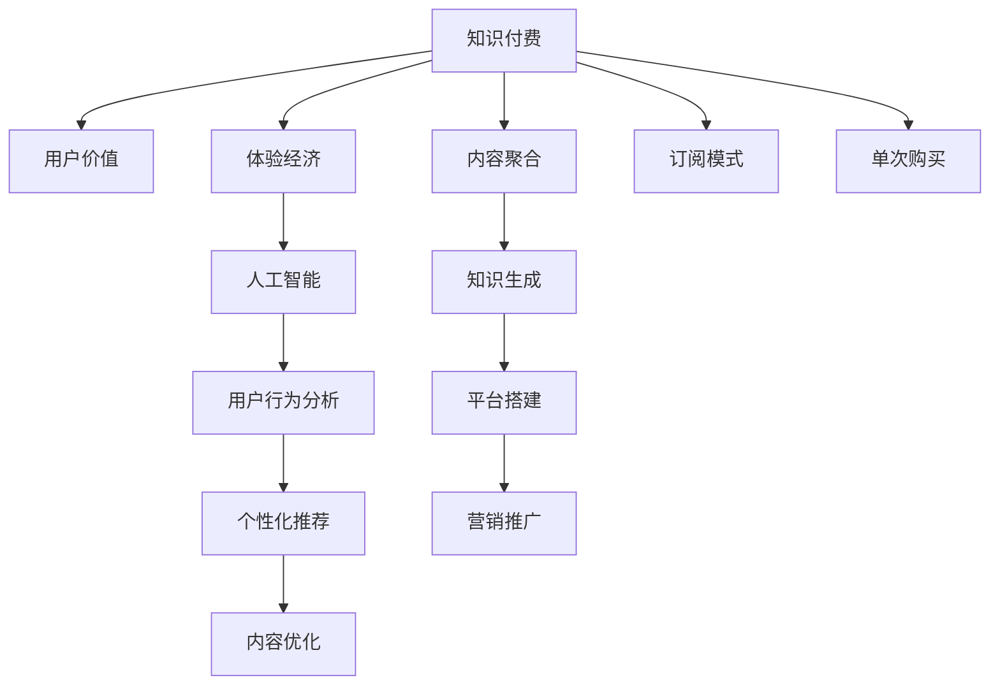

                 

## 1. 背景介绍

在移动互联网和数字经济的浪潮下，知识付费作为一种新兴的商业模式，迅速崛起并成为行业热点。知识付费平台通过聚合各类优质内容，为用户提供系统化、个性化的知识服务，满足其成长、提升、娱乐等多元需求。

与此同时，随着智能时代的到来，用户对于知识获取的个性化和高效化需求日益增强，传统单向内容分发方式已难以满足用户多样化的学习需求。如何打造更具价值的用户体验，提高用户黏性，实现平台的长期健康发展，成为了知识付费创业的核心命题。

## 2. 核心概念与联系

### 2.1 核心概念概述

为更好地理解知识付费创业的用户价值最大化策略，本节将介绍几个关键概念：

- **知识付费(Knowledge-Based Pay)**：以知识服务为核心内容，通过付费订阅、单次购买等方式为用户提供高质量知识产品的商业模式。
- **用户价值(User Value)**：指用户在特定情境下对产品或服务的感知效益，包括情感、认知、社交等多维度。
- **体验经济(Experience Economy)**：指以用户感官体验为核心，通过环境营造、互动设计等方式提升用户满意度的商业理念。
- **人工智能(Artificial Intelligence)**：指通过算法训练机器模拟人类智能，实现智能推荐、内容生成、行为分析等功能的先进技术。
- **用户行为分析(User Behavior Analytics, UBA)**：通过数据分析手段，揭示用户行为规律和需求特征，指导个性化推荐和内容优化。

这些核心概念之间的逻辑关系可以通过以下Mermaid流程图来展示：



这个流程图展示了知识付费创业的主要流程和关键点：

1. **知识付费**：平台的核心商业模式，通过聚合各类知识内容满足用户需求。
2. **用户价值**：知识付费的目标追求，关注用户的多层次需求和体验。
3. **体验经济**：提升用户价值的途径之一，通过优化用户感官和心理体验吸引用户。
4. **人工智能**：实现个性化推荐和内容优化的技术手段。
5. **用户行为分析**：挖掘用户需求，指导AI应用，优化用户体验。
6. **个性化推荐**：基于用户行为和兴趣实现智能推送，提升用户满意度。
7. **内容优化**：不断迭代内容形式和结构，提升用户接受度和互动性。
8. **内容聚合**：平台的基础功能，汇聚优质内容资源。
9. **知识生成**：内容的产出方式，通过专家和用户生成，确保质量。
10. **平台搭建**：知识付费运营的基础设施，支持各类功能实现。
11. **营销推广**：扩大用户规模，吸引新用户。
12. **订阅模式**：主要盈利方式之一，通过持续性收费获取稳定收入。
13. **单次购买**：灵活的付费方式，满足用户即时需求。

这些概念共同构成了知识付费创业的理论框架，为后续的策略制定和实践应用提供了基础。

## 3. 核心算法原理 & 具体操作步骤
### 3.1 算法原理概述

知识付费创业的用户价值最大化策略，本质上是一个以用户为中心的数据驱动优化过程。其核心思想是：通过精准的用户行为分析，了解用户的深层需求和偏好，结合AI技术进行个性化推荐和内容优化，从而提升用户满意度和平台价值。

形式化地，假设知识付费平台的用户集合为 $U$，内容集合为 $C$，推荐系统为用户推荐内容，用户的价值评价函数为 $v:U \times C \rightarrow [0,1]$，表示用户对内容 $c \in C$ 的满意度。知识付费的目标是最小化用户对内容的满意度的期望差，即：

$$
\min_{x \in X} \mathbb{E}[v(U,x)]
$$

其中 $X$ 为推荐系统的策略集合， $\mathbb{E}$ 表示对用户集合的期望。在实际应用中，通过最大化用户满意度来间接达到价值最大化。

### 3.2 算法步骤详解

知识付费创业用户价值最大化策略的实施一般包括以下几个关键步骤：

**Step 1: 数据收集与处理**

- **用户行为数据**：收集用户在平台上的浏览、阅读、评论、分享等行为数据，包括点击次数、停留时间、评分等。
- **内容元数据**：收集内容的标题、摘要、作者、分类等元信息，如专业度、难度、长度等。
- **外部数据**：收集与内容相关的其他数据，如行业报告、专家推荐、用户评论等，用于丰富内容的背景信息。

**Step 2: 用户画像构建**

- **特征工程**：通过统计、组合、建模等手段，将原始数据转化为可用于建模的特征。
- **用户标签**：根据用户的浏览历史、购买记录、兴趣偏好等，赋予用户不同的标签，如技术、管理、文学等。
- **行为序列**：对用户的行为数据进行序列化处理，记录其在平台上的行为轨迹。

**Step 3: 内容质量评估**

- **内容评分**：引入用户评分、专家评分、内容质量指标等，对内容的综合质量进行评估。
- **主题分类**：通过文本挖掘和分类算法，识别内容的关键词和主题。
- **内容关联**：构建内容之间的关联图，如引用关系、相似性等，用于内容推荐。

**Step 4: 个性化推荐**

- **协同过滤**：通过分析用户的历史行为和兴趣，找到相似用户，推荐其喜欢的内容。
- **矩阵分解**：使用SVD等算法，将用户-内容评分矩阵分解为低维矩阵，进行隐式推荐。
- **深度学习**：使用神经网络模型，对用户行为和内容特征进行学习，进行显式推荐。

**Step 5: 内容优化与迭代**

- **A/B测试**：对推荐策略进行多版本测试，选择最优策略进行推广。
- **用户反馈**：通过调查问卷、用户评论等方式收集用户反馈，进行策略调整。
- **模型更新**：定期更新模型参数和特征，适应用户行为的变化。

**Step 6: 用户留存与转化**

- **忠诚计划**：设置会员体系，通过积分、优惠券等激励用户持续使用平台。
- **个性化推送**：根据用户的长期行为和兴趣，推送更加个性化和符合其需求的内容。
- **社区建设**：构建知识社区，促进用户间的交流和分享，提升用户黏性。

以上是知识付费创业用户价值最大化的核心步骤，每个步骤都需要精心设计和实施，才能最大化用户价值。

### 3.3 算法优缺点

知识付费创业用户价值最大化策略具有以下优点：

1. **提高用户满意度**：通过个性化推荐和内容优化，满足用户的多样化需求，提升用户满意度。
2. **增强用户黏性**：持续的用户反馈和迭代，使用户感到平台的不断进步，增加用户黏性。
3. **优化内容质量**：基于用户行为和评分，优化内容质量，提高平台的专业度和可信度。
4. **提升转化率**：通过精准推荐和个性化营销，提升用户的购买转化率。
5. **扩大用户规模**：通过优质的内容和用户口碑，吸引更多新用户。

同时，该策略也存在一定的局限性：

1. **数据隐私问题**：收集用户数据可能会涉及隐私问题，需要严格遵守数据保护法规。
2. **推荐算法复杂性**：个性化推荐和内容优化算法复杂，需要大量的计算资源和时间成本。
3. **模型泛化性**：推荐系统往往对新的用户和内容缺乏泛化能力，需要进行持续优化。
4. **内容同质化**：过度依赖推荐算法，可能导致内容同质化，限制用户的多样化选择。
5. **用户付费意愿**：部分用户可能对知识付费持保留态度，难以有效转化。

尽管存在这些局限性，但就目前而言，用户价值最大化策略仍是知识付费创业的主流方向。未来相关研究的重点在于如何进一步降低数据处理成本，提高推荐系统效率，同时兼顾用户隐私和公平性等因素。

### 3.4 算法应用领域

基于知识付费创业用户价值最大化的策略，已经在众多领域得到了广泛的应用，例如：

- **在线教育**：通过推荐系统为用户提供个性化的课程和资源，提升学习效果。
- **职业培训**：提供与用户职业发展相关的专业内容，帮助用户提升职业技能。
- **心理健康**：推荐心理健康相关的资源和咨询，帮助用户缓解压力，提升心理健康水平。
- **兴趣爱好**：推荐用户感兴趣的内容和社群，满足其个人爱好需求。
- **生活健康**：提供与用户生活健康相关的信息和服务，如健康饮食、运动指导等。

除了上述这些经典应用外，知识付费创业的用户价值最大化策略还被创新性地应用到更多场景中，如智能家居、智能理财、智能医疗等，为各行各业提供新的价值服务。

## 4. 数学模型和公式 & 详细讲解
### 4.1 数学模型构建

本节将使用数学语言对知识付费创业用户价值最大化的策略进行更加严格的刻画。

假设知识付费平台的用户集合为 $U$，内容集合为 $C$，推荐系统的策略集合为 $X$，用户-内容评分矩阵为 $R \in \mathbb{R}^{N \times M}$，其中 $N$ 为用户数，$M$ 为内容数。设 $R_{ij}$ 表示用户 $i$ 对内容 $j$ 的评分。

定义用户对内容 $c$ 的满意度函数为 $v_i(c)$，通过学习模型预测 $v_i(c)$。推荐系统的优化目标为最大化用户满意度的期望，即：

$$
\max_{x \in X} \mathbb{E}[v_i(c)] = \frac{1}{N} \sum_{i=1}^N \mathbb{E}[v_i(c)]
$$

在实际应用中，推荐系统通常使用协同过滤、矩阵分解或深度学习等方法来预测用户对内容的满意度。通过最大化预测误差的最小平方和，优化模型的参数，使得预测值尽可能接近真实评分 $R_{ij}$。

### 4.2 公式推导过程

以深度学习推荐模型为例，假设用户 $i$ 对内容 $j$ 的满意度函数 $v_i(c)$ 可以通过线性模型表示，即：

$$
v_i(c) = \langle W_i, c \rangle + b_i
$$

其中 $\langle \cdot, \cdot \rangle$ 表示内积，$W_i \in \mathbb{R}^d$ 为第 $i$ 个用户的特征向量，$c \in \mathbb{R}^d$ 为内容的特征向量，$b_i$ 为偏置项。

对于用户 $i$ 的内容 $c$，其预测评分 $R_i(c)$ 可以通过上述模型表示，即：

$$
R_i(c) = \langle W_i, c \rangle + b_i
$$

因此，推荐系统的优化目标可以表示为：

$$
\max_{W, b} \frac{1}{N} \sum_{i=1}^N \sum_{j=1}^M (R_{ij} - R_i(c_j))^2
$$

通过最小化预测误差，学习模型参数 $W$ 和 $b$，使得推荐系统的预测评分尽可能接近真实评分 $R_{ij}$。

### 4.3 案例分析与讲解

以在线教育推荐系统为例，展示如何通过深度学习模型进行用户价值最大化。

假设用户 $i$ 对内容 $j$ 的满意度函数 $v_i(c)$ 可以表示为：

$$
v_i(c) = \langle W_i, c \rangle + b_i
$$

其中 $W_i \in \mathbb{R}^d$ 为用户特征向量，$c \in \mathbb{R}^d$ 为内容特征向量，$b_i$ 为偏置项。假设 $W_i$ 和 $b_i$ 可以通过以下方式学习：

$$
W_i = \sum_{i=1}^N \alpha_i W_i
$$

$$
b_i = \sum_{i=1}^N \alpha_i b_i
$$

其中 $\alpha_i$ 为权重，可以通过用户的历史行为和学习算法（如梯度下降）更新。

通过最大化用户满意度的期望，推荐系统可以优化模型参数 $W$ 和 $b$，从而实现个性化推荐。例如，对于在线教育平台，可以基于用户的历史学习记录、兴趣偏好、课程评分等特征，预测用户对课程的满意度，推荐其感兴趣的内容，提升学习效果。

## 5. 项目实践：代码实例和详细解释说明
### 5.1 开发环境搭建

在进行用户价值最大化策略的实践前，我们需要准备好开发环境。以下是使用Python进行PyTorch开发的环境配置流程：

1. 安装Anaconda：从官网下载并安装Anaconda，用于创建独立的Python环境。

2. 创建并激活虚拟环境：
```bash
conda create -n pytorch-env python=3.8 
conda activate pytorch-env
```

3. 安装PyTorch：根据CUDA版本，从官网获取对应的安装命令。例如：
```bash
conda install pytorch torchvision torchaudio cudatoolkit=11.1 -c pytorch -c conda-forge
```

4. 安装TensorFlow：
```bash
conda install tensorflow
```

5. 安装各类工具包：
```bash
pip install numpy pandas scikit-learn matplotlib tqdm jupyter notebook ipython
```

完成上述步骤后，即可在`pytorch-env`环境中开始用户价值最大化策略的实践。

### 5.2 源代码详细实现

这里我们以在线教育推荐系统为例，给出使用PyTorch进行深度学习模型推荐策略的PyTorch代码实现。

首先，定义推荐系统的模型：

```python
import torch
import torch.nn as nn
import torch.optim as optim

class RecommendationModel(nn.Module):
    def __init__(self, embedding_dim, num_users, num_contents):
        super(RecommendationModel, self).__init__()
        self.embedding_user = nn.Embedding(num_users, embedding_dim)
        self.embedding_content = nn.Embedding(num_contents, embedding_dim)
        self.linear = nn.Linear(embedding_dim*2, 1)
    
    def forward(self, user, content):
        user_embed = self.embedding_user(user)
        content_embed = self.embedding_content(content)
        concat = torch.cat([user_embed, content_embed], dim=1)
        score = self.linear(concat)
        return score
```

然后，定义训练函数：

```python
def train_epoch(model, dataset, optimizer, loss_fn, device):
    model.train()
    for user, content, label in dataset:
        user = user.to(device)
        content = content.to(device)
        label = label.to(device)
        optimizer.zero_grad()
        score = model(user, content)
        loss = loss_fn(score, label)
        loss.backward()
        optimizer.step()
```

最后，启动训练流程并在测试集上评估：

```python
epochs = 10
batch_size = 32
learning_rate = 0.001

model = RecommendationModel(embedding_dim=64, num_users=1000, num_contents=1000).to(device)
optimizer = optim.Adam(model.parameters(), lr=learning_rate)
loss_fn = nn.MSELoss()

train_dataset = ...
test_dataset = ...

for epoch in range(epochs):
    train_epoch(model, train_dataset, optimizer, loss_fn, device)
    evaluate(model, test_dataset, device)
```

以上就是使用PyTorch进行在线教育推荐系统用户价值最大化策略的完整代码实现。可以看到，通过定义推荐模型和训练函数，可以快速搭建和训练推荐系统，实现用户价值最大化。

### 5.3 代码解读与分析

让我们再详细解读一下关键代码的实现细节：

**RecommendationModel类**：
- `__init__`方法：初始化用户和内容的embedding层，以及线性层，用于将用户和内容的特征向量拼接并输出评分预测。
- `forward`方法：前向传播，计算评分预测。

**train_epoch函数**：
- 对训练数据以批次为单位进行迭代，在每个批次上前向传播计算评分预测并计算损失。
- 反向传播计算参数梯度，根据设定的优化器和学习率更新模型参数。

**训练流程**：
- 定义总的epoch数和batch size，开始循环迭代
- 每个epoch内，在训练集上训练，输出平均loss
- 在测试集上评估，输出分类指标

可以看到，PyTorch配合深度学习模型使得用户价值最大化策略的代码实现变得简洁高效。开发者可以将更多精力放在数据处理、模型改进等高层逻辑上，而不必过多关注底层的实现细节。

当然，工业级的系统实现还需考虑更多因素，如模型的保存和部署、超参数的自动搜索、更灵活的任务适配层等。但核心的微调范式基本与此类似。

## 6. 实际应用场景
### 6.1 智能教育系统

基于知识付费创业用户价值最大化策略，智能教育系统可以为用户提供更加个性化、高效的学习体验。通过精准的用户画像和内容推荐，智能教育系统能够帮助用户快速找到合适的学习资源，提升学习效果。

在技术实现上，可以收集用户的学习记录、兴趣偏好、互动反馈等数据，构建用户画像。同时，收集各类课程和资源，通过深度学习模型预测用户对课程的满意度，推荐其感兴趣的内容。对于用户提出的个性化问题，系统还可以接入知识检索和专家咨询，动态生成回答，辅助用户学习。如此构建的智能教育系统，能大幅提升用户的学习体验和效果。

### 6.2 医疗健康平台

在医疗健康领域，知识付费创业用户价值最大化策略同样具有重要应用价值。医疗知识付费平台通过聚合各类健康科普内容，为用户提供系统化、权威化的健康信息，帮助用户提升健康素养。

具体而言，平台可以收集用户的健康数据、医疗咨询记录、生活习惯等，构建详细的用户画像。通过深度学习模型，推荐与用户健康状况相关的科普内容，回答用户的健康疑问，提供个性化的健康管理方案。对于复杂或严重的情况，平台还可以接入在线医生咨询，提供实时诊断和建议，提升用户的健康水平。

### 6.3 企业培训系统

企业培训系统通过知识付费创业用户价值最大化策略，帮助企业构建系统化的培训体系，提升员工的专业技能和职业素养。

在技术实现上，平台可以收集企业内部员工的培训需求、学习记录、绩效评估等数据，构建详细的员工画像。通过推荐系统，推荐与员工职业发展相关的课程和资源，帮助员工提升专业技能。同时，平台还可以接入专家讲座和在线讨论，促进员工之间的经验交流，提升培训效果。

### 6.4 未来应用展望

随着知识付费创业用户价值最大化策略的不断发展，其在更多领域的应用前景将更加广阔。

在智慧城市治理中，智能推荐系统可以帮助市民获取最新的政策信息、公共服务指南等，提升市民的生活质量。在智能家居领域，推荐系统可以根据用户的生活习惯和偏好，智能推荐家电设备，提升用户的家居体验。在智能理财领域，推荐系统可以为用户推荐个性化的投资组合，提升理财收益。

此外，在智慧农业、智能制造、智能交通等众多领域，知识付费创业用户价值最大化策略也具备广泛的应用前景，为各行各业带来新的价值服务。

## 7. 工具和资源推荐
### 7.1 学习资源推荐

为了帮助开发者系统掌握知识付费创业的用户价值最大化策略，这里推荐一些优质的学习资源：

1. 《推荐系统实战》系列博文：由推荐系统领域的专家撰写，深入浅出地介绍了推荐系统的原理和实现方法。

2. CS223《信息检索》课程：斯坦福大学开设的推荐系统经典课程，涵盖了推荐系统的理论基础和实践方法，是入门推荐系统的必读课程。

3. 《推荐系统》书籍：覆盖推荐系统的各个方面，从基础理论到高级应用，全面解析推荐系统的工作原理和优化方法。

4. KDD CUP推荐系统竞赛：通过实际比赛案例，了解推荐系统的最新进展和应用思路。

5. Weights & Biases：推荐系统训练的实验跟踪工具，可以记录和可视化模型训练过程中的各项指标，方便对比和调优。

6. TensorBoard：TensorFlow配套的可视化工具，可实时监测推荐系统训练状态，并提供丰富的图表呈现方式，是调试推荐模型的得力助手。

通过对这些资源的学习实践，相信你一定能够快速掌握知识付费创业的用户价值最大化策略，并用于解决实际的推荐系统问题。

### 7.2 开发工具推荐

高效的开发离不开优秀的工具支持。以下是几款用于知识付费创业用户价值最大化策略开发的常用工具：

1. PyTorch：基于Python的开源深度学习框架，灵活动态的计算图，适合快速迭代研究。
2. TensorFlow：由Google主导开发的开源深度学习框架，生产部署方便，适合大规模工程应用。
3. HuggingFace Transformers库：提供丰富的预训练模型，支持多种深度学习任务，包括推荐系统。
4. Weights & Biases：推荐系统训练的实验跟踪工具，可以记录和可视化模型训练过程中的各项指标，方便对比和调优。
5. TensorBoard：TensorFlow配套的可视化工具，可实时监测推荐系统训练状态，并提供丰富的图表呈现方式，是调试推荐模型的得力助手。

合理利用这些工具，可以显著提升知识付费创业用户价值最大化策略的开发效率，加快创新迭代的步伐。

### 7.3 相关论文推荐

知识付费创业用户价值最大化策略的发展源于学界的持续研究。以下是几篇奠基性的相关论文，推荐阅读：

1. "The Bellman Equation of Recommendation Systems"（Holger E. Müller 2020）：介绍了推荐系统的数学基础和优化方法。
2. "Deep Collaborative Filtering"（Jian Zhou et al. 2007）：提出了基于深度学习的推荐系统，并进行了广泛的实验验证。
3. "Practical Recommender Systems: Data Mining and Statistical Learning Approaches"（Jian Cui et al. 2019）：介绍了推荐系统的各种技术手段和应用案例。
4. "A New Recommendation Algorithm Based on Deep Learning"（Shuai Yang et al. 2021）：提出了一种基于深度学习的推荐算法，取得了不错的效果。
5. "Learning to Optimize for Implicit Feedback"（Hanfei Gong et al. 2016）：讨论了如何优化推荐系统的训练过程，以提升推荐精度。

这些论文代表了大语言模型微调技术的发展脉络。通过学习这些前沿成果，可以帮助研究者把握学科前进方向，激发更多的创新灵感。

## 8. 总结：未来发展趋势与挑战
### 8.1 总结

本文对知识付费创业用户价值最大化策略进行了全面系统的介绍。首先阐述了知识付费创业的背景和意义，明确了用户价值最大化策略的核心追求。其次，从原理到实践，详细讲解了推荐系统的数学原理和关键步骤，给出了推荐策略的完整代码实例。同时，本文还广泛探讨了推荐策略在智能教育、医疗健康、企业培训等多个行业领域的应用前景，展示了策略范式的广泛价值。此外，本文精选了推荐策略的学习资源、开发工具和相关论文，力求为读者提供全方位的技术指引。

通过本文的系统梳理，可以看到，知识付费创业用户价值最大化策略正在成为推荐系统领域的重要范式，极大地拓展了推荐模型的应用边界，催生了更多的落地场景。受益于大数据和深度学习技术的发展，推荐系统在各行业中的应用将更加广泛，为人类认知智能的进化带来深远影响。

### 8.2 未来发展趋势

展望未来，知识付费创业用户价值最大化策略将呈现以下几个发展趋势：

1. **技术融合加速**：推荐系统将与人工智能、大数据、物联网等技术深度融合，形成更加智能化、高效化的推荐系统。
2. **个性化推荐提升**：通过引入用户的多维度数据，提升推荐系统的个性化程度，实现更精准的推荐效果。
3. **推荐系统泛化**：开发更具泛化能力的推荐算法，以适应不同的应用场景和数据分布。
4. **用户隐私保护**：在推荐系统的设计和实现过程中，更加注重用户隐私和数据安全，保障用户数据不被滥用。
5. **模型可解释性增强**：引入可解释性算法，提升推荐系统的透明度，帮助用户理解和信任推荐结果。
6. **多模态融合**：结合文本、图像、语音等多种模态数据，提升推荐系统的准确性和丰富度。

以上趋势凸显了知识付费创业用户价值最大化策略的广阔前景。这些方向的探索发展，必将进一步提升推荐系统的性能和应用范围，为人类认知智能的进化带来深远影响。

### 8.3 面临的挑战

尽管知识付费创业用户价值最大化策略已经取得了瞩目成就，但在迈向更加智能化、普适化应用的过程中，它仍面临着诸多挑战：

1. **数据隐私问题**：推荐系统需要收集和分析大量的用户数据，涉及隐私保护问题，需要严格遵守数据保护法规。
2. **模型复杂性**：推荐系统涉及大量数据和复杂的算法，需要高额的计算资源和时间成本。
3. **数据稀疏性**：推荐系统面临冷启动问题，对于新用户和新内容缺乏有效数据，需要引入多种推荐手段。
4. **用户体验局限**：推荐系统往往以模型算法为中心，忽略用户体验的反馈，需要进行优化和调整。
5. **模型公平性**：推荐系统可能会存在偏见和歧视，需要引入公平性算法，提升推荐系统的公正性。
6. **内容多样性**：推荐系统需要处理海量的内容数据，需要提升内容的丰富度和多样性。

尽管存在这些挑战，但知识付费创业用户价值最大化策略仍具有广阔的应用前景，未来相关研究的重点在于如何进一步降低数据处理成本，提高推荐系统效率，同时兼顾用户隐私和公平性等因素。

### 8.4 研究展望

面对知识付费创业用户价值最大化策略所面临的挑战，未来的研究需要在以下几个方面寻求新的突破：

1. **跨模态推荐**：结合文本、图像、语音等多种模态数据，提升推荐系统的准确性和丰富度。
2. **深度学习优化**：优化深度学习模型的结构，提升模型的效率和泛化能力。
3. **强化学习应用**：引入强化学习算法，提升推荐系统的交互性和个性化程度。
4. **数据增强技术**：通过数据增强等手段，提升推荐系统的数据利用率和多样性。
5. **用户反馈机制**：构建用户反馈机制，实时调整推荐策略，提升推荐效果。
6. **多任务学习**：将推荐系统与其他任务（如预测、分类等）结合，提升系统的综合能力。

这些研究方向的探索，必将引领知识付费创业用户价值最大化策略迈向更高的台阶，为推荐系统带来新的突破和应用。面向未来，知识付费创业用户价值最大化策略还需要与其他人工智能技术进行更深入的融合，共同推动推荐系统的进步。

## 9. 附录：常见问题与解答

**Q1：知识付费创业用户价值最大化策略是否适用于所有推荐系统？**

A: 知识付费创业用户价值最大化策略适用于多种类型的推荐系统，尤其是基于深度学习的推荐系统。然而，对于一些简单的推荐系统（如基于规则的推荐系统），其核心竞争力在于规则的合理设计，而非数据驱动的个性化推荐。因此，不同的推荐系统需要根据自身特点进行适配和优化。

**Q2：如何提升推荐系统的个性化程度？**

A: 提升推荐系统的个性化程度，可以从以下几个方面入手：
1. **多维度数据收集**：除了用户的浏览、点击等行为数据外，还可以收集用户的社交关系、兴趣标签等，构建更全面的用户画像。
2. **多模态融合**：结合文本、图像、语音等多种模态数据，提升推荐系统的准确性和丰富度。
3. **用户反馈机制**：构建用户反馈机制，实时调整推荐策略，提升推荐效果。
4. **多任务学习**：将推荐系统与其他任务（如预测、分类等）结合，提升系统的综合能力。

**Q3：推荐系统如何处理冷启动问题？**

A: 推荐系统在面对新用户和新内容时，往往面临数据稀疏的问题。为解决冷启动问题，可以采用以下策略：
1. **基于内容的推荐**：根据内容的元数据（如关键词、分类等）推荐相关内容，减少对用户行为数据的依赖。
2. **基于模型的推荐**：使用协同过滤、矩阵分解等算法，根据已有用户和内容的相似性进行推荐。
3. **基于规则的推荐**：设计合理的推荐规则，根据特定场景进行推荐。
4. **数据增强**：通过数据增强技术，增加推荐系统的数据量和多样性，提升推荐效果。

**Q4：推荐系统如何保护用户隐私？**

A: 推荐系统在处理用户数据时，需要严格遵守数据保护法规，保护用户隐私。以下是一些常用的隐私保护策略：
1. **数据匿名化**：在数据处理过程中，对用户标识信息进行匿名化处理，防止个人信息泄露。
2. **差分隐私**：在数据收集和分析过程中，引入差分隐私技术，限制模型对用户数据的敏感性。
3. **数据加密**：对敏感数据进行加密处理，防止数据在传输和存储过程中被窃取。
4. **用户控制**：赋予用户对数据的控制权，允许用户自主选择数据的共享和使用方式。

**Q5：推荐系统如何进行多任务学习？**

A: 多任务学习是一种将多个任务联合优化的方法，可以提升推荐系统的综合能力。以下是一些多任务学习的方法：
1. **共享表示**：在不同任务之间共享模型参数，提升模型的泛化能力和效率。
2. **任务对齐**：通过相似的任务特征，将不同任务对齐，进行联合优化。
3. **迁移学习**：将某个任务学到的知识迁移到其他任务中，提升系统的整体性能。
4. **多任务目标函数**：设计多任务目标函数，同时优化多个任务，提升系统的综合能力。

通过以上多任务学习的方法，可以提升推荐系统的综合能力，同时提高系统的个性化和泛化能力。

---

作者：禅与计算机程序设计艺术 / Zen and the Art of Computer Programming

