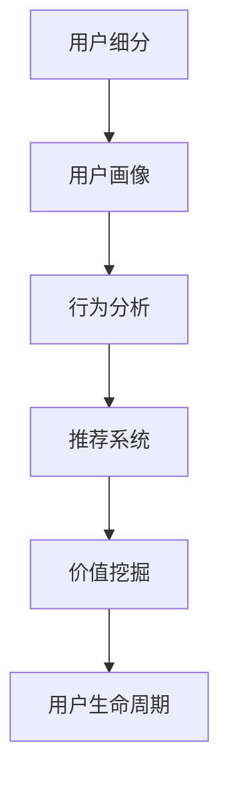

                 

## 1. 背景介绍

### 1.1 问题由来

随着互联网技术的发展，知识付费行业逐渐兴起。知识付费平台通过整合优质知识资源，为用户提供结构化、系统化的学习内容，帮助用户快速提升专业能力，降低学习成本。然而，知识付费产品繁多，质量参差不齐，用户需求未被充分挖掘，导致用户流失率较高，知识付费平台亟需深入研究用户细分，开展精准营销，提升用户体验和平台收益。

### 1.2 问题核心关键点

如何对知识付费用户进行精准细分，构建用户画像，成为知识付费创业成功的关键。用户细分不仅能帮助平台更好地匹配内容和服务，提升用户黏性，还能为产品优化提供数据支持，为精准营销提供依据。

### 1.3 问题研究意义

用户细分的深入研究，对于知识付费平台的创新与发展具有重要意义：

1. **提升用户黏性**：通过精准的内容推荐和服务，满足用户个性化需求，增强用户粘性，降低用户流失率。
2. **优化产品设计**：结合用户画像，优化产品功能和服务，提升用户满意度，带动更多用户转化为付费用户。
3. **拓展市场空间**：细分用户需求，发现新的细分市场和用户增长点，为平台带来更多用户和收益。
4. **实现个性化营销**：基于用户细分数据，制定针对性营销策略，提高广告投放和推广效果，降低营销成本。
5. **增强数据分析能力**：用户细分需要深入挖掘用户数据，提升平台的数据分析能力，为后续业务决策提供支撑。

## 2. 核心概念与联系

### 2.1 核心概念概述

为更好地理解知识付费用户细分的核心概念及其应用，本节将详细介绍以下几个关键概念：

- **用户细分**：根据用户行为、属性、需求等特征，将用户划分为不同群体，便于进行个性化营销和产品优化。
- **用户画像**：通过数据分析和机器学习，构建用户特征描述，帮助平台更好地理解用户，精准推送内容和服务。
- **行为分析**：分析用户行为数据，如浏览、购买、评价等，识别出用户偏好和需求，指导产品迭代。
- **推荐系统**：基于用户行为和特征，推荐系统能够预测用户可能感兴趣的内容，优化用户体验。
- **价值挖掘**：通过用户细分和行为分析，发现潜在的高价值用户群体，进行针对性的用户运营和增长。
- **用户生命周期**：描述用户从接触、到留存、活跃、流失的全过程，为平台运营提供参考。

这些核心概念之间的逻辑关系可以通过以下Mermaid流程图来展示：



这个流程图展示了一个完整的用户细分流程，从用户细分的起始到最终的价值挖掘，体现了用户细分在知识付费平台的重要性。

## 3. 核心算法原理 & 具体操作步骤

### 3.1 算法原理概述

知识付费用户细分的核心算法原理主要基于用户行为数据分析和机器学习。平台通过对用户行为数据进行建模分析，发现用户的共性和差异，构建用户画像，并利用机器学习算法对这些用户画像进行进一步细化，生成不同用户群体。具体流程如下：

1. **数据收集**：收集用户注册、浏览、购买、评价等数据。
2. **特征提取**：从收集到的数据中提取用户行为特征，如浏览时长、购买频率、评价评分等。
3. **建模分析**：利用数据挖掘和机器学习算法，如聚类、分类等，对用户行为特征进行建模分析。
4. **用户画像**：通过建模分析，生成用户画像，描述用户的共性特征。
5. **细分组群**：进一步细化用户画像，构建不同用户群体，如付费用户、活跃用户、流失用户等。
6. **分析优化**：结合用户画像和细分组群，分析用户行为，指导产品优化和营销策略。

### 3.2 算法步骤详解

下面详细介绍知识付费用户细分的具体算法步骤：

**Step 1: 数据收集**

知识付费平台需要收集用户行为数据，包括但不限于：

- 用户注册信息（如年龄、性别、职业、教育背景等）
- 用户浏览行为（如浏览内容、浏览时间、浏览深度等）
- 用户购买行为（如购买课程、购买频次、消费金额等）
- 用户评价行为（如评价内容、评价星级、评价时间等）
- 用户互动行为（如点赞、评论、分享等）

**Step 2: 特征提取**

将收集到的数据进行特征提取，以生成描述用户行为特征的向量：

- 对用户的注册信息进行编码，生成向量表示用户属性特征。
- 对用户的浏览行为进行编码，生成向量表示浏览行为特征，如浏览时长、浏览深度等。
- 对用户的购买行为进行编码，生成向量表示购买行为特征，如购买金额、购买频次等。
- 对用户的评价行为进行编码，生成向量表示评价行为特征，如评价星级、评价内容等。
- 对用户的互动行为进行编码，生成向量表示互动行为特征，如点赞数、评论数等。

**Step 3: 建模分析**

使用数据挖掘和机器学习算法，对提取到的用户特征进行建模分析，生成用户画像：

- 使用聚类算法（如K-means、GMM等）对用户特征进行聚类，识别出不同用户群体的共性特征。
- 使用分类算法（如逻辑回归、决策树等）对用户特征进行分类，进一步细化用户群体的差异特征。
- 使用关联规则算法（如Apriori等）发现用户行为间的关联关系，生成更丰富的用户画像。

**Step 4: 用户画像**

将建模分析结果作为用户画像的依据，描述不同用户群体的共性特征：

- 描述用户群体的基本信息，如年龄、职业、教育背景等。
- 描述用户群体的行为特征，如浏览时长、购买金额、评价星级等。
- 描述用户群体的需求偏好，如课程偏好、互动偏好等。

**Step 5: 细分组群**

在用户画像的基础上，进一步细化用户群体，构建更具体的用户细分群体：

- 基于用户画像，构建不同细分群体，如付费用户、活跃用户、流失用户等。
- 根据用户画像和细分组群，进一步细分，如高端用户、普通用户、新用户等。
- 对用户细分群体进行描述，如描述活跃用户的购买频率、浏览时长等。

**Step 6: 分析优化**

结合用户画像和细分组群，分析用户行为，指导产品优化和营销策略：

- 分析用户购买行为，优化课程推荐算法，提升用户购买率。
- 分析用户浏览行为，优化推荐算法，提升用户浏览深度。
- 分析用户评价行为，优化内容质量，提升用户满意度。
- 分析用户互动行为，优化互动设计，提升用户粘性。

### 3.3 算法优缺点

知识付费用户细分算法具有以下优点：

1. **精细化管理**：通过用户细分，能够实现对不同用户群体的精细化管理，提升用户体验和平台收益。
2. **个性化推荐**：基于用户细分，能够提供个性化的内容推荐，提升用户粘性。
3. **营销优化**：通过用户细分，能够制定针对性的营销策略，提高广告投放效果。
4. **决策支撑**：通过用户细分和行为分析，能够为产品优化和运营决策提供数据支撑。

同时，该算法也存在一定的局限性：

1. **数据质量依赖**：用户细分的准确性高度依赖于数据的质量和全面性，不完整的数据可能导致错误的用户画像和细分结果。
2. **算法复杂度高**：用户细分涉及多种机器学习算法，算法复杂度较高，需要较强的技术实力和计算资源。
3. **隐私保护问题**：用户数据涉及隐私保护，需要严格遵守相关法律法规，确保数据安全。
4. **动态变化问题**：用户行为和需求随着时间推移会发生变化，用户细分需要定期更新，以保持准确性。

尽管存在这些局限性，但就目前而言，基于机器学习的用户细分算法仍然是知识付费平台应用的主要范式。未来相关研究的重点在于如何进一步降低算法复杂度，提高数据利用效率，同时兼顾隐私保护和数据更新问题。

### 3.4 算法应用领域

基于机器学习的用户细分算法，已经在知识付费、电子商务、社交网络等多个领域得到广泛应用，具体如下：

1. **知识付费平台**：通过用户细分，优化内容推荐，提升用户购买率。
2. **电子商务平台**：通过用户细分，优化产品推荐，提升用户转化率和购买率。
3. **社交网络平台**：通过用户细分，优化内容推送，提升用户活跃度和粘性。
4. **移动应用平台**：通过用户细分，优化用户界面设计，提升用户体验。
5. **金融理财平台**：通过用户细分，优化理财方案推荐，提升用户收益。
6. **健康医疗平台**：通过用户细分，优化健康内容推荐，提升用户健康水平。

以上这些领域中的用户细分应用，已经带来了显著的用户体验提升和平台收益增长，展示了用户细分算法的广泛应用前景。

## 4. 数学模型和公式 & 详细讲解 & 举例说明

### 4.1 数学模型构建

本节将使用数学语言对知识付费用户细分的算法过程进行更严谨的描述。

记知识付费平台的用户集合为 $U=\{u_i\}_{i=1}^N$，其中 $u_i$ 表示用户 $i$ 的特征向量，如年龄、性别、职业、浏览时长等。假设平台有 $C$ 个课程作为推荐内容集合，课程内容集合为 $C=\{c_j\}_{j=1}^M$，其中 $c_j$ 表示第 $j$ 个课程的特征向量，如课程标题、难度、评价等。

设平台的数据集 $D=\{(x_i,y_i)\}_{i=1}^N$，其中 $x_i$ 表示用户 $i$ 的特征向量，$y_i$ 表示用户 $i$ 的购买行为，$y_i=1$ 表示购买了课程，$y_i=0$ 表示未购买课程。

定义用户 $u_i$ 对课程 $c_j$ 的兴趣度为 $a_{i,j}$，满足 $a_{i,j} \in [0,1]$，表示用户 $i$ 对课程 $c_j$ 的兴趣程度。用户对课程的兴趣度可以通过用户的行为数据进行建模分析。

### 4.2 公式推导过程

以下我们以用户行为数据为基础，推导用户对课程的兴趣度 $a_{i,j}$ 的计算公式。

假设用户 $u_i$ 购买了 $k$ 门课程，其中第 $j$ 门课程的特征向量为 $c_j$，用户 $u_i$ 对课程 $c_j$ 的兴趣度可以通过以下公式计算：

$$
a_{i,j} = f(\vec{x}_i,\vec{c}_j)
$$

其中 $\vec{x}_i$ 为用户的特征向量，$\vec{c}_j$ 为课程的特征向量，$f$ 为兴趣度计算函数，可以通过机器学习算法（如线性回归、决策树等）训练得到。

进一步地，用户 $u_i$ 对课程 $c_j$ 的购买概率 $p_{i,j}$ 可以通过兴趣度 $a_{i,j}$ 计算得到：

$$
p_{i,j} = \sigma(a_{i,j})
$$

其中 $\sigma$ 为逻辑函数，通常采用Sigmoid函数，计算公式为：

$$
\sigma(x) = \frac{1}{1+e^{-x}}
$$

假设用户 $u_i$ 对课程 $c_j$ 的购买概率为 $p_{i,j}$，用户 $u_i$ 对所有课程的购买概率向量为 $\vec{p}_i$，则用户 $u_i$ 的购买行为可以通过伯努利分布表示：

$$
y_i \sim \text{Bernoulli}(\vec{p}_i)
$$

### 4.3 案例分析与讲解

假设平台有 $N=100$ 个用户， $M=50$ 门课程，用户的特征向量 $\vec{x}_i$ 包括年龄、性别、职业等，课程的特征向量 $\vec{c}_j$ 包括课程标题、难度、评价等。通过机器学习算法训练得到兴趣度计算函数 $f$，并计算每个用户对所有课程的购买概率向量 $\vec{p}_i$。

对于用户 $u_1$，其特征向量 $\vec{x}_1=[30,男,工程师]$，对课程 $c_1$、$c_2$、$c_3$、$c_4$ 的兴趣度计算如下：

$$
a_{1,1} = f([30,男,工程师],\vec{c}_1)
$$
$$
a_{1,2} = f([30,男,工程师],\vec{c}_2)
$$
$$
a_{1,3} = f([30,男,工程师],\vec{c}_3)
$$
$$
a_{1,4} = f([30,男,工程师],\vec{c}_4)
$$

计算用户 $u_1$ 对课程 $c_1$、$c_2$、$c_3$、$c_4$ 的购买概率向量 $\vec{p}_1$，并生成用户 $u_1$ 的购买行为 $y_1=1$。

通过上述案例，可以看出，基于用户行为数据的机器学习算法，能够有效地计算用户对课程的兴趣度，并生成购买概率向量，从而进行用户细分和推荐。

## 5. 项目实践：代码实例和详细解释说明

### 5.1 开发环境搭建

在进行用户细分实践前，我们需要准备好开发环境。以下是使用Python进行Scikit-learn和Pandas开发的环境配置流程：

1. 安装Anaconda：从官网下载并安装Anaconda，用于创建独立的Python环境。

2. 创建并激活虚拟环境：
```bash
conda create -n pyenv python=3.8 
conda activate pyenv
```

3. 安装Scikit-learn和Pandas：
```bash
conda install scikit-learn pandas
```

4. 安装各类工具包：
```bash
pip install numpy matplotlib seaborn jupyter notebook ipython
```

完成上述步骤后，即可在`pyenv`环境中开始用户细分实践。

### 5.2 源代码详细实现

下面我们以知识付费用户细分为例，给出使用Scikit-learn和Pandas进行用户细分的PyTorch代码实现。

首先，定义用户行为数据的处理函数：

```python
import pandas as pd
from sklearn.model_selection import train_test_split
from sklearn.preprocessing import LabelEncoder

# 读取用户行为数据
user_data = pd.read_csv('user_behavior_data.csv')

# 特征提取
user_features = ['age', 'gender', 'occupation', 'browsing_time', 'purchase_frequency', 'purchase_amount', 'evaluation_score']
X = user_data[user_features]

# 标签提取
y = user_data['purchased'] # 购买行为为1表示购买了课程，为0表示未购买课程

# 标签编码
encoder = LabelEncoder()
y = encoder.fit_transform(y)

# 数据拆分
X_train, X_test, y_train, y_test = train_test_split(X, y, test_size=0.2, random_state=42)
```

然后，定义用户细分的机器学习模型：

```python
from sklearn.linear_model import LogisticRegression
from sklearn.ensemble import RandomForestClassifier
from sklearn.metrics import accuracy_score

# 定义模型
models = {
    'LogisticRegression': LogisticRegression(),
    'RandomForestClassifier': RandomForestClassifier()
}

# 训练模型
for name, model in models.items():
    model.fit(X_train, y_train)
    y_pred = model.predict(X_test)
    print(f'{name}: Accuracy = {accuracy_score(y_test, y_pred)}')
```

接着，定义用户细分的详细实现：

```python
# 导入聚类算法
from sklearn.cluster import KMeans

# 定义用户细分的K-means聚类模型
kmeans = KMeans(n_clusters=3, random_state=42)

# 训练模型
kmeans.fit(X_train)

# 聚类结果
labels = kmeans.predict(X_train)
cluster_centers = kmeans.cluster_centers_

# 用户细分结果
for i, label in enumerate(labels):
    print(f'User {i+1}: Cluster {label+1}, Center {cluster_centers[label]}')
```

最后，启动用户细分的流程并在测试集上评估：

```python
# 导入可视化工具
import matplotlib.pyplot as plt
import seaborn as sns

# 可视化聚类结果
sns.scatterplot(x=X_train['age'], y=X_train['browsing_time'], hue=labels, alpha=0.5)
plt.show()

# 输出聚类结果
for i, label in enumerate(labels):
    print(f'User {i+1}: Cluster {label+1}, Center {cluster_centers[label]}')
```

以上就是使用Scikit-learn和Pandas进行用户细分的完整代码实现。可以看到，Scikit-learn和Pandas库的强大封装，使得用户细分的代码实现变得简洁高效。

### 5.3 代码解读与分析

让我们再详细解读一下关键代码的实现细节：

**用户行为数据处理函数**：
- 读取用户行为数据，包括年龄、性别、职业、浏览时长、购买频次、购买金额、评价评分等特征。
- 对购买行为进行编码，生成0/1标签。
- 对特征和标签进行拆分，划分训练集和测试集。

**用户细分的机器学习模型**：
- 定义Logistic回归和随机森林两种分类模型，并训练得到训练集上的预测结果。
- 计算模型在测试集上的准确率，并进行输出。

**用户细分的详细实现**：
- 定义K-means聚类模型，对训练集进行聚类分析，得到聚类标签和聚类中心。
- 输出每个用户在训练集上的聚类标签和对应的聚类中心。

**用户细分的可视化**：
- 使用Matplotlib和Seaborn库可视化用户聚类结果，展示不同聚类群体的分布情况。

通过这些代码实现，我们可以快速构建知识付费用户细分模型，并对用户行为进行聚类分析，提升用户体验和平台收益。

## 6. 实际应用场景

### 6.1 智能客服系统

基于用户细分的智能客服系统，可以提升客服服务效率和用户体验。通过用户细分的结果，智能客服系统能够识别出不同用户群体的需求特点，进行针对性的服务优化。例如，对于需要购买课程的用户，智能客服系统可以提供个性化的课程推荐和购买建议，提升用户购买率。

在技术实现上，可以结合用户细分的结果，构建个性化推荐算法，实现对不同用户群体的智能客服服务。对于需要购买课程的用户，可以进一步结合课程推荐系统，提供最符合用户需求的课程推荐，提升用户体验和平台收益。

### 6.2 金融舆情监测

金融舆情监测平台可以利用用户细分的结果，识别出不同用户群体的金融需求，提供针对性的金融产品和服务。例如，对于高净值用户，金融舆情监测平台可以提供定制化的理财方案和金融服务，提升用户满意度和平台收益。

在技术实现上，可以通过用户细分的结果，构建金融需求画像，分析不同用户群体的金融需求特点，提供个性化的金融产品和服务。同时，结合金融舆情监测的结果，能够实时监测市场舆情，为用户提供最新的金融资讯和建议，提升用户的投资决策水平。

### 6.3 个性化推荐系统

个性化推荐系统可以利用用户细分的结果，优化推荐算法，提升推荐效果。例如，对于喜欢技术类课程的用户，个性化推荐系统可以提供技术类课程推荐，提升用户满意度和课程销售率。

在技术实现上，结合用户细分的结果，构建用户画像，分析不同用户群体的需求偏好，提供个性化的推荐内容。同时，结合用户行为数据，优化推荐算法，提升推荐效果和用户体验。

### 6.4 未来应用展望

随着用户细分的不断发展，未来将会在更多领域得到应用，为传统行业带来变革性影响。

在智慧医疗领域，用户细分可以帮助医生了解不同用户群体的健康需求，提供个性化的医疗服务。例如，对于老年人用户，智慧医疗平台可以提供健康咨询和医疗服务，提升用户的健康水平。

在智能教育领域，用户细分可以帮助教育机构了解不同用户群体的学习需求，提供个性化的学习方案。例如，对于中小学生用户，智能教育平台可以提供定制化的学习资源和课程，提升学生的学习效果。

在智慧城市治理中，用户细分可以帮助城市管理部门了解不同用户群体的需求，提供个性化的公共服务。例如，对于老年人用户，智慧城市平台可以提供便捷的公共服务和健康咨询，提升用户的满意度。

此外，在企业生产、社会治理、文娱传媒等众多领域，用户细分技术也将不断拓展，为各行各业提供更好的解决方案。

## 7. 工具和资源推荐

### 7.1 学习资源推荐

为了帮助开发者系统掌握用户细分的理论基础和实践技巧，这里推荐一些优质的学习资源：

1. 《Python数据分析实战》系列书籍：由知名数据科学家撰写，深入浅出地介绍了Python数据分析技术，包括用户行为数据分析、机器学习算法等。
2. Coursera《数据科学与机器学习》课程：由知名大学开设的在线课程，涵盖数据科学、机器学习、用户行为分析等前沿话题，适合初学者和专业人士。
3. Kaggle用户行为分析竞赛：通过实战竞赛，学习用户行为分析的实际应用，提升数据分析和机器学习能力。
4. GitHub用户行为分析项目：通过开源项目，学习用户行为分析的实际应用，提升实战能力。
5. Google Analytics用户行为分析工具：通过实际数据分析工具，学习用户行为分析的实际应用，提升数据分析能力。

通过对这些资源的学习实践，相信你一定能够快速掌握用户细分的精髓，并用于解决实际的NLP问题。

### 7.2 开发工具推荐

高效的开发离不开优秀的工具支持。以下是几款用于用户细分开发的常用工具：

1. Python：由于其强大的数据处理和机器学习库，如Pandas、Scikit-learn等，Python是用户细分开发的常用语言。
2. R语言：具有强大的统计分析和可视化功能，适用于用户细分的数据分析和可视化。
3. Scikit-learn：提供丰富的机器学习算法，包括聚类、分类等，是用户细分算法开发的重要工具。
4. TensorFlow：由Google开发的深度学习框架，适用于复杂用户细分算法的实现。
5. Weights & Biases：模型训练的实验跟踪工具，可以记录和可视化模型训练过程中的各项指标，方便对比和调优。

合理利用这些工具，可以显著提升用户细分的开发效率，加快创新迭代的步伐。

### 7.3 相关论文推荐

用户细分的深入研究源于学界的持续研究。以下是几篇奠基性的相关论文，推荐阅读：

1. Clustering Algorithms: A Survey (Statistical Approaches)：介绍了常用的聚类算法，如K-means、GMM等，适合理解用户细分的数学原理。
2. Predictive Analytics: Prescriptive and Descriptive Approach in Customer Analytics：介绍了用户细分的预测和描述方法，适合理解用户细分的应用场景。
3. Social Media Analytics: A Survey: Concepts, Techniques, and Applications：介绍了社交媒体数据的用户细分方法，适合理解用户细分的应用实践。
4. Customer Segmentation and Targeted Marketing：介绍了用户细分在营销中的应用，适合理解用户细分的商业价值。
5. A Survey on Customer Segmentation Algorithms and Their Application in Marketing：介绍了用户细分算法的发展历史和应用前景，适合理解用户细分的未来趋势。

这些论文代表了大用户细分技术的发展脉络。通过学习这些前沿成果，可以帮助研究者把握学科前进方向，激发更多的创新灵感。

## 8. 总结：未来发展趋势与挑战

### 8.1 总结

本文对基于用户细分的知识付费创业进行了全面系统的介绍。首先阐述了用户细分的背景和意义，明确了用户细分在知识付费创业中的重要性。其次，从原理到实践，详细讲解了用户细分的数学原理和具体步骤，给出了用户细分的代码实现。同时，本文还广泛探讨了用户细分在智能客服、金融舆情监测、个性化推荐等多个行业领域的应用前景，展示了用户细分算法的广泛应用前景。最后，本文精选了用户细分的各类学习资源，力求为读者提供全方位的技术指引。

通过本文的系统梳理，可以看到，用户细分在知识付费创业中具有重要意义，能够通过精准的数据分析和算法模型，实现对不同用户群体的精细化管理，提升用户体验和平台收益。未来，随着用户细分技术的不断演进，知识付费创业将迎来更多机遇和挑战。

### 8.2 未来发展趋势

展望未来，用户细分技术将呈现以下几个发展趋势：

1. **深度学习的应用**：深度学习算法在用户细分中得到广泛应用，如卷积神经网络、循环神经网络等，将进一步提升用户细分的精度和效率。
2. **多模态数据融合**：结合用户行为、社交媒体、地理位置等多模态数据，能够更全面地刻画用户画像，提升用户细分的效果。
3. **实时分析能力**：结合大数据技术，实现实时用户行为分析和预测，提升用户细分和推荐的实时性。
4. **隐私保护技术**：结合区块链和联邦学习等技术，实现用户数据的隐私保护，确保用户数据的安全性。
5. **个性化推荐优化**：结合用户细分的结果，优化推荐算法，提升推荐效果和用户体验。
6. **自动化工具**：结合人工智能技术，开发自动化的用户细分工具，提升用户细分的效率和效果。

以上趋势凸显了用户细分技术的广阔前景。这些方向的探索发展，必将进一步提升知识付费平台的用户细分能力，为用户带来更好的服务体验和平台收益。

### 8.3 面临的挑战

尽管用户细分技术已经取得了不小的进步，但在迈向更加智能化、普适化应用的过程中，它仍面临诸多挑战：

1. **数据质量问题**：用户细分依赖于高质量的数据，不完整或不准确的数据可能导致错误的用户画像和细分结果。
2. **算法复杂度高**：用户细分的算法涉及多种机器学习算法，算法复杂度较高，需要较强的技术实力和计算资源。
3. **隐私保护问题**：用户数据涉及隐私保护，需要严格遵守相关法律法规，确保数据安全。
4. **动态变化问题**：用户行为和需求随着时间推移会发生变化，用户细分需要定期更新，以保持准确性。
5. **计算资源问题**：用户细分的计算量较大，需要高性能的计算资源，大规模数据集处理时可能遇到性能瓶颈。

尽管存在这些挑战，但用户细分技术的研究在不断进步，未来的发展方向将重点解决这些问题，实现更加高效、准确、可靠的用户细分算法。

### 8.4 研究展望

面对用户细分面临的挑战，未来的研究需要在以下几个方面寻求新的突破：

1. **数据质量优化**：改进数据收集和预处理技术，提升数据质量和全面性，减少错误的用户画像和细分结果。
2. **算法复杂度降低**：开发更加高效的机器学习算法，提升用户细分的效率和效果，降低技术门槛。
3. **隐私保护技术创新**：结合区块链和联邦学习等技术，实现用户数据的隐私保护，确保数据安全。
4. **动态变化应对**：开发动态用户细分算法，实现实时用户行为分析和预测，提升用户细分的实时性。
5. **计算资源优化**：结合分布式计算和云服务，优化用户细分的计算资源配置，提升用户细分的效率和效果。

这些研究方向的探索，必将引领用户细分技术迈向更高的台阶，为知识付费创业带来更多的机遇和挑战。只有勇于创新、敢于突破，才能不断拓展用户细分的边界，让知识付费创业取得更大的成功。

## 9. 附录：常见问题与解答

**Q1：用户细分的主要步骤是什么？**

A: 用户细分的核心步骤主要包括以下几个方面：

1. 数据收集：收集用户行为数据，包括注册信息、浏览行为、购买行为、评价行为等。
2. 特征提取：对收集到的数据进行特征提取，生成用户行为特征向量。
3. 建模分析：利用机器学习算法，如聚类、分类等，对用户行为特征进行建模分析，生成用户画像。
4. 细分组群：根据用户画像，细化用户群体，构建不同用户群体。
5. 分析优化：结合用户画像和细分组群，分析用户行为，指导产品优化和营销策略。

这些步骤构成了完整的用户细分流程，能够帮助平台实现对不同用户群体的精细化管理，提升用户体验和平台收益。

**Q2：用户细分的算法有哪些？**

A: 用户细分的主要算法包括以下几种：

1. 聚类算法：如K-means、GMM等，对用户行为特征进行聚类分析，生成用户群体。
2. 分类算法：如逻辑回归、决策树等，对用户行为特征进行分类分析，细化用户群体。
3. 关联规则算法：如Apriori等，发现用户行为间的关联关系，生成更丰富的用户画像。
4. 协同过滤算法：如基于矩阵分解的协同过滤算法，推荐用户可能感兴趣的内容。
5. 深度学习算法：如卷积神经网络、循环神经网络等，提升用户细分的精度和效率。

这些算法各具特点，可以根据具体应用场景进行选择和组合，实现更好的用户细分效果。

**Q3：用户细分需要注意哪些问题？**

A: 用户细分过程中需要注意以下几个问题：

1. 数据质量问题：确保数据完整、准确，减少错误的用户画像和细分结果。
2. 算法复杂度高：选择高效算法，提升用户细分的效率和效果，降低技术门槛。
3. 隐私保护问题：确保用户数据的安全性，严格遵守相关法律法规。
4. 动态变化问题：定期更新用户细分算法，实现实时用户行为分析和预测。
5. 计算资源问题：优化计算资源配置，提升用户细分的效率和效果。

合理解决这些问题，能够提升用户细分的准确性和效果，实现更好的用户体验和平台收益。

**Q4：用户细分的主要应用场景有哪些？**

A: 用户细分在多个领域都有广泛应用，具体包括以下几个方面：

1. 知识付费平台：通过用户细分，优化内容推荐，提升用户购买率。
2. 电子商务平台：通过用户细分，优化产品推荐，提升用户转化率和购买率。
3. 社交网络平台：通过用户细分，优化内容推送，提升用户活跃度和粘性。
4. 移动应用平台：通过用户细分，优化用户界面设计，提升用户体验。
5. 金融理财平台：通过用户细分，优化理财方案推荐，提升用户收益。
6. 健康医疗平台：通过用户细分，优化健康内容推荐，提升用户健康水平。

以上这些领域中的用户细分应用，已经带来了显著的用户体验提升和平台收益增长，展示了用户细分算法的广泛应用前景。

**Q5：用户细分的优势有哪些？**

A: 用户细分的优势主要包括以下几个方面：

1. 精细化管理：通过用户细分，能够实现对不同用户群体的精细化管理，提升用户体验和平台收益。
2. 个性化推荐：基于用户细分，能够提供个性化的内容推荐，提升用户粘性。
3. 营销优化：通过用户细分，能够制定针对性的营销策略，提高广告投放效果。
4. 决策支撑：通过用户细分和行为分析，能够为产品优化和运营决策提供数据支撑。

这些优势展示了用户细分的巨大潜力，能够帮助平台更好地匹配内容和服务，提升用户体验和平台收益。

---

作者：禅与计算机程序设计艺术 / Zen and the Art of Computer Programming

