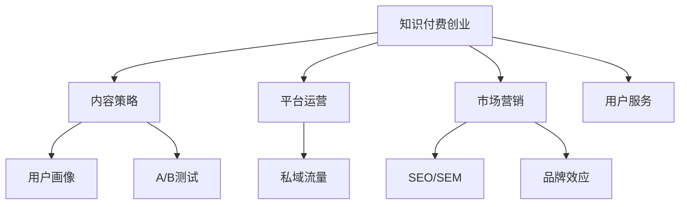

                 

# 知识付费创业者的日常工作安排

## 1. 背景介绍

### 1.1 问题由来
随着互联网的普及和信息技术的快速发展，知识付费正逐渐成为互联网行业的新趋势。相较于传统的广告和订阅模式，知识付费能更直接地将有价值的知识传递给用户，帮助他们在职业发展、学习提升等方面获得更多帮助。

在这一背景下，知识付费创业如雨后春笋般涌现。创业者们通过挖掘内容资源，开发优质课程，搭建知识付费平台，为不同需求的用户提供个性化、专业化的学习服务。但随着市场的快速发展，知识付费创业的竞争日趋激烈，如何高效、精准地进行日常工作安排，成为创业者们亟需解决的问题。

### 1.2 问题核心关键点
知识付费创业者的日常工作安排，主要包括内容制作、平台运营、市场营销、用户服务等多个方面。其核心关键点包括：
1. 内容策略：如何策划和制作优质内容，满足用户多样化、专业化的学习需求。
2. 平台运营：如何高效管理平台，提升用户体验，确保平台的稳定运行。
3. 市场营销：如何精准触达目标用户，推广优质内容，提升平台知名度。
4. 用户服务：如何提供高质量的客户支持，优化用户体验，增强用户黏性。

本文将详细探讨这些关键点，提供一套全面的知识付费创业者日常工作安排的指南。

## 2. 核心概念与联系

### 2.1 核心概念概述

为更好地理解知识付费创业者的日常工作安排，本节将介绍几个密切相关的核心概念：

- **知识付费创业**：指通过平台形式，将高质量、专业化的知识内容转化为付费产品，为用户提供学习和提升服务的过程。

- **内容策略**：指在知识付费平台上，如何策划、制作和推广内容，满足用户的学习需求，提升用户满意度。

- **平台运营**：指通过技术手段和管理措施，保障知识付费平台的稳定运行，提升用户体验和平台活跃度。

- **市场营销**：指通过精准定位和有效推广，将知识付费内容触及目标用户，提升平台的市场影响力。

- **用户服务**：指通过优质的客户支持和互动服务，增强用户黏性，提升用户满意度。

- **用户画像**：指对目标用户进行详细分析，了解其需求、偏好和行为模式，以指导内容制作和市场推广。

- **A/B测试**：指通过随机分流对比实验，评估不同版本或策略的效果，选择最优方案。

- **SEO/SEM**：指搜索引擎优化和搜索引擎营销，通过优化网站内容和结构，提升搜索引擎排名，获取更多流量。

- **私域流量**：指通过平台或社群等手段，积累和维护用户群体，形成稳定的流量来源。

- **品牌效应**：指通过知识付费平台的品牌建设，提升用户的信任感和归属感，增强平台的市场竞争力。

这些核心概念之间的逻辑关系可以通过以下Mermaid流程图来展示：



这个流程图展示了的核心概念及其之间的关系：

1. 知识付费创业是整个过程的起点，内容策略、平台运营、市场营销和用户服务是其主要活动。
2. 内容策略和用户画像指导着内容的制作和推广。
3. 平台运营和私域流量保障了平台的用户体验和稳定性。
4. 市场营销和品牌效应帮助平台获得更多流量和用户。
5. A/B测试和SEO/SEM是优化策略的具体手段。

## 3. 核心算法原理 & 具体操作步骤

### 3.1 算法原理概述

知识付费创业者的日常工作安排，本质上是一个以用户需求为中心，通过内容策略、平台运营、市场营销、用户服务等多个环节协同工作的综合过程。其核心算法原理包括：

- **用户画像分析**：通过对目标用户的行为数据进行分析，构建详细且准确的用户画像，指导内容策略和市场营销。
- **内容策划与制作**：基于用户画像和市场趋势，策划优质内容主题，制作专业、深入的学习材料。
- **平台运营优化**：通过技术手段和有效管理，提升平台的稳定性、易用性和用户体验。
- **市场推广与营销**：利用精准定位和多种推广手段，提升平台知名度和市场影响力。
- **用户服务与反馈**：通过优质的客户支持和互动服务，提升用户满意度，收集用户反馈进行持续改进。

### 3.2 算法步骤详解

知识付费创业者的日常工作安排，通常包括以下关键步骤：

**Step 1: 用户画像构建**
- 收集和分析用户行为数据，包括浏览历史、购买记录、评分反馈等。
- 构建详细用户画像，包括用户基本信息、兴趣偏好、学习需求等。

**Step 2: 内容策划与制作**
- 根据用户画像和市场需求，策划优质内容主题，设计课程大纲。
- 制作专业、深入的学习材料，包括视频、音频、文档等。
- 邀请行业专家进行内容审核和优化。

**Step 3: 平台运营管理**
- 通过技术手段保障平台稳定性，提升用户使用体验。
- 管理用户反馈和投诉，及时解决问题，提升用户满意度。

**Step 4: 市场推广与营销**
- 利用SEO/SEM手段提升平台流量，精准触达目标用户。
- 通过社交媒体、邮件营销等多种方式推广优质内容，提升品牌影响力。

**Step 5: 用户服务与反馈**
- 提供24小时客服支持，解答用户疑问，提供个性化服务。
- 收集用户反馈，进行内容迭代和优化，提升用户满意度。

### 3.3 算法优缺点

知识付费创业者的日常工作安排具有以下优点：

- 系统性：通过多环节协同工作，能够高效满足用户需求，提升用户满意度。
- 精准性：基于用户画像和数据分析，能够精准定位用户需求，制作优质内容。
- 用户黏性：通过优质的客户支持和互动服务，提升用户黏性，增强用户忠诚度。

同时，也存在一定的局限性：

- 工作量庞大：内容制作、平台运营、市场推广和用户服务等环节需要大量投入。
- 数据隐私：收集和分析用户数据，需注意隐私保护和数据安全。
- 市场竞争：知识付费市场竞争激烈，需不断创新和优化才能保持竞争力。

尽管存在这些局限性，但通过系统性的工作安排，知识付费创业者仍能实现高效、精准的日常工作。

### 3.4 算法应用领域

知识付费创业者的日常工作安排，在知识付费平台开发、内容制作、市场推广和用户服务等多个领域均有广泛应用。例如：

- 知识付费平台开发：在平台功能设计、用户界面优化、数据分析等方面进行日常工作安排。
- 内容制作：在内容策划、制作、审核和发布等方面进行日常工作安排。
- 市场推广：在SEO/SEM、社交媒体营销、邮件营销等方面进行日常工作安排。
- 用户服务：在客服支持、用户反馈收集、个性化服务等方面进行日常工作安排。

## 4. 数学模型和公式 & 详细讲解 & 举例说明

### 4.1 数学模型构建

本节将使用数学语言对知识付费创业者的日常工作安排进行更加严格的刻画。

假设知识付费平台有 $N$ 个用户，每个用户每天有 $T$ 次访问行为。设用户画像为 $\mathcal{P}$，内容质量为 $Q$，平台稳定性为 $S$，市场营销效果为 $M$，用户满意度为 $U$。则知识付费创业者的日常工作安排的优化目标为：

$$
\max_{\mathcal{P},Q,S,M,U} \sum_{i=1}^N \left[ \lambda_1 Q_i + \lambda_2 M_i + \lambda_3 U_i \right]
$$

其中 $\lambda_1$、$\lambda_2$、$\lambda_3$ 为权重系数，反映不同因素的重要性。

### 4.2 公式推导过程

根据上述优化目标，知识付费创业者的日常工作安排需要综合考虑以下因素：

1. **用户画像**：通过用户画像分析，了解用户需求和行为，指导内容策划和市场营销。
2. **内容质量**：根据用户画像和市场趋势，策划优质内容主题，制作专业、深入的学习材料。
3. **平台稳定性**：通过技术手段和有效管理，提升平台的稳定性，保障用户流畅使用。
4. **市场营销**：利用精准定位和多种推广手段，提升平台知名度和市场影响力。
5. **用户满意度**：通过优质的客户支持和互动服务，提升用户满意度，收集用户反馈进行持续改进。

### 4.3 案例分析与讲解

以某知识付费平台的日常工作安排为例，进行详细分析：

1. **用户画像构建**
   - 收集和分析用户行为数据，包括浏览历史、购买记录、评分反馈等。
   - 构建详细用户画像，包括用户基本信息、兴趣偏好、学习需求等。
   - 通过A/B测试和数据分析，优化用户画像的构建和分析方法。

2. **内容策划与制作**
   - 根据用户画像和市场需求，策划优质内容主题，设计课程大纲。
   - 制作专业、深入的学习材料，包括视频、音频、文档等。
   - 邀请行业专家进行内容审核和优化，确保内容的专业性和实用性。

3. **平台运营管理**
   - 通过技术手段保障平台稳定性，提升用户使用体验。
   - 管理用户反馈和投诉，及时解决问题，提升用户满意度。
   - 定期进行平台优化，提升平台的加载速度和易用性。

4. **市场推广与营销**
   - 利用SEO/SEM手段提升平台流量，精准触达目标用户。
   - 通过社交媒体、邮件营销等多种方式推广优质内容，提升品牌影响力。
   - 定期进行市场调研和分析，调整推广策略，提升市场效果。

5. **用户服务与反馈**
   - 提供24小时客服支持，解答用户疑问，提供个性化服务。
   - 收集用户反馈，进行内容迭代和优化，提升用户满意度。
   - 通过用户调研和问卷调查，了解用户需求和满意度，指导持续改进。

## 5. 项目实践：代码实例和详细解释说明

### 5.1 开发环境搭建

在进行日常工作安排的实践前，我们需要准备好开发环境。以下是使用Python进行Django开发的环境配置流程：

1. 安装Anaconda：从官网下载并安装Anaconda，用于创建独立的Python环境。

2. 创建并激活虚拟环境：
```bash
conda create -n pyproject python=3.8 
conda activate pyproject
```

3. 安装Django：
```bash
pip install django
```

4. 安装各类工具包：
```bash
pip install numpy pandas scikit-learn matplotlib tqdm jupyter notebook ipython
```

完成上述步骤后，即可在`pyproject-env`环境中开始项目实践。

### 5.2 源代码详细实现

下面我们以知识付费平台的日常工作安排管理为例，给出使用Django开发的代码实现。

首先，定义知识付费平台的模型和数据表：

```python
from django.db import models

class User(models.Model):
    name = models.CharField(max_length=100)
    age = models.IntegerField()
    gender = models.CharField(max_length=10)
    email = models.EmailField()
    # 其他用户信息

class Content(models.Model):
    title = models.CharField(max_length=100)
    description = models.TextField()
    author = models.CharField(max_length=100)
    # 其他内容信息

class Course(models.Model):
    name = models.CharField(max_length=100)
    price = models.DecimalField(max_digits=10, decimal_places=2)
    # 其他课程信息

class Feedback(models.Model):
    user = models.ForeignKey(User, on_delete=models.CASCADE)
    content = models.ForeignKey(Content, on_delete=models.CASCADE)
    rating = models.IntegerField()
    comment = models.TextField()
    # 其他反馈信息
```

然后，定义日常工作安排的视图和控制器：

```python
from django.shortcuts import render, redirect
from django.views.decorators.csrf import csrf_exempt
from .forms import UserForm, ContentForm, FeedbackForm
from .models import User, Content, Course, Feedback

@csrf_exempt
def user_profile(request):
    if request.method == 'POST':
        form = UserForm(request.POST)
        if form.is_valid():
            user = form.save()
            return redirect('home')
    else:
        form = UserForm()
    return render(request, 'user_profile.html', {'form': form})

@csrf_exempt
def course_detail(request, pk):
    course = Course.objects.get(pk=pk)
    return render(request, 'course_detail.html', {'course': course})

@csrf_exempt
def feedback_form(request, pk):
    content = Content.objects.get(pk=pk)
    if request.method == 'POST':
        form = FeedbackForm(request.POST)
        if form.is_valid():
            feedback = form.save(commit=False)
            feedback.content = content
            feedback.user = request.user
            feedback.save()
            return redirect('home')
    else:
        form = FeedbackForm()
    return render(request, 'feedback_form.html', {'form': form, 'content': content})
```

最后，启动Django开发流程并在浏览器中访问：

```bash
python manage.py runserver
```

在浏览器中访问`http://127.0.0.1:8000/`，即可看到知识付费平台的用户管理、课程详情和反馈提交界面。

### 5.3 代码解读与分析

让我们再详细解读一下关键代码的实现细节：

**User类**：
- `__init__`方法：初始化用户的基本信息。
- `__str__`方法：定义用户对象的字符串表示。

**Content类**：
- `__init__`方法：初始化内容的基本信息。
- `__str__`方法：定义内容对象的字符串表示。

**Course类**：
- `__init__`方法：初始化课程的基本信息。
- `__str__`方法：定义课程对象的字符串表示。

**Feedback类**：
- `__init__`方法：初始化反馈的基本信息，包括用户和内容。
- `__str__`方法：定义反馈对象的字符串表示。

**user_profile函数**：
- 通过表单提交用户信息，并保存至数据库。
- 如果表单验证通过，则重定向到首页。
- 否则，显示表单页面。

**course_detail函数**：
- 通过ID获取指定课程信息，并展示课程详情。
- 直接渲染HTML模板，显示课程详情页面。

**feedback_form函数**：
- 通过ID获取指定内容信息，并展示反馈表单。
- 如果表单提交验证通过，则保存反馈信息。
- 否则，显示表单页面。

## 6. 实际应用场景

### 6.1 智能教育平台

知识付费创业者的日常工作安排，在智能教育平台开发中得到广泛应用。教育平台通过提供高质量、专业化的课程和资源，帮助用户进行知识学习和技能提升。

在技术实现上，可以收集用户的课程选择、学习进度、考试成绩等行为数据，并根据数据进行内容推荐和个性化学习路径设计。同时，通过知识付费模式，平台可以获取更多资金投入，提升平台的持续运营能力。

### 6.2 健康管理平台

知识付费创业者的日常工作安排，在健康管理平台的开发中同样有重要应用。健康管理平台通过提供健康科普、饮食指导、运动计划等内容，帮助用户进行健康管理和自我提升。

在技术实现上，可以收集用户的健康数据、行为数据等，进行健康分析和个性化推荐。同时，通过知识付费模式，平台可以获取更多用户粘性和品牌信任度。

### 6.3 职业技能提升平台

知识付费创业者的日常工作安排，在职业技能提升平台开发中也有重要应用。职业技能提升平台通过提供职业技能培训课程和资源，帮助用户提升职业技能，增强就业竞争力。

在技术实现上，可以收集用户的职业背景、培训需求等数据，进行职业技能推荐和个性化学习路径设计。同时，通过知识付费模式，平台可以获取更多用户粘性和品牌信任度。

### 6.4 未来应用展望

随着知识付费创业的不断发展，未来知识付费创业者的日常工作安排将呈现以下趋势：

1. **智能化**：通过人工智能技术，自动化处理数据分析和内容推荐，提升平台运营效率和用户体验。
2. **个性化**：通过用户画像和行为数据分析，提供更加个性化、精准的内容推荐和学习路径设计。
3. **社交化**：通过社交功能，增强用户之间的互动和交流，提升用户参与度和平台黏性。
4. **多平台协同**：通过跨平台整合，实现内容资源的共享和利用，提升平台的整体价值和市场影响力。
5. **国际化**：通过多语言支持和国际化运营，扩大平台的用户覆盖和市场范围。

这些趋势将使知识付费平台更加智能化、个性化和社交化，为用户提供更好的学习体验和平台服务。

## 7. 工具和资源推荐

### 7.1 学习资源推荐

为了帮助知识付费创业者系统掌握日常工作安排的理论基础和实践技巧，这里推荐一些优质的学习资源：

1. **《知识付费创业指南》系列博文**：由知识付费行业专家撰写，涵盖平台运营、内容制作、市场推广、用户服务等多个方面，提供全面的实践指导。

2. **《知识付费平台开发教程》视频课程**：通过实际项目案例，详细讲解知识付费平台开发的技术栈和实践细节。

3. **《知识付费营销策略》书籍**：通过案例分析，提供多种精准定位和市场推广策略，帮助平台提升知名度和用户黏性。

4. **《用户画像构建与分析》课程**：通过实例演示，讲解用户画像的构建和分析方法，提升平台的用户画像精准度。

5. **《Python数据分析实战》书籍**：通过数据分析实战案例，讲解数据清洗、处理和分析技术，提升平台的运营效率和决策能力。

通过对这些资源的学习实践，相信你一定能够快速掌握知识付费创业者的日常工作安排的精髓，并用于解决实际的运营问题。

### 7.2 开发工具推荐

高效的开发离不开优秀的工具支持。以下是几款用于知识付费平台开发的常用工具：

1. **Django**：Python的Web框架，具有强大的数据管理和用户权限管理功能，适合知识付费平台开发。
2. **Flask**：Python的轻量级Web框架，灵活性强，适合快速原型开发和API接口开发。
3. **React**：前端框架，适合构建动态用户界面和交互体验。
4. **MySQL/PostgreSQL**：关系型数据库，适合存储和管理用户数据和课程信息。
5. **Redis/MongoDB**：NoSQL数据库，适合存储和管理用户行为数据和推荐信息。

合理利用这些工具，可以显著提升知识付费平台的开发效率，加快创新迭代的步伐。

### 7.3 相关论文推荐

知识付费创业者的日常工作安排的研究源于学界的持续研究。以下是几篇奠基性的相关论文，推荐阅读：

1. **《知识付费平台的用户画像构建与分析》**：提出用户画像的构建方法和分析技术，帮助平台精准定位用户需求。

2. **《内容推荐系统的协同过滤算法》**：通过协同过滤算法，进行用户行为数据分析和内容推荐，提升平台的用户体验。

3. **《智能推荐系统的研究现状与趋势》**：总结了智能推荐系统的发展现状和未来趋势，为知识付费平台的内容推荐提供指导。

4. **《知识付费平台的用户满意度提升策略》**：提出通过用户反馈和互动服务提升用户满意度的策略，增强平台的用户黏性。

这些论文代表了大语言模型微调技术的发展脉络。通过学习这些前沿成果，可以帮助研究者把握学科前进方向，激发更多的创新灵感。

## 8. 总结：未来发展趋势与挑战

### 8.1 总结

本文对知识付费创业者的日常工作安排进行了全面系统的介绍。首先阐述了知识付费创业的背景和意义，明确了日常工作安排在知识付费平台运营中的重要性。其次，从原理到实践，详细讲解了日常工作安排的数学模型和关键步骤，提供了知识付费平台开发的完整代码实例。同时，本文还探讨了日常工作安排在多个行业领域的应用前景，展示了其广泛的应用潜力。此外，本文精选了日常工作安排的学习资源，力求为知识付费创业者提供全方位的技术指引。

通过本文的系统梳理，可以看到，知识付费创业者的日常工作安排是一个系统性、多环节协同的复杂过程，需要全面考虑用户需求、内容制作、平台运营、市场推广和用户服务等多个方面。通过科学的工作安排和持续优化，知识付费创业者能够高效、精准地进行日常工作，推动知识付费平台的高质量发展。

### 8.2 未来发展趋势

展望未来，知识付费创业者的日常工作安排将呈现以下几个发展趋势：

1. **自动化**：通过人工智能技术，自动化处理数据分析和内容推荐，提升平台运营效率和用户体验。
2. **智能化**：通过用户画像和行为数据分析，提供更加个性化、精准的内容推荐和学习路径设计。
3. **社交化**：通过社交功能，增强用户之间的互动和交流，提升用户参与度和平台黏性。
4. **多平台协同**：通过跨平台整合，实现内容资源的共享和利用，提升平台的整体价值和市场影响力。
5. **国际化**：通过多语言支持和国际化运营，扩大平台的用户覆盖和市场范围。

这些趋势将使知识付费平台更加智能化、个性化和社交化，为用户提供更好的学习体验和平台服务。

### 8.3 面临的挑战

尽管知识付费创业者的日常工作安排已经取得了显著进展，但在迈向更加智能化、普适化应用的过程中，它仍面临着诸多挑战：

1. **用户数据隐私**：收集和分析用户数据，需注意隐私保护和数据安全。
2. **平台运营成本**：知识付费平台的开发和运营需要大量投入，需平衡成本和收益。
3. **内容质量控制**：内容制作和推荐需要严格的质量控制，需建立健全的审核和反馈机制。
4. **市场竞争激烈**：知识付费市场竞争激烈，需不断创新和优化才能保持竞争力。
5. **用户期望提升**：用户对平台的需求和期望不断提升，需不断优化用户体验和平台服务。

尽管存在这些挑战，但通过科学的工作安排和持续优化，知识付费创业者仍能实现高效、精准的日常工作。

### 8.4 研究展望

面对知识付费平台日常工作安排所面临的挑战，未来的研究需要在以下几个方面寻求新的突破：

1. **数据隐私保护**：开发更加安全、透明的数据隐私保护技术，确保用户数据的安全和隐私。
2. **平台运营优化**：通过AI技术和大数据分析，优化平台运营效率和用户体验。
3. **内容质量提升**：建立健全的内容审核和反馈机制，提升内容质量和推荐效果。
4. **市场竞争应对**：通过差异化策略和技术创新，增强平台的市场竞争力和用户黏性。
5. **用户满意度提升**：通过高质量的用户支持和互动服务，提升用户满意度和平台黏性。

这些研究方向将推动知识付费平台的持续发展和创新，为知识付费创业者提供更加高效、精准的日常工作安排指南。面向未来，知识付费创业者需要在数据隐私、平台运营、内容质量、市场竞争和用户满意度等多个方面持续努力，方能推动知识付费平台的健康、可持续发展。总之，知识付费创业者需要在全面考虑用户需求、内容制作、平台运营、市场推广和用户服务等多个方面，不断优化日常工作安排，推动知识付费平台的健康、可持续发展。

