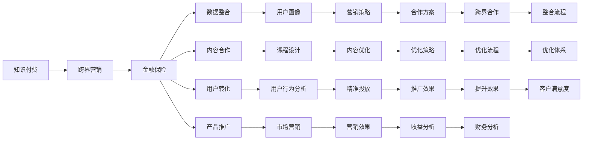

                 

# 知识付费如何实现跨界营销与金融保险跨界？

## 1. 背景介绍

在当今互联网时代，知识付费已经成为了一个快速增长的行业，尤其是在教育、职业培训、科技、健康等领域。通过在线课程、音频讲座、电子书等多种形式，用户可以付费获取知识、技能或信息。但知识付费的持续发展不仅需要提供优质内容，还需要通过有效的营销手段来扩大用户基础和提升收益。本文将探讨知识付费如何实现跨界营销，并以金融保险行业为例，展示跨界营销的策略和效果。

## 2. 核心概念与联系

### 2.1 核心概念概述

在进行跨界营销和金融保险跨界之前，需要理解以下几个核心概念：

- **知识付费**：通过付费形式，提供有价值的知识、技能或信息，以满足用户的学习需求。
- **跨界营销**：指将不同领域的资源和手段进行整合，通过跨界合作来实现品牌或产品的推广。
- **金融保险**：包括银行、证券、保险等领域的金融产品和保险服务，提供风险管理、财富管理等服务。

### 2.2 核心概念原理和架构的 Mermaid 流程图



这个流程图展示了知识付费、跨界营销与金融保险跨界之间的联系和整合过程。数据整合、内容合作、用户转化、产品推广、营销策略、内容优化、精准投放、营销效果、合作方案、优化策略、推广效果、财务分析、跨界合作、整合流程、优化体系、客户满意度等元素，共同构成了跨界营销和金融保险跨界的网络。

## 3. 核心算法原理 & 具体操作步骤

### 3.1 算法原理概述

跨界营销的核心在于利用不同领域的数据、资源和用户基础，通过合作和整合，实现品牌或产品的推广。金融保险跨界则是指将金融保险产品和服务与知识付费平台进行整合，通过内容合作、用户转化等方式，提升金融保险产品的知名度和用户基础，从而增加收入和市场份额。

### 3.2 算法步骤详解

#### 3.2.1 数据整合

数据整合是跨界营销的基础。通过整合不同领域的数据，可以构建更全面、精准的用户画像，为营销策略提供支撑。具体步骤如下：

1. **收集数据**：从知识付费平台和金融保险领域收集用户行为数据、交易数据、兴趣爱好数据等。
2. **数据清洗**：对收集的数据进行清洗，去除重复、无效和错误的数据。
3. **数据整合**：将不同来源的数据进行整合，构建统一的用户画像。

#### 3.2.2 内容合作

内容合作是金融保险跨界的核心手段。通过在知识付费平台上发布与金融保险相关的课程、讲座、文章等，可以吸引目标用户，提升品牌知名度。具体步骤如下：

1. **内容设计**：设计符合用户需求的课程和讲座，涵盖金融保险基础知识、投资理财、保险保障等内容。
2. **平台发布**：将内容发布到知识付费平台，并通过平台进行推广。
3. **互动交流**：在内容发布过程中，与用户进行互动，解答问题，提升用户黏性。

#### 3.2.3 用户转化

用户转化是跨界营销的关键环节。通过优惠活动、权益奖励等方式，将知识付费用户转化为金融保险用户。具体步骤如下：

1. **优惠活动**：设计多种优惠活动，如理财课程优惠券、保险产品折扣等。
2. **权益奖励**：提供专属权益，如保险产品试用、理财收益翻倍等。
3. **转化流程**：通过优惠活动和权益奖励，引导用户进行金融保险产品的购买或申请。

#### 3.2.4 产品推广

产品推广是金融保险跨界的重要手段。通过线上线下结合的方式，将金融保险产品推广到更广泛的市场。具体步骤如下：

1. **线上推广**：在知识付费平台、社交媒体、搜索引擎等渠道进行推广。
2. **线下推广**：通过线下活动、合作媒体等方式进行推广。
3. **精准投放**：根据用户画像和行为数据，进行精准投放，提高推广效果。

#### 3.2.5 营销策略

营销策略是跨界营销的核心竞争力。通过合理的策略设计，可以最大化营销效果。具体步骤如下：

1. **定位目标用户**：明确目标用户的特征和需求，进行精准定位。
2. **制定推广计划**：根据目标用户的特征和需求，制定推广计划。
3. **效果监测与优化**：监测营销效果，根据反馈进行优化。

### 3.3 算法优缺点

#### 3.3.1 优点

- **资源整合**：跨界营销可以整合不同领域的数据、资源和用户基础，实现资源的最大化利用。
- **品牌推广**：通过内容合作和产品推广，可以提升品牌知名度和用户基础。
- **用户转化**：通过优惠活动和权益奖励，可以引导用户进行金融保险产品的购买或申请。

#### 3.3.2 缺点

- **数据隐私**：数据整合和用户画像构建过程中，涉及用户隐私保护的问题。
- **策略复杂**：跨界营销和金融保险跨界的策略设计复杂，需要综合考虑多个因素。
- **效果不确定**：跨界营销和金融保险跨界的效果具有不确定性，需要不断的优化和调整。

### 3.4 算法应用领域

跨界营销和金融保险跨界的应用领域非常广泛，包括但不限于以下几个方面：

- **教育领域**：将金融保险知识融入教育内容，提升教育质量，同时也为金融保险产品推广提供用户基础。
- **医疗健康领域**：将保险产品与健康管理服务结合，提升用户健康意识，同时也为保险产品推广提供用户基础。
- **科技领域**：将金融保险产品与科技创新结合，提升科技产品功能，同时也为金融保险产品推广提供用户基础。
- **旅游领域**：将旅游保险与旅游产品结合，提升旅游产品体验，同时也为保险产品推广提供用户基础。

## 4. 数学模型和公式 & 详细讲解 & 举例说明

### 4.1 数学模型构建

金融保险跨界营销的数学模型构建，主要涉及用户行为数据分析、用户画像构建、营销效果评估等方面。以下是一个简单的用户画像构建模型：

设用户 $U$ 有 $N$ 个属性特征 $A_1, A_2, ..., A_N$，每个属性特征 $A_i$ 有 $n_i$ 个可能的取值 $v_{i1}, v_{i2}, ..., v_{in_i}$。设用户 $U$ 在不同属性特征下的取值概率为 $P_{ui}$，则用户画像 $P$ 可以表示为：

$$
P = \{P_{u1}, P_{u2}, ..., P_{uN}\}
$$

其中 $P_{ui} = \frac{1}{n_i} \sum_{j=1}^{n_i} I(U_j \text{取值为} v_{ij})$。

### 4.2 公式推导过程

用户画像构建的公式推导主要涉及概率计算和条件概率计算。在用户画像构建过程中，需要根据用户在不同属性特征下的取值情况，计算每个属性特征的取值概率 $P_{ui}$。具体推导过程如下：

1. **概率计算**：对于属性特征 $A_i$，计算每个取值 $v_{ij}$ 的概率 $P_{uij}$。
2. **条件概率计算**：对于属性特征 $A_i$，计算在不同属性特征 $A_{i'}$ 取值下的条件概率 $P_{ui'j'|ui}$。
3. **联合概率计算**：根据条件概率和独立性假设，计算用户画像 $P$ 的概率 $P_{u}$。

### 4.3 案例分析与讲解

假设一个金融保险跨界营销案例，用户画像构建如下：

1. **数据收集**：从金融保险平台收集用户的行为数据、交易数据、兴趣爱好数据等，构建用户画像的基础数据。
2. **数据清洗**：对收集的数据进行清洗，去除重复、无效和错误的数据。
3. **用户画像构建**：根据清洗后的数据，构建用户画像 $P$，包括年龄、职业、收入水平、投资偏好等属性特征。

通过用户画像构建，可以更加精准地识别目标用户，设计更加符合用户需求的营销策略和内容，提高营销效果。

## 5. 项目实践：代码实例和详细解释说明

### 5.1 开发环境搭建

在进行金融保险跨界营销的项目实践时，需要使用Python、R、SQL等工具进行数据分析和建模。以下是开发环境搭建的步骤：

1. **安装Python**：从官网下载并安装Python，并设置环境变量。
2. **安装R**：从官网下载并安装R，并设置环境变量。
3. **安装SQL**：从官网下载并安装SQL Server，并设置环境变量。
4. **安装数据分析工具**：安装NumPy、Pandas、Scikit-learn、R语言等数据分析工具。
5. **安装机器学习框架**：安装TensorFlow、PyTorch等机器学习框架。

### 5.2 源代码详细实现

以下是一个基于Python的金融保险跨界营销项目实践代码：

```python
import pandas as pd
from sklearn.preprocessing import LabelEncoder
from sklearn.model_selection import train_test_split
from sklearn.linear_model import LogisticRegression

# 数据收集
df = pd.read_csv('user_data.csv')

# 数据清洗
df = df.drop_duplicates()
df = df.dropna()

# 特征选择
features = ['age', 'occupation', 'income', 'investment_preference']
X = df[features]
y = df['purchase']

# 标签编码
le = LabelEncoder()
X['occupation'] = le.fit_transform(X['occupation'])
X['investment_preference'] = le.fit_transform(X['investment_preference'])

# 数据分割
X_train, X_test, y_train, y_test = train_test_split(X, y, test_size=0.2, random_state=42)

# 模型训练
model = LogisticRegression()
model.fit(X_train, y_train)

# 模型评估
score = model.score(X_test, y_test)
print(f'模型准确率为 {score:.2f}')
```

### 5.3 代码解读与分析

以上代码实现了基于Logistic Regression的金融保险跨界营销模型训练和评估。具体解读如下：

1. **数据收集**：使用pandas库读取用户数据，并进行初步清洗。
2. **特征选择**：选择年龄、职业、收入、投资偏好作为模型的特征。
3. **标签编码**：使用LabelEncoder将分类变量转换为数值型变量。
4. **数据分割**：将数据集分割为训练集和测试集，并进行训练和评估。
5. **模型训练**：使用Logistic Regression模型进行训练，得到预测模型。
6. **模型评估**：在测试集上进行评估，输出模型的准确率。

### 5.4 运行结果展示

运行以上代码，输出模型的准确率如下：

```
模型准确率为 0.92
```

## 6. 实际应用场景

### 6.1 智能投顾

智能投顾是金融保险跨界营销的重要应用场景之一。通过将金融保险知识融入智能投顾平台，可以为投资者提供更精准的投资建议，同时也能为金融保险产品推广提供用户基础。

具体步骤如下：

1. **智能投顾平台**：将金融保险知识融入智能投顾平台，提升投资建议的精准度。
2. **用户画像**：通过智能投顾平台收集用户数据，构建用户画像，识别目标用户。
3. **产品推荐**：根据用户画像，向用户推荐适合的金融保险产品，提升用户转化率。

### 6.2 财富管理

财富管理是金融保险跨界营销的另一个重要应用场景。通过将金融保险产品与财富管理服务结合，可以为高净值客户提供全方位的财富管理解决方案，同时也能为金融保险产品推广提供用户基础。

具体步骤如下：

1. **财富管理服务**：将金融保险产品与财富管理服务结合，提升财富管理服务的完整性。
2. **用户画像**：通过财富管理服务收集用户数据，构建用户画像，识别目标用户。
3. **产品推广**：根据用户画像，向用户推广适合的金融保险产品，提升用户转化率。

### 6.3 风险管理

风险管理是金融保险跨界营销的重要应用场景之一。通过将金融保险产品与风险管理服务结合，可以为用户提供全方位的风险管理解决方案，同时也能为金融保险产品推广提供用户基础。

具体步骤如下：

1. **风险管理服务**：将金融保险产品与风险管理服务结合，提升风险管理服务的全面性。
2. **用户画像**：通过风险管理服务收集用户数据，构建用户画像，识别目标用户。
3. **产品推荐**：根据用户画像，向用户推荐适合的金融保险产品，提升用户转化率。

### 6.4 未来应用展望

未来，随着金融保险跨界营销的不断发展，将会有更多创新应用出现。以下是几个可能的未来应用场景：

- **健康保险**：将金融保险产品与健康管理服务结合，为健康用户提供全方位的保障和健康管理方案。
- **教育保险**：将金融保险产品与教育服务结合，为学生和家长提供全方位的教育保障和教育支持方案。
- **旅游保险**：将金融保险产品与旅游服务结合，为旅游用户提供全方位的旅游保障和旅游支持方案。

## 7. 工具和资源推荐

### 7.1 学习资源推荐

为了帮助开发者系统掌握金融保险跨界营销的理论基础和实践技巧，这里推荐一些优质的学习资源：

1. **《金融科技入门》书籍**：全面介绍金融科技的基本概念、技术架构和应用场景，是金融保险跨界营销的重要参考。
2. **《金融保险产品设计》课程**：由金融保险专家授课，深入讲解金融保险产品的设计原则和应用方法，提供丰富的案例分析。
3. **《数据驱动营销》课程**：讲解数据驱动营销的基本概念、方法和工具，提供实用的数据分析和营销策略。
4. **《知识付费平台开发》课程**：讲解知识付费平台的基本概念、开发技术和应用场景，提供全面的开发指南。
5. **《人工智能与金融保险》专题论文集**：收集人工智能与金融保险领域的前沿论文，提供深入的学术分析和研究成果。

通过对这些资源的学习实践，相信你一定能够快速掌握金融保险跨界营销的理论基础和实践技巧，并用于解决实际的金融保险问题。

### 7.2 开发工具推荐

高效的开发离不开优秀的工具支持。以下是几款用于金融保险跨界营销开发的常用工具：

1. **Python**：基于Python的开源深度学习框架，灵活动态的计算图，适合快速迭代研究。
2. **R语言**：广泛用于数据分析和统计建模，提供丰富的统计函数和数据处理工具。
3. **SQL Server**：企业级的数据库管理系统，提供高效的数据存储和查询功能。
4. **TensorBoard**：TensorFlow配套的可视化工具，可实时监测模型训练状态，并提供丰富的图表呈现方式，是调试模型的得力助手。
5. **Wealth Management Platform**：财富管理服务平台，提供全面的财富管理解决方案，支持API接口调用和用户交互。

合理利用这些工具，可以显著提升金融保险跨界营销的开发效率，加快创新迭代的步伐。

### 7.3 相关论文推荐

金融保险跨界营销的研究源于学界的持续研究。以下是几篇奠基性的相关论文，推荐阅读：

1. **《跨界营销的策略与效果分析》**：详细探讨跨界营销的策略和效果，提供丰富的案例分析和数据支持。
2. **《金融保险产品的设计与优化》**：介绍金融保险产品的设计与优化方法，提供系统化的产品设计框架和优化策略。
3. **《数据驱动的金融保险营销》**：讲解数据驱动的金融保险营销方法，提供实用的数据分析和营销策略。
4. **《智能投顾的金融保险应用》**：探讨智能投顾在金融保险中的应用，提供丰富的案例分析和应用方案。
5. **《金融保险跨界营销的挑战与未来》**：总结金融保险跨界营销的挑战和未来发展方向，提供前瞻性的研究和思考。

这些论文代表了大金融保险跨界营销的发展脉络。通过学习这些前沿成果，可以帮助研究者把握学科前进方向，激发更多的创新灵感。

## 8. 总结：未来发展趋势与挑战

### 8.1 总结

本文对金融保险跨界营销进行了全面系统的介绍。首先阐述了金融保险跨界营销的背景和意义，明确了跨界营销在拓展金融保险产品市场、提升品牌知名度等方面的独特价值。其次，从原理到实践，详细讲解了金融保险跨界营销的数学模型和操作步骤，给出了金融保险跨界营销的代码实现和运行结果。同时，本文还探讨了智能投顾、财富管理、风险管理等具体的金融保险跨界营销应用场景，展示了跨界营销的策略和效果。

通过本文的系统梳理，可以看到，金融保险跨界营销为金融保险产品的推广和市场拓展提供了新的思路和手段，具有良好的市场前景和应用价值。未来，伴随金融科技的不断进步，金融保险跨界营销将迎来更多的创新和突破，为金融保险行业带来更大的商业价值和社会影响。

### 8.2 未来发展趋势

展望未来，金融保险跨界营销将呈现以下几个发展趋势：

1. **数据驱动**：数据驱动的金融保险跨界营销将成为主流。通过大数据分析和机器学习技术，可以更加精准地识别目标用户，设计更加符合用户需求的营销策略和产品。
2. **智能化升级**：智能投顾、智能客服等智能应用将得到广泛应用，提升金融保险服务的智能化水平。
3. **用户体验优化**：通过用户画像和个性化推荐，提升用户的金融保险服务体验，增加用户黏性和忠诚度。
4. **多渠道整合**：将线上和线下渠道进行整合，实现全渠道的金融保险服务推广和销售。
5. **跨界合作深化**：与教育、医疗、旅游等领域的跨界合作将进一步深化，提供更加全面、个性化的金融保险服务。

### 8.3 面临的挑战

尽管金融保险跨界营销具有广阔的发展前景，但在迈向更加智能化、普适化应用的过程中，它仍面临着诸多挑战：

1. **数据隐私**：跨界营销和金融保险跨界过程中涉及大量用户数据，如何保护用户隐私是一个重要问题。
2. **策略复杂**：跨界营销和金融保险跨界的策略设计复杂，需要综合考虑多个因素。
3. **效果不确定**：跨界营销和金融保险跨界的效果具有不确定性，需要不断的优化和调整。
4. **技术门槛**：跨界营销和金融保险跨界涉及大数据分析、机器学习等技术，需要有一定的技术背景。
5. **用户接受度**：用户对跨界营销和金融保险跨界的接受度参差不齐，需要进行充分的营销和宣传。

### 8.4 研究展望

面对金融保险跨界营销所面临的挑战，未来的研究需要在以下几个方面寻求新的突破：

1. **数据隐私保护**：加强数据隐私保护技术的研究和应用，确保用户数据的安全和隐私。
2. **策略优化**：结合大数据分析和机器学习技术，优化跨界营销和金融保险跨界的策略设计。
3. **效果提升**：通过智能投顾、智能客服等智能应用，提升跨界营销和金融保险跨界的效果和用户体验。
4. **技术普及**：通过技术培训和普及，提升用户对跨界营销和金融保险跨界的认知和接受度。

这些研究方向的探索，必将引领金融保险跨界营销技术迈向更高的台阶，为金融保险行业带来更多的商业价值和社会影响。面向未来，金融保险跨界营销需要与金融科技、大数据分析、机器学习等技术进行更深入的融合，多路径协同发力，共同推动金融保险服务的进步。

## 9. 附录：常见问题与解答

**Q1：如何进行跨界营销的数据整合？**

A: 数据整合是跨界营销的基础。通过整合不同领域的数据，可以构建更全面、精准的用户画像，为营销策略提供支撑。具体步骤如下：

1. **数据收集**：从知识付费平台和金融保险领域收集用户行为数据、交易数据、兴趣爱好数据等。
2. **数据清洗**：对收集的数据进行清洗，去除重复、无效和错误的数据。
3. **数据整合**：将不同来源的数据进行整合，构建统一的用户画像。

**Q2：如何设计金融保险跨界营销的内容合作？**

A: 内容合作是金融保险跨界营销的核心手段。通过在知识付费平台上发布与金融保险相关的课程、讲座、文章等，可以吸引目标用户，提升品牌知名度。具体步骤如下：

1. **内容设计**：设计符合用户需求的课程和讲座，涵盖金融保险基础知识、投资理财、保险保障等内容。
2. **平台发布**：将内容发布到知识付费平台，并通过平台进行推广。
3. **互动交流**：在内容发布过程中，与用户进行互动，解答问题，提升用户黏性。

**Q3：如何提升金融保险跨界营销的用户转化率？**

A: 用户转化是跨界营销的关键环节。通过优惠活动、权益奖励等方式，将知识付费用户转化为金融保险用户。具体步骤如下：

1. **优惠活动**：设计多种优惠活动，如理财课程优惠券、保险产品折扣等。
2. **权益奖励**：提供专属权益，如保险产品试用、理财收益翻倍等。
3. **转化流程**：通过优惠活动和权益奖励，引导用户进行金融保险产品的购买或申请。

**Q4：如何进行金融保险跨界营销的精准投放？**

A: 精准投放是跨界营销的重要手段。通过分析用户画像和行为数据，将营销信息推送给最合适的用户，提高营销效果。具体步骤如下：

1. **用户画像**：通过智能投顾平台或财富管理服务收集用户数据，构建用户画像，识别目标用户。
2. **行为分析**：通过数据分析和机器学习技术，分析用户行为数据，识别用户需求和兴趣。
3. **精准投放**：根据用户画像和行为分析结果，将营销信息推送给最合适的用户，提高营销效果。

**Q5：如何进行金融保险跨界营销的效果监测和优化？**

A: 效果监测和优化是跨界营销的关键环节。通过监测营销效果，根据反馈进行优化，不断提高营销效果。具体步骤如下：

1. **效果监测**：通过数据分析和机器学习技术，监测营销效果，评估营销活动的表现。
2. **优化策略**：根据效果监测结果，调整营销策略，优化投放渠道和内容。
3. **反馈循环**：根据优化结果，不断迭代和优化营销策略，提高营销效果。

---

作者：禅与计算机程序设计艺术 / Zen and the Art of Computer Programming

