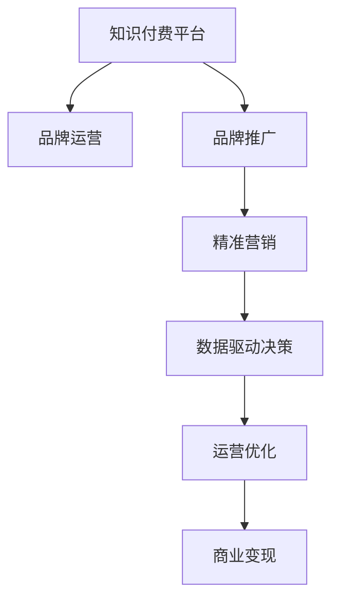

                 

# 知识付费赚钱的品牌品牌运营与品牌推广策略

> 关键词：知识付费,品牌运营,品牌推广,策略

## 1. 背景介绍

### 1.1 问题由来
随着互联网技术的发展，知识付费成为新兴的教育方式。知识付费平台的崛起为品牌提供了新的营销渠道，让品牌能够借助知识传授，提升自身价值，实现精准营销。如何高效运营知识付费平台，利用品牌推广策略，提高市场份额，实现商业变现，是品牌面临的重要课题。

### 1.2 问题核心关键点
知识付费平台品牌运营与品牌推广的核心关键点在于：
1. **内容质量**：优质内容是知识付费平台的立身之本。
2. **用户粘性**：如何通过精准营销，增加用户黏性，提升平台活跃度。
3. **商业变现**：如何将平台流量转化为商业收益。
4. **品牌价值**：通过品牌推广，提升品牌知名度和影响力，形成品牌资产。
5. **数据驱动**：利用大数据分析，优化运营策略，提升决策效率。

## 2. 核心概念与联系

### 2.1 核心概念概述

为了更好地理解知识付费品牌运营与品牌推广策略，本节将介绍几个密切相关的核心概念：

- **知识付费**：指用户为获取特定知识或技能，通过订阅、购买、打赏等方式支付费用的教育服务形式。知识付费平台包括但不限于喜马拉雅、得到、知乎等。

- **品牌运营**：指品牌通过策划、实施和运营，塑造和提升品牌形象，增强市场竞争力的过程。

- **品牌推广**：指品牌通过广告、公关、市场活动等手段，提升品牌知名度和市场影响力的策略。

- **精准营销**：指品牌针对特定目标用户群体，进行精细化营销，提高营销效果和投资回报率。

- **数据驱动决策**：指品牌通过收集、分析和应用数据，指导运营决策，优化市场策略的过程。

这些核心概念之间的逻辑关系可以通过以下Mermaid流程图来展示：



这个流程图展示了的核心概念之间的逻辑关系：

1. 知识付费平台通过品牌运营和品牌推广提升品牌知名度。
2. 品牌推广包括精准营销，以提升用户黏性和平台活跃度。
3. 精准营销依赖于数据驱动决策，以优化用户画像和运营策略。
4. 数据驱动决策指导运营优化，提升平台运营效率。
5. 运营优化最终实现商业变现，形成良性循环。

## 3. 核心算法原理 & 具体操作步骤

### 3.1 算法原理概述

知识付费平台品牌运营与品牌推广的核心算法原理主要基于以下三个方面：

1. **用户行为分析**：通过分析用户行为数据，了解用户需求和偏好，进行个性化推荐，提升用户体验。
2. **数据驱动决策**：利用大数据分析技术，挖掘用户特征和市场趋势，指导运营策略调整。
3. **营销效果评估**：通过量化指标评估营销效果，不断优化营销方案，提升ROI（投资回报率）。

### 3.2 算法步骤详解

知识付费平台品牌运营与品牌推广的一般步骤包括：

**Step 1: 数据分析与用户画像**

1. 收集平台用户数据，包括浏览记录、购买记录、评分反馈等。
2. 利用数据挖掘和机器学习技术，构建用户画像，分析用户特征、兴趣和行为模式。
3. 通过聚类分析、分类算法等，识别出高价值用户群体和潜在市场机会。

**Step 2: 内容推荐与用户体验优化**

1. 根据用户画像，利用协同过滤、基于内容的推荐算法，进行个性化内容推荐。
2. 实时监控推荐效果，优化推荐算法，提高用户体验。
3. 利用A/B测试，对比不同推荐策略的效果，选择最优方案。

**Step 3: 精准营销与品牌推广**

1. 基于用户画像，设计精准营销活动，如定制化广告、会员特权、专属优惠等。
2. 利用SEO、SEM等手段提升平台搜索引擎排名和曝光度。
3. 利用社交媒体、KOL（关键意见领袖）等渠道，进行品牌宣传和用户互动。

**Step 4: 数据驱动决策与运营优化**

1. 收集平台运营数据，包括用户增长、收入、转化率等关键指标。
2. 利用数据分析工具，进行趋势分析和预测，指导运营决策。
3. 定期回顾运营策略效果，及时调整和优化。

**Step 5: 商业变现与收益分析**

1. 利用数据分析，识别高价值用户和高效转化路径。
2. 设计灵活的定价策略，如订阅模式、按需模式等。
3. 利用大数据分析，进行用户生命周期价值（CLV）预测，优化收益策略。

### 3.3 算法优缺点

知识付费平台品牌运营与品牌推广的算法具有以下优点：

1. **提升用户体验**：个性化推荐和精准营销提高了用户满意度和粘性。
2. **优化运营效率**：数据分析和机器学习提升了运营决策的精准性。
3. **提高商业回报**：通过数据驱动，实现了高投资回报率。

同时，该算法也存在以下局限性：

1. **依赖数据质量**：数据收集和分析的准确性直接影响到品牌运营的效果。
2. **用户隐私问题**：大量用户数据的收集和分析可能引发用户隐私问题。
3. **动态市场环境**：用户行为和市场环境变化迅速，需要实时调整运营策略。
4. **技术门槛较高**：数据挖掘和机器学习算法复杂，需要较高技术水平。

尽管存在这些局限性，但就目前而言，基于数据分析和机器学习的品牌运营与推广策略仍然是最主流的范式。未来相关研究将重点在于如何进一步提升数据处理效率，增强算法透明度和用户隐私保护。

### 3.4 算法应用领域

基于知识付费平台品牌运营与品牌推广的算法，已经在多个领域得到广泛应用，例如：

- **教育培训**：利用品牌推广提升教育机构知名度，通过精准营销增加用户黏性。
- **职业技能培训**：通过品牌运营推广，吸引高价值用户，提高平台专业性。
- **商业咨询**：为品牌提供商业知识付费服务，提升品牌价值和市场影响力。
- **个人成长**：通过品牌推广吸引个人用户，提升平台活跃度和用户忠诚度。

除了上述这些经典应用外，知识付费平台品牌运营与品牌推广的方法也在不断创新，如利用大数据进行市场细分，通过跨平台营销提升品牌曝光度等，为品牌带来了新的发展机遇。

## 4. 数学模型和公式 & 详细讲解

### 4.1 数学模型构建

在知识付费平台品牌运营与品牌推广的算法中，主要涉及以下数学模型：

1. **用户行为模型**：描述用户行为与需求之间的关系，形式化表示为：
   $$
   P(X|U) = \mathop{\arg\min}_{P(U|X)} P(X)
   $$
   其中 $P(U|X)$ 表示用户行为与需求之间的关系，$P(X)$ 表示用户行为概率分布。

2. **推荐模型**：基于协同过滤、基于内容的推荐算法，形式化表示为：
   $$
   \hat{y} = f(X;\theta)
   $$
   其中 $f$ 为推荐函数，$\theta$ 为模型参数。

3. **营销效果评估模型**：衡量营销活动效果，形式化表示为：
   $$
   \text{ROI} = \frac{\text{净收益}}{\text{投资成本}}
   $$

### 4.2 公式推导过程

1. **用户行为模型推导**：
   - 利用贝叶斯定理，对用户需求进行预测：
     $$
     P(U|X) = \frac{P(X|U)P(U)}{P(X)}
     $$
   - 利用最大化后验概率原则，选择最优用户需求：
     $$
     P(U|X) = \mathop{\arg\max}_{P(U|X)} P(U|X)
     $$

2. **推荐模型推导**：
   - 利用协同过滤算法，对用户历史行为进行分析，构建推荐模型：
     $$
     \hat{y} = \sum_{i=1}^{n} \alpha_i \times y_i
     $$
   - 利用基于内容的推荐算法，对用户兴趣进行预测：
     $$
     \hat{y} = \mathop{\arg\max}_{P(y)} P(y|X)
     $$

3. **营销效果评估模型推导**：
   - 利用ROI公式，计算营销活动效果：
     $$
     \text{ROI} = \frac{\text{净收益}}{\text{投资成本}}
     $$
   - 利用A/B测试，评估不同营销策略的效果：
     $$
     P(\text{控制组}) = \frac{\text{控制组用户数}}{\text{总用户数}}
     $$
     $$
     P(\text{实验组}) = \frac{\text{实验组用户数}}{\text{总用户数}}
     $$

### 4.3 案例分析与讲解

**案例1：用户行为分析**

某知识付费平台收集到大量用户数据，包括浏览记录、购买记录、评分反馈等。通过数据挖掘技术，构建用户画像，分析用户特征和行为模式。利用聚类算法，识别出高价值用户群体。例如，通过K-means算法，将用户分为高价值用户、中等价值用户和低价值用户。

**案例2：内容推荐**

利用协同过滤算法，对用户历史行为进行分析，生成推荐列表。例如，对于用户A，其最近浏览了《Python基础》和《数据分析入门》，根据相似度算法，推荐类似主题的内容。利用基于内容的推荐算法，根据用户兴趣预测推荐结果。例如，用户B偏好技术类内容，推荐其《机器学习实战》和《算法设计与分析》等书籍。

**案例3：精准营销与品牌推广**

设计精准营销活动，如定制化广告、会员特权、专属优惠等。例如，针对高价值用户，提供VIP会员特权，增加用户黏性。利用SEO技术，提升平台搜索引擎排名和曝光度。例如，通过关键词优化，提升平台在搜索结果中的排名。利用社交媒体、KOL等渠道，进行品牌宣传和用户互动。例如，与KOL合作，发布优质内容，吸引更多用户关注。

## 5. 项目实践：代码实例和详细解释说明

### 5.1 开发环境搭建

在进行知识付费品牌运营与品牌推广的实践前，我们需要准备好开发环境。以下是使用Python进行Pandas和Scikit-learn开发的环境配置流程：

1. 安装Anaconda：从官网下载并安装Anaconda，用于创建独立的Python环境。

2. 创建并激活虚拟环境：
```bash
conda create -n brand-op-env python=3.8 
conda activate brand-op-env
```

3. 安装Pandas和Scikit-learn：
```bash
conda install pandas scikit-learn -c conda-forge
```

4. 安装其他工具包：
```bash
pip install matplotlib numpy jupyter notebook ipython
```

完成上述步骤后，即可在`brand-op-env`环境中开始品牌运营与推广的实践。

### 5.2 源代码详细实现

下面以用户行为分析为例，给出使用Pandas和Scikit-learn进行品牌运营分析的Python代码实现。

```python
import pandas as pd
from sklearn.cluster import KMeans
from sklearn.preprocessing import LabelEncoder

# 读取用户数据
data = pd.read_csv('user_data.csv')

# 用户特征选择
features = ['浏览时长', '购买频率', '评分']
X = data[features]

# 标签选择
label = '用户价值'

# 标签编码
encoder = LabelEncoder()
y = encoder.fit_transform(data[label])

# 聚类分析
kmeans = KMeans(n_clusters=3, random_state=0)
kmeans.fit(X)

# 输出聚类结果
data['cluster'] = kmeans.labels_
print(data.groupby('cluster')['浏览时长'].mean())
```

### 5.3 代码解读与分析

让我们再详细解读一下关键代码的实现细节：

**用户行为分析代码解释**：

- 使用Pandas库读取用户数据，并进行特征选择。
- 使用LabelEncoder对标签进行编码，便于模型处理。
- 使用KMeans算法进行聚类分析，识别出高价值用户群体。
- 使用print函数输出聚类结果，以便后续进一步分析。

**代码解读与分析**：

- 用户行为分析的代码利用了Pandas和Scikit-learn库，进行数据读取、特征选择、标签编码和聚类分析。
- 通过选择合适的特征和标签，使用KMeans算法进行聚类，将用户分为高价值用户、中等价值用户和低价值用户。
- 代码简单易懂，结构清晰，便于理解和扩展。

**用户行为分析案例**：

- 某知识付费平台收集到大量用户数据，包括浏览记录、购买记录、评分反馈等。
- 利用用户行为分析代码，构建用户画像，分析用户特征和行为模式。
- 通过聚类算法，识别出高价值用户群体，从而进行精准营销和品牌推广。

## 6. 实际应用场景

### 6.1 在线教育平台

在线教育平台可以通过品牌运营与品牌推广策略，提升平台知名度和用户黏性，实现商业变现。具体而言，平台可以通过知识付费课程、广告营销、社交媒体推广等方式，吸引用户注册和付费，增加平台流量和收入。

在技术实现上，可以利用用户行为分析，识别出高价值用户群体，进行精准营销。例如，对于高价值用户，提供VIP会员特权，增加用户黏性。利用社交媒体平台，进行品牌宣传和用户互动，提升平台影响力。

### 6.2 职业培训机构

职业培训机构可以利用品牌运营与品牌推广策略，提升品牌专业性和市场影响力。具体而言，培训机构可以通过知识付费课程、合作KOL、广告投放等方式，吸引目标用户，增加平台流量和收入。

在技术实现上，可以利用用户行为分析，构建用户画像，进行个性化推荐。例如，对于技术类课程，推荐相关领域的书籍、视频等资源。利用品牌推广，提升机构知名度和市场影响力。

### 6.3 商业咨询平台

商业咨询平台可以通过品牌运营与品牌推广策略，为品牌提供商业知识付费服务，提升品牌价值和市场影响力。具体而言，平台可以通过知识付费课程、咨询服务、广告投放等方式，吸引用户注册和付费，增加平台流量和收入。

在技术实现上，可以利用用户行为分析，识别出高价值用户群体，进行精准营销。例如，对于高价值用户，提供专属咨询服务，增加用户黏性。利用品牌推广，提升平台知名度和市场影响力。

### 6.4 未来应用展望

随着知识付费平台品牌运营与品牌推广的不断发展，未来将呈现以下几个趋势：

1. **智能化运营**：利用AI技术，进行自动化的品牌运营和营销决策，提升运营效率和效果。
2. **个性化营销**：通过精准营销，提升用户满意度和粘性，实现精细化运营。
3. **数据驱动决策**：利用大数据分析，进行市场趋势预测和运营策略调整，提升决策精准性。
4. **跨平台营销**：利用多渠道营销，提升平台曝光度和用户覆盖面。
5. **品牌生态系统**：构建品牌生态系统，通过品牌合作和品牌联盟，扩大品牌影响力。

这些趋势将进一步推动知识付费平台的发展，为品牌带来更多的商业机会和价值提升。

## 7. 工具和资源推荐

### 7.1 学习资源推荐

为了帮助开发者系统掌握知识付费平台品牌运营与品牌推广的理论基础和实践技巧，这里推荐一些优质的学习资源：

1. 《知识付费市场研究报告》：由知名市场研究机构发布的行业报告，提供丰富的市场数据和分析，帮助理解行业趋势。

2. 《用户行为分析与个性化推荐》书籍：详细讲解了用户行为分析和推荐算法的理论和实践，是品牌运营的必备书籍。

3. 《品牌营销战略》课程：知名高校开设的品牌营销课程，涵盖品牌战略、品牌传播、品牌管理等内容，深入浅出地讲解品牌运营的核心概念。

4. 《数据驱动品牌运营》博客：由品牌运营专家撰写的博客，分享品牌运营与数据驱动决策的实践经验和案例分析。

5. 《知识付费平台运营策略》研讨会：定期举行的品牌运营和推广策略研讨会，汇聚行业专家和从业者，分享最新的运营经验和市场趋势。

通过对这些资源的学习实践，相信你一定能够快速掌握知识付费平台品牌运营与品牌推广的精髓，并用于解决实际的运营问题。

### 7.2 开发工具推荐

高效的开发离不开优秀的工具支持。以下是几款用于知识付费品牌运营与品牌推广开发的常用工具：

1. Python：作为数据科学和机器学习的主流语言，Python具有强大的数据处理和分析能力，适合品牌运营与推广的开发。

2. Pandas：数据处理和分析的首选库，提供了丰富的数据结构和数据操作函数，便于数据预处理和分析。

3. Scikit-learn：机器学习库，提供了多种分类、聚类、回归等算法，适合品牌运营与推广的特征工程和模型训练。

4. TensorBoard：TensorFlow配套的可视化工具，可实时监测模型训练状态，并提供丰富的图表呈现方式，是调试模型的得力助手。

5. Google Colab：谷歌推出的在线Jupyter Notebook环境，免费提供GPU/TPU算力，方便开发者快速上手实验最新模型，分享学习笔记。

合理利用这些工具，可以显著提升知识付费品牌运营与品牌推广任务的开发效率，加快创新迭代的步伐。

### 7.3 相关论文推荐

知识付费平台品牌运营与品牌推广的研究源于学界的持续研究。以下是几篇奠基性的相关论文，推荐阅读：

1. "Brand Building in the Age of Digital Transformation"：探讨了数字时代品牌建设的新趋势和方法，提出了基于数据驱动的品牌运营策略。

2. "The Impact of Personalization on Customer Loyalty"：研究了个性化推荐对用户忠诚度的影响，提出了基于用户画像的精准营销策略。

3. "Brand Positioning in the Age of Social Media"：探讨了社交媒体对品牌定位的影响，提出了利用社交媒体进行品牌推广的方法。

4. "Data-Driven Marketing Strategies"：详细介绍了数据驱动的营销策略，提出了利用大数据分析指导营销决策的方法。

这些论文代表了大语言模型微调技术的发展脉络。通过学习这些前沿成果，可以帮助研究者把握学科前进方向，激发更多的创新灵感。

## 8. 总结：未来发展趋势与挑战

### 8.1 总结

本文对知识付费平台品牌运营与品牌推广方法进行了全面系统的介绍。首先阐述了知识付费平台的背景和品牌运营与推广的核心关键点，明确了品牌运营与推广在提升用户体验、优化运营效率、提高商业回报和形成品牌资产方面的重要价值。其次，从原理到实践，详细讲解了用户行为分析、内容推荐、精准营销和数据驱动决策的数学模型和算法步骤，给出了品牌运营与推广任务开发的完整代码实例。同时，本文还广泛探讨了品牌运营与推广在教育培训、职业技能培训、商业咨询和个人成长等众多领域的应用前景，展示了品牌运营与推广范式的巨大潜力。此外，本文精选了品牌运营与推广的各类学习资源，力求为读者提供全方位的技术指引。

通过本文的系统梳理，可以看到，知识付费平台品牌运营与品牌推广方法正在成为品牌运营的重要范式，极大地拓展了品牌营销的边界，催生了更多的落地场景。受益于大数据和机器学习的不断发展，品牌运营与推广技术的准确性和高效性将进一步提升，品牌运营与推广必将在品牌管理和市场推广中扮演越来越重要的角色。

### 8.2 未来发展趋势

展望未来，知识付费平台品牌运营与品牌推广技术将呈现以下几个发展趋势：

1. **智能化运营**：利用AI技术，进行自动化的品牌运营和营销决策，提升运营效率和效果。
2. **个性化营销**：通过精准营销，提升用户满意度和粘性，实现精细化运营。
3. **数据驱动决策**：利用大数据分析，进行市场趋势预测和运营策略调整，提升决策精准性。
4. **跨平台营销**：利用多渠道营销，提升平台曝光度和用户覆盖面。
5. **品牌生态系统**：构建品牌生态系统，通过品牌合作和品牌联盟，扩大品牌影响力。

这些趋势凸显了知识付费平台品牌运营与品牌推广技术的广阔前景。这些方向的探索发展，必将进一步提升品牌运营与推广的效果，为品牌带来更多的商业机会和价值提升。

### 8.3 面临的挑战

尽管知识付费平台品牌运营与品牌推广技术已经取得了瞩目成就，但在迈向更加智能化、普适化应用的过程中，它仍面临着诸多挑战：

1. **数据质量问题**：数据收集和分析的准确性直接影响到品牌运营的效果。
2. **用户隐私问题**：大量用户数据的收集和分析可能引发用户隐私问题。
3. **动态市场环境**：用户行为和市场环境变化迅速，需要实时调整运营策略。
4. **技术门槛较高**：数据挖掘和机器学习算法复杂，需要较高技术水平。

尽管存在这些挑战，但就目前而言，基于数据分析和机器学习的品牌运营与推广策略仍然是最主流的范式。未来相关研究将重点在于如何进一步提升数据处理效率，增强算法透明度和用户隐私保护。

### 8.4 研究展望

面对知识付费平台品牌运营与品牌推广所面临的种种挑战，未来的研究需要在以下几个方面寻求新的突破：

1. **智能化运营优化**：利用AI技术，优化品牌运营与推广决策，提升运营效率和效果。
2. **个性化营销提升**：通过精准营销，提升用户满意度和粘性，实现精细化运营。
3. **数据驱动决策优化**：利用大数据分析，进行市场趋势预测和运营策略调整，提升决策精准性。
4. **跨平台营销创新**：利用多渠道营销，提升平台曝光度和用户覆盖面。
5. **品牌生态系统构建**：构建品牌生态系统，通过品牌合作和品牌联盟，扩大品牌影响力。

这些研究方向将引领知识付费平台品牌运营与品牌推广技术迈向更高的台阶，为品牌运营与推广带来新的突破，推动品牌管理和市场推广的进步。

## 9. 附录：常见问题与解答

**Q1：如何构建用户画像？**

A: 构建用户画像需要收集和分析用户行为数据，包括浏览记录、购买记录、评分反馈等。利用数据挖掘和机器学习技术，识别用户特征和行为模式。例如，通过K-means算法进行聚类分析，将用户分为高价值用户、中等价值用户和低价值用户。

**Q2：如何实现精准营销？**

A: 实现精准营销需要了解用户画像和市场环境，设计个性化的营销活动。例如，对于高价值用户，提供VIP特权，增加用户黏性。利用社交媒体平台，进行品牌宣传和用户互动，提升平台影响力。利用SEO技术，提升平台搜索引擎排名和曝光度。

**Q3：如何评估营销效果？**

A: 利用数据分析，评估营销活动效果。例如，利用ROI公式计算投资回报率，评估不同营销策略的效果。通过A/B测试，对比控制组和实验组的用户行为数据，选择最优方案。

**Q4：如何优化运营策略？**

A: 利用数据分析，进行市场趋势预测和运营策略调整。例如，通过数据分析，识别出高价值用户群体，进行精准营销。利用大数据分析，进行用户行为预测和内容推荐优化。利用AI技术，进行自动化的品牌运营和营销决策，提升运营效率和效果。

**Q5：如何构建品牌生态系统？**

A: 构建品牌生态系统需要与其他品牌进行合作和联盟，扩大品牌影响力。例如，与其他知识付费平台进行合作，共享用户资源和课程内容。利用社交媒体平台，与其他品牌进行互动和联合营销，提升品牌曝光度。

通过对这些问题的解答，可以帮助品牌运营与推广的从业者更好地理解相关技术，解决实际运营中的问题，提升运营效果和品牌价值。

---

作者：禅与计算机程序设计艺术 / Zen and the Art of Computer Programming

