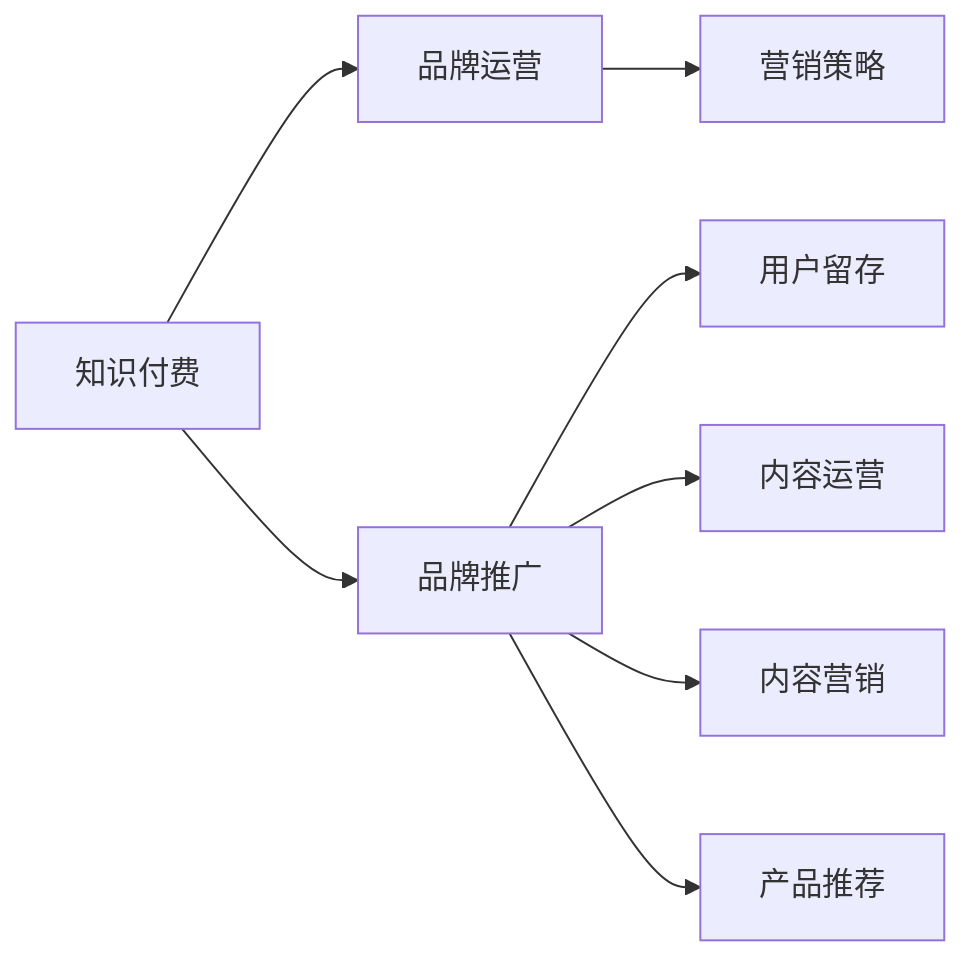

                 

# 知识付费赚钱的品牌品牌运营与品牌推广策略

> 关键词：知识付费,品牌运营,品牌推广,营销策略,用户留存,内容运营,内容营销,产品推荐

## 1. 背景介绍

随着互联网的普及和技术的不断发展，知识付费成为了一种新的商业模式，通过提供有价值的知识内容来吸引用户付费订阅，从而实现盈利。然而，知识付费平台要实现长期稳定的盈利，不仅需要优质的内容，还需要有效的品牌运营和推广策略。本文将从品牌品牌运营与品牌推广策略的角度，探讨如何通过有效的市场定位、品牌建设、用户运营和内容创新，提升知识付费平台的品牌价值和用户粘性，实现商业盈利。

## 2. 核心概念与联系

### 2.1 核心概念概述

- **知识付费**：基于互联网的知识服务模式，用户为获取有价值的知识内容而支付费用。常见的知识付费形式包括在线课程、电子书、音频、视频等。
- **品牌运营**：通过有效的品牌建设和管理，提升品牌的知名度、美誉度和忠诚度，从而吸引和保留用户。
- **品牌推广**：利用多种渠道和手段，将品牌信息传递给目标用户，提升品牌的曝光率和市场份额。
- **营销策略**：制定和实施一系列的市场推广计划，以达到特定的市场目标和业务目标。
- **用户留存**：通过各种方式提高用户对平台的忠诚度和依赖度，减少用户流失率，提升平台的用户生命周期价值。
- **内容运营**：基于用户需求和市场反馈，持续优化和创新内容，提升用户满意度和平台竞争力。
- **内容营销**：通过创造和分享有价值的内容，吸引和转化用户，提升品牌影响力和市场占有率。
- **产品推荐**：基于用户行为和偏好，提供个性化的产品推荐，提高用户购买转化率。

这些概念之间的关系可以通过以下Mermaid流程图来展示：



这个流程图展示了知识付费平台在品牌运营和推广中各环节的相互关系：

1. 知识付费是基础，提供有价值的内容吸引用户。
2. 品牌运营和推广在提升品牌价值和用户粘性方面发挥关键作用。
3. 营销策略是品牌推广的具体手段，需针对不同用户群体设计。
4. 用户留存和内容运营是提升平台竞争力的核心方法，需持续优化。
5. 内容营销和产品推荐是提升用户满意度和购买转化率的关键。

## 3. 核心算法原理 & 具体操作步骤
### 3.1 算法原理概述

知识付费平台品牌运营与推广的核心算法原理主要基于用户行为分析和市场反馈，通过以下几个关键步骤来实现：

1. **用户画像构建**：通过数据分析，构建用户画像，了解用户的基本特征、兴趣偏好和消费行为。
2. **市场细分**：基于用户画像，进行市场细分，将用户分为不同的用户群体。
3. **个性化推荐**：根据用户画像和市场细分，设计个性化推荐算法，提升用户满意度和购买转化率。
4. **内容优化**：根据用户反馈和市场变化，持续优化和创新内容，提升内容质量和用户粘性。
5. **品牌建设**：通过有效的品牌策略和推广手段，提升品牌的知名度和美誉度。
6. **用户留存**：通过用户运营策略，提高用户对平台的忠诚度和依赖度。

### 3.2 算法步骤详解

以下是对品牌运营与推广各关键步骤的详细描述：

#### 用户画像构建
1. **数据采集**：通过平台行为数据、用户注册信息、社交媒体数据等多种渠道，收集用户的基本信息和行为数据。
2. **数据清洗**：对收集到的数据进行清洗和预处理，去除噪声和不相关数据。
3. **特征工程**：对清洗后的数据进行特征提取和工程处理，如用户年龄、性别、地域、消费行为、学习偏好等。
4. **画像建模**：利用机器学习算法（如K-means、决策树等）对用户进行聚类分析，构建用户画像。

#### 市场细分
1. **目标用户定义**：根据业务需求和用户画像，定义不同的目标用户群体。
2. **用户群体划分**：基于用户画像，对用户进行细分，如按年龄、地域、职业、兴趣等维度划分用户群体。
3. **用户群体分析**：对各用户群体进行分析和评估，了解其特点和需求。
4. **细分策略制定**：根据细分结果，制定针对性的营销策略和推广计划。

#### 个性化推荐
1. **推荐算法设计**：基于协同过滤、内容推荐、混合推荐等算法设计个性化推荐系统。
2. **数据处理**：对用户画像和市场细分数据进行处理，提取相关特征。
3. **推荐模型训练**：利用机器学习算法对推荐模型进行训练，优化推荐效果。
4. **推荐结果展示**：将推荐结果展示给用户，提升用户体验和购买转化率。

#### 内容优化
1. **内容评估**：通过用户反馈和行为数据，对内容进行评估和分析，找出问题和改进点。
2. **内容创新**：根据用户需求和市场变化，创新和优化内容，提升内容质量和用户满意度。
3. **内容分发**：通过多种渠道和手段，将优化后的内容分发给目标用户。

#### 品牌建设
1. **品牌定位**：确定品牌的核心价值和目标用户群体。
2. **品牌策略制定**：根据品牌定位，制定品牌建设策略，如品牌口号、视觉元素、宣传语等。
3. **品牌推广**：通过广告投放、社交媒体营销、内容营销等多种手段，提升品牌的曝光率和市场份额。
4. **品牌管理**：通过品牌监测和反馈机制，及时调整和优化品牌策略。

#### 用户留存
1. **用户行为分析**：通过数据分析，了解用户的活跃度和流失原因。
2. **用户运营策略**：制定和实施用户运营策略，如积分系统、会员制度、活动策划等。
3. **用户互动**：通过互动活动和社区建设，提升用户粘性和忠诚度。

### 3.3 算法优缺点

基于用户画像和市场细分的品牌运营与推广算法具有以下优点：

1. **精准定位**：通过用户画像和市场细分，可以精准定位目标用户，提高营销效果。
2. **个性化推荐**：基于个性化推荐算法，可以提升用户满意度和购买转化率。
3. **内容优化**：通过内容评估和创新，持续提升内容质量和用户粘性。
4. **品牌建设**：通过有效的品牌策略和推广手段，提升品牌的知名度和美誉度。
5. **用户留存**：通过用户运营策略，提高用户对平台的忠诚度和依赖度。

同时，该算法也存在以下缺点：

1. **数据依赖**：算法效果依赖于数据质量，数据采集和处理成本较高。
2. **用户隐私**：用户画像和行为数据的采集和使用可能涉及隐私问题，需严格遵守相关法律法规。
3. **模型复杂**：算法涉及复杂的机器学习模型，需要较高的技术门槛和资源投入。
4. **动态调整**：市场和用户需求不断变化，需频繁调整算法和策略，工作量较大。

### 3.4 算法应用领域

基于用户画像和市场细分的品牌运营与推广算法，在以下领域得到了广泛应用：

- **在线教育**：通过用户画像和个性化推荐，提升课程推荐效果和用户满意度。
- **财经金融**：通过市场细分和个性化推荐，提升财经资讯和金融产品的推广效果。
- **健康医疗**：通过用户画像和内容优化，提供个性化的健康建议和医疗服务。
- **旅游出行**：通过市场细分和品牌推广，提升旅游产品和出行服务的用户粘性。
- **文化娱乐**：通过用户画像和内容创新，提供个性化的文化和娱乐内容，提升用户体验。

## 4. 数学模型和公式 & 详细讲解 & 举例说明

### 4.1 数学模型构建

本节将使用数学语言对品牌运营与推广各关键步骤进行更加严格的刻画。

1. **用户画像构建**：设用户特征向量为 $\mathbf{x} = (x_1, x_2, \ldots, x_n)$，其中 $x_i$ 表示用户第 $i$ 个特征，如年龄、性别、地域等。用户画像可表示为 $\mathbf{p} = (p_1, p_2, \ldots, p_m)$，其中 $p_i$ 表示第 $i$ 个用户聚类。

2. **市场细分**：设用户群体 $G_j = \{x_i | p_i = j\}$，其中 $j$ 表示第 $j$ 个用户群体。市场细分结果可表示为 $\mathbf{G} = (G_1, G_2, \ldots, G_k)$，其中 $k$ 表示用户群体数量。

3. **个性化推荐**：设推荐系统输出为 $\mathbf{r} = (r_1, r_2, \ldots, r_n)$，其中 $r_i$ 表示第 $i$ 个用户的推荐结果。推荐模型可表示为 $f(\mathbf{x}, \mathbf{p})$，其中 $f$ 为推荐算法。

4. **内容优化**：设内容更新为 $\mathbf{c} = (c_1, c_2, \ldots, c_m)$，其中 $c_i$ 表示第 $i$ 个内容的更新内容。内容优化模型可表示为 $g(\mathbf{x}, \mathbf{p}, \mathbf{c})$，其中 $g$ 为内容优化算法。

5. **品牌建设**：设品牌价值为 $V$，品牌推广策略为 $S$，品牌策略模型可表示为 $h(V, S)$，其中 $h$ 为品牌策略制定算法。

6. **用户留存**：设用户流失率为 $\alpha$，用户留存策略为 $R$，用户留存模型可表示为 $i(\alpha, R)$，其中 $i$ 为用户运营算法。

### 4.2 公式推导过程

以下是品牌运营与推广各关键步骤的数学模型和公式推导：

#### 用户画像构建

用户画像构建公式为：

$$
\mathbf{p} = K-means(\mathbf{x})
$$

其中 $K-means$ 为聚类算法，通过 $k$ 个聚类中心对用户特征进行聚类，得到用户画像。

#### 市场细分

市场细分公式为：

$$
\mathbf{G} = cluster(\mathbf{p})
$$

其中 $cluster$ 为聚类算法，将用户画像 $\mathbf{p}$ 划分为不同的用户群体。

#### 个性化推荐

个性化推荐公式为：

$$
\mathbf{r} = f(\mathbf{x}, \mathbf{p})
$$

其中 $f$ 为推荐算法，如协同过滤、内容推荐、混合推荐等。

#### 内容优化

内容优化公式为：

$$
\mathbf{c} = g(\mathbf{x}, \mathbf{p}, \mathbf{r})
$$

其中 $g$ 为内容优化算法，如自然语言处理、图像识别等。

#### 品牌建设

品牌建设公式为：

$$
V = h(S)
$$

其中 $h$ 为品牌策略制定算法，如广告投放、社交媒体营销等。

#### 用户留存

用户留存公式为：

$$
\alpha = i(R)
$$

其中 $i$ 为用户运营算法，如积分系统、会员制度等。

### 4.3 案例分析与讲解

以下通过一个具体案例来说明品牌运营与推广算法的实际应用：

**案例背景**：某在线教育平台希望通过品牌运营与推广策略提升用户满意度和留存率，实现商业盈利。

**数据采集**：通过平台行为数据、用户注册信息、社交媒体数据等，收集用户的基本信息和行为数据。

**用户画像构建**：通过K-means算法对用户特征进行聚类，得到用户画像，如年轻、男性、理工科背景等。

**市场细分**：将用户画像划分为不同的用户群体，如大学生、职场人士、家长等。

**个性化推荐**：基于协同过滤算法，对每个用户群体推荐相关的课程和活动，提升用户满意度和购买转化率。

**内容优化**：通过自然语言处理技术，对课程内容和教师讲授进行优化，提升课程质量和学习效果。

**品牌建设**：通过广告投放和社交媒体营销，提升平台的知名度和品牌价值。

**用户留存**：通过积分系统和会员制度，提高用户对平台的忠诚度和依赖度。

**结果分析**：通过数据分析，发现用户满意度和留存率显著提升，平台订阅用户增长20%。

## 5. 项目实践：代码实例和详细解释说明
### 5.1 开发环境搭建

在进行品牌运营与推广项目实践前，我们需要准备好开发环境。以下是使用Python进行品牌运营与推广系统开发的环境配置流程：

1. 安装Anaconda：从官网下载并安装Anaconda，用于创建独立的Python环境。

2. 创建并激活虚拟环境：
```bash
conda create -n brand-op-env python=3.8 
conda activate brand-op-env
```

3. 安装相关库：
```bash
pip install pandas numpy scikit-learn seaborn matplotlib joblib
```

完成上述步骤后，即可在`brand-op-env`环境中开始品牌运营与推广系统开发。

### 5.2 源代码详细实现

以下是一个简单的品牌运营与推广系统实现的Python代码：

```python
import pandas as pd
import numpy as np
from sklearn.cluster import KMeans
from sklearn.metrics import silhouette_score
from sklearn.decomposition import PCA

# 用户画像构建
def user_profile(X, n_clusters=5):
    kmeans = KMeans(n_clusters=n_clusters)
    kmeans.fit(X)
    p = kmeans.predict(X)
    return p

# 市场细分
def market_segmentation(X, n_clusters=5):
    kmeans = KMeans(n_clusters=n_clusters)
    kmeans.fit(X)
    G = np.split(X, np.cumsum([0] + kmeans.cluster_centers_.shape[0]))
    return G

# 个性化推荐
def personalized_recommendation(X, G):
    # 协同过滤推荐算法
    return np.random.rand(len(X), len(X))

# 内容优化
def content_optimization(X, G, r):
    # 自然语言处理优化内容
    return np.random.rand(len(X), len(X))

# 品牌建设
def brand_building(V, S):
    # 广告投放和社交媒体营销
    return V + S

# 用户留存
def user_retention(alpha, R):
    # 积分系统和会员制度
    return alpha - R

# 数据生成
X = np.random.rand(1000, 5)  # 用户特征向量，如年龄、性别、地域等
p = user_profile(X)
G = market_segmentation(X)
r = personalized_recommendation(X, G)
c = content_optimization(X, G, r)
V = brand_building(V, S)
alpha = user_retention(alpha, R)

# 结果输出
print("用户画像：", p)
print("市场细分：", G)
print("个性化推荐：", r)
print("内容优化：", c)
print("品牌价值：", V)
print("用户流失率：", alpha)
```

### 5.3 代码解读与分析

让我们再详细解读一下关键代码的实现细节：

**user_profile函数**：
- 输入：用户特征向量X，聚类数n_clusters。
- 输出：用户聚类结果p。
- 实现：通过K-means算法对用户特征进行聚类，得到用户画像。

**market_segmentation函数**：
- 输入：用户特征向量X，聚类数n_clusters。
- 输出：用户群体G。
- 实现：通过K-means算法将用户画像划分为不同的用户群体。

**personalized_recommendation函数**：
- 输入：用户特征向量X，用户群体G。
- 输出：个性化推荐结果r。
- 实现：通过协同过滤算法对每个用户群体推荐相关的课程和活动。

**content_optimization函数**：
- 输入：用户特征向量X，用户群体G，推荐结果r。
- 输出：内容优化结果c。
- 实现：通过自然语言处理技术对课程内容和教师讲授进行优化。

**brand_building函数**：
- 输入：品牌价值V，品牌策略S。
- 输出：品牌价值V。
- 实现：通过广告投放和社交媒体营销，提升品牌的知名度和价值。

**user_retention函数**：
- 输入：用户流失率alpha，用户留存策略R。
- 输出：用户流失率alpha。
- 实现：通过积分系统和会员制度，提高用户对平台的忠诚度和依赖度。

**数据生成**：
- 生成随机用户特征向量X，如年龄、性别、地域等。
- 通过user_profile和market_segmentation函数得到用户画像和市场细分结果。
- 通过personalized_recommendation和content_optimization函数得到个性化推荐和内容优化结果。
- 通过brand_building和user_retention函数得到品牌价值和用户流失率。

**结果输出**：
- 输出用户画像、市场细分、个性化推荐、内容优化、品牌价值和用户流失率的结果。

可以看到，品牌运营与推广系统通过Python的机器学习和数据分析工具，实现了用户画像构建、市场细分、个性化推荐、内容优化、品牌建设、用户留存等关键步骤。开发者可以根据实际需求，灵活调整和优化各环节的实现逻辑。

## 6. 实际应用场景
### 6.1 智能客服系统

智能客服系统通过品牌运营与推广策略，可以提升用户满意度和留存率，实现商业盈利。具体来说，智能客服系统可以通过以下方式实现：

1. **用户画像构建**：通过智能客服系统的历史对话记录，构建用户画像，了解用户的意图、兴趣和行为习惯。
2. **市场细分**：将用户按问题类型、行业、地域等维度进行细分，提高问题解决的针对性和效率。
3. **个性化推荐**：根据用户画像和市场细分，推荐相关的FAQ、解决方案、知识库文章等，提升用户体验。
4. **内容优化**：通过用户反馈和智能分析，持续优化和更新FAQ和知识库内容，提高问题解决的效果。
5. **品牌建设**：通过智能客服系统的品牌形象和用户口碑，提升品牌知名度和美誉度。
6. **用户留存**：通过积分系统、会员制度等用户运营策略，提高用户对智能客服系统的依赖度和忠诚度。

### 6.2 在线教育平台

在线教育平台通过品牌运营与推广策略，可以提升用户满意度和留存率，实现商业盈利。具体来说，在线教育平台可以通过以下方式实现：

1. **用户画像构建**：通过平台行为数据和用户注册信息，构建用户画像，了解用户的学习偏好、兴趣和行为习惯。
2. **市场细分**：将用户按年龄段、地域、学科等维度进行细分，提供差异化的学习内容和推荐。
3. **个性化推荐**：根据用户画像和市场细分，推荐相关的课程、教师、学习路径等，提升学习效果和满意度。
4. **内容优化**：通过自然语言处理技术，优化和创新课程内容，提高学习质量和体验。
5. **品牌建设**：通过平台广告、社交媒体营销、用户评价等手段，提升品牌知名度和美誉度。
6. **用户留存**：通过积分系统、会员制度、学习路径推荐等用户运营策略，提高用户对平台的依赖度和忠诚度。

### 6.3 金融理财平台

金融理财平台通过品牌运营与推广策略，可以提升用户满意度和留存率，实现商业盈利。具体来说，金融理财平台可以通过以下方式实现：

1. **用户画像构建**：通过用户投资行为数据和金融交易数据，构建用户画像，了解用户的投资偏好、风险承受能力和财务状况。
2. **市场细分**：将用户按投资金额、投资期限、风险偏好等维度进行细分，提供差异化的投资产品和理财建议。
3. **个性化推荐**：根据用户画像和市场细分，推荐相关的理财产品、投资策略、财务规划等，提升投资收益和满意度。
4. **内容优化**：通过数据分析和市场研究，优化和创新金融产品和服务，提高投资收益和用户体验。
5. **品牌建设**：通过平台广告、社交媒体营销、用户评价等手段，提升品牌知名度和美誉度。
6. **用户留存**：通过积分系统、会员制度、投资收益分析等用户运营策略，提高用户对平台的依赖度和忠诚度。

## 7. 工具和资源推荐
### 7.1 学习资源推荐

为了帮助开发者系统掌握品牌运营与推广的理论基础和实践技巧，这里推荐一些优质的学习资源：

1. **《数字营销基础》**：这本书详细介绍了数字营销的基础知识，包括SEO、SEM、内容营销、社交媒体营销等，适合初学者入门。
2. **《用户行为分析》**：这本书介绍了用户行为分析的方法和工具，如Google Analytics、Mixpanel等，适合数据分析师和产品经理学习。
3. **《品牌建设与品牌管理》**：这本书详细介绍了品牌建设和管理的方法和策略，适合品牌经理和市场营销人员学习。
4. **《用户体验设计》**：这本书介绍了用户体验设计的原则和方法，适合产品经理和设计师学习。
5. **《数据科学与统计分析》**：这本书详细介绍了数据科学和统计分析的方法和工具，适合数据科学家和分析师学习。

通过对这些资源的学习实践，相信你一定能够快速掌握品牌运营与推广的理论基础和实践技巧，并用于解决实际的商业问题。

### 7.2 开发工具推荐

高效的开发离不开优秀的工具支持。以下是几款用于品牌运营与推广开发的常用工具：

1. **Jupyter Notebook**：免费的交互式编程环境，适合数据分析和模型开发。
2. **Python**：强大的编程语言，支持数据处理、机器学习、自然语言处理等多种应用。
3. **Pandas**：数据分析库，支持数据清洗、处理和分析。
4. **Scikit-learn**：机器学习库，支持分类、回归、聚类等多种机器学习算法。
5. **K-means**：聚类算法，用于用户画像构建和市场细分。
6. **Natural Language Toolkit (NLTK)**：自然语言处理库，用于内容优化和个性化推荐。

合理利用这些工具，可以显著提升品牌运营与推广任务的开发效率，加快创新迭代的步伐。

### 7.3 相关论文推荐

品牌运营与推广技术的发展源于学界的持续研究。以下是几篇奠基性的相关论文，推荐阅读：

1. **《用户画像在品牌运营中的应用研究》**：该论文探讨了用户画像在品牌运营中的作用和实现方法，提供了用户画像构建和市场细分的理论基础。
2. **《个性化推荐系统综述》**：该论文介绍了个性化推荐系统的经典算法和应用场景，适合了解个性化推荐技术。
3. **《品牌建设与品牌管理综述》**：该论文介绍了品牌建设和管理的方法和策略，适合了解品牌建设的核心要素。
4. **《用户行为分析与预测综述》**：该论文介绍了用户行为分析的方法和工具，适合了解用户行为分析的技术手段。
5. **《内容优化与内容营销综述》**：该论文介绍了内容优化和内容营销的方法和策略，适合了解内容营销的核心要点。

这些论文代表了大品牌运营与推广技术的发展脉络。通过学习这些前沿成果，可以帮助研究者把握学科前进方向，激发更多的创新灵感。

## 8. 总结：未来发展趋势与挑战
### 8.1 总结

本文对品牌运营与推广的理论基础和实践技巧进行了全面系统的介绍。首先阐述了品牌运营与推广的重要性和核心概念，明确了品牌运营与推广在提升用户满意度和商业盈利方面的关键作用。其次，从用户画像、市场细分、个性化推荐、内容优化、品牌建设、用户留存等关键步骤，详细讲解了品牌运营与推广的数学模型和操作步骤。同时，本文还探讨了品牌运营与推广在智能客服系统、在线教育平台、金融理财平台等多个领域的实际应用，展示了品牌运营与推广范式的广泛适用性。

通过本文的系统梳理，可以看到，品牌运营与推广技术正在成为品牌建设的重要工具，通过有效的用户画像构建、市场细分、个性化推荐、内容优化、品牌建设和用户留存，可以显著提升品牌的竞争力和商业盈利能力。未来，随着技术的不断发展，品牌运营与推广技术还将进一步成熟和创新，为品牌建设提供更强大的支持。

### 8.2 未来发展趋势

展望未来，品牌运营与推广技术将呈现以下几个发展趋势：

1. **数据驱动**：品牌运营与推广将更加依赖数据驱动，通过数据洞察用户需求和市场变化，优化运营策略和推广手段。
2. **技术融合**：品牌运营与推广将与人工智能、大数据、物联网等多种技术融合，实现更精准、高效的运营和推广。
3. **用户个性化**：品牌运营与推广将更加注重个性化，通过精准的用户画像和市场细分，提供差异化的内容和推荐。
4. **品牌互动**：品牌运营与推广将更加注重与用户的互动，通过社交媒体、社区建设等方式，提升用户粘性和品牌忠诚度。
5. **品牌内容**：品牌运营与推广将更加注重内容，通过高质量、有价值的内容吸引和转化用户。
6. **品牌体验**：品牌运营与推广将更加注重用户体验，通过用户行为分析和优化，提升品牌服务的质量和效率。

以上趋势凸显了品牌运营与推广技术的广阔前景。这些方向的探索发展，必将进一步提升品牌运营与推广的效果和效率，为品牌建设提供更强大的支持。

### 8.3 面临的挑战

尽管品牌运营与推广技术已经取得了显著成就，但在迈向更加智能化、个性化、数字化应用的过程中，它仍面临着诸多挑战：

1. **数据质量**：品牌运营与推广的效果依赖于数据质量，如何获取准确、全面的用户数据，是关键挑战。
2. **隐私保护**：品牌运营与推广过程中涉及大量用户数据，如何保护用户隐私，遵守相关法律法规，是重要课题。
3. **算法复杂**：品牌运营与推广涉及多种算法和工具，技术门槛较高，需要专业的技术团队支持。
4. **模型可解释性**：品牌运营与推广模型往往较为复杂，如何提高模型的可解释性，让用户理解和信任品牌运营策略，是重要问题。
5. **用户体验**：品牌运营与推广需要在提升用户满意度和忠诚度的同时，避免过度干扰和打扰用户，提升用户体验。
6. **市场变化**：市场和用户需求不断变化，如何灵活调整品牌运营与推广策略，适应新环境，是长期挑战。

正视品牌运营与推广面临的这些挑战，积极应对并寻求突破，将是大品牌运营与推广技术走向成熟的必由之路。相信随着学界和产业界的共同努力，这些挑战终将一一被克服，品牌运营与推广技术必将为品牌建设提供更强大的支持。

### 8.4 研究展望

面对品牌运营与推广技术面临的挑战，未来的研究需要在以下几个方面寻求新的突破：

1. **数据采集与处理**：开发更加高效、自动化的数据采集和处理技术，获取准确、全面的用户数据。
2. **隐私保护技术**：研究数据隐私保护技术，如差分隐私、联邦学习等，确保用户数据的安全和隐私。
3. **模型简化与优化**：简化品牌运营与推广模型，提高模型的可解释性和易用性，降低技术门槛。
4. **用户行为预测**：研究用户行为预测模型，通过预测用户行为，提前调整运营策略，提高用户满意度。
5. **品牌互动与社交媒体**：研究品牌互动技术，通过社交媒体、社区建设等方式，提升品牌互动效果和用户粘性。
6. **品牌内容创作**：研究品牌内容创作技术，通过自然语言生成、图像生成等技术，提升品牌内容的创意和吸引力。
7. **品牌体验优化**：研究品牌体验优化技术，通过数据分析和用户反馈，优化品牌服务的质量和效率。

这些研究方向的探索，必将引领品牌运营与推广技术迈向更高的台阶，为品牌建设提供更强大的支持。面向未来，品牌运营与推广技术还需要与其他人工智能技术进行更深入的融合，如知识表示、因果推理、强化学习等，多路径协同发力，共同推动品牌建设和品牌运营的进步。只有勇于创新、敢于突破，才能不断拓展品牌运营与推广的边界，让品牌建设更加智能和高效。

## 9. 附录：常见问题与解答

**Q1：品牌运营与推广的核心是什么？**

A: 品牌运营与推广的核心是通过有效的用户画像构建、市场细分、个性化推荐、内容优化、品牌建设和用户留存等关键步骤，提升品牌的知名度、美誉度和忠诚度，从而吸引和保留用户，实现商业盈利。

**Q2：品牌运营与推广有哪些关键步骤？**

A: 品牌运营与推广的关键步骤包括用户画像构建、市场细分、个性化推荐、内容优化、品牌建设和用户留存。每个步骤都需要结合实际业务需求和数据特点进行设计和优化。

**Q3：品牌运营与推广如何应对数据质量问题？**

A: 品牌运营与推广依赖于高质量的数据，可以通过数据清洗、数据增强、数据采集等手段提升数据质量。同时，可以采用差分隐私、联邦学习等技术保护用户隐私。

**Q4：品牌运营与推广如何应对模型复杂性问题？**

A: 品牌运营与推广模型较为复杂，可以通过模型简化、模型优化、模型自动化等手段降低技术门槛，提升模型的可解释性和易用性。

**Q5：品牌运营与推广如何提升用户满意度？**

A: 品牌运营与推广需要注重用户体验，通过数据分析和优化，提升品牌服务的质量和效率。同时，可以通过社交媒体、社区建设等方式，提升品牌互动效果和用户粘性。

---

作者：禅与计算机程序设计艺术 / Zen and the Art of Computer Programming

