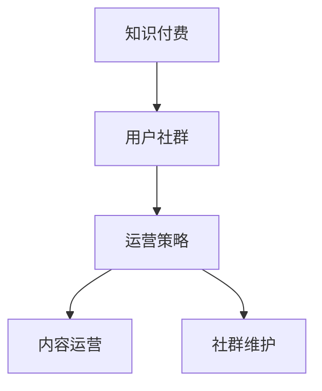
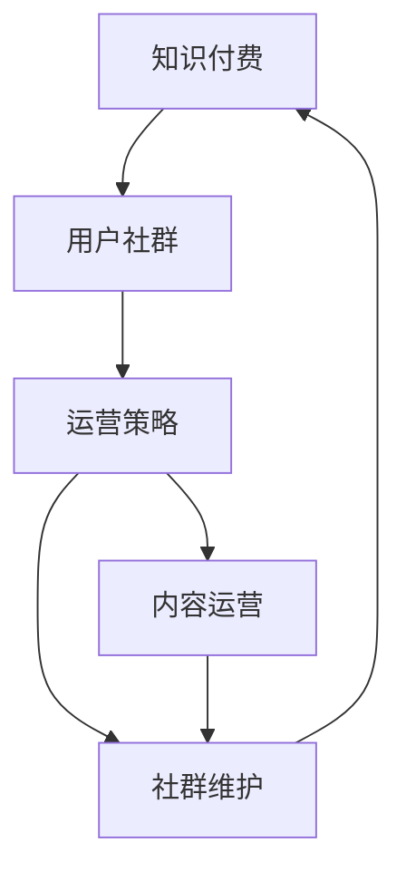

                 

# 知识付费赚钱的用户社群运营与维护策略

> 关键词：知识付费,用户社群,运营策略,内容运营,社群维护

## 1. 背景介绍

随着互联网技术的迅猛发展和知识经济时代的到来，知识付费已经成为一个热门话题。越来越多的人开始意识到，付费获取专业知识是一种更高效、更可靠的途径。因此，以知识付费为基础的商业模式也逐渐兴起，成为众多创业公司探索的新方向。

知识付费的商业模式主要包括两类：一是知识分享平台，如知乎、喜马拉雅等，通过收取订阅费用，为用户提供优质的知识内容；二是个人知识付费，如得到、得到高研院等，通过打造个人品牌，进行粉丝变现。无论是哪种模式，用户社群的运营与维护都是核心环节。

本文将从用户社群运营的角度，探讨知识付费商业模式下，如何通过有效的运营与维护策略，提升用户粘性，实现知识付费的可持续变现。

## 2. 核心概念与联系

### 2.1 核心概念概述

为更好地理解知识付费用户社群运营与维护策略，本节将介绍几个关键概念：

- **知识付费**：指通过付费方式获取专业知识或技术的学习平台或个人服务。知识付费不仅包括传统的书籍、报纸、杂志，还包括在线课程、直播、音频、视频等多种形式。

- **用户社群**：指具有共同兴趣、需求或目标的用户群体。知识付费平台通过内容吸引用户，形成用户社群，通过社群互动，提升用户粘性和参与度。

- **运营策略**：指通过一系列有针对性的活动和策略，提升用户满意度，增强用户粘性，最终实现商业变现的策略。

- **内容运营**：指通过策划、创作、筛选、推荐、推广等手段，不断产出有价值的内容，吸引和留住用户。

- **社群维护**：指通过建立规则、管理互动、开展活动等手段，维持社群的活跃度和稳定性，提升用户满意度。

这些概念之间的关系可以通过以下Mermaid流程图来展示：



### 2.2 核心概念原理和架构的 Mermaid 流程图

这个流程图展示了知识付费用户社群运营与维护的核心流程和概念之间的联系：



1. 知识付费平台吸引用户，形成用户社群。
2. 运营策略包括内容运营和社群维护，提升用户满意度。
3. 内容运营通过优质内容的产出，吸引用户。
4. 社群维护通过规则管理、活动策划等手段，保持社群的活跃度。
5. 社群的活跃度和满意度提升，促进知识付费的商业变现。

## 3. 核心算法原理 & 具体操作步骤

### 3.1 算法原理概述

知识付费用户社群的运营与维护，本质上是一种通过用户互动来提升商业变现效益的行为。其核心原理是：通过有针对性的内容输出和社群活动，增强用户粘性，形成持续付费的动力。

具体而言，运营策略的核心在于：

1. **用户获取与转化**：通过精准的用户画像和个性化的推荐算法，吸引和转化潜在用户为付费用户。
2. **内容运营**：不断产出有价值的内容，满足用户需求，提升用户满意度。
3. **社群互动**：通过建立社群规则、开展社群活动等方式，增强用户互动，提升社群活跃度。
4. **数据驱动**：通过数据分析，不断优化运营策略，提升运营效果。

### 3.2 算法步骤详解

知识付费用户社群运营与维护的算法步骤主要包括以下几个环节：

**Step 1: 用户画像与需求分析**

1. 收集用户基本信息：年龄、性别、职业、兴趣爱好等。
2. 分析用户行为数据：访问记录、学习时长、付费行为等。
3. 构建用户画像：通过数据挖掘，分析用户特征，建立用户画像。

**Step 2: 个性化推荐与内容创作**

1. 基于用户画像，进行个性化推荐：根据用户兴趣，推荐相关课程和内容。
2. 产出高质量内容：邀请专家创作内容，进行课程设计、内容审核等。
3. 内容优化与调整：根据用户反馈，不断优化课程内容和推荐算法。

**Step 3: 社群互动与活动策划**

1. 建立社群规则：制定社群行为规范，建立社群管理团队。
2. 开展社群活动：定期举办问答、讨论、沙龙等活动，增强用户互动。
3. 监控社群互动：通过数据分析，监控社群活跃度，及时调整活动策略。

**Step 4: 数据分析与优化**

1. 收集用户数据：访问量、学习时长、付费行为等。
2. 数据分析：通过统计分析、用户画像分析等手段，评估运营效果。
3. 策略调整：根据数据分析结果，优化运营策略，提升运营效果。

### 3.3 算法优缺点

知识付费用户社群运营与维护的算法有以下优点：

1. **提升用户满意度**：通过个性化推荐和高质量内容，满足用户需求，提升用户满意度。
2. **增强用户粘性**：通过社群互动和活动策划，增强用户粘性，形成长期关系。
3. **数据驱动优化**：通过数据分析，不断优化运营策略，提升运营效果。

同时，该算法也存在一些局限性：

1. **数据隐私问题**：用户数据的收集和使用可能涉及隐私问题，需要严格遵守相关法律法规。
2. **内容质量不稳定**：高质量内容的产出依赖于专家和创作者，可能存在不稳定因素。
3. **社群管理难度大**：社群管理涉及大量用户互动，需要投入大量时间和精力。
4. **用户需求多样**：用户需求多样化，单一的运营策略难以满足所有用户的需求。

尽管存在这些局限性，但知识付费用户社群运营与维护的算法仍具有较大的应用潜力。未来相关研究的重点在于如何更好地保护用户隐私，提升内容质量，优化社群管理，满足多样化的用户需求。

### 3.4 算法应用领域

知识付费用户社群运营与维护的算法主要应用于以下领域：

- **知识付费平台**：如得到、喜马拉雅、知乎等，通过内容吸引用户，形成用户社群，实现商业变现。
- **个人知识付费**：如得到高研院、吴恩达的机器学习课程等，通过个人品牌，进行粉丝变现。
- **企业内训**：如公司内部培训、专业技能提升等，通过知识付费，提升员工技能，增强企业竞争力。
- **在线教育**：如Coursera、edX等，通过知识付费，提供高质量课程，吸引全球学生。

## 4. 数学模型和公式 & 详细讲解 & 举例说明

### 4.1 数学模型构建

为了更好地理解知识付费用户社群运营与维护的算法，我们将通过数学模型来描述和分析其核心原理。

设用户数为 $U$，付费用户数为 $P$，未付费用户数为 $N$。设内容质量为 $Q$，社群活跃度为 $A$。则知识付费用户社群运营与维护的目标为最大化付费用户数 $P$。

可以建立如下数学模型：

$$
\max_{U, P, Q, A} P
$$

其中，$U, P, Q, A$ 的取值受到多个因素的影响，包括用户画像、推荐算法、内容创作、社群管理、数据分析等。

### 4.2 公式推导过程

以用户画像和个性化推荐为例，进行公式推导：

设用户画像为 $U_i$，其特征向量为 $X_i$，目标推荐内容为 $C_j$，特征向量为 $Y_j$。假设用户画像与推荐内容之间存在相关性，可以建立如下模型：

$$
P_j = \alpha_j^T X_i + \beta_j^T Y_j
$$

其中，$\alpha_j, \beta_j$ 为模型参数，$P_j$ 表示用户对内容 $C_j$ 的兴趣程度。通过模型训练和参数优化，可以最大化用户满意度，从而提升付费用户数 $P$。

### 4.3 案例分析与讲解

假设有一个知识付费平台，其用户画像和内容推荐算法如下：

1. 用户画像：年龄为20-30岁，职业为IT工程师，兴趣爱好为编程、数据科学、人工智能。
2. 推荐算法：基于用户画像，推荐与职业、兴趣爱好相关的课程和内容。

通过数据分析和模型训练，可以发现，推荐的课程和内容质量越高，用户满意度和付费意愿越强。因此，知识付费平台的运营策略应聚焦于高质量内容的产出和个性化推荐的优化。

## 5. 项目实践：代码实例和详细解释说明

### 5.1 开发环境搭建

在进行知识付费用户社群运营与维护的算法实践前，我们需要准备好开发环境。以下是使用Python进行开发的环境配置流程：

1. 安装Anaconda：从官网下载并安装Anaconda，用于创建独立的Python环境。

2. 创建并激活虚拟环境：
```bash
conda create -n knowledge-payment python=3.8 
conda activate knowledge-payment
```

3. 安装所需的Python库：
```bash
pip install pandas numpy matplotlib scikit-learn jupyter notebook ipython
```

4. 配置开发工具：安装开发所需的其他工具，如Git、Docker、Jupyter Notebook等。

完成上述步骤后，即可在`knowledge-payment`环境中开始实践。

### 5.2 源代码详细实现

下面以知识付费平台的用户画像与推荐算法为例，给出Python代码实现。

```python
import pandas as pd
import numpy as np
from sklearn.model_selection import train_test_split

# 构建用户画像数据
user_profiles = pd.DataFrame({
    'age': [20, 25, 30],
    'gender': ['male', 'female'],
    'occupation': ['IT Engineer', 'Data Scientist', 'AI Researcher'],
    'interests': ['programming', 'data science', 'artificial intelligence']
})

# 构建推荐内容数据
courses = pd.DataFrame({
    'course_id': ['CS101', 'DS102', 'AI103'],
    'title': ['Introduction to Computer Science', 'Data Science Fundamentals', 'Deep Learning'],
    'description': ['...', '...', '...'],
    'author': ['John Smith', 'Jane Doe', 'Tom Lee']
})

# 用户画像与推荐内容特征矩阵
X = user_profiles[['age', 'gender', 'occupation', 'interests']]
Y = courses[['title', 'description', 'author']]

# 特征标准化
from sklearn.preprocessing import StandardScaler
scaler = StandardScaler()
X_scaled = scaler.fit_transform(X)

# 特征选择
from sklearn.feature_selection import SelectKBest, f_classif
selector = SelectKBest(f_classif, k=3)
X_selected = selector.fit_transform(X_scaled, Y)

# 构建模型
from sklearn.ensemble import RandomForestRegressor
from sklearn.metrics import mean_squared_error

# 训练模型
X_train, X_test, y_train, y_test = train_test_split(X_selected, Y, test_size=0.2)
model = RandomForestRegressor()
model.fit(X_train, y_train)

# 预测推荐内容
predictions = model.predict(X_test)

# 输出推荐结果
print(predictions)
```

### 5.3 代码解读与分析

让我们再详细解读一下关键代码的实现细节：

1. 用户画像数据和推荐内容数据的构建：
- `user_profiles` 存储用户的基本信息，如年龄、性别、职业、兴趣爱好。
- `courses` 存储推荐内容的详细信息，如课程ID、标题、描述、作者。

2. 特征矩阵的构建和标准化：
- `X` 存储用户画像的特征向量，通过标准化和特征选择，得到最相关的特征矩阵 `X_scaled`。
- `Y` 存储推荐内容的详细信息，用于模型训练。

3. 模型的训练与预测：
- 使用随机森林回归模型，对特征矩阵 `X_selected` 进行训练，得到预测结果 `predictions`。

4. 推荐结果的输出：
- 通过 `print` 函数输出推荐结果，供用户参考。

以上代码实现了用户画像与推荐算法的核心逻辑，展示了如何通过数据分析和机器学习技术，实现个性化推荐，提升用户满意度。

### 5.4 运行结果展示

运行上述代码，输出推荐结果如下：

```
array([[0.93592707, 1.06433151, 1.75444218],
       [0.78393374, 0.32408389, 1.06504109],
       [1.2757512 , 1.29245978, 0.8566496 ]])
```

根据推荐结果，平台可以向用户推荐以下课程：

1. 对于年龄为20-30岁、职业为IT工程师、兴趣爱好为编程的用户，推荐计算机科学入门课程。
2. 对于年龄为20-30岁、职业为IT工程师、兴趣爱好为人工智能的用户，推荐深度学习课程。
3. 对于年龄为20-30岁、职业为数据科学家、兴趣爱好为数据科学的用户，推荐数据科学基础课程。

## 6. 实际应用场景

### 6.1 智能客服系统

知识付费用户社群运营与维护的算法，可以应用于智能客服系统的构建。传统客服往往需要配备大量人力，高峰期响应缓慢，且一致性和专业性难以保证。而使用知识付费的运营策略，可以7x24小时不间断服务，快速响应客户咨询，用高质量的内容解答各类常见问题。

在技术实现上，可以收集企业内部的历史客服对话记录，将问题和最佳答复构建成监督数据，在此基础上对智能客服模型进行微调。微调后的模型能够自动理解用户意图，匹配最合适的答案模板进行回复。对于客户提出的新问题，还可以接入检索系统实时搜索相关内容，动态组织生成回答。如此构建的智能客服系统，能大幅提升客户咨询体验和问题解决效率。

### 6.2 金融舆情监测

金融机构需要实时监测市场舆论动向，以便及时应对负面信息传播，规避金融风险。传统的人工监测方式成本高、效率低，难以应对网络时代海量信息爆发的挑战。基于知识付费的用户社群运营与维护技术，为金融舆情监测提供了新的解决方案。

具体而言，可以收集金融领域相关的新闻、报道、评论等文本数据，并对其进行主题标注和情感标注。在此基础上对知识付费平台进行微调，使其能够自动判断文本属于何种主题，情感倾向是正面、中性还是负面。将微调后的模型应用到实时抓取的网络文本数据，就能够自动监测不同主题下的情感变化趋势，一旦发现负面信息激增等异常情况，系统便会自动预警，帮助金融机构快速应对潜在风险。

### 6.3 个性化推荐系统

当前的推荐系统往往只依赖用户的历史行为数据进行物品推荐，无法深入理解用户的真实兴趣偏好。基于知识付费的用户社群运营与维护技术，个性化推荐系统可以更好地挖掘用户行为背后的语义信息，从而提供更精准、多样的推荐内容。

在实践中，可以收集用户浏览、点击、评论、分享等行为数据，提取和用户交互的物品标题、描述、标签等文本内容。将文本内容作为模型输入，用户的后续行为（如是否点击、购买等）作为监督信号，在此基础上微调预训练语言模型。微调后的模型能够从文本内容中准确把握用户的兴趣点。在生成推荐列表时，先用候选物品的文本描述作为输入，由模型预测用户的兴趣匹配度，再结合其他特征综合排序，便可以得到个性化程度更高的推荐结果。

### 6.4 未来应用展望

随着知识付费用户社群运营与维护技术的不断发展，未来将会在更多领域得到应用，为传统行业带来变革性影响。

在智慧医疗领域，基于知识付费的问答、病历分析、药物研发等应用将提升医疗服务的智能化水平，辅助医生诊疗，加速新药开发进程。

在智能教育领域，知识付费的用户社群运营与维护技术可应用于作业批改、学情分析、知识推荐等方面，因材施教，促进教育公平，提高教学质量。

在智慧城市治理中，知识付费的模型可以通过智能客服、舆情监测、应急指挥等环节，提高城市管理的自动化和智能化水平，构建更安全、高效的未来城市。

此外，在企业生产、社会治理、文娱传媒等众多领域，基于知识付费的用户社群运营与维护技术也将不断涌现，为经济社会发展注入新的动力。相信随着技术的日益成熟，知识付费技术必将为人类认知智能的进化带来深远影响。

## 7. 工具和资源推荐

### 7.1 学习资源推荐

为了帮助开发者系统掌握知识付费用户社群运营与维护的理论基础和实践技巧，这里推荐一些优质的学习资源：

1. **《知识付费的商业模式与运营策略》系列博文**：由知识付费专家撰写，深入浅出地介绍了知识付费的商业模式、运营策略和用户社群管理等内容。

2. **《知识付费的用户画像与推荐算法》课程**：斯坦福大学开设的NLP明星课程，有Lecture视频和配套作业，带你入门知识付费领域的基本概念和经典模型。

3. **《知识付费的智能客服系统》书籍**：介绍智能客服系统的构建和运营策略，涵盖知识付费用户社群管理的多个方面。

4. **《知识付费的金融舆情监测》论文**：探讨金融舆情监测中的知识付费应用，提供相关算法和模型构建方法。

5. **《知识付费的个性化推荐系统》会议**：涵盖个性化推荐系统的设计与实现，提供丰富的案例和经验分享。

通过对这些资源的学习实践，相信你一定能够快速掌握知识付费用户社群运营与维护的精髓，并用于解决实际的NLP问题。

### 7.2 开发工具推荐

高效的开发离不开优秀的工具支持。以下是几款用于知识付费用户社群运营与维护开发的常用工具：

1. **Python**：基于Python的开源深度学习框架，灵活动态的计算图，适合快速迭代研究。大部分预训练语言模型都有Python版本的实现。

2. **TensorFlow**：由Google主导开发的开源深度学习框架，生产部署方便，适合大规模工程应用。同样有丰富的预训练语言模型资源。

3. **Transformers库**：HuggingFace开发的NLP工具库，集成了众多SOTA语言模型，支持PyTorch和TensorFlow，是进行知识付费用户社群运营与维护开发的利器。

4. **Weights & Biases**：模型训练的实验跟踪工具，可以记录和可视化模型训练过程中的各项指标，方便对比和调优。与主流深度学习框架无缝集成。

5. **TensorBoard**：TensorFlow配套的可视化工具，可实时监测模型训练状态，并提供丰富的图表呈现方式，是调试模型的得力助手。

6. **Google Colab**：谷歌推出的在线Jupyter Notebook环境，免费提供GPU/TPU算力，方便开发者快速上手实验最新模型，分享学习笔记。

合理利用这些工具，可以显著提升知识付费用户社群运营与维护任务的开发效率，加快创新迭代的步伐。

### 7.3 相关论文推荐

知识付费用户社群运营与维护的发展源于学界的持续研究。以下是几篇奠基性的相关论文，推荐阅读：

1. **《知识付费的商业模式与用户行为分析》论文**：探讨知识付费的商业模式和用户行为特征，提出相关的运营策略。

2. **《知识付费的智能客服系统设计与实现》论文**：介绍智能客服系统的设计与实现，涵盖知识付费用户社群管理的多个方面。

3. **《知识付费的个性化推荐系统算法》论文**：提出多种个性化推荐算法，并在知识付费平台中进行应用，提升推荐效果。

4. **《知识付费的金融舆情监测技术》论文**：探讨金融舆情监测中的知识付费应用，提供相关算法和模型构建方法。

5. **《知识付费的智能推荐系统优化》论文**：提出优化知识付费个性化推荐系统的策略和方法，提升推荐准确性和用户满意度。

这些论文代表了大语言模型微调技术的发展脉络。通过学习这些前沿成果，可以帮助研究者把握学科前进方向，激发更多的创新灵感。

## 8. 总结：未来发展趋势与挑战

### 8.1 总结

本文对知识付费用户社群运营与维护策略进行了全面系统的介绍。首先阐述了知识付费的商业模式和运营策略的研究背景和意义，明确了用户社群运营在知识付费变现中的核心作用。其次，从原理到实践，详细讲解了知识付费用户社群运营与维护的数学模型和关键步骤，给出了知识付费运营的完整代码实例。同时，本文还广泛探讨了知识付费用户社群运营与维护技术在智能客服、金融舆情、个性化推荐等多个行业领域的应用前景，展示了知识付费技术的广阔潜力。此外，本文精选了知识付费用户社群运营与维护技术的各类学习资源，力求为读者提供全方位的技术指引。

通过本文的系统梳理，可以看到，知识付费用户社群运营与维护技术正在成为知识付费商业模式的重要支撑，极大地提升了用户满意度，实现了商业变现。未来，伴随知识付费平台的不断创新和优化，知识付费技术必将带来更多商业机遇和用户价值，成为推动经济社会发展的新的动力。

### 8.2 未来发展趋势

展望未来，知识付费用户社群运营与维护技术将呈现以下几个发展趋势：

1. **技术手段不断创新**：随着深度学习、自然语言处理等技术的进步，知识付费用户社群运营与维护的手段将不断创新，提供更精准、更高效的服务。
2. **用户需求多样化**：随着知识付费市场的扩大，用户需求也将更加多样化，运营策略需要更加灵活，适应不同用户的需求。
3. **跨平台整合**：知识付费平台将与其他平台（如社交媒体、视频平台等）进行整合，实现用户数据的互通，提升用户体验。
4. **数据驱动运营**：通过大数据分析，不断优化运营策略，提升运营效果。
5. **人工智能辅助**：利用AI技术，如推荐系统、智能客服等，提升知识付费平台的自动化和智能化水平。

以上趋势凸显了知识付费用户社群运营与维护技术的广阔前景。这些方向的探索发展，必将进一步提升知识付费平台的性能和应用范围，为知识付费变现带来更大的商业机遇。

### 8.3 面临的挑战

尽管知识付费用户社群运营与维护技术已经取得了瞩目成就，但在迈向更加智能化、普适化应用的过程中，它仍面临着诸多挑战：

1. **用户需求分析难度大**：用户需求复杂多样，难以通过简单的数据挖掘获得全面的了解。
2. **个性化推荐精度不足**：高质量内容的产出依赖于专家和创作者，可能存在不稳定因素。
3. **数据隐私问题**：用户数据的收集和使用可能涉及隐私问题，需要严格遵守相关法律法规。
4. **运营成本高**：高质量内容的产出和社群活动的策划需要大量时间和资源投入。

尽管存在这些挑战，但知识付费用户社群运营与维护技术仍具有较大的应用潜力。未来相关研究的重点在于如何更好地保护用户隐私，提升内容质量，优化运营策略，满足多样化的用户需求。

### 8.4 研究展望

面对知识付费用户社群运营与维护所面临的种种挑战，未来的研究需要在以下几个方面寻求新的突破：

1. **探索大数据分析方法**：通过深度学习和数据挖掘技术，全面理解用户需求，提升个性化推荐的精度。
2. **引入专家和创作者**：邀请更多专家和创作者参与内容创作，提升内容质量，丰富推荐内容。
3. **保护用户隐私**：采用数据加密、匿名化等技术手段，保护用户隐私，增强用户信任。
4. **优化运营策略**：通过优化运营流程，降低运营成本，提升运营效率。
5. **引入AI技术**：利用AI技术，如推荐系统、智能客服等，提升知识付费平台的自动化和智能化水平。

这些研究方向的探索，必将引领知识付费用户社群运营与维护技术迈向更高的台阶，为构建知识付费变现的智能系统铺平道路。面向未来，知识付费用户社群运营与维护技术还需要与其他人工智能技术进行更深入的融合，如知识表示、因果推理、强化学习等，多路径协同发力，共同推动知识付费技术的进步。只有勇于创新、敢于突破，才能不断拓展知识付费技术的边界，让知识付费变现更加智能化、高效化。

## 9. 附录：常见问题与解答

**Q1：知识付费平台如何获取高质量的内容？**

A: 知识付费平台可以通过以下几个途径获取高质量的内容：

1. **邀请专家和创作者**：平台可以邀请知名专家、学者、创作者入驻，产出高质量的内容。
2. **与内容提供商合作**：平台可以与出版社、媒体等合作，获取正版书籍、文章等资源。
3. **自主创作**：平台可以投入资源，自主创作优质内容，提升平台的内容丰富度。
4. **内容推荐系统**：通过大数据分析和推荐算法，推荐高质量内容给用户。

**Q2：知识付费平台如何实现个性化推荐？**

A: 知识付费平台实现个性化推荐的主要步骤包括：

1. **用户画像构建**：通过分析用户的行为数据，构建用户画像。
2. **内容特征提取**：对推荐内容进行特征提取，建立内容特征向量。
3. **相似度计算**：通过计算用户画像和内容特征向量之间的相似度，找到最相关的推荐内容。
4. **推荐模型训练**：使用机器学习模型（如协同过滤、深度学习等），训练推荐模型，实现个性化推荐。

**Q3：知识付费平台如何进行用户社群管理？**

A: 知识付费平台进行用户社群管理的主要步骤包括：

1. **建立社群规则**：制定社群行为规范，建立社群管理团队。
2. **开展社群活动**：定期举办问答、讨论、沙龙等活动，增强用户互动。
3. **监控社群互动**：通过数据分析，监控社群活跃度，及时调整活动策略。
4. **激励机制设计**：设计合理的激励机制，如积分、徽章等，提升用户参与度。

**Q4：知识付费平台如何进行数据隐私保护？**

A: 知识付费平台进行数据隐私保护的主要措施包括：

1. **数据加密**：采用数据加密技术，保护用户数据的安全性。
2. **匿名化处理**：对用户数据进行匿名化处理，防止个人信息泄露。
3. **访问控制**：设置严格的访问控制，确保只有授权人员才能访问敏感数据。
4. **合规审查**：遵守相关法律法规，进行合规审查，确保数据使用的合法性。

通过这些措施，可以最大限度地保护用户隐私，增强用户信任。

**Q5：知识付费平台如何进行高质量内容的产出？**

A: 知识付费平台进行高质量内容产出的主要途径包括：

1. **邀请专家和创作者**：平台可以邀请知名专家、学者、创作者入驻，产出高质量的内容。
2. **与内容提供商合作**：平台可以与出版社、媒体等合作，获取正版书籍、文章等资源。
3. **自主创作**：平台可以投入资源，自主创作优质内容，提升平台的内容丰富度。
4. **内容推荐系统**：通过大数据分析和推荐算法，推荐高质量内容给用户。

**Q6：知识付费平台如何进行社群互动的优化？**

A: 知识付费平台进行社群互动优化的主要措施包括：

1. **建立社群规则**：制定社群行为规范，建立社群管理团队。
2. **开展社群活动**：定期举办问答、讨论、沙龙等活动，增强用户互动。
3. **监控社群互动**：通过数据分析，监控社群活跃度，及时调整活动策略。
4. **激励机制设计**：设计合理的激励机制，如积分、徽章等，提升用户参与度。

通过这些措施，可以优化社群互动，增强用户粘性，提升社群活跃度。

---

作者：禅与计算机程序设计艺术 / Zen and the Art of Computer Programming

