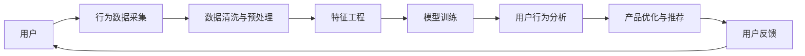

                 

## 1. 背景介绍

随着互联网和移动设备的普及，知识付费模式已成为一种重要的信息消费形式。越来越多的用户愿意为获取专业知识和信息支付费用。这种模式不仅改变了传统的信息获取方式，也激发了海量用户行为数据的产生。为了更好地理解用户行为，优化知识付费产品，提升用户体验，大数据用户行为分析模型应运而生。

### 1.1 知识经济与知识付费

知识经济是指通过信息、知识、技术的创新和应用来驱动经济增长的经济形态。在知识经济下，知识付费成为一种重要趋势。知识付费平台（如得到、知乎、Coursera等）通过出售高质量内容，满足用户深度学习、工作提升等需求，提供更有价值的知识服务。

### 1.2 大数据在知识付费中的应用

大数据技术使得平台能够收集和分析用户行为数据，包括但不限于访问记录、购买行为、学习进度、评分反馈等。这些数据不仅能够帮助平台优化内容推荐、用户画像，还能帮助内容生产者理解受众需求，提高创作质量。

### 1.3 用户行为分析的必要性

在知识付费模式中，了解用户的行为习惯和需求偏好，能够有效提升平台的服务质量。基于用户行为数据的分析，可以优化课程设计，提供个性化推荐，提升用户粘性，增强平台竞争力。

## 2. 核心概念与联系

### 2.1 核心概念概述

在进行大数据用户行为分析模型的介绍前，我们需要理解几个核心概念：

- **用户行为分析**：通过收集和分析用户的行为数据，了解用户的行为习惯、偏好和需求，从而优化产品和服务。
- **大数据分析**：对规模庞大的数据集进行高效、准确的数据处理和分析，以获取有价值的洞察。
- **知识付费**：以付费形式获取深度专业知识的经济模式。

这些概念构成了知识经济下用户行为分析的基础。

### 2.2 核心概念原理和架构的 Mermaid 流程图



该流程图展示了从用户到最终产品优化的全流程：

1. **数据采集**：从知识付费平台收集用户行为数据。
2. **数据清洗与预处理**：清洗无效数据，处理缺失值和异常值，保证数据质量。
3. **特征工程**：提取有意义的特征，构建特征集合。
4. **模型训练**：选择合适的模型进行训练，优化模型参数。
5. **用户行为分析**：使用训练好的模型进行用户行为分析。
6. **产品优化与推荐**：根据分析结果优化产品和服务，提供个性化推荐。
7. **用户反馈**：收集用户反馈，进一步优化模型和产品。

## 3. 核心算法原理 & 具体操作步骤

### 3.1 算法原理概述

用户行为分析模型的核心思想是通过对用户行为数据的分析，构建用户画像，预测用户行为，从而优化产品和服务。常用的算法包括聚类分析、分类算法、回归分析等。其中，聚类分析可用于用户分类，分类算法可用于预测用户购买行为，回归分析可用于预测课程评分等。

### 3.2 算法步骤详解

以下是一般的用户行为分析模型构建流程：

1. **数据采集**：
   - 从知识付费平台收集用户行为数据，包括用户访问、购买、学习进度、评分反馈等。

2. **数据清洗与预处理**：
   - 清洗无效数据，处理缺失值和异常值。
   - 将连续数据离散化，将文本数据转换为向量表示。

3. **特征工程**：
   - 提取有意义的特征，构建特征集合。
   - 使用PCA、LDA等降维方法，减少特征维度。

4. **模型训练**：
   - 选择合适的模型，如K-means聚类、决策树、随机森林、梯度提升树等。
   - 将特征输入模型进行训练，优化模型参数。

5. **用户行为分析**：
   - 使用训练好的模型进行用户行为分析，识别用户分类、预测用户购买行为、预测课程评分等。
   - 分析用户行为，了解用户需求和偏好。

6. **产品优化与推荐**：
   - 根据分析结果，优化产品和服务。
   - 提供个性化推荐，提升用户粘性和满意度。

7. **用户反馈**：
   - 收集用户反馈，进一步优化模型和产品。

### 3.3 算法优缺点

**优点**：
- 能够全面分析用户行为，了解用户需求和偏好。
- 可以优化产品和服务，提升用户体验。
- 能够预测用户行为，提高推荐效果。

**缺点**：
- 数据质量直接影响分析结果，数据清洗和预处理复杂。
- 特征工程需要专业知识，过程复杂。
- 模型选择和调参需要经验，有一定技术门槛。

### 3.4 算法应用领域

大数据用户行为分析模型在知识付费领域有广泛的应用，包括但不限于：

- **用户分类**：通过聚类分析，将用户分为不同的群体，以便针对性优化产品和服务。
- **购买行为预测**：通过分类算法，预测用户是否会购买某个课程，帮助平台优化推荐策略。
- **课程评分预测**：通过回归分析，预测课程的评分，帮助平台调整课程内容。
- **个性化推荐**：通过推荐算法，提供个性化推荐，提升用户满意度和粘性。

## 4. 数学模型和公式 & 详细讲解 & 举例说明

### 4.1 数学模型构建

在用户行为分析中，我们通常会构建以下数学模型：

- **聚类分析**：
  $$
  K-means = \arg\min_{C} \sum_{i=1}^n \sum_{j=1}^k \|x_i - \mu_j\|^2
  $$
  其中 $x_i$ 为样本点，$\mu_j$ 为聚类中心，$C$ 为聚类数。

- **分类算法**：
  $$
  \hat{y} = \arg\max_{c} P(y=c|x)
  $$
  其中 $y$ 为标签，$x$ 为特征，$P(y=c|x)$ 为条件概率。

- **回归分析**：
  $$
  y = \beta_0 + \sum_{i=1}^p \beta_i x_i + \epsilon
  $$
  其中 $y$ 为目标变量，$x_i$ 为自变量，$\beta$ 为系数，$\epsilon$ 为误差项。

### 4.2 公式推导过程

以聚类分析为例，解释公式的推导过程：

- **K-means算法的目标**是最小化样本点与聚类中心的距离，即：
  $$
  \min_{C} \sum_{i=1}^n \sum_{j=1}^k \|x_i - \mu_j\|^2
  $$

- **推导过程**：
  1. 初始化聚类中心 $\mu_j$，设置迭代次数 $T$。
  2. 对每个样本点 $x_i$，计算其到每个聚类中心的距离 $d_{ij} = \|x_i - \mu_j\|$。
  3. 将样本点 $x_i$ 分配到距离最近的聚类中心 $\mu_i$。
  4. 对每个聚类中心 $\mu_j$，计算其更新后的位置 $\mu_j'$。
  5. 重复步骤2-4，直到满足停止条件。

### 4.3 案例分析与讲解

以某知识付费平台的课程购买行为预测为例，说明聚类分析的实际应用：

- **数据准备**：
  - 收集用户购买课程的记录，包括课程ID、购买时间、价格等。
  - 对用户进行聚类分析，将用户分为不同的群体。

- **模型训练**：
  - 使用K-means算法，将用户分为高价值用户、中价值用户和低价值用户三类。
  - 对每类用户进行分析，了解其购买行为特征。

- **预测结果**：
  - 根据用户聚类结果和历史购买行为，预测用户是否会购买某个新课程。
  - 对于高价值用户，预测其购买概率较高；对于中价值和低价值用户，预测其购买概率较低。

## 5. 项目实践：代码实例和详细解释说明

### 5.1 开发环境搭建

在进行项目实践前，需要搭建好开发环境：

1. **Python环境**：
   - 安装Python 3.x版本。
   - 使用Anaconda或Miniconda创建虚拟环境，安装必要的依赖包。

2. **数据准备**：
   - 收集知识付费平台的用户行为数据，包括访问记录、购买行为、学习进度、评分反馈等。
   - 将数据转换为CSV格式，存储在本地或云存储中。

3. **数据处理**：
   - 使用Pandas、NumPy等库进行数据清洗和预处理。
   - 处理缺失值、异常值，将连续数据离散化，将文本数据转换为向量表示。

### 5.2 源代码详细实现

以下是一个基于Python的K-means聚类分析示例代码：

```python
import pandas as pd
from sklearn.cluster import KMeans

# 数据准备
data = pd.read_csv('user_behavior.csv')

# 数据清洗与预处理
data.fillna(0, inplace=True)
data.dropna(inplace=True)
data['price'] = pd.cut(data['price'], bins=[0, 10, 20, 30], labels=['low', 'mid', 'high'])

# 特征工程
features = data[['price', 'rating', 'duration']]
labels = data['class']

# 模型训练
kmeans = KMeans(n_clusters=3, random_state=42)
kmeans.fit(features)

# 用户行为分析
cluster_preds = kmeans.predict(features)

# 产品优化与推荐
high_value_users = data[cluster_preds == 0]  # 高价值用户
mid_value_users = data[cluster_preds == 1]   # 中价值用户
low_value_users = data[cluster_preds == 2]   # 低价值用户
```

### 5.3 代码解读与分析

在上述代码中，我们首先通过Pandas库读取用户行为数据，并进行清洗和预处理。然后使用K-means算法对用户进行聚类分析，将用户分为高价值用户、中价值用户和低价值用户三类。最后，根据用户聚类结果进行产品优化和推荐。

## 6. 实际应用场景

### 6.1 智能推荐系统

在智能推荐系统中，用户行为分析模型可以用于预测用户对新内容的兴趣，提供个性化推荐，提升用户体验。通过分析用户的行为数据，如浏览历史、购买记录、评分反馈等，可以构建用户画像，预测用户是否会对某个内容感兴趣，从而提高推荐准确性和满意度。

### 6.2 课程优化

在知识付费平台上，用户行为分析模型可以用于课程优化，帮助平台调整课程内容和定价策略。通过分析用户的购买行为和反馈，了解用户对课程的偏好，调整课程结构和内容，提升课程质量，吸引更多用户购买。

### 6.3 内容推荐

用户行为分析模型可以用于内容推荐，帮助平台推荐高质量的课程、文章、视频等内容。通过分析用户的行为数据，如阅读时长、点赞评论、分享次数等，可以构建用户画像，预测用户对不同内容的兴趣，提供个性化推荐，提升用户粘性和满意度。

### 6.4 未来应用展望

未来，随着大数据技术的不断进步，用户行为分析模型将更加智能化、精准化。结合人工智能、机器学习、深度学习等技术，模型将能够更加深入地理解用户行为，提供更为个性化的推荐和服务。

## 7. 工具和资源推荐

### 7.1 学习资源推荐

1. **《数据科学导论》**：深入浅出地介绍了数据分析的基本概念和方法，适合初学者入门。
2. **《Python数据分析实战》**：通过实际案例，讲解了Python数据分析的常用技巧和方法。
3. **Kaggle**：Kaggle是一个数据科学竞赛平台，提供大量的数据集和教程，适合学习数据分析和机器学习。

### 7.2 开发工具推荐

1. **Python**：Python是最常用的数据分析和机器学习编程语言之一，具备强大的数据分析和机器学习库。
2. **Pandas**：Pandas是一个用于数据处理和分析的Python库，提供了高效的数据清洗和预处理功能。
3. **Scikit-learn**：Scikit-learn是一个用于机器学习的Python库，提供了丰富的算法和工具。
4. **TensorFlow**：TensorFlow是一个深度学习框架，适合进行复杂的机器学习和深度学习任务。

### 7.3 相关论文推荐

1. **《用户行为分析在知识付费平台中的应用》**：介绍了用户行为分析的基本概念和在知识付费平台中的应用。
2. **《K-means聚类算法及其应用》**：详细讲解了K-means算法的原理和应用，适合初学者学习。
3. **《基于用户行为分析的智能推荐系统》**：介绍了基于用户行为分析的智能推荐系统的实现方法和应用效果。

## 8. 总结：未来发展趋势与挑战

### 8.1 研究成果总结

大数据用户行为分析模型在知识付费领域已取得了显著的成果。通过分析用户行为数据，构建用户画像，预测用户行为，优化产品和服务，提升了用户的满意度和平台的竞争力。

### 8.2 未来发展趋势

1. **智能化程度提升**：未来，随着大数据技术和人工智能技术的不断进步，用户行为分析模型将更加智能化、精准化，能够深入理解用户需求和行为。
2. **实时分析能力增强**：实时分析用户行为数据，能够及时调整产品和服务，提升用户体验。
3. **多模态数据融合**：结合文本、图片、视频等多模态数据，构建更全面、准确的用户画像。
4. **个性化推荐优化**：结合用户行为数据和兴趣偏好，提供更为精准、个性化的推荐服务。

### 8.3 面临的挑战

1. **数据隐私问题**：用户行为分析需要大量数据，如何保护用户隐私，避免数据泄露，是一个重要挑战。
2. **模型复杂度提升**：随着模型智能化程度的提升，模型复杂度也会增加，需要更高的计算资源和更长的训练时间。
3. **数据质量问题**：数据质量直接影响分析结果，如何处理缺失值、异常值，保证数据质量，是一个重要问题。

### 8.4 研究展望

1. **数据隐私保护技术**：研究如何保护用户隐私，确保数据安全和用户隐私权益。
2. **高效智能算法**：研究高效、智能的算法，提升模型精度和训练速度。
3. **实时分析技术**：研究实时分析技术，及时响应用户需求，提升用户体验。

## 9. 附录：常见问题与解答

**Q1: 如何进行用户行为分析？**

A: 用户行为分析主要分为数据采集、数据清洗与预处理、特征工程、模型训练和分析五个步骤。通过分析用户的行为数据，了解用户需求和偏好，优化产品和服务，提升用户体验。

**Q2: K-means算法有哪些优缺点？**

A: 优点：
- 算法简单，易于实现。
- 聚类效果较好，能够有效处理大规模数据。

缺点：
- 对初始聚类中心敏感，需要多次试验才能找到最优结果。
- 只能进行硬聚类，不能处理类别重叠的数据。

**Q3: 如何提升用户行为分析的准确性？**

A: 提升用户行为分析的准确性，可以从以下几个方面入手：
- 数据采集：尽可能全面、准确地收集用户行为数据。
- 数据清洗与预处理：清洗无效数据，处理缺失值和异常值，保证数据质量。
- 特征工程：提取有意义的特征，构建特征集合。
- 模型选择与调参：选择合适的模型，优化模型参数，提高模型精度。
- 实时分析：实时分析用户行为数据，及时调整产品和服务，提升用户体验。

**Q4: 用户行为分析在知识付费中的应用有哪些？**

A: 用户行为分析在知识付费中的应用主要包括以下几个方面：
- 用户分类：通过聚类分析，将用户分为不同的群体，以便针对性优化产品和服务。
- 购买行为预测：通过分类算法，预测用户是否会购买某个课程，帮助平台优化推荐策略。
- 课程评分预测：通过回归分析，预测课程的评分，帮助平台调整课程内容。
- 个性化推荐：通过推荐算法，提供个性化推荐，提升用户满意度和粘性。

---

作者：禅与计算机程序设计艺术 / Zen and the Art of Computer Programming

