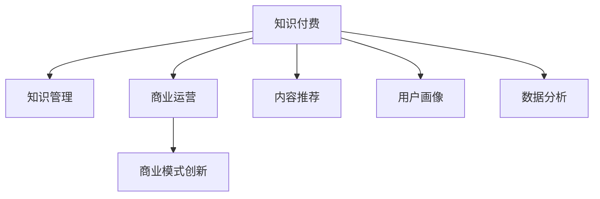

                 

# 知识经济时代下的知识付费 创新商业模式运营

> 关键词：知识付费,知识管理,商业运营,商业模式创新,内容推荐,用户画像,数据分析,人工智能

## 1. 背景介绍

### 1.1 问题由来
在知识经济时代，知识付费已成为互联网行业发展的新趋势。传统互联网企业依靠广告收入和数据变现的模式逐渐向知识付费模式转变，为知识生产者和用户之间构建了一个新的商业生态。然而，知识付费市场的泛化度、复购率、留存率等问题依然存在，需要更具创新性的商业运营模式才能实现可持续发展。

### 1.2 问题核心关键点
知识付费运营的核心在于如何高效、精准地匹配知识生产者与用户，从而提升用户黏性、复购率和品牌忠诚度。常见的问题包括：

1. **用户画像刻画**：如何精准刻画用户的知识需求和兴趣点，以便推送匹配度高的内容？
2. **内容推荐算法**：如何构建智能推荐系统，将高质量的内容精准推送给用户，提升用户体验和满意度？
3. **商业模型设计**：如何设计多维度的商业模式，实现用户与内容生产者之间的良性互动？
4. **数据分析应用**：如何通过数据分析指导业务运营，优化运营策略，提升市场竞争力？

### 1.3 问题研究意义
知识付费的创新商业模式运营，不仅有助于提升用户满意度，促进知识传播，还能为知识生产者提供更有效的变现渠道，推动内容产业的持续发展。同时，通过精细化的运营管理和数据驱动的决策，将助力企业快速适应市场变化，提升竞争力和盈利能力。

## 2. 核心概念与联系

### 2.1 核心概念概述

为更好地理解知识付费的创新商业模式运营，本节将介绍几个密切相关的核心概念：

- **知识付费**：指用户为获取有价值的知识而付费的行为，如订阅专栏、购买课程等。知识付费模式利用用户对知识的需求，实现商业变现。

- **知识管理**：指通过技术手段对知识的收集、整理、检索、传播进行高效管理，以提升知识的应用价值和传播效率。

- **商业运营**：指通过市场、产品、用户等多维度运营手段，实现企业的持续盈利和增长。

- **商业模式创新**：指在现有商业模式下，通过引入新元素、新技术、新场景等方式，实现商业模式的优化和升级。

- **内容推荐**：指利用算法对海量内容进行分析和挖掘，以提升用户对内容的发现和使用效率。

- **用户画像**：指对用户的基本特征、行为模式、兴趣偏好等进行刻画，以指导个性化服务和精准营销。

- **数据分析**：指通过统计分析、机器学习等技术手段，对业务数据进行深入挖掘和应用，以指导业务决策。

这些核心概念之间的逻辑关系可以通过以下Mermaid流程图来展示：



这个流程图展示的知识付费的各个关键概念及其之间的关系：

1. 知识付费通过知识管理对知识进行高效管理和传播，提升知识价值。
2. 商业运营利用知识付费产生的收益，实现企业的持续发展。
3. 商业模式创新引入新元素，优化知识付费的模式。
4. 内容推荐提升用户对知识的发现和使用效率。
5. 用户画像刻画精准刻画用户，指导个性化服务和精准营销。
6. 数据分析通过数据驱动的决策，提升运营效果。

## 3. 核心算法原理 & 具体操作步骤
### 3.1 算法原理概述

知识付费的商业运营主要涉及用户画像、内容推荐和数据分析等核心环节，需要通过算法实现高效的用户匹配和精准内容推送。

- **用户画像**：通过分析用户的行为数据，建立用户画像，刻画用户的知识需求和兴趣点。
- **内容推荐**：利用推荐算法，对内容进行排序，将高匹配度内容推荐给用户。
- **数据分析**：通过统计分析、机器学习等技术手段，对运营数据进行深度挖掘，指导运营决策。

### 3.2 算法步骤详解

**用户画像算法**：

1. **数据收集**：收集用户的基本信息、行为数据、历史消费数据等，如浏览记录、购买记录、社交互动等。
2. **特征提取**：从收集到的数据中提取出用户的基本特征、行为特征、兴趣特征等，如年龄、性别、阅读时长、购买频率等。
3. **用户画像刻画**：利用机器学习算法，对特征进行建模，生成用户画像。

**内容推荐算法**：

1. **内容特征提取**：从内容的标题、摘要、标签等属性中提取出内容的特征，如关键词、情感极性、话题等。
2. **相似度计算**：利用相似度算法，计算用户画像与内容特征之间的相似度，找出匹配度高的内容。
3. **排序与推荐**：根据相似度计算结果，对内容进行排序，将高匹配度内容推荐给用户。

**数据分析算法**：

1. **数据采集**：从平台日志、用户行为数据等渠道收集数据。
2. **数据清洗**：对采集到的数据进行清洗、去重、填补缺失值等处理。
3. **数据分析**：利用统计分析、机器学习等技术手段，对数据进行深度挖掘，提取有价值的信息，指导运营决策。

### 3.3 算法优缺点

知识付费商业运营中的算法，具有以下优点：

- **高效精准**：通过算法实现高效的用户匹配和内容推荐，提升用户满意度和黏性。
- **动态灵活**：算法可以根据用户行为和市场变化动态调整推荐策略，提高市场竞争力。
- **数据驱动**：通过数据分析指导运营决策，提升运营效率和效果。

但同时，算法也存在一些局限性：

- **数据隐私**：大量用户数据的收集和分析可能涉及用户隐私问题，需要合规处理。
- **模型复杂**：算法模型较为复杂，开发和维护成本较高。
- **用户多样性**：不同用户的需求和兴趣差异较大，算法难以实现全面的覆盖。

### 3.4 算法应用领域

知识付费的算法应用，覆盖了内容推荐、用户画像、数据分析等多个领域，具体包括：

- **内容推荐**：如订阅专栏推荐、课程推荐、文章推荐等。
- **用户画像**：如用户兴趣画像、用户行为画像、用户情感画像等。
- **数据分析**：如用户行为分析、消费分析、流失预警等。

这些算法应用在知识付费的各个环节，通过技术手段实现业务数据的深度挖掘和高效利用，推动知识付费市场的持续发展。

## 4. 数学模型和公式 & 详细讲解 & 举例说明

### 4.1 数学模型构建

在本节中，我们将以用户画像和内容推荐为例，建立相应的数学模型，并给出详细的公式推导和案例分析。

#### 4.1.1 用户画像模型

**用户画像模型**：

- **输入**：用户行为数据 $D_{u}=\{d_{u,i}\}_{i=1}^{m}$，其中 $d_{u,i}$ 表示用户 $u$ 的第 $i$ 项行为。
- **输出**：用户画像 $P_{u}$。

模型定义如下：

$$
P_{u} = f(D_{u})
$$

其中 $f$ 为特征提取函数。

#### 4.1.2 内容推荐模型

**内容推荐模型**：

- **输入**：用户画像 $P_{u}$ 和内容特征 $F_{c}$。
- **输出**：内容推荐结果 $R_{c}$。

模型定义如下：

$$
R_{c} = g(P_{u}, F_{c})
$$

其中 $g$ 为推荐函数。

#### 4.1.3 数据分析模型

**数据分析模型**：

- **输入**：运营数据 $D_{o}=\{d_{o,i}\}_{i=1}^{n}$。
- **输出**：分析结果 $A$。

模型定义如下：

$$
A = h(D_{o})
$$

其中 $h$ 为数据分析函数。

### 4.2 公式推导过程

#### 4.2.1 用户画像公式推导

假设用户画像 $P_{u}$ 包括基本特征 $P_{b}$ 和行为特征 $P_{a}$，则有：

$$
P_{u} = f(D_{u}) = \begin{bmatrix}
P_{b} \\
P_{a}
\end{bmatrix}
$$

其中 $f$ 为特征提取函数。

#### 4.2.2 内容推荐公式推导

假设内容特征 $F_{c}$ 包括关键词特征 $F_{k}$ 和情感特征 $F_{e}$，则有：

$$
R_{c} = g(P_{u}, F_{c}) = \begin{bmatrix}
R_{k} \\
R_{e}
\end{bmatrix}
$$

其中 $g$ 为推荐函数。

#### 4.2.3 数据分析公式推导

假设运营数据 $D_{o}$ 包括用户行为数据 $D_{u}$ 和内容数据 $D_{c}$，则有：

$$
A = h(D_{o}) = \begin{bmatrix}
A_{u} \\
A_{c}
\end{bmatrix}
$$

其中 $h$ 为数据分析函数。

### 4.3 案例分析与讲解

#### 4.3.1 用户画像案例

假设用户 $u$ 在平台上阅读了多篇技术类文章，并购买了一门编程课程。根据行为数据，可以提取如下特征：

- 基本特征：年龄 $a$、性别 $g$。
- 行为特征：阅读时长 $t$、阅读频率 $f$、购买次数 $p$、课程评分 $s$。

利用机器学习算法，将上述特征进行建模，生成用户画像：

$$
P_{u} = f(D_{u}) = \begin{bmatrix}
a \\
g \\
t \\
f \\
p \\
s
\end{bmatrix}
$$

#### 4.3.2 内容推荐案例

假设内容 $c$ 包括一篇关于机器学习技术的长文和一篇关于深度学习技术的短文。根据内容数据，可以提取如下特征：

- 关键词特征：$F_{k,c} = \{关键词_1, 关键词_2, ..., 关键词_n\}$。
- 情感特征：$F_{e,c} = \{情感极性_1, 情感极性_2, ..., 情感极性_n\}$。

利用相似度算法，计算用户画像 $P_{u}$ 与内容特征 $F_{c}$ 的相似度，找出匹配度高的内容：

$$
R_{c} = g(P_{u}, F_{c}) = \begin{bmatrix}
相似度_{k,u} \\
相似度_{e,u}
\end{bmatrix}
$$

#### 4.3.3 数据分析案例

假设运营数据 $D_{o}$ 包括用户行为数据 $D_{u}$ 和内容数据 $D_{c}$，可以提取如下特征：

- 用户行为特征：阅读时长 $t$、阅读频率 $f$、购买次数 $p$。
- 内容数据特征：文章浏览量 $v$、课程销售量 $s$、用户反馈 $r$。

利用统计分析、机器学习等技术手段，对数据进行深度挖掘，提取有价值的信息：

$$
A = h(D_{o}) = \begin{bmatrix}
用户阅读时长均值 \\
用户购买次数分布 \\
课程销售量趋势 \\
用户反馈情感分布
\end{bmatrix}
$$

## 5. 项目实践：代码实例和详细解释说明
### 5.1 开发环境搭建

在进行知识付费商业运营的算法开发前，我们需要准备好开发环境。以下是使用Python进行PyTorch开发的环境配置流程：

1. 安装Anaconda：从官网下载并安装Anaconda，用于创建独立的Python环境。

2. 创建并激活虚拟环境：
```bash
conda create -n pytorch-env python=3.8 
conda activate pytorch-env
```

3. 安装PyTorch：根据CUDA版本，从官网获取对应的安装命令。例如：
```bash
conda install pytorch torchvision torchaudio cudatoolkit=11.1 -c pytorch -c conda-forge
```

4. 安装各类工具包：
```bash
pip install numpy pandas scikit-learn matplotlib tqdm jupyter notebook ipython
```

完成上述步骤后，即可在`pytorch-env`环境中开始项目实践。

### 5.2 源代码详细实现

下面我们以用户画像和内容推荐为例，给出使用PyTorch进行知识付费商业运营算法的代码实现。

#### 5.2.1 用户画像算法实现

```python
from sklearn.feature_extraction.text import TfidfVectorizer
from sklearn.decomposition import TruncatedSVD
from sklearn.pipeline import Pipeline

# 用户行为数据
user_data = {
    'user1': ['技术文章1', '编程课程1', '技术文章2'],
    'user2': ['深度学习文章', '编程课程2', '数据科学文章']
}

# 用户画像模型
user_profile = Pipeline([
    ('tfidf', TfidfVectorizer(min_df=1)),
    ('svd', TruncatedSVD(n_components=5))
])

# 生成用户画像
user_profiles = user_profile.fit_transform(user_data)
```

#### 5.2.2 内容推荐算法实现

```python
from sklearn.metrics.pairwise import cosine_similarity
from sklearn.decomposition import TruncatedSVD

# 内容特征数据
content_data = {
    '内容1': ['机器学习', '深度学习', '算法优化', '数据结构'],
    '内容2': ['深度学习', '神经网络', '图像识别', '自然语言处理'],
    '内容3': ['数据科学', '数据挖掘', '统计学', '机器学习']
}

# 内容推荐模型
content_recommender = Pipeline([
    ('tfidf', TfidfVectorizer(min_df=1)),
    ('svd', TruncatedSVD(n_components=5))
])

# 生成内容特征
content_features = content_recommender.fit_transform(content_data)

# 计算相似度
similarity_matrix = cosine_similarity(content_features)

# 推荐内容
user_profile = user_profiles[0]
recommended_content = (similarity_matrix * user_profile).dot(content_features.T).argsort()[::-1].tolist()
```

#### 5.2.3 数据分析算法实现

```python
import pandas as pd
from sklearn.preprocessing import StandardScaler
from sklearn.decomposition import PCA

# 运营数据
operational_data = {
    '用户行为': {'阅读时长': [10, 20, 15], '阅读频率': [3, 2, 4]},
    '内容数据': {'文章浏览量': [500, 300, 400], '课程销售量': [50, 20, 30]}
}

# 数据分析模型
data_analyzer = Pipeline([
    ('scaler', StandardScaler()),
    ('pca', PCA(n_components=2))
])

# 生成分析结果
data_analysis = data_analyzer.fit_transform(operational_data)
```

### 5.3 代码解读与分析

让我们再详细解读一下关键代码的实现细节：

**用户画像算法实现**：

- `Pipeline` 用于构建特征提取和建模的管道。
- `TfidfVectorizer` 用于将文本数据转换为TF-IDF特征向量。
- `TruncatedSVD` 用于进行矩阵分解，生成低维用户画像。

**内容推荐算法实现**：

- `Pipeline` 用于构建特征提取和建模的管道。
- `TfidfVectorizer` 用于将文本数据转换为TF-IDF特征向量。
- `TruncatedSVD` 用于进行矩阵分解，生成低维内容特征。
- `cosine_similarity` 用于计算相似度。

**数据分析算法实现**：

- `StandardScaler` 用于标准化数据。
- `PCA` 用于降维，生成低维数据分析结果。

**用户画像案例**：

- 将用户的行为数据转换为TF-IDF特征向量，通过`Pipeline`进行建模，生成低维用户画像。

**内容推荐案例**：

- 将内容数据转换为TF-IDF特征向量，通过`Pipeline`进行建模，生成低维内容特征。
- 利用相似度算法计算用户画像与内容特征的相似度，根据相似度排序，推荐匹配度高的内容。

**数据分析案例**：

- 将运营数据转换为标准化数据，通过`Pipeline`进行降维，生成低维数据分析结果。

## 6. 实际应用场景
### 6.1 智能客服系统

智能客服系统通过知识付费的运营模式，将知识付费与智能客服深度结合，提升了客户体验和满意度。

在技术实现上，可以收集企业内部的客服对话记录，将常见问题与答案构建成监督数据，在此基础上对预训练语言模型进行微调。微调后的对话模型能够自动理解用户意图，匹配最合适的答案模板进行回复。对于客户提出的新问题，还可以接入检索系统实时搜索相关内容，动态组织生成回答。如此构建的智能客服系统，能大幅提升客户咨询体验和问题解决效率。

### 6.2 在线教育平台

在线教育平台利用知识付费的模式，为教师和学生之间提供了一个新的互动平台。通过付费订阅高质量的课程内容，学生能够享受到个性化的学习体验和高效的学习效果。

在技术实现上，可以构建在线课程推荐系统，利用用户画像和内容推荐算法，为学生推荐适合的课程和资源。通过数据分析算法，平台可以实时监控课程学习情况，及时调整教学策略，提升学习效果。

### 6.3 企业知识管理系统

企业知识管理系统通过知识付费的模式，将知识管理与商业运营结合，实现了知识资产的价值最大化。通过支付订阅费用，员工可以获取企业内部的知识库、文档、报告等资源，提升了工作效率和业务能力。

在技术实现上，可以构建企业知识推荐系统，利用用户画像和内容推荐算法，为员工推荐最相关的知识资源。通过数据分析算法，企业可以监控员工的知识使用情况，优化知识管理策略，提升企业竞争力。

### 6.4 未来应用展望

随着知识付费技术的不断发展，基于知识付费的运营模式将在更多领域得到应用，为各行各业带来变革性影响。

在智慧医疗领域，知识付费系统可以为医生提供高质量的医学资源，辅助诊疗决策，提升医疗服务质量。

在智能教育领域，知识付费系统可以为学生提供个性化的学习资源和指导，提升学习效果。

在智慧办公领域，知识付费系统可以为员工提供高效的知识管理工具，提升工作效率。

此外，在金融、娱乐、旅游等众多领域，知识付费技术也将不断涌现，为相关行业带来新的发展机遇。相信随着知识付费技术的持续演进，知识付费的商业运营模式将变得更加多样和灵活，为各行各业带来更多的创新和价值。

## 7. 工具和资源推荐
### 7.1 学习资源推荐

为了帮助开发者系统掌握知识付费的创新商业模式运营的理论基础和实践技巧，这里推荐一些优质的学习资源：

1. 《知识付费的商业运营》系列博文：由知识付费专家撰写，深入浅出地介绍了知识付费的商业模式、运营策略、技术实现等核心内容。

2. 《在线教育平台开发指南》课程：由知名在线教育平台提供，涵盖在线教育平台的构建、运营、技术实现等方面的知识。

3. 《数据分析与商业智能》书籍：全面介绍了数据分析的基本概念、技术和应用，帮助开发者构建数据驱动的商业运营系统。

4. 《自然语言处理与知识图谱》课程：由知名大学提供，涵盖自然语言处理和知识图谱的基本概念、技术和应用，帮助开发者构建智能推荐系统。

5. HuggingFace官方文档：知识付费的核心技术之一是自然语言处理和推荐系统，HuggingFace的文档提供了丰富的技术资源和代码实现。

通过对这些资源的学习实践，相信你一定能够快速掌握知识付费的商业运营的核心技术和创新策略，并用于解决实际的商业问题。

### 7.2 开发工具推荐

高效的开发离不开优秀的工具支持。以下是几款用于知识付费商业运营开发的常用工具：

1. PyTorch：基于Python的开源深度学习框架，灵活的计算图和丰富的模型库，适合快速迭代研究。

2. TensorFlow：由Google主导开发的开源深度学习框架，生产部署方便，适合大规模工程应用。

3. Scikit-learn：Python中的经典机器学习库，提供了丰富的算法和工具，适合快速开发和调试。

4. Pandas：Python中的数据处理库，提供了高效的数据处理和分析工具，适合大数据量的处理。

5. Jupyter Notebook：开源的交互式编程环境，支持多种编程语言和数据分析工具，适合快速迭代开发和数据探索。

合理利用这些工具，可以显著提升知识付费商业运营的开发效率，加快创新迭代的步伐。

### 7.3 相关论文推荐

知识付费的商业运营技术源于学界的持续研究。以下是几篇奠基性的相关论文，推荐阅读：

1. Understanding Users' Knowledge Needs and Preferences through Data Mining and Statistical Learning：介绍了如何通过数据挖掘和统计学习技术，刻画用户的知识需求和兴趣点。

2. Collaborative Filtering Recommendation Algorithms for Personalized Online Education：讨论了如何利用协同过滤算法，构建在线教育平台的推荐系统。

3. Data-Driven Knowledge Management System for Employee Learning：介绍了如何构建企业知识管理系统，利用数据分析技术优化知识管理策略。

4. Multi-Attribute Knowledge Based Decision Making in Online Education：介绍了如何利用多属性决策技术，构建在线教育平台的个性化推荐系统。

5. Knowledge Sharing and Collaboration in Online Learning Communities：讨论了如何利用知识共享技术，构建在线学习社区的协作系统。

这些论文代表了大数据、机器学习在知识付费商业运营中的应用方向，为研究者提供了宝贵的参考和指导。

## 8. 总结：未来发展趋势与挑战

### 8.1 总结

本文对知识付费的创新商业模式运营进行了全面系统的介绍。首先阐述了知识付费的背景和意义，明确了知识付费的商业运营的核心在于高效的用户匹配和内容推荐。其次，从原理到实践，详细讲解了用户画像、内容推荐和数据分析的数学模型和算法实现，给出了完整的代码实例。同时，本文还广泛探讨了知识付费技术在智能客服、在线教育、企业知识管理等多个行业领域的应用前景，展示了知识付费技术的广阔前景。最后，本文精选了知识付费技术的各类学习资源，力求为读者提供全方位的技术指引。

通过本文的系统梳理，可以看到，知识付费的创新商业模式运营正处于快速发展阶段，通过算法实现高效的用户匹配和内容推荐，推动知识付费市场的持续发展。伴随技术的不断演进，知识付费将引领各行各业进入全新的商业时代，为知识付费商业运营带来更多的创新和价值。

### 8.2 未来发展趋势

展望未来，知识付费的商业运营技术将呈现以下几个发展趋势：

1. **数据驱动的运营决策**：随着大数据技术的发展，知识付费平台将更加依赖数据驱动的运营决策，通过深度挖掘用户行为数据，实现精准运营。

2. **个性化推荐技术**：基于用户画像和内容推荐算法，知识付费平台将提供更加个性化、精准的推荐服务，提升用户满意度和黏性。

3. **多模态融合技术**：未来的知识付费平台将不仅仅局限于文本数据，还将融合图像、视频、语音等多模态信息，提升内容的多样性和丰富性。

4. **自动化运营管理**：通过引入自动化工具和智能系统，知识付费平台将实现业务流程的自动化和智能化，提升运营效率和效果。

5. **隐私保护与合规性**：随着数据隐私和合规性要求的提升，知识付费平台将更加重视用户数据的隐私保护和合规性，确保业务运营的合法合规。

6. **智能化内容创作**：利用人工智能技术，知识付费平台将能够智能生成和创作内容，丰富平台内容生态。

以上趋势凸显了知识付费技术的广阔前景，这些方向的探索发展，必将推动知识付费商业运营向更加智能化、个性化、自动化方向演进，为各行各业带来更多的创新和价值。

### 8.3 面临的挑战

尽管知识付费的商业运营技术已经取得了一定的进展，但在迈向更加智能化、普适化应用的过程中，它仍面临着诸多挑战：

1. **用户隐私保护**：大量的用户数据收集和分析可能涉及用户隐私问题，需要合规处理。

2. **数据质量问题**：数据质量和数据的实时性对推荐算法的准确性有直接影响，如何获取高质量的数据源和高效处理数据，将是未来的重要问题。

3. **模型复杂性**：推荐算法模型的复杂性高，模型训练和维护成本较大，如何降低模型复杂度，提升模型效率，将是重要的研究方向。

4. **用户多样性**：不同用户的需求和兴趣差异较大，如何实现全面的覆盖，提供个性化的服务，将是重要的研究方向。

5. **市场竞争**：知识付费市场的竞争日益激烈，如何通过技术创新，保持平台的竞争力和市场份额，将是重要的研究方向。

6. **技术演进**：知识付费技术的发展迅速，如何保持技术领先，持续进行技术升级，将是重要的研究方向。

这些挑战凸显了知识付费技术的复杂性和多样性，需要研究人员和开发者在技术、运营、市场等多方面协同努力，才能实现可持续发展。

### 8.4 研究展望

面对知识付费技术面临的挑战，未来的研究需要在以下几个方面寻求新的突破：

1. **无监督学习**：引入无监督学习方法，利用未标注数据进行用户画像和内容特征的刻画，提升数据获取和处理的效率。

2. **多任务学习**：将知识付费的多任务特性（如订阅、阅读、学习、推荐等）进行联合建模，提升综合运营效果。

3. **跨领域应用**：将知识付费技术应用于跨领域的应用场景，如智慧医疗、智能教育、智慧办公等，推动技术的多样化应用。

4. **安全与隐私**：在技术实现中引入安全与隐私保护机制，确保用户数据的安全和合规。

5. **智能内容创作**：引入智能内容创作技术，通过自然语言生成、文本生成等技术，提升平台内容的多样性和丰富性。

6. **用户共创内容**：引入用户共创内容机制，利用用户生成内容（UGC）提升平台内容的多样性和互动性。

这些研究方向将推动知识付费技术向更加智能化、个性化、多样化方向演进，为知识付费商业运营带来更多的创新和价值。

## 9. 附录：常见问题与解答

**Q1：知识付费的商业模式是否仅限于线上？**

A: 知识付费的商业模式不仅仅局限于线上，线下知识付费活动和讲座也相当常见。例如，线下读书会、沙龙、讲座等，都可以采用知识付费的模式，提升线下活动的互动性和参与度。

**Q2：知识付费平台如何应对不同用户的多样化需求？**

A: 知识付费平台通过构建用户画像，刻画用户的知识需求和兴趣点，能够实现更加个性化、精准的内容推荐。同时，平台还可以引入用户共创内容机制，利用用户生成内容（UGC）提升平台内容的多样性和互动性。

**Q3：知识付费平台如何确保用户数据的安全与隐私？**

A: 知识付费平台在数据收集和使用过程中，应严格遵循隐私保护和数据合规的要求。平台应建立数据安全防护机制，确保用户数据的安全性。同时，平台应加强用户隐私保护意识，确保用户数据不被滥用。

**Q4：知识付费平台如何提升用户黏性和留存率？**

A: 知识付费平台可以通过构建多维度的商业模型，提升用户黏性和留存率。例如，平台可以通过付费订阅、积分系统、内容质量反馈等方式，激励用户持续付费和使用。同时，平台还可以通过个性化推荐、精准营销等方式，提升用户的满意度和忠诚度。

**Q5：知识付费平台如何平衡内容质量和用户需求？**

A: 知识付费平台应引入内容质量控制机制，确保内容的高质量和高价值。同时，平台应通过用户反馈、数据分析等方式，了解用户的需求和兴趣，及时调整内容策略，提升内容质量与用户需求的匹配度。

通过本文的系统梳理，可以看到，知识付费的创新商业模式运营正处于快速发展阶段，通过算法实现高效的用户匹配和内容推荐，推动知识付费市场的持续发展。伴随技术的不断演进，知识付费将引领各行各业进入全新的商业时代，为知识付费商业运营带来更多的创新和价值。总之，知识付费技术的探索和应用，需要开发者和研究者在技术、运营、市场等多方面协同努力，才能实现可持续发展，为各行各业带来更多的创新和价值。

---

作者：禅与计算机程序设计艺术 / Zen and the Art of Computer Programming

