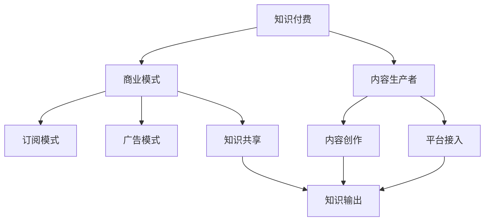

                 

# 知识经济时代下的知识付费创新商业模式设计

> 关键词：知识付费,商业模式设计,知识市场,内容生产者,订阅模式,平台经济,广告模式,知识共享,用户忠诚度

## 1. 背景介绍

### 1.1 问题由来
在知识经济时代，信息资源的爆炸性增长与个人学习能力的有限性形成了鲜明对比。知识付费作为一种新型的商业模式，应运而生，成为连接知识生产者和消费者的重要桥梁。然而，当前知识付费市场存在一些问题，如内容同质化、订阅流失率高、广告泛滥等。如何设计更加科学、可持续的知识付费商业模式，成为一个亟需探讨的话题。

### 1.2 问题核心关键点
知识付费的商业模式设计主要围绕知识内容、用户需求、收费策略、平台运营等方面展开。核心问题包括：
- 如何平衡内容质量和价格，提升用户满意度？
- 如何设计收费模式，增加用户粘性？
- 如何优化平台运营，提升广告效益？
- 如何建立知识共享机制，提高内容生产者的积极性？

### 1.3 问题研究意义
知识付费商业模式设计对于推动知识经济的健康发展、促进个人终身学习、提升社会知识水平具有重要意义。同时，通过创新的商业模式，可以优化知识市场，促进内容创作与消费的良性循环，推动平台经济向更加专业化和精细化的方向发展。

## 2. 核心概念与联系

### 2.1 核心概念概述

为更好地理解知识付费商业模式的创新设计，本节将介绍几个密切相关的核心概念：

- **知识付费(Knowledge-Pay)：** 指消费者为获取知识内容而支付费用的商业行为，是互联网与教育深度融合的产物。
- **商业模式(Model of Business)：** 指企业盈利方式的选择与组合，是企业战略和战术的集中体现。
- **内容生产者(Content Creator)：** 指创作、制作、发布知识内容的个人或机构，包括学者、专家、网红、自媒体等。
- **订阅模式(Subscription Model)：** 指用户按月或年度支付固定费用，获取连续内容访问权限的模式。
- **平台经济(Platform Economy)：** 指通过构建一个开放的第三方平台，促成生产者和消费者之间的交易行为。
- **广告模式(Ad-based Model)：** 指平台通过展示广告、推广服务等方式实现盈利，而非直接向用户收费。
- **知识共享(Knowledge Sharing)：** 指在尊重版权和保护知识产权的前提下，知识内容的共享与传播，提升知识市场效率。

这些核心概念之间的逻辑关系可以通过以下Mermaid流程图来展示：



这个流程图展示了几者之间的关联关系：

1. 知识付费商业模式是连接内容生产者和消费者的桥梁。
2. 内容生产者通过平台发布内容，用户通过订阅或广告付费获取知识。
3. 知识共享机制促进内容传播，提升知识市场效率。
4. 订阅模式和广告模式是知识付费的主要盈利手段。

## 3. 核心算法原理 & 具体操作步骤
### 3.1 算法原理概述

知识付费商业模式的核心在于设计合理的收费策略，激发内容生产者的积极性，同时满足用户的个性化需求。常见的收费模式包括订阅模式和广告模式，两者各有优缺点，需根据实际场景进行选择。

### 3.2 算法步骤详解

**Step 1: 设计订阅模式**
订阅模式是知识付费的主流方式，主要包括：

1. **月度订阅(Monthly Subscription)**：按月收取固定费用，适用于基础性、系统化的内容，如专业课程、学术论文等。
2. **年度订阅(Annual Subscription)**：按年收取固定费用，适用于高价值的深度内容，如系统教程、专题讲座等。
3. **单次购买(Single Purchase)**：购买单次课程或文章，适用于专业测试、特训营等高价值内容。

**Step 2: 优化价格模型**
价格模型的设计需要考虑多个因素，如内容质量、市场定位、用户需求等。常用的价格模型包括：

1. **基础价格模型(Base Price Model)**：根据内容复杂度和市场定位设定基础价格。
2. **动态价格模型(Dynamic Price Model)**：根据内容更新频率、市场反馈调整价格。
3. **差异化价格模型(Differentiated Price Model)**：根据用户层次和内容重要性设定不同价格。

**Step 3: 构建广告盈利模型**
广告盈利模式通过展示广告、推广服务等方式实现盈利，主要包括：

1. **横幅广告(Banner Ad)**：展示在内容页面或播放器上，点击量与展示量挂钩。
2. **贴片广告(Interspersed Ad)**：嵌入在视频内容前后，展示时长与观看时长挂钩。
3. **原生广告(Native Ad)**：在内容中插入广告，形式与内容高度融合。

**Step 4: 设计知识共享机制**
知识共享机制的目的是鼓励内容生产者共享知识，提升知识市场效率。主要方法包括：

1. **开源内容(Open Source Content)**：提供部分或全部内容免费访问权限，提升内容传播效率。
2. **社区互动(Community Engagement)**：建立知识社区，促进用户之间的交流与互动，形成知识共享网络。
3. **奖励机制(Incentive Mechanism)**：通过积分、奖励金等方式，鼓励用户参与内容共享与传播。

**Step 5: 提升用户粘性**
用户粘性的提升是知识付费商业模式设计的关键目标，主要方法包括：

1. **个性化推荐(Personalized Recommendation)**：基于用户行为和偏好，推荐相关内容，提升用户体验。
2. **社交互动(Social Interaction)**：通过社交网络、讨论区等方式，促进用户互动，增强社区感。
3. **反馈机制(Feedback Mechanism)**：收集用户反馈，不断优化内容和服务，提升用户满意度。

### 3.3 算法优缺点

订阅模式和广告模式的优缺点如下：

**订阅模式**

优点：
- 用户付费稳定，收益可预测；
- 内容生产和用户消费关系稳定；
- 用户粘性高，流失率低。

缺点：
- 初始成本高，用户获取成本大；
- 订阅到期后，用户可能流失；
- 需持续更新内容，保持用户兴趣。

**广告模式**

优点：
- 初始投入低，获客成本低；
- 广告收益不受内容更新的影响；
- 广告形式灵活多样，可覆盖广泛用户。

缺点：
- 用户付费不稳定，收益波动大；
- 用户粘性低，流失率高；
- 广告内容影响用户体验。

### 3.4 算法应用领域

知识付费商业模式主要应用于以下领域：

1. **在线教育**：如Coursera、Udacity等平台，通过订阅模式和广告模式实现盈利。
2. **在线咨询**：如智联招聘、猎聘网等，通过向用户推荐专业咨询服务实现收益。
3. **数字出版**：如电子书、有声书等，通过订阅模式和付费下载实现盈利。
4. **知识分享社区**：如知乎、简书等，通过广告模式和用户付费实现收益。
5. **医疗健康**：如在线问诊、健康管理等，通过订阅模式和广告模式实现盈利。

## 4. 数学模型和公式 & 详细讲解  
### 4.1 数学模型构建

知识付费商业模式的设计可以抽象为以下几个关键步骤：

1. **用户需求分析**：通过问卷调查、数据分析等方式，了解用户对知识内容的需求和偏好。
2. **内容价值评估**：根据内容的质量、难度、更新频率等因素，评估内容的价值。
3. **定价策略制定**：基于用户需求和内容价值，制定合理的定价策略。
4. **收益模型设计**：根据定价策略和用户行为，设计收益模型。
5. **用户体验优化**：通过个性化推荐、社区互动等手段，提升用户体验。

### 4.2 公式推导过程

以订阅模式为例，假设每月订阅用户数为 $U$，内容价值为 $V$，订阅费用为 $P$，则订阅模式的收益 $R$ 可以表示为：

$$
R = U \cdot P
$$

其中，用户订阅数量 $U$ 可以表示为：

$$
U = \alpha \cdot \text{用户需求量} - \beta \cdot \text{流失用户量}
$$

其中 $\alpha$ 为订阅转化率，$\beta$ 为流失率。

通过以上公式，可以推导出收益模型：

$$
R = (\alpha \cdot \text{用户需求量} - \beta \cdot \text{流失用户量}) \cdot P
$$

需要注意的是，实际应用中还需考虑多种因素，如广告收益、平台运营成本等。

### 4.3 案例分析与讲解

**案例分析：知乎平台的商业模式设计**

知乎平台采用订阅模式和广告模式相结合的策略。在订阅模式上，推出“会员制度”，提供高级会员订阅服务，包括内容优先阅读、专题讲座等。在广告模式上，通过“而知”广告系统，在知识内容前后展示广告，实现盈利。

知乎平台通过数据分析，了解用户需求和流失趋势，不断优化定价和转化策略，提升用户粘性和收益稳定性。同时，平台积极推广知识共享机制，如问答社区、专栏文章等，提升知识市场效率。

## 5. 项目实践：代码实例和详细解释说明
### 5.1 开发环境搭建

在进行知识付费商业模式设计实践前，我们需要准备好开发环境。以下是使用Python进行开发的常见环境配置流程：

1. 安装Anaconda：从官网下载并安装Anaconda，用于创建独立的Python环境。

2. 创建并激活虚拟环境：
```bash
conda create -n kaggle python=3.8 
conda activate kaggle
```

3. 安装PyTorch：根据CUDA版本，从官网获取对应的安装命令。例如：
```bash
conda install pytorch torchvision torchaudio cudatoolkit=11.1 -c pytorch -c conda-forge
```

4. 安装TensorFlow：
```bash
pip install tensorflow
```

5. 安装Flask：
```bash
pip install flask
```

6. 安装Pandas、Numpy等数据处理库：
```bash
pip install pandas numpy
```

7. 安装Flask-RESTful和Flask-CORS：
```bash
pip install flask-restful flask-cors
```

完成上述步骤后，即可在`kaggle`环境中开始知识付费商业模式的开发实践。

### 5.2 源代码详细实现

下面是一个简单的知识付费商业模式的Python实现示例。我们将通过Flask框架搭建一个简单的知识共享平台，并实现订阅模式和广告模式。

```python
from flask import Flask, request, jsonify
from flask_restful import Resource, Api
import pandas as pd
import numpy as np

app = Flask(__name__)
api = Api(app)

# 订阅模式示例
class Subscription(Resource):
    def get(self):
        # 获取用户需求量和流失率
        user_demand = request.args.get('demand')
        loss_rate = request.args.get('loss_rate')
        # 获取订阅费用
        subscription_price = request.args.get('price')
        # 计算订阅用户数量
        subscribers = np.float32(alpha * float(user_demand) - beta * float(loss_rate)) * float(subscription_price)
        return jsonify({'subscribers': subscribers})

# 广告模式示例
class AdModel(Resource):
    def get(self):
        # 获取广告展示量
        ad_impressions = request.args.get('impressions')
        # 获取广告点击率
        ad_click_rate = request.args.get('click_rate')
        # 计算广告收入
        ad_revenue = float(ad_impressions) * float(ad_click_rate)
        return jsonify({'ad_revenue': ad_revenue})

# 用户需求分析示例
class UserAnalysis(Resource):
    def get(self):
        # 读取用户需求数据
        user_demand_data = pd.read_csv('user_demand.csv')
        # 返回用户需求分析结果
        return jsonify(user_demand_data.to_dict(orient='records'))

# 内容价值评估示例
class ContentValue(Resource):
    def get(self):
        # 读取内容价值数据
        content_value_data = pd.read_csv('content_value.csv')
        # 返回内容价值评估结果
        return jsonify(content_value_data.to_dict(orient='records'))

# 收益模型设计示例
class RevenueModel(Resource):
    def get(self):
        # 读取订阅用户数据
        subscribers_data = pd.read_csv('subscribers.csv')
        # 读取流失用户数据
        churn_data = pd.read_csv('churn.csv')
        # 计算收益
        revenue = (alpha * float(subscribers_data['demand']) - beta * float(churn_data['churn'])) * float(subscribers_data['price'])
        return jsonify({'revenue': revenue})

if __name__ == '__main__':
    app.run(debug=True)
```

### 5.3 代码解读与分析

**订阅模式实现**
- `Subscription`类：获取用户需求量、流失率和订阅费用，计算订阅用户数量。
- `get`方法：通过HTTP GET请求，获取请求参数，计算订阅用户数量。

**广告模式实现**
- `AdModel`类：获取广告展示量和点击率，计算广告收入。
- `get`方法：通过HTTP GET请求，获取请求参数，计算广告收入。

**用户需求分析**
- `UserAnalysis`类：读取用户需求数据，返回用户需求分析结果。
- `get`方法：通过HTTP GET请求，读取并返回用户需求数据。

**内容价值评估**
- `ContentValue`类：读取内容价值数据，返回内容价值评估结果。
- `get`方法：通过HTTP GET请求，读取并返回内容价值数据。

**收益模型设计**
- `RevenueModel`类：读取订阅用户和流失用户数据，计算收益。
- `get`方法：通过HTTP GET请求，读取并返回收益数据。

## 6. 实际应用场景
### 6.1 智能教育平台

智能教育平台通过知识付费商业模式，为用户提供系统化、个性化的学习服务。平台根据用户的学习需求和行为，提供订阅服务，如VIP课程、定制化辅导等。同时，通过广告模式，平台还可以实现盈利。例如，智能教育平台可以将广告插入到视频课程中，提供与课程内容相关的商品或服务推广。

### 6.2 在线医疗咨询

在线医疗咨询平台通过知识付费模式，为患者提供专业、高效的医疗咨询服务。平台推出会员订阅服务，提供优先问诊、个性化健康建议等。广告模式方面，平台可以通过展示药品广告、健康产品广告等方式实现盈利。例如，患者在咨询过程中，平台可以推荐相关药品或健康产品。

### 6.3 企业培训平台

企业培训平台通过知识付费模式，为员工提供专业培训课程。平台提供订阅服务，如高级认证课程、专题培训等。广告模式方面，平台可以通过展示企业合作广告、培训机构广告等方式实现盈利。例如，平台可以在课程结束时，推荐相关企业培训课程或培训机构。

### 6.4 未来应用展望

未来，知识付费商业模式将进一步创新和优化，主要趋势包括：

1. **个性化服务**：通过大数据和人工智能技术，为用户提供个性化订阅服务，提升用户体验。
2. **多平台协同**：构建跨平台的知识共享网络，实现知识资源的高效互通和共享。
3. **内容多样化**：除了文字、视频、音频内容，还包括动画、直播、互动内容等，丰富用户的学习体验。
4. **社区互动**：建立知识社区，促进用户之间的交流与互动，形成知识共享网络。
5. **知识付费生态**：构建知识付费生态，连接内容生产者、平台运营商和用户，形成良性循环。

## 7. 工具和资源推荐
### 7.1 学习资源推荐

为了帮助开发者系统掌握知识付费商业模式设计的理论基础和实践技巧，这里推荐一些优质的学习资源：

1. 《知识经济时代的商业模式创新》系列博文：由商业模式专家撰写，深入浅出地介绍了知识付费商业模式的核心概念和设计要点。
2. 《商业模式设计》课程：某知名大学开设的商业管理课程，涵盖多种商业模式的设计方法，适合初学者和进阶者。
3. 《知识付费创新》书籍：系统介绍了知识付费商业模式的优势、挑战和创新路径，适合商业实战。
4. Coursera、edX等在线教育平台：提供多种商业管理、信息技术课程，帮助你深入理解知识付费商业模式。
5. 《知识付费用户行为分析》论文：详细分析了知识付费用户的行为特征和消费心理，适合产品设计者和市场营销者。

通过对这些资源的学习实践，相信你一定能够快速掌握知识付费商业模式设计的精髓，并用于解决实际的商业问题。
###  7.2 开发工具推荐

高效的开发离不开优秀的工具支持。以下是几款用于知识付费商业模式开发的常用工具：

1. Python：适用于开发知识付费平台的Python框架，如Flask、Django等。
2. Jupyter Notebook：支持代码和数据可视化，方便开发和调试。
3. GitHub：提供代码版本控制和协作功能，方便多人协同开发。
4. Google Analytics：提供网站流量统计和用户行为分析功能，帮助平台优化运营策略。
5. Kaggle：提供数据分析和机器学习竞赛平台，帮助平台进行用户需求分析和内容价值评估。

合理利用这些工具，可以显著提升知识付费商业模式的开发效率，加快创新迭代的步伐。

### 7.3 相关论文推荐

知识付费商业模式的发展源于学界的持续研究。以下是几篇奠基性的相关论文，推荐阅读：

1. 《知识付费商业模式创新研究》：分析了知识付费商业模式的优势、挑战和创新路径。
2. 《订阅模式与广告模式的选择与组合》：探讨了订阅模式和广告模式的选择策略和组合方式。
3. 《用户需求分析与优化》：详细分析了用户需求和行为特征，提出优化策略。
4. 《知识共享机制的设计与实施》：探讨了知识共享机制的设计原则和实施方法。
5. 《知识付费平台的用户粘性提升》：探讨了用户粘性的提升策略，包括个性化推荐、社区互动等。

这些论文代表了大语言模型微调技术的发展脉络。通过学习这些前沿成果，可以帮助研究者把握学科前进方向，激发更多的创新灵感。

## 8. 总结：未来发展趋势与挑战
### 8.1 总结

本文对知识付费商业模式的设计进行了全面系统的介绍。首先阐述了知识付费商业模式的研究背景和意义，明确了商业模式在推动知识经济健康发展、促进个人终身学习、提升社会知识水平方面的重要作用。其次，从原理到实践，详细讲解了订阅模式和广告模式的数学原理和操作步骤，给出了知识付费商业模式开发的完整代码实例。同时，本文还探讨了知识付费商业模式在智能教育、在线医疗、企业培训等多个行业领域的应用前景，展示了知识付费商业模式的广阔前景。最后，本文精选了知识付费商业模式的学习资源和工具，力求为读者提供全方位的技术指引。

通过本文的系统梳理，可以看到，知识付费商业模式作为一种新型的商业范式，正日益成为推动知识经济健康发展的重要力量。它不仅连接了知识生产者和消费者，还促进了知识市场的繁荣和用户的学习成长。未来，随着商业模式的不断创新和优化，知识付费将更好地服务于社会，推动人类知识的进步和社会的繁荣发展。

### 8.2 未来发展趋势

展望未来，知识付费商业模式将呈现以下几个发展趋势：

1. **智能化升级**：通过人工智能技术，提升个性化推荐、用户分析等能力，实现知识付费的智能化升级。
2. **国际化拓展**：推动知识付费平台在全球范围内拓展，提供多语言、多文化的学习服务。
3. **内容生态化**：构建知识付费生态，连接内容生产者、平台运营商和用户，形成良性循环。
4. **场景化应用**：将知识付费与日常生活、工作场景相结合，提升用户的学习效率和生活质量。
5. **社会化共享**：推动知识付费与公共教育、企业培训等领域的融合，促进知识的社会化共享。

### 8.3 面临的挑战

尽管知识付费商业模式已经取得了一定的成功，但在迈向更加智能化、普适化应用的过程中，仍面临诸多挑战：

1. **用户获取成本高**：知识付费平台的初始投入高，用户获取成本大，如何降低获客成本成为关键问题。
2. **内容同质化严重**：市场上的知识付费内容存在大量重复，如何提升内容差异化和创新性，是重要的挑战。
3. **用户粘性不足**：部分用户订阅到期后可能流失，如何提高用户粘性，提升用户忠诚度，是亟需解决的问题。
4. **平台运营困难**：平台运营需要大量资源投入，如何降低运营成本，提升平台效益，是重要的研究方向。

### 8.4 研究展望

未来，知识付费商业模式的研究需要在以下几个方面寻求新的突破：

1. **个性化服务优化**：通过大数据和人工智能技术，提升个性化推荐、用户分析等能力，实现知识付费的智能化升级。
2. **多平台协同**：构建跨平台的知识共享网络，实现知识资源的高效互通和共享。
3. **内容多样化**：除了文字、视频、音频内容，还包括动画、直播、互动内容等，丰富用户的学习体验。
4. **社区互动优化**：建立知识社区，促进用户之间的交流与互动，形成知识共享网络。
5. **知识付费生态建设**：构建知识付费生态，连接内容生产者、平台运营商和用户，形成良性循环。

这些研究方向将推动知识付费商业模式迈向更加成熟和健康的发展阶段，为知识经济的健康发展做出更大的贡献。

## 9. 附录：常见问题与解答

**Q1：知识付费商业模式是否适用于所有领域？**

A: 知识付费商业模式主要适用于知识密集型行业，如教育、医疗、培训等。对于一些低知识密度的行业，如零售、餐饮等，知识付费模式可能不太适用。

**Q2：如何设计合理的定价策略？**

A: 定价策略的设计需要考虑多个因素，如内容价值、市场定位、用户需求等。常用的定价策略包括基础价格、动态价格和差异化价格。

**Q3：订阅模式和广告模式如何选择？**

A: 订阅模式和广告模式各有优缺点，需根据实际场景进行选择。订阅模式适用于高价值、系统化的内容，广告模式适用于轻量级、多样化的内容。

**Q4：如何提升用户粘性？**

A: 用户粘性的提升是知识付费商业模式设计的关键目标，主要方法包括个性化推荐、社区互动、反馈机制等。

**Q5：知识付费平台如何实现盈利？**

A: 知识付费平台的盈利方式包括订阅模式和广告模式，需要根据实际需求和市场环境选择合适的方式。

---

作者：禅与计算机程序设计艺术 / Zen and the Art of Computer Programming

